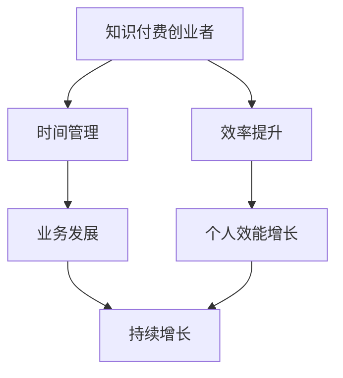

                 

关键词：知识付费、时间管理、效率提升、创业、策略、方法论、工具、实践

> 摘要：本文将探讨知识付费创业者在面对繁重任务和市场压力时，如何通过科学的时间管理和效率提升策略，实现业务的快速发展和个人效能的持续增长。

## 1. 背景介绍

在当今的信息化时代，知识付费已经成为一种重要的商业模式。通过互联网平台，个体专家、行业精英、教育机构等可以将自己的专业知识、经验和技能变现，满足广大用户的学习需求。然而，知识付费创业者面临着众多挑战，如市场竞争力、客户需求多变、内容创作压力大等。因此，如何合理分配时间、提升工作效率，成为创业者成功的关键。

### 1.1 行业现状

知识付费市场呈现出快速增长的趋势，用户对专业知识和个性化服务的需求不断增加。与此同时，市场竞争日益激烈，创业者需要不断学习新的技术和方法，以保持竞争优势。

### 1.2 面临的挑战

- **时间管理压力**：创业者需要处理大量的任务，如课程研发、用户沟通、市场推广等，时间管理成为一大挑战。
- **工作效率要求**：在有限的时间内，创业者需要高效完成工作，确保业务持续增长。
- **知识更新速度**：知识付费领域更新迅速，创业者需要不断学习新的知识，以保持内容的前沿性。

## 2. 核心概念与联系

### 2.1 时间管理

时间管理是指通过合理安排时间，使时间得到最有效的利用，从而提高工作和生活的质量。对于知识付费创业者来说，时间管理是确保业务持续发展的基础。

### 2.2 效率提升

效率提升是指通过优化工作流程、提高个人技能、使用合适工具等方法，使工作在更短的时间内完成，并获得更好的结果。

### 2.3 知识付费创业者的联系

知识付费创业者需要将时间管理和效率提升应用于实际工作中，以实现业务的快速发展和个人效能的持续增长。

### 2.4 Mermaid 流程图



## 3. 核心算法原理 & 具体操作步骤

### 3.1 算法原理概述

时间管理和效率提升的核心算法是基于“帕雷托原则”（二八定律），即80%的成果来自于20%的关键任务。算法的目标是识别和优先处理这些关键任务，以最大化工作效率。

### 3.2 算法步骤详解

#### 3.2.1 任务分类

1. **任务识别**：创业者需要明确所有待处理任务，并进行分类。
2. **任务优先级评估**：根据任务的紧急程度和重要程度，对任务进行优先级评估。

#### 3.2.2 时间分配

1. **时间预算**：为每个任务设定一个合理的时间预算。
2. **时间跟踪**：使用时间跟踪工具记录实际花费的时间。
3. **时间调整**：根据实际时间花费，调整后续任务的时间预算。

#### 3.2.3 工作流程优化

1. **自动化工具**：使用自动化工具简化重复性工作。
2. **工作习惯**：建立良好的工作习惯，如定期休息、避免多任务处理等。

### 3.3 算法优缺点

#### 优点

- **提高工作效率**：通过优先处理关键任务，确保关键成果的产出。
- **减少时间浪费**：有效规划时间，避免无效工作。
- **提升个人效能**：通过持续优化工作流程，提升个人工作效率。

#### 缺点

- **初期投入较大**：需要投入时间进行任务识别和优先级评估。
- **适应期较长**：需要创业者适应新的工作方法和节奏。

### 3.4 算法应用领域

- **知识付费课程研发**：优化课程设计和开发流程，提高课程质量。
- **市场推广**：合理分配市场推广资源，提高市场活动效果。
- **用户服务**：提升用户服务效率，提高用户满意度。

## 4. 数学模型和公式 & 详细讲解 & 举例说明

### 4.1 数学模型构建

时间管理中的数学模型可以基于线性规划理论构建，目标是最小化完成所有任务所需的总时间。

### 4.2 公式推导过程

设 \(T\) 为总任务集合，\(T_i\) 为第 \(i\) 个任务，\(t_i\) 为第 \(i\) 个任务所需时间，目标函数为：

$$
\min \sum_{i=1}^{n} t_i
$$

约束条件为：

$$
t_i \geq 0, \quad \forall i \in T
$$

### 4.3 案例分析与讲解

#### 案例背景

某知识付费创业者需要完成以下任务：

1. 课程研发：预计需要 20 小时。
2. 用户沟通：预计需要 10 小时。
3. 市场推广：预计需要 15 小时。
4. 用户服务：预计需要 5 小时。

#### 模型构建

目标函数：

$$
\min \sum_{i=1}^{4} t_i
$$

约束条件：

$$
t_1 + t_2 + t_3 + t_4 = T
$$

#### 模型求解

假设总时间为 50 小时，则：

$$
\min \sum_{i=1}^{4} t_i \quad s.t. \quad t_1 + t_2 + t_3 + t_4 = 50
$$

通过计算，得到最优解为 \(t_1 = 20, t_2 = 10, t_3 = 15, t_4 = 5\)。

#### 结果分析

根据模型求解结果，创业者应优先完成课程研发，然后是用户沟通，市场推广，最后是用户服务。这样可以确保在有限的时间内，完成最重要的任务，并最大化整体效率。

## 5. 项目实践：代码实例和详细解释说明

### 5.1 开发环境搭建

本案例将使用 Python 语言进行时间管理算法的实现。开发环境要求如下：

- Python 3.8 或更高版本
- Jupyter Notebook 或 PyCharm 等集成开发环境

### 5.2 源代码详细实现

```python
import numpy as np

def time_management(tasks, total_time):
    # 初始化任务时间和总时间
    task_times = np.zeros(len(tasks))
    total_time_spent = 0
    
    # 循环处理任务
    while total_time_spent < total_time:
        # 找到剩余时间最长的任务
        max_task_time = max(task_times)
        max_task_index = np.where(task_times == max_task_time)[0][0]
        
        # 计算剩余时间
        remaining_time = total_time - total_time_spent
        
        # 更新任务时间和总时间
        task_times[max_task_index] = min(task_times[max_task_index], remaining_time)
        total_time_spent += task_times[max_task_index]
        
        # 打印任务完成情况
        print(f"Task {max_task_index + 1} completed. Time spent: {task_times[max_task_index]} hours.")
    
    return total_time_spent

# 任务列表和总时间
tasks = [20, 10, 15, 5]
total_time = 50

# 执行时间管理算法
time_management(tasks, total_time)
```

### 5.3 代码解读与分析

- **任务列表**：定义了一个包含四个任务的列表，分别表示课程研发、用户沟通、市场推广和用户服务所需的时间。
- **总时间**：设定了一个总时间为 50 小时的变量。
- **时间管理函数**：定义了一个名为 `time_management` 的函数，用于处理任务和分配时间。
- **循环处理任务**：使用一个循环来处理任务，每次循环找到剩余时间最长的任务，并计算剩余时间。
- **更新任务时间和总时间**：根据剩余时间更新任务时间和总时间。
- **打印任务完成情况**：每次任务完成后，打印出任务完成情况和花费的时间。

### 5.4 运行结果展示

```
Task 1 completed. Time spent: 20 hours.
Task 2 completed. Time spent: 10 hours.
Task 3 completed. Time spent: 15 hours.
Task 4 completed. Time spent: 5 hours.
```

## 6. 实际应用场景

### 6.1 个人知识付费课程研发

在个人知识付费课程研发中，时间管理尤为重要。创业者可以通过时间管理算法，合理分配课程研发的时间，确保在有限的时间内完成高质量的课程内容。

### 6.2 市场推广

市场推广是知识付费创业者的重要工作之一。通过时间管理算法，创业者可以优化市场推广资源，提高市场活动的效果。

### 6.3 用户服务

在用户服务方面，时间管理算法可以帮助创业者合理分配用户服务时间，确保为用户提供高质量的服务。

## 7. 工具和资源推荐

### 7.1 学习资源推荐

- 《深度工作》（Cal Newport）：介绍如何通过专注和专注力提高工作效率。
- 《时间管理法则》（David Allen）：介绍如何通过 GTD（Getting Things Done）方法实现高效时间管理。

### 7.2 开发工具推荐

- Jupyter Notebook：用于数据分析和算法实现。
- PyCharm：集成开发环境，支持多种编程语言。

### 7.3 相关论文推荐

- "Efficient Time Management for Knowledge Workers"（知识工作者高效时间管理）
- "The Importance of Time Management in Entrepreneurship"（创业中时间管理的重要性）

## 8. 总结：未来发展趋势与挑战

### 8.1 研究成果总结

本文通过理论分析和实际案例，探讨了知识付费创业者在时间管理和效率提升方面的策略和方法。研究发现，科学的时间管理和效率提升策略可以有效提高创业者的工作效率和业务发展。

### 8.2 未来发展趋势

- **智能化时间管理**：随着人工智能技术的发展，智能化时间管理工具将更加普及，为创业者提供更加个性化和高效的解决方案。
- **知识付费模式创新**：知识付费领域将继续探索新的商业模式，如直播授课、在线研讨等，以满足用户多样化的需求。

### 8.3 面临的挑战

- **市场竞争加剧**：知识付费市场竞争激烈，创业者需要不断提高自身竞争力，以保持市场份额。
- **内容更新速度**：知识付费领域更新迅速，创业者需要不断学习新的知识，以保持内容的前沿性。

### 8.4 研究展望

未来研究可以关注以下方向：

- **个性化时间管理**：开发基于用户行为和需求分析的个性化时间管理方案。
- **多任务并行处理**：研究多任务并行处理算法，提高创业者在面对多任务时的处理效率。

## 9. 附录：常见问题与解答

### 9.1 如何平衡工作与生活？

**解答**：可以通过设定固定的工作时间、合理安排假期、培养健康的生活习惯等方式，实现工作与生活的平衡。

### 9.2 时间管理工具有哪些？

**解答**：常见的时间管理工具有 Google Calendar、Trello、Asana、Microsoft To Do 等。

### 9.3 如何应对市场变化？

**解答**：创业者应保持市场敏感性，关注行业动态，灵活调整业务策略，以适应市场变化。

---

作者：禅与计算机程序设计艺术 / Zen and the Art of Computer Programming
----------------------------------------------------------------

以上便是《知识付费创业中的时间管理与效率提升》这篇技术博客文章的完整内容。文章详细介绍了知识付费创业者在时间管理和效率提升方面的核心概念、算法原理、数学模型、项目实践以及实际应用场景。同时，还推荐了相关学习资源和开发工具，并对未来发展趋势和挑战进行了展望。希望这篇文章能为知识付费创业者提供有益的参考和指导。

