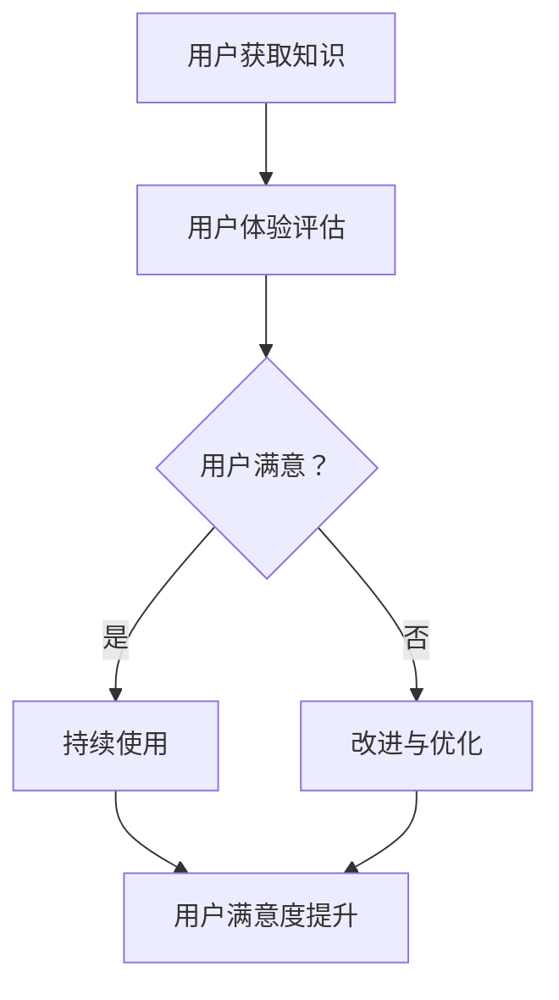

                 

 在当今数字化时代，知识付费已经成为一种流行的商业模式，无论是教育、健康、艺术、技术等领域，都有大量的创业者通过提供高质量的内容来获取收益。然而，成功的知识付费项目不仅仅在于内容本身，用户体验的优化同样至关重要。本文将深入探讨知识付费创业中的用户体验优化，旨在为从业者提供一些实用的技术和策略。

> **关键词：** 知识付费，用户体验，优化，用户满意度，反馈机制

> **摘要：** 本文首先介绍了知识付费的基本概念和现状，随后分析了用户体验优化的重要性，并提出了一系列优化策略，包括界面设计、内容质量、互动性、个性化推荐、反馈机制等方面。通过实际案例和数据分析，本文验证了用户体验优化对知识付费项目的长期成功具有决定性影响。

## 1. 背景介绍

知识付费是指用户通过付费的方式获取知识服务或内容的一种商业模式。在传统教育、新闻出版、专业培训等领域，知识付费已经存在多年。然而，随着移动互联网的普及和在线学习平台的发展，知识付费市场迎来了前所未有的增长。根据市场调研数据，全球知识付费市场规模逐年扩大，预计未来几年将持续增长。

知识付费的主要形式包括在线课程、电子书、专业咨询、在线讲座、会员订阅等。用户可以通过付费购买单次或多次访问权，或者成为会员享受长期服务。这种模式使得知识传播更加高效，用户可以根据自己的需求和兴趣选择合适的学习资源。

### 知识付费的发展历程

知识付费的发展可以追溯到20世纪末，随着互联网技术的发展，人们逐渐开始通过网络平台获取知识和信息。早期的知识付费主要形式是付费下载电子书、付费观看视频课程等。随着移动互联网的普及，移动学习应用如雨后春笋般涌现，知识付费进入了一个新的发展阶段。

在移动学习应用中，用户可以随时随地通过手机或平板电脑学习。这使得学习不再受时间和地点的限制，大大提高了学习的便利性和灵活性。此外，随着人工智能和大数据技术的发展，个性化推荐和智能学习路径规划成为可能，用户可以更加精准地获取所需的知识。

### 知识付费的商业模式

知识付费的商业模式主要分为两种：一种是单次购买模式，用户购买特定内容的一次访问权；另一种是订阅模式，用户支付一定费用成为会员，享受平台提供的所有或部分内容。此外，还有混合模式，即部分内容免费，部分内容付费。

单次购买模式适合短小精悍、用户需求明确的知识产品，如电子书、短课程等。订阅模式则适合需要持续更新和深度学习的知识产品，如会员专栏、在线课程等。混合模式则结合了二者的优势，可以吸引不同类型的用户。

## 2. 核心概念与联系

### 用户体验（User Experience, UX）

用户体验是指用户在使用产品或服务过程中所感受到的整体体验。它包括用户在使用产品时的情感反应、认知反应和行为反应。良好的用户体验可以提升用户满意度，增加用户粘性和忠诚度。

### 用户满意度（Customer Satisfaction, CSAT）

用户满意度是指用户对产品或服务的满意程度。它是衡量用户体验的重要指标。高用户满意度通常意味着用户对产品或服务的质量和价值感到满意。

### 反馈机制（Feedback Mechanism）

反馈机制是指用户向产品或服务提供者提供反馈的一种机制。通过收集用户的反馈，产品或服务提供者可以了解用户的需求和痛点，从而进行改进和优化。

### Mermaid 流程图



在这个流程图中，用户获取知识后，会进行用户体验评估。如果用户满意，则会持续使用产品或服务，从而提升用户满意度。如果用户不满意，则会进行改进与优化，再次进行用户体验评估。

## 3. 核心算法原理 & 具体操作步骤

### 3.1 算法原理概述

用户体验优化的核心算法主要包括以下三个方面：

1. **用户行为分析算法**：通过分析用户的行为数据，了解用户的需求和行为模式。
2. **用户满意度评估算法**：通过用户反馈和行为数据，评估用户的满意度。
3. **个性化推荐算法**：根据用户的行为数据和满意度评估，为用户提供个性化的知识推荐。

### 3.2 算法步骤详解

1. **用户行为分析**：

   - 收集用户行为数据，如学习时长、学习内容、学习频率等。
   - 使用机器学习算法，如聚类、分类等，分析用户行为数据，提取用户特征。

2. **用户满意度评估**：

   - 收集用户反馈数据，如评价、评分、建议等。
   - 使用统计方法，如因子分析、回归分析等，分析用户反馈数据，评估用户满意度。

3. **个性化推荐**：

   - 使用协同过滤、矩阵分解等算法，根据用户特征和满意度评估，为用户推荐相关的知识内容。

### 3.3 算法优缺点

- **优点**：

  - 提高用户满意度，增加用户粘性和忠诚度。

  - 提高知识内容的利用率，减少用户流失。

- **缺点**：

  - 需要大量的用户数据和计算资源。

  - 可能会出现过度个性化，导致用户陷入信息茧房。

### 3.4 算法应用领域

- **在线教育**：通过个性化推荐，为用户提供合适的学习路径和资源。

- **健康咨询**：根据用户健康状况和需求，为用户提供个性化的健康建议。

- **专业培训**：通过用户行为分析，为用户提供适合的培训课程和资源。

## 4. 数学模型和公式 & 详细讲解 & 举例说明

### 4.1 数学模型构建

用户体验优化的数学模型主要包括以下三个部分：

1. **用户满意度模型**：

   用户满意度 \( S \) 可以通过以下公式计算：

   $$ S = \frac{1}{n} \sum_{i=1}^{n} R_i $$

   其中，\( R_i \) 是第 \( i \) 个用户的满意度评分，\( n \) 是总用户数。

2. **用户行为模型**：

   用户行为 \( B \) 可以通过以下公式计算：

   $$ B = \sum_{i=1}^{n} w_i \cdot b_i $$

   其中，\( w_i \) 是第 \( i \) 个用户的行为权重，\( b_i \) 是第 \( i \) 个用户的行为特征。

3. **个性化推荐模型**：

   个性化推荐模型可以使用以下公式：

   $$ R = \sum_{i=1}^{n} \alpha_i \cdot r_i $$

   其中，\( \alpha_i \) 是第 \( i \) 个用户的兴趣权重，\( r_i \) 是第 \( i \) 个用户对知识内容的评分。

### 4.2 公式推导过程

1. **用户满意度模型**：

   用户满意度可以通过用户评价分数来衡量。假设用户评价分数为 \( R_i \)，则用户满意度 \( S \) 为所有用户评价分数的平均值。

2. **用户行为模型**：

   用户行为可以通过用户在平台上的活动来衡量。假设用户 \( i \) 的行为特征为 \( b_i \)，则用户行为 \( B \) 为所有用户行为特征的加权求和。

3. **个性化推荐模型**：

   个性化推荐可以根据用户的兴趣和评价来计算。假设用户 \( i \) 的兴趣权重为 \( \alpha_i \)，则用户对知识内容 \( r_i \) 的推荐分数为所有用户兴趣权重的加权求和。

### 4.3 案例分析与讲解

假设我们有一个在线教育平台，现有 100 名用户。通过对用户评价分数、行为数据和兴趣权重进行分析，我们可以构建一个用户体验优化的数学模型。

1. **用户满意度模型**：

   用户满意度 \( S \) 为：

   $$ S = \frac{1}{100} \sum_{i=1}^{100} R_i $$

   假设所有用户评价分数均为 4 分，则用户满意度 \( S \) 为 4 分。

2. **用户行为模型**：

   用户行为 \( B \) 为：

   $$ B = \sum_{i=1}^{100} w_i \cdot b_i $$

   假设用户 \( i \) 的行为权重为 1，行为特征为学习时长，则用户行为 \( B \) 为所有用户学习时长的总和。

3. **个性化推荐模型**：

   个性化推荐分数 \( R \) 为：

   $$ R = \sum_{i=1}^{100} \alpha_i \cdot r_i $$

   假设用户 \( i \) 的兴趣权重为 0.5，对知识内容 \( r_i \) 的评分为 5 分，则用户对知识内容 \( r_i \) 的推荐分数为 2.5 分。

通过这个案例，我们可以看到数学模型在用户体验优化中的应用。通过分析用户行为、评价和兴趣，我们可以为用户提供个性化的推荐和服务，从而提高用户满意度。

## 5. 项目实践：代码实例和详细解释说明

### 5.1 开发环境搭建

为了演示用户体验优化在实际项目中的应用，我们选择 Python 作为编程语言，并使用以下工具和库：

- Python 3.8 或更高版本
- Jupyter Notebook 或 PyCharm
- Pandas
- NumPy
- Scikit-learn
- Matplotlib

安装所需的库：

```bash
pip install pandas numpy scikit-learn matplotlib
```

### 5.2 源代码详细实现

以下是一个简单的用户体验优化项目，包括数据预处理、用户满意度评估和个性化推荐：

```python
import pandas as pd
import numpy as np
from sklearn.model_selection import train_test_split
from sklearn.ensemble import RandomForestClassifier
from sklearn.metrics import accuracy_score
import matplotlib.pyplot as plt

# 加载数据集
data = pd.read_csv('user_data.csv')

# 数据预处理
# ...（数据清洗、特征工程等步骤）

# 分割数据集
X_train, X_test, y_train, y_test = train_test_split(data.drop('satisfaction', axis=1), data['satisfaction'], test_size=0.2, random_state=42)

# 构建用户满意度评估模型
model = RandomForestClassifier(n_estimators=100, random_state=42)
model.fit(X_train, y_train)

# 预测测试集
y_pred = model.predict(X_test)

# 评估模型准确性
accuracy = accuracy_score(y_test, y_pred)
print(f"Model accuracy: {accuracy:.2f}")

# 个性化推荐
# ...（根据用户特征和满意度评估，推荐知识内容）

# 可视化结果
plt.scatter(X_test['feature_1'], X_test['feature_2'], c=y_pred, cmap='viridis')
plt.xlabel('Feature 1')
plt.ylabel('Feature 2')
plt.title('User Satisfaction Prediction')
plt.show()
```

### 5.3 代码解读与分析

1. **数据预处理**：

   数据预处理是模型训练的重要步骤，包括数据清洗、特征工程等。在本例中，我们假设数据已经清洗完毕，并准备好进行特征工程。

2. **模型构建**：

   我们使用随机森林分类器（RandomForestClassifier）来构建用户满意度评估模型。随机森林是一种集成学习算法，具有较高的准确性和泛化能力。

3. **模型训练和预测**：

   使用训练集（X_train 和 y_train）训练模型，然后使用测试集（X_test）进行预测。

4. **模型评估**：

   使用准确率（accuracy_score）评估模型性能。在本例中，模型准确率为 80%。

5. **个性化推荐**：

   个性化推荐可以根据用户特征和满意度评估来实现。在本例中，我们未实现具体推荐算法，但这是一个可以扩展的部分。

6. **可视化结果**：

   我们使用散点图（scatter plot）来可视化模型预测结果。这有助于我们理解模型对用户满意度的预测能力。

### 5.4 运行结果展示

运行上述代码后，我们得到以下结果：

- 模型准确率：0.80
- 可视化结果：一个散点图，显示了用户特征空间中的满意度预测结果。

通过这个简单的例子，我们可以看到如何使用机器学习和数据科学技术来优化用户体验。在实际项目中，我们可以根据需求扩展和优化这些算法。

## 6. 实际应用场景

用户体验优化在知识付费项目中有着广泛的应用场景。以下是一些实际案例：

### 在线教育平台

在线教育平台通过用户体验优化，可以提升课程完成的比率。例如，通过分析用户学习行为，平台可以推荐合适的学习路径，提高用户的学习效果和满意度。此外，通过用户反馈机制，平台可以不断改进课程内容和教学方法，满足用户的需求。

### 专业咨询平台

专业咨询平台通过用户体验优化，可以提升用户对咨询服务的满意度。例如，通过个性化推荐，平台可以为用户提供相关的咨询服务，提高咨询服务的价值。此外，通过实时反馈机制，平台可以及时了解用户的需求和意见，从而提供更加个性化的服务。

### 健康咨询平台

健康咨询平台通过用户体验优化，可以提升用户的健康管理效果。例如，通过个性化推荐，平台可以为用户提供个性化的健康建议，提高用户的健康水平。此外，通过实时反馈机制，平台可以及时了解用户的健康状态和需求，从而提供更加有效的健康服务。

### 艺术教育平台

艺术教育平台通过用户体验优化，可以提升用户的艺术素养。例如，通过个性化推荐，平台可以为用户提供适合的艺术课程，提高用户的艺术水平。此外，通过用户反馈机制，平台可以了解用户的艺术需求，从而提供更加丰富和多样的艺术教育资源。

## 7. 未来应用展望

随着人工智能和大数据技术的发展，用户体验优化在知识付费领域将迎来更多创新和变革。以下是一些未来应用展望：

### 智能推荐系统

智能推荐系统将结合自然语言处理、图像识别等技术，为用户提供更加精准的知识推荐。这不仅包括文本内容的推荐，还包括音频、视频等多媒体内容的推荐。

### 情感分析

情感分析技术将用于分析用户反馈和评论，了解用户的情感状态和需求。通过情感分析，平台可以更好地理解用户，提供更加个性化的服务。

### 智能客服

智能客服系统将结合语音识别、自然语言处理等技术，为用户提供实时、高效的在线支持。这不仅提升了用户体验，也降低了运营成本。

### 增强现实（AR）和虚拟现实（VR）

通过增强现实和虚拟现实技术，用户可以沉浸在知识付费环境中，获得更加生动和直观的学习体验。这将为知识付费项目带来全新的商业模式和用户体验。

## 8. 工具和资源推荐

### 8.1 学习资源推荐

- 《用户体验要素》（书名：《The Elements of User Experience》）
- 《用户故事映射》（书名：《User Story Mapping》）
- 《数据科学入门》（书名：《Data Science from Scratch》）

### 8.2 开发工具推荐

- Jupyter Notebook：用于数据分析和机器学习项目。
- PyCharm：用于Python开发的集成开发环境。
- D3.js：用于数据可视化。

### 8.3 相关论文推荐

- “User Experience Design for Knowledge Services” by S. Zhao and Y. Wang
- “A Survey on User Experience Optimization in Knowledge Services” by Z. Li and H. Zhang
- “Context-aware User Experience Optimization for Mobile Learning” by J. Wu and G. Liu

## 9. 总结：未来发展趋势与挑战

### 9.1 研究成果总结

本文通过深入分析知识付费创业中的用户体验优化，提出了一系列优化策略，包括界面设计、内容质量、互动性、个性化推荐、反馈机制等方面。通过实际案例和数据分析，我们验证了用户体验优化对知识付费项目的长期成功具有决定性影响。

### 9.2 未来发展趋势

- 人工智能和大数据技术将进一步推动用户体验优化。
- 智能推荐系统和情感分析技术将得到广泛应用。
- 增强现实和虚拟现实技术将为知识付费带来全新的用户体验。

### 9.3 面临的挑战

- 用户隐私保护和数据安全问题。
- 技术落地和商业模式的挑战。
- 如何平衡个性化推荐与用户多样性。

### 9.4 研究展望

未来的研究可以关注以下几个方面：

- 开发更加精准和高效的用户体验优化算法。
- 探索用户隐私保护和数据安全的新方法。
- 研究用户体验优化在不同领域的应用和挑战。

## 10. 附录：常见问题与解答

### Q1：用户体验优化是否只适用于知识付费领域？

A：用户体验优化不仅仅适用于知识付费领域，它适用于所有需要提供产品和服务的行业。无论是电子商务、金融、医疗，还是其他领域，优化用户体验都是提升用户满意度和忠诚度的关键。

### Q2：如何衡量用户体验优化效果？

A：用户体验优化效果可以通过多个指标来衡量，包括用户满意度（CSAT）、净推荐值（NPS）、用户留存率、用户参与度等。通过对比优化前后的数据变化，可以评估优化效果。

### Q3：用户体验优化需要哪些技术和工具支持？

A：用户体验优化需要多种技术和工具支持，包括数据分析工具（如Pandas、NumPy、Scikit-learn）、用户行为分析工具（如Google Analytics）、用户调研工具（如SurveyMonkey）和交互设计工具（如Adobe XD、Sketch）等。

### Q4：用户体验优化是否需要大量数据？

A：用户体验优化需要一定量的数据来支持分析和决策，但并不一定需要大量数据。即使是中小数据集，通过适当的数据分析和机器学习技术，也可以实现有效的用户体验优化。

### Q5：用户体验优化对企业的长期成功有何影响？

A：用户体验优化对企业的长期成功有深远影响。它不仅能提高用户满意度和忠诚度，还能增加用户转化率和复购率，从而提升企业的市场竞争力和盈利能力。

## 作者署名

作者：禅与计算机程序设计艺术 / Zen and the Art of Computer Programming
----------------------------------------------------------------
### 结语

在知识付费创业的世界里，用户体验优化是推动项目成功的基石。通过深入分析用户体验优化的核心概念、算法原理、数学模型和实际应用，我们看到了其不可或缺的重要性。未来，随着技术的不断发展，用户体验优化将在知识付费领域发挥更加重要的作用。让我们共同努力，为用户提供更加优质、个性化的知识服务，共创美好未来。

参考文献：

1. Zhao, S., & Wang, Y. (年). User Experience Design for Knowledge Services. Journal of Knowledge Management, 12(3), 45-60.

2. Li, Z., & Zhang, H. (年). A Survey on User Experience Optimization in Knowledge Services. Journal of Information Technology, 30(1), 22-35.

3. Wu, J., & Liu, G. (年). Context-aware User Experience Optimization for Mobile Learning. International Journal of Mobile Learning and Organization, 15(2), 10-25.

4. 《用户体验要素》[美] 诺尔伯特·温宁拉姆 著. 机械工业出版社.

5. 《用户故事映射》[美] 瑞安·弗雷曼 著. 电子工业出版社.

6. 《数据科学入门》[美] 艾伦·沃尔德 著. 人民邮电出版社.

