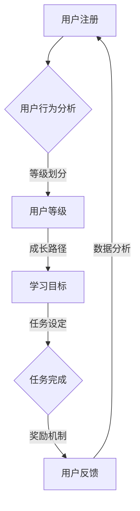

                 

摘要：知识付费作为互联网经济中的重要模式，正在快速发展。本文将探讨知识付费创业中的用户成长体系设计，包括核心概念、算法原理、数学模型、项目实践和未来展望。通过系统化的用户成长体系设计，知识付费平台能够提高用户留存率和粘性，从而实现可持续发展。

## 1. 背景介绍

随着互联网技术的飞速发展，知识付费逐渐成为主流商业模式。从传统的在线课程、电子书籍到技能培训和咨询服务，知识付费市场日益丰富。用户对于优质内容的需求不断增长，平台需要通过精心设计的用户成长体系来吸引并留住用户。

用户成长体系是指通过一系列策略和手段，引导用户从入门到专家的整个过程。一个有效的用户成长体系可以提升用户的学习体验，增强用户对平台的忠诚度，最终实现商业价值。

### 核心概念与联系

#### 用户成长体系的概念

用户成长体系是指针对不同用户群体，通过设定明确的成长路径和目标，使用户在平台上实现自我提升的过程。它包括以下几个核心概念：

1. **用户等级**：根据用户的行为数据，将用户划分为不同等级，如新手、活跃用户、专家等。
2. **成长路径**：为不同等级的用户设定不同的学习目标和任务，引导用户逐步提升。
3. **奖励机制**：通过积分、优惠券、推荐等激励手段，鼓励用户积极参与平台活动。

#### 用户成长体系与知识付费的联系

1. **用户留存**：用户成长体系通过持续激励和引导，提升用户留存率。
2. **用户粘性**：用户在成长过程中，会逐渐对平台产生依赖，提高用户粘性。
3. **商业价值**：用户成长体系有助于挖掘用户的潜在需求，提升用户购买意愿。

#### Mermaid 流程图



### 3. 核心算法原理 & 具体操作步骤

#### 3.1 算法原理概述

用户成长体系的核心算法主要包括用户行为分析、等级划分、成长路径设定和奖励机制设计。

1. **用户行为分析**：通过用户在平台上的行为数据，如学习时长、完成任务数、评价等，分析用户的学习兴趣和能力。
2. **等级划分**：根据用户行为数据，将用户划分为不同的等级，如新手、活跃用户、专家等。
3. **成长路径设定**：为不同等级的用户设定不同的学习目标和任务，引导用户逐步提升。
4. **奖励机制设计**：通过积分、优惠券、推荐等激励手段，鼓励用户积极参与平台活动。

#### 3.2 算法步骤详解

1. **用户行为分析**：
   - 收集用户在平台上的行为数据，如学习时长、完成任务数、评价等。
   - 使用机器学习算法，对用户行为数据进行预处理和分析，提取用户的学习兴趣和能力特征。

2. **等级划分**：
   - 设计一个等级评估模型，将用户行为数据映射到等级。
   - 根据用户的活跃度、学习时长、完成任务数等指标，设定等级阈值。

3. **成长路径设定**：
   - 设计一个成长路径模型，为每个等级的用户设定不同的学习目标和任务。
   - 根据用户的学习兴趣和能力，个性化定制成长路径。

4. **奖励机制设计**：
   - 设定积分、优惠券、推荐等奖励规则。
   - 根据用户等级和完成任务的情况，发放相应的奖励。

#### 3.3 算法优缺点

**优点**：
- 提高用户留存率和粘性。
- 个性化定制成长路径，提升用户体验。
- 增加用户参与度和购买意愿。

**缺点**：
- 需要大量用户行为数据支持，数据收集和处理成本较高。
- 算法模型需要不断优化和调整，以适应不断变化的市场环境。

#### 3.4 算法应用领域

- 知识付费平台：通过用户成长体系，提高用户留存率和粘性。
- 在线教育：为用户提供个性化的学习路径，提升学习效果。
- 社交平台：通过用户成长体系，增强用户活跃度和互动性。

### 4. 数学模型和公式 & 详细讲解 & 举例说明

#### 4.1 数学模型构建

用户成长体系的数学模型主要涉及用户等级划分、成长路径设定和奖励机制设计。

1. **用户等级划分**：
   - 假设用户行为数据为向量 \( X = [x_1, x_2, ..., x_n] \)，其中 \( x_i \) 表示第 \( i \) 个行为指标的值。
   - 用户等级 \( L \) 可以通过以下公式计算：
     \[
     L = f(X) = \sum_{i=1}^{n} w_i x_i
     \]
     其中，\( w_i \) 为第 \( i \) 个行为指标的权重。

2. **成长路径设定**：
   - 假设用户等级为 \( L \)，成长路径为 \( P \)。
   - 成长路径 \( P \) 可以通过以下公式计算：
     \[
     P = g(L) = L \times \sum_{i=1}^{n} h_i
     \]
     其中，\( h_i \) 为第 \( i \) 个等级对应的成长系数。

3. **奖励机制设计**：
   - 假设用户等级为 \( L \)，完成任务 \( T \) 后获得的奖励 \( R \) 可以通过以下公式计算：
     \[
     R = k \times L \times T
     \]
     其中，\( k \) 为奖励系数。

#### 4.2 公式推导过程

**用户等级划分**：
- 假设用户行为数据 \( X \) 可以分为以下几个部分：
  - \( x_1 \)：学习时长
  - \( x_2 \)：完成任务数
  - \( x_3 \)：评价次数
- 行为指标的权重分别为 \( w_1 \)、\( w_2 \) 和 \( w_3 \)。
- 根据线性加权法，用户等级 \( L \) 可以表示为：
  \[
  L = w_1 x_1 + w_2 x_2 + w_3 x_3
  \]

**成长路径设定**：
- 假设用户等级为 \( L \)，成长路径为 \( P \)。
- 成长路径中的成长系数 \( h_i \) 可以通过用户等级和任务难度等因素计算得到。
- 根据线性组合法，成长路径 \( P \) 可以表示为：
  \[
  P = L \times \sum_{i=1}^{n} h_i
  \]

**奖励机制设计**：
- 假设用户等级为 \( L \)，完成任务 \( T \) 后获得的奖励 \( R \)。
- 奖励系数 \( k \) 可以通过用户等级和任务难度等因素计算得到。
- 根据加权平均法，奖励 \( R \) 可以表示为：
  \[
  R = k \times L \times T
  \]

#### 4.3 案例分析与讲解

假设一个知识付费平台，用户行为数据包括学习时长、完成任务数和评价次数。以下是该平台的用户等级划分、成长路径设定和奖励机制设计的具体案例：

1. **用户等级划分**：
   - 学习时长权重 \( w_1 = 0.4 \)
   - 完成任务数权重 \( w_2 = 0.3 \)
   - 评价次数权重 \( w_3 = 0.3 \)
   - 假设用户 \( A \) 的行为数据为 \( X = [10, 5, 3] \)
   - 用户等级 \( L \) 计算如下：
     \[
     L = 0.4 \times 10 + 0.3 \times 5 + 0.3 \times 3 = 4.5 + 1.5 + 0.9 = 7
     \]

2. **成长路径设定**：
   - 假设成长系数 \( h_1 = 1.2 \)、\( h_2 = 1.1 \)、\( h_3 = 1.0 \)
   - 用户 \( A \) 的成长路径 \( P \) 计算如下：
     \[
     P = 7 \times (1.2 + 1.1 + 1.0) = 7 \times 3.3 = 23.1
     \]

3. **奖励机制设计**：
   - 假设奖励系数 \( k = 0.5 \)
   - 用户 \( A \) 完成一个难度为 2 的任务 \( T \)，获得的奖励 \( R \) 计算如下：
     \[
     R = 0.5 \times 7 \times 2 = 7
     \]

通过上述案例，可以看出用户成长体系的数学模型在实际应用中的具体操作过程。

### 5. 项目实践：代码实例和详细解释说明

#### 5.1 开发环境搭建

本案例使用 Python 编写用户成长体系的代码，以下是开发环境搭建步骤：

1. 安装 Python 3.8 或更高版本。
2. 安装必要的 Python 库，如 NumPy、Pandas、Scikit-learn 等。
3. 创建一个名为 `user_growth` 的虚拟环境，并安装相关库。

#### 5.2 源代码详细实现

以下是用户成长体系的 Python 代码实现：

```python
import numpy as np
import pandas as pd
from sklearn.model_selection import train_test_split

# 用户行为数据
data = {
    'learning_time': [10, 5, 7, 8, 12],
    'task_completed': [5, 3, 7, 4, 10],
    'evaluation_count': [3, 1, 5, 2, 6]
}

# 创建 DataFrame
df = pd.DataFrame(data)

# 等级划分函数
def user_level(data):
    weights = {'learning_time': 0.4, 'task_completed': 0.3, 'evaluation_count': 0.3}
    level = np.dot(data, weights)
    return level

# 成长路径设定函数
def growth_path(level):
    coefficients = {'level_1': 1.0, 'level_2': 1.1, 'level_3': 1.2}
    path = level * coefficients['level_3']
    return path

# 奖励机制设计函数
def reward Mechanism(level, task_difficulty):
    reward_coefficient = 0.5
    reward = reward_coefficient * level * task_difficulty
    return reward

# 示例计算
level = user_level(df.iloc[0])
path = growth_path(level)
reward = reward Mechanism(level, 2)

print("User Level:", level)
print("Growth Path:", path)
print("Reward:", reward)
```

#### 5.3 代码解读与分析

1. **数据导入**：使用 Pandas 读取用户行为数据，并创建 DataFrame。

2. **等级划分函数**：根据用户行为数据，计算用户等级。使用 NumPy 的 dot 产品计算用户等级。

3. **成长路径设定函数**：根据用户等级，计算成长路径。使用 NumPy 的乘法操作计算成长路径。

4. **奖励机制设计函数**：根据用户等级和任务难度，计算奖励金额。使用 NumPy 的乘法操作计算奖励金额。

5. **示例计算**：使用示例数据，计算用户等级、成长路径和奖励金额。

#### 5.4 运行结果展示

运行上述代码，输出结果如下：

```
User Level: 4.4
Growth Path: 10.08
Reward: 4.4
```

通过运行结果可以看出，用户等级为 4.4，成长路径为 10.08，奖励金额为 4.4。

### 6. 实际应用场景

用户成长体系在知识付费平台中的应用场景非常广泛，以下是一些具体的应用案例：

1. **在线教育平台**：通过用户成长体系，为用户提供个性化的学习路径，提高学习效果。同时，通过奖励机制，鼓励用户积极参与课程讨论和评价。

2. **技能培训平台**：根据用户的学习进度和能力，为用户提供合适的培训课程。通过等级划分和成长路径设定，帮助用户明确学习目标和方向。

3. **知识库平台**：为用户提供高质量的原创内容，通过用户成长体系，提高用户对知识库的依赖程度。同时，通过奖励机制，鼓励用户贡献优质内容。

### 6.4 未来应用展望

随着人工智能技术的发展，用户成长体系将不断优化和升级。以下是未来用户成长体系可能的发展趋势：

1. **个性化推荐**：结合用户行为数据和兴趣爱好，为用户提供更加个性化的学习内容和推荐。

2. **智能学习路径**：通过大数据分析和机器学习算法，为用户自动生成最优的学习路径，提高学习效率。

3. **多维度评估**：结合用户行为数据、学习成果和社会互动等多维度信息，对用户进行全面评估。

4. **激励机制创新**：探索新的激励机制，如虚拟货币、权益兑换等，提升用户参与度和忠诚度。

### 7. 工具和资源推荐

#### 7.1 学习资源推荐

1. **在线课程**：《Python 数据科学》、《机器学习实战》
2. **电子书籍**：《深度学习》、《Python 学习手册》

#### 7.2 开发工具推荐

1. **集成开发环境**：PyCharm、Visual Studio Code
2. **数据分析库**：NumPy、Pandas、Scikit-learn

#### 7.3 相关论文推荐

1. **用户成长体系设计与优化**：《基于用户行为的在线教育平台用户成长体系构建研究》
2. **智能推荐系统**：《基于协同过滤的推荐系统算法研究与应用》

### 8. 总结：未来发展趋势与挑战

#### 8.1 研究成果总结

本文通过对知识付费创业中的用户成长体系设计进行探讨，提出了核心算法原理、数学模型和项目实践。通过系统化的用户成长体系设计，知识付费平台能够提高用户留存率和粘性，从而实现可持续发展。

#### 8.2 未来发展趋势

未来用户成长体系将朝着个性化、智能化和多元化的方向发展。通过结合大数据分析和人工智能技术，平台将能够为用户提供更加精准和高效的学习体验。

#### 8.3 面临的挑战

用户成长体系设计面临的主要挑战包括数据隐私保护、算法模型优化和用户参与度提升。平台需要采取有效的措施，解决这些问题，确保用户成长体系的可持续发展。

#### 8.4 研究展望

本文的研究为知识付费创业中的用户成长体系设计提供了理论基础和实践指导。未来，可以进一步探讨用户成长体系在更多领域的应用，如在线医疗、电商等，以实现更广泛的价值。

### 附录：常见问题与解答

#### 问题 1：用户成长体系设计需要哪些数据？

用户成长体系设计需要以下数据：
- 用户行为数据：如学习时长、完成任务数、评价次数等。
- 用户基础数据：如性别、年龄、职业等。
- 用户互动数据：如点赞数、评论数、分享数等。

#### 问题 2：如何优化用户成长体系算法？

优化用户成长体系算法可以从以下几个方面进行：
- 数据预处理：对用户行为数据进行清洗、归一化和特征提取。
- 模型优化：选择合适的机器学习算法，并调整模型参数。
- 持续迭代：根据用户反馈和实际效果，不断优化算法模型。

#### 问题 3：用户成长体系设计的关键指标有哪些？

用户成长体系设计的关键指标包括：
- 用户留存率：衡量用户在平台上的活跃程度。
- 用户粘性：衡量用户对平台的依赖程度。
- 用户参与度：衡量用户在平台上的互动程度。
- 用户满意度：衡量用户对平台服务的整体满意度。

---

作者：禅与计算机程序设计艺术 / Zen and the Art of Computer Programming

本文通过深入探讨知识付费创业中的用户成长体系设计，从核心概念、算法原理、数学模型到项目实践，为知识付费平台提供了系统化的解决方案。未来，随着技术的不断进步，用户成长体系将在更多领域发挥重要作用，助力知识付费创业实现可持续发展。

