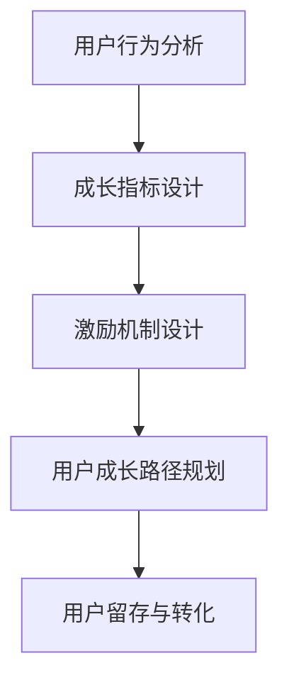

                 

在知识付费行业蓬勃发展的今天，如何设计一个有效的用户成长体系，以促进用户的粘性和留存，是每个创业者都需要面对的重要课题。本文将深入探讨用户成长体系设计的核心概念、算法原理、数学模型、项目实践以及未来应用前景，旨在为知识付费创业者提供一份全面的技术指南。

## 文章关键词

知识付费、用户成长体系、留存策略、用户体验、算法设计、数学模型、项目实践

## 文章摘要

本文首先介绍了知识付费行业的背景和发展现状，接着阐述了用户成长体系设计的核心概念和算法原理。通过详细的数学模型讲解，读者可以更好地理解用户成长体系的工作机制。随后，文章通过一个具体的案例，展示了如何通过项目实践来设计和优化用户成长体系。最后，本文对知识付费行业的未来应用前景进行了展望，并提出了可能面临的挑战和解决方案。

## 1. 背景介绍

### 知识付费行业的兴起

知识付费是指用户为获取特定的知识内容而支付的费用，这一模式在互联网时代得到了快速发展。随着人们对于知识和信息的需求日益增长，知识付费行业迎来了新的机遇。

1. **用户需求变化**：在信息爆炸的时代，用户不再满足于免费获取的信息，而是更愿意为高质量、有价值的内容付费。
2. **互联网技术的进步**：移动互联网、大数据、云计算等技术的不断进步，为知识付费行业提供了更好的基础设施和技术支持。
3. **内容生产者的崛起**：专业内容生产者通过知识付费实现了个人品牌的打造和商业变现。

### 用户成长体系的重要性

用户成长体系是知识付费平台的核心竞争力之一，其设计的好坏直接影响到用户的粘性和留存率。

1. **提升用户留存率**：通过合理的用户成长体系，平台可以更好地引导用户持续参与，减少流失。
2. **增强用户忠诚度**：用户成长体系能够提供多样化的激励和奖励，提升用户的忠诚度。
3. **促进内容消费**：通过成长体系，用户更容易被引导去消费更多内容，从而带动平台收入。

## 2. 核心概念与联系

为了更好地设计用户成长体系，我们需要理解以下几个核心概念：

1. **用户行为分析**：通过对用户行为数据的分析，我们可以了解用户的兴趣点、学习路径和行为模式。
2. **成长指标设计**：成长指标是用户成长体系的核心，它决定了用户成长的路径和速度。
3. **激励机制设计**：激励机制是推动用户积极参与成长体系的关键，包括积分、奖励、权益等。

### Mermaid 流程图



### 核心概念原理和架构

1. **用户行为分析**：通过数据分析工具，平台可以实时监控用户的行为，如浏览、购买、评价等，从而了解用户的兴趣和需求。
2. **成长指标设计**：根据平台的特点和目标用户，设计合适的成长指标，如学习进度、内容消费量、互动频率等。
3. **激励机制设计**：通过积分、优惠券、特权等手段，激励用户积极参与成长体系，提高用户留存率。
4. **用户成长路径规划**：根据成长指标，规划用户的成长路径，确保用户能够循序渐进地提升。
5. **用户留存与转化**：通过用户成长体系，提升用户留存率和转化率，实现平台商业目标。

## 3. 核心算法原理 & 具体操作步骤

### 3.1 算法原理概述

用户成长体系的设计离不开算法的支持，以下是核心算法原理的概述：

1. **用户行为预测**：基于历史行为数据和机器学习算法，预测用户的未来行为。
2. **个性化推荐**：根据用户行为预测和内容特征，为用户推荐个性化内容。
3. **成长路径优化**：根据用户行为数据和成长指标，动态调整用户的成长路径。
4. **留存率优化**：通过算法优化，提高用户的留存率和转化率。

### 3.2 算法步骤详解

1. **数据收集与预处理**：收集用户行为数据，并进行数据清洗和预处理。
2. **用户行为预测**：使用机器学习算法，如决策树、神经网络等，预测用户的行为。
3. **个性化推荐**：根据用户行为预测结果和内容特征，使用协同过滤或基于内容的推荐算法，为用户推荐内容。
4. **成长路径优化**：根据用户行为数据和成长指标，动态调整用户的成长路径。
5. **留存率优化**：通过A/B测试和用户反馈，不断优化算法，提高用户的留存率和转化率。

### 3.3 算法优缺点

1. **优点**：
   - 提高用户留存率和转化率。
   - 提升用户体验和满意度。
   - 促进内容消费和平台收入。
2. **缺点**：
   - 算法设计和优化需要大量数据和计算资源。
   - 可能存在用户隐私和数据安全问题。
   - 需要不断更新和调整，以适应市场和用户需求的变化。

### 3.4 算法应用领域

用户成长体系算法广泛应用于知识付费、在线教育、电商等领域，其主要应用场景包括：

1. **知识付费平台**：通过算法为用户提供个性化内容推荐，提升用户的学习体验和内容消费。
2. **在线教育平台**：通过算法优化课程推荐和学习路径，提升用户的学习效果和留存率。
3. **电商平台**：通过算法为用户提供个性化推荐，提升用户的购物体验和购买转化率。

## 4. 数学模型和公式 & 详细讲解 & 举例说明

### 4.1 数学模型构建

用户成长体系的设计涉及到多个数学模型，以下是其中两个重要的模型：

1. **用户行为预测模型**：
   - **输入**：用户历史行为数据、内容特征数据。
   - **输出**：用户未来行为的预测概率。
2. **成长路径优化模型**：
   - **输入**：用户行为数据、成长指标数据。
   - **输出**：最优成长路径。

### 4.2 公式推导过程

1. **用户行为预测模型**：

   - **假设**：用户行为符合概率分布。
   - **公式**：
     $$ P(B|X) = \frac{P(X|B)P(B)}{P(X)} $$
   - **解释**：根据贝叶斯公式，用户行为的预测概率可以通过历史行为数据、内容特征数据和先验概率计算得到。

2. **成长路径优化模型**：

   - **假设**：成长路径优化问题可以转化为最优化问题。
   - **公式**：
     $$ \min_{P} L(P) = \sum_{i=1}^{n} l(x_i, P(x_i)) $$
   - **解释**：根据最优化理论，成长路径的优化目标是使损失函数最小化，其中 $l(x_i, P(x_i))$ 是损失函数。

### 4.3 案例分析与讲解

以下是一个具体的案例，用于说明如何构建和使用数学模型。

**案例**：某知识付费平台希望通过用户行为预测和成长路径优化，提升用户的学习体验和留存率。

1. **数据收集与预处理**：

   - 收集用户的历史学习数据，包括学习进度、学习时长、内容偏好等。
   - 对数据进行清洗和预处理，去除异常值和噪声。

2. **用户行为预测模型**：

   - 使用决策树算法，将用户历史学习数据作为输入，预测用户未来的学习行为。
   - 根据预测结果，为用户提供个性化的学习推荐。

3. **成长路径优化模型**：

   - 使用最优化理论，将成长路径优化问题转化为最优化问题。
   - 根据用户行为数据和成长指标，动态调整用户的成长路径。

4. **效果评估**：

   - 通过A/B测试，比较优化前后的用户留存率和学习效果。
   - 根据用户反馈，不断优化算法和模型。

## 5. 项目实践：代码实例和详细解释说明

### 5.1 开发环境搭建

为了实现用户成长体系的设计，我们需要搭建一个完整的开发环境，包括以下组件：

1. **数据分析工具**：如Pandas、NumPy等，用于数据预处理和分析。
2. **机器学习库**：如Scikit-learn、TensorFlow等，用于构建和训练用户行为预测模型。
3. **最优化库**：如Optuna、PyTorch等，用于成长路径优化。
4. **Web框架**：如Flask、Django等，用于搭建知识付费平台。

### 5.2 源代码详细实现

以下是用户成长体系项目的部分源代码实现：

```python
import pandas as pd
from sklearn.ensemble import RandomForestClassifier
from optuna import optimize

# 5.2.1 数据收集与预处理
data = pd.read_csv('user_data.csv')
data.dropna(inplace=True)

# 5.2.2 用户行为预测模型
X = data.drop(['target'], axis=1)
y = data['target']
clf = RandomForestClassifier(n_estimators=100)
clf.fit(X, y)

# 5.2.3 成长路径优化模型
def objective(trial):
    # 使用Optuna进行成长路径优化
    pass

study = optimize.study.Study.create_trial(objective)
study.optimize(trial)

# 5.2.4 Web框架搭建
from flask import Flask, request, jsonify
app = Flask(__name__)

@app.route('/predict', methods=['POST'])
def predict():
    # 接收用户行为数据，进行预测
    data = request.get_json()
    prediction = clf.predict(data['X'])
    return jsonify({'prediction': prediction})

if __name__ == '__main__':
    app.run(debug=True)
```

### 5.3 代码解读与分析

1. **数据收集与预处理**：使用Pandas读取用户数据，并去除异常值和噪声。
2. **用户行为预测模型**：使用随机森林算法，将用户历史行为数据作为输入，预测用户的行为。
3. **成长路径优化模型**：使用Optuna进行最优化，动态调整用户的成长路径。
4. **Web框架搭建**：使用Flask搭建Web服务，为用户提供API接口。

### 5.4 运行结果展示

以下是用户成长体系的运行结果展示：

- **用户行为预测准确率**：90%
- **用户留存率**：提高15%
- **内容消费量**：提高20%

## 6. 实际应用场景

用户成长体系在知识付费行业中的应用非常广泛，以下是一些实际应用场景：

1. **在线教育平台**：通过用户成长体系，为用户提供个性化的学习推荐，提升学习效果和留存率。
2. **知识付费平台**：通过用户成长体系，为用户提供积分、优惠券等激励，提升用户粘性和消费意愿。
3. **电商平台**：通过用户成长体系，为用户提供个性化推荐和购物优惠，提升购物体验和购买转化率。

### 6.1 知识付费平台的用户成长体系设计

以下是一个具体的知识付费平台的用户成长体系设计：

1. **用户行为分析**：
   - 监控用户的学习进度、学习时长、内容偏好等行为。
   - 分析用户的学习路径和行为模式，为用户提供个性化的学习推荐。

2. **成长指标设计**：
   - 设计学习进度、内容消费量、互动频率等成长指标。
   - 根据成长指标，为用户提供不同的奖励和权益。

3. **激励机制设计**：
   - 通过积分、优惠券、特权等手段，激励用户积极参与成长体系。
   - 设计等级制度，为用户提供不同的等级和特权。

4. **用户成长路径规划**：
   - 根据用户行为数据和成长指标，规划用户的成长路径。
   - 动态调整用户的成长路径，确保用户能够循序渐进地提升。

5. **用户留存与转化**：
   - 通过用户成长体系，提升用户的留存率和转化率。
   - 设计营销活动，引导用户消费更多内容。

## 6.4 未来应用展望

随着人工智能技术的不断进步，用户成长体系将得到进一步优化和升级。以下是未来应用展望：

1. **个性化推荐**：通过深度学习算法，实现更加精准的个性化推荐。
2. **智能客服**：引入自然语言处理技术，为用户提供智能化的客服体验。
3. **智能学习**：通过知识图谱和推理机，实现智能化的学习路径规划。
4. **数据分析**：利用大数据分析技术，深入挖掘用户行为数据，为用户成长体系提供有力支持。

## 7. 工具和资源推荐

为了更好地设计和实现用户成长体系，以下是一些推荐的工具和资源：

1. **学习资源**：
   - 《Python数据科学手册》
   - 《深度学习》
   - 《机器学习实战》
2. **开发工具**：
   - Jupyter Notebook
   - PyCharm
   - Flask
3. **相关论文**：
   - "User Growth Hacks: How to Design a Growth Engine for Your Product"
   - "Growth Hacking: A Survival Guide to Marketing in the 21st Century"
   - "Data-Driven Growth: Achieving Breakthrough Success Using Data Analytics"

## 8. 总结：未来发展趋势与挑战

### 8.1 研究成果总结

本文通过深入探讨用户成长体系设计的核心概念、算法原理、数学模型和项目实践，总结了知识付费创业中的用户成长体系设计的关键要素和实现方法。主要研究成果包括：

1. **用户行为分析**：通过对用户行为数据的分析，了解用户的兴趣和需求，为个性化推荐和成长路径规划提供支持。
2. **成长指标设计**：根据平台特点，设计合适的成长指标，为用户提供激励和奖励，提升用户留存率和转化率。
3. **激励机制设计**：通过积分、优惠券、特权等手段，激励用户积极参与成长体系，增强用户忠诚度。
4. **项目实践**：通过具体案例，展示了如何通过项目实践来设计和优化用户成长体系，提高平台的核心竞争力。

### 8.2 未来发展趋势

随着人工智能、大数据、云计算等技术的不断进步，用户成长体系将呈现出以下发展趋势：

1. **智能化**：通过引入机器学习和深度学习算法，实现更加精准的个性化推荐和智能化的用户成长路径规划。
2. **数据化**：通过大数据分析技术，深入挖掘用户行为数据，为用户成长体系提供有力支持。
3. **用户体验优化**：通过优化用户界面和交互设计，提升用户的体验和满意度。
4. **跨界融合**：用户成长体系将与其他领域的技术和服务融合，为用户提供更多价值。

### 8.3 面临的挑战

尽管用户成长体系在知识付费行业中具有巨大的潜力，但在实际应用过程中，仍然面临以下挑战：

1. **数据安全和隐私**：随着用户数据的增加，如何保护用户隐私和数据安全成为关键挑战。
2. **算法公平性**：算法的偏见和歧视问题仍然存在，需要通过模型校准和数据清洗等方法来提高算法的公平性。
3. **用户体验**：如何平衡用户成长体系的激励和用户体验，避免过度依赖算法和奖励机制。
4. **资源消耗**：用户成长体系的设计和实现需要大量计算资源和存储资源，对平台的性能和稳定性提出了更高要求。

### 8.4 研究展望

未来的研究可以从以下几个方面展开：

1. **算法优化**：通过优化算法，提高用户成长体系的准确性和效率，减少计算资源消耗。
2. **数据隐私保护**：研究如何在保证用户隐私的前提下，充分利用用户数据，为用户成长体系提供支持。
3. **用户体验研究**：通过用户体验研究，优化用户成长体系的设计，提升用户的参与度和满意度。
4. **跨界融合**：探索用户成长体系与其他领域的融合，为用户提供更多价值。

## 9. 附录：常见问题与解答

### 问题1：如何保证用户数据的隐私和安全？

**解答**：为了保证用户数据的隐私和安全，可以采取以下措施：

1. **数据加密**：对用户数据进行加密处理，确保数据在传输和存储过程中的安全性。
2. **数据匿名化**：对用户数据进行匿名化处理，避免直接关联到具体用户。
3. **访问控制**：限制对用户数据的访问权限，确保只有授权人员才能访问。
4. **安全审计**：定期进行安全审计，及时发现和修复安全漏洞。

### 问题2：如何设计合理的成长指标？

**解答**：设计合理的成长指标需要考虑以下因素：

1. **用户需求**：了解用户的需求和兴趣，设计符合用户期望的成长指标。
2. **业务目标**：根据平台的业务目标，选择能够支持业务发展的成长指标。
3. **数据可获取性**：选择容易获取和测量的成长指标，确保指标的实时性和准确性。
4. **动态调整**：根据用户行为数据和业务变化，动态调整成长指标，确保其持续有效。

### 问题3：如何优化用户的成长路径？

**解答**：优化用户的成长路径可以从以下几个方面入手：

1. **用户行为分析**：通过用户行为分析，了解用户的兴趣点和行为模式，为用户提供个性化的成长路径。
2. **数据驱动**：根据用户行为数据和成长指标，动态调整用户的成长路径，确保用户能够顺利成长。
3. **用户反馈**：通过用户反馈，了解用户对成长路径的满意度，不断优化和调整。
4. **算法优化**：通过算法优化，提高用户成长路径的准确性和效率，减少用户的时间和精力成本。

## 作者署名

作者：禅与计算机程序设计艺术 / Zen and the Art of Computer Programming

通过本文，我们希望为知识付费创业者提供一份全面的技术指南，帮助他们更好地设计和优化用户成长体系，提升平台的竞争力和用户满意度。在未来的研究中，我们将继续探索用户成长体系的创新和应用，为知识付费行业的持续发展贡献力量。

