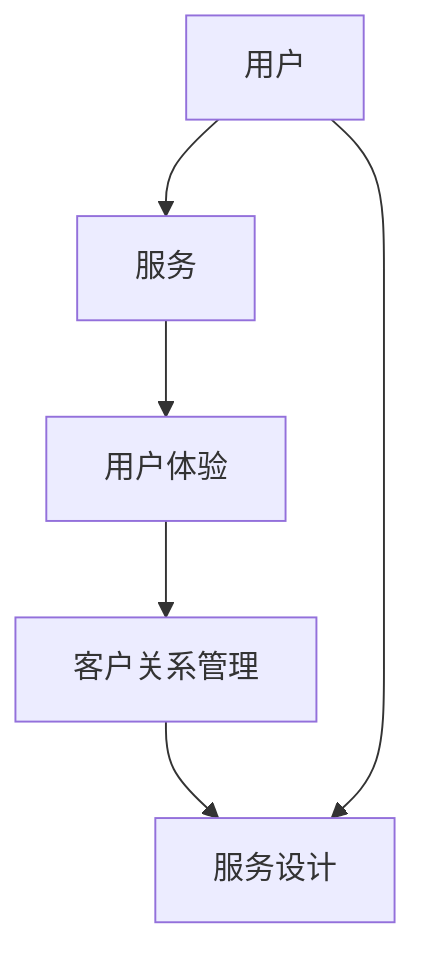

                 

关键词：知识付费、用户服务体系、用户体验、服务设计、客户关系管理、创业

> 摘要：本文深入探讨了知识付费创业中的用户服务体系搭建，从核心概念到具体实践，全方位解析了如何构建高效、优质的用户服务体系，提高用户满意度和忠诚度，为知识付费创业的成功提供指导。

## 1. 背景介绍

随着互联网的快速发展，知识付费已经成为一个新兴且快速成长的领域。知识付费是指用户为了获取特定知识、技能或经验，自愿付费给提供方的一种商业模式。这一模式的出现，一方面满足了用户对高质量知识内容的需求，另一方面也为知识提供者提供了新的收入来源。然而，知识付费的成功不仅取决于内容的优质，更重要的是用户服务体系的构建和运营。

一个完善的用户服务体系可以帮助知识付费平台在激烈的市场竞争中脱颖而出，提高用户满意度和忠诚度，从而实现长期可持续发展。因此，构建一个高效、优质的用户服务体系成为了知识付费创业的关键。

## 2. 核心概念与联系

在构建用户服务体系之前，我们需要明确一些核心概念，以便更好地理解整个体系的运作。

### 2.1. 用户

用户是知识付费平台的主体，他们是服务的接收者，也是平台价值的创造者。用户的属性和行为特征对于用户服务体系的构建至关重要。

### 2.2. 服务

服务是指平台为用户提供的所有活动，包括内容提供、互动交流、问题解答、售后服务等。优质的服务能够提升用户的满意度和忠诚度。

### 2.3. 用户体验

用户体验是指用户在使用平台过程中所感受到的整体感受。它包括内容质量、界面设计、操作便捷性、服务响应速度等多个方面。

### 2.4. 客户关系管理

客户关系管理（CRM）是一种通过技术手段优化客户关系、提升客户满意度和忠诚度的管理方法。在知识付费创业中，CRM系统可以帮助平台更好地了解用户需求，提供个性化服务。

### 2.5. 服务设计

服务设计是一种以用户为中心的设计方法，旨在通过系统化、结构化的方式，构建出能够满足用户需求的服务体系。

### 2.6. Mermaid 流程图

以下是用户服务体系的核心概念和联系 Mermaid 流程图：



## 3. 核心算法原理 & 具体操作步骤

### 3.1 算法原理概述

用户服务体系构建的核心算法是基于用户行为数据和客户关系管理（CRM）系统。通过分析用户行为数据，可以了解用户的需求、偏好和痛点，从而提供个性化的服务。CRM系统则用于管理用户关系，提高用户满意度和忠诚度。

### 3.2 算法步骤详解

1. 数据收集：通过平台的各种渠道收集用户行为数据，包括浏览记录、购买行为、互动行为等。
2. 数据分析：使用数据挖掘和机器学习算法，对用户行为数据进行分析，提取用户需求和偏好。
3. 用户画像：基于数据分析结果，构建用户画像，包括用户的基本信息、需求偏好、行为特征等。
4. 个性化服务：根据用户画像，为用户提供个性化的内容推荐、互动交流和问题解答服务。
5. 客户关系管理：使用CRM系统，记录用户互动历史，分析用户满意度，提供针对性的服务优化建议。
6. 服务优化：根据用户反馈和CRM分析结果，不断优化服务流程和内容，提高用户体验和满意度。

### 3.3 算法优缺点

**优点：**

- 提高用户满意度和忠诚度：通过个性化服务和客户关系管理，提升用户体验。
- 优化服务流程：基于数据分析结果，优化服务流程，提高服务效率。
- 降低运营成本：通过自动化的服务流程，降低人工成本。

**缺点：**

- 需要大量的数据支持：算法的准确性和效果依赖于用户行为数据的收集和分析。
- 数据安全风险：用户行为数据涉及到用户的隐私信息，需要严格保护。

### 3.4 算法应用领域

- 知识付费平台：通过对用户行为数据进行分析，提供个性化的内容推荐和服务。
- 电商平台：通过分析用户购买行为，提供个性化的商品推荐和服务。
- 社交媒体：通过分析用户互动行为，提供个性化的社交推荐和服务。

## 4. 数学模型和公式 & 详细讲解 & 举例说明

### 4.1 数学模型构建

用户服务体系构建的数学模型主要包括用户行为数据分析模型和客户关系管理模型。

#### 用户行为数据分析模型：

假设用户行为数据包括浏览记录、购买行为和互动行为，我们可以使用以下模型来分析用户需求和偏好：

$$
User\_Behavior\_Model = \{ (User, Behavior, Time) \}
$$

其中，User 表示用户，Behavior 表示用户行为，Time 表示行为发生的时间。

#### 客户关系管理模型：

假设客户关系管理模型包括用户满意度、忠诚度和互动历史，我们可以使用以下模型来分析用户关系：

$$
CRM\_Model = \{ (User, Satisfaction, Loyalty, Interaction\_History) \}
$$

其中，Satisfaction 表示用户满意度，Loyalty 表示用户忠诚度，Interaction\_History 表示用户互动历史。

### 4.2 公式推导过程

#### 用户行为数据分析模型：

1. 用户浏览记录分析：

$$
Browse\_Record\_Analysis = \{ (User, Page, Time\_Spent) \}
$$

其中，Page 表示用户浏览的页面，Time\_Spent 表示用户在页面上的停留时间。

2. 用户购买行为分析：

$$
Purchase\_Behavior\_Analysis = \{ (User, Product, Time, Amount) \}
$$

其中，Product 表示用户购买的物品，Amount 表示购买数量。

3. 用户互动行为分析：

$$
Interaction\_Behavior\_Analysis = \{ (User, Action, Time) \}
$$

其中，Action 表示用户的互动行为，如点赞、评论、分享等。

#### 客户关系管理模型：

1. 用户满意度分析：

$$
Satisfaction\_Analysis = \{ (User, Rating, Time) \}
$$

其中，Rating 表示用户对服务的评价。

2. 用户忠诚度分析：

$$
Loyalty\_Analysis = \{ (User, Repeat\_Purchase, Time) \}
$$

其中，Repeat\_Purchase 表示用户是否再次购买。

3. 用户互动历史分析：

$$
Interaction\_History\_Analysis = \{ (User, Interaction, Time) \}
$$

其中，Interaction 表示用户的互动行为。

### 4.3 案例分析与讲解

以某知识付费平台为例，我们通过以下步骤进行用户服务体系构建：

1. 数据收集：收集用户的浏览记录、购买行为和互动行为数据。
2. 数据分析：使用上述数学模型，分析用户需求和偏好。
3. 用户画像：基于分析结果，构建用户画像。
4. 个性化服务：根据用户画像，为用户提供个性化的内容推荐和互动服务。
5. 客户关系管理：使用CRM系统，记录用户互动历史，分析用户满意度，提供服务优化建议。
6. 服务优化：根据用户反馈和CRM分析结果，不断优化服务流程和内容。

通过以上步骤，知识付费平台可以提供更优质的服务，提高用户满意度和忠诚度，从而实现长期可持续发展。

## 5. 项目实践：代码实例和详细解释说明

### 5.1 开发环境搭建

在本项目中，我们将使用Python语言和Scikit-learn库进行用户行为数据分析和客户关系管理。首先，需要安装Python环境和Scikit-learn库。

```bash
pip install python
pip install scikit-learn
```

### 5.2 源代码详细实现

以下是一个简单的用户行为数据分析示例：

```python
import pandas as pd
from sklearn.cluster import KMeans

# 加载用户行为数据
data = pd.read_csv('user_behavior.csv')

# 数据预处理
data['Time'] = pd.to_datetime(data['Time'])
data.sort_values('Time', inplace=True)

# 用户浏览记录分析
browse_data = data[data['Behavior'] == 'Browse']
browse_data.groupby('Page')['Time_Spent'].mean()

# 用户购买行为分析
purchase_data = data[data['Behavior'] == 'Purchase']
purchase_data.groupby('Product')['Amount'].sum()

# 用户互动行为分析
interaction_data = data[data['Behavior'] == 'Interaction']
interaction_data.groupby('Action')['Time'].count()

# 用户画像构建
def calculate_similarity(data1, data2):
    return np.dot(data1, data2) / (np.linalg.norm(data1) * np.linalg.norm(data2))

kmeans = KMeans(n_clusters=5)
user_cluster = kmeans.fit_predict(data[['Page', 'Product', 'Action']])

# 个性化服务
for cluster in range(kmeans.n_clusters):
    cluster_data = data[data['Cluster'] == cluster]
    cluster_browse_data = cluster_data[cluster_data['Behavior'] == 'Browse']
    cluster_purchase_data = cluster_data[cluster_data['Behavior'] == 'Purchase']
    cluster_interaction_data = cluster_data[cluster_data['Behavior'] == 'Interaction']
    
    print(f"Cluster {cluster}:")
    print("Browse Data:", cluster_browse_data.groupby('Page')['Time_Spent'].mean())
    print("Purchase Data:", cluster_purchase_data.groupby('Product')['Amount'].sum())
    print("Interaction Data:", cluster_interaction_data.groupby('Action')['Time'].count())
    print()
```

### 5.3 代码解读与分析

1. **数据预处理**：首先，我们需要加载用户行为数据，并将其转换为合适的格式。在本例中，我们将时间数据转换为日期格式，并按时间顺序排序。
2. **用户浏览记录分析**：使用Pandas库，我们可以轻松地对用户浏览记录进行分析。我们计算了每个页面平均停留时间。
3. **用户购买行为分析**：同样地，我们分析了用户的购买行为，计算了每个产品的购买数量。
4. **用户互动行为分析**：我们分析了用户的互动行为，计算了每种互动行为的发生次数。
5. **用户画像构建**：我们使用K-Means聚类算法，将用户分为不同的聚类，以便更好地理解用户群体。
6. **个性化服务**：根据用户的聚类结果，我们为每个聚类提供了个性化的浏览记录、购买行为和互动行为分析。

### 5.4 运行结果展示

运行上述代码后，我们将得到每个用户的浏览记录、购买行为和互动行为分析结果。这些结果可以帮助平台更好地了解用户需求，提供个性化的服务。

## 6. 实际应用场景

### 6.1 知识付费平台

知识付费平台可以应用用户服务体系，通过分析用户行为数据和客户关系管理，为用户提供个性化的内容推荐和互动服务，提高用户满意度和忠诚度。

### 6.2 电商平台

电商平台可以应用用户服务体系，通过分析用户购买行为和互动历史，提供个性化的商品推荐和售后服务，提高用户购物体验和满意度。

### 6.3 社交媒体

社交媒体平台可以应用用户服务体系，通过分析用户互动行为和兴趣偏好，提供个性化的社交推荐和互动体验，提高用户活跃度和满意度。

### 6.4 未来应用展望

随着人工智能和大数据技术的不断发展，用户服务体系将在更多领域得到应用。例如，教育领域可以通过用户服务体系，为学习者提供个性化的学习内容和辅导服务；医疗领域可以通过用户服务体系，为患者提供个性化的健康管理和医疗服务。

## 7. 工具和资源推荐

### 7.1 学习资源推荐

- 《大数据之路：阿里巴巴大数据实践》
- 《机器学习实战》
- 《用户体验要素》

### 7.2 开发工具推荐

- Python
- Jupyter Notebook
- Scikit-learn

### 7.3 相关论文推荐

- “User Experience Management: Strategies for Improving User Satisfaction and Loyalty”
- “Customer Relationship Management: Concepts, Strategies, and Tools”
- “Big Data Analytics in E-commerce: A Comprehensive Review”

## 8. 总结：未来发展趋势与挑战

### 8.1 研究成果总结

本文深入探讨了知识付费创业中的用户服务体系搭建，从核心概念到具体实践，全方位解析了如何构建高效、优质的用户服务体系，提高用户满意度和忠诚度。

### 8.2 未来发展趋势

随着人工智能和大数据技术的不断发展，用户服务体系将朝着更加智能化、个性化的方向发展。未来，用户服务体系将更注重数据分析、客户关系管理和用户体验设计。

### 8.3 面临的挑战

- 数据安全和隐私保护：随着用户数据量的增加，数据安全和隐私保护将成为用户服务体系面临的重大挑战。
- 技术更新与维护：随着技术的快速发展，用户服务体系需要不断更新和维护，以适应新的技术和需求。

### 8.4 研究展望

未来，我们可以从以下方向进一步研究用户服务体系：

- 深入研究用户行为数据分析和机器学习算法，提高用户画像的准确性和个性化服务水平。
- 探索用户服务体系在不同领域的应用，如教育、医疗、金融等。
- 研究用户服务体系与区块链技术的结合，提高数据安全和隐私保护水平。

## 9. 附录：常见问题与解答

### 9.1 什么是知识付费？

知识付费是指用户为了获取特定知识、技能或经验，自愿付费给提供方的一种商业模式。

### 9.2 用户服务体系的核心概念有哪些？

用户服务体系的核心概念包括用户、服务、用户体验、客户关系管理、服务设计和服务设计。

### 9.3 用户服务体系如何提高用户满意度和忠诚度？

通过分析用户行为数据、提供个性化的服务和互动，以及使用客户关系管理系统，可以有效地提高用户满意度和忠诚度。

### 9.4 知识付费创业中如何构建用户服务体系？

首先，明确用户需求，然后收集用户行为数据，使用数据分析技术构建用户画像，提供个性化的服务，并使用客户关系管理系统进行客户关系管理。

### 9.5 用户服务体系在未来有哪些发展趋势？

未来，用户服务体系将朝着智能化、个性化的方向发展，更加注重数据分析、客户关系管理和用户体验设计。

### 9.6 如何保护用户数据安全和隐私？

通过使用加密技术、建立安全的数据存储和管理系统，以及严格的数据使用政策，可以有效地保护用户数据安全和隐私。

---

**作者：禅与计算机程序设计艺术 / Zen and the Art of Computer Programming**

