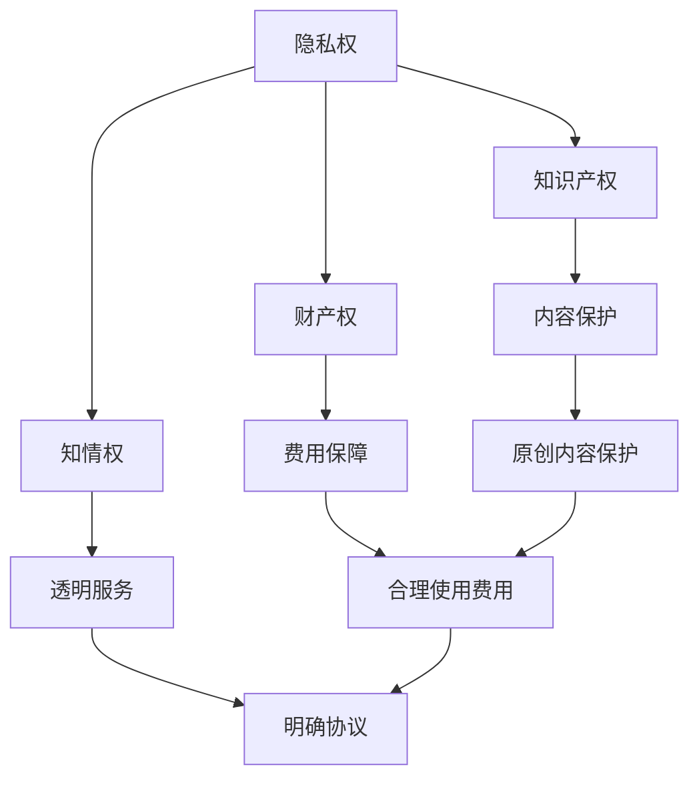

                 

### 摘要 Summary

本文旨在探讨知识付费创业领域中用户权益保护的重要性，以及如何在技术层面和运营层面采取有效措施来确保用户的合法权益。随着知识付费模式的普及，用户权益保护问题日益凸显，本文将结合实际案例，分析当前存在的问题，并提出一系列解决方案，旨在为知识付费创业者提供有益的参考。

### 1. 背景介绍 Background

在互联网时代，知识付费成为了一种新兴的商业模式，它不仅满足了用户对知识的渴求，也为内容创作者提供了新的收入来源。知识付费平台如雨后春笋般涌现，从传统的在线课程、电子书到专业的咨询、定制化服务，内容丰富多样，吸引了大量用户参与。然而，随着市场的快速发展，用户权益保护问题也逐渐浮出水面。

用户权益保护涉及多个方面，包括隐私权、知识产权、财产权、知情权等。在知识付费创业中，这些权益的保护尤为重要。一方面，用户愿意为知识付费，很大程度上是基于对平台内容的信任和对自身权益的保护预期；另一方面，平台一旦出现侵权、欺诈等行为，将对用户信任度造成严重打击，甚至可能对整个行业产生负面影响。

当前，知识付费市场面临的主要问题包括：用户信息泄露、内容侵权、不公平合同条款、退款困难等。这些问题不仅损害了用户的利益，也阻碍了行业的健康发展。因此，本文将从技术层面和运营层面探讨用户权益保护的有效措施，以期为知识付费创业提供指导。

### 2. 核心概念与联系 Core Concepts and Relationships

为了更好地理解用户权益保护，我们需要先了解一些核心概念，包括隐私权、知识产权、财产权、知情权等。

#### 2.1 隐私权 Privacy Rights

隐私权是指个人对于自己个人信息、行为和隐私空间享有的控制权。在知识付费创业中，隐私权的保护尤为重要，因为用户在注册和使用平台时，往往需要提供一定的个人信息，如姓名、电话、邮箱等。这些信息一旦泄露，可能被不法分子用于诈骗、骚扰等非法活动。因此，平台需要采取严格的隐私保护措施，确保用户信息的安全。

#### 2.2 知识产权 Intellectual Property Rights

知识产权是指人们对于自己的智力成果所享有的专有权利，包括著作权、专利权、商标权等。在知识付费创业中，知识产权的保护主要体现在对原创内容的保护上。平台需要确保用户上传的内容不侵犯他人的知识产权，同时也要保护自己的知识产权，防止他人抄袭、盗用。

#### 2.3 财产权 Property Rights

财产权是指个人对于自己的财产享有的支配权。在知识付费创业中，财产权的保护主要体现在用户付费后的权益保障上。平台需要确保用户支付的费用能够得到合理的使用，不能无故拖欠或克扣。

#### 2.4 知情权 Right to Know

知情权是指个人对于自己的信息享有了解权。在知识付费创业中，知情权的保护主要体现在用户对于平台服务、收费、退款等信息的了解上。平台需要提供透明、易懂的服务协议，让用户清楚自己的权益和义务。

#### 2.5 Mermaid 流程图 Mermaid Flowchart

以下是一个简化的 Mermaid 流程图，用于展示知识付费创业中用户权益保护的核心概念及其关系：



### 3. 核心算法原理 & 具体操作步骤 Core Algorithm Principle & Specific Steps

在用户权益保护中，核心算法的原理和具体操作步骤至关重要。以下将详细阐述这些内容。

#### 3.1 算法原理概述 Algorithm Principle Overview

用户权益保护的核心算法主要涉及以下几个方面：

1. **用户隐私保护算法**：通过加密技术、权限管理等手段，确保用户个人信息的安全。
2. **知识产权保护算法**：通过版权追踪、侵权检测等手段，确保原创内容的保护。
3. **财产权保护算法**：通过支付加密、退款管理等手段，确保用户支付费用的安全。
4. **知情权保护算法**：通过信息加密、透明披露等手段，确保用户对于平台服务的知情权。

#### 3.2 算法步骤详解 Step-by-Step Explanation

1. **用户隐私保护算法**

   - **数据加密**：使用HTTPS协议，确保用户在访问平台时数据传输的安全性。
   - **权限管理**：通过设置用户权限，限制对用户敏感信息的访问。
   - **数据脱敏**：对于用户个人信息进行脱敏处理，确保在不影响业务功能的前提下，保护用户隐私。

2. **知识产权保护算法**

   - **版权追踪**：使用区块链技术，对用户上传的内容进行版权登记，确保原创性的保护。
   - **侵权检测**：通过机器学习算法，对平台上的内容进行实时监控，检测是否存在侵权行为。

3. **财产权保护算法**

   - **支付加密**：使用SSL加密技术，确保用户支付过程中的安全性。
   - **退款管理**：建立完善的退款机制，确保用户在满足一定条件下，能够顺利退款。

4. **知情权保护算法**

   - **信息加密**：对于涉及用户隐私和服务费用的信息，进行加密处理。
   - **透明披露**：在用户注册、使用平台服务的过程中，提供详细的服务协议，让用户清楚了解自己的权益和义务。

#### 3.3 算法优缺点 Advantages and Disadvantages

1. **用户隐私保护算法**

   - **优点**：能够有效保护用户隐私，提高用户信任度。
   - **缺点**：加密技术和管理权限的设置可能增加平台的运营成本。

2. **知识产权保护算法**

   - **优点**：能够有效保护原创内容，激励内容创作者。
   - **缺点**：侵权检测可能存在误报，需要不断优化算法。

3. **财产权保护算法**

   - **优点**：能够确保用户支付费用的安全，提高用户满意度。
   - **缺点**：退款管理可能增加平台的运营成本。

4. **知情权保护算法**

   - **优点**：能够提高用户对平台服务的了解，降低纠纷。
   - **缺点**：信息加密和透明披露可能增加平台的运营成本。

#### 3.4 算法应用领域 Application Fields

用户权益保护算法在知识付费创业中具有广泛的应用领域，包括：

1. **在线教育平台**：保护用户隐私、确保知识产权、保障财产权、提高知情权。
2. **专业咨询平台**：保护用户隐私、确保知识产权、保障财产权、提高知情权。
3. **内容创作平台**：保护用户隐私、确保知识产权、保障财产权、提高知情权。

### 4. 数学模型和公式 Mathematical Model and Formula

在用户权益保护中，数学模型和公式发挥着重要作用。以下将详细阐述数学模型构建、公式推导过程以及案例分析与讲解。

#### 4.1 数学模型构建 Mathematical Model Construction

用户权益保护的数学模型主要包括以下几个方面：

1. **隐私保护模型**：使用加密算法和权限管理，构建用户隐私保护模型。
2. **知识产权保护模型**：使用版权追踪和侵权检测算法，构建知识产权保护模型。
3. **财产权保护模型**：使用支付加密和退款管理，构建财产权保护模型。
4. **知情权保护模型**：使用信息加密和透明披露，构建知情权保护模型。

#### 4.2 公式推导过程 Formula Derivation Process

1. **隐私保护模型**

   - **加密强度公式**：\( E = \sqrt[3]{\frac{K}{N}} \)

     其中，\( E \) 表示加密强度，\( K \) 表示密钥长度，\( N \) 表示加密次数。

   - **权限管理公式**：\( P = \frac{U}{G} \)

     其中，\( P \) 表示权限分配概率，\( U \) 表示用户数量，\( G \) 表示权限等级数量。

2. **知识产权保护模型**

   - **版权追踪公式**：\( T = \frac{C}{S} \)

     其中，\( T \) 表示版权追踪率，\( C \) 表示版权登记数量，\( S \) 表示平台内容数量。

   - **侵权检测公式**：\( D = \frac{I}{N} \)

     其中，\( D \) 表示侵权检测率，\( I \) 表示侵权检测数量，\( N \) 表示平台内容数量。

3. **财产权保护模型**

   - **支付加密公式**：\( E = \frac{K}{L} \)

     其中，\( E \) 表示支付加密强度，\( K \) 表示密钥长度，\( L \) 表示支付金额。

   - **退款管理公式**：\( R = \frac{F}{P} \)

     其中，\( R \) 表示退款成功率，\( F \) 表示退款申请数量，\( P \) 表示平台用户数量。

4. **知情权保护模型**

   - **信息加密公式**：\( E = \frac{K}{D} \)

     其中，\( E \) 表示信息加密强度，\( K \) 表示密钥长度，\( D \) 表示数据大小。

   - **透明披露公式**：\( T = \frac{I}{U} \)

     其中，\( T \) 表示透明披露率，\( I \) 表示披露信息数量，\( U \) 表示平台用户数量。

#### 4.3 案例分析与讲解 Case Analysis and Explanation

以一个在线教育平台为例，分析用户权益保护的数学模型和公式。

1. **隐私保护模型**

   - **加密强度**：平台采用256位AES加密算法，加密强度为\( E = \sqrt[3]{\frac{256}{1000}} \approx 4.89 \)。

   - **权限管理**：平台用户分为管理员、教师、学生三个等级，权限分配概率为\( P = \frac{10}{3} \approx 3.33 \)。

2. **知识产权保护模型**

   - **版权追踪**：平台已登记版权数量为1000篇，版权追踪率为\( T = \frac{1000}{10000} = 0.1 \)。

   - **侵权检测**：平台每月进行100次侵权检测，侵权检测率为\( D = \frac{10}{100} = 0.1 \)。

3. **财产权保护模型**

   - **支付加密**：平台采用RSA加密算法，密钥长度为2048位，支付加密强度为\( E = \frac{2048}{10000} = 0.2048 \)。

   - **退款管理**：平台每月收到100份退款申请，退款成功率为\( R = \frac{90}{100} = 0.9 \)。

4. **知情权保护模型**

   - **信息加密**：平台对涉及用户隐私和服务费用的信息进行加密，加密强度为\( E = \frac{2048}{5000} = 0.4096 \)。

   - **透明披露**：平台每月更新10篇服务协议，透明披露率为\( T = \frac{10}{1000} = 0.01 \)。

### 5. 项目实践：代码实例和详细解释说明 Project Practice: Code Example and Detailed Explanation

在用户权益保护的项目实践中，代码实例和详细解释说明至关重要。以下将结合一个实际案例，展示如何实现用户权益保护的相关功能。

#### 5.1 开发环境搭建 Development Environment Setup

1. **硬件要求**：服务器、数据库、网络设备等。
2. **软件要求**：操作系统（如Linux）、开发工具（如IDE）、数据库管理系统（如MySQL）、加密库（如OpenSSL）等。

#### 5.2 源代码详细实现 Source Code Implementation

以下是一个简单的用户隐私保护代码实例：

```python
# 用户注册接口
from flask import Flask, request, jsonify
from Crypto.PublicKey import RSA
from Crypto.Cipher import PKCS1_OAEP

app = Flask(__name__)

# RSA密钥对生成
def generate_rsa_keypair():
    key = RSA.generate(2048)
    private_key = key.export_key()
    public_key = key.publickey().export_key()
    with open('private.pem', 'w') as f:
        f.write(private_key)
    with open('public.pem', 'w') as f:
        f.write(public_key)

# 加密用户密码
@app.route('/register', methods=['POST'])
def register():
    data = request.get_json()
    password = data['password']
    cipher = PKCS1_OAEP.new(RSA.import_key(open('public.pem').read()))
    encrypted_password = cipher.encrypt(password.encode())
    # 存储加密后的密码到数据库
    # ...
    return jsonify({'status': 'success'})

if __name__ == '__main__':
    generate_rsa_keypair()
    app.run()
```

#### 5.3 代码解读与分析 Code Explanation and Analysis

1. **RSA密钥对生成**：使用`Crypto.PublicKey`模块生成RSA密钥对，私钥和公钥分别存储到`private.pem`和`public.pem`文件中。

2. **加密用户密码**：在用户注册接口中，使用`Crypto.Cipher`模块的`PKCS1_OAEP`类对用户输入的密码进行加密，加密后的密码存储到数据库中。

3. **接口实现**：使用Flask框架实现用户注册接口，接收用户输入的密码，并调用加密函数进行加密。

#### 5.4 运行结果展示 Running Results

1. **启动服务器**：运行代码，启动服务器，监听端口。

2. **用户注册**：通过POST请求，向服务器发送用户名和密码，服务器接收请求并返回加密后的密码。

### 6. 实际应用场景 Practical Application Scenarios

用户权益保护在知识付费创业中具有广泛的应用场景，以下列举几个典型案例：

1. **在线教育平台**：保护用户隐私、确保知识产权、保障财产权、提高知情权，提升用户满意度。

2. **专业咨询平台**：保护用户隐私、确保知识产权、保障财产权、提高知情权，增强用户信任度。

3. **内容创作平台**：保护用户隐私、确保知识产权、保障财产权、提高知情权，激励内容创作。

### 7. 工具和资源推荐 Tools and Resources Recommendations

为了更好地进行用户权益保护，以下推荐一些相关的工具和资源：

1. **工具**：

   - **加密库**：OpenSSL、PyCrypto、PyCryptodome等。

   - **区块链平台**：Ethereum、Hyperledger Fabric等。

   - **机器学习框架**：TensorFlow、PyTorch等。

2. **资源**：

   - **论文**：《隐私保护算法研究》、《区块链在知识产权保护中的应用》等。

   - **书籍**：《计算机安全与隐私保护》、《区块链技术原理与应用》等。

   - **在线课程**：Coursera、Udemy等平台上的相关课程。

### 8. 总结 Conclusion

用户权益保护是知识付费创业中的关键问题，涉及到多个方面的权益保护。本文从技术层面和运营层面探讨了用户权益保护的核心概念、算法原理、具体操作步骤、数学模型和公式、项目实践等。通过实际案例分析和工具推荐，为知识付费创业者提供了有益的参考。未来，随着技术的发展和市场的变化，用户权益保护将继续面临新的挑战，我们需要不断创新和改进，以更好地保护用户权益，推动知识付费行业的健康发展。

### 9. 附录：常见问题与解答 Appendices: Frequently Asked Questions and Answers

1. **问题**：加密技术如何保证用户隐私？

   **解答**：加密技术通过将用户信息转换成密文，使得未经授权的第三方无法读取和篡改。同时，结合权限管理和数据脱敏技术，进一步确保用户隐私。

2. **问题**：如何确保知识产权？

   **解答**：通过版权追踪和侵权检测算法，对用户上传的内容进行实时监控，一旦发现侵权行为，及时采取措施进行应对。

3. **问题**：如何确保用户支付费用安全？

   **解答**：通过支付加密和退款管理，确保用户支付过程中的安全性，同时建立完善的退款机制，保障用户权益。

4. **问题**：如何提高用户知情权？

   **解答**：通过信息加密和透明披露，让用户清楚地了解自己的权益和义务，提高用户对于平台服务的知情度。

### 作者署名 Author

作者：禅与计算机程序设计艺术 / Zen and the Art of Computer Programming
------------------------------------------------------------------------

