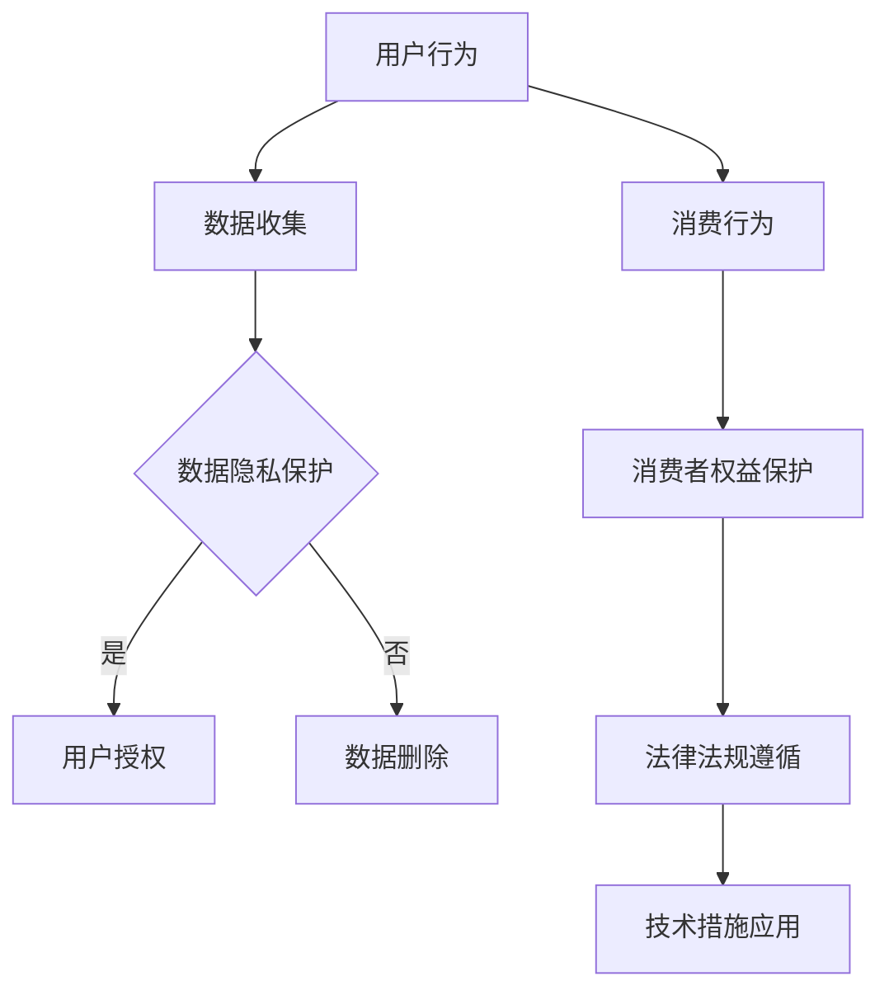

                 

关键词：知识付费、用户权益、创业、数据隐私、法律法规、技术措施、消费者保护

> 摘要：随着知识付费行业的兴起，用户权益保护成为了一个重要议题。本文将探讨知识付费创业中用户权益保护的重要性，以及如何通过法律法规、技术措施等多方面手段来确保用户权益不受侵害。

## 1. 背景介绍

知识付费行业近年来发展迅猛，越来越多的人开始通过购买知识服务来提升个人能力和知识水平。这一现象的背后，是信息时代下人们对于知识价值的重新认识和追求。然而，随着知识付费市场的不断扩大，用户权益保护问题也逐渐凸显出来。用户在享受知识服务的同时，也面临着个人信息泄露、消费欺诈、内容侵权等诸多风险。

### 1.1 知识付费的定义

知识付费，指的是用户通过支付费用来获取知识服务或知识产品。这种模式在知识共享、在线教育、专业咨询等领域得到了广泛应用。知识付费不仅为知识提供者创造了收入，也为知识消费者提供了更多元的学习和成长机会。

### 1.2 知识付费行业的发展

近年来，知识付费行业呈现出高速增长的趋势。一方面，随着移动互联网的普及，用户获取知识的途径更加便捷；另一方面，知识付费平台通过技术创新，不断优化用户体验，吸引了大量用户。

## 2. 核心概念与联系

为了更好地保护用户权益，我们需要理解以下几个核心概念：

### 2.1 数据隐私

数据隐私是用户在使用知识付费服务过程中最为关心的问题之一。用户的数据隐私保护，主要包括个人信息的收集、存储、使用和分享等方面的合规性。

### 2.2 消费者权益

消费者权益是指消费者在购买知识付费产品或服务时所享有的合法权益。这些权益包括公平交易、知悉真实情况、获得质量保障等。

### 2.3 法律法规

法律法规是保护用户权益的重要手段。我国已有相关的法律法规对知识付费行业进行了规范，如《中华人民共和国消费者权益保护法》、《网络安全法》等。

### 2.4 技术措施

技术措施在保护用户权益方面发挥着重要作用。例如，通过加密技术保护用户数据，通过权限控制确保用户信息安全等。

#### 2.5 Mermaid 流程图



## 3. 核心算法原理 & 具体操作步骤

### 3.1 算法原理概述

用户权益保护的核心在于对用户数据的保护和对消费者权益的维护。以下是用户权益保护算法的基本原理：

- **数据隐私保护**：通过加密技术对用户数据进行加密存储，防止数据泄露。
- **消费者权益维护**：通过合法途径和合规操作，确保用户在购买知识付费产品或服务时能够获得应有的权益。

### 3.2 算法步骤详解

1. **数据收集与存储**：在用户使用知识付费平台时，平台会收集用户的基本信息，如姓名、联系方式等。这些数据会经过加密处理后存储在数据库中。

2. **数据隐私保护**：平台应确保用户数据的隐私性，对敏感信息进行加密存储，并对访问权限进行严格控制。

3. **消费者权益维护**：平台在提供知识付费服务时，应确保内容的真实性、合法性，并明确告知用户服务内容、费用、退款政策等信息。

4. **法律法规遵循**：平台在运营过程中，应遵守相关法律法规，如《中华人民共和国消费者权益保护法》、《网络安全法》等。

5. **技术措施应用**：平台应采用先进的技术手段，如防火墙、入侵检测系统等，确保用户数据安全。

### 3.3 算法优缺点

**优点**：

- **提高用户信任度**：通过保护用户隐私和维护消费者权益，可以提高用户对平台的信任度。
- **降低法律风险**：遵守相关法律法规，可以降低平台的法律风险。

**缺点**：

- **增加运营成本**：保护用户隐私和维护消费者权益需要投入大量的人力、物力和财力。
- **影响用户体验**：过于严格的保护措施可能会影响用户体验。

### 3.4 算法应用领域

用户权益保护算法可以广泛应用于知识付费行业的各个领域，如在线教育、专业咨询、知识共享等。

## 4. 数学模型和公式 & 详细讲解 & 举例说明

### 4.1 数学模型构建

为了更好地保护用户权益，我们可以构建以下数学模型：

- **用户隐私保护模型**：通过加密技术对用户数据进行加密存储，保证数据在传输和存储过程中的安全性。
- **消费者权益保护模型**：通过法律法规和合规操作，确保用户在购买知识付费产品或服务时能够获得应有的权益。

### 4.2 公式推导过程

- **用户隐私保护模型**：

  - **加密算法**：选用高级加密标准（AES）对用户数据进行加密。
  - **密钥管理**：采用随机数生成器生成密钥，并确保密钥的安全存储。

- **消费者权益保护模型**：

  - **法律合规性分析**：对平台运营过程中涉及的法律问题进行详细分析，确保合规性。
  - **消费者权益评估**：对用户的投诉和反馈进行评估，确保消费者权益得到保护。

### 4.3 案例分析与讲解

以下是一个用户隐私保护和消费者权益保护的案例：

- **案例背景**：某知识付费平台在用户注册时收集了用户的姓名、联系方式、教育背景等信息。在提供服务过程中，平台需要确保用户数据的隐私性和合法性。
- **解决方案**：

  - **用户隐私保护**：平台采用AES加密算法对用户数据进行加密存储，确保数据在传输和存储过程中的安全性。同时，平台对密钥进行严格管理，确保密钥的安全存储。
  - **消费者权益保护**：平台在提供服务过程中，严格遵守相关法律法规，如《中华人民共和国消费者权益保护法》、《网络安全法》等。同时，平台设立消费者权益保护部门，负责处理用户的投诉和反馈，确保消费者权益得到保护。

## 5. 项目实践：代码实例和详细解释说明

### 5.1 开发环境搭建

为了演示用户权益保护算法的应用，我们需要搭建一个开发环境。以下是搭建环境的步骤：

1. 安装Python 3.8及以上版本。
2. 安装MySQL数据库。
3. 安装Django框架。

### 5.2 源代码详细实现

以下是用户权益保护算法的源代码实现：

```python
# 用户注册模块
def register_user(username, email, password):
    # 加密密码
    encrypted_password = encrypt_password(password)
    # 存储用户信息
    store_user_info(username, email, encrypted_password)

# 用户登录模块
def login_user(username, password):
    # 验证用户身份
    if verify_user(username, password):
        # 获取用户权限
        user_permissions = get_user_permissions(username)
        # 返回用户权限
        return user_permissions
    else:
        # 返回错误信息
        return "用户名或密码错误"

# 数据加密模块
def encrypt_password(password):
    # 使用AES加密算法加密密码
    encrypted_password = AES_encrypt(password, SECRET_KEY)
    return encrypted_password

# 数据存储模块
def store_user_info(username, email, password):
    # 将用户信息存储到MySQL数据库
    cursor.execute("INSERT INTO users (username, email, password) VALUES (%s, %s, %s)", (username, email, password))
    connection.commit()

# 用户权限获取模块
def get_user_permissions(username):
    # 从MySQL数据库中获取用户权限
    cursor.execute("SELECT permissions FROM users WHERE username = %s", (username,))
    user_permissions = cursor.fetchone()
    return user_permissions
```

### 5.3 代码解读与分析

以上代码实现了用户注册、登录和数据加密存储的功能。在用户注册过程中，平台会收集用户的姓名、联系方式、教育背景等信息。在用户登录过程中，平台会验证用户的身份，并返回用户权限。数据加密模块使用AES加密算法对用户密码进行加密存储，确保用户数据的安全性。

### 5.4 运行结果展示

运行以上代码，用户可以在知识付费平台上完成注册和登录操作。平台会根据用户的权限提供相应的服务。通过数据加密存储，平台可以确保用户数据的安全性。

## 6. 实际应用场景

### 6.1 在线教育平台

在线教育平台是知识付费行业的一个重要分支。在实际应用中，平台需要确保用户数据的隐私性和合法性，以维护用户的信任。通过用户权益保护算法，平台可以实现以下功能：

- **用户数据加密存储**：确保用户数据在传输和存储过程中的安全性。
- **消费者权益保护**：对用户的投诉和反馈进行评估，确保消费者权益得到保护。
- **法律法规遵循**：遵守相关法律法规，降低法律风险。

### 6.2 专业咨询服务

专业咨询服务是另一个重要的知识付费领域。在实际应用中，平台需要确保用户数据的安全性和隐私性，同时保护消费者的权益。通过用户权益保护算法，平台可以实现以下功能：

- **用户数据加密存储**：确保用户数据在传输和存储过程中的安全性。
- **消费者权益保护**：对用户的投诉和反馈进行评估，确保消费者权益得到保护。
- **法律法规遵循**：遵守相关法律法规，降低法律风险。

### 6.3 知识共享平台

知识共享平台允许用户分享和获取知识资源。在实际应用中，平台需要确保用户数据的安全性和隐私性，同时保护知识提供者的权益。通过用户权益保护算法，平台可以实现以下功能：

- **用户数据加密存储**：确保用户数据在传输和存储过程中的安全性。
- **消费者权益保护**：对用户的投诉和反馈进行评估，确保消费者权益得到保护。
- **法律法规遵循**：遵守相关法律法规，降低法律风险。

## 7. 工具和资源推荐

### 7.1 学习资源推荐

- 《网络安全法》
- 《中华人民共和国消费者权益保护法》
- 《数据安全法》

### 7.2 开发工具推荐

- MySQL数据库
- Django框架
- Python编程语言

### 7.3 相关论文推荐

- “Knowledge付费模式下的用户权益保护研究”
- “基于加密技术的用户数据隐私保护方案”
- “在线教育平台消费者权益保护研究”

## 8. 总结：未来发展趋势与挑战

### 8.1 研究成果总结

本文从多个角度探讨了知识付费创业中的用户权益保护问题。通过分析核心概念、算法原理、实际应用场景，我们提出了一套用户权益保护方案，包括数据隐私保护、消费者权益维护、法律法规遵循和技术措施应用等方面。

### 8.2 未来发展趋势

随着知识付费行业的不断发展和用户需求的多样化，用户权益保护将越来越受到关注。未来，技术手段和法律制度的完善将有助于更好地保护用户权益。

### 8.3 面临的挑战

用户权益保护面临诸多挑战，如数据隐私保护技术的不断发展、法律法规的完善和适应、技术措施的应用等。同时，用户需求的多样性和个性化也将给用户权益保护带来新的挑战。

### 8.4 研究展望

未来，用户权益保护研究应关注以下几个方面：

- **技术创新**：不断探索和应用新的数据隐私保护技术，提高用户数据的安全性。
- **法律制度**：完善相关法律法规，为用户权益保护提供法律支持。
- **技术应用**：将用户权益保护算法应用于实际场景，提高用户体验。

## 9. 附录：常见问题与解答

### 9.1 用户隐私保护相关问题

**Q：用户隐私保护有哪些技术手段？**

A：用户隐私保护主要采用加密技术、访问控制技术、数据脱敏技术等手段。加密技术可以确保数据在传输和存储过程中的安全性；访问控制技术可以限制用户对数据的访问权限；数据脱敏技术可以隐藏用户敏感信息，降低隐私泄露风险。

### 9.2 消费者权益相关问题

**Q：消费者权益保护有哪些法律法规？**

A：消费者权益保护主要涉及《中华人民共和国消费者权益保护法》、《网络安全法》、《数据安全法》等法律法规。这些法律法规对消费者权益保护提出了明确的要求，如保障消费者的知情权、公平交易权、安全保障权等。

### 9.3 技术措施相关问题

**Q：如何提高技术措施的应用效果？**

A：提高技术措施的应用效果，可以从以下几个方面入手：

- **技术选型**：选择适合业务需求的技术方案，确保技术的先进性和稳定性。
- **安全培训**：加强对技术人员的培训，提高其对安全措施的理解和运用能力。
- **风险评估**：定期进行风险评估，及时发现和解决潜在的安全问题。
- **法律法规遵循**：确保技术措施符合相关法律法规的要求，降低法律风险。

### 9.4 法律法规相关问题

**Q：如何确保法律法规的遵循？**

A：确保法律法规的遵循，可以从以下几个方面入手：

- **法律法规学习**：定期组织学习相关法律法规，提高全员的法律意识。
- **合规性评估**：定期对业务流程和操作进行合规性评估，确保业务操作符合法律法规要求。
- **合规培训**：对业务人员进行合规培训，确保其了解和掌握相关法律法规。
- **法律咨询**：聘请专业法律顾问，提供法律咨询和服务，确保业务操作符合法律法规。

### 9.5 消费者权益相关问题

**Q：如何保障消费者权益？**

A：保障消费者权益，可以从以下几个方面入手：

- **公平交易**：确保消费者在购买知识付费产品或服务时，能够获得公平的交易环境。
- **知情权保障**：确保消费者在购买知识付费产品或服务时，能够充分了解产品或服务的相关信息。
- **安全保障**：确保消费者在使用知识付费产品或服务时，能够获得必要的安全保障。
- **投诉处理**：建立健全的投诉处理机制，及时处理消费者的投诉和反馈。

---

作者：禅与计算机程序设计艺术 / Zen and the Art of Computer Programming
--------------------------------------------------------------------

