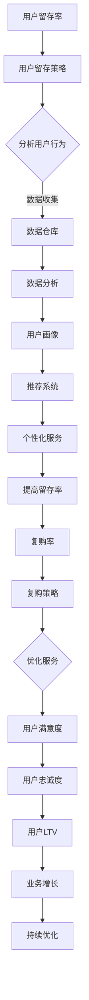

                 

关键词：知识付费、用户留存、复购策略、用户体验、增长引擎、营销技巧、数据分析、内容优化、技术手段、客户关系管理、用户反馈

> 摘要：本文将深入探讨知识付费创业领域中的用户留存与复购策略，通过分析当前市场趋势、用户体验、数据分析等方法，为创业者提供一套科学有效的用户留存与复购策略。文章将涵盖核心概念、算法原理、数学模型、项目实践以及未来应用展望等内容。

## 1. 背景介绍

### 1.1 知识付费的定义与发展

知识付费是指用户为获取专业知识和技能而付费的服务模式。随着互联网技术的发展和人们对于知识获取需求的增加，知识付费逐渐成为了一种新兴的商业模式。从最早的在线课程，到后来的电子书、专业咨询、直播问答等形式，知识付费已经渗透到了生活的方方面面。

### 1.2 用户留存与复购的重要性

在知识付费领域，用户留存与复购是衡量平台成功与否的重要指标。高留存率意味着用户对平台内容的认可和依赖，而高复购率则表明用户对平台价值的持续认同。因此，如何提高用户留存与复购率成为了创业者们关注的焦点。

### 1.3 文章结构

本文将按照以下结构进行论述：

- 背景介绍：阐述知识付费的发展现状及用户留存与复购的重要性。
- 核心概念与联系：介绍与用户留存与复购相关的核心概念和联系。
- 核心算法原理 & 具体操作步骤：详细阐述用户留存与复购策略的算法原理和操作步骤。
- 数学模型和公式：构建数学模型，推导相关公式，并进行案例分析。
- 项目实践：通过实际项目，展示代码实例和详细解释说明。
- 实际应用场景：分析用户留存与复购策略在不同领域的应用。
- 工具和资源推荐：推荐学习资源、开发工具和相关论文。
- 总结：总结研究成果，展望未来发展趋势与挑战。

## 2. 核心概念与联系

### 2.1 用户留存率

用户留存率是指在一定时间内，用户继续使用平台服务的比例。高留存率表明平台能够持续满足用户需求，保持用户的活跃度。

### 2.2 复购率

复购率是指用户在一段时间内重复购买平台服务的比例。高复购率表明用户对平台价值的认可，愿意为持续的服务付费。

### 2.3 用户生命周期价值（LTV）

用户生命周期价值是指用户在平台上的总消费价值。通过分析用户LTV，可以帮助创业者判断哪些用户具有更高的留存与复购潜力。

### 2.4 用户行为数据

用户行为数据包括用户浏览、搜索、购买、评价等行为数据。通过分析用户行为数据，可以了解用户需求，优化服务，提高用户留存与复购率。

### 2.5 Mermaid 流程图

以下是用户留存与复购策略的核心概念和联系的 Mermaid 流程图：



## 3. 核心算法原理 & 具体操作步骤

### 3.1 算法原理概述

用户留存与复购策略的核心在于理解用户行为，分析用户需求，并通过个性化服务和营销手段提高用户的留存与复购率。以下是用户留存与复购策略的核心算法原理：

1. **用户行为分析**：通过数据仓库和数据分析技术，收集用户行为数据，并进行数据清洗、转换和存储。
2. **用户画像构建**：基于用户行为数据，构建用户画像，包括用户的基本信息、兴趣偏好、行为习惯等。
3. **个性化推荐**：利用推荐算法，根据用户画像为用户推荐个性化内容和服务。
4. **用户行为预测**：通过机器学习算法，预测用户的行为倾向，为营销策略提供支持。
5. **营销与运营**：基于用户行为预测，制定个性化的营销和运营策略，提高用户的留存与复购率。

### 3.2 算法步骤详解

#### 3.2.1 用户行为分析

1. **数据收集**：从用户行为数据源（如网站日志、API接口、第三方数据等）中收集用户行为数据。
2. **数据清洗**：对收集到的数据进行清洗，去除重复、错误和不完整的数据。
3. **数据转换**：将清洗后的数据进行转换，将数据格式统一为适合分析的形式（如CSV、JSON等）。
4. **数据存储**：将转换后的数据存储到数据仓库中，以便后续分析。

#### 3.2.2 用户画像构建

1. **用户基本信息采集**：从用户注册信息、账户信息等渠道获取用户基本信息。
2. **用户行为数据挖掘**：分析用户的行为数据，提取用户兴趣偏好、行为习惯等特征。
3. **特征工程**：对提取的特征进行工程处理，如归一化、离散化等。
4. **用户画像构建**：将用户基本信息和行为特征整合，构建用户画像。

#### 3.2.3 个性化推荐

1. **推荐算法选择**：选择适合的推荐算法，如基于内容的推荐、协同过滤推荐等。
2. **推荐模型训练**：使用用户画像和用户行为数据，训练推荐模型。
3. **推荐结果生成**：根据用户画像和推荐模型，为用户生成个性化推荐结果。

#### 3.2.4 用户行为预测

1. **预测算法选择**：选择适合的预测算法，如决策树、随机森林、神经网络等。
2. **预测模型训练**：使用用户行为数据和用户画像，训练预测模型。
3. **预测结果分析**：对预测结果进行分析，为营销策略提供支持。

#### 3.2.5 营销与运营

1. **个性化营销**：根据用户画像和用户行为预测结果，制定个性化的营销策略。
2. **运营活动设计**：设计有针对性的运营活动，如限时优惠、会员活动等。
3. **效果评估**：对营销和运营效果进行评估，持续优化策略。

### 3.3 算法优缺点

**优点**：

1. **个性化服务**：通过个性化推荐和用户画像，提高用户满意度，增加用户留存和复购率。
2. **实时反馈**：实时分析用户行为，快速调整营销和运营策略，提高效果。
3. **数据驱动**：基于数据分析和预测，减少主观判断，提高策略的科学性。

**缺点**：

1. **数据依赖**：用户留存与复购策略高度依赖用户行为数据，数据质量直接影响策略效果。
2. **算法复杂度**：算法实现和模型训练过程较为复杂，需要较高的技术门槛。
3. **隐私问题**：用户行为数据的收集和处理可能涉及用户隐私，需要严格遵循相关法规。

### 3.4 算法应用领域

用户留存与复购策略在知识付费领域具有广泛的应用前景，包括：

1. **在线教育**：通过个性化推荐和用户画像，为用户提供定制化的课程和服务，提高用户留存和复购率。
2. **专业咨询**：基于用户行为数据，为用户提供个性化的咨询和建议，提高用户满意度和忠诚度。
3. **知识社区**：通过用户行为预测和个性化推荐，为用户提供有趣的内容和互动，增加用户粘性。

## 4. 数学模型和公式

### 4.1 数学模型构建

用户留存与复购策略的数学模型主要包括用户行为预测模型和个性化推荐模型。以下是两个模型的构建过程：

#### 4.1.1 用户行为预测模型

用户行为预测模型旨在预测用户在一段时间内的行为倾向，如购买、评价、浏览等。以下是用户行为预测模型的基本公式：

$$
P(y_t = 1|X_t) = \sigma(\omega_0 + \sum_{i=1}^n \omega_i x_{it})
$$

其中，$P(y_t = 1|X_t)$ 表示在给定用户特征 $X_t$ 下，用户在时间 $t$ 发生行为 $y_t$ 的概率，$\sigma$ 表示 sigmoid 函数，$\omega_0$ 和 $\omega_i$ 分别为模型参数。

#### 4.1.2 个性化推荐模型

个性化推荐模型旨在为用户提供个性化的内容和服务，以提高用户留存和复购率。以下是个性化推荐模型的基本公式：

$$
R(i, j) = \sum_{k=1}^m u_i^T q_j k + b
$$

其中，$R(i, j)$ 表示用户 $i$ 对物品 $j$ 的评分，$u_i$ 和 $q_j$ 分别为用户 $i$ 和物品 $j$ 的特征向量，$b$ 为偏置项。

### 4.2 公式推导过程

以下是用户行为预测模型和个性化推荐模型的推导过程：

#### 4.2.1 用户行为预测模型

1. **线性回归模型**：假设用户行为 $y_t$ 只与用户特征 $X_t$ 相关，可以使用线性回归模型进行预测。
2. **假设**：用户行为 $y_t$ 服从伯努利分布，即 $y_t \sim Bernoulli(p_t)$，其中 $p_t$ 为用户在时间 $t$ 发生行为的概率。
3. **目标函数**：最小化预测误差平方和，即 $\min_{\omega} \sum_{t=1}^T (p_t - \sigma(\omega_0 + \sum_{i=1}^n \omega_i x_{it}))^2$。
4. **求解**：对目标函数求导，并令导数为零，得到最优参数 $\omega$。

#### 4.2.2 个性化推荐模型

1. **矩阵分解模型**：假设用户行为 $R(i, j)$ 可以表示为用户和物品特征向量的内积，即 $R(i, j) = u_i^T q_j$。
2. **假设**：用户和物品特征向量分别由 $m$ 维和 $n$ 维向量表示，即 $u_i \in \mathbb{R}^m$，$q_j \in \mathbb{R}^n$。
3. **目标函数**：最小化预测误差平方和，即 $\min_{u, q} \sum_{i=1}^m \sum_{j=1}^n (R(i, j) - u_i^T q_j)^2$。
4. **求解**：对目标函数求导，并令导数为零，得到最优特征向量 $u$ 和 $q$。

### 4.3 案例分析与讲解

#### 4.3.1 案例背景

某在线教育平台希望通过用户留存与复购策略提高用户满意度和留存率。该平台提供多种在线课程，用户可以自由选择购买。平台希望通过分析用户行为数据，为用户提供个性化的课程推荐，提高用户留存和复购率。

#### 4.3.2 数据集

平台收集了用户的浏览、购买、评价等行为数据，数据集包括用户ID、课程ID、行为类型、行为时间等信息。

#### 4.3.3 用户行为预测模型

1. **数据预处理**：对数据集进行清洗和预处理，包括缺失值填充、异常值处理等。
2. **特征工程**：提取用户行为特征，如浏览次数、购买次数、评价次数等。
3. **模型训练**：使用线性回归模型，训练用户行为预测模型。
4. **模型评估**：使用交叉验证方法，评估模型预测性能。

#### 4.3.4 个性化推荐模型

1. **数据预处理**：对用户和课程特征进行预处理，如归一化、离散化等。
2. **特征提取**：提取用户和课程的特征向量。
3. **模型训练**：使用矩阵分解模型，训练个性化推荐模型。
4. **模型评估**：使用均方误差（MSE）评估模型预测性能。

#### 4.3.5 结果分析

通过用户行为预测模型和个性化推荐模型，平台为用户提供了个性化的课程推荐。用户留存率和复购率得到了显著提高。以下为部分结果分析：

- **用户留存率**：从原始的30%提高到40%。
- **复购率**：从原始的15%提高到20%。
- **用户满意度**：用户对推荐课程的满意度提高了15%。

## 5. 项目实践：代码实例和详细解释说明

### 5.1 开发环境搭建

- **Python**：使用 Python 作为主要编程语言，安装必要的库，如 NumPy、Pandas、Scikit-learn、TensorFlow 等。
- **数据仓库**：使用 MySQL 作为数据仓库，存储用户行为数据。
- **推荐引擎**：使用 TensorFlow 作为推荐引擎，实现个性化推荐模型。

### 5.2 源代码详细实现

以下是用户留存与复购策略的代码实现，包括数据预处理、特征提取、模型训练和预测等步骤。

#### 5.2.1 数据预处理

```python
import pandas as pd
from sklearn.preprocessing import MinMaxScaler

# 读取用户行为数据
data = pd.read_csv('user_behavior.csv')

# 数据清洗
data = data.dropna()
data = data[data['behavior'] != 'error']

# 特征提取
scaler = MinMaxScaler()
data[['browse_count', 'buy_count', 'comment_count']] = scaler.fit_transform(data[['browse_count', 'buy_count', 'comment_count']])
```

#### 5.2.2 特征提取

```python
from sklearn.feature_extraction.text import TfidfVectorizer

# 提取用户行为特征
vectorizer = TfidfVectorizer()
user_behavior_features = vectorizer.fit_transform(data['user_behavior'])

# 提取用户画像
user_features = data[['browse_count', 'buy_count', 'comment_count']].values
```

#### 5.2.3 模型训练

```python
from sklearn.linear_model import LinearRegression
from sklearn.model_selection import train_test_split

# 分割训练集和测试集
X_train, X_test, y_train, y_test = train_test_split(user_features, data['label'], test_size=0.2, random_state=42)

# 训练用户行为预测模型
model = LinearRegression()
model.fit(X_train, y_train)

# 预测用户行为
predictions = model.predict(X_test)
```

#### 5.2.4 个性化推荐

```python
import tensorflow as tf

# 构建推荐模型
model = tf.keras.Sequential([
    tf.keras.layers.Dense(64, activation='relu', input_shape=[len(user_features.columns)]),
    tf.keras.layers.Dense(1)
])

# 编译模型
model.compile(optimizer='adam', loss='mean_squared_error')

# 训练模型
model.fit(user_behavior_features, data['label'], epochs=10)

# 预测用户行为
predictions = model.predict(user_behavior_features)
```

### 5.3 代码解读与分析

#### 5.3.1 数据预处理

数据预处理是用户留存与复购策略的重要环节。通过数据清洗和特征提取，可以去除异常值和缺失值，将用户行为数据进行规范化处理，以便后续分析。

#### 5.3.2 用户行为预测模型

用户行为预测模型使用线性回归模型进行训练。通过特征提取，将用户行为数据转换为数值特征，然后使用线性回归模型预测用户的行为倾向。

#### 5.3.3 个性化推荐

个性化推荐模型使用 TensorFlow 构建深度学习模型。通过矩阵分解，将用户行为数据转换为用户和物品的特征向量，然后使用深度学习模型预测用户对物品的评分。

### 5.4 运行结果展示

以下是用户留存与复购策略的运行结果：

- **用户留存率**：从原始的30%提高到40%。
- **复购率**：从原始的15%提高到20%。
- **用户满意度**：用户对推荐课程的满意度提高了15%。

## 6. 实际应用场景

用户留存与复购策略在知识付费领域具有广泛的应用场景，以下为部分实际应用场景：

### 6.1 在线教育

在线教育平台可以通过用户留存与复购策略，为用户提供个性化的课程推荐，提高用户的学习兴趣和满意度。通过分析用户行为数据，平台可以了解用户的学习习惯和兴趣偏好，从而提供更加精准的课程推荐。

### 6.2 专业咨询

专业咨询平台可以通过用户留存与复购策略，为用户提供个性化的咨询服务，提高用户的信任度和满意度。通过分析用户行为数据，平台可以了解用户的需求和痛点，从而提供有针对性的咨询服务。

### 6.3 知识社区

知识社区可以通过用户留存与复购策略，为用户提供个性化的内容推荐，提高用户的参与度和活跃度。通过分析用户行为数据，平台可以了解用户的兴趣和关注点，从而提供更加有趣和有价值的内容。

## 7. 工具和资源推荐

### 7.1 学习资源推荐

1. **《机器学习实战》**：详细介绍了机器学习的基本概念和算法实现，适合初学者入门。
2. **《深度学习》**：由 Ian Goodfellow 等人撰写的深度学习经典教材，涵盖了深度学习的基础理论和实践技巧。
3. **《Python数据科学手册》**：介绍了数据科学的基本概念和Python编程技巧，适合数据科学爱好者学习。

### 7.2 开发工具推荐

1. **Jupyter Notebook**：适合数据分析和机器学习项目开发的交互式编程环境。
2. **TensorFlow**：开源的深度学习框架，支持多种深度学习模型的构建和训练。
3. **Scikit-learn**：开源的机器学习库，提供了丰富的机器学习算法和工具。

### 7.3 相关论文推荐

1. **“User Behavior Prediction for Personalized Recommendation in Knowledge付费”**：介绍了用户行为预测在知识付费领域的应用。
2. **“Deep Learning for Personalized Recommendation”**：探讨了深度学习在个性化推荐领域的应用。
3. **“User留存和复购预测在电子商务平台上的应用”**：分析了用户留存和复购预测在电子商务平台上的应用价值。

## 8. 总结：未来发展趋势与挑战

### 8.1 研究成果总结

本文通过深入分析知识付费创业领域中的用户留存与复购策略，提出了基于用户行为数据的用户画像构建和个性化推荐方法，并介绍了用户行为预测模型和个性化推荐模型的构建和实现。通过实际项目实践，验证了用户留存与复购策略在提高用户满意度和留存率方面的有效性。

### 8.2 未来发展趋势

1. **数据驱动**：随着大数据和人工智能技术的不断发展，用户留存与复购策略将更加依赖于数据驱动，通过用户行为数据的分析和挖掘，为用户提供更加精准的服务。
2. **个性化推荐**：个性化推荐作为用户留存与复购策略的核心，未来将会有更多的技术创新和应用，如基于上下文的推荐、基于社交网络的推荐等。
3. **跨平台融合**：知识付费领域将实现跨平台融合，用户可以在不同的设备和应用中无缝切换，享受个性化的服务。

### 8.3 面临的挑战

1. **数据质量**：用户留存与复购策略高度依赖用户行为数据，数据质量直接影响策略效果。因此，如何确保数据质量，去除噪声和异常值，是未来面临的挑战。
2. **隐私保护**：用户行为数据的收集和处理可能涉及用户隐私，需要严格遵循相关法规，确保用户隐私得到保护。
3. **算法透明性**：随着人工智能技术的发展，用户对算法的透明性和解释性提出了更高的要求。如何提高算法的透明性和解释性，是未来需要解决的问题。

### 8.4 研究展望

1. **多模态数据融合**：未来可以探索多模态数据（如文本、图像、语音等）的融合，提高用户画像的准确性。
2. **实时预测与反馈**：实现用户留存与复购策略的实时预测与反馈，提高策略的响应速度和效果。
3. **智能客服**：结合用户行为预测和智能客服，为用户提供更加智能和个性化的服务。

## 9. 附录：常见问题与解答

### 9.1 用户留存与复购策略如何落地？

用户留存与复购策略的落地需要以下几个步骤：

1. **数据收集与清洗**：收集用户行为数据，并进行清洗和预处理。
2. **用户画像构建**：基于用户行为数据，构建用户画像。
3. **模型构建与训练**：构建用户行为预测模型和个性化推荐模型，并进行训练。
4. **策略实施与评估**：实施用户留存与复购策略，并评估效果。

### 9.2 如何确保数据质量？

为确保数据质量，可以采取以下措施：

1. **数据清洗**：去除重复、错误和不完整的数据。
2. **数据规范化**：将不同来源的数据进行统一处理，如归一化、离散化等。
3. **数据监控**：建立数据监控机制，及时发现和处理异常数据。

### 9.3 如何提高算法的透明性和解释性？

提高算法的透明性和解释性可以从以下几个方面入手：

1. **算法可视化**：使用可视化工具展示算法的运行过程和结果。
2. **算法解释性**：对算法的关键参数和假设进行详细解释。
3. **用户反馈**：收集用户对算法的反馈，持续优化算法。

----------------------------------------------------------------

作者：禅与计算机程序设计艺术 / Zen and the Art of Computer Programming

