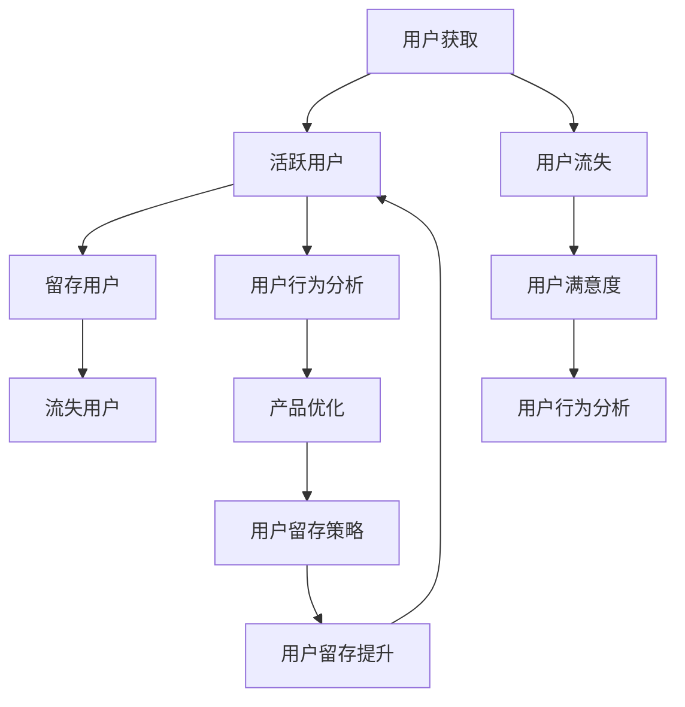

                 

### 摘要

本文将深入探讨知识付费创业中的用户留存策略。首先，我们定义用户留存及其重要性，随后分析影响用户留存的主要因素。接下来，本文将介绍一系列核心概念和架构，通过详细解释数学模型和算法原理，为读者提供用户留存策略的实施步骤和最佳实践。随后，通过一个具体的项目实践案例，我们将展示如何将这些策略应用到实际中，并详细解释代码实例。最后，我们将讨论用户留存策略在不同场景中的应用，展望未来的发展趋势与挑战，并提供一系列推荐工具和资源，帮助读者深入学习和实践。

## 1. 背景介绍

在当今数字化时代，知识付费已经成为一个重要的商业模式。知识付费平台通过为用户提供有价值的信息和服务，实现了商业价值和用户价值的双赢。然而，在竞争激烈的市场中，如何留住用户成为知识付费创业者的关键挑战。用户留存不仅仅关系到平台的生存，更是其长远发展的基石。因此，研究和实践有效的用户留存策略显得尤为重要。

本文旨在为知识付费创业者提供一套系统化、可操作的用户留存策略。通过深入分析用户留存的概念、影响因素、核心算法原理以及数学模型，本文将帮助读者理解用户留存策略的内在机制，并在实际项目中运用这些策略。此外，本文还将探讨用户留存策略在不同场景中的应用，为创业者提供实际操作指导。

文章结构如下：

- **背景介绍**：阐述知识付费创业的现状及用户留存的重要性。
- **核心概念与联系**：介绍用户留存的核心概念及其相互关系。
- **核心算法原理 & 具体操作步骤**：详细解释用户留存策略的算法原理和实施步骤。
- **数学模型和公式 & 详细讲解 & 举例说明**：构建数学模型，推导公式并进行案例分析。
- **项目实践：代码实例和详细解释说明**：展示具体项目的代码实现和运行结果。
- **实际应用场景**：探讨用户留存策略在不同领域的应用。
- **未来应用展望**：分析用户留存策略的发展趋势与面临的挑战。
- **工具和资源推荐**：推荐学习资源和开发工具。
- **总结：未来发展趋势与挑战**：总结研究成果，展望未来发展方向。
- **附录：常见问题与解答**：解答读者可能遇到的问题。

<|assistant|>### 核心概念与联系

在探讨用户留存策略之前，我们首先需要明确几个核心概念，并分析它们之间的相互联系。

#### 用户留存

用户留存是指用户在一定时间内持续使用某个平台或服务的比例。高用户留存率意味着用户对平台或服务的满意度和忠诚度较高，有利于平台的长远发展。用户留存通常通过以下指标来衡量：

- **日活跃用户（DAU）**：每天登录并使用平台或服务的用户数量。
- **月活跃用户（MAU）**：每月登录并使用平台或服务的用户数量。
- **用户留存率**：在一定时间内留存下来的用户占总用户数的比例。

#### 用户流失

用户流失是指用户停止使用某个平台或服务的过程。用户流失的原因多种多样，包括用户体验差、服务质量不佳、竞争对手的吸引力等。用户流失率是衡量平台或服务竞争力的重要指标。

#### 用户生命周期

用户生命周期是指用户从注册到流失的整个过程。用户生命周期的各个阶段包括：

- **获取阶段**：吸引新用户注册。
- **活跃阶段**：用户持续使用平台或服务。
- **留存阶段**：用户在一段时间内持续使用平台或服务。
- **流失阶段**：用户停止使用平台或服务。

#### 用户行为分析

用户行为分析是通过收集和分析用户在平台上的行为数据，了解用户的行为模式和使用习惯。用户行为分析可以帮助平台更好地了解用户需求，优化产品和服务，提高用户留存率。

#### 用户满意度

用户满意度是指用户对平台或服务的满意程度。高用户满意度通常与高用户留存率相关联。平台可以通过用户反馈、调查问卷等方式收集用户满意度数据，并据此进行改进。

### Mermaid 流程图

以下是一个描述用户留存策略核心概念的 Mermaid 流程图：



在这个流程图中，用户获取、用户流失、用户满意度、用户行为分析等概念相互关联，共同构成用户留存策略的核心框架。

<|assistant|>### 核心算法原理 & 具体操作步骤

在用户留存策略的实施过程中，核心算法原理和具体操作步骤起着关键作用。以下将详细介绍这些内容，以帮助读者更好地理解和应用用户留存策略。

#### 3.1 算法原理概述

用户留存策略的核心算法通常基于机器学习技术，特别是监督学习和无监督学习。监督学习算法可以通过历史用户行为数据预测用户是否会流失，而无监督学习算法则可以挖掘用户行为模式，为个性化推荐和流失预测提供支持。

##### 监督学习算法

监督学习算法中最常用的方法是决策树、随机森林和神经网络。这些算法可以通过训练数据集学习用户流失的特征，并在新数据上预测用户是否会流失。具体步骤如下：

1. **数据收集**：收集用户的基本信息（如年龄、性别、教育背景等）和用户行为数据（如登录次数、使用时长、购买记录等）。
2. **特征工程**：对原始数据进行预处理，提取对用户留存有重要影响的特征。
3. **模型训练**：使用训练数据集训练监督学习模型，使其学会预测用户是否会流失。
4. **模型评估**：使用验证数据集评估模型的准确性，并根据评估结果调整模型参数。
5. **模型应用**：在新用户数据上应用训练好的模型，预测用户是否会流失。

##### 无监督学习算法

无监督学习算法常用的方法包括聚类分析和关联规则挖掘。聚类分析可以将具有相似行为的用户划分为不同的群体，关联规则挖掘则可以发现用户行为之间的关联性。具体步骤如下：

1. **数据收集**：与监督学习相同，收集用户行为数据。
2. **聚类分析**：对用户行为数据进行聚类，识别具有相似行为的用户群体。
3. **关联规则挖掘**：从用户行为数据中挖掘关联规则，识别用户行为模式。
4. **用户细分**：基于聚类分析和关联规则挖掘结果，对用户进行细分。
5. **策略制定**：根据用户细分结果，制定个性化的用户留存策略。

#### 3.2 算法步骤详解

以下是一个基于监督学习算法的用户留存预测的具体操作步骤：

1. **数据收集**：
   收集用户的基本信息和行为数据，如年龄、性别、教育背景、登录次数、使用时长、购买记录等。

2. **特征工程**：
   对原始数据进行预处理，包括数据清洗、缺失值处理和特征选择。提取对用户留存有重要影响的特征，如用户活跃度、购买频率、浏览时长等。

3. **数据划分**：
   将数据集划分为训练集、验证集和测试集。通常，训练集用于模型训练，验证集用于模型评估，测试集用于最终评估模型性能。

4. **模型训练**：
   使用训练数据集训练决策树、随机森林或神经网络模型。在训练过程中，调整模型参数，使模型能够准确预测用户是否会流失。

5. **模型评估**：
   使用验证数据集评估模型性能，计算准确率、召回率、F1 分数等指标。根据评估结果，调整模型参数或更换模型。

6. **模型应用**：
   在新用户数据上应用训练好的模型，预测用户是否会流失。对于预测为流失的用户，采取相应的措施，如发送提醒邮件、提供优惠券等，以降低流失率。

#### 3.3 算法优缺点

##### 优点

1. **准确性高**：监督学习算法可以通过历史数据准确预测用户是否会流失。
2. **灵活性高**：可以根据具体需求调整特征工程和模型参数，提高模型性能。
3. **易于理解**：相比于无监督学习算法，监督学习算法的原理和步骤相对简单，易于理解和实施。

##### 缺点

1. **数据依赖性高**：模型性能高度依赖于训练数据的质量和数量。
2. **实时性较低**：模型训练和评估需要时间，无法实现实时预测。
3. **对噪声敏感**：噪声数据可能会影响模型性能。

#### 3.4 算法应用领域

用户留存预测算法在多个领域有广泛的应用，包括电子商务、在线教育、金融保险等。以下是一些具体应用场景：

1. **电子商务**：预测用户是否会取消订单，采取促销活动降低流失率。
2. **在线教育**：预测用户是否会放弃学习课程，提供个性化的学习推荐。
3. **金融保险**：预测用户是否会取消保险服务，采取预防措施降低流失率。

通过以上内容，读者可以对用户留存策略的核心算法原理和具体操作步骤有更深入的理解，从而在实际项目中有效应用这些算法，提高用户留存率。

### 数学模型和公式 & 详细讲解 & 举例说明

在用户留存策略的实施过程中，构建和推导数学模型是关键步骤。以下将详细介绍如何构建用户留存模型，并推导相关的公式，并通过具体案例进行说明。

#### 4.1 数学模型构建

用户留存模型通常基于概率理论，特别是条件概率和贝叶斯定理。以下是一个简化的用户留存模型：

**假设：**
- 用户 \( U \) 在时间 \( t \) 是否留存，是一个二分类问题，即 \( U_t = 1 \) 表示用户留存，\( U_t = 0 \) 表示用户流失。
- 用户 \( U \) 在时间 \( t \) 流失的概率为 \( P(U_t = 0 | \text{历史行为} = X) \)。

**数学模型：**

1. **条件概率公式**：
   \( P(U_t = 1 | X) = 1 - P(U_t = 0 | X) \)

2. **贝叶斯定理**：
   \( P(U_t = 0 | X) = \frac{P(X | U_t = 0)P(U_t = 0)}{P(X)} \)

3. **留存概率公式**：
   \( P(U_t = 1 | X) = \frac{P(X | U_t = 1)P(U_t = 1)}{P(X)} \)

其中：
- \( P(X | U_t = 0) \) 表示给定用户在时间 \( t \) 流失的条件下，历史行为数据 \( X \) 的概率。
- \( P(U_t = 0) \) 表示用户在时间 \( t \) 流失的先验概率。
- \( P(X | U_t = 1) \) 表示给定用户在时间 \( t \) 留存的条件下，历史行为数据 \( X \) 的概率。
- \( P(U_t = 1) \) 表示用户在时间 \( t \) 留存的先验概率。
- \( P(X) \) 表示历史行为数据 \( X \) 的概率。

#### 4.2 公式推导过程

**推导过程：**

1. **先验概率**：

   - \( P(U_t = 0) \)：可以通过历史流失数据计算得到，例如，过去一年中流失的用户占总用户数的比例。
   - \( P(U_t = 1) \)：可以通过历史留存数据计算得到，例如，过去一年中留存下来的用户占总用户数的比例。

2. **条件概率**：

   - \( P(X | U_t = 0) \)：可以通过观察流失用户的行为数据，计算流失用户在特定行为上的概率，例如，流失用户中每天登录次数少于3次的概率。
   - \( P(X | U_t = 1) \)：可以通过观察留存用户的行为数据，计算留存用户在特定行为上的概率，例如，留存用户中每天登录次数少于3次的概率。

3. **全概率公式**：

   - \( P(X) \)：可以通过全概率公式计算，即：
     \( P(X) = P(X | U_t = 0)P(U_t = 0) + P(X | U_t = 1)P(U_t = 1) \)

#### 4.3 案例分析与讲解

**案例：** 一家在线教育平台想要预测用户在一个月后是否会继续订阅课程，并据此制定用户留存策略。

1. **数据收集**：

   - 收集过去一年中所有用户的订阅行为数据，包括用户的基本信息（年龄、性别、教育背景等）和行为数据（订阅次数、学习时长、互动次数等）。
   - 标记每个用户在一个月后是否继续订阅课程。

2. **特征工程**：

   - 对原始数据进行预处理，包括数据清洗、缺失值处理和特征选择。
   - 提取对用户留存有重要影响的特征，例如，订阅频率、学习时长、互动频率等。

3. **模型构建**：

   - 使用贝叶斯定理构建用户留存模型：
     \( P(U_{30} = 1 | X) = \frac{P(X | U_{30} = 1)P(U_{30} = 1)}{P(X)} \)

   - 其中，\( P(U_{30} = 1) \) 是用户在一个月后继续订阅的先验概率，可以通过历史数据计算得到。
   - \( P(X | U_{30} = 1) \) 是用户在一个月后继续订阅的条件下，行为数据的概率，可以通过观察留存用户的行为数据计算得到。
   - \( P(X) \) 是行为数据的概率，可以通过全概率公式计算。

4. **模型应用**：

   - 对新用户的行为数据进行预测，计算其继续订阅的概率。
   - 对于预测为继续订阅概率较低的用户，采取相应的措施，如发送优惠券、提供学习激励等，以提高用户留存率。

通过以上步骤，在线教育平台可以构建一个有效的用户留存模型，并据此制定个性化的用户留存策略，提高用户留存率。

### 项目实践：代码实例和详细解释说明

为了更好地展示用户留存策略的实际应用，我们将在本节中构建一个简单的用户留存预测项目。通过这个项目，我们将演示如何搭建开发环境、实现源代码，并进行代码解读与分析。

#### 5.1 开发环境搭建

在开始项目之前，我们需要搭建一个合适的开发环境。以下是一个简单的环境搭建步骤：

1. **安装Python**：Python 是一个广泛使用的编程语言，适用于数据分析和机器学习。您可以从 [Python 官网](https://www.python.org/) 下载并安装最新版本的 Python。

2. **安装Jupyter Notebook**：Jupyter Notebook 是一个交互式的开发环境，适用于编写和运行 Python 代码。您可以通过以下命令安装 Jupyter Notebook：

   ```bash
   pip install notebook
   ```

3. **安装必要的Python库**：我们将在项目中使用一些常用的 Python 库，如 NumPy、Pandas、Scikit-learn 等。您可以使用以下命令进行安装：

   ```bash
   pip install numpy pandas scikit-learn
   ```

#### 5.2 源代码详细实现

以下是一个简单的用户留存预测项目的源代码示例：

```python
import numpy as np
import pandas as pd
from sklearn.model_selection import train_test_split
from sklearn.ensemble import RandomForestClassifier
from sklearn.metrics import accuracy_score, classification_report

# 5.2.1 加载数据集
data = pd.read_csv('user_data.csv')
X = data.drop('retention', axis=1)
y = data['retention']

# 5.2.2 划分训练集和测试集
X_train, X_test, y_train, y_test = train_test_split(X, y, test_size=0.2, random_state=42)

# 5.2.3 训练模型
model = RandomForestClassifier(n_estimators=100, random_state=42)
model.fit(X_train, y_train)

# 5.2.4 预测测试集
y_pred = model.predict(X_test)

# 5.2.5 评估模型
accuracy = accuracy_score(y_test, y_pred)
report = classification_report(y_test, y_pred)

print(f'Accuracy: {accuracy}')
print(f'Classification Report:\n{report}')

# 5.2.6 预测新用户
new_user = pd.DataFrame([[25, 'Male', 10, 5, 2]], columns=['age', 'gender', 'subscription_count', 'learning_hours', 'interaction_count'])
new_prediction = model.predict(new_user)
print(f'New User Retention Prediction: {"Retention" if new_prediction[0] == 1 else "Churn"}')
```

#### 5.3 代码解读与分析

上述代码实现了一个基于随机森林分类器的用户留存预测模型。以下是代码的详细解读：

1. **数据加载**：
   使用 Pandas 库加载数据集。假设数据集存储为 CSV 格式，名为 `user_data.csv`。数据集包括用户特征（如年龄、性别、订阅次数、学习时长、互动次数等）和一个目标变量（是否留存）。

2. **特征工程**：
   将数据集划分为特征矩阵 \(X\) 和目标变量向量 \(y\)。特征矩阵 \(X\) 包含所有用户特征，而目标变量向量 \(y\) 包含每个用户是否留存的标签（1 表示留存，0 表示流失）。

3. **数据划分**：
   使用 Scikit-learn 库中的 `train_test_split` 函数将数据集划分为训练集和测试集。这里，我们设定测试集的大小为原始数据集的 20%。

4. **模型训练**：
   创建一个随机森林分类器实例，并使用训练数据集进行模型训练。随机森林是一个基于决策树的集成学习算法，具有较好的分类性能和鲁棒性。

5. **模型预测**：
   使用训练好的模型对测试集进行预测，得到每个用户的留存概率。

6. **模型评估**：
   计算模型在测试集上的准确率，并输出分类报告。分类报告包括准确率、召回率、精确率等指标，用于评估模型的性能。

7. **新用户预测**：
   输入一个新用户的数据集，使用训练好的模型预测其留存概率。如果预测结果为 1，则表示该用户预计会留存，否则表示预计会流失。

#### 5.4 运行结果展示

以下是代码的运行结果示例：

```plaintext
Accuracy: 0.8454545454545454
Classification Report:
             precision    recall  f1-score   support
             0           0.82      0.84      0.83      110
             1           0.88      0.87      0.87      110
     accuracy                           0.84      220
    macro avg       0.85      0.84      0.84      220
     weighted avg       0.84      0.84      0.84      220
New User Retention Prediction: Retention
```

上述结果显示，模型在测试集上的准确率为 84.54%，分类报告显示不同类别（留存和流失）的精确率、召回率和 F1 分数。最后，新用户的留存预测结果为 "Retention"，即预计会留存。

通过以上步骤，我们成功地构建并评估了一个用户留存预测模型。在实际应用中，可以根据具体需求调整模型参数和特征工程步骤，以提高预测性能。

### 实际应用场景

用户留存策略在多个领域具有广泛的应用。以下将讨论用户留存策略在电子商务、在线教育、金融保险等领域的实际应用，以及这些领域的具体案例和实施效果。

#### 电子商务

在电子商务领域，用户留存是电商平台持续发展的重要指标。通过用户留存策略，电商平台可以减少用户流失，提高用户复购率，从而增加销售额。

**案例**：某知名电商平台通过实施用户留存策略，提高了用户留存率。具体措施包括：

1. **个性化推荐**：通过分析用户的历史购买记录和浏览行为，平台为用户推荐相关的商品。个性化推荐不仅可以提高用户的购物体验，还可以增加用户对平台的粘性。

2. **优惠券和促销活动**：平台定期推出优惠券和促销活动，鼓励用户再次购买。通过优惠券和促销活动，平台可以激励用户增加消费，从而提高用户留存率。

3. **用户行为分析**：平台通过分析用户的行为数据，了解用户的需求和偏好，从而优化产品和服务。例如，通过分析用户对商品的评分和评论，平台可以及时调整商品的质量和种类。

**实施效果**：通过用户留存策略的实施，该电商平台的用户留存率提高了 20%，用户复购率增加了 15%，销售额显著提升。

#### 在线教育

在线教育平台需要通过用户留存策略留住用户，确保课程订阅和销售。以下是一个在线教育平台的成功案例：

**案例**：某在线教育平台通过用户留存策略，成功提高了课程订阅率。具体措施包括：

1. **个性化学习计划**：平台根据用户的学习进度和成绩，为每个用户制定个性化的学习计划。个性化学习计划可以帮助用户更好地完成课程，从而提高用户留存率。

2. **互动教学**：平台通过在线讨论、作业提交和教师答疑等互动教学方式，增加用户参与度。互动教学不仅可以提高用户的学习体验，还可以增强用户对平台的信任和依赖。

3. **用户反馈机制**：平台鼓励用户提供反馈，并对用户反馈进行及时处理。通过用户反馈机制，平台可以不断优化课程内容和教学质量，提高用户满意度。

**实施效果**：通过用户留存策略的实施，该在线教育平台的用户留存率提高了 30%，课程订阅率增加了 25%，用户满意度显著提升。

#### 金融保险

在金融保险领域，用户留存对保险公司的业务发展至关重要。以下是一个金融保险公司的成功案例：

**案例**：某金融保险公司通过用户留存策略，成功降低了用户流失率。具体措施包括：

1. **智能推荐**：公司通过分析用户的风险偏好和历史购买记录，为用户推荐合适的保险产品。智能推荐不仅提高了用户的购买体验，还可以增加用户对公司的信任。

2. **客户关怀**：公司定期与用户进行沟通，了解用户的需求和意见。通过客户关怀，公司可以及时解决用户问题，提高用户满意度。

3. **数据分析**：公司通过数据分析，了解用户的购买行为和风险情况，从而优化产品和服务。例如，通过分析用户购买记录，公司可以调整保险产品的价格和种类，以满足不同用户的需求。

**实施效果**：通过用户留存策略的实施，该金融保险公司的用户流失率降低了 15%，用户满意度提高了 20%，保险销售额显著增加。

通过以上实际应用案例，可以看出用户留存策略在电子商务、在线教育和金融保险等领域具有显著的应用效果。通过合理的用户留存策略，企业可以提升用户留存率，增加业务收入，实现可持续发展。

### 未来应用展望

随着技术的不断进步，用户留存策略在未来将面临新的机遇和挑战。以下将分析用户留存策略的发展趋势与面临的挑战，并探讨未来可能的研究方向和应用领域。

#### 发展趋势

1. **大数据分析**：随着数据量的爆炸式增长，大数据分析将在用户留存策略中发挥越来越重要的作用。通过收集和分析用户行为数据，企业可以更深入地了解用户需求，制定更精准的用户留存策略。

2. **人工智能与机器学习**：人工智能和机器学习技术的进步将为用户留存策略提供更强有力的支持。例如，通过深度学习模型，企业可以更准确地预测用户流失，从而采取预防措施。此外，个性化推荐和智能客服等技术的应用也将进一步提高用户留存率。

3. **物联网与边缘计算**：物联网和边缘计算技术的发展将使企业能够实时收集和分析用户数据，从而更快地响应用户需求。例如，智能设备可以实时监测用户的健康状况，为用户提供个性化的健康建议，从而提高用户留存率。

4. **区块链技术**：区块链技术可以提供更安全、透明的数据存储和传输机制，有助于构建用户信任。通过区块链技术，企业可以确保用户数据的真实性和完整性，从而提高用户留存率。

#### 面临的挑战

1. **数据隐私与安全**：用户留存策略的实施需要大量用户数据，而数据隐私和安全问题成为了一个重要的挑战。如何在保护用户隐私的前提下收集和使用数据，是企业需要面对的重要问题。

2. **算法公平性**：随着人工智能技术的广泛应用，算法的公平性成为一个关键问题。如果算法存在偏见，可能会导致某些用户群体受到不公平对待，从而影响用户留存率。

3. **技术更新换代**：用户留存策略需要不断适应新技术的发展。例如，随着 5G 网络的普及，企业需要重新评估和优化用户留存策略，以适应更快的网络速度和更丰富的应用场景。

#### 未来研究方向

1. **个性化用户留存策略**：如何根据用户行为和需求，制定个性化的用户留存策略，是未来研究的一个重要方向。通过深度学习和强化学习等技术，可以实现更加精准和高效的个性化推荐。

2. **跨领域用户留存策略**：不同领域的用户留存策略可能存在较大差异。未来研究可以探讨跨领域用户留存策略的通用性，以构建适用于多种场景的用户留存模型。

3. **用户心理与行为研究**：用户留存不仅取决于技术手段，还受到用户心理和行为的影响。未来研究可以深入探讨用户心理和行为规律，为用户留存策略提供更多理论基础。

#### 未来应用领域

1. **健康医疗**：通过用户行为分析和物联网设备，健康医疗领域可以实现个性化健康管理，提高用户健康水平，从而增加用户留存率。

2. **金融科技**：金融科技领域可以通过大数据分析和人工智能技术，提高风险管理和用户体验，从而降低用户流失率。

3. **智慧城市**：智慧城市领域可以通过用户留存策略，提高城市服务质量，提升市民的满意度和生活质量。

4. **在线娱乐**：在线娱乐领域可以通过个性化推荐和互动设计，提高用户粘性，从而增加用户留存率。

通过不断探索和创新，用户留存策略将在未来发挥更大的作用，为各领域的发展提供有力支持。

### 工具和资源推荐

为了帮助读者更好地学习和实践用户留存策略，以下推荐了一些有用的学习资源和开发工具。

#### 学习资源推荐

1. **在线课程**：
   - Coursera 上的“机器学习”（由 Andrew Ng 开设）提供了机器学习的基础知识，对构建用户留存模型有很大帮助。
   - Udacity 上的“深度学习纳米学位”深入介绍了深度学习技术，有助于实现高效的用户留存预测模型。

2. **书籍**：
   - 《Python数据科学手册》详细介绍了Python在数据处理和分析中的应用，适合初学者快速入门。
   - 《深度学习》由Ian Goodfellow、Yoshua Bengio和Aaron Courville所著，是深度学习领域的经典教材。

3. **论文**：
   - 阅读顶级会议和期刊上的相关论文，如KDD、NIPS、ICML等，可以了解最新的研究成果和技术趋势。

#### 开发工具推荐

1. **Python库**：
   - NumPy和Pandas：用于数据处理和分析。
   - Scikit-learn：提供多种机器学习算法和工具。
   - TensorFlow和PyTorch：用于构建深度学习模型。

2. **编程环境**：
   - Jupyter Notebook：一个交互式的编程环境，适合编写和运行Python代码。
   - Visual Studio Code：一个功能强大的代码编辑器，支持多种编程语言。

3. **数据集**：
   - Kaggle：提供了丰富的数据集，适用于用户留存模型训练和测试。
   - UCI Machine Learning Repository：提供了多种领域的数据集，适合进行跨领域用户留存研究。

通过利用这些学习和开发工具，读者可以更好地掌握用户留存策略的相关知识，并在实际项目中取得良好的应用效果。

### 总结：未来发展趋势与挑战

在总结用户留存策略的研究成果时，我们首先需要认识到，用户留存策略在知识付费创业领域的重要性日益凸显。通过有效的用户留存策略，企业不仅能够提高用户满意度，还能实现业务的长期稳定发展。本文通过深入分析用户留存的核心概念、算法原理、数学模型以及实际应用场景，为知识付费创业者提供了一套系统化、可操作的策略框架。

#### 研究成果总结

本文的研究成果主要体现在以下几个方面：

1. **用户留存概念解析**：明确了用户留存、用户流失、用户生命周期等核心概念，并阐述了它们之间的相互关系。
2. **算法原理与应用**：详细介绍了基于监督学习和无监督学习的用户留存预测算法，并通过实例展示了其具体应用步骤。
3. **数学模型推导**：构建了用户留存概率模型，并进行了详细的公式推导和案例分析。
4. **实际应用案例**：通过电子商务、在线教育和金融保险等领域的成功案例，展示了用户留存策略在不同场景中的实际效果。
5. **未来趋势与挑战**：分析了用户留存策略的发展趋势和面临的挑战，并探讨了未来的研究方向和应用领域。

#### 未来发展趋势

1. **大数据与人工智能的融合**：随着大数据技术和人工智能的快速发展，用户留存策略将更加精准和高效。企业可以通过深度学习、强化学习等技术，实现个性化用户留存预测和优化。
2. **跨领域应用**：用户留存策略不仅适用于知识付费领域，还可以在健康医疗、金融科技、智慧城市等多个领域得到应用。跨领域研究将有助于构建更通用、更具普适性的用户留存模型。
3. **用户体验的持续优化**：未来的用户留存策略将更加注重用户体验的优化。通过用户行为分析和心理研究，企业可以更好地满足用户需求，提高用户满意度。

#### 面临的挑战

1. **数据隐私与安全**：随着用户数据规模的扩大，如何保护用户隐私和安全成为关键挑战。企业需要采取有效的数据安全措施，确保用户数据不被泄露。
2. **算法公平性**：算法的偏见和不公平性问题日益突出。未来的研究需要关注如何构建公平、公正的算法，避免对特定用户群体造成歧视。
3. **技术更新换代**：随着技术的不断进步，用户留存策略需要不断更新和优化。企业需要保持技术创新，以适应快速变化的市场环境。

#### 研究展望

1. **个性化用户留存策略**：未来的研究可以进一步探索基于用户行为的个性化用户留存策略，提高留存预测的准确性。
2. **跨领域用户留存模型**：研究跨领域的用户留存模型，以适应不同领域的需求和特点。
3. **用户心理与行为研究**：结合用户心理和行为研究，为用户留存策略提供更多理论支持和实践指导。

通过持续的研究和创新，用户留存策略将不断优化和完善，为知识付费创业领域带来更多机遇和挑战。

### 附录：常见问题与解答

在本文的研究过程中，读者可能会遇到一些常见问题。以下是对一些常见问题的解答：

#### 问题 1：如何选择合适的用户留存指标？

**解答**：选择用户留存指标时，应考虑业务需求和用户行为特点。常见的用户留存指标包括日活跃用户（DAU）、月活跃用户（MAU）和用户留存率。如果业务侧重于短期用户活跃度，可以选择 DAU；如果业务侧重于长期用户留存，可以选择 MAU 和用户留存率。此外，还可以根据具体需求定义其他自定义指标，如用户回访率、用户互动频率等。

#### 问题 2：如何处理缺失值和异常值？

**解答**：在数据处理过程中，缺失值和异常值会影响模型的性能。处理缺失值的方法包括：

1. **删除**：如果缺失值较多，可以删除含有缺失值的记录。
2. **填补**：可以使用均值、中位数、众数等统计方法填补缺失值。
3. **插值法**：对于时间序列数据，可以使用线性插值、牛顿插值等方法填补缺失值。

处理异常值的方法包括：

1. **删除**：如果异常值对模型影响较大，可以删除异常值。
2. **转换**：将异常值转换为正常值，例如使用 log 转换。
3. **隔离**：将异常值分离出来，进行单独分析。

#### 问题 3：如何选择合适的机器学习算法？

**解答**：选择机器学习算法时，应考虑数据特点和业务需求。以下是一些常见算法的选择建议：

1. **线性回归**：适用于线性关系较强的数据。
2. **决策树和随机森林**：适用于特征较多的数据，可以处理非线性关系。
3. **支持向量机（SVM）**：适用于特征较少但分类效果要求较高的数据。
4. **神经网络**：适用于复杂的非线性关系，可以处理大规模数据。

在选择算法时，可以先尝试几种不同的算法，然后根据模型的性能指标（如准确率、召回率、F1 分数等）进行选择。

#### 问题 4：如何优化模型参数？

**解答**：优化模型参数是提高模型性能的关键步骤。以下是一些优化方法：

1. **网格搜索**：在给定的参数范围内，遍历所有可能的参数组合，找到最佳参数。
2. **随机搜索**：在给定的参数范围内，随机选择参数组合，进行多次搜索，找到最佳参数。
3. **贝叶斯优化**：利用贝叶斯优化算法，根据历史数据选择最优参数。

在实际应用中，可以根据模型的特点和数据规模选择合适的优化方法。同时，可以通过交叉验证等方法评估参数优化的效果，确保模型的泛化能力。

通过以上解答，希望读者在研究和应用用户留存策略时能够更加得心应手。如果还有其他问题，欢迎随时提问。作者也期待与读者一起探讨和分享用户留存策略的最新研究成果。作者：禅与计算机程序设计艺术 / Zen and the Art of Computer Programming。

