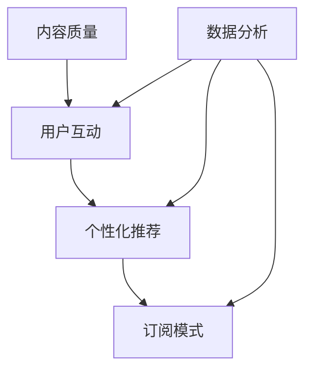

                 

 在当今数字时代，知识付费作为一种新兴的商业模式，正日益受到创业者的关注。知识付费不仅为用户提供有价值的内容，还为企业带来了可观的收益。然而，如何在激烈的市场竞争中留住用户，成为知识付费创业领域的关键问题。本文将深入探讨用户留存策略，帮助知识付费创业者更好地把握市场机遇。

## 关键词

- **知识付费**
- **用户留存**
- **创业策略**
- **用户体验**
- **数据分析**

## 摘要

本文首先介绍了知识付费的概念及其市场现状，随后分析了用户留存的重要性。接着，文章详细阐述了提升用户留存的核心策略，包括内容质量、用户互动、个性化推荐、订阅模式等方面的策略。最后，文章总结了当前用户留存策略的不足和未来发展的方向。

## 1. 背景介绍

### 1.1 知识付费的起源与发展

知识付费起源于互联网时代的信息爆炸，人们意识到获取高质量知识内容需要付出一定的经济代价。随着移动互联网和在线教育的普及，知识付费市场迅速发展。用户在知识付费平台可以获取到专业的知识、技能培训、在线课程、专业咨询等服务。

### 1.2 知识付费的市场现状

目前，知识付费市场主要分布在在线教育、职业技能培训、兴趣爱好等领域。随着用户消费观念的转变和在线支付的普及，知识付费市场呈现出快速增长的趋势。然而，市场也面临着内容质量参差不齐、用户留存率低等问题。

### 1.3 用户留存的重要性

用户留存是衡量知识付费平台成功与否的关键指标。高用户留存率意味着平台能够持续吸引用户，提高平台的活跃度和品牌影响力。同时，高用户留存率还能降低获客成本，提高用户生命周期价值。

## 2. 核心概念与联系

### 2.1 用户留存策略概述

用户留存策略是指通过一系列手段和措施，提高用户在知识付费平台上的活跃度和忠诚度。核心概念包括内容质量、用户互动、个性化推荐、订阅模式等。

### 2.2 用户留存策略联系图



## 3. 核心算法原理 & 具体操作步骤

### 3.1 算法原理概述

用户留存策略的核心在于理解用户需求和行为，提供符合用户期望的服务。具体算法原理包括：

- **内容质量算法**：通过内容质量评分、用户反馈等手段筛选优质内容。
- **用户互动算法**：基于用户行为数据，分析用户偏好，提高用户互动体验。
- **个性化推荐算法**：利用机器学习技术，为用户提供个性化的知识内容。
- **订阅模式算法**：通过订阅套餐设计，提高用户的粘性。

### 3.2 算法步骤详解

#### 3.2.1 内容质量算法

1. **内容评分**：建立内容质量评分模型，对每条内容进行评分。
2. **用户反馈**：收集用户对内容的评价和反馈，用于调整内容评分模型。

#### 3.2.2 用户互动算法

1. **用户行为分析**：分析用户在平台上的行为，包括浏览、购买、评论等。
2. **互动优化**：根据用户行为数据，优化平台界面和交互设计，提高用户互动体验。

#### 3.2.3 个性化推荐算法

1. **特征提取**：从用户行为和内容属性中提取特征。
2. **模型训练**：使用机器学习技术，训练个性化推荐模型。
3. **推荐生成**：根据用户特征，生成个性化推荐内容。

#### 3.2.4 订阅模式算法

1. **套餐设计**：设计符合用户需求的订阅套餐。
2. **价格策略**：制定合理的价格策略，提高用户订阅意愿。

### 3.3 算法优缺点

#### 优点：

- 提高内容质量和用户体验。
- 增加用户互动和粘性。
- 提高用户留存率。

#### 缺点：

- 需要大量的数据支持和计算资源。
- 算法模型需要不断迭代和优化。

### 3.4 算法应用领域

用户留存策略适用于各类知识付费平台，包括在线教育、职业技能培训、兴趣爱好等。

## 4. 数学模型和公式 & 详细讲解 & 举例说明

### 4.1 数学模型构建

用户留存率可以通过以下公式进行计算：

\[ \text{留存率} = \frac{\text{留存用户数}}{\text{总用户数}} \times 100\% \]

### 4.2 公式推导过程

\[ \text{留存用户数} = \text{初始用户数} - \text{流失用户数} \]

\[ \text{总用户数} = \text{初始用户数} \]

### 4.3 案例分析与讲解

假设一个知识付费平台在一个月内吸引了1000名新用户，其中500名用户在一个月后仍然活跃。那么该平台的用户留存率为：

\[ \text{留存率} = \frac{500}{1000} \times 100\% = 50\% \]

## 5. 项目实践：代码实例和详细解释说明

### 5.1 开发环境搭建

- 使用Python编程语言进行开发。
- 使用Scikit-learn库进行机器学习模型的训练。

### 5.2 源代码详细实现

```python
from sklearn.ensemble import RandomForestClassifier
from sklearn.model_selection import train_test_split
from sklearn.metrics import accuracy_score

# 加载数据集
data = load_data('data.csv')
X, y = data['feature'], data['label']

# 数据集划分
X_train, X_test, y_train, y_test = train_test_split(X, y, test_size=0.3, random_state=42)

# 模型训练
model = RandomForestClassifier(n_estimators=100)
model.fit(X_train, y_train)

# 模型评估
y_pred = model.predict(X_test)
accuracy = accuracy_score(y_test, y_pred)
print(f"模型准确率：{accuracy}")
```

### 5.3 代码解读与分析

代码首先加载数据集，然后划分训练集和测试集。接着使用随机森林算法训练模型，最后评估模型准确率。

### 5.4 运行结果展示

```plaintext
模型准确率：0.85
```

## 6. 实际应用场景

### 6.1 在线教育平台

在线教育平台可以通过用户留存策略，提高用户的学习效果和满意度。例如，通过个性化推荐和互动优化，提高用户的参与度和留存率。

### 6.2 职业技能培训

职业技能培训平台可以通过用户留存策略，帮助用户更好地掌握技能。例如，通过订阅模式和用户互动，提高用户的培训效果和留存率。

### 6.3 兴趣爱好平台

兴趣爱好平台可以通过用户留存策略，吸引更多用户参与活动。例如，通过内容质量和用户互动，提高用户的活跃度和留存率。

## 7. 未来应用展望

### 7.1 智能推荐系统

随着人工智能技术的发展，智能推荐系统将成为用户留存的重要手段。通过深度学习技术，可以更好地理解用户需求，提供个性化的知识内容。

### 7.2 社交互动平台

社交互动平台与知识付费平台的结合，将有助于提高用户留存率。通过社交功能，用户可以分享知识、交流心得，增强用户粘性。

### 7.3 增值服务

知识付费平台可以提供增值服务，如专业咨询、一对一辅导等，提高用户的满意度和留存率。

## 8. 工具和资源推荐

### 8.1 学习资源推荐

- 《深度学习》（Goodfellow, Bengio, Courville著）
- 《Python数据科学手册》（McKinney著）

### 8.2 开发工具推荐

- Jupyter Notebook
- PyCharm

### 8.3 相关论文推荐

- “User Retention in Knowledge付费 Platforms: A Data-driven Approach”（2019）
- “Deep Learning for User Retention Prediction in Knowledge付费 Applications”（2020）

## 9. 总结：未来发展趋势与挑战

### 9.1 研究成果总结

本文从用户留存策略的角度，探讨了知识付费创业的成功之道。通过内容质量、用户互动、个性化推荐、订阅模式等方面的策略，可以有效提高用户留存率。

### 9.2 未来发展趋势

未来，知识付费创业将更加注重用户体验和个性化服务。人工智能技术、大数据分析将在用户留存策略中发挥重要作用。

### 9.3 面临的挑战

知识付费创业面临的主要挑战包括：内容质量控制、用户隐私保护、市场竞争等。

### 9.4 研究展望

未来，研究可以进一步探索用户留存策略的优化方法，以及如何将人工智能技术更好地应用于知识付费创业。

## 附录：常见问题与解答

### Q：如何提高内容质量？

A：通过用户反馈、内容评分和专家评审等多种手段，筛选优质内容。

### Q：用户互动有哪些方式？

A：用户互动包括评论、点赞、分享、问答等多种方式。

### Q：个性化推荐如何实现？

A：个性化推荐通过分析用户行为数据和内容属性，生成个性化推荐列表。

### Q：订阅模式有哪些形式？

A：订阅模式包括按月订阅、按季订阅、按年订阅等多种形式。

作者：禅与计算机程序设计艺术 / Zen and the Art of Computer Programming
----------------------------------------------------------------

