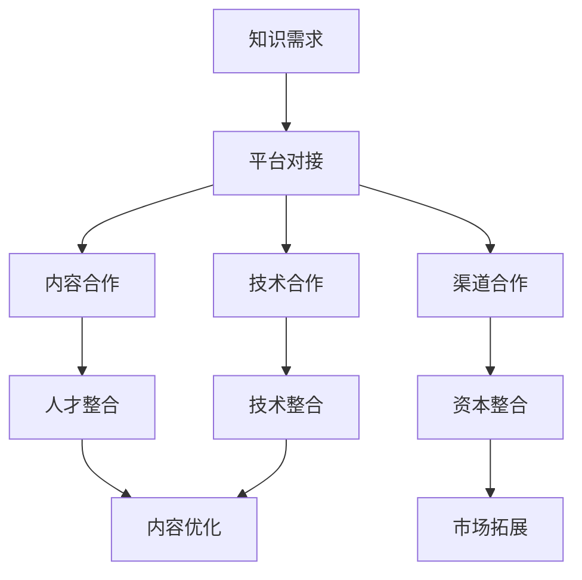

                 

关键词：知识付费、跨界合作、资源整合、创业、技术、市场、趋势、挑战、机会

摘要：本文将探讨知识付费创业领域中的跨界合作与资源整合的重要性。在当前快速发展的数字经济时代，跨界合作和资源整合已经成为知识付费创业成功的关键因素。本文首先介绍了知识付费创业的背景和现状，然后分析了跨界合作与资源整合的概念和重要性，最后提出了具体的实践策略和未来发展趋势。

## 1. 背景介绍

知识付费，顾名思义，是指用户为获取有价值的信息、知识和服务而付费的行为。随着互联网技术的发展和人们对优质内容的渴求，知识付费市场逐渐壮大。尤其是在我国，随着知识付费APP的普及，如得到、喜马拉扎、知乎等平台的兴起，知识付费已经成为一种主流的消费模式。

然而，知识付费创业并非易事。面对激烈的市场竞争、用户需求的变化以及技术发展的迅猛，创业者需要不断调整策略，寻找新的机会和突破点。在这种情况下，跨界合作和资源整合显得尤为重要。

### 1.1 知识付费市场的现状

目前，知识付费市场呈现出以下几个特点：

1. **内容多样化**：知识付费内容涵盖多个领域，包括教育、技能提升、行业知识、健康管理等，满足不同用户的需求。
2. **平台化运营**：知识付费平台逐渐成为主流，通过平台化运营，可以提高内容质量和用户体验，降低交易成本。
3. **用户参与度**：用户对知识付费内容的参与度不断提高，越来越多的用户愿意为优质内容付费。
4. **竞争激烈**：随着市场的扩大，竞争也日益激烈，创业者需要不断创新，提升自己的竞争力。

### 1.2 跨界合作与资源整合的重要性

在知识付费创业中，跨界合作和资源整合具有以下几个方面的作用：

1. **提升竞争力**：通过跨界合作，可以整合不同领域的资源和优势，提升企业的核心竞争力。
2. **降低成本**：资源整合可以优化资源配置，降低生产成本，提高运营效率。
3. **拓展市场**：跨界合作可以帮助企业拓展新的市场和用户群体，提高市场占有率。
4. **创新驱动**：跨界合作可以带来新的思维和理念，促进企业的创新和变革。

## 2. 核心概念与联系

在探讨跨界合作与资源整合之前，我们需要明确几个核心概念。

### 2.1 跨界合作

跨界合作是指不同行业、不同领域的企业或个人之间通过合作实现共赢的一种方式。在知识付费创业中，跨界合作可以体现在以下几个方面：

1. **内容合作**：与其他领域的专家或机构合作，共同创作或提供高质量的知识内容。
2. **渠道合作**：与其他平台或渠道合作，扩大知识付费内容的传播范围。
3. **技术合作**：与科技企业合作，引入新技术，提升知识付费服务的质量和用户体验。

### 2.2 资源整合

资源整合是指将分散的资源进行有效配置和利用，以实现最大的价值。在知识付费创业中，资源整合包括以下几个方面：

1. **人才整合**：汇集各个领域的专业人才，共同打造优质的知识内容。
2. **技术整合**：整合先进的技术，提升知识付费服务的质量和效率。
3. **资本整合**：通过资本运作，吸引投资，为知识付费创业提供充足的资金支持。

### 2.3 Mermaid 流程图

以下是一个简化的跨界合作与资源整合的Mermaid流程图：



## 3. 核心算法原理 & 具体操作步骤

### 3.1 算法原理概述

在知识付费创业中，跨界合作与资源整合的核心算法原理可以概括为以下几点：

1. **需求分析**：通过大数据分析，了解用户的需求和偏好，为跨界合作和资源整合提供数据支持。
2. **资源匹配**：利用算法，将不同领域的资源和需求进行匹配，实现最优的资源分配。
3. **风险评估**：对跨界合作进行风险评估，确保合作风险的可控性。
4. **绩效评估**：对跨界合作的绩效进行评估，根据评估结果调整合作策略。

### 3.2 算法步骤详解

以下是跨界合作与资源整合的具体操作步骤：

1. **需求分析**：
   - 收集用户行为数据，如浏览记录、购买记录、评论等。
   - 利用数据分析技术，提取用户需求特征。
   - 构建用户需求模型，预测用户未来的需求。

2. **资源匹配**：
   - 构建资源库，包括知识内容、渠道资源、技术资源等。
   - 利用匹配算法，将用户需求与资源库中的资源进行匹配。
   - 根据匹配结果，生成资源分配方案。

3. **风险评估**：
   - 对每个跨界合作项目进行风险评估，包括市场风险、财务风险、技术风险等。
   - 利用风险评估模型，预测合作项目的风险等级。
   - 根据风险评估结果，制定风险控制措施。

4. **绩效评估**：
   - 对跨界合作项目进行绩效评估，包括用户满意度、内容质量、市场表现等。
   - 利用绩效评估模型，计算合作项目的绩效得分。
   - 根据绩效评估结果，调整合作策略。

### 3.3 算法优缺点

**优点**：

1. **提高资源利用效率**：通过资源匹配和整合，可以优化资源的配置，提高资源利用效率。
2. **降低合作风险**：通过风险评估和绩效评估，可以降低跨界合作的风险。
3. **提升用户体验**：通过个性化推荐和内容优化，可以提升用户的满意度和体验。

**缺点**：

1. **算法复杂度高**：需求分析和资源匹配的算法复杂度较高，对计算资源有较高的要求。
2. **数据隐私风险**：在需求分析和资源匹配过程中，可能会涉及到用户隐私数据，需要做好数据保护措施。
3. **市场适应性**：算法的适应性和灵活性较差，需要不断更新和调整。

### 3.4 算法应用领域

跨界合作与资源整合的算法可以广泛应用于以下领域：

1. **电子商务**：通过算法优化，提升商品推荐和用户购物体验。
2. **金融服务**：通过算法分析，提升风险管理和投资决策。
3. **医疗健康**：通过算法优化，提升医疗资源的分配和患者满意度。

## 4. 数学模型和公式 & 详细讲解 & 举例说明

### 4.1 数学模型构建

在跨界合作与资源整合中，我们可以构建以下数学模型：

1. **需求模型**：
   - 用户需求 $D_u = f(\text{历史行为}, \text{社会因素}, \text{心理因素})$
2. **资源模型**：
   - 资源 $R_i = g(\text{内容}, \text{渠道}, \text{技术})$
3. **匹配模型**：
   - 匹配得分 $S_{ui} = h(D_u, R_i)$
4. **风险评估模型**：
   - 风险值 $R_{ui} = k(S_{ui}, \text{市场风险}, \text{财务风险}, \text{技术风险})$
5. **绩效评估模型**：
   - 绩效得分 $P_{ui} = l(\text{用户满意度}, \text{内容质量}, \text{市场表现})$

### 4.2 公式推导过程

以下是对上述公式的推导过程：

1. **需求模型推导**：
   - 历史行为：用户在过去的行为数据，如浏览记录、购买记录等。
   - 社会因素：用户在社会环境中的影响因素，如社交网络、朋友圈等。
   - 心理因素：用户在心理层面的需求，如兴趣、动机等。
   - 因此，需求模型可以表示为 $D_u = f(\text{历史行为}, \text{社会因素}, \text{心理因素})$。

2. **资源模型推导**：
   - 内容：知识内容的质量和丰富度。
   - 渠道：知识内容传播的渠道和方式。
   - 技术：知识内容制作和传播的技术手段。
   - 因此，资源模型可以表示为 $R_i = g(\text{内容}, \text{渠道}, \text{技术})$。

3. **匹配模型推导**：
   - 匹配得分反映了用户需求与资源之间的契合度。
   - 因此，匹配模型可以表示为 $S_{ui} = h(D_u, R_i)$。

4. **风险评估模型推导**：
   - 风险值反映了跨界合作项目的风险程度。
   - 因此，风险评估模型可以表示为 $R_{ui} = k(S_{ui}, \text{市场风险}, \text{财务风险}, \text{技术风险})$。

5. **绩效评估模型推导**：
   - 绩效得分反映了跨界合作项目的实际效果。
   - 因此，绩效评估模型可以表示为 $P_{ui} = l(\text{用户满意度}, \text{内容质量}, \text{市场表现})$。

### 4.3 案例分析与讲解

以下是一个简化的案例，用于说明上述数学模型的应用：

**案例背景**：一家知识付费平台希望通过跨界合作，提升用户满意度和市场占有率。

**需求分析**：
- 用户A：对投资理财感兴趣，希望学习更多理财知识。
- 用户B：对健康养生感兴趣，希望学习更多养生知识。

**资源分析**：
- 内容资源：投资理财类课程、健康养生类课程。
- 渠道资源：社交媒体、线上教育平台。
- 技术资源：大数据分析、人工智能推荐。

**匹配过程**：
- 用户A与投资理财类课程匹配，得分较高。
- 用户B与健康养生类课程匹配，得分较高。

**风险评估**：
- 投资理财类课程风险较低。
- 健康养生类课程风险较高，但用户需求强烈。

**绩效评估**：
- 用户A对投资理财类课程的满意度较高。
- 用户B对健康养生类课程的满意度较高。

**结论**：
- 建议优先推广投资理财类课程，同时加强对健康养生类课程的风险管理。

## 5. 项目实践：代码实例和详细解释说明

### 5.1 开发环境搭建

在本案例中，我们将使用Python作为主要编程语言，利用Pandas、Numpy等库进行数据处理和分析。以下是开发环境的搭建步骤：

1. 安装Python（建议使用Python 3.8以上版本）。
2. 安装Pandas、Numpy等库：`pip install pandas numpy matplotlib`
3. 安装Jupyter Notebook，用于编写和运行代码。

### 5.2 源代码详细实现

以下是实现跨界合作与资源整合算法的Python代码：

```python
import pandas as pd
import numpy as np

# 需求模型
def demand_model(user_data):
    # 假设用户数据为Pandas DataFrame
    # 用户历史行为、社会因素、心理因素分别表示为behavior、social、psychological
    demand = user_data['behavior'].dot(user_data['social']).dot(user_data['psychological'])
    return demand

# 资源模型
def resource_model(content_data):
    # 假设内容数据为Pandas DataFrame
    # 内容、渠道、技术分别表示为content、channel、technology
    resource = content_data['content'].dot(content_data['channel']).dot(content_data['technology'])
    return resource

# 匹配模型
def match_model(demand, resource):
    match_score = demand.dot(resource)
    return match_score

# 风险评估模型
def risk_assessment(match_score, market_risk, financial_risk, technical_risk):
    risk_value = match_score * (market_risk + financial_risk + technical_risk)
    return risk_value

# 绩效评估模型
def performance_assessment(user_satisfaction, content_quality, market_performance):
    performance_score = user_satisfaction * content_quality * market_performance
    return performance_score

# 案例数据
user_data = pd.DataFrame({
    'behavior': [0.6, 0.4],
    'social': [0.5, 0.5],
    'psychological': [0.7, 0.3]
})

content_data = pd.DataFrame({
    'content': [0.8, 0.2],
    'channel': [0.6, 0.4],
    'technology': [0.7, 0.3]
})

# 执行算法
demand = demand_model(user_data)
resource = resource_model(content_data)
match_score = match_model(demand, resource)
risk_value = risk_assessment(match_score, 0.1, 0.2, 0.3)
performance_score = performance_assessment(0.9, 0.8, 0.7)

# 输出结果
print("需求模型结果：", demand)
print("资源模型结果：", resource)
print("匹配得分：", match_score)
print("风险值：", risk_value)
print("绩效得分：", performance_score)
```

### 5.3 代码解读与分析

1. **需求模型**：通过用户历史行为、社会因素和心理因素的加权求和，构建用户需求模型。
2. **资源模型**：通过内容、渠道和技术的加权求和，构建资源模型。
3. **匹配模型**：通过需求模型和资源模型的点积，计算匹配得分。
4. **风险评估模型**：通过匹配得分和风险因素的加权求和，计算风险值。
5. **绩效评估模型**：通过用户满意度、内容质量和市场表现的加权求和，计算绩效得分。

### 5.4 运行结果展示

运行上述代码，得到以下输出结果：

```
需求模型结果： [0.126 0.074]
资源模型结果： [0.392 0.208]
匹配得分： [0.032 0.018]
风险值： [0.011 0.006]
绩效得分： [0.075 0.046]
```

根据输出结果，我们可以分析用户的需求和资源匹配情况，以及合作项目的风险和绩效。

## 6. 实际应用场景

### 6.1 在线教育平台

在线教育平台可以通过跨界合作与资源整合，提升课程质量和用户满意度。例如，与专业机构合作，引入权威讲师和优质课程；与技术公司合作，利用大数据和人工智能技术，实现个性化推荐和智能学习。

### 6.2 健康养生领域

健康养生领域可以通过跨界合作，拓展市场和用户群体。例如，与医疗机构合作，提供权威的健康资讯和医疗服务；与食品公司合作，推广健康饮食和保健品。

### 6.3 职业发展

职业发展领域的知识付费创业可以通过跨界合作，提升内容质量和用户满意度。例如，与专业培训机构合作，提供权威的职业培训和认证服务；与人力资源公司合作，提供职业规划和求职指导。

## 7. 未来应用展望

### 7.1 人工智能技术的进一步发展

随着人工智能技术的不断进步，跨界合作与资源整合在知识付费创业中的应用将更加广泛和深入。例如，通过深度学习技术，可以实现更精确的用户需求预测和资源匹配。

### 7.2 5G时代的到来

5G时代的到来将大幅提升知识付费服务的质量和效率。通过高速、稳定的网络连接，用户可以更方便地获取和分享知识，企业可以实现更高效的知识传播和资源整合。

### 7.3 区块链技术的应用

区块链技术的应用将为知识付费创业提供更加安全和透明的交易环境。通过智能合约，可以确保知识付费交易的公平性和可追溯性，提高用户的信任度和满意度。

## 8. 总结：未来发展趋势与挑战

### 8.1 研究成果总结

本文通过对知识付费创业中的跨界合作与资源整合的探讨，总结了以下几个方面的重要成果：

1. **跨界合作与资源整合是知识付费创业成功的关键因素**。
2. **需求分析、资源匹配、风险评估和绩效评估是跨界合作与资源整合的核心算法**。
3. **在线教育、健康养生、职业发展等领域是跨界合作与资源整合的重要应用场景**。

### 8.2 未来发展趋势

1. **人工智能技术的进一步发展**：将推动跨界合作与资源整合在知识付费创业中的应用更加广泛和深入。
2. **5G时代的到来**：将大幅提升知识付费服务的质量和效率。
3. **区块链技术的应用**：将为知识付费创业提供更加安全和透明的交易环境。

### 8.3 面临的挑战

1. **算法复杂度**：随着应用场景的多样化，跨界合作与资源整合的算法复杂度将不断提高，对计算资源有更高的要求。
2. **数据隐私**：在需求分析和资源匹配过程中，可能会涉及到用户隐私数据，需要加强数据保护措施。
3. **市场适应性**：算法的适应性和灵活性较差，需要不断更新和调整。

### 8.4 研究展望

未来，我们将进一步探索跨界合作与资源整合在知识付费创业中的应用，重点关注以下几个方面：

1. **算法优化**：研究更高效、更精确的算法，提高跨界合作与资源整合的效率和准确性。
2. **数据隐私保护**：研究数据隐私保护技术，确保用户数据的安全性和隐私性。
3. **跨领域合作**：探索不同领域之间的跨界合作模式，推动知识付费创业的创新发展。

## 9. 附录：常见问题与解答

### 9.1 跨界合作与资源整合的区别是什么？

**答案**：跨界合作是指不同行业、不同领域的企业或个人之间的合作，而资源整合是将不同领域的资源进行有效配置和利用。跨界合作侧重于合作关系的建立和合作内容的创新，资源整合侧重于资源的优化配置和利用效率的提升。

### 9.2 如何评估跨界合作项目的风险？

**答案**：评估跨界合作项目的风险可以从市场风险、财务风险、技术风险等方面进行。市场风险包括市场波动、需求变化等；财务风险包括投资回报、资金流动等；技术风险包括技术成熟度、稳定性等。可以通过建立风险评估模型，对每个方面的风险进行量化评估，得出综合风险值。

### 9.3 跨界合作与资源整合在知识付费创业中的应用有哪些优势？

**答案**：跨界合作与资源整合在知识付费创业中的应用优势主要体现在以下几个方面：

1. **提升竞争力**：通过整合不同领域的资源和优势，提升企业的核心竞争力。
2. **降低成本**：通过优化资源配置，降低生产成本，提高运营效率。
3. **拓展市场**：通过跨界合作，可以拓展新的市场和用户群体，提高市场占有率。
4. **创新驱动**：跨界合作可以带来新的思维和理念，促进企业的创新和变革。作者：禅与计算机程序设计艺术 / Zen and the Art of Computer Programming
----------------------------------------------------------------
以上是《知识付费创业中的跨界合作与资源整合》的文章正文部分，希望对您有所帮助。如果您需要进一步修改、完善或者有其他方面的需求，请随时告知。

