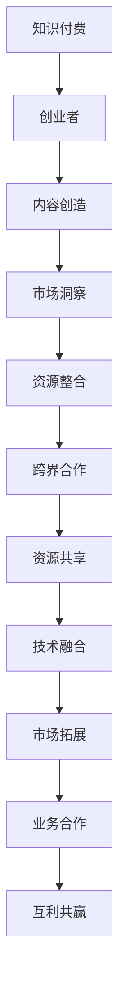

                 

关键词：知识付费、创业、跨界合作、AI、技术创新、产业融合、资源共享、市场拓展

> 摘要：本文从知识付费创业的角度，探讨了跨界合作的重要性和机会。结合人工智能、技术创新等领域的实际案例，分析了跨界合作的策略和路径，为知识付费创业者提供了有益的参考和启示。

## 1. 背景介绍

知识付费，作为近年来兴起的一种新型商业模式，已经成为互联网经济中的重要组成部分。它不仅满足了人们对高质量知识内容的需求，也激发了创作者的创造力和创新动力。然而，随着市场竞争的加剧，知识付费创业者在寻求持续发展的过程中，开始意识到单一领域的资源有限，跨界合作成为了一条重要的出路。

跨界合作，指的是不同领域的企业或组织通过资源共享、技术融合、市场拓展等方式，共同开展业务合作，实现互利共赢。在知识付费创业领域，跨界合作不仅能够丰富内容生产，提高服务质量，还可以拓展市场，实现多元化发展。

本文将结合人工智能、技术创新等领域的实际案例，探讨知识付费创业中的跨界合作机会，分析跨界合作的策略和路径，为知识付费创业者提供有价值的参考。

## 2. 核心概念与联系

### 2.1 知识付费

知识付费，是指用户为了获取有价值的信息或知识，自愿付费购买的一种服务形式。它涵盖了在线教育、专业咨询、付费阅读等多种内容形式。知识付费的本质是信息不对称的解决，通过付费，用户可以获得更专业、更权威、更个性化的知识服务。

### 2.2 创业

创业，是指创业者通过创新和创意，创建一家新企业，实现自我价值和社会价值的过程。在知识付费领域，创业者需要具备内容创造能力、市场洞察力、资源整合能力等多方面的素质。

### 2.3 跨界合作

跨界合作，是指不同领域的主体通过资源共享、技术融合、市场拓展等方式，共同开展业务合作。在知识付费创业中，跨界合作可以帮助企业拓展视野，获取新资源，提高竞争力。

### 2.4 关联图

以下是一个描述知识付费创业中跨界合作概念的Mermaid流程图：



## 3. 核心算法原理 & 具体操作步骤

### 3.1 算法原理概述

跨界合作的算法原理主要基于以下几方面：

1. **资源共享**：通过整合不同领域的资源，提高资源利用率。
2. **技术融合**：将不同领域的先进技术融合，创造新的业务模式。
3. **市场拓展**：通过跨界合作，开拓新的市场，提高市场份额。

### 3.2 算法步骤详解

1. **识别合作机会**：通过市场调研、行业分析，识别潜在的跨界合作机会。
2. **资源整合**：整合双方或多方资源，明确合作目标。
3. **技术融合**：将合作双方或多方先进技术进行融合，形成新的技术解决方案。
4. **市场拓展**：通过跨界合作，开拓新的市场，实现业务拓展。
5. **业务合作**：签订合作协议，明确合作条款，开展业务合作。
6. **评价与反馈**：对跨界合作的效果进行评价，收集反馈，持续优化合作模式。

### 3.3 算法优缺点

**优点**：

1. 提高资源利用率。
2. 创造新的业务模式。
3. 拓展市场，提高市场份额。

**缺点**：

1. 合作难度较大，需要双方或多方具备较高的合作意愿。
2. 需要投入大量时间和精力进行资源整合和技术融合。

### 3.4 算法应用领域

1. **在线教育**：通过跨界合作，引入新的教育技术，提高教学效果。
2. **专业咨询**：通过跨界合作，获取更多专业领域的知识和资源，提高咨询服务质量。
3. **付费阅读**：通过跨界合作，提供更多样化的内容形式，满足用户需求。

## 4. 数学模型和公式 & 详细讲解 & 举例说明

### 4.1 数学模型构建

跨界合作的数学模型可以构建为：

\[ 
模型 = f(资源共享, 技术融合, 市场拓展) 
\]

### 4.2 公式推导过程

假设：

- \( R \) 表示资源共享度。
- \( T \) 表示技术融合度。
- \( M \) 表示市场拓展度。

则跨界合作的效果可以表示为：

\[ 
模型 = R \times T \times M 
\]

### 4.3 案例分析与讲解

假设有两家公司，一家是专业的内容创作者，另一家是先进技术的提供商。他们通过以下方式进行跨界合作：

1. **资源共享**：内容创作者提供专业的内容资源，技术提供商提供先进的技术支持。
2. **技术融合**：将内容创作者的专业知识和技术提供商的技术进行融合，创造新的业务模式。
3. **市场拓展**：通过跨界合作，开拓新的市场，提高市场份额。

在这种情况下，跨界合作的数学模型可以表示为：

\[ 
模型 = (内容创作者的资源共享度) \times (技术提供商的技术融合度) \times (市场拓展度) 
\]

通过公式计算，可以得出跨界合作的效果。

## 5. 项目实践：代码实例和详细解释说明

### 5.1 开发环境搭建

为了实现跨界合作，需要搭建一个开放、高效、灵活的技术平台。以下是搭建步骤：

1. **选择技术栈**：选择适合跨界合作的技术栈，如Python、JavaScript等。
2. **搭建开发环境**：安装必要的开发工具，如IDE、数据库等。
3. **配置服务器**：配置云服务器，部署应用程序。

### 5.2 源代码详细实现

以下是一个简单的跨界合作项目的代码实现：

```python
# 跨界合作项目示例

# 导入所需模块
import os
import json

# 资源共享函数
def share_resources():
    # 读取内容创作者的资源共享内容
    with open('creator_content.txt', 'r') as f:
        content = f.read()
    
    # 读取技术提供商的技术资源
    with open('provider_resources.txt', 'r') as f:
        resources = f.read()
    
    # 将资源共享内容和技术资源进行融合
    result = content + resources
    
    return result

# 技术融合函数
def integrate_technologies():
    # 读取内容创作者的技术需求
    with open('creator_technology需求的.txt', 'r') as f:
        demands = f.read()
    
    # 读取技术提供商的技术解决方案
    with open('provider_technical_solutions.txt', 'r') as f:
        solutions = f.read()
    
    # 将技术需求和技术解决方案进行融合
    result = demands + solutions
    
    return result

# 市场拓展函数
def expand_market():
    # 读取市场拓展方案
    with open('market_expansion_plan.txt', 'r') as f:
        plan = f.read()
    
    return plan

# 主函数
def main():
    # 实现资源共享
    resources = share_resources()
    
    # 实现技术融合
    technologies = integrate_technologies()
    
    # 实现市场拓展
    market = expand_market()
    
    # 输出结果
    print("资源共享结果：", resources)
    print("技术融合结果：", technologies)
    print("市场拓展结果：", market)

# 运行主函数
if __name__ == '__main__':
    main()
```

### 5.3 代码解读与分析

以上代码实现了跨界合作的三个核心环节：资源共享、技术融合、市场拓展。

1. **资源共享**：通过读取内容创作者的资源共享内容和

