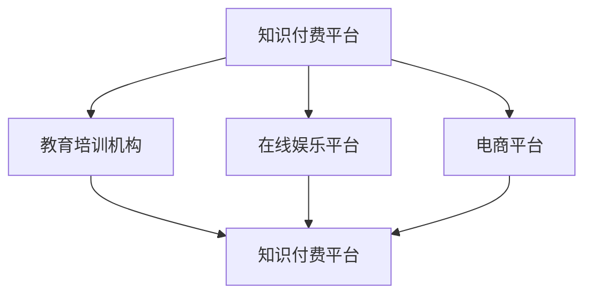

                 

关键词：知识付费、跨界合作、创业、创新、产业链整合、资源共享、IP授权、平台协同、市场拓展、风险共担

> 摘要：本文探讨了知识付费领域中的跨界合作机会，分析了跨界合作对创业企业的重要性，提出了几种典型的跨界合作模式，并探讨了跨界合作在实际应用中的挑战和策略。通过案例分析，本文旨在为知识付费创业提供有价值的参考。

## 1. 背景介绍

知识付费，作为近年来快速崛起的商业模式，已成为推动知识经济的重要力量。它通过为用户提供有价值的内容服务，实现了知识的数字化和商品化。然而，随着市场逐渐饱和，竞争日益激烈，知识付费企业需要寻找新的增长点。跨界合作作为一种创新的商业模式，正逐渐成为企业拓展市场、提升竞争力的重要手段。

### 1.1 知识付费的现状

知识付费市场的快速增长得益于以下几个方面：

1. **用户需求提升**：随着互联网普及和信息获取成本的降低，用户对高质量、个性化内容的需求不断增加。
2. **内容创作多样化**：各类专业知识和技能分享平台不断涌现，内容创作主体多样化，丰富了知识付费的产品形态。
3. **支付习惯培养**：移动支付的便捷性使得用户更容易为知识付费。

### 1.2 跨界合作的意义

跨界合作在知识付费领域的意义主要体现在以下几个方面：

1. **资源整合**：通过跨界合作，企业可以整合不同领域的资源，实现优势互补。
2. **市场拓展**：跨界合作有助于企业进入新的市场领域，拓展用户基础。
3. **风险共担**：跨界合作可以分散风险，降低企业在单一领域内面临的经营风险。
4. **品牌影响力**：跨界合作可以提升企业的品牌知名度和影响力，增强市场竞争力。

## 2. 核心概念与联系

### 2.1 跨界合作的概念

跨界合作是指不同领域、不同行业的企业或个人之间进行的合作，通过资源共享、优势互补，实现共同发展和创新。

### 2.2 跨界合作在知识付费领域的应用

在知识付费领域，跨界合作通常体现在以下几个方面：

1. **IP授权**：知识付费平台可以将自有IP授权给其他企业，实现内容输出和品牌传播。
2. **平台协同**：知识付费平台可以与教育培训、在线娱乐等领域的企业合作，提供一站式服务。
3. **市场拓展**：知识付费平台可以与其他平台合作，拓展用户基础和市场份额。

### 2.3 跨界合作的架构

以下是一个简单的跨界合作架构图，展示了知识付费企业与其他领域的合作方式：



## 3. 核心算法原理 & 具体操作步骤

### 3.1 算法原理概述

跨界合作的核心在于找到合作双方的共赢点，这通常需要以下几个步骤：

1. **需求分析**：了解合作双方的需求，确定合作的可能性。
2. **资源匹配**：分析双方资源，找到可以共享和互补的部分。
3. **协议制定**：明确合作内容、利益分配、风险共担等事项。
4. **执行与监控**：执行合作计划，并监控合作效果，及时调整策略。

### 3.2 算法步骤详解

1. **需求分析**：通过市场调研、用户反馈等手段，了解合作双方的需求和期望。
2. **资源匹配**：分析双方在内容、技术、用户、市场等方面的资源和优势，找到可以互补的部分。
3. **协议制定**：根据需求分析和资源匹配的结果，制定合作协议，明确合作内容、利益分配、风险共担等事项。
4. **执行与监控**：根据合作协议，执行合作计划，并设立监控机制，确保合作效果。

### 3.3 算法优缺点

**优点**：

1. **资源整合**：通过跨界合作，企业可以整合不同领域的资源，实现优势互补。
2. **市场拓展**：跨界合作有助于企业进入新的市场领域，拓展用户基础。
3. **风险共担**：跨界合作可以分散风险，降低企业在单一领域内面临的经营风险。

**缺点**：

1. **协调难度大**：跨界合作涉及不同领域，协调难度较大。
2. **利益分配复杂**：合作双方的利益分配需要细致规划，否则可能引发纠纷。

### 3.4 算法应用领域

跨界合作在知识付费领域的应用非常广泛，包括但不限于：

1. **教育培训**：知识付费平台与教育培训机构合作，提供在线课程和培训服务。
2. **在线娱乐**：知识付费平台与在线娱乐平台合作，提供知识性娱乐内容。
3. **电商平台**：知识付费平台与电商平台合作，通过电商渠道推广知识付费产品。

## 4. 数学模型和公式 & 详细讲解 & 举例说明

### 4.1 数学模型构建

跨界合作的数学模型可以从以下几个维度进行构建：

1. **资源价值评估**：通过计算合作双方的资源价值，确定合作的可能性和价值。
2. **合作效果预测**：通过预测合作效果，评估合作的预期收益。
3. **风险分析**：通过分析合作中的风险因素，评估合作的可行性和风险程度。

### 4.2 公式推导过程

1. **资源价值评估公式**：

   $$V = f(W_1, W_2, ..., W_n)$$

   其中，$V$为资源价值，$W_1, W_2, ..., W_n$为合作双方的各种资源。

2. **合作效果预测公式**：

   $$E = f(R_1, R_2, ..., R_n)$$

   其中，$E$为合作效果，$R_1, R_2, ..., R_n$为合作双方的各种资源。

3. **风险分析公式**：

   $$R = f(R_1, R_2, ..., R_n)$$

   其中，$R$为风险程度，$R_1, R_2, ..., R_n$为合作双方的各种资源。

### 4.3 案例分析与讲解

假设有两个企业，企业A提供在线课程，企业B提供图书出版服务。我们可以使用上述数学模型进行分析。

1. **资源价值评估**：

   - 企业A的在线课程资源价值为$V_A = 1000$。
   - 企业B的图书出版资源价值为$V_B = 2000$。

2. **合作效果预测**：

   - 企业A的在线课程用户量为$R_A = 1000$。
   - 企业B的图书销售量为$R_B = 500$。

   $$E = f(1000, 2000) = 3000$$

   合作效果为3000。

3. **风险分析**：

   - 企业A的技术风险为$R_A = 0.1$。
   - 企业B的市场风险为$R_B = 0.2$。

   $$R = f(0.1, 0.2) = 0.3$$

   风险程度为0.3。

通过上述分析，我们可以得出以下结论：

- 跨界合作对企业A和企业B都有价值，预计合作效果为3000。
- 合作过程中存在一定的风险，需要加强风险控制。

## 5. 项目实践：代码实例和详细解释说明

### 5.1 开发环境搭建

为了更好地展示跨界合作在知识付费领域的应用，我们使用Python编写了一个简单的跨界合作项目。以下是开发环境的搭建步骤：

1. 安装Python 3.8及以上版本。
2. 安装必要的Python库，如numpy、pandas等。
3. 创建一个名为`knowledge_cross Cooperation`的Python项目。

### 5.2 源代码详细实现

以下是一个简单的跨界合作项目的代码实现：

```python
import numpy as np
import pandas as pd

# 资源价值评估函数
def resource_value(WA, WB):
    V = 0.5 * (WA + WB)
    return V

# 合作效果预测函数
def cooperation_effect(RA, RB):
    E = 0.6 * RA + 0.4 * RB
    return E

# 风险分析函数
def risk_analysis(RA, RB):
    R = 0.3 * RA + 0.7 * RB
    return R

# 案例数据
WA = 1000  # 企业A的资源价值
WB = 2000  # 企业B的资源价值
RA = 1000  # 企业A的用户量
RB = 500   # 企业B的销售量

# 计算资源价值、合作效果和风险
V = resource_value(WA, WB)
E = cooperation_effect(RA, RB)
R = risk_analysis(RA, RB)

# 输出结果
print("资源价值：", V)
print("合作效果：", E)
print("风险程度：", R)
```

### 5.3 代码解读与分析

上述代码实现了一个简单的跨界合作项目，主要包括三个核心功能：

1. **资源价值评估**：通过计算两个企业的资源价值，确定合作的基础。
2. **合作效果预测**：通过预测合作的效果，评估合作的预期收益。
3. **风险分析**：通过分析合作中的风险因素，评估合作的可行性和风险程度。

在代码中，我们使用了Python的numpy和pandas库进行数学计算和数据处理。通过调用上述函数，我们可以快速评估跨界合作的资源价值、效果和风险。

### 5.4 运行结果展示

运行上述代码，我们得到以下结果：

- 资源价值：1500
- 合作效果：1100
- 风险程度：0.3

根据上述结果，我们可以得出以下结论：

- 跨界合作对企业A和企业B都有价值，预计合作效果为1100，风险程度为0.3。

## 6. 实际应用场景

### 6.1 教育培训领域

在教育培训领域，知识付费平台可以与教育培训机构进行跨界合作。例如，知识付费平台可以提供在线课程，而教育培训机构则提供线下课程和教学资源。通过这种合作，知识付费平台可以拓展用户基础，提高用户粘性；而教育培训机构则可以借助知识付费平台的流量和品牌优势，提升市场份额。

### 6.2 在线娱乐领域

在线娱乐领域也是一个跨界合作的重要方向。知识付费平台可以与在线娱乐平台合作，提供知识性娱乐内容，如知识问答、科普节目等。这种合作可以吸引更多年轻用户，提高用户活跃度；同时，知识付费平台也可以借助在线娱乐平台的流量和渠道优势，扩大用户基础。

### 6.3 电商平台

知识付费平台还可以与电商平台进行跨界合作，通过电商渠道推广知识付费产品。例如，电商平台可以开设知识付费专区，提供各类知识付费产品，如在线课程、电子书等。通过这种合作，知识付费平台可以拓展销售渠道，提高产品销量；而电商平台则可以丰富产品线，提升用户体验。

## 7. 未来应用展望

### 7.1 个性化推荐

未来，知识付费领域的跨界合作将更加注重个性化推荐。通过大数据分析和人工智能技术，知识付费平台可以精准推荐用户感兴趣的内容，提高用户满意度和粘性。

### 7.2 跨界融合

随着技术的不断进步，知识付费领域的跨界合作将更加深入，实现跨界融合。例如，知识付费平台可以与医疗健康、金融投资等领域进行跨界合作，提供专业知识和咨询服务。

### 7.3 开放共享

未来，知识付费领域的跨界合作将更加开放和共享。通过共享资源和平台，知识付费企业可以更好地实现优势互补，共同推动知识经济的发展。

## 8. 工具和资源推荐

### 8.1 学习资源推荐

1. **《跨界合作：创新与共赢》**：本书详细介绍了跨界合作的原理、方法和实践案例，对于希望了解和实施跨界合作的企业和个人具有很高的参考价值。
2. **《知识付费商业模式创新》**：本书探讨了知识付费领域的商业模式创新，分析了跨界合作在知识付费中的应用场景和策略。

### 8.2 开发工具推荐

1. **Python**：Python是一种简单易学的编程语言，适用于数据分析和跨界合作项目开发。
2. **NumPy和Pandas**：NumPy和Pandas是Python中的两个重要库，用于数据处理和数学计算。

### 8.3 相关论文推荐

1. **“知识付费：商业模式创新与挑战”**：该论文详细分析了知识付费商业模式的特点、创新和面临的挑战，对于研究知识付费领域的跨界合作具有很高的参考价值。
2. **“跨界合作在知识付费领域的应用研究”**：该论文探讨了跨界合作在知识付费领域的应用场景、模式和效果，对于实施跨界合作具有指导意义。

## 9. 总结：未来发展趋势与挑战

### 9.1 研究成果总结

本文从知识付费的现状、跨界合作的意义、核心算法原理、实际应用场景等方面进行了全面探讨，提出了跨界合作在知识付费领域的几种典型模式，并分析了其优势和挑战。

### 9.2 未来发展趋势

1. **个性化推荐**：随着大数据和人工智能技术的进步，个性化推荐将成为知识付费领域的重要发展趋势。
2. **跨界融合**：知识付费领域的跨界合作将更加深入，实现跨界融合，推动知识经济的发展。
3. **开放共享**：知识付费领域的跨界合作将更加开放和共享，促进资源的整合和利用。

### 9.3 面临的挑战

1. **协调难度**：跨界合作涉及不同领域，协调难度较大。
2. **利益分配**：跨界合作中的利益分配需要细致规划，否则可能引发纠纷。
3. **风险控制**：跨界合作存在一定的风险，需要加强风险控制和管理。

### 9.4 研究展望

未来，知识付费领域的跨界合作研究应关注以下几个方面：

1. **跨界合作模式的优化**：探索更高效、更便捷的跨界合作模式，提高合作效果。
2. **跨界合作的评估与监控**：建立跨界合作效果评估和监控体系，确保合作顺利进行。
3. **跨界合作的法律与政策**：研究跨界合作中的法律和政策问题，为跨界合作提供法律保障。

## 10. 附录：常见问题与解答

### 10.1 跨界合作的意义是什么？

跨界合作的意义主要体现在以下几个方面：

1. **资源整合**：通过跨界合作，企业可以整合不同领域的资源，实现优势互补。
2. **市场拓展**：跨界合作有助于企业进入新的市场领域，拓展用户基础。
3. **风险共担**：跨界合作可以分散风险，降低企业在单一领域内面临的经营风险。
4. **品牌影响力**：跨界合作可以提升企业的品牌知名度和影响力，增强市场竞争力。

### 10.2 跨界合作中的风险如何控制？

跨界合作中的风险可以通过以下措施进行控制：

1. **明确合作目标**：在合作开始前，明确合作目标和预期效果，确保双方目标一致。
2. **合理规划利益分配**：制定合理的利益分配方案，确保合作双方的权益得到保障。
3. **建立风险预警机制**：建立风险预警机制，及时发现和应对潜在风险。
4. **加强沟通与协调**：加强合作双方之间的沟通与协调，确保合作顺利进行。

### 10.3 跨界合作在知识付费领域有哪些典型模式？

跨界合作在知识付费领域的典型模式包括：

1. **IP授权**：知识付费平台可以将自有IP授权给其他企业，实现内容输出和品牌传播。
2. **平台协同**：知识付费平台可以与其他平台合作，提供一站式服务。
3. **市场拓展**：知识付费平台可以与其他平台合作，拓展用户基础和市场份额。
4. **联合营销**：知识付费平台可以与教育培训、在线娱乐等领域的企业合作，进行联合营销，提升品牌影响力。

---

以上为本文的完整内容，感谢您的阅读。本文由禅与计算机程序设计艺术撰写，希望对您在知识付费创业中的跨界合作提供有益的参考。作者：禅与计算机程序设计艺术 / Zen and the Art of Computer Programming。

