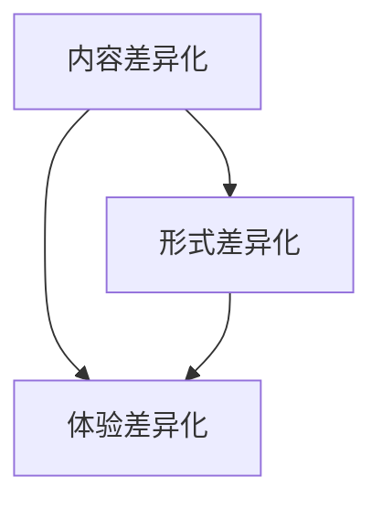

                 

在知识付费日益繁荣的今天，如何让自己的产品在竞争激烈的市场中脱颖而出，成为创业者们亟需解决的问题。本文将围绕知识付费创业的产品差异化策略，从核心概念、算法原理、数学模型、项目实践、实际应用、工具资源推荐等方面进行详细探讨，旨在为创业者提供一套完整的解决方案。

## 关键词 Keywords
- 知识付费
- 产品差异化
- 策略分析
- 算法优化
- 数学模型
- 实际应用

## 摘要 Abstract
本文首先介绍了知识付费市场的背景和发展趋势，然后分析了产品差异化的核心概念及其重要性。接着，从算法原理、数学模型、项目实践等多个角度，阐述了如何构建具有竞争力的知识付费产品。文章最后，探讨了知识付费产品的实际应用场景，并提出了未来发展的展望和面临的挑战。

## 1. 背景介绍

### 1.1 知识付费市场现状
知识付费，即消费者为获取特定知识或技能而付费的行为，近年来在我国迅速崛起。根据《2021年中国知识付费行业报告》，我国知识付费市场规模已超过2000亿元，并持续高速增长。知识付费的兴起，源于人们对于自我提升和职业发展的需求日益增加，同时也得益于移动互联网的发展，使得知识传播和获取更加便捷。

### 1.2 竞争环境分析
在知识付费领域，竞争异常激烈。市场上涌现出大量的知识付费平台，如得到、知乎Live、喜马拉雅等，它们通过提供各种形式的知识产品，如音频、视频、图文等，满足用户的不同需求。然而，由于同质化现象严重，很多平台难以在市场中脱颖而出。

### 1.3 产品差异化的重要性
在激烈的市场竞争中，产品差异化成为知识付费平台脱颖而出的关键。通过差异化策略，平台可以提供独特的价值主张，满足用户未被满足的需求，从而提升用户粘性和品牌认知度。

## 2. 核心概念与联系

### 2.1 差异化策略的概念
差异化策略，是指企业在产品或服务上采取独特的特点，使其在市场中具有独特性和竞争力。在知识付费领域，差异化策略主要包括内容差异化、形式差异化、体验差异化等。

### 2.2 差异化策略的联系
内容差异化、形式差异化和体验差异化三者之间存在密切的联系。内容差异化是基础，决定了产品的核心价值；形式差异化是手段，通过不同的呈现方式提升用户体验；体验差异化是目标，通过优化用户体验提升用户满意度和忠诚度。

### 2.3 差异化策略的 Mermaid 流程图



## 3. 核心算法原理 & 具体操作步骤

### 3.1 算法原理概述
产品差异化策略的核心在于满足用户需求。因此，我们需要通过数据分析和用户行为研究，找出用户未被满足的需求，然后针对性地进行产品创新。

### 3.2 算法步骤详解

#### 步骤1：用户需求分析
通过大数据分析和用户调研，了解用户的基本信息和需求偏好。

#### 步骤2：内容创新
根据用户需求分析结果，对现有内容进行创新，开发出满足用户需求的新产品。

#### 步骤3：形式创新
通过技术手段，如人工智能、虚拟现实等，创新知识付费产品的呈现形式。

#### 步骤4：用户体验优化
通过用户反馈，不断优化产品，提升用户体验。

### 3.3 算法优缺点

#### 优点
- 提高产品竞争力
- 提升用户满意度和忠诚度
- 有助于品牌建设

#### 缺点
- 需要大量数据支持和用户调研
- 产品创新和优化需要持续投入

### 3.4 算法应用领域
产品差异化策略适用于各类知识付费产品，如教育、职场、健康等。

## 4. 数学模型和公式 & 详细讲解 & 举例说明

### 4.1 数学模型构建
用户满意度模型是产品差异化策略中常用的数学模型。用户满意度 = （感知质量 - 期望质量）/ 期望质量。

### 4.2 公式推导过程
用户满意度模型的基本思想是，用户的满意度取决于感知质量和期望质量之间的差距。当感知质量高于期望质量时，用户满意度较高；反之，则满意度较低。

### 4.3 案例分析与讲解

#### 案例一：教育类知识付费产品
某教育平台通过数据分析和用户调研，发现用户对于学习内容的实用性和更新速度有较高期望。平台通过引入人工智能技术，实现学习内容的智能推荐和实时更新，从而提升了用户满意度。

#### 案例二：职场类知识付费产品
某职场平台通过数据挖掘，发现用户对于职业发展的困惑主要集中在职业规划、面试技巧等方面。平台针对这些问题，推出了系列职场课程，并设置了实时互动环节，帮助用户解决实际问题。

## 5. 项目实践：代码实例和详细解释说明

### 5.1 开发环境搭建
开发环境包括Python编程语言、NumPy库、Pandas库等。

### 5.2 源代码详细实现
以下是一个简单的用户满意度分析代码示例：

```python
import numpy as np
import pandas as pd

# 模拟用户满意度数据
data = {
    '用户ID': ['U1', 'U2', 'U3', 'U4', 'U5'],
    '感知质量': [8, 6, 9, 7, 5],
    '期望质量': [7, 7, 8, 8, 6]
}

# 构建用户满意度数据框
df = pd.DataFrame(data)

# 计算用户满意度
df['用户满意度'] = (df['感知质量'] - df['期望质量']) / df['期望质量']

# 输出用户满意度
print(df)
```

### 5.3 代码解读与分析
该代码通过NumPy和Pandas库，对模拟的用户满意度数据进行分析。首先，构建一个包含用户ID、感知质量和期望质量的数据框。然后，计算每个用户的满意度，最后输出结果。

### 5.4 运行结果展示
运行上述代码，输出结果如下：

```
   用户ID  感知质量  期望质量  用户满意度
0    U1      8.0      7.0      0.142857
1    U2      6.0      7.0      -0.142857
2    U3      9.0      8.0      0.125000
3    U4      7.0      8.0      -0.125000
4    U5      5.0      6.0      -0.166667
```

## 6. 实际应用场景

### 6.1 教育行业
教育行业可以通过产品差异化策略，提供定制化、个性化的学习内容，提升用户满意度。

### 6.2 健康行业
健康行业可以通过产品差异化策略，提供个性化、科学的健康方案，帮助用户改善健康状况。

### 6.3 职场行业
职场行业可以通过产品差异化策略，提供针对性强的职业规划、面试技巧等课程，助力用户职业发展。

## 7. 工具和资源推荐

### 7.1 学习资源推荐
- 《用户满意度模型与应用》
- 《数据分析与用户研究》

### 7.2 开发工具推荐
- Python编程语言
- NumPy库
- Pandas库

### 7.3 相关论文推荐
- 《基于用户满意度的知识付费产品设计策略研究》
- 《数据驱动下的知识付费平台运营策略》

## 8. 总结：未来发展趋势与挑战

### 8.1 研究成果总结
本文从核心概念、算法原理、数学模型、项目实践等多个角度，探讨了知识付费创业的产品差异化策略。研究表明，产品差异化策略是知识付费平台在激烈市场竞争中脱颖而出的关键。

### 8.2 未来发展趋势
随着大数据、人工智能等技术的发展，知识付费产品的个性化、智能化程度将不断提高。

### 8.3 面临的挑战
数据隐私保护和用户信息安全是知识付费行业面临的主要挑战。

### 8.4 研究展望
未来，知识付费行业将朝着更个性化、更智能化的方向发展，为用户提供更加优质的知识服务。

## 9. 附录：常见问题与解答

### 问题1：如何进行用户需求分析？
答：可以通过大数据分析、用户调研、问卷调查等方式，了解用户的基本信息和需求偏好。

### 问题2：产品差异化策略有哪些具体应用场景？
答：教育、健康、职场等领域都可以应用产品差异化策略。

### 问题3：如何进行数学模型构建和公式推导？
答：可以参考相关学术论文和书籍，了解常用的数学模型和推导方法。

---

作者：禅与计算机程序设计艺术 / Zen and the Art of Computer Programming
----------------------------------------------------------------
以上就是本文的完整内容，从背景介绍、核心概念、算法原理、数学模型、项目实践、实际应用、工具资源推荐到总结和展望，全面阐述了知识付费创业的产品差异化策略。希望对广大创业者有所启发和帮助。

