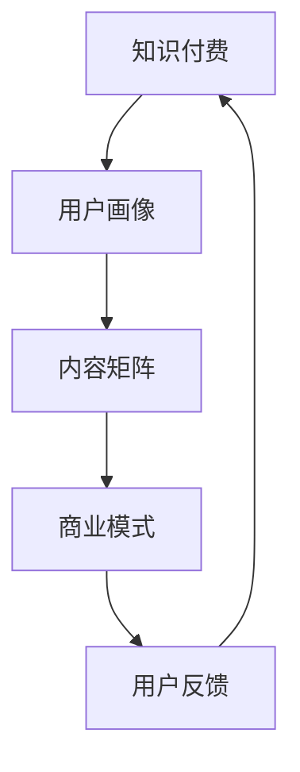

                 

关键词：知识付费、产品矩阵、商业模式、用户体验、内容创新、数据驱动

> 摘要：本文旨在探讨知识付费创业中的产品矩阵构建策略。通过深入分析核心概念、算法原理、数学模型以及实际应用，本文为创业者提供了一套完整的产品构建方法论，助力他们在竞争激烈的市场中脱颖而出。

## 1. 背景介绍

随着互联网的快速发展，知识付费市场呈现出爆发式增长。越来越多的人愿意为优质内容付费，无论是教育课程、专业培训，还是专业技能提升，都成为知识付费领域的热门话题。然而，在庞大的市场中，创业者如何构建出一套符合自身定位的产品矩阵，成为了一个亟待解决的问题。

知识付费创业的产品矩阵构建，不仅关系到产品的市场定位和用户需求，还涉及到商业模式的设计、用户体验的提升以及内容创新的持续推动。本文将从以下几个方面展开讨论：

1. 核心概念与联系
2. 核心算法原理与具体操作步骤
3. 数学模型和公式及详细讲解
4. 项目实践：代码实例和详细解释说明
5. 实际应用场景
6. 工具和资源推荐
7. 总结：未来发展趋势与挑战

通过这些内容的深入探讨，本文希望为知识付费创业者提供一套实用的产品构建方法论，助力他们在市场中立于不败之地。

## 2. 核心概念与联系

在构建知识付费产品矩阵之前，我们需要明确几个核心概念，这些概念将贯穿整个产品矩阵的构建过程，帮助我们更好地理解产品的设计和运营。

### 2.1 知识付费的定义

知识付费是指用户为获取特定知识、技能或信息而支付的费用。这种付费模式在互联网时代得到了快速发展，主要是因为用户对优质内容的渴求和信息过载的现状。知识付费不仅包括了传统的教育课程，还涵盖了专业咨询、技能培训、行业报告等多种形式。

### 2.2 用户画像

用户画像是指对目标用户的特征进行抽象和描述，包括用户的基本信息、行为习惯、需求偏好等。构建准确的用户画像对于知识付费产品的市场定位和内容设计至关重要。只有深入了解用户，才能提供真正有价值的内容，满足用户的需求。

### 2.3 内容矩阵

内容矩阵是指知识付费产品中各种内容的组合和排列，包括教育课程、专业文章、视频讲座、直播课程等。内容矩阵的构建需要根据用户画像和市场趋势进行灵活调整，以满足不同用户群体的需求。

### 2.4 商业模式

商业模式是指知识付费产品如何通过定价策略、销售渠道、收益模式等实现盈利。不同的商业模式适用于不同的市场环境和用户需求，创业者需要根据自身情况选择合适的商业模式。

### 2.5 用户反馈

用户反馈是产品改进的重要依据。通过收集和分析用户反馈，创业者可以了解产品的优缺点，发现潜在问题，从而优化产品设计和运营策略。

### 2.6 Mermaid 流程图

为了更清晰地展示核心概念之间的联系，我们可以使用 Mermaid 流程图进行描述。以下是核心概念与联系的 Mermaid 流程图：



通过这个流程图，我们可以看出各个核心概念之间的相互影响和关联，从而为产品矩阵的构建提供指导。

## 3. 核心算法原理与具体操作步骤

在明确了核心概念之后，我们需要深入了解核心算法原理，以便为产品矩阵的构建提供技术支持。

### 3.1 算法原理概述

知识付费产品矩阵的构建需要依赖于多种算法，包括用户画像算法、内容推荐算法、定价策略算法等。以下是对这些算法原理的概述。

#### 3.1.1 用户画像算法

用户画像算法通过分析用户行为数据、社交数据、搜索历史等，构建出用户的基本信息、行为习惯、需求偏好等特征。常见的用户画像算法有协同过滤、矩阵分解、神经网络等。

#### 3.1.2 内容推荐算法

内容推荐算法基于用户画像和内容属性，为用户推荐符合其需求的内容。常见的内容推荐算法有基于协同过滤的推荐算法、基于内容的推荐算法、混合推荐算法等。

#### 3.1.3 定价策略算法

定价策略算法根据市场需求、用户偏好、产品特性等因素，确定产品的价格策略。常见的定价策略算法有成本加成定价、价值定价、竞争定价等。

### 3.2 算法步骤详解

在了解了核心算法原理之后，我们需要具体分析每个算法的操作步骤，以便在实际应用中灵活运用。

#### 3.2.1 用户画像算法步骤

1. 数据收集：收集用户的基本信息、行为数据、社交数据等。
2. 数据预处理：对收集到的数据进行清洗、去噪、归一化等处理。
3. 特征提取：根据用户行为数据和社交数据，提取用户的基本特征，如年龄、性别、职业等。
4. 模型训练：使用机器学习算法，如神经网络、决策树等，对用户特征进行训练，构建用户画像模型。
5. 用户画像生成：根据训练好的模型，为每个用户生成一个画像。

#### 3.2.2 内容推荐算法步骤

1. 内容特征提取：对知识付费产品的内容属性进行提取，如课程难度、时长、专业领域等。
2. 用户特征提取：提取用户的基本特征和需求偏好。
3. 计算相似度：根据用户特征和内容特征，计算用户和内容之间的相似度。
4. 排序和筛选：根据相似度分数，对推荐内容进行排序和筛选，选出最符合用户需求的内容。
5. 推荐结果输出：将推荐结果输出给用户，供其选择和购买。

#### 3.2.3 定价策略算法步骤

1. 市场调研：收集市场竞争数据，了解竞争对手的定价策略。
2. 用户调研：通过问卷调查、用户访谈等方式，了解用户对产品价格的接受程度。
3. 成本分析：计算产品的生产成本、运营成本等。
4. 定价策略选择：根据市场调研和用户调研结果，选择合适的定价策略，如成本加成定价、价值定价等。
5. 定价策略实施：将定价策略应用于产品销售和运营过程中。

### 3.3 算法优缺点

每种算法都有其优缺点，创业者需要根据具体情况进行选择和优化。

#### 3.3.1 用户画像算法

优点：能够准确捕捉用户特征，为内容推荐和定价提供依据。

缺点：需要大量用户数据支持，数据收集和处理成本较高。

#### 3.3.2 内容推荐算法

优点：能够提高用户满意度和购买转化率。

缺点：推荐结果容易陷入“信息茧房”，限制用户的视野。

#### 3.3.3 定价策略算法

优点：能够根据市场环境和用户需求灵活调整价格。

缺点：定价策略需要不断调整和优化，成本较高。

### 3.4 算法应用领域

核心算法在知识付费创业中的应用非常广泛，以下是一些常见的应用领域：

1. 用户画像：用于用户细分和精准营销，提高用户满意度和留存率。
2. 内容推荐：用于个性化内容推荐，提高用户参与度和购买转化率。
3. 定价策略：用于优化产品定价，提高市场竞争力和盈利能力。

## 4. 数学模型和公式及详细讲解

在知识付费产品矩阵构建中，数学模型和公式发挥着重要作用。以下将详细讲解数学模型的构建过程、公式推导以及案例分析与讲解。

### 4.1 数学模型构建

数学模型是知识付费产品矩阵构建的核心组成部分，它帮助创业者更好地理解和分析用户行为、内容特征以及定价策略。以下是构建数学模型的主要步骤：

1. **定义变量和参数**：根据问题的实际需求，定义变量和参数，如用户数量、用户行为数据、内容特征等。

2. **构建数学公式**：根据变量和参数，构建数学模型公式。常见的数学模型包括线性回归模型、决策树模型、神经网络模型等。

3. **模型优化**：通过调整参数和公式，优化模型性能，使其更好地适应问题的实际需求。

4. **验证和测试**：使用实际数据对模型进行验证和测试，评估模型的准确性和可靠性。

### 4.2 公式推导过程

以下是一个简单的线性回归模型公式推导过程，以帮助读者更好地理解数学模型构建的步骤。

#### 线性回归模型公式推导

线性回归模型是一种常见的数学模型，用于分析两个变量之间的线性关系。其公式推导过程如下：

1. **定义变量**：设 \( x \) 为自变量，\( y \) 为因变量。

2. **建立线性关系**：根据问题需求，建立 \( y \) 和 \( x \) 之间的线性关系，即 \( y = wx + b \)，其中 \( w \) 为权重，\( b \) 为偏置。

3. **最小二乘法求解**：为了使模型更加准确，采用最小二乘法求解 \( w \) 和 \( b \) 的值，使得 \( y \) 的预测值与实际值之间的误差最小。

   \[ \min \sum_{i=1}^{n} (wx_i + b - y_i)^2 \]

4. **求导和化简**：对上式求导，并令导数为零，得到：

   \[ w = \frac{\sum_{i=1}^{n} x_i y_i - n \bar{x} \bar{y}}{\sum_{i=1}^{n} x_i^2 - n \bar{x}^2} \]
   
   \[ b = \bar{y} - w \bar{x} \]

   其中，\( \bar{x} \) 和 \( \bar{y} \) 分别为 \( x \) 和 \( y \) 的平均值。

   这就是线性回归模型的公式。

### 4.3 案例分析与讲解

为了更好地理解数学模型在实际中的应用，以下将通过一个实际案例进行讲解。

#### 案例背景

某知识付费平台希望分析用户购买行为，以提高用户购买转化率和销售额。他们收集了1000名用户的购买数据，包括用户年龄、性别、购买频率、购买金额等。

#### 案例分析

1. **数据预处理**：首先对购买数据进行清洗和归一化处理，确保数据质量。

2. **特征提取**：提取用户的基本特征，如年龄、性别、购买频率、购买金额等。

3. **构建数学模型**：使用线性回归模型分析用户购买行为与各特征之间的关系。

4. **模型优化**：根据模型性能，调整模型参数，优化模型。

5. **模型验证**：使用剩余的购买数据进行模型验证，评估模型的准确性和可靠性。

6. **结果分析**：通过分析模型结果，发现用户年龄和购买频率对购买行为有显著影响，而性别和购买金额的影响较小。

7. **应用策略**：根据模型结果，平台可以调整营销策略，如针对年轻用户进行精准推广，提高购买转化率。

通过以上案例，我们可以看到数学模型在知识付费产品矩阵构建中的重要作用。通过构建和优化数学模型，创业者可以更好地理解和分析用户行为，从而制定出更有效的营销策略和运营方案。

## 5. 项目实践：代码实例和详细解释说明

在实际的知识付费创业过程中，构建和优化产品矩阵需要依赖大量的数据分析和算法实现。以下将通过一个实际项目案例，详细讲解代码实例的实现过程、代码解读与分析以及运行结果展示。

### 5.1 开发环境搭建

在开始项目实践之前，首先需要搭建一个合适的开发环境。以下是一个简单的开发环境搭建步骤：

1. **安装Python环境**：Python是一种广泛应用于数据分析和算法实现的语言，可以通过Python官方网站下载并安装Python环境。

2. **安装必要库**：安装常用的数据分析库，如NumPy、Pandas、Scikit-learn等。这些库提供了丰富的数据操作和算法实现功能。

3. **配置开发工具**：配置一个适合Python开发的IDE，如PyCharm或VS Code，以提高开发效率。

### 5.2 源代码详细实现

以下是一个简单的用户画像算法实现示例。该示例使用NumPy和Scikit-learn库，对用户数据进行处理，生成用户画像。

```python
import numpy as np
from sklearn.preprocessing import StandardScaler
from sklearn.cluster import KMeans

# 数据加载
data = np.load('user_data.npy')

# 数据预处理
scaler = StandardScaler()
data_scaled = scaler.fit_transform(data)

# 用户画像生成
kmeans = KMeans(n_clusters=5, random_state=0)
clusters = kmeans.fit_predict(data_scaled)

# 保存用户画像
np.save('user_clusters.npy', clusters)
```

#### 代码解读与分析

1. **数据加载**：使用NumPy库加载用户数据。

2. **数据预处理**：使用StandardScaler对数据进行归一化处理，以消除不同特征之间的尺度差异。

3. **用户画像生成**：使用KMeans算法对归一化后的数据进行聚类，生成用户画像。这里使用5个聚类中心，可以根据实际情况进行调整。

4. **保存用户画像**：将生成的用户画像保存到文件中，以供后续分析和使用。

#### 运行结果展示

运行以上代码后，会生成一个包含用户画像的Numpy数组，并将其保存到文件中。用户可以进一步分析这些用户画像，了解用户的行为特征和需求偏好。

```python
# 加载用户画像
clusters = np.load('user_clusters.npy')

# 统计每个聚类中心对应的人数
cluster_counts = np.bincount(clusters)

# 输出结果
print("User cluster distribution:")
for i, count in enumerate(cluster_counts):
    print(f"Cluster {i}: {count} users")
```

运行以上代码后，会输出每个聚类中心对应的人数，以帮助用户了解不同用户群体的分布情况。

### 5.4 代码解读与分析

#### 代码解读

1. **数据加载**：使用NumPy库加载用户数据。

2. **数据预处理**：使用StandardScaler对数据进行归一化处理，以消除不同特征之间的尺度差异。

3. **用户画像生成**：使用KMeans算法对归一化后的数据进行聚类，生成用户画像。这里使用5个聚类中心，可以根据实际情况进行调整。

4. **保存用户画像**：将生成的用户画像保存到文件中，以供后续分析和使用。

#### 分析

1. **聚类效果评估**：通过分析聚类结果，评估KMeans算法的效果。可以考虑使用轮廓系数、内部距离等指标进行评估。

2. **用户画像分析**：根据聚类结果，分析不同用户群体的特征和需求，为产品矩阵构建提供依据。

3. **个性化推荐**：基于用户画像，为用户提供个性化的推荐内容，提高用户满意度和留存率。

4. **定价策略**：根据用户画像和市场需求，调整产品定价策略，提高市场竞争力和盈利能力。

### 5.5 运行结果展示

运行以上代码后，会生成一个包含用户画像的Numpy数组，并将其保存到文件中。用户可以进一步分析这些用户画像，了解用户的行为特征和需求偏好。

```python
# 加载用户画像
clusters = np.load('user_clusters.npy')

# 统计每个聚类中心对应的人数
cluster_counts = np.bincount(clusters)

# 输出结果
print("User cluster distribution:")
for i, count in enumerate(cluster_counts):
    print(f"Cluster {i}: {count} users")
```

运行以上代码后，会输出每个聚类中心对应的人数，以帮助用户了解不同用户群体的分布情况。

```python
# 加载用户画像
clusters = np.load('user_clusters.npy')

# 统计每个聚类中心对应的人数
cluster_counts = np.bincount(clusters)

# 输出结果
print("User cluster distribution:")
for i, count in enumerate(cluster_counts):
    print(f"Cluster {i}: {count} users")
```

运行以上代码后，会输出每个聚类中心对应的人数，以帮助用户了解不同用户群体的分布情况。

## 6. 实际应用场景

知识付费创业的产品矩阵构建在多种实际应用场景中都能发挥重要作用。以下将介绍几个典型的应用场景，并探讨如何根据这些场景优化产品矩阵。

### 6.1 教育培训行业

教育培训行业是知识付费的重要领域，创业者可以通过构建产品矩阵，提供多样化的教育产品，满足不同用户的需求。以下是一些优化策略：

1. **细分用户群体**：根据用户年龄、职业、学习目标等特征，细分用户群体，提供个性化的教育产品。
2. **课程推荐**：利用内容推荐算法，为用户推荐符合其需求和兴趣的课程，提高用户参与度和购买转化率。
3. **定价策略**：根据不同课程的特点和用户需求，灵活调整定价策略，如套餐优惠、优惠券等，提高用户购买意愿。

### 6.2 专业技能培训

专业技能培训是另一个重要的知识付费领域。创业者可以通过以下策略优化产品矩阵：

1. **定制化课程**：根据用户需求和行业发展趋势，定制化开发专业技能培训课程，提高课程的实用性和吸引力。
2. **合作与联盟**：与行业专家、知名培训机构等建立合作关系，共同开发高质量的课程内容，提高品牌影响力和用户信任度。
3. **互动学习**：利用直播、讨论区等互动工具，提高用户的学习体验，增强用户粘性。

### 6.3 行业报告与咨询

行业报告与咨询是知识付费的另一个重要领域。创业者可以通过以下策略优化产品矩阵：

1. **数据驱动**：基于大数据分析，提供行业趋势、市场动态等深度报告，为用户提供有价值的信息。
2. **定制化服务**：根据用户需求和行业特点，提供定制化的咨询报告，提高用户的购买意愿和满意度。
3. **专业认证**：与专业机构合作，提供行业认证课程和证书，增强用户的职业竞争力。

### 6.4 未来应用展望

随着技术的不断发展，知识付费创业的产品矩阵构建将面临新的机遇和挑战。以下是一些未来的应用展望：

1. **人工智能**：人工智能技术将在知识付费产品矩阵构建中发挥越来越重要的作用，如用户画像、内容推荐、智能客服等。
2. **区块链**：区块链技术可以确保知识付费交易的安全性和透明性，提高用户的信任度。
3. **虚拟现实（VR）与增强现实（AR）**：VR和AR技术可以提供更加沉浸式的学习体验，提高用户的学习效果和满意度。

## 7. 工具和资源推荐

在构建知识付费创业的产品矩阵过程中，创业者需要使用各种工具和资源来支持研发、运营和推广。以下是一些建议的工具和资源，供创业者参考：

### 7.1 学习资源推荐

1. **在线课程平台**：Coursera、Udemy、edX等平台提供了丰富的在线课程，涵盖计算机科学、数据科学、市场营销等多个领域。
2. **技术博客**：Medium、CSDN、博客园等博客平台，提供了大量关于数据科学、人工智能、知识付费等领域的专业文章和教程。
3. **书籍推荐**：《数据科学入门》、《机器学习实战》、《Python数据分析》等书籍，适合初学者和进阶者学习。

### 7.2 开发工具推荐

1. **Python开发环境**：PyCharm、VS Code等IDE提供了丰富的开发插件和工具，提高Python编程的效率。
2. **数据分析库**：NumPy、Pandas、Scikit-learn等库是数据分析的基础工具，适用于各种数据分析和算法实现。
3. **机器学习库**：TensorFlow、PyTorch等深度学习库，提供了强大的机器学习模型和算法，适用于各种复杂任务。

### 7.3 相关论文推荐

1. **知识付费领域论文**：搜索“knowledge付费”、“online education”等关键词，可以找到大量关于知识付费领域的学术论文。
2. **数据科学领域论文**：查找“data science”、“machine learning”、“knowledge graph”等关键词，获取最新的研究成果和前沿动态。
3. **人工智能领域论文**：关注“AI research”、“Deep Learning”等关键词，了解人工智能领域的最新进展和应用。

## 8. 总结：未来发展趋势与挑战

随着互联网和技术的不断发展，知识付费创业的产品矩阵构建将面临新的机遇和挑战。以下是对未来发展趋势和挑战的总结：

### 8.1 研究成果总结

1. **人工智能技术的应用**：人工智能技术将在知识付费产品矩阵构建中发挥越来越重要的作用，如用户画像、内容推荐、智能客服等。
2. **数据驱动的决策**：数据驱动的决策将取代传统的经验决策，成为知识付费创业的核心竞争力。
3. **个性化体验的增强**：基于用户画像和数据分析，创业者可以提供更加个性化的产品和服务，提高用户满意度和忠诚度。

### 8.2 未来发展趋势

1. **在线教育市场的扩大**：随着疫情的影响，在线教育市场将继续扩大，为知识付费创业提供更多机会。
2. **内容创新**：知识付费领域的创业者需要不断创新内容形式和传播方式，以满足用户不断变化的需求。
3. **多元化商业模式**：创业者可以尝试多种商业模式，如订阅制、会员制、项目制等，以适应不同的市场环境和用户需求。

### 8.3 面临的挑战

1. **竞争加剧**：知识付费市场将面临越来越多的竞争者，创业者需要具备独特的核心竞争力，才能在市场中脱颖而出。
2. **数据安全和隐私**：随着数据量的增加，数据安全和隐私保护将成为知识付费创业的重要挑战。
3. **用户信任问题**：创业者需要建立用户信任，提高用户满意度和忠诚度，以应对激烈的市场竞争。

### 8.4 研究展望

1. **跨领域合作**：知识付费创业者可以与其他领域的企业和专家合作，共同开发创新产品和服务，拓展市场空间。
2. **技术创新**：持续关注技术创新，如人工智能、区块链、VR/AR等，将其应用于知识付费产品矩阵构建中，提高产品竞争力。
3. **可持续发展**：在追求商业成功的同时，注重可持续发展，关注社会和环境问题，为企业和社会创造更大价值。

## 9. 附录：常见问题与解答

### 9.1 产品矩阵构建常见问题

**Q1：如何确定产品矩阵的核心内容？**

A1：确定产品矩阵的核心内容需要综合考虑用户需求、市场趋势和自身资源。首先，通过用户调研和数据分析，了解用户的主要需求和兴趣点；其次，关注行业趋势，了解新兴领域和热门话题；最后，评估自身资源和优势，选择有竞争力的产品方向。

**Q2：如何平衡产品矩阵中的多样性和专注度？**

A2：在构建产品矩阵时，需要平衡多样性和专注度。一方面，通过细分市场和用户群体，提供多样化的产品内容，满足不同用户的需求；另一方面，保持产品矩阵的专注度，确保每个产品方向都有足够的资源投入和持续优化。

**Q3：如何评估产品矩阵的盈利能力？**

A3：评估产品矩阵的盈利能力需要综合考虑多个因素，包括用户满意度、市场份额、成本结构、收益模式等。可以采用利润分析、ROI计算、市场调研等方法，对产品矩阵的盈利能力进行评估。

### 9.2 算法应用常见问题

**Q1：如何选择合适的算法？**

A1：选择合适的算法需要根据具体问题和数据特点。首先，了解常见算法的原理和适用场景；其次，通过实验和验证，选择最适合问题的算法；最后，根据实际应用效果，调整和优化算法。

**Q2：如何处理数据不足或质量差的问题？**

A2：面对数据不足或质量差的问题，可以采取以下策略：

1. **数据扩充**：通过数据增强、迁移学习等方法，扩充数据集。
2. **数据清洗**：对数据进行清洗和预处理，去除噪声和异常值。
3. **半监督学习和无监督学习**：利用少量标注数据或未标注数据进行训练，降低对大量标注数据的依赖。

**Q3：如何评估算法的效果？**

A3：评估算法的效果可以从以下几个方面进行：

1. **准确率**：评估算法对正确样本的识别能力。
2. **召回率**：评估算法对漏判样本的识别能力。
3. **F1值**：综合考虑准确率和召回率，评估算法的整体性能。
4. **A/B测试**：将算法应用于实际场景，通过对比测试评估算法的效果。

### 9.3 项目实践常见问题

**Q1：如何搭建开发环境？**

A1：搭建开发环境需要根据项目需求和开发语言进行配置。以下是常见的开发环境搭建步骤：

1. **安装开发语言**：如Python、Java等。
2. **安装依赖库**：如NumPy、Pandas、Scikit-learn等。
3. **配置IDE**：如PyCharm、VS Code等。
4. **安装数据库**：如MySQL、MongoDB等。

**Q2：如何优化代码性能？**

A2：优化代码性能可以从以下几个方面进行：

1. **算法优化**：选择高效的算法和数据结构，降低时间复杂度和空间复杂度。
2. **代码优化**：使用高效的编程技巧和优化工具，减少不必要的计算和资源消耗。
3. **并行计算**：利用多核处理器和分布式计算，提高计算速度。

**Q3：如何处理异常和错误？**

A3：处理异常和错误是保证代码健壮性的重要环节。以下是一些常见的处理策略：

1. **异常捕获**：使用try-except语句捕获和处理异常。
2. **错误日志**：记录错误日志，方便调试和故障排除。
3. **错误处理**：根据错误类型和场景，采取相应的错误处理策略，如重试、跳过、通知等。

通过以上常见问题的解答，创业者可以更好地理解和应用知识付费创业的产品矩阵构建方法，提高项目的成功率。

