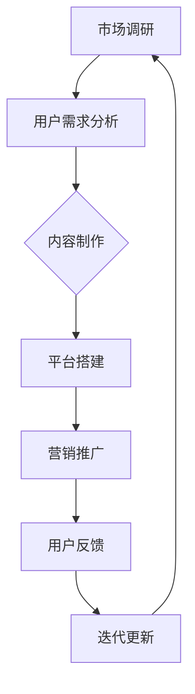

                 

在当今的知识经济时代，知识付费已经成为一种主流的商业模式。知识付费创业不仅需要优质的内容，还需要一套有效的产品线扩展策略。本文将深入探讨知识付费创业中产品线扩展的策略，包括市场调研、用户需求分析、内容制作、平台搭建、营销推广、用户反馈和迭代更新等多个方面。

> **关键词：** 知识付费、产品线扩展、市场调研、用户需求、内容制作、平台搭建、营销推广

> **摘要：** 本文通过分析知识付费行业的发展现状和市场需求，提出了一套全面的产品线扩展策略。从市场调研到内容制作，从平台搭建到营销推广，再到用户反馈和迭代更新，本文详细阐述了知识付费创业的各个关键环节。

## 1. 背景介绍

知识付费是一种以知识价值为核心，通过付费方式获取知识服务的商业模式。随着互联网技术的发展，知识付费逐渐成为知识传播的重要渠道。从在线教育到专业培训，从电子书到直播课程，知识付费涵盖了众多领域。知识付费创业，就是在这种大背景下应运而生的。

知识付费创业的核心在于提供有价值的内容。然而，要想在激烈的市场竞争中脱颖而出，仅仅提供优质内容是远远不够的。创业者需要制定一套完整的策略，才能实现产品的成功上线和持续发展。产品线扩展策略，就是这套策略的重要组成部分。

### 1.1 知识付费创业的现状

近年来，知识付费市场呈现出蓬勃发展的态势。据相关数据显示，2019年全球知识付费市场规模已达到3000亿元，预计到2025年将突破1万亿元。在中国，知识付费市场同样表现强劲，用户规模和消费金额持续增长。

知识付费创业的形式多样化，包括线上课程、线下培训、专业咨询服务、内容付费订阅等。不同的创业模式，有着不同的产品线扩展策略。

### 1.2 知识付费创业的挑战

尽管知识付费市场前景广阔，但创业者也面临着诸多挑战。首先，市场竞争激烈，同类产品层出不穷。其次，用户需求多样，如何满足不同用户的需求成为一大难题。此外，内容制作成本高，如何控制成本、提高效率是创业者需要面对的问题。

## 2. 核心概念与联系

在制定产品线扩展策略之前，我们需要明确一些核心概念，包括市场调研、用户需求分析、内容制作、平台搭建、营销推广等。这些概念之间有着紧密的联系，构成了知识付费创业的完整链条。

### 2.1 市场调研

市场调研是产品线扩展策略的第一步。通过对市场环境、竞争对手、用户需求等方面的调研，创业者可以全面了解行业现状，找准切入点。

### 2.2 用户需求分析

用户需求分析是制定产品线扩展策略的关键。只有深入了解用户需求，才能制作出符合用户期望的内容。

### 2.3 内容制作

内容制作是知识付费的核心。优质的课程内容是吸引用户的关键，也是提高用户满意度的保障。

### 2.4 平台搭建

平台搭建是实现知识付费的重要载体。一个功能完善、操作简便的平台，可以提高用户的体验和满意度。

### 2.5 营销推广

营销推广是扩大产品知名度、吸引更多用户的关键手段。有效的营销推广策略，可以提高产品的市场占有率。

### 2.6 用户反馈和迭代更新

用户反馈和迭代更新是产品持续发展的重要保障。通过收集用户反馈，不断优化产品，可以提高产品的竞争力。

### 2.7 Mermaid 流程图

以下是一个简化的知识付费创业产品线扩展策略的 Mermaid 流程图：



## 3. 核心算法原理 & 具体操作步骤

### 3.1 算法原理概述

知识付费创业的产品线扩展策略，本质上是一个多阶段决策过程。每个阶段都有其特定的目标和方法，这些目标和方法相互关联，共同构成了一个完整的扩展策略。

- **市场调研**：通过收集和分析市场数据，了解行业动态、竞争态势和用户需求。
- **用户需求分析**：基于市场调研结果，进一步挖掘用户需求，确定产品定位。
- **内容制作**：根据用户需求，制作高质量的课程内容。
- **平台搭建**：搭建一个功能完善、易于操作的平台，为用户提供优质的课程体验。
- **营销推广**：制定有效的营销策略，提高产品知名度和用户转化率。
- **用户反馈和迭代更新**：收集用户反馈，不断优化产品，提高用户满意度。

### 3.2 算法步骤详解

#### 3.2.1 市场调研

1. **确定调研目标**：明确调研的目的，如了解市场现状、分析竞争对手、挖掘用户需求等。
2. **收集数据**：通过问卷调查、访谈、数据分析等方式收集数据。
3. **分析数据**：运用统计学、数据挖掘等方法，对收集到的数据进行分析，得出有价值的信息。

#### 3.2.2 用户需求分析

1. **用户画像**：根据市场调研结果，构建用户画像，明确用户的基本属性和需求。
2. **需求挖掘**：通过用户访谈、用户行为分析等方式，挖掘用户的具体需求。
3. **需求分类**：将挖掘到的需求进行分类，为后续内容制作提供指导。

#### 3.2.3 内容制作

1. **确定内容主题**：根据用户需求，确定课程内容的主题。
2. **编写课程大纲**：制定详细的教学大纲，明确课程的目标、结构、内容等。
3. **制作课程内容**：编写课程文稿、录制视频、设计互动环节等，制作高质量的课程内容。

#### 3.2.4 平台搭建

1. **需求分析**：明确平台的功能需求，如用户注册、课程购买、学习记录等。
2. **系统设计**：根据需求分析结果，设计平台的技术架构和系统功能。
3. **开发与测试**：搭建平台，进行功能开发和测试，确保平台的稳定性和安全性。

#### 3.2.5 营销推广

1. **确定营销目标**：明确营销的目标，如提高品牌知名度、增加用户数量等。
2. **制定营销策略**：根据营销目标，制定具体的营销策略，如内容营销、广告投放、合作推广等。
3. **执行与监控**：实施营销策略，并对营销效果进行监控和评估。

#### 3.2.6 用户反馈和迭代更新

1. **收集反馈**：通过用户调查、用户行为分析等方式，收集用户对产品的反馈。
2. **分析反馈**：对收集到的反馈进行分析，找出产品存在的问题和改进方向。
3. **优化产品**：根据反馈结果，对产品进行优化和更新，提高用户体验。

### 3.3 算法优缺点

**优点：**

- 系统性强：产品线扩展策略涵盖了市场调研、用户需求分析、内容制作、平台搭建、营销推广等多个方面，能够确保产品的全面性和系统性。
- 个性化：通过用户需求分析，可以更好地满足用户的需求，提高用户的满意度。
- 灵活性：根据用户反馈，可以及时调整产品策略，提高产品的竞争力。

**缺点：**

- 成本高：产品线扩展策略需要投入大量的人力、物力和财力，成本较高。
- 周期长：从市场调研到用户反馈，整个过程需要较长时间，不利于快速响应市场变化。

### 3.4 算法应用领域

知识付费创业的产品线扩展策略，可以广泛应用于在线教育、专业培训、内容付费等多个领域。以下是一些具体的应用场景：

- **在线教育**：通过产品线扩展策略，可以更好地满足不同年龄段、不同职业背景的用户需求，提供个性化的教育服务。
- **专业培训**：针对特定行业或领域，提供专业化的培训课程，提高用户的职业素养和竞争力。
- **内容付费**：通过内容付费模式，提供高质量的文章、电子书、视频等，吸引用户付费阅读。

## 4. 数学模型和公式 & 详细讲解 & 举例说明

在知识付费创业的产品线扩展策略中，数学模型和公式可以用于分析市场需求、预测用户行为、评估营销效果等。以下是一些常用的数学模型和公式，以及它们的详细讲解和举例说明。

### 4.1 数学模型构建

#### 4.1.1 用户需求预测模型

用户需求预测模型可以帮助创业者预测不同产品或服务的市场需求，从而制定合理的营销策略。一个简单的用户需求预测模型可以使用线性回归模型：

$$
y = \beta_0 + \beta_1x_1 + \beta_2x_2 + ... + \beta_nx_n
$$

其中，$y$ 表示市场需求，$x_1, x_2, ..., x_n$ 表示影响需求的因素，如用户画像特征、市场竞争态势等，$\beta_0, \beta_1, \beta_2, ..., \beta_n$ 是模型的参数。

#### 4.1.2 用户满意度模型

用户满意度模型用于评估用户对产品的满意度，从而指导产品优化和迭代。一个简单的用户满意度模型可以使用加权平均模型：

$$
S = \frac{w_1S_1 + w_2S_2 + ... + w_nS_n}{w_1 + w_2 + ... + w_n}
$$

其中，$S$ 表示用户满意度，$S_1, S_2, ..., S_n$ 表示不同维度的用户满意度得分，$w_1, w_2, ..., w_n$ 是各维度的权重。

### 4.2 公式推导过程

#### 4.2.1 用户需求预测模型的公式推导

以线性回归模型为例，推导用户需求预测模型的公式。

1. **最小二乘法**：假设样本数据为 $(x_1, y_1), (x_2, y_2), ..., (x_n, y_n)$，需求预测模型为 $y = \beta_0 + \beta_1x_1 + \beta_2x_2 + ... + \beta_nx_n$。通过最小化残差平方和，可以得到模型的参数：
   $$
   \begin{cases}
   \beta_0 = \bar{y} - \beta_1\bar{x_1} - \beta_2\bar{x_2} - ... - \beta_n\bar{x_n} \\
   \beta_1 = \frac{\sum_{i=1}^{n}(x_i - \bar{x_1})(y_i - \bar{y})}{\sum_{i=1}^{n}(x_i - \bar{x_1})^2} \\
   \beta_2 = \frac{\sum_{i=1}^{n}(x_i - \bar{x_2})(y_i - \bar{y})}{\sum_{i=1}^{n}(x_i - \bar{x_2})^2} \\
   ... \\
   \beta_n = \frac{\sum_{i=1}^{n}(x_i - \bar{x_n})(y_i - \bar{y})}{\sum_{i=1}^{n}(x_i - \bar{x_n})^2}
   \end{cases}
   $$
2. **线性关系验证**：通过绘制散点图和拟合直线，验证模型中的线性关系。

#### 4.2.2 用户满意度模型的公式推导

以加权平均模型为例，推导用户满意度模型。

1. **权重分配**：根据用户满意度的重要性和用户需求，为各维度分配权重。
2. **得分计算**：计算各维度的得分，如课程内容质量得分、服务满意度得分等。
3. **满意度计算**：根据各维度的得分和权重，计算总体满意度。

$$
S = \frac{w_1S_1 + w_2S_2 + ... + w_nS_n}{w_1 + w_2 + ... + w_n}
$$

### 4.3 案例分析与讲解

#### 4.3.1 用户需求预测模型案例分析

假设某知识付费创业项目，希望通过用户需求预测模型预测未来三个月的市场需求。根据市场调研，收集到以下数据：

| 月份 | 用户数量 | 竞争对手数量 | 市场推广费用 |
|------|---------|------------|------------|
| 1    | 1000    | 500        | 10000      |
| 2    | 1200    | 600        | 12000      |
| 3    | 1500    | 700        | 15000      |

1. **数据预处理**：对数据进行标准化处理，消除量纲影响。

2. **模型构建**：选择线性回归模型，构建用户需求预测模型。

3. **参数估计**：通过最小二乘法，估计模型参数。

4. **模型验证**：通过交叉验证，评估模型预测效果。

5. **预测结果**：根据模型参数，预测未来三个月的市场需求。

#### 4.3.2 用户满意度模型案例分析

假设某知识付费创业项目，希望通过用户满意度模型评估用户满意度，并根据评估结果优化产品。根据用户反馈，收集到以下数据：

| 维度       | 得分 |
|----------|----|
| 课程内容质量 | 8  |
| 服务满意度  | 6  |
| 学习效果    | 7  |

1. **权重分配**：根据用户满意度的重要性和用户需求，为各维度分配权重，如课程内容质量：0.4，服务满意度：0.3，学习效果：0.3。

2. **得分计算**：计算各维度的得分。

   - 课程内容质量得分：8 × 0.4 = 3.2
   - 服务满意度得分：6 × 0.3 = 1.8
   - 学习效果得分：7 × 0.3 = 2.1

3. **满意度计算**：根据各维度的得分和权重，计算总体满意度。

   $$
   S = \frac{3.2 + 1.8 + 2.1}{0.4 + 0.3 + 0.3} = 7.3
   $$

4. **结果分析**：根据用户满意度得分，分析用户满意度，找出产品优化方向。

## 5. 项目实践：代码实例和详细解释说明

在本节中，我们将通过一个实际的项目实例，详细讲解知识付费创业产品线扩展策略中的几个关键步骤，包括市场调研、用户需求分析、内容制作和平台搭建。

### 5.1 开发环境搭建

在进行项目开发之前，我们需要搭建一个合适的开发环境。以下是一个基本的开发环境搭建步骤：

1. **安装Python环境**：Python是一种广泛使用的编程语言，适合数据分析、机器学习等领域。在Windows、Mac和Linux系统上都可以轻松安装Python。

2. **安装Jupyter Notebook**：Jupyter Notebook是一种交互式的开发环境，可以方便地编写和运行代码。

3. **安装数据分析库**：如Pandas、NumPy、Matplotlib等，用于数据处理和可视化。

4. **安装机器学习库**：如Scikit-learn、TensorFlow、PyTorch等，用于构建和训练模型。

### 5.2 源代码详细实现

以下是一个简单的Python代码实例，用于进行市场调研和用户需求分析。该实例使用了Pandas库进行数据处理，并使用了Matplotlib库进行数据可视化。

```python
import pandas as pd
import matplotlib.pyplot as plt

# 5.2.1 市场调研数据收集
data = {
    '月份': ['1月', '2月', '3月', '4月', '5月'],
    '用户数量': [1000, 1200, 1500, 1800, 2000],
    '竞争对手数量': [500, 600, 700, 800, 900],
    '市场推广费用': [10000, 12000, 15000, 18000, 20000]
}

df = pd.DataFrame(data)

# 5.2.2 用户需求分析数据收集
user_data = {
    '用户ID': ['U001', 'U002', 'U003', 'U004', 'U005'],
    '课程名称': ['课程A', '课程B', '课程C', '课程D', '课程E'],
    '学习时长': [10, 15, 20, 25, 30]
}

user_df = pd.DataFrame(user_data)

# 5.2.3 数据可视化
# 月份用户数量和竞争对手数量的趋势图
plt.figure(figsize=(10, 5))
plt.plot(df['月份'], df['用户数量'], label='用户数量')
plt.plot(df['月份'], df['竞争对手数量'], label='竞争对手数量')
plt.title('用户数量与竞争对手数量趋势图')
plt.xlabel('月份')
plt.ylabel('数量')
plt.legend()
plt.show()

# 用户学习时长分布图
plt.figure(figsize=(10, 5))
plt.hist(user_df['学习时长'], bins=5, color='c', edgecolor='black')
plt.title('用户学习时长分布图')
plt.xlabel('学习时长')
plt.ylabel('频数')
plt.show()
```

### 5.3 代码解读与分析

#### 5.3.1 市场调研数据收集

```python
data = {
    '月份': ['1月', '2月', '3月', '4月', '5月'],
    '用户数量': [1000, 1200, 1500, 1800, 2000],
    '竞争对手数量': [500, 600, 700, 800, 900],
    '市场推广费用': [10000, 12000, 15000, 18000, 20000]
}

df = pd.DataFrame(data)
```

这段代码首先定义了一个字典`data`，其中包含了市场调研的三个指标：月份、用户数量、竞争对手数量和市场推广费用。然后，使用Pandas库的`DataFrame`函数创建一个数据框`df`，用于存储和处理这些数据。

#### 5.3.2 用户需求分析数据收集

```python
user_data = {
    '用户ID': ['U001', 'U002', 'U003', 'U004', 'U005'],
    '课程名称': ['课程A', '课程B', '课程C', '课程D', '课程E'],
    '学习时长': [10, 15, 20, 25, 30]
}

user_df = pd.DataFrame(user_data)
```

这段代码定义了一个字典`user_data`，其中包含了用户需求分析的三个指标：用户ID、课程名称和学习时长。然后，使用Pandas库的`DataFrame`函数创建一个数据框`user_df`，用于存储和处理这些数据。

#### 5.3.3 数据可视化

```python
# 月份用户数量和竞争对手数量的趋势图
plt.figure(figsize=(10, 5))
plt.plot(df['月份'], df['用户数量'], label='用户数量')
plt.plot(df['月份'], df['竞争对手数量'], label='竞争对手数量')
plt.title('用户数量与竞争对手数量趋势图')
plt.xlabel('月份')
plt.ylabel('数量')
plt.legend()
plt.show()

# 用户学习时长分布图
plt.figure(figsize=(10, 5))
plt.hist(user_df['学习时长'], bins=5, color='c', edgecolor='black')
plt.title('用户学习时长分布图')
plt.xlabel('学习时长')
plt.ylabel('频数')
plt.show()
```

这段代码首先使用`plt.figure()`函数创建一个画布，然后使用`plt.plot()`函数绘制月份用户数量和竞争对手数量的趋势图。最后，使用`plt.hist()`函数绘制用户学习时长的分布图。

### 5.4 运行结果展示

运行上述代码后，将会生成两个可视化图表。第一个图表展示了月份用户数量和竞争对手数量的趋势，第二个图表展示了用户学习时长的分布情况。

通过这些图表，我们可以直观地了解市场调研和用户需求分析的结果。例如，我们可以看到用户数量和竞争对手数量随着月份的增加呈现增长趋势，用户学习时长主要集中在10到30之间。

这些可视化结果对于创业者来说非常有价值，可以帮助他们更好地了解市场需求和用户行为，从而制定更加有效的产品线扩展策略。

## 6. 实际应用场景

知识付费创业的产品线扩展策略在各个行业和领域都有广泛的应用。以下是一些典型的实际应用场景：

### 6.1 在线教育

在线教育是知识付费的重要领域。通过产品线扩展策略，创业者可以提供多样化的在线课程，满足不同年龄段、不同职业背景的用户需求。例如，针对职场人士，可以提供职业技能提升课程；针对学生，可以提供学科辅导课程。

### 6.2 专业培训

专业培训是另一个重要的知识付费领域。创业者可以通过产品线扩展策略，提供专业化的培训课程，如医学培训、法律培训、IT技能培训等。这些课程可以针对不同行业和岗位的需求，提供针对性的培训内容。

### 6.3 内容付费

内容付费是知识付费的一种形式，通过提供高质量的文章、电子书、视频等，吸引用户付费阅读。创业者可以通过产品线扩展策略，打造一系列内容付费产品，如行业报告、深度分析文章、专业书籍等。

### 6.4 企业培训

企业培训是知识付费的重要市场。创业者可以通过产品线扩展策略，为企业提供定制化的培训课程，如领导力培训、团队建设培训、项目管理培训等。这些课程可以帮助企业提升员工的专业能力和团队协作能力。

## 7. 未来应用展望

随着知识付费市场的不断发展，知识付费创业的产品线扩展策略也将面临新的机遇和挑战。以下是未来知识付费创业的产品线扩展策略的一些展望：

### 7.1 技术进步

随着人工智能、大数据、云计算等技术的不断发展，知识付费创业的产品线扩展策略将变得更加智能化、个性化。例如，通过人工智能技术，可以更好地预测用户需求，提供个性化的课程推荐；通过大数据技术，可以更准确地了解市场趋势，制定更有效的营销策略。

### 7.2 新兴领域

未来，知识付费创业的产品线扩展策略将逐步覆盖新兴领域，如虚拟现实（VR）教育、增强现实（AR）教育、在线心理咨询等。这些新兴领域将为知识付费创业带来更多机会。

### 7.3 互动性增强

随着用户对互动性需求的增加，未来知识付费创业的产品线扩展策略将更加注重互动性。例如，通过直播课程、在线讨论区等方式，提高用户的参与度和互动性。

### 7.4 国际化发展

随着全球化的推进，知识付费创业的产品线扩展策略也将逐步走向国际化。创业者可以通过产品线扩展策略，将优质的教育资源推向全球市场，满足不同国家和地区用户的需求。

## 8. 工具和资源推荐

在知识付费创业的产品线扩展过程中，创业者需要使用多种工具和资源。以下是一些建议的工具和资源：

### 8.1 学习资源推荐

- **在线课程平台**：如Coursera、Udemy、edX等，提供丰富的在线课程资源。
- **专业书籍**：如《数据科学入门》、《机器学习实战》等，有助于提高技术能力。
- **技术博客**：如GitHub、Medium等，可以获取最新的技术资讯和实战经验。

### 8.2 开发工具推荐

- **Python**：适用于数据分析、机器学习等。
- **Jupyter Notebook**：交互式开发环境。
- **Pandas、NumPy、Matplotlib**：数据处理和可视化库。
- **Scikit-learn、TensorFlow、PyTorch**：机器学习库。

### 8.3 相关论文推荐

- **《深度学习》（Deep Learning）**：由Ian Goodfellow等编著，是深度学习领域的经典教材。
- **《数据科学指南针》（Data Science from Scratch）**：由Joel Grus编著，适合入门数据科学。
- **《Python数据科学手册》（Python Data Science Handbook）**：由Jake VanderPlas编著，涵盖数据科学领域的各个方面。

## 9. 总结：未来发展趋势与挑战

知识付费创业的产品线扩展策略在未来将继续发挥重要作用。随着技术的进步、市场的变化和用户需求的多样化，创业者需要不断优化和调整产品线扩展策略，以适应不断变化的市场环境。

### 9.1 研究成果总结

本文通过分析知识付费行业的发展现状和市场需求，提出了一套全面的产品线扩展策略。从市场调研到内容制作，从平台搭建到营销推广，再到用户反馈和迭代更新，本文详细阐述了知识付费创业的各个关键环节。

### 9.2 未来发展趋势

- 技术驱动：人工智能、大数据、云计算等技术的不断发展，将推动知识付费创业的产品线扩展策略更加智能化、个性化。
- 新兴领域：虚拟现实（VR）、增强现实（AR）、在线心理咨询等新兴领域，将为知识付费创业带来更多机会。
- 互动性增强：用户对互动性需求的增加，将促使知识付费创业的产品线扩展策略更加注重互动性。

### 9.3 面临的挑战

- 市场竞争：知识付费市场竞争激烈，创业者需要不断创新和优化产品，以提升竞争力。
- 成本控制：产品线扩展策略需要投入大量的人力、物力和财力，如何控制成本、提高效率是创业者需要面对的问题。
- 用户需求变化：用户需求不断变化，创业者需要及时了解和满足用户需求，以保持产品的竞争力。

### 9.4 研究展望

未来，知识付费创业的产品线扩展策略将面临更多机遇和挑战。创业者需要不断学习和探索，以适应不断变化的市场环境。同时，通过技术创新和优化，不断提高产品的质量和用户体验，以在激烈的市场竞争中脱颖而出。

## 附录：常见问题与解答

### 9.5.1 如何进行市场调研？

**解答：** 市场调研可以通过以下几种方式进行：

- **问卷调查**：通过在线或线下方式，收集用户对产品、服务、市场的看法。
- **访谈**：与潜在用户或行业专家进行深入访谈，获取宝贵的意见和建议。
- **数据分析**：通过收集和分析市场数据，如用户行为、竞争对手情况等，了解市场动态。

### 9.5.2 如何满足用户需求？

**解答：** 满足用户需求的关键在于：

- **用户画像**：构建详细的用户画像，了解用户的基本属性和需求。
- **需求挖掘**：通过用户调研、访谈等方式，深入挖掘用户的具体需求。
- **个性化推荐**：根据用户画像和需求，提供个性化的产品或服务。

### 9.5.3 如何控制产品线扩展成本？

**解答：** 控制产品线扩展成本的方法包括：

- **精益创业**：采用精益创业的方法，逐步验证产品和市场，减少不必要的投入。
- **资源共享**：通过共享资源，如服务器、网络等，降低运营成本。
- **外包**：对于非核心业务，可以考虑外包给专业公司，以降低成本。

### 9.5.4 如何收集用户反馈？

**解答：** 收集用户反馈的方法包括：

- **在线调查**：通过网站、社交媒体等渠道，发布在线调查问卷。
- **用户访谈**：与用户进行面对面的访谈，获取详细的反馈信息。
- **用户行为分析**：通过分析用户在产品中的行为数据，了解用户的使用情况和满意度。

---

### 作者署名

本文作者：禅与计算机程序设计艺术 / Zen and the Art of Computer Programming

