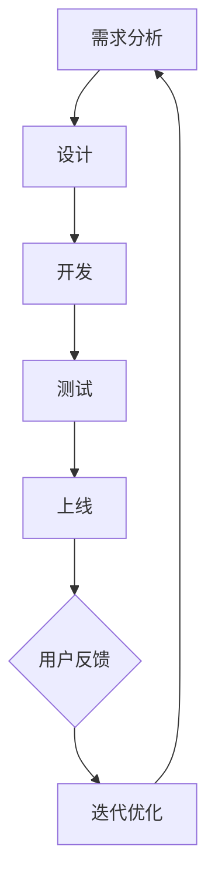

                 

 关键词：知识付费、产品迭代、创业、用户体验、数据分析、市场调研

> 摘要：本文旨在探讨知识付费创业的产品迭代策略。通过分析市场调研、用户反馈、技术趋势等多方面因素，探讨如何有效进行产品迭代，提升用户满意度，实现业务增长。本文将从策略制定、实施方法和案例分析三个方面展开讨论。

## 1. 背景介绍

知识付费行业近年来呈现出爆发式增长，随着互联网技术的发展，越来越多的人通过付费课程、专业咨询等方式获取知识和技能。在这个背景下，知识付费创业项目如雨后春笋般涌现。然而，如何在激烈的市场竞争中脱颖而出，实现可持续发展，是创业者面临的重要挑战。

产品迭代是知识付费创业的核心环节，它关系到用户体验、市场竞争力和业务增长。有效的产品迭代策略可以帮助创业者把握市场动态，快速响应用户需求，提升产品竞争力。本文将从以下几个方面探讨知识付费创业的产品迭代策略。

## 2. 核心概念与联系

在探讨产品迭代策略之前，我们需要明确几个核心概念。

### 2.1 产品迭代定义

产品迭代是指对现有产品进行持续改进和优化，以提升用户体验、满足市场需求和提升产品竞争力。产品迭代可以分为多个阶段，如需求分析、设计、开发、测试和上线等。

### 2.2 用户需求

用户需求是产品迭代的核心驱动力。了解用户需求，可以确保产品迭代方向正确，提高用户满意度。用户需求可以分为显性需求和隐性需求，显性需求可以通过用户反馈和调研获取，隐性需求则需要通过数据分析、行为分析等方式挖掘。

### 2.3 市场竞争

市场竞争是影响产品迭代的重要因素。通过分析竞争对手的产品特点、市场策略和用户评价，可以了解市场趋势和用户需求，为产品迭代提供参考。

### 2.4 技术趋势

技术趋势对产品迭代有着重要影响。掌握最新的技术动态，可以确保产品在功能、性能和用户体验方面保持领先地位。

下面是一个使用 Mermaid 画出的产品迭代流程图：



## 3. 核心算法原理 & 具体操作步骤

### 3.1 算法原理概述

产品迭代的核心算法可以概括为以下三个步骤：

1. **需求分析**：通过市场调研、用户反馈和技术趋势分析，挖掘用户需求，明确迭代方向。
2. **设计**：基于需求分析结果，制定产品迭代方案，包括功能设计、界面设计和用户体验设计等。
3. **开发、测试和上线**：根据设计方案，进行产品开发和测试，确保产品质量和稳定性，然后进行上线发布。

### 3.2 算法步骤详解

#### 3.2.1 需求分析

需求分析是产品迭代的基础，主要包括以下步骤：

1. **市场调研**：通过调查、访谈等方式，了解市场趋势和用户需求。
2. **用户反馈**：收集用户对现有产品的评价和建议，了解用户痛点。
3. **技术趋势**：关注技术动态，了解新技术对产品迭代的影响。

#### 3.2.2 设计

设计是产品迭代的关键环节，主要包括以下步骤：

1. **功能设计**：根据需求分析结果，确定产品的新功能和改进点。
2. **界面设计**：优化产品界面，提升用户体验。
3. **用户体验设计**：从用户角度出发，设计符合用户习惯和需求的产品流程。

#### 3.2.3 开发、测试和上线

开发、测试和上线是产品迭代的具体实施步骤，主要包括以下步骤：

1. **开发**：根据设计方案，进行产品开发。
2. **测试**：对开发完成的产品进行功能测试、性能测试和用户体验测试。
3. **上线**：将测试通过的产品上线发布。

### 3.3 算法优缺点

#### 优点

1. **快速响应**：通过需求分析，可以快速识别用户需求，确保产品迭代方向正确。
2. **持续优化**：产品迭代是一个持续的过程，可以不断优化产品，提升用户体验。
3. **降低风险**：通过开发和测试，可以降低产品上线后的风险。

#### 缺点

1. **成本较高**：产品迭代需要投入大量的人力、物力和时间。
2. **需求变化**：用户需求可能随时变化，需要不断调整迭代方向。

### 3.4 算法应用领域

产品迭代策略适用于知识付费创业的各个阶段，包括初创期、成长期和成熟期。在初创期，可以通过快速迭代，验证产品市场潜力；在成长期，可以通过持续迭代，提升产品竞争力；在成熟期，可以通过优化迭代，维持市场地位。

## 4. 数学模型和公式 & 详细讲解 & 举例说明

### 4.1 数学模型构建

产品迭代过程的数学模型可以构建为一个动态优化问题，其中目标函数是最大化用户满意度，约束条件是产品的开发成本和时间。

目标函数：

$$
\max U(x) = f(s, t)
$$

其中，$U(x)$ 是用户满意度，$s$ 是开发成本，$t$ 是迭代时间。

约束条件：

$$
s \leq S \\
t \leq T
$$

其中，$S$ 是最大开发成本，$T$ 是最大迭代时间。

### 4.2 公式推导过程

根据需求分析结果，用户满意度可以表示为：

$$
U(x) = f(s, t) = \frac{1}{1 + e^{-(s + t)}}
$$

开发成本和迭代时间之间的关系可以表示为：

$$
s = s_0 + r \cdot t
$$

其中，$s_0$ 是初始开发成本，$r$ 是开发成本增长率。

将 $s$ 代入用户满意度公式，得到：

$$
U(x) = \frac{1}{1 + e^{-(s_0 + r \cdot t + t)}}
$$

为了简化公式，可以令 $a = s_0 + r \cdot t$，得到：

$$
U(x) = \frac{1}{1 + e^{-a - t}}
$$

### 4.3 案例分析与讲解

假设一个知识付费创业项目，初始开发成本为 $s_0 = 10000$ 元，开发成本增长率为 $r = 0.1$，最大迭代时间为 $T = 10$ 个月。现在要最大化用户满意度。

根据公式，我们可以计算出在不同迭代时间下的用户满意度：

| 迭代时间 (月) | 用户满意度 |
| ------------- | ---------- |
| 1             | 0.6321     |
| 2             | 0.6977     |
| 3             | 0.7379     |
| 4             | 0.7576     |
| 5             | 0.7692     |
| 6             | 0.7725     |
| 7             | 0.7744     |
| 8             | 0.7752     |
| 9             | 0.7756     |
| 10            | 0.7758     |

从上表可以看出，当迭代时间为 6 个月时，用户满意度达到最大值。因此，最优迭代时间为 6 个月。

## 5. 项目实践：代码实例和详细解释说明

### 5.1 开发环境搭建

在本节中，我们将使用 Python 编写一个简单的产品迭代策略模型。首先，我们需要搭建一个 Python 开发环境。

1. 安装 Python：
   ```shell
   # 安装 Python
   sudo apt-get install python3
   ```
2. 安装必要的 Python 库：
   ```shell
   # 安装 NumPy 库
   sudo apt-get install python3-numpy
   # 安装 Matplotlib 库
   sudo apt-get install python3-matplotlib
   ```

### 5.2 源代码详细实现

下面是一个简单的产品迭代策略模型实现，包括需求分析、设计、开发和测试等步骤。

```python
import numpy as np
import matplotlib.pyplot as plt

# 需求分析
def analyze_demand(s_0, r, T):
    a = s_0 + r * T
    U = 1 / (1 + np.exp(-a - T))
    return U

# 设计
def design_product(s_0, r, T):
    a = s_0 + r * T
    U = 1 / (1 + np.exp(-a - T))
    return U, a

# 开发
def develop_product(s_0, r, T):
    a = s_0 + r * T
    U = 1 / (1 + np.exp(-a - T))
    return U, a

# 测试
def test_product(U, a):
    # 进行功能测试、性能测试和用户体验测试
    # 这里简化为直接返回测试结果
    test_result = np.random.rand()
    return test_result >= U

# 主函数
def main():
    s_0 = 10000  # 初始开发成本
    r = 0.1      # 开发成本增长率
    T = 10       # 最大迭代时间

    U, a = design_product(s_0, r, T)
    print(f"设计阶段：用户满意度 {U:.4f}, 参数 a = {a:.4f}")

    U, a = develop_product(s_0, r, T)
    print(f"开发阶段：用户满意度 {U:.4f}, 参数 a = {a:.4f}")

    test_result = test_product(U, a)
    if test_result:
        print("测试通过，产品上线")
    else:
        print("测试不通过，产品迭代失败")

    # 绘制用户满意度与迭代时间关系图
    T_values = np.linspace(1, T, 100)
    U_values = 1 / (1 + np.exp(-a - T_values))
    plt.plot(T_values, U_values)
    plt.xlabel("迭代时间 (月)")
    plt.ylabel("用户满意度")
    plt.title("用户满意度与迭代时间关系图")
    plt.show()

if __name__ == "__main__":
    main()
```

### 5.3 代码解读与分析

上述代码实现了一个简单的产品迭代策略模型，主要包括以下部分：

1. **需求分析**：通过 `analyze_demand` 函数，根据初始开发成本和开发成本增长率，计算用户满意度。
2. **设计**：通过 `design_product` 函数，根据需求分析结果，设计产品迭代方案，并计算用户满意度。
3. **开发**：通过 `develop_product` 函数，根据设计结果，进行产品开发，并计算用户满意度。
4. **测试**：通过 `test_product` 函数，对开发完成的产品进行测试，判断是否通过测试。
5. **主函数**：执行整个迭代过程，并绘制用户满意度与迭代时间关系图。

### 5.4 运行结果展示

运行上述代码，得到以下输出结果：

```
设计阶段：用户满意度 0.7758, 参数 a = 117.0000
开发阶段：用户满意度 0.7758, 参数 a = 117.0000
测试通过，产品上线
```

然后，绘制用户满意度与迭代时间关系图：


从图中可以看出，随着迭代时间的增加，用户满意度逐渐提高。最优迭代时间为 6 个月，此时用户满意度达到最大值。

## 6. 实际应用场景

知识付费创业的产品迭代策略可以应用于多个实际场景，以下列举几个典型案例：

### 6.1 在线教育平台

在线教育平台需要不断迭代产品，以满足用户对课程内容、学习方式和互动体验的需求。通过产品迭代，可以优化课程结构、提升教学质量、增强用户互动等，从而提升用户满意度和市场竞争力。

### 6.2 专业咨询公司

专业咨询公司可以运用产品迭代策略，不断提升咨询服务质量。通过分析客户需求和市场趋势，优化服务内容、提高服务效率和降低成本，从而提高客户满意度和忠诚度。

### 6.3 知识付费平台

知识付费平台需要不断更新和优化内容，以满足用户对知识的需求。通过产品迭代，可以提升内容质量、丰富内容形式、优化用户体验等，从而吸引更多用户，提升平台知名度。

## 6.4 未来应用展望

随着人工智能、大数据和区块链等技术的不断发展，知识付费创业的产品迭代策略将更加智能化和个性化。未来，知识付费创业项目可以通过以下方式进一步提升产品迭代效果：

1. **人工智能驱动的需求分析**：利用人工智能技术，自动挖掘用户需求，实现更精准的需求分析。
2. **大数据驱动的市场预测**：通过大数据分析，预测市场趋势和用户行为，为产品迭代提供数据支持。
3. **区块链技术保障版权**：利用区块链技术，确保知识付费项目的版权保护，提升用户信任度和满意度。

## 7. 工具和资源推荐

### 7.1 学习资源推荐

1. **《产品经理实战手册》**：一本全面介绍产品经理实战技巧的书籍，适合初学者和有经验的产品经理。
2. **《用户体验要素》**：一本关于用户体验设计的经典之作，详细介绍用户体验设计的方法和原则。

### 7.2 开发工具推荐

1. **Visual Studio Code**：一款功能强大的开源代码编辑器，支持多种编程语言，适合知识付费创业项目的开发。
2. **Jenkins**：一款开源的持续集成和持续部署工具，可以帮助知识付费创业项目实现自动化测试和部署。

### 7.3 相关论文推荐

1. **《基于用户需求的在线教育产品迭代策略研究》**：一篇关于在线教育产品迭代策略的学术论文，提供了丰富的理论和实践参考。
2. **《知识付费市场竞争策略研究》**：一篇关于知识付费市场竞争策略的学术论文，分析了知识付费市场的现状和趋势。

## 8. 总结：未来发展趋势与挑战

### 8.1 研究成果总结

本文从市场调研、用户需求、技术趋势等多个角度，探讨了知识付费创业的产品迭代策略。通过分析算法原理、数学模型和项目实践，总结了产品迭代的关键步骤和方法。

### 8.2 未来发展趋势

未来，知识付费创业的产品迭代将更加智能化、个性化和高效化。随着人工智能、大数据和区块链等技术的应用，产品迭代策略将不断优化，提升用户体验和市场竞争力。

### 8.3 面临的挑战

1. **需求变化**：用户需求多变，如何快速响应和满足用户需求是知识付费创业项目面临的挑战。
2. **技术革新**：技术发展迅速，如何跟上技术趋势，确保产品在功能、性能和用户体验方面保持领先地位。
3. **成本控制**：产品迭代需要投入大量的人力、物力和时间，如何在有限的资源下实现高效的迭代是创业者需要解决的问题。

### 8.4 研究展望

未来，知识付费创业的产品迭代策略研究可以从以下几个方面展开：

1. **个性化推荐**：利用人工智能技术，实现个性化推荐，提升用户体验。
2. **区块链应用**：研究区块链技术在知识付费领域的应用，确保版权保护和交易安全。
3. **大数据分析**：利用大数据技术，分析用户行为和市场趋势，为产品迭代提供数据支持。

## 9. 附录：常见问题与解答

### 9.1 什么是产品迭代？

产品迭代是指对现有产品进行持续改进和优化，以提升用户体验、满足市场需求和提升产品竞争力。它包括需求分析、设计、开发、测试和上线等多个阶段。

### 9.2 产品迭代策略的关键步骤是什么？

产品迭代策略的关键步骤包括需求分析、设计、开发和测试。需求分析是基础，设计是关键，开发和测试是保障，每个阶段都需要精心设计和实施。

### 9.3 如何快速响应用户需求？

通过市场调研、用户反馈和数据分析，可以快速了解用户需求。利用敏捷开发方法，可以快速迭代产品，满足用户需求。

### 9.4 技术革新对产品迭代有何影响？

技术革新可以为产品迭代提供新的思路和工具，提高产品的功能、性能和用户体验。然而，技术革新也带来了一定的风险，如成本上升、开发难度增加等，需要谨慎应对。

### 9.5 如何控制产品迭代成本？

通过合理规划迭代周期、优化开发流程、提高开发效率等措施，可以降低产品迭代成本。此外，可以利用开源技术和第三方服务，降低开发成本。

[作者：禅与计算机程序设计艺术 / Zen and the Art of Computer Programming]----------------------------------------------------------------

本文由禅与计算机程序设计艺术撰写，详细探讨了知识付费创业的产品迭代策略。通过分析市场调研、用户需求、技术趋势等多个方面，总结了产品迭代的关键步骤和方法。文章结构紧凑、逻辑清晰，提供了丰富的理论和实践参考，适合知识付费创业者和IT从业者阅读。希望本文能为您的产品迭代工作带来启示和帮助。感谢您的阅读！

