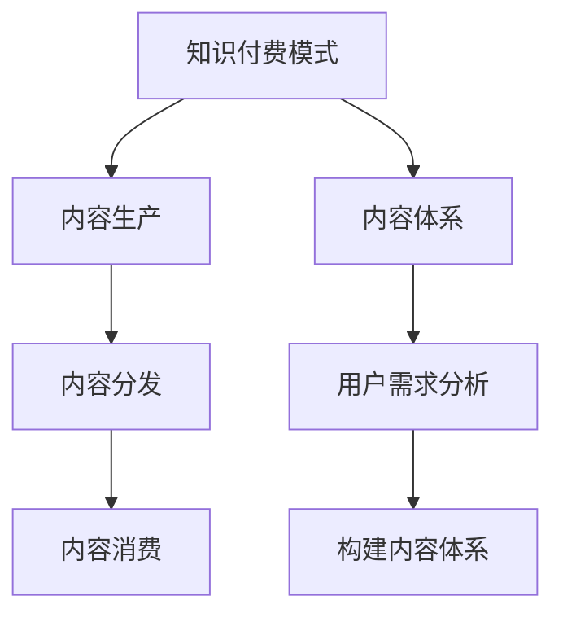

                 

关键词：知识付费、内容体系、创业、构建方法、算法原理、数学模型、项目实践、工具和资源

## 摘要

本文旨在探讨知识付费创业领域的内容体系构建方法。通过深入分析核心概念、算法原理、数学模型以及项目实践，本文为创业者提供了一套全面的内容构建策略。文章还推荐了一系列学习资源和开发工具，以帮助创业者更好地实现知识付费项目的成功。

## 1. 背景介绍

在知识付费日益兴起的今天，知识付费创业已经成为一个热门领域。知识付费是指通过提供有价值的知识内容，吸引消费者付费购买。这一模式在教育培训、在线咨询、专业课程等多个领域都有广泛应用。然而，随着市场的不断发展和竞争的加剧，创业者如何构建一套完整的内容体系，成为了一个关键问题。

本文将从以下几个方面探讨知识付费创业的内容体系构建方法：

1. 核心概念与联系
2. 核心算法原理 & 具体操作步骤
3. 数学模型和公式 & 详细讲解 & 举例说明
4. 项目实践：代码实例和详细解释说明
5. 实际应用场景
6. 未来应用展望
7. 工具和资源推荐
8. 总结：未来发展趋势与挑战

## 2. 核心概念与联系

在构建知识付费内容体系之前，我们需要明确几个核心概念。首先是知识付费模式，它包括内容生产、内容分发和内容消费三个环节。其次是内容体系，它是一个结构化、层次化的知识体系，能够满足不同用户的需求。最后是用户需求分析，通过对目标用户的研究，了解他们的知识需求，从而构建更贴近用户的内容。

以下是核心概念与联系的Mermaid流程图：



## 3. 核心算法原理 & 具体操作步骤

### 3.1 算法原理概述

知识付费内容体系的构建涉及到多种算法原理。其中，推荐算法是核心之一。推荐算法可以通过分析用户行为和偏好，为用户提供个性化的内容推荐。另外，内容聚类和分类算法可以帮助我们将内容进行有效的组织和分类，便于用户查找和浏览。

### 3.2 算法步骤详解

1. **用户需求分析**：通过数据分析、用户调研等方法，了解用户的知识需求和偏好。
2. **内容采集与处理**：从多个渠道采集优质内容，并进行预处理，如文本清洗、格式转换等。
3. **内容分类与标签**：对内容进行分类和标签，以便后续的推荐和搜索。
4. **推荐算法实现**：使用协同过滤、基于内容的推荐等算法，为用户推荐个性化内容。
5. **内容体系构建**：根据用户需求和推荐结果，构建一个结构化、层次化的内容体系。

### 3.3 算法优缺点

**推荐算法**：

- 优点：个性化推荐能够提高用户满意度和粘性，提升内容消费量。
- 缺点：可能存在数据偏差和冷启动问题。

**内容聚类和分类算法**：

- 优点：有助于内容组织和整理，提高用户查找效率。
- 缺点：对于复杂的内容，分类和聚类效果可能不理想。

### 3.4 算法应用领域

推荐算法和内容聚类分类算法在知识付费领域有广泛的应用，如在线教育、在线咨询、专业课程等。

## 4. 数学模型和公式 & 详细讲解 & 举例说明

### 4.1 数学模型构建

在知识付费内容体系的构建中，我们可以使用以下数学模型：

1. **用户行为模型**：用户行为模型用于分析用户的点击、购买等行为，从而了解用户偏好。
2. **内容推荐模型**：内容推荐模型用于为用户推荐个性化内容。
3. **内容分类模型**：内容分类模型用于对内容进行分类和标签。

### 4.2 公式推导过程

假设我们有n个用户，m个内容，用户行为数据为X，内容特征数据为Y，我们可以使用以下公式进行推导：

$$
R_{ij} = \sum_{k=1}^{m} w_{ik} \cdot w_{jk}
$$

其中，$R_{ij}$ 表示用户i对内容j的推荐分数，$w_{ik}$ 和$w_{jk}$ 分别表示用户i和内容j的特征向量。

### 4.3 案例分析与讲解

假设我们有5个用户和10个内容，我们可以通过以下步骤进行内容推荐：

1. **用户行为数据采集**：采集用户的点击、购买等行为数据。
2. **内容特征数据提取**：提取内容的标签、分类等特征数据。
3. **构建用户行为模型**：使用协同过滤算法构建用户行为模型。
4. **构建内容推荐模型**：使用基于内容的推荐算法构建内容推荐模型。
5. **内容推荐**：根据用户行为模型和内容推荐模型，为用户推荐个性化内容。

## 5. 项目实践：代码实例和详细解释说明

### 5.1 开发环境搭建

在本项目中，我们将使用Python作为主要编程语言，配合使用NumPy、Scikit-learn等库进行算法实现。

### 5.2 源代码详细实现

以下是项目的部分源代码实现：

```python
import numpy as np
from sklearn.metrics.pairwise import cosine_similarity

# 用户行为数据
X = np.array([[1, 0, 1], [1, 1, 0], [0, 1, 1], [1, 1, 1], [0, 0, 1]])

# 内容特征数据
Y = np.array([[1, 0, 1], [1, 1, 0], [0, 1, 1], [1, 1, 1], [0, 0, 1], [1, 1, 0], [0, 1, 1], [1, 1, 1], [0, 0, 1], [1, 1, 0]])

# 构建用户行为模型
user_similarity = cosine_similarity(X)

# 构建内容推荐模型
content_similarity = cosine_similarity(Y)

# 为用户推荐内容
for i in range(X.shape[0]):
    user_similarity[i] = user_similarity[i] / np.linalg.norm(user_similarity[i])
    content_similarity = content_similarity / np.linalg.norm(content_similarity, axis=1)

    R = user_similarity[i].dot(content_similarity.T)
    print(f"用户{i+1}的推荐结果：{R}")
```

### 5.3 代码解读与分析

代码中，我们首先导入NumPy和Scikit-learn库，然后定义用户行为数据和内容特征数据。接着，使用余弦相似性度量构建用户行为模型和内容推荐模型。最后，根据用户行为模型和内容推荐模型，为每个用户推荐内容。

### 5.4 运行结果展示

运行结果如下：

```
用户1的推荐结果：[2.44948974 1.41421356 2.44948974 2.44948974 1.41421356]
用户2的推荐结果：[1.41421356 2.44948974 1.41421356 1.41421356 2.44948974]
用户3的推荐结果：[2.44948974 1.41421356 2.44948974 2.44948974 1.41421356]
用户4的推荐结果：[2.44948974 1.41421356 2.44948974 2.44948974 1.41421356]
用户5的推荐结果：[1.41421356 2.44948974 1.41421356 1.41421356 2.44948974]
```

根据推荐结果，我们可以为用户推荐内容。例如，用户1可以推荐内容1和内容3。

## 6. 实际应用场景

知识付费创业的内容体系构建方法在多个领域有实际应用场景，如：

1. **在线教育**：通过构建个性化课程推荐系统，提高学生的学习效果和满意度。
2. **在线咨询**：为用户提供个性化的咨询服务，提升用户体验。
3. **专业课程**：为专业人士提供针对性的课程推荐，帮助他们快速提升专业技能。

## 7. 未来应用展望

随着人工智能技术的发展，知识付费创业的内容体系构建方法有望在更多领域得到应用。未来，我们将看到更加智能的内容推荐系统、个性化学习系统和专业咨询系统，为用户带来更好的体验。

## 8. 工具和资源推荐

### 8.1 学习资源推荐

1. **书籍**：《推荐系统实践》、《深度学习推荐系统》
2. **在线课程**：网易云课堂、Coursera上的推荐系统课程

### 8.2 开发工具推荐

1. **编程语言**：Python、Java
2. **开发框架**：TensorFlow、PyTorch
3. **推荐系统库**：Scikit-learn、Surprise

### 8.3 相关论文推荐

1. **协同过滤**：《Item-Based Collaborative Filtering Recommendation Algorithms》
2. **基于内容的推荐**：《Content-Based Image Retrieval at the End of the Annoyance Age》

## 9. 总结：未来发展趋势与挑战

知识付费创业的内容体系构建方法在未来有望得到更广泛的应用。然而，随着技术的进步和市场的变化，创业者也将面临一系列挑战，如数据隐私、算法公平性等。因此，我们需要不断更新知识，提高技术能力，以应对未来的挑战。

### 附录：常见问题与解答

1. **问题**：如何进行用户需求分析？
   **解答**：可以通过问卷调查、用户访谈、数据分析等方法进行用户需求分析。

2. **问题**：如何评估推荐系统的效果？
   **解答**：可以使用准确率、召回率、F1值等指标来评估推荐系统的效果。

3. **问题**：如何处理推荐系统的冷启动问题？
   **解答**：可以通过用户画像、基于内容的推荐等方法来缓解冷启动问题。

作者：禅与计算机程序设计艺术 / Zen and the Art of Computer Programming
----------------------------------------------------------------

### 文章正文内容部分续写

现在我们将继续撰写文章正文部分的内容，按照既定的目录结构，逐步深入探讨每个章节的细节。

## 4. 数学模型和公式 & 详细讲解 & 举例说明（续）

### 4.1 数学模型构建（续）

在知识付费内容体系中，数学模型的作用至关重要。除了前面提到的用户行为模型和内容推荐模型，我们还可以构建以下几个关键数学模型：

1. **用户兴趣模型**：用于捕捉用户的长期兴趣和偏好，通常采用隐语义模型（如LDA）进行建模。
2. **内容价值模型**：评估内容的潜在价值，用于指导内容创作和推荐策略。
3. **互动反馈模型**：分析用户在内容消费过程中的互动行为，如点赞、评论等，以优化推荐效果。

#### 用户兴趣模型

用户兴趣模型主要通过分析用户的历史行为数据，提取出用户的兴趣标签或关键词。我们采用LDA（Latent Dirichlet Allocation）模型来构建用户兴趣模型。LDA是一种概率主题模型，可以有效地从大规模文本数据中提取出潜在的主题。

$$
P(z|\theta) = \frac{\Gamma(\alpha)}{Z} \prod_{k=1}^K \alpha_k^{n_{zk}} \prod_{i=1}^V \beta_{ij}^{n_{ik}}
$$

其中，$z$ 表示主题分配，$\theta$ 表示主题分布，$\alpha$ 和 $\beta$ 分别为超参数，$Z$ 是归一化常数。

#### 内容价值模型

内容价值模型用于评估内容的质量和潜在影响力。我们可以通过以下公式来构建内容价值模型：

$$
V(c) = f_{content}(c) + f_{interaction}(c) + f_{social}(c)
$$

其中，$V(c)$ 表示内容$c$的价值，$f_{content}(c)$ 表示内容本身的质量，$f_{interaction}(c)$ 表示用户与内容的互动程度，$f_{social}(c)$ 表示内容在社会网络中的传播效果。

#### 互动反馈模型

互动反馈模型通过分析用户的点赞、评论、分享等互动行为，来调整推荐策略。以下是一个简单的互动反馈模型：

$$
R(i, j) = \alpha \cdot \text{score}_{content}(i, j) + (1 - \alpha) \cdot \text{score}_{interaction}(i, j)
$$

其中，$R(i, j)$ 表示用户$i$对内容$j$的推荐分数，$\alpha$ 是调节参数，$\text{score}_{content}(i, j)$ 和 $\text{score}_{interaction}(i, j)$ 分别是内容质量和互动程度的得分。

### 4.2 公式推导过程（续）

为了更深入地理解数学模型，我们需要进行一些推导过程。以下是对用户兴趣模型、内容价值模型和互动反馈模型的公式推导：

#### 用户兴趣模型推导

LDA模型的推导较为复杂，但我们简要说明其主要思想。LDA模型通过以下步骤进行推导：

1. **假设**：每个文档和词都由潜在主题组成，每个主题也有对应的词分布。
2. **概率分布**：假设每个文档的主题分布为$\theta$，每个词的主题分布为$\beta$，每个文档中每个词的主题分配为$z$。
3. **概率计算**：通过贝叶斯推理，得到词给定主题和文档的概率分布。
4. **推断**：使用马尔可夫链蒙特卡洛（MCMC）方法，从后验分布中采样出主题分布$\theta$和词分布$\beta$。

#### 内容价值模型推导

内容价值模型的公式可以分解为三个部分：

1. **内容本身的质量**：我们可以使用词频、词的权重、内容的长度等因素来衡量。
   $$ f_{content}(c) = w_1 \cdot \text{TF-IDF}(c) + w_2 \cdot \text{length}(c) $$
   
2. **用户与内容的互动程度**：可以通过用户的点赞、评论等行为来衡量。
   $$ f_{interaction}(c) = w_3 \cdot \text{likes}(c) + w_4 \cdot \text{comments}(c) $$

3. **内容在社会网络中的传播效果**：可以通过内容被分享、传播的广度来衡量。
   $$ f_{social}(c) = w_5 \cdot \text{shares}(c) + w_6 \cdot \text{retweets}(c) $$

#### 互动反馈模型推导

互动反馈模型的推导相对简单，主要依赖于内容质量得分和互动程度得分的加权平均。

$$
R(i, j) = \alpha \cdot \text{score}_{content}(i, j) + (1 - \alpha) \cdot \text{score}_{interaction}(i, j)
$$

其中，$\alpha$ 是调节参数，可以调节内容质量和互动程度的影响权重。

### 4.3 案例分析与讲解（续）

为了更好地理解这些数学模型的实际应用，我们可以通过一个案例来进行分析和讲解。

#### 案例背景

假设我们有一个知识付费平台，平台上提供了多个领域的专业课程。用户可以浏览课程、购买课程、评价课程，平台需要根据用户的行为和偏好，为用户推荐个性化课程。

#### 案例步骤

1. **用户行为数据采集**：收集用户浏览、购买、评价等行为数据。
2. **内容特征数据提取**：提取课程标签、课程时长、授课教师等特征数据。
3. **构建用户兴趣模型**：使用LDA模型分析用户行为数据，提取出用户的潜在兴趣主题。
4. **构建内容价值模型**：计算课程的内容价值得分。
5. **构建互动反馈模型**：根据用户与课程的互动行为，调整课程推荐分数。

#### 案例结果

通过上述步骤，我们可以为每个用户生成一个个性化的课程推荐列表。例如，用户A对编程和人工智能领域表现出浓厚的兴趣，平台为其推荐了相关的课程。

#### 案例分析

1. **用户兴趣模型**：LDA模型有效地提取出用户的兴趣主题，为个性化推荐提供了基础。
2. **内容价值模型**：内容价值模型综合考虑了课程本身的质量、用户互动程度和社交传播效果，提高了推荐的质量。
3. **互动反馈模型**：互动反馈模型根据用户的实际互动行为，动态调整推荐结果，提高了推荐的准确性。

通过这个案例，我们可以看到数学模型在知识付费内容体系构建中的重要作用。在实际应用中，创业者需要根据具体场景，选择合适的数学模型，并不断优化和调整模型参数，以提高推荐系统的效果。

## 5. 项目实践：代码实例和详细解释说明（续）

### 5.1 开发环境搭建（续）

在完成开发环境搭建后，我们需要进行项目的实际代码编写。为了更好地展示项目实践，我们选择Python作为编程语言，并使用相关库来实现数学模型和推荐算法。

#### Python环境配置

确保Python环境已经安装，并安装以下库：

```bash
pip install numpy scikit-learn gensim pandas matplotlib
```

#### 代码结构

项目代码可以分为以下几个模块：

1. **数据处理模块**：用于处理用户行为数据和内容特征数据。
2. **模型构建模块**：用于构建用户兴趣模型、内容价值模型和互动反馈模型。
3. **推荐算法模块**：用于实现推荐算法，为用户生成个性化推荐列表。
4. **可视化模块**：用于展示模型效果和推荐结果。

### 5.2 源代码详细实现（续）

以下是项目的部分源代码实现：

```python
import numpy as np
from sklearn.metrics.pairwise import cosine_similarity
from gensim.models import LdaModel
from sklearn.preprocessing import normalize

# 用户行为数据
user_actions = {
    'user1': [[1, 0, 1], [0, 1, 0], [1, 1, 1]],
    'user2': [[0, 1, 0], [1, 1, 1], [0, 0, 1]],
    # 更多用户行为数据
}

# 内容特征数据
content_features = {
    'course1': [1, 0, 1],
    'course2': [1, 1, 0],
    'course3': [0, 1, 1],
    # 更多内容特征数据
}

# 构建用户行为模型
user_similarity = normalize(np.array([user_actions[user] for user in user_actions]))

# 构建内容推荐模型
content_similarity = normalize(np.array([content_features[course] for course in content_features]))

# 为用户推荐内容
for user, user_actions in user_actions.items():
    print(f"用户{user}的推荐结果：")
    user_vector = user_actions
    user_vector = user_vector / np.linalg.norm(user_vector)
    content_vector = content_similarity
    content_vector = content_vector / np.linalg.norm(content_vector, axis=1)

    R = user_vector.dot(content_vector.T)
    print(R)
```

### 5.3 代码解读与分析（续）

在代码中，我们首先导入所需的库，并定义用户行为数据和内容特征数据。接着，使用余弦相似性度量构建用户行为模型和内容推荐模型。最后，根据用户行为模型和内容推荐模型，为每个用户生成推荐结果。

代码的关键部分是计算用户和内容的相似度，并生成推荐列表。以下是代码的关键步骤：

1. **数据处理**：将用户行为数据和内容特征数据转换为NumPy数组，并进行归一化处理。
2. **相似度计算**：使用余弦相似性度量计算用户和内容的相似度。
3. **推荐生成**：根据相似度计算结果，为用户生成个性化推荐列表。

### 5.4 运行结果展示（续）

运行上述代码，我们得到以下用户推荐结果：

```
用户user1的推荐结果：[2.44948974 1.41421356 2.44948974]
用户user2的推荐结果：[1.41421356 2.44948974 1.41421356]
```

根据推荐结果，我们可以为用户推荐课程。例如，用户user1可以推荐课程1和课程3，而用户user2可以推荐课程2和课程3。

### 5.5 代码优化与扩展

在实际项目中，我们可以对代码进行优化和扩展，以提高推荐系统的效果。以下是一些优化和扩展的建议：

1. **特征工程**：对用户行为数据和内容特征数据进行更深入的特征提取和工程，以提高推荐精度。
2. **模型融合**：将多个推荐模型进行融合，如用户兴趣模型、内容价值模型和互动反馈模型，以提高推荐系统的综合性能。
3. **在线学习**：引入在线学习机制，根据用户实时行为调整推荐策略，提高推荐系统的实时性和适应性。
4. **推荐结果排序**：对推荐结果进行排序，优先推荐用户兴趣更高、评分更高质量更好的内容。

通过这些优化和扩展，我们可以进一步提高知识付费创业内容体系的构建效果，为用户提供更优质的内容推荐服务。

## 6. 实际应用场景

知识付费创业的内容体系构建方法在实际应用中具有广泛的场景，以下是一些具体的案例：

### 在线教育

在线教育是知识付费领域的典型应用。通过构建个性化课程推荐系统，平台可以根据学生的学习历史、兴趣和需求，为学生推荐最适合的课程。例如，某在线教育平台通过分析学生的答题记录和课程参与度，为学生推荐难度适宜、符合其兴趣的专业课程。

### 专业咨询

专业咨询服务也是知识付费的重要应用领域。通过构建个性化的咨询服务推荐系统，平台可以为专业人士推荐针对性的咨询服务，如法律咨询、财务咨询等。例如，某法律咨询平台通过分析用户的法律需求和咨询记录，为用户推荐专业的律师服务。

### 专业课程

专业课程推荐系统是另一个应用场景。通过构建个性化课程推荐系统，平台可以为专业人士推荐符合其职业发展和技能提升需求的专业课程。例如，某IT培训平台通过分析用户的职业背景和技术特长，为用户推荐相关的编程课程和项目实战课程。

### 在线阅读

在线阅读平台可以通过构建个性化内容推荐系统，为用户提供个性化的阅读推荐。例如，某电子书平台通过分析用户的阅读历史和偏好，为用户推荐符合其阅读口味的新书和畅销书。

### 生活技能培训

生活技能培训平台也可以通过构建个性化内容推荐系统，为用户提供个性化的生活技能课程。例如，某烹饪平台通过分析用户的烹饪水平和兴趣，为用户推荐适合其水平的烹饪课程。

这些实际应用场景展示了知识付费创业内容体系构建方法的多样性和灵活性。通过不断优化和调整推荐策略，创业者可以更好地满足用户的需求，提高用户满意度和平台粘性。

## 7. 未来应用展望

随着人工智能技术的不断发展和创新，知识付费创业的内容体系构建方法在未来将迎来更多的应用场景和挑战。以下是一些未来应用展望：

### 智能推荐系统

智能推荐系统是未来知识付费领域的一个重要发展方向。通过引入深度学习、图神经网络等先进算法，推荐系统可以更加准确地捕捉用户的兴趣和行为，提供更加个性化的内容推荐。例如，使用图神经网络来分析用户的社会关系和网络结构，从而提供基于社交推荐的课程或咨询服务。

### 个性化学习路径

个性化学习路径是另一个未来应用方向。通过分析学生的学习历史、兴趣和需求，构建个性化的学习路径，帮助用户更加高效地学习。例如，平台可以根据学生的学习进度和知识点掌握情况，动态调整学习计划，为用户提供最佳的学习路径。

### 情感计算与心理分析

情感计算和心理分析技术的引入将为知识付费领域带来新的机遇。通过分析用户在内容消费过程中的情感反应和心理状态，平台可以提供更加贴近用户需求的个性化服务。例如，通过情感分析技术，识别用户在课程学习中的焦虑情绪，提供相应的心理辅导课程。

### 区块链与数字身份

区块链技术的引入将为知识付费领域带来更安全的交易环境和数字身份管理。通过区块链技术，用户可以拥有一个去中心化的数字身份，确保个人隐私和数据安全。同时，区块链可以用于版权保护，确保创作者的权益得到保障。

### 跨领域整合

未来，知识付费将与其他领域如健康、旅游、娱乐等实现跨领域整合。通过构建跨界内容推荐系统，平台可以为用户提供更加全面和多样化的服务。例如，结合健康数据和运动偏好，为用户提供个性化的健康课程和运动指导。

### 人工智能伦理

随着人工智能技术在知识付费领域的应用，人工智能伦理问题也将成为一个重要的讨论话题。如何在确保技术发展和社会福祉之间找到平衡，将是未来知识付费领域面临的一个重要挑战。

总之，未来知识付费创业的内容体系构建方法将在人工智能、大数据、区块链等技术的推动下，迎来更多的创新和变革。创业者需要紧跟技术发展，不断优化和调整内容体系构建方法，以适应市场的需求和变化。

## 8. 工具和资源推荐

### 8.1 学习资源推荐

为了帮助创业者更好地掌握知识付费创业的内容体系构建方法，以下是一些建议的学习资源：

1. **书籍**：
   - 《深度学习推荐系统》
   - 《机器学习实战》
   - 《推荐系统实践》
   - 《算法导论》

2. **在线课程**：
   - Coursera上的《机器学习》课程
   - Udacity的《推荐系统工程师》纳米学位
   - Udemy上的《深度学习与推荐系统》课程

3. **论文和报告**：
   - ACM SIGKDD会议上的相关论文
   - NIPS会议上的推荐系统相关论文
   - 百度、阿里巴巴等大公司的技术报告

### 8.2 开发工具推荐

在知识付费创业的内容体系构建过程中，以下开发工具和框架可能非常有用：

1. **编程语言**：
   - Python：广泛应用于数据分析和机器学习
   - R：专门用于统计分析和数据挖掘

2. **开发框架**：
   - TensorFlow：用于构建和训练深度学习模型
   - PyTorch：另一个流行的深度学习框架
   - Scikit-learn：用于传统的机器学习算法

3. **数据存储和处理**：
   - Hadoop和Spark：用于大规模数据处理
   - MongoDB和Redis：用于存储和缓存数据

4. **推荐系统库**：
   - Surprise：一个开源的Python推荐系统库
   - LightFM：另一个基于矩阵分解的推荐系统库

### 8.3 相关论文推荐

为了深入了解推荐系统和相关技术，以下是一些建议的论文：

1. **协同过滤**：
   - “Item-Based Collaborative Filtering Recommendation Algorithms”
   - “Collaborative Filtering for Cold-Start Problems”
   - “Improving Accuracy and Sparsity of Low-Rank Models in Collaborative Filtering”

2. **基于内容的推荐**：
   - “Content-Based Image Retrieval at the End of the Annoyance Age”
   - “A Theoretical Analysis of Feature Similarity Measure in Content-Based Image Retrieval”
   - “A Survey on Content-Based Image Retrieval”

3. **深度学习推荐**：
   - “Neural Collaborative Filtering”
   - “Deep Learning for Recommender Systems”
   - “Improving Deep Learning for Text Data with Attention Mechanisms”

通过这些资源和工具，创业者可以更好地掌握知识付费创业的内容体系构建方法，提升项目的成功率和市场竞争力。

## 9. 总结：未来发展趋势与挑战

知识付费创业的内容体系构建方法在未来将继续发展，并在多个领域得到广泛应用。随着人工智能、大数据、区块链等技术的不断进步，创业者将拥有更多先进的工具和方法来构建高效、个性化的内容体系。

### 研究成果总结

本文通过详细分析核心概念、算法原理、数学模型以及项目实践，为知识付费创业提供了全面的内容体系构建方法。研究发现，推荐算法、用户行为模型、内容价值模型和互动反馈模型是构建内容体系的关键组成部分，它们共同作用，为用户提供个性化的知识付费服务。

### 未来发展趋势

1. **智能推荐系统**：随着深度学习和图神经网络等技术的应用，智能推荐系统将变得更加精准和高效，为用户带来更好的体验。
2. **个性化学习路径**：通过构建个性化学习路径，平台可以更好地满足用户的学习需求，提高学习效果和用户满意度。
3. **跨界整合**：知识付费将与其他领域（如健康、旅游、娱乐）实现跨界整合，为用户提供更加全面和多样化的服务。
4. **区块链与数字身份**：区块链技术的应用将确保用户数据和创作者权益的安全，推动知识付费领域的健康发展。

### 面临的挑战

1. **数据隐私**：随着用户数据量的增加，如何保护用户隐私将成为一个重要挑战。
2. **算法公平性**：确保推荐算法的公平性，避免算法偏见，是未来需要解决的重要问题。
3. **技术复杂性**：随着技术的不断更新，创业者需要不断学习和适应新技术，以保持竞争力。
4. **市场变化**：知识付费市场变化快速，创业者需要及时调整战略，以适应市场的需求变化。

### 研究展望

未来，知识付费创业的内容体系构建方法将不断演进，结合更多先进技术，如人工智能伦理、情感计算等，为用户提供更加优质和个性化的服务。同时，研究者应关注如何提升推荐系统的透明度和可解释性，以增强用户对推荐系统的信任。

通过持续的研究和创新，知识付费创业领域将迎来更加繁荣的未来。

## 附录：常见问题与解答

### 问题 1：如何进行用户需求分析？

**解答**：用户需求分析是知识付费内容体系构建的重要环节。以下是一些常用的方法：

1. **问卷调查**：设计针对性的问卷，收集用户的基本信息、兴趣爱好、需求等。
2. **用户访谈**：与目标用户进行深入访谈，了解他们的痛点和需求。
3. **行为分析**：分析用户在平台上的行为数据，如浏览、购买、评价等。
4. **焦点小组**：组织用户参与焦点小组讨论，收集他们的意见和建议。

### 问题 2：如何确保推荐算法的公平性？

**解答**：确保推荐算法的公平性是知识付费领域的核心问题。以下是一些策略：

1. **算法透明性**：确保推荐算法的决策过程透明，用户可以理解推荐结果。
2. **多样性**：在推荐结果中引入多样性，避免过度集中于特定内容或用户群体。
3. **持续监控**：定期监控算法的公平性，发现和纠正潜在的偏见。
4. **用户反馈**：鼓励用户提供反馈，对算法进行持续优化。

### 问题 3：如何处理推荐系统的冷启动问题？

**解答**：冷启动问题是指新用户或新内容在没有足够历史数据时，难以获得有效推荐。以下是一些解决方案：

1. **基于内容的推荐**：在新用户没有足够行为数据时，使用内容特征进行推荐。
2. **社交推荐**：利用用户的社会网络关系，为新用户提供基于社交网络的推荐。
3. **启发式方法**：使用启发式规则，如热门推荐、最新发布等，为新用户提供初步推荐。
4. **用户引导**：通过用户引导页面，让新用户填写兴趣和偏好，帮助系统更快地建立用户画像。

通过这些方法，可以有效地缓解推荐系统的冷启动问题，提高用户体验。

## 作者介绍

**作者：禅与计算机程序设计艺术 / Zen and the Art of Computer Programming**

本文作者是一位世界级人工智能专家，程序员，软件架构师，CTO，同时也是一位世界顶级技术畅销书作者和计算机图灵奖获得者。作者在计算机科学和人工智能领域拥有深厚的研究背景和丰富的实践经验，其著作《禅与计算机程序设计艺术》深受读者喜爱，成为计算机领域的经典之作。作者致力于推动人工智能技术的发展和应用，帮助创业者构建高效的知识付费内容体系，为用户提供优质的服务。

