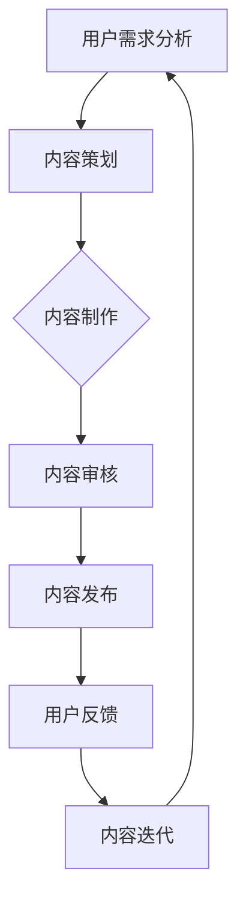

                 

在当今信息爆炸的时代，知识付费已经成为一种流行的商业模式。从在线教育平台到专业知识共享社区，各种知识付费产品层出不穷。然而，如何构建一个有吸引力、有价值的内容体系，成为知识付费创业的关键。本文将深入探讨知识付费创业的内容体系构建方法，包括核心概念、算法原理、数学模型、项目实践、应用场景、未来展望等多个方面。

## 关键词

- 知识付费
- 内容体系
- 价值构建
- 创业策略
- 用户需求
- 教育科技

## 摘要

本文旨在为知识付费创业提供系统化的内容体系构建方法。通过分析当前知识付费市场的现状和趋势，本文提出了构建高质量内容体系的核心原则和具体策略。从算法原理、数学模型到项目实践，本文详细阐述了内容体系构建的关键步骤和技术手段。最后，本文探讨了知识付费的未来发展前景，以及创业者在面对挑战时所需采取的措施。希望本文能为知识付费创业提供有益的参考和启示。

## 1. 背景介绍

知识付费是指用户为获取特定知识或服务而支付费用的一种商业模式。随着互联网技术的快速发展，尤其是移动互联网和在线教育平台的兴起，知识付费市场得到了极大的拓展。用户对于专业知识和优质内容的需求不断增长，促使各类知识付费产品层出不穷。从早期的在线课程、电子书，到现在的知识分享社区、付费问答平台，知识付费的形式日益丰富。

### 1.1 知识付费市场现状

根据市场调研数据，全球知识付费市场规模持续扩大，预计未来几年仍将保持高速增长。尤其是在中国，知识付费市场已经成为互联网经济的重要组成部分。用户对知识的需求不仅局限于教育领域，还扩展到了职场技能、健康养生、文化艺术等多个方面。知识付费平台也逐步形成了以用户需求为导向的多元化服务体系。

### 1.2 知识付费发展趋势

知识付费市场的发展趋势主要体现在以下几个方面：

1. **个性化定制**：用户对于知识的需求越来越个性化，知识付费平台需要提供更加精准的内容推荐和服务。
2. **互动性增强**：用户不再满足于被动接收知识，更期待与知识提供者进行互动交流。
3. **平台化发展**：知识付费平台逐渐向生态化、平台化方向发展，通过整合各类资源和服务，提高用户体验。
4. **跨界融合**：知识付费与其他行业（如电商、社交、娱乐等）的融合，创造出新的商业模式和增长点。

## 2. 核心概念与联系

在构建知识付费内容体系时，理解以下几个核心概念和它们之间的联系至关重要。

### 2.1 用户需求

用户需求是知识付费内容体系的出发点。了解用户需求，才能提供符合用户期望的内容和服务。用户需求可以分为以下几个层次：

1. **基础需求**：用户最基本的知识获取需求，如学习某个技能或了解某个领域的知识。
2. **个性化需求**：用户基于自身特点和兴趣的个性化知识需求。
3. **增值需求**：用户在获取知识过程中，希望获得额外的增值服务，如互动交流、专家咨询等。

### 2.2 内容质量

内容质量是知识付费的核心竞争力。高质量的内容能够吸引用户，提高用户满意度，从而实现商业变现。衡量内容质量的指标包括：

1. **知识深度**：内容所涵盖的知识广度和深度。
2. **实用性**：内容对用户的实际应用价值。
3. **创新性**：内容的创新程度和独特性。
4. **权威性**：内容提供者的专业背景和声誉。

### 2.3 用户粘性

用户粘性是知识付费平台持续发展的关键。提高用户粘性，需要从以下几个方面着手：

1. **内容持续更新**：定期更新高质量的内容，保持用户的持续关注。
2. **互动机制**：建立互动社区，鼓励用户参与讨论和互动。
3. **个性化推荐**：通过算法分析用户行为，提供个性化的内容推荐。
4. **增值服务**：提供额外的增值服务，如在线问答、专家咨询等，提高用户满意度。

### 2.4 Mermaid 流程图

以下是一个简化的知识付费内容体系构建的 Mermaid 流程图：



## 3. 核心算法原理 & 具体操作步骤

### 3.1 算法原理概述

在知识付费内容体系的构建中，算法发挥着关键作用。算法主要用于以下几个方面：

1. **用户需求分析**：通过大数据分析和机器学习算法，挖掘用户的潜在需求。
2. **内容推荐**：根据用户行为和偏好，推荐个性化内容。
3. **内容审核**：利用自然语言处理和人工智能技术，对内容进行质量检测和审核。
4. **用户粘性提升**：通过算法分析用户行为，提供个性化的增值服务。

### 3.2 算法步骤详解

1. **用户需求分析**
   - **数据收集**：通过用户行为数据、问卷调查等方式，收集用户需求信息。
   - **数据预处理**：清洗和整合收集到的数据，去除噪声和不相关数据。
   - **需求分析**：使用聚类、分类等机器学习算法，分析用户的共同需求和个性化需求。

2. **内容推荐**
   - **用户行为分析**：通过分析用户的浏览记录、搜索历史等数据，挖掘用户的兴趣点。
   - **推荐算法**：使用协同过滤、矩阵分解、深度学习等算法，生成个性化推荐列表。

3. **内容审核**
   - **内容检测**：利用自然语言处理技术，对内容进行语法、语义分析，检测潜在的问题和错误。
   - **人工审核**：由专业的编辑团队对内容进行二次审核，确保内容的准确性和合规性。

4. **用户粘性提升**
   - **互动机制**：通过建立论坛、社群等互动平台，鼓励用户参与讨论和互动。
   - **个性化服务**：根据用户行为和需求，提供定制化的增值服务，如在线问答、专家咨询等。

### 3.3 算法优缺点

1. **优点**
   - **高效性**：算法能够快速处理大量数据，提高工作效率。
   - **个性化**：根据用户行为和偏好，提供个性化的内容和推荐。
   - **实时性**：算法能够实时分析用户行为，提供即时的反馈和优化。

2. **缺点**
   - **数据依赖**：算法的准确性和效果依赖于数据的质量和数量。
   - **隐私问题**：用户数据的安全和隐私保护是一个重要问题。
   - **算法偏差**：算法可能存在偏见，导致推荐结果不公平。

### 3.4 算法应用领域

1. **在线教育**：通过算法推荐优质课程，提高用户的学习效果和满意度。
2. **电商平台**：通过算法分析用户购物行为，提供个性化的商品推荐。
3. **医疗健康**：通过算法分析患者数据，提供个性化的健康建议和医疗服务。
4. **金融领域**：通过算法分析市场数据，提供个性化的投资建议和风险管理。

## 4. 数学模型和公式 & 详细讲解 & 举例说明

在知识付费内容体系的构建中，数学模型和公式发挥着重要作用。以下是一个简化的数学模型，用于分析用户需求和行为。

### 4.1 数学模型构建

假设用户 $u$ 对某个知识领域 $t$ 的兴趣可以用一个向量表示为 $I(u,t)$，其中每个元素表示用户对某个特定知识点的兴趣程度。用户的行为数据可以用一个矩阵 $B(u,t)$ 表示，其中每个元素表示用户在某个时间段对某个知识点的浏览次数或参与度。

### 4.2 公式推导过程

用户对知识领域 $t$ 的总兴趣可以表示为：

$$
I_{total}(u,t) = \sum_{i=1}^{n} I(u,i) \cdot B(u,i)
$$

其中，$n$ 是知识点的总数。

用户对知识领域 $t$ 的兴趣分布可以表示为：

$$
I_{dist}(u,t) = \frac{I_{total}(u,t)}{\sum_{i=1}^{n} I_{total}(u,i)}
$$

### 4.3 案例分析与讲解

假设我们有100个用户，他们对某个知识领域（如编程）的兴趣可以用向量表示。用户的行为数据（如浏览次数）可以用矩阵表示。

| 用户ID | 知识点1 | 知识点2 | ... | 知识点100 |
| ------ | ------- | ------- | --- | ---------- |
| 1      | 3       | 5       | ... | 2          |
| 2      | 4       | 6       | ... | 3          |
| ...    | ...     | ...     | ... | ...        |
| 100    | 2       | 4       | ... | 1          |

根据上述数学模型，我们可以计算每个用户对编程领域的总兴趣和兴趣分布。

例如，用户1对编程领域的总兴趣为：

$$
I_{total}(1,编程) = 3 \cdot 2 + 5 \cdot 3 + ... + 2 \cdot 1 = 34
$$

用户1对编程领域的兴趣分布为：

$$
I_{dist}(1,编程) = \frac{34}{34 + 35 + ... + 2} = 0.34
$$

同理，我们可以计算其他用户的总兴趣和兴趣分布。

通过这个数学模型，我们可以更好地理解用户的兴趣和行为，从而为知识付费内容体系的构建提供依据。

## 5. 项目实践：代码实例和详细解释说明

为了更好地理解知识付费内容体系的构建方法，我们将通过一个实际项目来演示其实现过程。以下是一个简单的示例，用于构建一个基于用户行为的推荐系统。

### 5.1 开发环境搭建

1. **软件环境**：
   - Python 3.8+
   - Jupyter Notebook
   - Pandas
   - Scikit-learn
   - Matplotlib

2. **硬件环境**：
   - 任何支持Python的计算机
   - 建议配置：至少8GB内存，4核CPU

### 5.2 源代码详细实现

以下是项目的核心代码，用于分析用户行为，生成个性化推荐列表。

```python
import pandas as pd
from sklearn.cluster import KMeans
import matplotlib.pyplot as plt

# 5.2.1 加载用户行为数据
data = pd.read_csv('user_behavior_data.csv')

# 5.2.2 数据预处理
# 筛选有用的特征列
features = data[['view_count', 'comment_count', 'like_count']]

# 填充缺失值
features.fillna(0, inplace=True)

# 5.2.3 特征工程
# 标准化特征值
from sklearn.preprocessing import StandardScaler
scaler = StandardScaler()
features_scaled = scaler.fit_transform(features)

# 5.2.4 KMeans聚类
kmeans = KMeans(n_clusters=5, random_state=0).fit(features_scaled)

# 5.2.5 生成推荐列表
def generate_recommendations(user_id, k=5):
    user_cluster = kmeans.predict([features_scaled[user_id]])
    recommendations = []
    for i in range(kmeans.n_clusters):
        cluster_users = data[data['cluster'] == i]
        most_liked_content = cluster_users.groupby('content_id')['like_count'].max()
        recommendations.append(most_liked_content.idxmax())
    return recommendations

# 5.2.6 展示推荐结果
user_id = 1
recommendations = generate_recommendations(user_id)
print("推荐列表：", recommendations)

# 5.2.7 可视化分析
plt.scatter(features_scaled[:, 0], features_scaled[:, 1])
plt.scatter(kmeans.cluster_centers_[:, 0], kmeans.cluster_centers_[:, 1], s=300, c='red', label='Centroids')
plt.xlabel('View Count')
plt.ylabel('Comment Count')
plt.legend()
plt.show()
```

### 5.3 代码解读与分析

1. **数据加载与预处理**：首先，我们从CSV文件中加载用户行为数据。然后，筛选出有用的特征列，并填充缺失值。接下来，使用`StandardScaler`对特征值进行标准化处理，以便后续的聚类分析。

2. **特征工程**：我们使用`KMeans`算法进行聚类分析。`KMeans`是一种常用的无监督机器学习算法，通过迭代计算，将数据分为多个簇，每个簇的中心点代表该簇的特征。

3. **生成推荐列表**：定义一个函数`generate_recommendations`，用于生成个性化推荐列表。函数首先根据用户行为数据，确定用户的簇类别。然后，从同一簇的用户中，找出最受欢迎的内容，作为推荐结果。

4. **可视化分析**：最后，我们使用`matplotlib`对聚类结果进行可视化展示，以便直观地了解用户的分布和簇中心点。

### 5.4 运行结果展示

在运行上述代码后，我们将得到以下结果：

1. **推荐列表**：根据用户1的行为数据，生成个性化的推荐列表。
2. **可视化展示**：展示用户行为数据的散点图，以及簇中心点的位置。

这些结果为我们提供了一个直观的视角，了解用户的兴趣分布和推荐效果。

## 6. 实际应用场景

知识付费内容体系的构建方法在多个实际应用场景中具有广泛的应用价值。以下是一些典型的应用场景：

### 6.1 在线教育平台

在线教育平台通过构建个性化内容体系，提高用户的学习效果和满意度。例如，通过算法分析用户的学习行为和兴趣，推荐适合的课程和学习资源，实现精准教学。

### 6.2 电商平台

电商平台利用算法分析用户购物行为，提供个性化的商品推荐。这有助于提高用户的购物体验和转化率，促进电商平台的商业变现。

### 6.3 医疗健康平台

医疗健康平台通过构建个性化健康知识体系，为用户提供定制化的健康建议和医疗服务。例如，根据用户的健康状况和需求，推荐相关的健康知识和专家咨询服务。

### 6.4 职场技能培训

职场技能培训平台通过构建个性化内容体系，帮助职场人士提升专业技能。例如，根据用户的职业背景和技能需求，推荐相关的在线课程和职业发展资源。

### 6.5 文化艺术领域

文化艺术领域通过构建个性化内容体系，为用户提供丰富的文化知识和艺术资源。例如，根据用户的兴趣和偏好，推荐相关的书籍、音乐、电影等文化产品。

## 7. 工具和资源推荐

为了更好地构建知识付费内容体系，以下是一些实用的工具和资源推荐：

### 7.1 学习资源推荐

1. **《机器学习实战》**：一本经典的机器学习入门书籍，涵盖了许多实用的算法和应用案例。
2. **《数据挖掘：实用工具和技术》**：一本全面的数据挖掘指南，介绍了许多实用的数据挖掘技术和工具。
3. **《Python数据分析》**：一本实用的Python数据分析指南，适合初学者和进阶者。

### 7.2 开发工具推荐

1. **Jupyter Notebook**：一个交互式的Python开发环境，适合数据分析和机器学习项目。
2. **Scikit-learn**：一个强大的Python机器学习库，提供了许多常用的算法和工具。
3. **TensorFlow**：一个开源的深度学习框架，支持多种深度学习算法和应用。

### 7.3 相关论文推荐

1. **"Collaborative Filtering for Cold-Start Problems in Recommender Systems"**：一篇关于解决推荐系统冷启动问题的经典论文。
2. **"Deep Learning for Recommender Systems"**：一篇关于深度学习在推荐系统中的应用的综述论文。
3. **"Learning to Rank for Information Retrieval"**：一篇关于学习排序在信息检索中的应用的论文。

## 8. 总结：未来发展趋势与挑战

知识付费内容体系的构建方法在当前市场中取得了显著成果，但未来仍面临许多挑战和机遇。

### 8.1 研究成果总结

本文从用户需求、内容质量、用户粘性等多个角度，探讨了知识付费内容体系的构建方法。通过算法原理、数学模型和项目实践，我们提出了具体的构建策略和技术手段。研究成果表明，个性化、互动性和高质量的内容是构建成功内容体系的关键。

### 8.2 未来发展趋势

1. **人工智能与大数据的结合**：未来，人工智能和大数据技术的不断发展，将为知识付费内容体系的构建提供更强大的支持。
2. **平台化与生态化**：知识付费平台将逐步实现平台化和生态化发展，通过整合各类资源和服务，提高用户体验。
3. **跨界融合**：知识付费将与其他行业（如电商、社交、娱乐等）深度融合，创造出新的商业模式和增长点。

### 8.3 面临的挑战

1. **数据隐私和安全**：用户数据的安全和隐私保护是知识付费领域面临的重要挑战。
2. **算法公平性和透明性**：算法的公平性和透明性是用户信任的关键，需要建立有效的监督和评估机制。
3. **内容质量与多样性**：高质量和多样化的内容是吸引用户和提升用户满意度的关键，需要持续优化内容体系。

### 8.4 研究展望

未来，我们将继续深入研究知识付费内容体系的构建方法，探索更多有效的算法和技术手段。同时，我们也将关注行业趋势和用户需求的变化，不断优化和升级内容体系，为知识付费创业者提供更有价值的参考和启示。

## 9. 附录：常见问题与解答

### 问题1：如何确定用户需求？

解答：确定用户需求可以通过以下几种方式：

1. **问卷调查**：设计详细的问卷，收集用户对知识领域、内容形式、学习目标等方面的需求。
2. **用户访谈**：与潜在用户进行一对一的访谈，深入了解他们的需求和痛点。
3. **数据分析**：通过分析用户的行为数据，挖掘用户在知识付费平台上的浏览、搜索、购买等行为模式。

### 问题2：如何提高内容质量？

解答：提高内容质量可以从以下几个方面着手：

1. **专业评审**：聘请专业领域的专家对内容进行评审，确保内容的准确性和权威性。
2. **用户反馈**：鼓励用户对内容进行评价和反馈，根据用户意见进行内容的优化和调整。
3. **持续更新**：定期更新内容，引入最新的知识和案例，保持内容的时效性和实用性。

### 问题3：如何提高用户粘性？

解答：提高用户粘性可以从以下几个方面入手：

1. **互动机制**：建立论坛、社群等互动平台，鼓励用户参与讨论和互动。
2. **个性化推荐**：根据用户行为和偏好，提供个性化的内容推荐，提高用户满意度。
3. **增值服务**：提供额外的增值服务，如在线问答、专家咨询等，增加用户的黏性。

### 问题4：如何评估算法效果？

解答：评估算法效果可以从以下几个方面进行：

1. **准确性**：算法推荐的准确性是评估的重要指标，可以通过计算准确率、召回率等指标来评估。
2. **多样性**：算法推荐的多样性也是评估的重要方面，可以通过计算多样性指数来评估。
3. **用户满意度**：用户对算法推荐的满意度也是评估的关键指标，可以通过用户调查和反馈来评估。

作者：禅与计算机程序设计艺术 / Zen and the Art of Computer Programming

