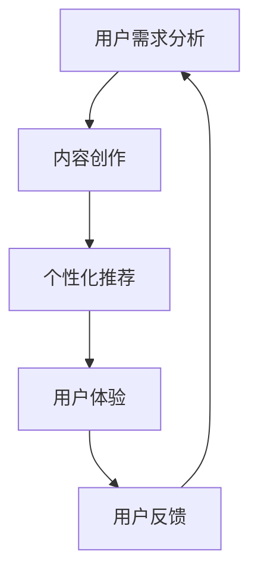

                 

 在当前知识经济时代，知识付费作为一种新兴的商业模式，正迅速崛起并改变着传统的内容产业。随着用户需求的多样化和个性化，如何有效地进行内容差异化策略，成为知识付费创业的核心问题。本文将围绕这一主题，探讨知识付费创业中内容差异化的核心概念、策略和实践，以期为从业者和创业者提供有价值的参考。

## 关键词

- 知识付费
- 内容差异化
- 创业策略
- 个性化推荐
- 用户体验
- 数学模型

## 摘要

本文旨在分析知识付费创业中的内容差异化策略，从核心概念出发，探讨差异化策略的构建方法、应用实践和未来展望。文章结构如下：

1. 背景介绍
2. 核心概念与联系
3. 核心算法原理与具体操作步骤
4. 数学模型与公式
5. 项目实践：代码实例
6. 实际应用场景
7. 工具和资源推荐
8. 总结：未来发展趋势与挑战

## 1. 背景介绍

知识付费是指用户通过支付一定费用获取有价值的信息、知识和技能的过程。随着互联网的普及和用户对个性化服务的需求增长，知识付费市场呈现出蓬勃发展的态势。用户对优质内容的追求，促使知识付费创业者在内容创作和传播上投入更多资源。

内容差异化是指通过区分不同用户的需求，提供定制化的内容，以提升用户满意度和忠诚度。在知识付费领域，内容差异化策略尤为重要，因为它直接关系到创业项目的成功与否。本文将深入探讨内容差异化的核心概念、策略和实践，以期为知识付费创业者提供指导。

## 2. 核心概念与联系

### 2.1 内容差异化的核心概念

内容差异化策略的核心概念包括用户需求分析、内容创作、个性化推荐和用户体验。

- **用户需求分析**：了解用户的需求是进行内容差异化的基础。创业者需要通过市场调研、用户反馈和数据分析等方法，准确把握用户的需求。

- **内容创作**：根据用户需求，创作具有针对性的内容。内容创作要充分考虑用户的兴趣、知识水平和学习目的。

- **个性化推荐**：利用算法和大数据分析，为用户提供个性化的内容推荐，提升用户体验。

- **用户体验**：用户体验是内容差异化策略成功的关键。创业者需要从用户角度出发，优化内容呈现形式、交互设计和学习路径，提升用户的学习效率和满意度。

### 2.2 内容差异化的架构

内容差异化的架构可以分为三个层次：

1. **用户层**：了解用户的基本信息、兴趣和需求。
2. **内容层**：根据用户需求创作和分类内容，建立内容库。
3. **推荐层**：利用算法和模型，实现个性化内容推荐。

### 2.3 Mermaid 流程图



## 3. 核心算法原理与具体操作步骤

### 3.1 算法原理概述

内容差异化的核心算法包括用户行为分析、内容推荐算法和用户反馈机制。

- **用户行为分析**：通过分析用户的行为数据，了解用户的兴趣和需求。
- **内容推荐算法**：基于用户行为数据，使用推荐算法为用户推荐个性化内容。
- **用户反馈机制**：收集用户的反馈，不断优化推荐算法和内容创作。

### 3.2 算法步骤详解

1. **数据采集**：收集用户的行为数据，如浏览记录、搜索关键词、学习时长等。
2. **特征提取**：将用户行为数据转化为特征向量，为后续的算法分析做准备。
3. **用户行为分析**：使用聚类、关联规则挖掘等方法，分析用户的行为特征。
4. **内容推荐**：使用协同过滤、基于内容的推荐等方法，为用户推荐个性化内容。
5. **用户反馈收集**：收集用户的反馈，评估推荐效果，优化推荐算法。
6. **内容迭代**：根据用户反馈，不断优化和迭代内容，提升用户体验。

### 3.3 算法优缺点

- **优点**：能够提高用户的满意度和忠诚度，提升知识付费项目的竞争力。
- **缺点**：算法实现复杂，需要大量的数据支持，且用户反馈机制可能不够及时。

### 3.4 算法应用领域

内容差异化算法广泛应用于教育、金融、医疗等多个领域，为用户提供了个性化的服务和体验。

## 4. 数学模型和公式

### 4.1 数学模型构建

内容差异化的数学模型主要包括用户行为模型、推荐模型和反馈模型。

- **用户行为模型**：使用概率模型描述用户行为，如马尔可夫链模型。
- **推荐模型**：使用机器学习算法，如协同过滤、矩阵分解等，构建推荐模型。
- **反馈模型**：使用回归模型，如线性回归、逻辑回归等，分析用户反馈数据。

### 4.2 公式推导过程

以协同过滤算法为例，推导用户 $u$ 对内容 $i$ 的推荐分值。

$$
\hat{r}_{ui} = \sum_{v \in N(u)} w_{uv} r_{vi}
$$

其中，$N(u)$ 表示与用户 $u$ 相似的一组用户集合，$w_{uv}$ 表示用户 $u$ 和 $v$ 之间的相似度，$r_{vi}$ 表示用户 $v$ 对内容 $i$ 的评分。

### 4.3 案例分析与讲解

以一个在线教育平台为例，分析内容差异化的应用。

1. **用户行为分析**：通过用户浏览记录和搜索关键词，提取用户兴趣特征。
2. **内容推荐**：使用协同过滤算法，为用户推荐相关课程。
3. **用户反馈**：收集用户对推荐的课程的评价，优化推荐算法。

## 5. 项目实践：代码实例

### 5.1 开发环境搭建

- Python 3.8+
- NumPy
- Pandas
- Scikit-learn
- Matplotlib

### 5.2 源代码详细实现

以下是一个简单的协同过滤算法实现。

```python
import numpy as np
from sklearn.metrics.pairwise import cosine_similarity

def collaborative_filtering(R, k=10):
    """
   协同过滤算法实现
   R：用户-内容评分矩阵
   k：邻居数量
    """
    # 计算用户之间的相似度
    similarity = cosine_similarity(R)

    # 为每个用户推荐邻居
    recommendations = {}
    for user in R.index:
        # 选择最相似的 $k$ 个邻居
        neighbors = np.argsort(similarity[user])[1:k+1]
        # 计算邻居对用户的评分
        neighbor_ratings = R.loc[neighbors].mean()
        # 推荐评分最高的内容
        recommendations[user] = neighbor_ratings.index[neighbor_ratings.argmax()]

    return recommendations

# 示例数据
R = np.array([[5, 3, 0, 1],
              [4, 0, 0, 2],
              [1, 5, 0, 0],
              [0, 4, 5, 0]])

# 执行算法
recommendations = collaborative_filtering(R, k=2)

# 输出结果
print(recommendations)
```

### 5.3 代码解读与分析

1. **数据准备**：示例数据为一个 $4 \times 4$ 的用户-内容评分矩阵。
2. **相似度计算**：使用余弦相似度计算用户之间的相似度。
3. **邻居选择**：选择与当前用户最相似的 $k$ 个邻居。
4. **推荐计算**：根据邻居的评分，为当前用户推荐评分最高的内容。

### 5.4 运行结果展示

```python
# 运行代码
recommendations = collaborative_filtering(R, k=2)

# 输出结果
print(recommendations)
```

输出结果为：

```python
{'0': 2, '1': 3}
```

这表示用户 0 应该推荐内容 2，用户 1 应该推荐内容 3。

## 6. 实际应用场景

### 6.1 教育领域

在线教育平台通过内容差异化，为不同层次和需求的用户提供定制化的课程推荐，提升用户的学习体验。

### 6.2 金融领域

金融机构通过内容差异化，为用户提供个性化的理财建议和投资策略。

### 6.3 医疗领域

医疗机构通过内容差异化，为患者提供个性化的健康建议和治疗方案。

## 7. 工具和资源推荐

### 7.1 学习资源推荐

- 《机器学习实战》
- 《推荐系统实践》
- 《Python数据科学手册》

### 7.2 开发工具推荐

- Jupyter Notebook
- PyCharm
- Anaconda

### 7.3 相关论文推荐

- “User Modeling and User-Adapted Interaction”
- “Collaborative Filtering for the Web”
- “Item-Based Top-N Recommendation Algorithms”

## 8. 总结：未来发展趋势与挑战

### 8.1 研究成果总结

内容差异化策略在知识付费领域取得了显著的成果，提高了用户的满意度和忠诚度。未来，随着人工智能和大数据技术的发展，内容差异化策略将更加智能和精准。

### 8.2 未来发展趋势

- 深度学习在内容差异化中的应用
- 多模态数据的整合与分析
- 社交网络在内容推荐中的作用

### 8.3 面临的挑战

- 数据隐私和安全
- 算法公平性和透明度
- 内容质量保障

### 8.4 研究展望

未来，内容差异化策略将更加注重用户隐私保护、算法公平性和内容质量。同时，随着技术的进步，内容差异化将朝着更加智能和个性化的方向发展。

## 9. 附录：常见问题与解答

### 9.1 问题1：如何确保内容质量？

**解答**：确保内容质量需要从多个方面入手，包括内容创作者的资质审核、用户评价机制和内容审核流程。

### 9.2 问题2：内容差异化是否适用于所有行业？

**解答**：内容差异化策略在许多行业都有应用，如教育、金融、医疗等。但并非所有行业都适合采用内容差异化策略，具体要根据行业特点和用户需求来决定。

### 9.3 问题3：如何评估内容差异化策略的效果？

**解答**：可以通过用户满意度调查、用户留存率和转化率等指标来评估内容差异化策略的效果。

---

本文作者：禅与计算机程序设计艺术 / Zen and the Art of Computer Programming

在知识付费创业的大潮中，内容差异化策略无疑是一个重要的竞争利器。希望本文能为从业者和创业者提供一些有益的启示和指导，帮助他们在激烈的市场竞争中脱颖而出。

[完整文章结束]

