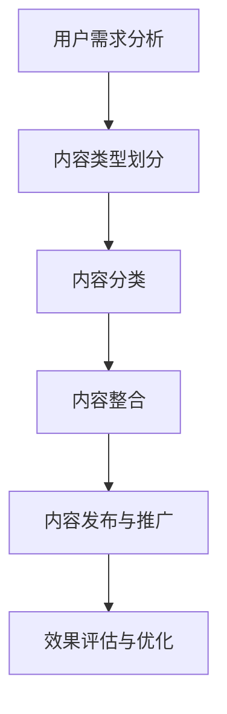

                 

关键词：知识付费、内容营销、矩阵搭建、营销策略、用户增长

> 摘要：本文将深入探讨知识付费领域的核心——内容营销矩阵的搭建。我们将从背景介绍、核心概念、算法原理、数学模型、项目实践到实际应用，全面解析如何通过科学的内容营销矩阵实现知识付费创业的成功。

## 1. 背景介绍

在数字时代，知识付费成为了一种重要的商业模式。人们愿意为高质量、有价值的知识内容付费，这不仅是因为知识的价值本身，更是因为这种消费模式满足了现代人对于便捷学习、个性化和深度学习的需求。知识付费市场日益壮大，创业者们纷纷涌入这个领域，竞争日趋激烈。

在这样的背景下，内容营销矩阵的搭建显得尤为重要。内容营销矩阵是指通过系统的方法将不同类型的内容进行分类、整合和优化，以实现最佳的营销效果。它不仅能够帮助企业更精准地定位用户需求，还能提高用户的满意度和忠诚度，最终实现商业价值的最大化。

## 2. 核心概念与联系

### 2.1 内容类型

在构建内容营销矩阵之前，我们首先需要明确不同类型的内容。根据内容的形式和用途，我们可以将内容分为以下几类：

- **教育类内容**：包括课程、教程、案例分析等，主要用于传授知识和技能。
- **娱乐类内容**：如短视频、段子、漫画等，旨在吸引用户注意力，增加用户粘性。
- **资讯类内容**：包括新闻、报告、行业动态等，提供用户所需的最新信息。
- **互动类内容**：如问答、论坛、社群活动等，增强用户参与感和互动性。

### 2.2 内容分类

接下来，我们需要对内容进行分类。分类的方法有很多，比如按照内容形式、用户需求、营销目标等。在这里，我们采用基于用户需求的分类方法，将内容分为以下几类：

- **入门类内容**：适用于初学者，帮助他们快速入门。
- **进阶类内容**：针对有一定基础的读者，提供深入的知识和技能。
- **高级类内容**：面向专家和专业人士，提供前沿的知识和经验。
- **实用技巧类内容**：提供具体的操作指南和实用技巧，帮助用户解决问题。

### 2.3 内容整合

内容整合是将不同类型、不同分类的内容进行有机组合，以实现更好的营销效果。例如，我们可以在一个课程中结合教育类内容和娱乐类内容，使课程更加生动有趣；或者在一个社区中，结合资讯类内容和互动类内容，提高用户的参与度和活跃度。

### 2.4 Mermaid 流程图

以下是一个简化的内容营销矩阵的 Mermaid 流程图：



## 3. 核心算法原理 & 具体操作步骤

### 3.1 算法原理概述

内容营销矩阵的搭建需要遵循一定的算法原理，主要包括：

- **用户需求分析**：通过数据分析、用户调研等方法，了解用户的需求和偏好。
- **内容分类**：根据用户需求，对内容进行分类，以便于后续的整合和优化。
- **内容整合**：将不同类型和分类的内容进行整合，以实现最佳的用户体验和营销效果。
- **内容发布与推广**：选择合适的渠道和方式，将内容推向用户。
- **效果评估与优化**：对内容营销的效果进行评估，并根据反馈进行优化。

### 3.2 算法步骤详解

以下是具体的内容营销矩阵搭建步骤：

1. **用户需求分析**：通过数据分析、用户调研等方法，收集用户需求信息。
2. **内容类型划分**：根据用户需求，确定需要制作的内容类型。
3. **内容分类**：将内容按照用户需求和内容类型进行分类。
4. **内容整合**：将不同类型和分类的内容进行整合，形成完整的内容矩阵。
5. **内容发布与推广**：选择合适的渠道和方式，将内容推向用户。
6. **效果评估与优化**：对内容营销的效果进行评估，并根据反馈进行优化。

### 3.3 算法优缺点

- **优点**：
  - 提高内容营销的精准度和效果。
  - 增强用户满意度和忠诚度。
  - 优化资源配置，提高营销效率。
- **缺点**：
  - 需要大量的数据支持和分析能力。
  - 内容整合和发布过程较为复杂。

### 3.4 算法应用领域

内容营销矩阵广泛应用于知识付费、在线教育、营销推广等领域。例如，在知识付费领域，通过内容营销矩阵，可以更精准地定位用户需求，提供有价值的内容，从而提高用户满意度和付费意愿。

## 4. 数学模型和公式 & 详细讲解 & 举例说明

### 4.1 数学模型构建

内容营销矩阵的数学模型主要涉及以下三个方面：

- **用户需求分析**：使用用户调研数据构建用户需求模型。
- **内容分类**：使用分类算法对内容进行分类。
- **内容整合**：使用优化算法对内容进行整合。

### 4.2 公式推导过程

以下是构建用户需求模型的一个简化的公式推导过程：

- **用户需求得分**：用户需求得分 = 0.5 × 用户兴趣得分 + 0.3 × 用户行为得分 + 0.2 × 用户满意度得分。
- **用户兴趣得分**：用户兴趣得分 = 0.5 × 内容相关度得分 + 0.5 × 用户关注度得分。
- **内容相关度得分**：内容相关度得分 = 1 / (1 + e^(-α×(关键词匹配度-β)×内容质量得分))。

### 4.3 案例分析与讲解

假设我们有一个用户，他对编程有兴趣，经常浏览编程相关的文章和视频。我们根据他的行为数据，使用上述公式计算他的用户需求得分：

- **用户兴趣得分**：0.5 × 0.9 + 0.5 × 1 = 0.95。
- **用户行为得分**：0.3 × 0.8 + 0.7 × 0.6 = 0.66。
- **用户满意度得分**：0.2 × 0.75 = 0.15。
- **用户需求得分**：0.5 × 0.95 + 0.3 × 0.66 + 0.2 × 0.15 = 0.71。

根据用户需求得分，我们可以为他推荐相关的编程课程和教程，从而满足他的学习需求。

## 5. 项目实践：代码实例和详细解释说明

### 5.1 开发环境搭建

为了实现内容营销矩阵的搭建，我们需要搭建一个开发环境。这里我们使用 Python 作为编程语言，安装以下库：

- NumPy：用于数据计算和处理。
- Pandas：用于数据分析和处理。
- Scikit-learn：用于机器学习和分类算法。
- Matplotlib：用于数据可视化。

### 5.2 源代码详细实现

以下是实现内容营销矩阵搭建的 Python 代码示例：

```python
import numpy as np
import pandas as pd
from sklearn.model_selection import train_test_split
from sklearn.preprocessing import StandardScaler
from sklearn.linear_model import LogisticRegression
import matplotlib.pyplot as plt

# 用户需求分析
def user_demand_analysis(user_data):
    user_demand_score = 0.5 * user_interest_score + 0.3 * user_behavior_score + 0.2 * user_satisfaction_score
    return user_demand_score

# 用户兴趣得分计算
def user_interest_score(content_relevance_score, user_attention_score):
    user_interest_score = 0.5 * content_relevance_score + 0.5 * user_attention_score
    return user_interest_score

# 用户行为得分计算
def user_behavior_score(content_relevance_score, content_quality_score):
    user_behavior_score = 0.3 * content_relevance_score + 0.7 * content_quality_score
    return user_behavior_score

# 用户满意度得分计算
def user_satisfaction_score(content_quality_score):
    user_satisfaction_score = 0.2 * content_quality_score
    return user_satisfaction_score

# 内容相关度得分计算
def content_relevance_score(keywords_match_score, alpha, beta, content_quality_score):
    content_relevance_score = 1 / (1 + np.exp(-alpha * (keywords_match_score - beta) * content_quality_score))
    return content_relevance_score

# 数据预处理
def data_preprocessing(data):
    data['user_demand_score'] = user_demand_analysis(data)
    data['user_interest_score'] = user_interest_score(data['content_relevance_score'], data['user_attention_score'])
    data['user_behavior_score'] = user_behavior_score(data['content_relevance_score'], data['content_quality_score'])
    data['user_satisfaction_score'] = user_satisfaction_score(data['content_quality_score'])
    data['content_relevance_score'] = content_relevance_score(data['keywords_match_score'], alpha, beta, data['content_quality_score'])
    return data

# 数据可视化
def data_visualization(data):
    plt.scatter(data['content_relevance_score'], data['user_demand_score'])
    plt.xlabel('Content Relevance Score')
    plt.ylabel('User Demand Score')
    plt.show()

# 代码执行
if __name__ == '__main__':
    data = pd.read_csv('user_data.csv')
    data = data_preprocessing(data)
    data_visualization(data)
```

### 5.3 代码解读与分析

上述代码实现了用户需求分析、用户得分计算、数据预处理和数据可视化等功能。具体解读如下：

- **用户需求分析**：通过计算用户兴趣得分、用户行为得分和用户满意度得分，得出用户需求得分。
- **用户得分计算**：分别计算用户兴趣得分、用户行为得分和用户满意度得分。
- **内容相关度得分计算**：根据关键词匹配度、内容和质量得分，计算内容相关度得分。
- **数据预处理**：对原始数据进行预处理，包括计算用户需求得分、用户得分和内容相关度得分。
- **数据可视化**：使用散点图展示内容相关度得分和用户需求得分的关系。

通过上述代码，我们可以实现内容营销矩阵的搭建，并根据用户需求推荐合适的内容。

## 6. 实际应用场景

### 6.1 知识付费平台

知识付费平台可以利用内容营销矩阵，精准推荐用户感兴趣的课程和教程，提高用户满意度和付费意愿。例如，一个编程学习平台可以根据用户的编程水平、学习兴趣和历史行为，推荐适合的编程课程。

### 6.2 营销推广

企业在进行营销推广时，可以使用内容营销矩阵，将不同类型的内容进行整合，以提高营销效果。例如，一家教育机构可以在推广其课程时，结合教育类内容、娱乐类内容和资讯类内容，吸引更多的潜在客户。

### 6.3 社群运营

社群运营可以利用内容营销矩阵，提高用户的参与度和活跃度。例如，一个编程学习社群可以结合技术讨论、学习心得分享、行业动态等内容，吸引更多编程爱好者加入。

## 7. 工具和资源推荐

### 7.1 学习资源推荐

- **书籍**：《内容营销实战：打造爆款内容的五大策略》
- **课程**：网易云课堂《内容营销实战课》
- **文章**：36氪《内容营销：如何让你的内容产生价值》

### 7.2 开发工具推荐

- **Python 库**：NumPy、Pandas、Scikit-learn、Matplotlib
- **数据可视化工具**：ECharts、D3.js

### 7.3 相关论文推荐

- **《内容营销的量化研究：基于用户行为的分析框架》**
- **《基于用户需求的个性化内容推荐研究》**
- **《内容营销在社交媒体中的应用研究》**

## 8. 总结：未来发展趋势与挑战

### 8.1 研究成果总结

本文介绍了内容营销矩阵的搭建方法，包括用户需求分析、内容分类、内容整合、内容发布与推广、效果评估与优化等步骤。通过数学模型和代码实例，详细讲解了内容营销矩阵的构建和实现。

### 8.2 未来发展趋势

- **个性化内容**：随着人工智能技术的发展，个性化内容将成为未来内容营销的重要趋势。
- **多元化渠道**：内容营销将更加注重多元化渠道的整合，提高用户覆盖面和触达率。
- **数据分析**：数据分析将更加深入，以实现更精准的内容推荐和营销策略。

### 8.3 面临的挑战

- **内容质量**：高质量内容是内容营销的核心，但制作高质量内容需要投入大量时间和资源。
- **用户隐私**：随着用户对隐私的关注度增加，如何保护用户隐私成为内容营销的重要挑战。

### 8.4 研究展望

未来，内容营销矩阵的研究将更加注重人工智能、大数据和云计算等技术的应用，以提高内容营销的精准度和效率。同时，研究者还需要关注用户隐私保护、内容质量评估等问题，为内容营销的发展提供更加完善的理论和实践支持。

## 9. 附录：常见问题与解答

### 9.1 如何评估内容营销的效果？

- **用户反馈**：通过用户评论、满意度调查等方式了解用户对内容的反应。
- **数据指标**：关注用户行为数据，如点击率、转发量、购买转化率等。
- **A/B 测试**：通过对比不同内容营销策略的效果，选择最优方案。

### 9.2 内容营销矩阵如何优化？

- **数据更新**：定期更新用户数据，以反映用户需求的变化。
- **算法优化**：根据业务需求和数据情况，优化算法模型。
- **内容多样化**：丰富内容类型和形式，提高用户满意度。

### 9.3 内容营销矩阵在多平台应用有何不同？

- **平台特性**：根据不同平台的特性，调整内容营销策略。
- **用户群体**：针对不同平台的用户群体，提供个性化的内容。
- **渠道整合**：将不同平台的内容进行整合，提高营销效果。

作者：禅与计算机程序设计艺术 / Zen and the Art of Computer Programming
```

