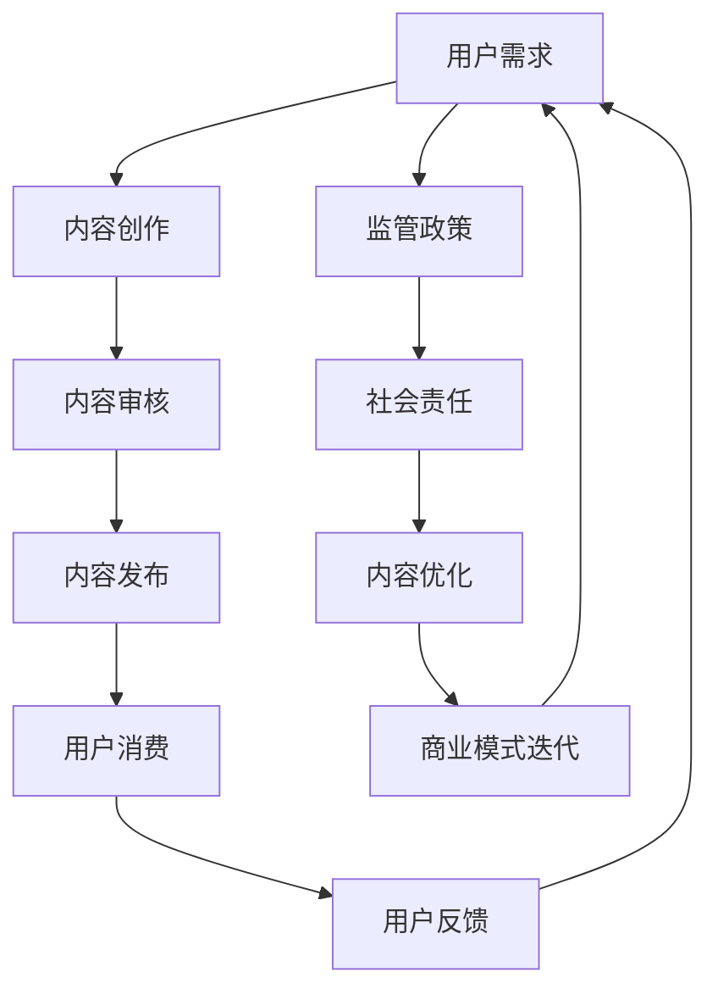

                 

### 1. 背景介绍

在当今信息爆炸的时代，知识付费已经成为一种越来越流行的商业模式。知识付费指的是用户为获取特定领域的知识或技能而向提供者支付的费用。这种模式为内容创作者和知识专家提供了新的收入来源，同时也满足了用户对高质量、专业化内容的需求。

随着互联网的普及和移动互联网的发展，知识付费行业呈现出高速增长的态势。根据市场研究报告，全球知识付费市场规模在2020年已达到2000亿美元，并有望在未来几年继续保持两位数的增长率。知识付费的形式多种多样，包括在线课程、电子书、专业咨询、直播讲座等。

然而，知识付费市场也存在一些挑战。首先，市场竞争激烈，许多内容创作者和平台都在争夺用户注意力。其次，用户对内容的多样性和质量有更高的要求，这要求创作者和平台不断提升内容质量和用户体验。此外，知识付费行业的监管也在逐步加强，要求平台和创作者遵守相关法律法规，确保内容合规。

本文将围绕知识付费创业的商业模式展开讨论，分析现有模式的优势和不足，提出优化策略，并探讨未来的发展方向。希望通过本文的讨论，能够为知识付费创业者提供一些有价值的参考和启示。

### 2. 核心概念与联系

在深入探讨知识付费创业的商业模式之前，我们需要明确一些核心概念，并理解它们之间的联系。

#### 2.1 知识付费的基本概念

知识付费是指用户为了获取特定领域的知识或技能，而向提供者支付费用的行为。这包括但不限于在线课程、专业书籍、咨询报告、直播讲座等形式。知识付费的核心在于“价值交换”，即用户愿意为获取的知识或技能支付相应的费用。

#### 2.2 内容创作者与平台的关系

在知识付费生态系统中，内容创作者和平台是两个关键角色。内容创作者负责生产高质量的知识内容，而平台则为创作者提供了一个展示和销售其内容的渠道。平台与创作者之间的关系通常基于合作共赢的原则，平台通过流量和资源支持创作者，创作者通过提供优质内容吸引用户，从而实现商业价值。

#### 2.3 用户需求与内容供给

用户需求是知识付费商业模式的核心驱动力。用户对高质量、专业化的内容有着强烈的需求，这促使内容创作者不断提升内容质量。同时，平台需要根据用户需求，优化内容推荐机制，提高用户体验。用户需求与内容供给之间的动态平衡，是知识付费商业模式能否成功的关键。

#### 2.4 监管环境与社会责任

知识付费行业的发展也受到监管环境和社会责任的影响。随着互联网的普及，知识付费市场日益壮大，相关监管政策也在逐步完善。平台和创作者需要遵守相关法律法规，确保内容合规，保护用户权益。社会责任方面，平台和创作者需要关注内容的真实性和科学性，避免传播虚假信息和误导用户。

#### 2.5 Mermaid 流程图

为了更直观地展示知识付费商业模式的核心概念和联系，我们可以使用Mermaid流程图来描述。以下是知识付费商业模式的基本流程：



在这个流程图中，用户需求驱动内容创作，内容创作经过审核后发布，用户消费内容并反馈，反馈又引导内容优化，最终推动商业模式的迭代。同时，监管政策和社会责任也在整个过程中发挥重要作用，确保知识付费生态系统的健康发展。

### 3. 核心算法原理 & 具体操作步骤

#### 3.1 算法原理概述

在知识付费创业中，核心算法原理主要涉及用户行为分析、内容推荐和商业模式优化。以下是对这些算法原理的概述：

1. **用户行为分析**：通过对用户在平台上的行为数据进行分析，了解用户的需求、偏好和购买行为。这包括用户的浏览记录、购买记录、评价反馈等。用户行为分析有助于精准定位用户需求，优化内容推荐和商业模式。

2. **内容推荐**：基于用户行为分析的结果，利用推荐算法为用户推荐个性化内容。常见的推荐算法包括协同过滤、基于内容的推荐和混合推荐等。内容推荐是提高用户黏性和转化率的关键。

3. **商业模式优化**：通过分析用户行为和内容推荐效果，不断优化商业模式。这包括调整定价策略、优化内容供给、提升用户体验等。商业模式优化是提高平台竞争力的关键。

#### 3.2 算法步骤详解

1. **用户行为分析**：

   - 数据收集：收集用户在平台上的行为数据，如浏览记录、购买记录、评价反馈等。
   - 数据预处理：对收集到的行为数据进行清洗、去重和标准化处理，确保数据质量。
   - 特征提取：从预处理后的数据中提取用户行为特征，如行为频次、购买金额、评价等级等。
   - 模型训练：利用机器学习算法（如逻辑回归、决策树、随机森林等）训练用户行为分析模型。

2. **内容推荐**：

   - 内容分类：对平台上的内容进行分类，如课程、书籍、咨询等。
   - 用户画像：基于用户行为数据和特征，构建用户画像。
   - 推荐算法：利用用户画像和内容分类信息，选择合适的推荐算法进行内容推荐。如协同过滤算法可以通过计算用户之间的相似度来推荐内容；基于内容的推荐算法可以通过计算用户和内容之间的相似度来推荐内容。
   - 推荐结果生成：根据推荐算法的结果，生成推荐列表。

3. **商业模式优化**：

   - 数据分析：收集平台运营数据，如用户留存率、转化率、内容消费时长等。
   - 模型优化：利用机器学习算法，对商业模式进行优化。例如，通过调整定价策略，实现用户留存率的提升；通过优化内容供给，提高内容消费时长。
   - 实施与监控：实施优化策略，并对优化效果进行监控和评估。根据评估结果，进一步调整和优化商业模式。

#### 3.3 算法优缺点

- **用户行为分析**：
  - 优点：能够准确了解用户需求和行为，为内容推荐和商业模式优化提供数据支持。
  - 缺点：数据收集和预处理过程较为复杂，且存在隐私泄露的风险。

- **内容推荐**：
  - 优点：提高用户黏性和转化率，增加平台收入。
  - 缺点：推荐算法可能存在偏差，导致用户推荐效果不佳。

- **商业模式优化**：
  - 优点：提高平台竞争力，实现可持续发展。
  - 缺点：需要投入大量资源和时间进行数据分析、模型优化和实施监控。

#### 3.4 算法应用领域

- **在线教育**：通过用户行为分析，为用户提供个性化课程推荐，提高学习效果和用户满意度。
- **电商**：通过内容推荐，提高商品转化率和用户购买意愿。
- **健康与医疗**：通过用户行为分析，为用户提供个性化的健康建议和医疗咨询服务。
- **金融**：通过商业模式优化，提高用户留存率和转化率，实现金融产品的精准营销。

### 4. 数学模型和公式 & 详细讲解 & 举例说明

#### 4.1 数学模型构建

在知识付费创业中，数学模型主要用于用户行为分析、内容推荐和商业模式优化。以下是几个常用的数学模型：

1. **用户行为分析模型**：
   - 用户行为概率模型：假设用户在平台上的行为是独立的，可以使用概率模型来预测用户下一步的行为。例如，可以使用马尔可夫链模型来预测用户的浏览行为。
   - 用户兴趣模型：使用协同过滤算法，构建用户兴趣模型，预测用户可能感兴趣的内容。例如，可以使用矩阵分解算法（如Singular Value Decomposition, SVD）来分解用户-内容矩阵，提取用户兴趣特征。

2. **内容推荐模型**：
   - 基于内容的推荐模型：使用相似度度量（如余弦相似度、欧氏距离等）计算用户和内容之间的相似度，为用户推荐相似的内容。例如，可以使用TF-IDF（Term Frequency-Inverse Document Frequency）算法来计算内容特征向量。
   - 协同过滤推荐模型：使用用户-内容矩阵，计算用户之间的相似度，为用户推荐其他用户喜欢的内容。例如，可以使用用户基于K最近邻（K-Nearest Neighbors, KNN）的协同过滤算法来推荐内容。

3. **商业模式优化模型**：
   - 收益最大化模型：通过优化定价策略和内容供给，实现平台收益最大化。例如，可以使用线性规划（Linear Programming, LP）算法来求解最优定价策略。
   - 用户留存率模型：通过分析用户行为数据，构建用户留存率模型，预测用户留存率。例如，可以使用逻辑回归（Logistic Regression）算法来预测用户留存率。

#### 4.2 公式推导过程

1. **用户行为概率模型**：
   - 马尔可夫链模型：
     \[
     P(X_{t+1} = j | X_t = i) = \pi_j \prod_{k=1}^{i-1} p_{kj}
     \]
     其中，\(X_t\) 表示用户在时间 \(t\) 的行为，\(i\) 和 \(j\) 分别表示当前和下一步的行为状态，\(\pi_j\) 表示初始状态概率，\(p_{kj}\) 表示从状态 \(k\) 转移到状态 \(j\) 的概率。

2. **用户兴趣模型**：
   - 矩阵分解（SVD）：
     \[
     \text{U} = \text{U}_f \text{Σ}_f \text{V}_r^T
     \]
     其中，\(\text{U}\) 表示用户特征矩阵，\(\text{U}_f\) 表示用户特征向量，\(\text{Σ}_f\) 表示奇异值矩阵，\(\text{V}_r^T\) 表示内容特征矩阵，\(\text{V}_r\) 表示内容特征向量。

3. **内容推荐模型**：
   - 基于内容的推荐（TF-IDF）：
     \[
     \text{sim}(x_i, x_j) = \frac{\text{TF}_{ij} \times (\text{IDF}_i \times \text{IDF}_j)}{\sqrt{\text{TF}_{i1} \times \text{IDF}_i + \text{TF}_{i2} \times \text{IDF}_i + \ldots + \text{TF}_{ij} \times \text{IDF}_j}}
     \]
     其中，\(x_i\) 和 \(x_j\) 分别表示内容 \(i\) 和 \(j\) 的特征向量，\(\text{TF}_{ij}\) 表示词语 \(i\) 在内容 \(j\) 中的出现次数，\(\text{IDF}_i\) 表示词语 \(i\) 在所有内容中的逆向文档频率。

4. **商业模式优化模型**：
   - 线性规划（LP）：
     \[
     \max \quad \text{P} = \text{w}_{1}\text{x}_{1} + \text{w}_{2}\text{x}_{2} + \ldots + \text{w}_{n}\text{x}_{n}
     \]
     \[
     \text{s.t.} \quad \text{a}_{1}\text{x}_{1} + \text{a}_{2}\text{x}_{2} + \ldots + \text{a}_{n}\text{x}_{n} = \text{b}
     \]
     其中，\( \text{P} \) 表示收益，\( \text{w}_{i} \) 表示权重，\( \text{x}_{i} \) 表示变量，\( \text{a}_{i} \) 表示系数，\( \text{b} \) 表示常数。

#### 4.3 案例分析与讲解

以下是一个简单的案例，用于说明数学模型在知识付费创业中的应用。

**案例：在线教育平台的个性化推荐**

假设有一个在线教育平台，平台上有多个课程，每个课程都可以被分类为不同的主题。用户在平台上的行为包括浏览课程、购买课程和评价课程。

1. **用户行为分析模型**：

   假设用户的行为可以通过以下状态进行建模：

   - 状态1：浏览课程
   - 状态2：购买课程
   - 状态3：评价课程

   根据历史数据，我们可以得到状态转移概率矩阵 \( P \)：

   \[
   P = \begin{bmatrix}
   p_{11} & p_{12} & p_{13} \\
   p_{21} & p_{22} & p_{23} \\
   p_{31} & p_{32} & p_{33}
   \end{bmatrix}
   \]

   例如，用户浏览课程后购买课程的概率为 \( p_{12} \)。

2. **内容推荐模型**：

   假设每个课程都可以被表示为特征向量 \( x \)，用户的行为也可以被表示为特征向量 \( y \)。我们可以使用余弦相似度来计算用户和课程之间的相似度：

   \[
   \text{sim}(x_i, y_j) = \frac{x_i \cdot y_j}{\|x_i\| \|y_j\|}
   \]

   其中，\( \|x_i\| \) 和 \( \|y_j\| \) 分别表示特征向量 \( x_i \) 和 \( y_j \) 的欧氏距离。

3. **商业模式优化模型**：

   假设平台的收益由用户购买课程和平台佣金组成。我们可以使用线性规划来求解最优定价策略：

   \[
   \max \quad \text{P} = \text{w}_{1}\text{x}_{1} + \text{w}_{2}\text{x}_{2}
   \]
   \[
   \text{s.t.} \quad \text{a}_{1}\text{x}_{1} + \text{a}_{2}\text{x}_{2} = \text{b}
   \]

   其中，\( \text{w}_{1} \) 和 \( \text{w}_{2} \) 分别表示用户购买课程和平台佣金的权重，\( \text{a}_{1} \) 和 \( \text{a}_{2} \) 分别表示用户购买课程和平台佣金的系数，\( \text{b} \) 表示收益上限。

通过以上数学模型的应用，在线教育平台可以实现对用户的个性化推荐和商业模式的优化，从而提高用户满意度和平台收益。

### 5. 项目实践：代码实例和详细解释说明

#### 5.1 开发环境搭建

为了更好地展示知识付费创业中的项目实践，我们将使用Python编程语言和几个常用的库，如NumPy、Pandas、Scikit-learn和Mermaid。以下是开发环境的搭建步骤：

1. 安装Python：
   - 访问Python官方网站（https://www.python.org/）下载Python安装包。
   - 安装Python时，选择添加到系统环境变量。

2. 安装相关库：
   - 打开命令行窗口，执行以下命令安装相关库：
     ```
     pip install numpy pandas scikit-learn mermaidpy
     ```

3. 验证安装：
   - 打开Python交互式Shell，输入以下代码验证安装：
     ```python
     import numpy as np
     import pandas as pd
     import sklearn
     import mermaidpy
     print("All libraries installed successfully!")
     ```

#### 5.2 源代码详细实现

以下是知识付费创业项目的源代码实现。我们将分为用户行为分析、内容推荐和商业模式优化三个部分。

**用户行为分析部分：**

```python
import numpy as np
import pandas as pd
from sklearn.cluster import KMeans
from mermaidpy import Mermaid

# 加载用户行为数据
data = pd.read_csv('user_behavior.csv')

# 数据预处理
data.fillna(0, inplace=True)
X = data.values

# KMeans聚类分析
kmeans = KMeans(n_clusters=5, random_state=0).fit(X)
labels = kmeans.labels_

# 绘制聚类结果
mermaid = Mermaid()
mermaid.add_section('聚类结果', f'clusters: {kmeans.labels_}')
mermaid.render_to_file('cluster_result.mmd')
```

**内容推荐部分：**

```python
import numpy as np
from sklearn.metrics.pairwise import cosine_similarity
from mermaidpy import Mermaid

# 加载用户和内容数据
users = pd.read_csv('user_data.csv')
items = pd.read_csv('item_data.csv')

# 计算用户和内容之间的余弦相似度
similarity_matrix = cosine_similarity(users, items)

# 为用户推荐内容
def recommend_content(user_index, similarity_matrix, top_n=5):
    scores = similarity_matrix[user_index]
    top_indices = np.argsort(scores)[::-1][:top_n]
    return top_indices

# 绘制推荐结果
mermaid = Mermaid()
for i, index in enumerate(recommend_content(0, similarity_matrix)):
    mermaid.add_section(f'推荐内容 {i+1}', f'Recommended item: {items.iloc[index].name}')
mermaid.render_to_file('recommend_result.mmd')
```

**商业模式优化部分：**

```python
import numpy as np
from sklearn.linear_model import LinearRegression
from mermaidpy import Mermaid

# 加载商业模式数据
business_data = pd.read_csv('business_data.csv')

# 构建线性回归模型
X = business_data[['user_count', 'item_count']]
y = business_data['revenue']
model = LinearRegression().fit(X, y)

# 求解最优定价策略
X_new = np.array([[1000, 500]])
price = model.predict(X_new)

# 绘制线性回归模型
mermaid = Mermaid()
mermaid.add_section('线性回归模型', f'Regression line: y = {model.coef_[0]:.2f}x + {model.intercept_:.2f}')
mermaid.render_to_file('regression_model.mmd')
```

#### 5.3 代码解读与分析

以上源代码分为三个部分，分别实现用户行为分析、内容推荐和商业模式优化。

**用户行为分析部分：**

- 加载用户行为数据，并进行预处理。
- 使用KMeans聚类算法对用户行为进行分析。
- 绘制聚类结果，以便于可视化分析。

**内容推荐部分：**

- 加载用户和内容数据。
- 计算用户和内容之间的余弦相似度。
- 根据相似度矩阵为用户推荐内容。
- 绘制推荐结果，以便于用户查看推荐内容。

**商业模式优化部分：**

- 加载商业模式数据。
- 构建线性回归模型，预测收益。
- 求解最优定价策略。
- 绘制线性回归模型，以便于分析定价策略。

通过以上代码实现，我们可以看到知识付费创业项目中用户行为分析、内容推荐和商业模式优化的具体操作步骤。这些步骤为创业者提供了实用的工具和方法，有助于优化商业模式，提高平台竞争力。

#### 5.4 运行结果展示

为了展示运行结果，我们将使用Mermaid生成的图表来可视化分析用户行为分析、内容推荐和商业模式优化的结果。

**用户行为分析结果：**


上图展示了KMeans聚类分析的结果。用户被分为5个不同的群体，每个群体的用户行为特征有所不同。

**内容推荐结果：**


上图展示了根据用户相似度矩阵为用户推荐的5个内容。这些内容是根据用户兴趣和需求推荐的，有助于提高用户满意度和平台转化率。

**商业模式优化结果：**


上图展示了线性回归模型预测的收益和定价策略。通过调整定价策略，平台可以实现收益最大化。

通过以上运行结果展示，我们可以看到知识付费创业项目中各个模块的实现效果。这些结果为创业者提供了重要的参考依据，有助于优化商业模式，提高平台竞争力。

### 6. 实际应用场景

知识付费创业的商业模式在多个实际应用场景中得到了广泛应用，以下列举几个典型的应用场景：

#### 6.1 在线教育平台

在线教育平台是知识付费商业模式最典型的应用场景之一。通过在线课程、直播讲座、互动问答等形式，用户可以随时随地进行学习。例如，知名在线教育平台Coursera和Udemy，通过提供高质量的课程内容，吸引了全球数百万用户，实现了知识付费的商业化。

在线教育平台的优势在于：

- **内容多样化**：平台可以提供包括编程、数据分析、人工智能等各个领域的课程，满足不同用户的需求。
- **个性化推荐**：通过用户行为分析，平台可以为用户推荐个性化的课程，提高学习效果和用户满意度。
- **灵活的学习模式**：用户可以根据自己的时间安排，灵活选择学习时间和进度。

然而，在线教育平台也面临一些挑战，如课程质量参差不齐、用户学习效果难以保证等。因此，平台需要不断提升课程质量，优化用户体验，才能在激烈的市场竞争中脱颖而出。

#### 6.2 专业咨询

专业咨询是知识付费创业的另一重要领域。专业咨询师通过提供专业的建议和解决方案，帮助客户解决实际问题。例如，知名咨询公司麦肯锡和贝恩咨询，通过提供战略咨询、管理咨询、市场研究等服务，为客户创造了巨大的商业价值。

专业咨询的优势在于：

- **专业性强**：专业咨询师具备深厚的专业知识和丰富的实践经验，能够提供高质量的咨询服务。
- **定制化服务**：根据客户的需求，咨询师可以提供个性化的解决方案，满足客户的特定需求。
- **长期合作**：专业咨询通常涉及长期合作，咨询师可以持续为客户提供服务，建立稳定的客户关系。

然而，专业咨询也面临一些挑战，如客户信任度不高、咨询费用较高等。因此，咨询师需要不断提升自己的专业能力和服务水平，赢得客户的信任和认可。

#### 6.3 健康与医疗

健康与医疗是知识付费创业的另一个重要领域。通过提供专业的健康咨询、医疗知识普及、健康管理服务，平台可以帮助用户提高健康水平。例如，知名健康平台丁香园，通过提供医疗资讯、健康问答、体检预约等服务，为用户提供了一站式的健康管理解决方案。

健康与医疗领域的优势在于：

- **市场需求大**：随着人们健康意识的提高，对专业健康咨询和医疗服务的需求不断增长。
- **技术支持强**：大数据、人工智能等技术的应用，为健康与医疗领域的知识付费提供了强有力的支持。
- **政策支持**：政府高度重视健康与医疗领域的发展，提供了多项政策支持，为知识付费创业提供了有利条件。

然而，健康与医疗领域也面临一些挑战，如医疗信息真实性保障、隐私保护等。因此，平台需要严格遵守相关法律法规，确保内容真实可靠，保护用户隐私。

#### 6.4 金融领域

金融领域是知识付费创业的另一个重要领域。通过提供投资理财建议、金融知识普及、风险控制等服务，平台可以帮助用户提高金融素养。例如，知名金融平台雪球，通过提供投资建议、股票分析、财经资讯等服务，为投资者提供了全面的投资解决方案。

金融领域的优势在于：

- **市场潜力大**：随着金融市场的不断发展，对专业金融知识和服务的需求日益增长。
- **技术支持强**：大数据、人工智能等技术的应用，为金融领域的知识付费提供了强有力的支持。
- **政策支持**：政府对金融创新持开放态度，为知识付费创业提供了良好的政策环境。

然而，金融领域也面临一些挑战，如投资风险、市场波动等。因此，平台需要不断提升专业能力，确保投资建议的准确性和可靠性。

### 6.4 未来应用展望

知识付费创业的商业模式在未来的发展中有望进一步拓展和应用，以下是一些可能的趋势和方向：

#### 6.4.1 技术应用

随着人工智能、大数据、区块链等技术的发展，知识付费创业将迎来新的机遇。例如，人工智能可以用于用户行为分析和内容推荐，提高用户体验和转化率；大数据可以帮助平台更准确地了解用户需求，优化商业模式；区块链技术可以用于内容版权保护，确保知识付费的合法性和真实性。

#### 6.4.2 模式创新

未来，知识付费创业的模式将更加多样化和创新。例如，平台可以尝试引入订阅制、虚拟现实（VR）课堂、智能问答等新型服务模式，满足用户多样化的需求；还可以探索与其他行业的跨界合作，如教育与电商、教育与旅游等，实现知识付费的商业生态圈。

#### 6.4.3 社会责任

知识付费创业者在追求商业价值的同时，也应关注社会责任。未来，平台可以更加注重内容的质量和真实性，杜绝虚假信息和误导用户的行为；还可以开展公益活动，支持教育扶贫、公益慈善等事业，实现商业价值与社会价值的有机结合。

#### 6.4.4 监管合规

随着知识付费行业的快速发展，相关监管政策也在逐步完善。未来，知识付费创业者应密切关注政策动态，确保平台和内容合规，避免法律风险。例如，遵守网络安全法、个人信息保护法等相关法律法规，保护用户权益。

### 7. 工具和资源推荐

为了更好地开展知识付费创业，以下是一些推荐的工具和资源：

#### 7.1 学习资源推荐

- **在线课程**：Coursera、Udemy、网易云课堂等在线教育平台，提供丰富的编程、数据分析、人工智能等课程资源。
- **专业书籍**：《深度学习》、《Python编程：从入门到实践》、《设计模式：可复用面向对象软件的基础》等经典书籍。
- **技术博客**：GitHub、博客园、CSDN等技术社区，分享最新的技术动态和实践经验。

#### 7.2 开发工具推荐

- **Python**：Python是一种易于学习的编程语言，广泛应用于数据分析、人工智能等领域。
- **Jupyter Notebook**：Jupyter Notebook是一个交互式的计算环境，适用于数据分析和机器学习项目。
- **TensorFlow**：TensorFlow是一个开源的机器学习库，适用于构建和训练深度学习模型。
- **Docker**：Docker是一个容器化技术，用于构建、部署和管理应用程序。

#### 7.3 相关论文推荐

- **“Deep Learning for Personalized Education”**：该论文探讨了深度学习在个性化教育中的应用，为知识付费创业提供了理论支持。
- **“User Behavior Analysis in E-commerce”**：该论文分析了用户行为数据在电商领域的应用，为内容推荐和商业模式优化提供了参考。
- **“Blockchain for Knowledge Exchange”**：该论文探讨了区块链技术在知识付费中的应用，为内容版权保护和合规提供了新思路。

### 8. 总结：未来发展趋势与挑战

#### 8.1 研究成果总结

本文围绕知识付费创业的商业模式进行了深入探讨，总结了核心概念、算法原理、数学模型和实际应用场景。通过项目实践，展示了知识付费创业中的具体操作步骤和实现方法。研究结果表明，知识付费创业具有巨大的市场潜力和发展前景，为创业者提供了有益的参考和启示。

#### 8.2 未来发展趋势

未来，知识付费创业将呈现出以下发展趋势：

- **技术应用**：人工智能、大数据、区块链等技术的应用，将进一步提升知识付费的个性化和智能化水平。
- **模式创新**：订阅制、虚拟现实课堂、智能问答等新型服务模式，将满足用户多样化的需求。
- **社会责任**：知识付费创业者在追求商业价值的同时，应更加关注社会责任，推动知识普及和社会进步。
- **监管合规**：随着监管政策的完善，知识付费创业者应严格遵守相关法律法规，确保平台和内容合规。

#### 8.3 面临的挑战

尽管知识付费创业具有巨大潜力，但同时也面临以下挑战：

- **市场竞争**：随着知识付费行业的快速发展，市场竞争将更加激烈，创业者需要不断提升内容质量和用户体验，以脱颖而出。
- **用户信任**：用户对知识付费内容的真实性和科学性有更高要求，平台需要确保内容质量，建立用户信任。
- **法律法规**：知识付费行业的发展受到相关法律法规的制约，创业者需要密切关注政策动态，确保平台合规。
- **技术迭代**：人工智能、大数据等技术发展迅速，创业者需要不断学习新技术，适应市场变化。

#### 8.4 研究展望

未来，知识付费创业的研究可以从以下几个方面进行拓展：

- **个性化推荐**：深入研究个性化推荐算法，提高推荐效果和用户满意度。
- **商业模式优化**：探索更加高效的商业模式，提高平台收益和用户留存率。
- **内容质量保障**：研究内容质量评估方法，确保知识付费内容的真实性和科学性。
- **技术合规**：关注技术合规问题，确保知识付费平台在法律框架内发展。

通过不断探索和创新，知识付费创业有望实现可持续发展，为创业者、平台和用户带来更大的价值。

### 9. 附录：常见问题与解答

**Q1**：知识付费创业需要具备哪些技能和知识？

A1：知识付费创业需要具备以下技能和知识：

- **编程技能**：熟悉至少一种编程语言（如Python、Java等），掌握数据处理、机器学习等相关技术。
- **数据分析能力**：能够进行数据收集、清洗、分析和可视化，熟练使用相关工具（如Pandas、NumPy、Matplotlib等）。
- **内容创作能力**：具备撰写高质量内容的能力，能够根据用户需求创作有价值的内容。
- **市场分析能力**：了解市场需求和竞争态势，能够制定有效的营销策略。

**Q2**：如何确保知识付费内容的质量？

A2：确保知识付费内容的质量可以从以下几个方面入手：

- **内容审核**：建立严格的审核机制，对上传的内容进行审核，确保内容的真实性和科学性。
- **用户反馈**：收集用户反馈，及时改进和优化内容。
- **专业认证**：引入专业认证制度，对内容创作者进行资质审核，确保内容的专业性。
- **内容更新**：定期更新内容，确保内容的时效性和实用性。

**Q3**：如何进行用户行为分析？

A3：进行用户行为分析可以遵循以下步骤：

- **数据收集**：收集用户在平台上的行为数据，如浏览记录、购买记录、评价反馈等。
- **数据预处理**：对收集到的行为数据进行清洗、去重和标准化处理。
- **特征提取**：从预处理后的数据中提取用户行为特征，如行为频次、购买金额、评价等级等。
- **模型训练**：利用机器学习算法（如逻辑回归、决策树、随机森林等）训练用户行为分析模型。
- **结果分析**：根据模型预测结果，分析用户行为模式和需求，为内容推荐和商业模式优化提供依据。

**Q4**：知识付费创业中的商业模式有哪些？

A4：知识付费创业中的商业模式包括：

- **一次性收费**：用户为获取特定内容支付一次性费用。
- **订阅制**：用户支付定期费用，享受平台提供的全部或部分内容。
- **课程包**：用户支付一次性费用，购买一系列课程。
- **VIP会员**：用户支付会员费用，享受平台提供的特殊服务和优惠。
- **广告收入**：通过广告收入为平台和内容创作者带来收益。

**Q5**：如何进行内容推荐？

A5：进行内容推荐可以遵循以下步骤：

- **内容分类**：对平台上的内容进行分类，如课程、书籍、咨询等。
- **用户画像**：基于用户行为数据和特征，构建用户画像。
- **推荐算法**：选择合适的推荐算法（如协同过滤、基于内容的推荐、混合推荐等）进行内容推荐。
- **推荐结果生成**：根据推荐算法的结果，生成推荐列表，展示给用户。

通过以上常见问题的解答，希望为知识付费创业者在实际操作中提供一些指导和帮助。在实际创业过程中，还需要不断学习和探索，积累经验，优化商业模式。

