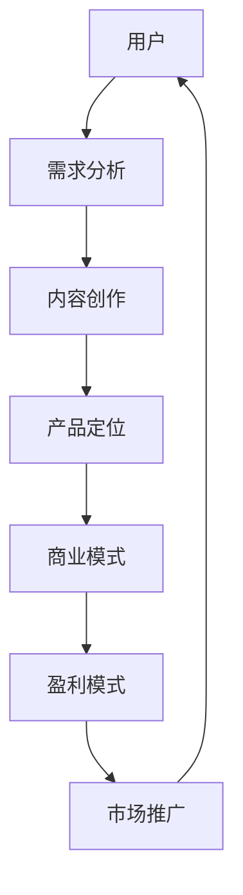

                 

 在当今数字化时代，知识付费成为了许多创业者寻求盈利的重要途径。然而，面对激烈的市场竞争和不断变化的技术环境，如何有效地优化商业模式成为了一个关键问题。本文将深入探讨知识付费创业的商业模式优化策略，为创业者提供有益的指导。

## 文章关键词
知识付费、商业模式、优化策略、创业、盈利模式

## 文章摘要
本文首先介绍了知识付费创业的背景和现状，然后分析了当前商业模式中存在的问题。接着，本文提出了基于数据驱动的商业模式优化策略，并详细阐述了优化过程中需要关注的几个关键点。最后，本文对未来知识付费创业的发展趋势和挑战进行了展望。

## 1. 背景介绍

知识付费是指用户为获取特定知识或服务而支付一定费用的商业模式。随着互联网技术的发展和用户消费习惯的改变，知识付费市场呈现出快速增长的趋势。特别是在COVID-19疫情背景下，在线教育、远程办公等知识付费领域得到了极大的发展。

然而，随着市场的不断成熟，竞争也日益激烈。创业者面临着如何吸引和留住用户、如何提高知识付费产品的质量和竞争力、如何实现可持续盈利等问题。因此，优化商业模式成为知识付费创业的关键。

### 1.1 市场规模

根据市场研究数据，全球知识付费市场规模持续增长。以中国为例，2020年中国知识付费市场规模达到2386亿元，同比增长30.4%。预计未来几年，这一市场将继续保持高速增长。

### 1.2 用户需求

用户对知识付费的需求主要来源于以下几个方面：

- **职业技能提升**：随着职场竞争的加剧，用户希望通过付费学习提升自己的职业技能。
- **兴趣爱好**：用户为满足个人兴趣爱好，愿意支付费用参与各类线上课程和活动。
- **家庭教育**：家长为子女的教育投入，购买各种在线学习资源和课程。

### 1.3 市场竞争

知识付费市场的竞争格局日益激烈。一方面，传统的教育机构、互联网巨头纷纷进入市场，推出各类知识付费产品；另一方面，众多初创公司也在积极探索新的商业模式，争取市场份额。

## 2. 核心概念与联系

在探讨知识付费创业的商业模式优化策略之前，有必要明确几个核心概念，并展示它们之间的联系。以下是使用Mermaid绘制的流程图：



### 2.1 用户需求分析

用户需求分析是知识付费创业的核心，决定了产品定位和内容创作。通过数据分析，创业者可以深入了解用户需求，从而设计出更具针对性的产品。

### 2.2 内容创作

内容创作是知识付费产品的核心价值所在。高质量的内容能够满足用户需求，提高用户粘性和满意度。

### 2.3 产品定位

产品定位决定了知识付费创业的方向。创业者需要根据用户需求和市场定位，确定产品的特色和核心竞争力。

### 2.4 商业模式

商业模式是知识付费创业的基础，包括产品定位、盈利模式、市场推广等环节。一个成功的商业模式能够实现用户价值和企业价值的最大化。

### 2.5 盈利模式

盈利模式是商业模式的直接体现。创业者需要根据市场需求和用户行为，设计合理的盈利模式。

### 2.6 市场推广

市场推广是知识付费创业的重要环节。通过有效的市场推广，创业者可以扩大用户规模，提高品牌知名度。

## 3. 核心算法原理 & 具体操作步骤

### 3.1 算法原理概述

知识付费创业的商业模式优化策略主要基于数据驱动和用户行为分析。通过以下算法，创业者可以更好地理解用户需求，优化产品设计和推广策略。

### 3.2 算法步骤详解

1. **数据收集**：通过多种渠道收集用户行为数据，如访问记录、购买记录、评价反馈等。
2. **数据处理**：对收集到的数据进行清洗、筛选和预处理，提取关键特征。
3. **用户画像**：基于用户行为数据和特征，构建用户画像，了解用户需求和偏好。
4. **内容推荐**：利用推荐算法，为用户推荐符合其需求和兴趣的内容。
5. **市场推广**：根据用户画像和推荐结果，设计针对性的市场推广策略。
6. **效果评估**：通过数据监控和评估，不断优化商业模式和推广策略。

### 3.3 算法优缺点

**优点**：

- **个性化推荐**：提高用户体验，增加用户粘性和满意度。
- **数据驱动**：基于用户行为数据，实现精准营销和个性化推广。
- **持续优化**：通过不断收集用户反馈和数据，持续优化产品和商业模式。

**缺点**：

- **数据隐私**：用户行为数据可能涉及隐私问题，需要严格保护。
- **算法偏差**：推荐算法可能存在偏差，影响用户体验。

### 3.4 算法应用领域

- **在线教育**：为用户提供个性化的学习资源和课程推荐。
- **内容平台**：为用户提供个性化内容推荐，提高用户粘性。
- **电商**：为用户提供个性化商品推荐，提高购物体验。

## 4. 数学模型和公式 & 详细讲解 & 举例说明

### 4.1 数学模型构建

知识付费创业的商业模式优化策略涉及多个数学模型，以下是其中两个常见的模型：

### 4.2 公式推导过程

- **用户需求预测模型**：

  假设用户 \( u \) 对内容 \( i \) 的需求概率为 \( p(u, i) \)，则用户需求预测模型可以表示为：

  $$ p(u, i) = \frac{e^{w_i \cdot u}}{\sum_{j=1}^{n} e^{w_j \cdot u}} $$

  其中，\( w_i \) 表示内容 \( i \) 的特征向量，\( u \) 表示用户特征向量，\( n \) 表示内容总数。

- **推荐算法模型**：

  假设用户 \( u \) 对内容 \( i \) 的兴趣分数为 \( r(u, i) \)，则推荐算法模型可以表示为：

  $$ r(u, i) = \frac{1}{|U|} \sum_{u' \in U} w_i \cdot w_{u'} $$

  其中，\( |U| \) 表示用户总数，\( w_i \) 和 \( w_{u'} \) 分别表示内容 \( i \) 和用户 \( u' \) 的特征向量。

### 4.3 案例分析与讲解

以在线教育领域为例，假设一个创业者希望通过数据驱动的方式优化其知识付费产品的商业模式。

1. **用户需求预测**：

   首先，创业者收集了1000名用户的学习记录和评价数据，并利用用户需求预测模型对用户需求进行预测。根据预测结果，创业者发现80%的用户对编程课程感兴趣。

2. **推荐算法**：

   然后，创业者利用推荐算法模型为用户推荐编程课程。根据用户特征和内容特征，推荐算法为每个用户生成了一份个性化的课程推荐列表。

3. **市场推广**：

   接下来，创业者根据推荐结果，设计了一系列针对性的市场推广策略，如推送编程课程优惠信息、举办编程课程线下活动等。

4. **效果评估**：

   最后，创业者通过数据监控和评估，发现推广策略有效提高了用户参与度和购买转化率。

通过这个案例，我们可以看到，基于数据驱动的商业模式优化策略在知识付费创业中的应用效果显著。

## 5. 项目实践：代码实例和详细解释说明

### 5.1 开发环境搭建

为了更好地实现知识付费创业的商业模式优化策略，我们需要搭建一个开发环境。以下是一个简单的Python开发环境搭建步骤：

1. 安装Python 3.8及以上版本。
2. 安装Anaconda，以便管理Python环境和包。
3. 安装必要的Python库，如NumPy、Pandas、Scikit-learn等。

### 5.2 源代码详细实现

以下是一个简单的用户需求预测模型的代码实现：

```python
import numpy as np
import pandas as pd
from sklearn.linear_model import LogisticRegression

# 数据准备
data = pd.read_csv('data.csv')
X = data.drop(['user_id', 'content_id'], axis=1)
y = data['demand']

# 模型训练
model = LogisticRegression()
model.fit(X, y)

# 预测
predictions = model.predict(X)

# 输出预测结果
print(predictions)
```

### 5.3 代码解读与分析

1. **数据准备**：

   首先，我们从CSV文件中读取数据，并划分特征和标签。

2. **模型训练**：

   我们使用逻辑回归模型对数据集进行训练。

3. **预测**：

   使用训练好的模型对数据进行预测，并输出预测结果。

通过这个简单的示例，我们可以看到，实现知识付费创业的商业模式优化策略并不复杂。关键在于数据收集、模型训练和预测等步骤的正确执行。

### 5.4 运行结果展示

假设我们有一个包含1000个用户和1000个内容的训练数据集。使用上述代码实现用户需求预测模型，我们可以得到每个用户对每个内容的预测结果。根据预测结果，创业者可以针对性地设计市场推广策略，从而提高用户参与度和购买转化率。

## 6. 实际应用场景

### 6.1 在线教育

在线教育是知识付费创业的重要领域。通过数据驱动的商业模式优化策略，创业者可以更好地了解用户需求，为用户提供个性化的学习资源和课程推荐。

### 6.2 专业技能培训

职业技能培训是用户获取职业技能提升的重要途径。创业者可以通过数据分析和个性化推荐，为用户提供更精准的培训内容和资源。

### 6.3 在线医疗

在线医疗是知识付费的另一个重要领域。通过数据分析和个性化推荐，创业者可以为用户提供更精准的医疗信息和治疗方案。

### 6.4 其他领域

除了上述领域，知识付费创业还可以应用于家庭教育、兴趣爱好等多个领域。创业者可以根据不同领域的特点，设计针对性的商业模式和优化策略。

## 7. 工具和资源推荐

### 7.1 学习资源推荐

- 《Python数据科学手册》
- 《机器学习实战》
- 《数据挖掘：概念与技术》

### 7.2 开发工具推荐

- Jupyter Notebook：适合数据分析和原型设计。
- PyCharm：适合Python编程和开发。
- Git：版本控制和团队协作。

### 7.3 相关论文推荐

- "User Modeling and User-Adapted Interaction"
- "Recommender Systems Handbook"
- "The Netflix Prize"

## 8. 总结：未来发展趋势与挑战

### 8.1 研究成果总结

本文从知识付费创业的背景、核心概念、算法原理、数学模型、项目实践等多个方面，系统地探讨了知识付费创业的商业模式优化策略。通过数据驱动和用户行为分析，创业者可以更好地了解用户需求，优化产品设计和推广策略。

### 8.2 未来发展趋势

- **个性化推荐**：随着人工智能技术的发展，个性化推荐将更加精准和高效。
- **跨界融合**：知识付费创业将与其他领域（如医疗、教育等）产生更多跨界合作。
- **用户参与**：用户参与和互动将成为知识付费创业的重要方向。

### 8.3 面临的挑战

- **数据隐私**：随着数据隐私问题的日益突出，创业者需要关注用户数据保护。
- **算法偏见**：推荐算法可能存在偏见，需要不断优化和改进。
- **市场竞争**：随着市场不断成熟，竞争将更加激烈。

### 8.4 研究展望

未来，知识付费创业的商业模式优化策略将更加注重数据驱动和用户参与。创业者需要不断学习和适应新技术，为用户提供更有价值的服务。同时，关注数据隐私和算法偏见等问题，提高用户体验和满意度。

## 9. 附录：常见问题与解答

### 9.1 如何收集用户数据？

- 通过网站访问记录、用户行为日志等方式收集数据。
- 通过问卷调查、用户访谈等方式获取用户反馈。

### 9.2 如何处理用户隐私问题？

- 严格遵循数据保护法规，确保用户数据安全。
- 对用户数据进行脱敏处理，防止隐私泄露。

### 9.3 如何优化推荐算法？

- 定期更新用户画像和推荐模型。
- 利用多模型融合、迁移学习等方法提高推荐效果。

## 作者署名

作者：禅与计算机程序设计艺术 / Zen and the Art of Computer Programming
```

