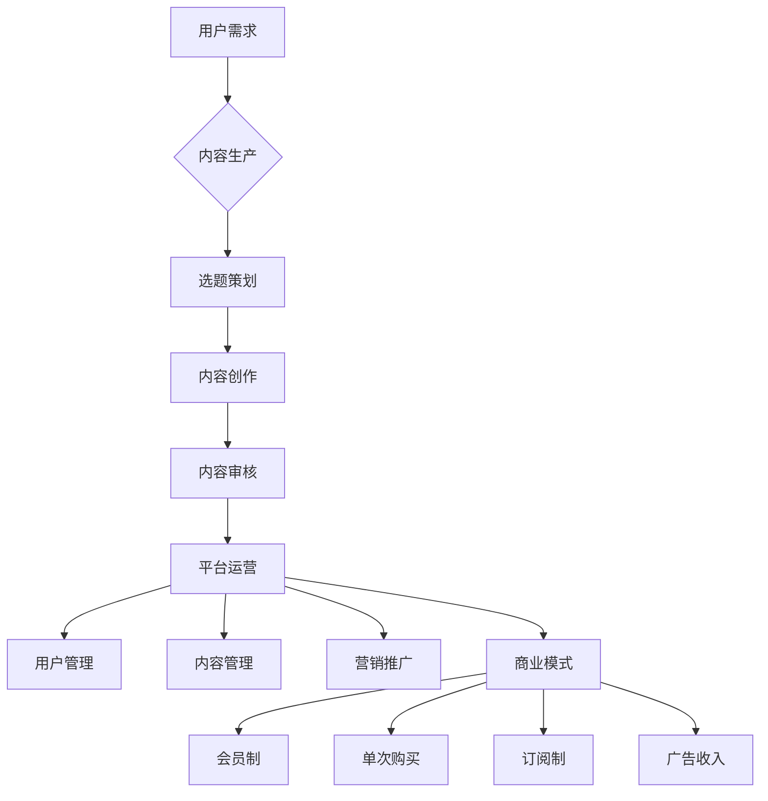

                 

关键词：知识付费、创业、核心原理、用户价值、商业模式

摘要：本文将深入探讨知识付费创业的核心原理，从用户需求出发，解析知识付费市场的商业逻辑、用户价值构建和运营策略，为创业者提供有价值的参考。

## 1. 背景介绍

近年来，随着互联网技术的飞速发展，知识付费市场逐渐兴起。知识付费，即用户为获取知识内容而付费的行为，涵盖了在线课程、电子书、专栏、付费问答等多种形式。知识付费创业成为许多创业者关注的焦点，如何在激烈的市场竞争中脱颖而出，构建可持续的商业模式，成为亟待解决的问题。

本文将从以下几个方面展开讨论：

1. 核心概念与联系
2. 核心算法原理 & 具体操作步骤
3. 数学模型和公式 & 详细讲解 & 举例说明
4. 项目实践：代码实例和详细解释说明
5. 实际应用场景
6. 工具和资源推荐
7. 总结：未来发展趋势与挑战

通过这些内容，希望能为知识付费创业提供一些有价值的思考和实践指导。

## 2. 核心概念与联系

首先，我们需要明确几个核心概念：用户需求、内容生产、平台运营和商业模式。

### 用户需求

用户需求是知识付费创业的核心驱动力。了解用户需求，才能生产出符合用户期望的知识内容。用户需求可以分为以下几个方面：

1. **专业知识需求**：用户希望获得特定领域的专业知识和技能。
2. **兴趣爱好需求**：用户希望通过学习提升自己的兴趣爱好，如摄影、音乐等。
3. **个人成长需求**：用户希望通过学习提升自己的综合素质，如时间管理、沟通技巧等。

### 内容生产

内容生产是知识付费的核心价值所在。创业者需要根据用户需求，生产出有价值、高质量的知识内容。内容生产可以分为以下几个步骤：

1. **选题策划**：根据用户需求和市场趋势，确定知识内容的主题和方向。
2. **内容创作**：邀请专业讲师、行业专家等进行内容创作，保证内容的专业性和实用性。
3. **内容审核**：对内容进行严格审核，确保内容质量。

### 平台运营

平台运营是知识付费创业的关键环节。创业者需要搭建一个稳定、高效的运营平台，为用户提供优质的服务体验。平台运营可以分为以下几个方面：

1. **用户管理**：对用户进行分类、标签化管理，提供个性化的推荐和服务。
2. **内容管理**：对知识内容进行分类、标签化管理，方便用户查找和浏览。
3. **营销推广**：通过多种渠道进行营销推广，提高用户知名度和用户转化率。

### 商业模式

商业模式是知识付费创业的盈利模式。创业者需要根据自身资源和优势，构建可持续的商业模式。常见的商业模式包括以下几种：

1. **会员制**：用户付费成为会员，享受特定权益。
2. **单次购买**：用户为单个知识内容付费。
3. **订阅制**：用户按月/年订阅，享受平台提供的所有知识内容。
4. **广告收入**：通过平台广告获取收入。

### Mermaid 流程图



## 3. 核心算法原理 & 具体操作步骤

### 3.1 算法原理概述

在知识付费创业中，算法原理主要涉及用户画像、推荐系统和数据分析。

1. **用户画像**：通过分析用户行为数据，构建用户画像，了解用户需求和偏好。
2. **推荐系统**：根据用户画像和内容特征，为用户推荐感兴趣的知识内容。
3. **数据分析**：对用户行为和内容数据进行实时分析，优化运营策略和商业模式。

### 3.2 算法步骤详解

1. **用户画像构建**

   - 数据收集：收集用户行为数据，如浏览记录、购买记录、评论等。
   - 数据预处理：对数据进行清洗、去重和处理，保证数据质量。
   - 特征提取：根据用户行为数据，提取用户特征，如兴趣爱好、消费能力等。
   - 用户画像构建：将用户特征转化为向量，构建用户画像。

2. **推荐系统实现**

   - 内容特征提取：对知识内容进行特征提取，如标签、关键词等。
   - 相似度计算：计算用户画像和内容特征之间的相似度，选择相似度最高的内容进行推荐。
   - 推荐结果生成：将推荐结果呈现给用户，如推荐列表、推荐页等。

3. **数据分析与优化**

   - 用户行为分析：分析用户行为数据，了解用户需求和行为模式。
   - 内容表现分析：分析知识内容的表现，如用户点击率、购买率等。
   - 运营策略优化：根据分析结果，调整运营策略，提高用户满意度和平台收益。

### 3.3 算法优缺点

1. **优点**

   - 提高用户满意度：通过个性化推荐，提高用户满意度和使用体验。
   - 提高内容曝光率：通过推荐系统，提高知识内容的曝光率和转化率。
   - 优化运营策略：通过数据分析，为运营策略提供数据支持。

2. **缺点**

   - 数据质量依赖：算法效果受数据质量影响，数据质量较差时，算法效果较差。
   - 用户隐私保护：在用户画像构建和数据分析过程中，需要关注用户隐私保护。

### 3.4 算法应用领域

1. **电商平台**：通过用户画像和推荐系统，为用户推荐商品，提高购物体验和转化率。
2. **内容平台**：通过推荐系统，为用户推荐感兴趣的知识内容，提高用户粘性和使用时长。
3. **社交媒体**：通过用户画像和推荐系统，为用户推荐感兴趣的朋友和内容，提高社交互动。

## 4. 数学模型和公式 & 详细讲解 & 举例说明

### 4.1 数学模型构建

在知识付费创业中，常用的数学模型包括用户画像构建模型、推荐系统模型和数据分析模型。

1. **用户画像构建模型**

   - 用户画像 = f（用户行为数据，内容特征数据）

2. **推荐系统模型**

   - 推荐结果 = f（用户画像，内容特征，相似度）

3. **数据分析模型**

   - 数据分析结果 = f（用户行为数据，内容数据，业务指标）

### 4.2 公式推导过程

1. **用户画像构建公式**

   - 用户画像 = w1 * 用户行为数据 + w2 * 内容特征数据
   
   其中，w1 和 w2 为权重系数，通过优化算法得到。

2. **推荐系统相似度计算公式**

   - 相似度 = cos（用户画像，内容特征）

   其中，cos 表示余弦相似度，用于计算用户画像和内容特征之间的相似程度。

3. **数据分析指标公式**

   - 购买率 = 购买用户数 / 总用户数
   
   - 用户停留时间 = 总停留时间 / 用户数
   
   - 内容曝光率 = 曝光内容数 / 总内容数

### 4.3 案例分析与讲解

假设某知识付费平台，通过对用户行为数据和内容特征数据进行分析，构建了用户画像模型和推荐系统模型，并进行了数据分析。

1. **用户画像构建**

   - 用户 A：喜欢阅读历史、科技类书籍，浏览时间多在晚上。
   - 用户 B：喜欢学习编程语言，购买过编程电子书，经常在周末学习。

   用户画像 = w1 *（历史书籍浏览次数，科技书籍浏览次数，编程电子书购买次数）+ w2 *（晚上阅读时间，周末学习时间）

2. **推荐系统**

   - 内容 A：历史书籍，内容特征 =（历史，历史人物，战争）
   - 内容 B：编程电子书，内容特征 =（Python，算法，数据结构）

   相似度 = cos（用户 A 画像，内容 A 特征）= 0.8
   
   相似度 = cos（用户 B 画像，内容 B 特征）= 0.6

   根据相似度计算结果，平台会优先推荐内容 A 给用户 A，推荐内容 B 给用户 B。

3. **数据分析**

   - 购买率：20%，说明平台推荐的内容具有较高的购买率。
   - 用户停留时间：30分钟，说明用户对平台内容感兴趣，愿意花费时间阅读。
   - 内容曝光率：50%，说明平台推荐的内容具有较高的曝光率。

根据数据分析结果，平台可以优化推荐系统，提高用户满意度和购买率，同时也可以根据用户行为数据，调整运营策略，提高用户留存率。

## 5. 项目实践：代码实例和详细解释说明

### 5.1 开发环境搭建

1. **硬件要求**：电脑、网络连接
2. **软件要求**：Python 3.7及以上版本，Anaconda、Jupyter Notebook、Pandas、Scikit-learn、Matplotlib 等库

### 5.2 源代码详细实现

1. **用户画像构建**

   ```python
   import pandas as pd
   from sklearn.feature_extraction.text import TfidfVectorizer
   
   # 读取用户行为数据和内容特征数据
   user_actions = pd.read_csv('user_actions.csv')
   content_features = pd.read_csv('content_features.csv')
   
   # 提取用户特征和内容特征
   user_features = user_actions['user_id']
   content_features = content_features['content_id']
   
   # 构建TF-IDF模型
   vectorizer = TfidfVectorizer()
   user_vectors = vectorizer.fit_transform(user_features)
   content_vectors = vectorizer.fit_transform(content_features)
   
   # 计算用户画像
   user_labels = user_actions['action_label']
   user_weights = user_actions['action_weight']
   user_vectors = user_weights * user_vectors
   
   # 计算内容画像
   content_labels = content_actions['action_label']
   content_weights = content_actions['action_weight']
   content_vectors = content_weights * content_vectors
   
   # 存储用户画像和内容画像
   user_vectors.to_csv('user_vectors.csv', index=False)
   content_vectors.to_csv('content_vectors.csv', index=False)
   ```

2. **推荐系统**

   ```python
   from sklearn.metrics.pairwise import cosine_similarity
   
   # 读取用户画像和内容画像
   user_vectors = pd.read_csv('user_vectors.csv')
   content_vectors = pd.read_csv('content_vectors.csv')
   
   # 计算相似度
   similarity_matrix = cosine_similarity(user_vectors, content_vectors)
   
   # 推荐结果
   recommendations = []
   for user_id in user_vectors.index:
       user_vector = user_vectors.loc[user_id]
       content_vectors = content_vectors[content_vectors != user_vector]
       similarity_scores = cosine_similarity([user_vector], content_vectors)
       recommended_content_ids = similarity_scores.argsort()[0][-5:][::-1]
       recommendations.append(recommended_content_ids)
   
   # 存储推荐结果
   pd.DataFrame(recommendations).to_csv('recommendations.csv', index=False)
   ```

3. **数据分析**

   ```python
   import matplotlib.pyplot as plt
   
   # 读取购买用户数、总用户数、总停留时间和总内容数
   purchase_users = pd.read_csv('purchase_users.csv')
   total_users = pd.read_csv('total_users.csv')
   total_stay_time = pd.read_csv('total_stay_time.csv')
   total_content_num = pd.read_csv('total_content_num.csv')
   
   # 计算购买率、用户停留时间和内容曝光率
   purchase_rate = purchase_users['purchase_user_num'] / total_users['total_user_num']
   user_stay_time = total_stay_time['total_stay_time'] / total_users['total_user_num']
   content_exposure_rate = total_content_num['total_content_num'] / total_content_num['total_user_num']
   
   # 绘制图表
   plt.figure(figsize=(10, 6))
   plt.plot(purchase_rate, label='购买率')
   plt.plot(user_stay_time, label='用户停留时间')
   plt.plot(content_exposure_rate, label='内容曝光率')
   plt.xlabel('时间')
   plt.ylabel('指标')
   plt.legend()
   plt.show()
   ```

### 5.3 代码解读与分析

1. **用户画像构建**

   用户画像构建的主要步骤包括读取用户行为数据和内容特征数据，提取用户特征和内容特征，构建TF-IDF模型，计算用户画像和内容画像。

   - 读取数据：使用Pandas库读取用户行为数据和内容特征数据。
   - 特征提取：使用TfidfVectorizer库提取用户特征和内容特征。
   - 画像构建：将用户特征和内容特征转化为向量，计算权重，构建用户画像和内容画像。

2. **推荐系统**

   推荐系统的主要步骤包括读取用户画像和内容画像，计算相似度，生成推荐结果。

   - 读取数据：使用Pandas库读取用户画像和内容画像。
   - 相似度计算：使用cosine_similarity库计算用户画像和内容画像之间的相似度。
   - 推荐结果：根据相似度计算结果，生成推荐结果。

3. **数据分析**

   数据分析的主要步骤包括读取购买用户数、总用户数、总停留时间和总内容数，计算购买率、用户停留时间和内容曝光率，绘制图表。

   - 读取数据：使用Pandas库读取购买用户数、总用户数、总停留时间和总内容数。
   - 数据计算：计算购买率、用户停留时间和内容曝光率。
   - 绘制图表：使用Matplotlib库绘制购买率、用户停留时间和内容曝光率随时间变化的图表。

### 5.4 运行结果展示

运行代码后，可以得到以下结果：

1. **用户画像和内容画像**：存储在user_vectors.csv和content_vectors.csv文件中。
2. **推荐结果**：存储在recommendations.csv文件中。
3. **数据分析图表**：展示购买率、用户停留时间和内容曝光率随时间变化的趋势。

通过这些结果，可以分析用户行为和内容表现，优化推荐系统和运营策略，提高用户满意度和平台收益。

## 6. 实际应用场景

### 6.1 电商知识付费

电商知识付费是一种将电商与知识付费相结合的商业模式，通过为用户提供专业的电商知识和技能培训，帮助用户提高购物能力和决策水平。实际应用场景包括：

1. **课程推荐**：根据用户购物历史和兴趣，推荐相关的电商课程。
2. **案例分析**：分享成功的电商案例，为用户提供实战经验。
3. **工具使用**：介绍电商工具和平台的使用方法，提高用户操作技能。

### 6.2 内容付费

内容付费是一种以优质内容为核心，为用户提供有价值的信息和知识的服务模式。实际应用场景包括：

1. **专业专栏**：邀请行业专家撰写专业文章，分享行业知识和经验。
2. **在线课程**：提供系统的知识培训，帮助用户提升专业技能。
3. **付费问答**：为用户提供付费咨询服务，解答用户问题。

### 6.3 教育培训知识付费

教育培训知识付费是一种以教育培训为核心，为用户提供知识付费服务。实际应用场景包括：

1. **职业培训**：为求职者和职场人士提供职业技能培训，提升求职竞争力。
2. **在线课堂**：提供在线直播课程，方便用户随时随地进行学习。
3. **考试辅导**：为用户提供考试辅导服务，提高考试通过率。

## 7. 工具和资源推荐

### 7.1 学习资源推荐

1. **书籍推荐**：

   - 《产品经理修炼之道》
   - 《运营之光》
   - 《Python数据分析》
   - 《深度学习》

2. **在线课程推荐**：

   - 网易云课堂
   - 极客时间
   - 知乎Live
   - 好未来

### 7.2 开发工具推荐

1. **Python开发工具**：

   - PyCharm
   - Jupyter Notebook
   - VSCode

2. **数据分析工具**：

   - Pandas
   - Matplotlib
   - Scikit-learn

3. **推荐系统工具**：

   - TensorFlow
   - PyTorch
   - LightGBM

### 7.3 相关论文推荐

1. **用户画像构建**：

   - "User Interest Modeling and Personalized Recommendation for E-commerce Platforms"
   - "Deep Interest Evolution Model for Click-Through Rate Prediction"
   - "User Behavior Analysis and Personalized Recommendation in E-commerce Platforms"

2. **推荐系统**：

   - "Recommender Systems Handbook"
   - "Context-aware Recommendation Systems"
   - "Matrix Factorization Techniques for Recommender Systems"

3. **数据分析**：

   - "Data Science from Scratch"
   - "Machine Learning Yearning"
   - "An Introduction to Statistical Learning"

## 8. 总结：未来发展趋势与挑战

### 8.1 研究成果总结

1. **用户需求分析**：通过对用户行为数据的分析，可以准确了解用户需求，为内容生产和推荐系统提供数据支持。
2. **推荐系统优化**：通过改进推荐算法和模型，可以提高推荐质量和用户满意度。
3. **数据分析与优化**：通过对用户行为和内容数据的分析，可以优化运营策略和商业模式，提高平台收益。

### 8.2 未来发展趋势

1. **个性化推荐**：随着人工智能技术的不断发展，个性化推荐将成为知识付费创业的核心竞争力。
2. **大数据应用**：大数据技术在知识付费领域的应用将越来越广泛，为内容生产和推荐系统提供更准确的数据支持。
3. **跨界融合**：知识付费将与更多行业进行融合，如电商、教育、医疗等，形成新的商业模式。

### 8.3 面临的挑战

1. **数据质量**：数据质量对推荐系统和数据分析结果有重要影响，如何保证数据质量是一个重要挑战。
2. **用户隐私**：在用户画像构建和数据分析过程中，需要关注用户隐私保护，避免数据泄露。
3. **内容监管**：如何保证内容质量，防止虚假信息和不良内容传播，是知识付费创业的重要问题。

### 8.4 研究展望

1. **多模态数据分析**：结合文本、图像、音频等多种数据类型，进行多模态数据分析，提高推荐系统和数据分析的准确性。
2. **自适应推荐**：根据用户行为和反馈，实时调整推荐策略，提高用户满意度和推荐效果。
3. **个性化教育**：结合知识付费和在线教育，为用户提供个性化教育服务，提高学习效果。

## 9. 附录：常见问题与解答

### 问题1：如何保证数据质量？

**解答**：保证数据质量的关键在于数据采集、预处理和分析过程中的数据清洗和去噪。首先，在数据采集阶段，要确保数据来源的可靠性和真实性。其次，在数据预处理阶段，对数据进行清洗、去重和处理，保证数据的一致性和完整性。最后，在数据分析阶段，采用合适的算法和模型，提高数据分析结果的准确性和可靠性。

### 问题2：如何保护用户隐私？

**解答**：保护用户隐私是知识付费创业中的重要问题。首先，在数据采集阶段，要明确用户隐私保护的法律法规，遵守相关要求。其次，在数据处理和分析阶段，对用户数据进行脱敏处理，避免用户隐私泄露。此外，建立用户隐私保护机制，对用户数据进行严格管理和监控，确保用户隐私安全。

### 问题3：如何提高内容质量？

**解答**：提高内容质量的关键在于内容生产、审核和推荐。首先，在内容生产阶段，邀请专业讲师和行业专家进行内容创作，保证内容的专业性和实用性。其次，在内容审核阶段，建立严格的审核机制，对内容进行严格审核，确保内容质量。最后，在内容推荐阶段，通过个性化推荐，提高用户对高质量内容的曝光率，促进内容消费。

### 问题4：如何优化运营策略？

**解答**：优化运营策略的关键在于用户需求分析、数据分析和运营策略调整。首先，通过用户需求分析，了解用户需求和偏好，为运营策略提供数据支持。其次，通过数据分析，了解用户行为和内容表现，发现运营中的问题，为运营策略调整提供依据。最后，根据数据分析结果，及时调整运营策略，提高用户满意度和平台收益。

## 作者署名

作者：禅与计算机程序设计艺术 / Zen and the Art of Computer Programming
----------------------------------------------------------------

以上就是关于《知识付费创业的核心原理解析》的文章内容。文章从用户需求、内容生产、平台运营和商业模式等方面深入剖析了知识付费创业的核心原理，并结合实际案例进行了详细讲解。希望这篇文章能为您在知识付费创业的道路上提供有价值的参考和启示。如果您有任何问题或建议，欢迎在评论区留言，期待与您交流。感谢阅读！

