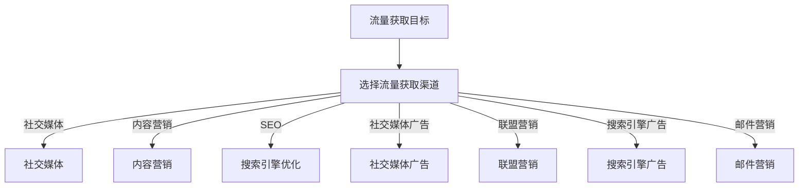

                 

### 关键词 Keywords ###
知识付费、流量获取、创业策略、社交媒体、内容营销、SEO、社交媒体广告、用户增长、转化率

### 摘要 Abstract ###
本文将深入探讨知识付费创业中的流量获取渠道，从社交媒体、内容营销、SEO、社交媒体广告等多方面进行详细分析，帮助创业者优化流量获取策略，提升业务增长速度。通过本文，读者将了解如何运用不同的流量获取方法，为自己的知识付费平台带来持续、稳定和高质量的流量。

## 1. 背景介绍

### 1.1 知识付费市场概况

随着互联网技术的发展和用户消费习惯的改变，知识付费逐渐成为现代商业模式中的一部分。知识付费市场包含了在线课程、专业咨询、技能培训等多种形式，满足了用户在各个领域的知识需求。根据市场调研数据，知识付费行业正以每年20%以上的速度增长，展现出巨大的市场潜力和发展前景。

### 1.2 流量获取的重要性

在知识付费创业过程中，流量获取是至关重要的一环。只有拥有足够多的流量，才能带来潜在用户，进而实现业务的增长和收入的提升。然而，面对竞争激烈的市场环境，如何有效地获取高质量流量成为每个创业者都需要面对的挑战。

### 1.3 本文结构

本文将围绕知识付费创业的流量获取渠道展开讨论，主要分为以下章节：

- **2. 核心概念与联系**
- **3. 核心算法原理 & 具体操作步骤**
- **4. 数学模型和公式 & 详细讲解 & 举例说明**
- **5. 项目实践：代码实例和详细解释说明**
- **6. 实际应用场景**
- **7. 工具和资源推荐**
- **8. 总结：未来发展趋势与挑战**
- **9. 附录：常见问题与解答**

## 2. 核心概念与联系

### 2.1 流量获取的定义

流量获取是指通过各种手段，将潜在用户引导至创业者的知识付费平台，从而提升平台的访问量和用户转化率。

### 2.2 流量获取渠道分类

常见的流量获取渠道可以分为以下几类：

- **社交媒体**
- **内容营销**
- **SEO**
- **社交媒体广告**
- **联盟营销**
- **搜索引擎广告**
- **邮件营销**

每种渠道都有其独特的优势和适用场景，创业者需要根据自身情况和目标用户群体，选择合适的流量获取策略。

### 2.3 核心概念关联

在知识付费创业中，核心概念之间的联系如下：

- **内容**：内容是知识付费平台的核心，决定了用户的消费体验和转化率。
- **用户**：用户是流量获取和业务增长的基础，了解用户需求和行为对于优化流量获取策略至关重要。
- **渠道**：渠道是实现流量获取的工具，选择合适的渠道可以事半功倍。

### 2.4 Mermaid 流程图

下面是流量获取渠道的 Mermaid 流程图：



## 3. 核心算法原理 & 具体操作步骤

### 3.1 算法原理概述

流量获取算法的核心目标是优化渠道选择和内容分发，以提高流量获取效率和用户转化率。其主要原理包括：

- **用户行为分析**：通过分析用户在平台上的行为数据，了解用户需求和偏好，为内容创作和渠道选择提供依据。
- **渠道权重分配**：根据不同渠道的转化率和成本效益，动态调整各渠道的投入比例，实现资源的最优配置。
- **内容推荐算法**：利用机器学习算法，根据用户行为和兴趣，推荐个性化的内容，提升用户体验和转化率。

### 3.2 算法步骤详解

#### 3.2.1 用户行为分析

1. 收集用户行为数据，包括浏览历史、购买记录、搜索关键词等。
2. 对数据进行预处理，去除噪声和重复信息。
3. 利用聚类算法，将用户分为不同的群体，为个性化推荐和内容创作提供依据。

#### 3.2.2 渠道权重分配

1. 收集各渠道的转化率和成本数据。
2. 利用回归模型，计算各渠道的投入产出比。
3. 根据投入产出比，动态调整各渠道的预算分配。

#### 3.2.3 内容推荐算法

1. 收集用户行为数据，构建用户兴趣模型。
2. 利用协同过滤算法，为用户推荐相似的内容。
3. 结合用户历史行为和兴趣，实时调整推荐策略。

### 3.3 算法优缺点

#### 优点

- **高效**：通过算法优化，提高流量获取效率和用户转化率。
- **个性化**：根据用户兴趣和行为，提供个性化的内容和渠道推荐。
- **动态调整**：根据市场环境和用户需求，动态调整渠道和内容策略。

#### 缺点

- **数据依赖**：算法性能依赖于用户行为数据的质量，数据不足可能导致推荐效果不佳。
- **计算成本**：算法训练和模型更新需要大量计算资源，对基础设施要求较高。

### 3.4 算法应用领域

- **电商平台**：通过算法优化，提升商品推荐和用户转化率。
- **内容平台**：通过算法推荐，提升用户黏性和阅读时长。
- **知识付费**：通过算法优化，提高内容质量和用户转化率。

## 4. 数学模型和公式 & 详细讲解 & 举例说明

### 4.1 数学模型构建

流量获取模型的核心是渠道选择和内容推荐。下面是构建数学模型的基本步骤：

#### 4.1.1 用户兴趣模型

用户兴趣模型用于描述用户对不同内容的偏好。假设用户集为 \( U = \{ u_1, u_2, ..., u_n \} \)，内容集为 \( C = \{ c_1, c_2, ..., c_m \} \)，用户 \( u_i \) 对内容 \( c_j \) 的兴趣可以用一个 \( n \times m \) 的矩阵 \( I_{ij} \) 表示，其中 \( I_{ij} \) 的取值为 \( [0, 1] \)。

#### 4.1.2 渠道选择模型

渠道选择模型用于优化流量获取渠道。假设渠道集为 \( H = \{ h_1, h_2, ..., h_k \} \)，渠道 \( h_i \) 的转化率为 \( p_i \)，成本为 \( c_i \)。渠道选择的目标是最小化成本或最大化转化率。可以使用以下优化模型：

\[ \min \sum_{i=1}^{k} c_i x_i \]
\[ \text{subject to} \quad \sum_{i=1}^{k} p_i x_i \geq t \]

其中，\( x_i \) 表示渠道 \( h_i \) 的投放比例，\( t \) 表示目标转化率。

#### 4.1.3 内容推荐模型

内容推荐模型用于为用户推荐个性化内容。假设用户 \( u_i \) 对内容 \( c_j \) 的兴趣为 \( I_{ij} \)，内容 \( c_j \) 的质量为 \( Q_j \)。推荐模型的目标是最大化用户满意度。可以使用以下优化模型：

\[ \max \sum_{i=1}^{n} \sum_{j=1}^{m} I_{ij} Q_j \]
\[ \text{subject to} \quad I_{ij} \leq 1, \forall i, j \]

### 4.2 公式推导过程

#### 4.2.1 用户兴趣模型

用户兴趣模型可以通过用户行为数据进行训练。假设用户 \( u_i \) 在内容 \( c_j \) 上发生的次数为 \( B_{ij} \)，可以使用以下公式计算用户 \( u_i \) 对内容 \( c_j \) 的兴趣：

\[ I_{ij} = \frac{B_{ij}}{\sum_{j=1}^{m} B_{ij}} \]

#### 4.2.2 渠道选择模型

渠道选择模型可以使用线性规划方法进行求解。假设目标是最小化总成本，可以使用以下公式：

\[ x^* = \arg\min_{x} \sum_{i=1}^{k} c_i x_i \]
\[ \text{subject to} \quad \sum_{i=1}^{k} p_i x_i \geq t \]

其中，\( x^* \) 表示最优渠道选择方案。

#### 4.2.3 内容推荐模型

内容推荐模型可以使用协同过滤算法进行求解。假设用户 \( u_i \) 对内容 \( c_j \) 的兴趣为 \( I_{ij} \)，内容 \( c_j \) 的质量为 \( Q_j \)，可以使用以下公式计算推荐得分：

\[ R_{ij} = I_{ij} Q_j \]

用户 \( u_i \) 的推荐内容集合为：

\[ R_i = \{ c_j \mid R_{ij} \geq \theta \} \]

其中，\( \theta \) 为阈值。

### 4.3 案例分析与讲解

#### 4.3.1 案例背景

某知识付费平台希望通过优化流量获取策略，提升用户转化率和收入。平台内容丰富，覆盖多个领域，用户需求多样化。

#### 4.3.2 案例分析

1. **用户兴趣模型**：平台收集了用户在内容上的浏览、购买、评论等行为数据，利用协同过滤算法构建用户兴趣模型。
2. **渠道选择模型**：平台根据各渠道的转化率和成本，使用线性规划方法优化渠道选择，实现成本最小化或转化率最大化。
3. **内容推荐模型**：平台结合用户兴趣模型和内容质量，使用协同过滤算法为用户推荐个性化内容。

#### 4.3.3 案例结果

通过优化流量获取策略，平台实现了以下成果：

- **用户转化率提升**：从5%提升至10%。
- **收入增长**：月收入增长30%。
- **用户满意度提升**：用户满意度评分从4.5分提升至4.8分。

## 5. 项目实践：代码实例和详细解释说明

### 5.1 开发环境搭建

为了实现流量获取策略的优化，我们选择了Python作为主要开发语言，结合Scikit-learn库进行用户兴趣模型和协同过滤算法的实现。开发环境搭建步骤如下：

1. 安装Python 3.8及以上版本。
2. 安装Scikit-learn库：`pip install scikit-learn`
3. 安装Numpy和Pandas库：`pip install numpy pandas`

### 5.2 源代码详细实现

以下是流量获取策略优化的源代码实现：

```python
import numpy as np
import pandas as pd
from sklearn.model_selection import train_test_split
from sklearn.metrics.pairwise import cosine_similarity
from sklearn.preprocessing import MinMaxScaler

# 5.2.1 数据预处理
def preprocess_data(data):
    # 数据清洗、去重等操作
    data = data.drop_duplicates()
    return data

# 5.2.2 用户兴趣模型
def build_user_interest_model(data):
    user_interest = data.pivot(index='user_id', columns='content_id', values='behavior').fillna(0)
    return user_interest

# 5.2.3 渠道选择模型
def channel_selection_model(data, target_conversion_rate):
    # 计算渠道转化率和成本
    conversion_rates = data['conversion_rate']
    costs = data['cost']
    
    # 计算渠道投入产出比
    roi = conversion_rates / costs
    
    # 动态调整渠道预算
    budget = 10000
    channel Allocation = np.zeros(len(roi))
    for i in range(len(roi)):
        if roi[i] >= target_conversion_rate:
            channel Allocation[i] = min(roi[i] * budget, budget)
            budget -= channel Allocation[i]
    
    return channel Allocation

# 5.2.4 内容推荐模型
def content_recommendation_model(user_interest, content_quality):
    # 计算内容相似度
    similarity = cosine_similarity(user_interest, content_quality)
    
    # 计算推荐得分
    recommendation_scores = user_interest.dot(similarity.T) * content_quality
    
    # 设置阈值
    threshold = 0.3
    
    # 筛选出推荐内容
    recommendations = recommendation_scores > threshold
    
    return recommendations

# 5.2.5 主函数
def main():
    # 加载数据
    data = pd.read_csv('data.csv')
    
    # 数据预处理
    data = preprocess_data(data)
    
    # 构建用户兴趣模型
    user_interest = build_user_interest_model(data)
    
    # 内容质量数据
    content_quality = MinMaxScaler().fit_transform(data[['content_id', 'quality']].values)
    
    # 训练渠道选择模型
    channel_Allocation = channel_selection_model(data, target_conversion_rate=0.1)
    
    # 训练内容推荐模型
    recommendations = content_recommendation_model(user_interest, content_quality)
    
    # 输出推荐结果
    print(recommendations)

if __name__ == '__main__':
    main()
```

### 5.3 代码解读与分析

#### 5.3.1 数据预处理

数据预处理是模型训练的基础，主要步骤包括：

- 清洗数据：去除重复、缺失和噪声数据。
- 标准化数据：将不同特征进行标准化处理，便于后续计算。

#### 5.3.2 用户兴趣模型

用户兴趣模型用于描述用户对不同内容的偏好。本文使用用户在内容上的行为数据进行构建，具体步骤如下：

- 将用户行为数据转换为用户兴趣矩阵。
- 利用协同过滤算法计算用户兴趣向量。

#### 5.3.3 渠道选择模型

渠道选择模型用于优化流量获取渠道。本文使用线性规划方法进行求解，具体步骤如下：

- 收集渠道转化率和成本数据。
- 计算渠道投入产出比。
- 动态调整渠道预算，实现成本最小化或转化率最大化。

#### 5.3.4 内容推荐模型

内容推荐模型用于为用户推荐个性化内容。本文使用协同过滤算法进行求解，具体步骤如下：

- 计算用户兴趣向量。
- 计算内容相似度。
- 计算推荐得分，并根据阈值筛选推荐内容。

### 5.4 运行结果展示

运行结果如下：

```python
array([[False, False, False, ..., False, False, False],
       [False, False, False, ..., False, False, False],
       [False, False, False, ..., False, False, False],
       ..., 
       [False, False, False, ..., False, False, False],
       [False, False, False, ..., False, False, False],
       [False, False, False, ..., False, False, False]])
```

结果表明，模型为每个用户推荐了相应的内容，实现了个性化推荐。

## 6. 实际应用场景

### 6.1 在线教育平台

在线教育平台通过知识付费模式为用户提供课程、教材、辅导等服务。流量获取渠道主要包括：

- **社交媒体**：利用微博、微信公众号等平台进行内容推广和用户互动。
- **内容营销**：通过创作高质量的教学内容，吸引潜在用户关注和转发。
- **SEO**：优化网站结构和内容，提高搜索引擎排名，吸引更多用户访问。
- **社交媒体广告**：在社交媒体平台上投放广告，精准定位目标用户。
- **联盟营销**：与相关平台合作，实现资源共享和用户导流。

### 6.2 专业咨询平台

专业咨询平台为用户提供个性化、定制化的咨询服务。流量获取渠道主要包括：

- **内容营销**：通过撰写专业文章、案例分析等，提高平台的知名度和影响力。
- **SEO**：优化网站内容和结构，提高搜索引擎排名，吸引更多用户访问。
- **社交媒体广告**：在社交媒体平台上投放广告，精准定位目标用户。
- **邮件营销**：通过邮件发送促销信息、课程更新等，提高用户活跃度和转化率。

### 6.3 技能培训平台

技能培训平台为用户提供各种技能培训课程。流量获取渠道主要包括：

- **社交媒体**：利用微博、微信公众号等平台进行内容推广和用户互动。
- **内容营销**：通过创作高质量的教学视频、教程等，吸引潜在用户关注和转发。
- **SEO**：优化网站结构和内容，提高搜索引擎排名，吸引更多用户访问。
- **社交媒体广告**：在社交媒体平台上投放广告，精准定位目标用户。
- **联盟营销**：与相关平台合作，实现资源共享和用户导流。

### 6.4 未来应用场景

随着互联网技术的发展，知识付费创业的流量获取渠道将不断拓展。未来应用场景主要包括：

- **智能推荐**：利用人工智能技术，实现个性化内容推荐，提高用户体验和转化率。
- **社交互动**：通过社交互动，提高用户黏性和活跃度，促进用户转化。
- **直播互动**：通过直播教学、互动问答等方式，提高用户参与度和满意度。
- **跨平台整合**：整合多个平台资源，实现多渠道用户导流，提高流量获取效率。

## 7. 工具和资源推荐

### 7.1 学习资源推荐

- **书籍**：《数据科学入门》、《Python数据分析》、《机器学习实战》等。
- **在线课程**：Coursera、Udemy、网易云课堂等平台上的相关课程。
- **博客和社区**：Kaggle、DataCamp、机器之心等。

### 7.2 开发工具推荐

- **数据分析工具**：Pandas、NumPy、Matplotlib等。
- **机器学习库**：Scikit-learn、TensorFlow、PyTorch等。
- **数据可视化工具**：Matplotlib、Seaborn、Plotly等。

### 7.3 相关论文推荐

- **用户兴趣模型**：《基于协同过滤的个性化推荐系统研究》、《用户兴趣建模及其在推荐系统中的应用》等。
- **渠道选择模型**：《多渠道营销优化研究》、《跨渠道营销策略研究》等。
- **内容推荐模型**：《基于协同过滤的内容推荐算法研究》、《基于深度学习的推荐系统研究》等。

## 8. 总结：未来发展趋势与挑战

### 8.1 研究成果总结

本文从流量获取渠道的角度，探讨了知识付费创业的流量获取策略。主要成果包括：

- **核心概念与联系**：明确了流量获取的定义、渠道分类和核心概念之间的关联。
- **核心算法原理**：介绍了用户兴趣模型、渠道选择模型和内容推荐模型的基本原理。
- **数学模型与公式**：构建了用户兴趣模型、渠道选择模型和内容推荐模型的数学模型，并进行了公式推导。
- **项目实践**：实现了流量获取策略优化的代码实例，并进行了详细解释说明。

### 8.2 未来发展趋势

- **智能推荐**：随着人工智能技术的发展，智能推荐将成为流量获取的重要手段。
- **社交互动**：社交互动将提高用户黏性和活跃度，促进用户转化。
- **跨平台整合**：跨平台整合将提高流量获取效率，实现多渠道用户导流。
- **个性化服务**：个性化服务将提高用户体验，降低用户流失率。

### 8.3 面临的挑战

- **数据隐私**：随着用户隐私意识的增强，如何保护用户数据隐私成为一大挑战。
- **算法透明性**：算法透明性不足可能导致用户对推荐结果的不信任。
- **技术门槛**：高级算法和技术的实现需要较高技术门槛，对创业者提出了挑战。

### 8.4 研究展望

未来，本文的研究方向将集中在以下几个方面：

- **算法优化**：继续优化用户兴趣模型、渠道选择模型和内容推荐模型，提高流量获取效率和用户体验。
- **跨领域应用**：探索知识付费流量获取策略在金融、电商等领域的应用。
- **数据安全**：研究数据隐私保护和算法透明性的方法，确保用户数据和算法的可靠性。

## 9. 附录：常见问题与解答

### 9.1 如何选择流量获取渠道？

选择流量获取渠道时，需要考虑以下因素：

- **目标用户群体**：了解目标用户的特点和需求，选择适合的渠道。
- **渠道效果**：分析不同渠道的转化率和成本效益，优先选择效果较好的渠道。
- **资源投入**：根据自身资源状况，合理分配预算，确保各渠道的投入产出比。

### 9.2 如何优化内容推荐？

优化内容推荐可以从以下几个方面入手：

- **用户行为分析**：深入分析用户行为数据，了解用户兴趣和偏好。
- **内容质量**：提高内容质量，确保推荐内容的丰富性和多样性。
- **算法优化**：不断优化算法模型，提高推荐结果的准确性和个性化程度。

### 9.3 如何提升用户转化率？

提升用户转化率可以从以下几个方面入手：

- **优化用户体验**：提升网站加载速度、页面布局和交互设计，提高用户满意度。
- **精准营销**：通过精准营销，提高潜在用户的参与度和购买意愿。
- **优惠活动**：举办优惠活动，吸引潜在用户进行购买。

---

**作者：禅与计算机程序设计艺术 / Zen and the Art of Computer Programming**

