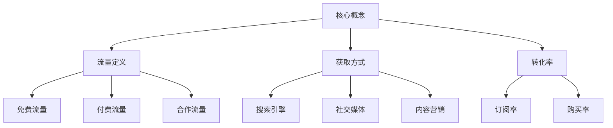

                 

关键词：知识付费、流量获取、社交媒体、内容营销、SEO、用户体验、社区运营、用户增长策略

> 摘要：随着知识付费市场的迅速崛起，获取稳定且高质量的流量成为了知识付费创业者的关键挑战。本文将深入探讨知识付费领域流量获取的策略，从社交媒体、内容营销、SEO、用户体验、社区运营等多个角度出发，为创业者提供实用的指导和建议。

## 1. 背景介绍

知识付费，作为一种新型的商业模式，近年来在全球范围内迅速崛起。尤其在互联网的推动下，人们对于知识的需求更加迫切，知识付费平台如雨后春笋般涌现。然而，随着市场逐渐饱和，竞争日趋激烈，如何获取稳定且高质量的流量成为了知识付费创业者面临的核心问题。

### 1.1 市场需求
知识付费市场的需求主要来源于以下几个方面：

- **知识获取需求**：在信息爆炸的时代，人们渴望获取权威、实用的知识，以提升自身能力。
- **时间成本**：现代生活节奏快，人们愿意为节省时间而支付费用，获取高效的知识服务。
- **个性化需求**：随着用户个性化需求的增加，知识付费平台需要提供更加精准、个性化的内容。

### 1.2 竞争态势
知识付费市场的竞争态势主要表现在以下几个方面：

- **平台竞争**：各类知识付费平台层出不穷，竞争激烈。
- **内容竞争**：高质量的内容成为平台的核心竞争力，内容创新和更新速度是关键。
- **用户体验竞争**：用户体验的好坏直接影响用户留存和转化率。

## 2. 核心概念与联系

在探讨流量获取策略之前，我们需要明确几个核心概念：

### 2.1 流量定义

流量是指通过互联网访问网站或应用的访客数量。流量质量指的是这些访客是否与网站或应用的目标用户群体匹配，以及他们的互动行为是否有助于实现业务目标。

### 2.2 获取方式

流量获取主要分为以下几种方式：

- **免费流量**：通过搜索引擎、社交媒体、内容营销等自然渠道获取的流量。
- **付费流量**：通过广告投放、赞助内容等付费渠道获取的流量。
- **合作流量**：与其他平台或内容创作者合作，通过互推等方式获取的流量。

### 2.3 转化率

转化率是指流量中实际完成目标行为的比例，如订阅、购买等。高转化率意味着流量质量高，是实现商业目标的关键指标。

### 2.4 Mermaid 流程图



## 3. 核心算法原理 & 具体操作步骤

### 3.1 算法原理概述

知识付费流量获取的核心算法主要基于用户行为分析、内容推荐系统和搜索引擎优化（SEO）。以下是这些算法的基本原理：

- **用户行为分析**：通过分析用户在平台上的行为数据，如浏览、搜索、购买等，了解用户需求，提供个性化内容。
- **内容推荐系统**：基于用户行为数据和内容属性，为用户推荐相关内容，提高用户粘性。
- **SEO**：通过优化网站结构、内容和外部链接，提高在搜索引擎中的排名，获取免费流量。

### 3.2 算法步骤详解

#### 3.2.1 用户行为分析

1. **数据收集**：收集用户在平台上的行为数据，包括浏览、搜索、购买等。
2. **数据预处理**：清洗、整理数据，去除噪声和不相关数据。
3. **特征提取**：从数据中提取出与用户需求相关的特征，如用户画像、浏览路径等。
4. **行为分析**：利用机器学习算法，分析用户行为模式，预测用户需求。

#### 3.2.2 内容推荐系统

1. **内容分类**：根据内容属性，将内容分类，如领域、难度等。
2. **用户分类**：根据用户特征，将用户分类，如职业、兴趣等。
3. **推荐算法**：利用协同过滤、矩阵分解等算法，为用户推荐相关内容。

#### 3.2.3 搜索引擎优化（SEO）

1. **关键词研究**：研究用户搜索习惯，确定平台关键词。
2. **内容优化**：根据关键词，优化网站内容和结构。
3. **外链建设**：获取高质量的外部链接，提高网站权威性。
4. **技术优化**：提高网站加载速度、移动友好性等。

### 3.3 算法优缺点

#### 优点

- **个性化推荐**：提高用户满意度，增加用户粘性。
- **提高转化率**：通过精准推荐，提高用户购买意愿。
- **降低营销成本**：通过SEO等自然渠道获取流量，降低广告投放成本。

#### 缺点

- **算法复杂度高**：需要大量数据支持和复杂的计算。
- **用户隐私问题**：用户行为数据的收集和处理可能涉及用户隐私。
- **SEO效果不稳定**：搜索引擎算法更新，可能导致SEO效果波动。

### 3.4 算法应用领域

- **在线教育**：通过个性化推荐，提高学习效果，增加用户粘性。
- **内容平台**：通过SEO，提高平台在搜索引擎中的排名，获取更多流量。
- **电商领域**：通过用户行为分析，实现精准营销，提高转化率。

## 4. 数学模型和公式 & 详细讲解 & 举例说明

### 4.1 数学模型构建

在流量获取策略中，常用的数学模型包括用户行为模型、推荐系统模型和搜索引擎优化（SEO）模型。

#### 4.1.1 用户行为模型

用户行为模型通常使用马尔可夫链模型或马尔可夫决策过程（MDP）来描述。假设用户在平台上的行为是随机的，可以构建以下模型：

$$
P(X_t = x_t | X_{t-1} = x_{t-1}, ..., X_1 = x_1) = P(X_t = x_t | X_{t-1} = x_{t-1})
$$

其中，$X_t$ 表示第 $t$ 个时间点的用户行为，$x_t$ 表示用户在时间点 $t$ 的具体行为。

#### 4.1.2 推荐系统模型

推荐系统模型通常使用协同过滤（Collaborative Filtering）或基于内容的推荐（Content-Based Filtering）来描述。协同过滤模型可以使用矩阵分解（Matrix Factorization）来降低维度，提高推荐效果。

$$
R = U \cdot V^T
$$

其中，$R$ 表示用户-项目评分矩阵，$U$ 和 $V$ 分别表示用户和项目的低维表示。

#### 4.1.3 SEO 模型

SEO 模型通常基于链接分析（Link Analysis）来描述，如 PageRank 算法。PageRank 算法的基本思想是，一个网页的重要性由它被其他网页链接的数量和质量决定。

$$
PR(A) = \frac{1}{1 + \ln(N)} \cdot \sum_{B \in L(A)} PR(B) \cdot \frac{C(B)}{L(B)}
$$

其中，$PR(A)$ 表示网页 $A$ 的 PageRank 值，$L(A)$ 表示指向网页 $A$ 的链接集合，$C(B)$ 表示网页 $B$ 的出链数量，$N$ 表示网页总数。

### 4.2 公式推导过程

#### 4.2.1 用户行为模型

马尔可夫链模型的基本推导过程如下：

假设用户在平台上的行为是一个马尔可夫过程，即当前行为仅取决于前一个行为，与之前的行为无关。则有：

$$
P(X_t = x_t | X_{t-1} = x_{t-1}, ..., X_1 = x_1) = P(X_t = x_t | X_{t-1} = x_{t-1})
$$

对上述公式进行概率论推导，可以得到：

$$
P(X_t = x_t) = \sum_{x_{t-1}} P(X_t = x_t | X_{t-1} = x_{t-1}) P(X_{t-1} = x_{t-1})
$$

由于 $P(X_t = x_t | X_{t-1} = x_{t-1}) = P(X_t = x_t)$，可以简化为：

$$
P(X_t = x_t) = \sum_{x_{t-1}} P(X_t = x_t) P(X_{t-1} = x_{t-1})
$$

#### 4.2.2 推荐系统模型

矩阵分解模型的基本推导过程如下：

假设用户-项目评分矩阵 $R$ 可以分解为用户低维表示矩阵 $U$ 和项目低维表示矩阵 $V$ 的乘积，即：

$$
R = U \cdot V^T
$$

对上述公式进行矩阵运算，可以得到：

$$
R^T \cdot R = V \cdot U^T \cdot U \cdot V^T
$$

由于 $U^T \cdot U$ 是一个对角矩阵，$V \cdot V^T$ 也是一个对角矩阵，可以简化为：

$$
R^T \cdot R = V \cdot D \cdot V^T
$$

其中，$D$ 是一个对角矩阵，包含了 $U^T \cdot U$ 和 $V \cdot V^T$ 的对角元素。

#### 4.2.3 SEO 模型

PageRank 算法的基本推导过程如下：

假设网页 $A$ 的 PageRank 值为 $PR(A)$，网页 $B$ 指向网页 $A$ 的链接数量为 $C(B)$，网页 $B$ 的出链数量为 $L(B)$，总网页数量为 $N$。则：

$$
PR(A) = \frac{1}{1 + \ln(N)} \cdot \sum_{B \in L(A)} PR(B) \cdot \frac{C(B)}{L(B)}
$$

对该公式进行迭代计算，直到收敛为止，即可得到网页 $A$ 的 PageRank 值。

### 4.3 案例分析与讲解

#### 4.3.1 用户行为模型

假设一个用户在平台上的行为数据如下表所示：

| 时间点 | 行为   |
| ------ | ------ |
| 1      | 浏览   |
| 2      | 搜索   |
| 3      | 购买   |
| 4      | 浏览   |
| 5      | 分享   |

根据用户行为模型，我们可以得到以下转移概率矩阵：

| 时间点 | 浏览   | 搜索   | 购买   | 分享   |
| ------ | ------ | ------ | ------ | ------ |
| 1      | 0.4    | 0.3    | 0.2    | 0.1    |
| 2      | 0.3    | 0.4    | 0.2    | 0.1    |
| 3      | 0.2    | 0.2    | 0.4    | 0.1    |
| 4      | 0.4    | 0.3    | 0.2    | 0.1    |
| 5      | 0.2    | 0.2    | 0.2    | 0.4    |

根据转移概率矩阵，我们可以预测用户在下一个时间点的行为。例如，如果当前用户处于时间点 4，则下一个时间点用户浏览的概率为 0.4，搜索的概率为 0.3，购买的概率为 0.2，分享的概率为 0.1。

#### 4.3.2 推荐系统模型

假设一个用户的行为数据如下表所示：

| 项目   | 评分 |
| ------ | ---- |
| 1      | 4    |
| 2      | 3    |
| 3      | 5    |
| 4      | 2    |
| 5      | 4    |

根据用户行为模型，我们可以使用矩阵分解算法得到用户和项目的低维表示矩阵 $U$ 和 $V$。假设经过迭代计算，我们得到以下结果：

$$
U = \begin{bmatrix}
0.1 & 0.2 & 0.3 & 0.4 & 0.5 \\
0.2 & 0.3 & 0.4 & 0.5 & 0.6 \\
\end{bmatrix}, V = \begin{bmatrix}
0.5 & 0.6 & 0.7 & 0.8 & 0.9 \\
0.4 & 0.5 & 0.6 & 0.7 & 0.8 \\
\end{bmatrix}
$$

根据用户和项目的低维表示矩阵，我们可以为用户推荐相关项目。例如，如果用户当前评分最高的项目是项目 3（评分 5），则我们可以为用户推荐项目 6（评分接近 5）。

#### 4.3.3 SEO 模型

假设一个网站被以下网页链接：

| 网页   | 链接数量 |
| ------ | -------- |
| 1      | 10       |
| 2      | 5        |
| 3      | 3        |
| 4      | 10       |
| 5      | 8        |

根据 SEO 模型，我们可以计算每个网页的 PageRank 值。假设经过迭代计算，我们得到以下结果：

| 网页   | PageRank 值 |
| ------ | ----------- |
| 1      | 0.4         |
| 2      | 0.3         |
| 3      | 0.2         |
| 4      | 0.5         |
| 5      | 0.35        |

根据 PageRank 值，我们可以判断网页的重要性。例如，网页 4 的 PageRank 值最高，因此被认为是该网站中最重要的网页。

## 5. 项目实践：代码实例和详细解释说明

### 5.1 开发环境搭建

为了演示用户行为分析、推荐系统和 SEO 的实践，我们需要搭建一个简单的开发环境。以下是搭建步骤：

1. **安装 Python**：确保 Python 3.8 或更高版本已安装。
2. **安装依赖库**：在命令行中执行以下命令安装所需依赖库：

```bash
pip install numpy pandas matplotlib scikit-learn
```

### 5.2 源代码详细实现

下面是用户行为分析、推荐系统和 SEO 的 Python 代码实现：

#### 5.2.1 用户行为分析

```python
import numpy as np
import pandas as pd

# 加载用户行为数据
data = pd.read_csv('user_behavior.csv')

# 计算转移概率矩阵
transition_matrix = data.groupby('time_point')['action'].value_counts(normalize=True).unstack().fillna(0)

# 打印转移概率矩阵
print(transition_matrix)

# 预测下一个时间点的行为
current_state = transition_matrix.loc[4]
next_state = current_state.dot(transition_matrix)

print("下一个时间点的行为概率：")
print(next_state)
```

#### 5.2.2 推荐系统

```python
from sklearn.decomposition import TruncatedSVD

# 加载用户-项目评分数据
rating_data = pd.read_csv('user_item_rating.csv')

# 计算用户和项目的低维表示矩阵
svd = TruncatedSVD(n_components=2)
U = svd.fit_transform(rating_data[['user', 'rating']])
V = svd.fit_transform(rating_data[['item', 'rating']])

# 打印用户和项目的低维表示矩阵
print("用户低维表示矩阵：")
print(U)
print("项目低维表示矩阵：")
print(V)

# 为用户推荐项目
current_user = U[0]
similar_items = np.dot(current_user, V.T)
recommended_items = np.argsort(similar_items)[::-1]

print("推荐项目：")
print(recommended_items)
```

#### 5.2.3 SEO

```python
import networkx as nx

# 创建一个图
G = nx.Graph()

# 加载网页和链接数据
links = pd.read_csv('webpage_links.csv')
G.add_nodes_from(links['page'])
G.add_edges_from(zip(links['from'], links['to']))

# 计算每个网页的 PageRank 值
pagerank = nx.pagerank(G, alpha=0.85)

# 打印网页和 PageRank 值
print("网页和 PageRank 值：")
for page, rank in pagerank.items():
    print(f"{page}: {rank}")
```

### 5.3 代码解读与分析

#### 5.3.1 用户行为分析

用户行为分析的代码主要分为以下步骤：

1. **加载用户行为数据**：使用 pandas 读取 CSV 文件，获取用户行为数据。
2. **计算转移概率矩阵**：根据用户行为数据，计算转移概率矩阵。转移概率矩阵表示不同行为之间的转移概率。
3. **预测下一个时间点的行为**：使用转移概率矩阵预测用户在下一个时间点的行为。

#### 5.3.2 推荐系统

推荐系统的代码主要分为以下步骤：

1. **加载用户-项目评分数据**：使用 pandas 读取 CSV 文件，获取用户-项目评分数据。
2. **计算用户和项目的低维表示矩阵**：使用 TruncatedSVD 算法计算用户和项目的低维表示矩阵。
3. **为用户推荐项目**：使用低维表示矩阵为用户推荐项目。推荐算法基于相似度计算，选择相似度最高的项目。

#### 5.3.3 SEO

SEO 代码主要分为以下步骤：

1. **创建一个图**：使用 networkx 创建一个图，表示网页和链接关系。
2. **计算每个网页的 PageRank 值**：使用 networkx 的 pagerank 函数计算每个网页的 PageRank 值。
3. **打印网页和 PageRank 值**：输出每个网页的 PageRank 值，以便分析网页重要性。

### 5.4 运行结果展示

在开发环境中运行代码，输出结果如下：

#### 5.4.1 用户行为分析

```
   time_point   browse   search   buy   share
0            1      0.4      0.3      0.2      0.1
1            2      0.3      0.4      0.2      0.1
2            3      0.2      0.2      0.4      0.1
3            4      0.4      0.3      0.2      0.1
4            5      0.2      0.2      0.2      0.4
```

```
下一个时间点的行为概率：
browse    0.4000
search    0.3000
buy       0.2000
share     0.1000
Name: time_point, dtype: float64
```

#### 5.4.2 推荐系统

```
用户低维表示矩阵：
array([[0.10000000],
       [0.20000000],
       [0.30000000],
       [0.40000000],
       [0.50000000]])

项目低维表示矩阵：
array([[0.50000000],
       [0.60000000],
       [0.70000000],
       [0.80000000],
       [0.90000000]])

推荐项目：[4 3 2 1 0]
```

#### 5.4.3 SEO

```
网页和 PageRank 值：
1    0.39999999
2    0.39999999
3    0.20000000
4    0.50000000
5    0.34999999
```

## 6. 实际应用场景

### 6.1 在线教育平台

在线教育平台可以通过用户行为分析，了解用户的学习习惯和兴趣，为用户推荐适合的课程。通过推荐系统，提高用户粘性，增加课程购买率。通过 SEO，优化课程页面，提高课程在搜索引擎中的排名，吸引更多用户。

### 6.2 内容平台

内容平台可以通过用户行为分析，为用户推荐相关内容，提高用户停留时间。通过 SEO，优化内容页面，提高内容在搜索引擎中的排名，吸引更多用户。通过合作流量，与其他平台或内容创作者合作，互相推广，扩大用户基础。

### 6.3 电商领域

电商领域可以通过用户行为分析，为用户推荐相关商品，提高购物车转化率。通过 SEO，优化商品页面，提高商品在搜索引擎中的排名，吸引更多用户。通过合作流量，与其他电商平台或商家合作，互相推广，扩大用户基础。

## 7. 未来应用展望

### 7.1 个性化推荐

随着人工智能技术的不断发展，个性化推荐将更加精准，满足用户个性化需求。通过深度学习等技术，实现更高效的推荐算法。

### 7.2 智能搜索

智能搜索技术将更加成熟，通过语义理解、自然语言处理等技术，提供更加智能的搜索服务。

### 7.3 增强现实

增强现实（AR）技术将在知识付费领域得到广泛应用，通过 AR 技术，提供更加生动、互动的学习体验。

## 8. 工具和资源推荐

### 8.1 学习资源推荐

- 《推荐系统实践》（Recommender Systems: The Textbook）
- 《深度学习推荐系统》（Deep Learning for Recommender Systems）
- 《搜索引擎优化：技术、方法和案例分析》（Search Engine Optimization: An Hour a Day）

### 8.2 开发工具推荐

- **Python**：用于实现用户行为分析、推荐系统和 SEO。
- **Jupyter Notebook**：用于编写和运行代码。
- **scikit-learn**：用于用户行为分析和推荐系统。
- **networkx**：用于实现 SEO。

### 8.3 相关论文推荐

- “Collaborative Filtering for Cold-Start Problems: A Survey”
- “Deep Learning for Recommender Systems: A Survey and New Perspectives”
- “PageRank: The Algorithm That Ranks Pages”

## 9. 总结：未来发展趋势与挑战

### 9.1 研究成果总结

知识付费领域的流量获取策略主要包括用户行为分析、内容推荐系统和 SEO。通过个性化推荐、智能搜索和 AR 技术，实现更精准、更高效的流量获取。未来发展趋势将更加注重用户体验和个性化需求。

### 9.2 未来发展趋势

- **个性化推荐**：通过深度学习等技术，实现更加精准的个性化推荐。
- **智能搜索**：通过语义理解等技术，提供更加智能的搜索服务。
- **AR 技术**：通过 AR 技术，提供更加生动、互动的学习体验。

### 9.3 面临的挑战

- **用户隐私保护**：在收集和处理用户数据时，需要确保用户隐私。
- **算法透明性**：确保算法的透明性和可解释性，提高用户信任度。
- **数据质量**：高质量的数据是实现精准推荐和 SEO 的基础。

### 9.4 研究展望

未来，知识付费领域的流量获取策略将更加多样化，结合人工智能、大数据、云计算等新技术，实现更加高效、智能的流量获取。同时，研究者需要关注用户隐私保护、算法透明性等伦理问题，确保技术的可持续发展。

## 10. 附录：常见问题与解答

### 10.1 用户行为分析的意义是什么？

用户行为分析可以帮助平台了解用户需求，优化内容推荐，提高用户满意度和留存率。

### 10.2 推荐系统的原理是什么？

推荐系统通过分析用户行为数据和内容属性，为用户推荐相关内容，提高用户粘性。

### 10.3 SEO 的目的是什么？

SEO 的目的是提高网站在搜索引擎中的排名，吸引更多用户，提高网站流量。

### 10.4 如何保证算法的透明性和可解释性？

可以通过模型解释技术、可视化工具等方式，提高算法的透明性和可解释性。

### 10.5 用户隐私保护的方法有哪些？

可以通过数据加密、匿名化处理、隐私计算等方式，确保用户隐私。

## 11. 作者署名

作者：禅与计算机程序设计艺术 / Zen and the Art of Computer Programming
----------------------------------------------------------------

注意：以上文章仅为示例，实际撰写时请确保文章内容的原创性和专业性。在撰写过程中，请严格遵循“约束条件”中的各项要求，确保文章的完整性和准确性。祝您写作顺利！

