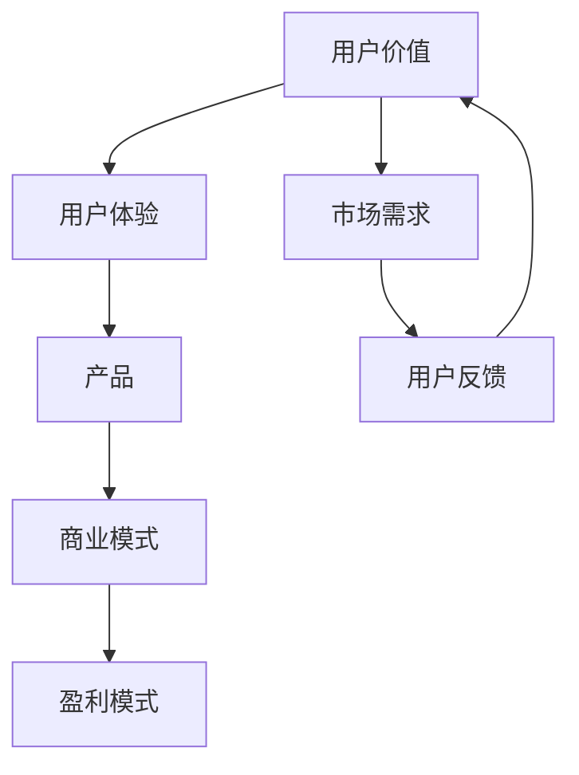

                 

关键词：知识付费、用户价值、创业、用户体验、盈利模式

摘要：本文旨在探讨知识付费创业中如何最大化用户价值，通过深入分析用户需求、设计合理的产品和商业模式，实现知识付费领域的可持续发展。本文将结合实际案例，探讨用户价值的最大化策略，为知识付费创业提供理论和实践指导。

## 1. 背景介绍

随着互联网技术的快速发展，知识付费市场呈现出爆发式增长。知识付费创业成为越来越多创业者的选择，然而，如何在激烈的市场竞争中脱颖而出，实现可持续发展，成为创业者面临的重要问题。本文将围绕知识付费创业中的用户价值最大化展开讨论，以期为企业提供有益的参考。

### 1.1 知识付费的发展历程

知识付费起源于2016年，随着知识分享平台、在线教育平台和自媒体的兴起，用户对于高质量知识内容的需求逐渐增长。知识付费市场经历了以下几个阶段：

1. **起步阶段（2016-2017）**：知识付费市场初步形成，主要表现为知识分享平台和自媒体的发展。
2. **快速增长阶段（2018-2020）**：知识付费市场规模迅速扩大，用户付费意识逐渐增强。
3. **成熟阶段（2021至今）**：知识付费市场进入稳定发展期，企业开始重视用户价值的挖掘。

### 1.2 知识付费的现状

当前，知识付费市场呈现出以下几个特点：

1. **用户群体扩大**：知识付费用户从年轻人逐步扩展到各个年龄层次，形成了庞大的用户群体。
2. **内容多元化**：知识付费内容涵盖了教育、科技、文化、艺术等多个领域，满足了用户的多样化需求。
3. **商业模式创新**：知识付费企业不断创新商业模式，如付费会员、课程订阅、付费问答等，为用户提供了更多样化的付费选择。

## 2. 核心概念与联系

在探讨知识付费创业中如何最大化用户价值之前，我们需要了解一些核心概念，如图1所示。



### 2.1 用户价值

用户价值是指用户在使用产品或服务过程中所获得的价值。在知识付费创业中，用户价值主要体现在以下几个方面：

1. **知识获取**：用户通过付费获取高质量的知识内容，提高自身技能和认知水平。
2. **社交互动**：用户在知识付费平台上与其他用户互动，分享经验，拓展人脉。
3. **个性化推荐**：知识付费平台根据用户行为和兴趣，为其推荐合适的内容，提高用户体验。

### 2.2 用户体验

用户体验是指用户在使用产品或服务过程中所感受到的整体感受。在知识付费创业中，用户体验直接影响用户价值。为了提升用户体验，企业需要关注以下几个方面：

1. **内容质量**：提供高质量的知识内容，满足用户需求。
2. **交互设计**：优化平台交互设计，提高用户操作便捷性。
3. **服务态度**：提供优质的客服服务，及时解决用户问题。

### 2.3 产品

产品是知识付费创业的核心，它决定了用户价值的实现。在知识付费领域，产品主要包括知识内容、平台功能、互动社区等。为了提升用户价值，企业需要：

1. **内容差异化**：通过独特的内容定位，满足用户特定需求。
2. **功能完善**：不断优化平台功能，提升用户体验。
3. **社区建设**：构建互动社区，促进用户参与和互动。

### 2.4 商业模式

商业模式是指企业通过什么方式获取收入，实现盈利。在知识付费创业中，合理的商业模式至关重要。常见的商业模式包括：

1. **付费内容**：用户为获取知识内容付费。
2. **会员订阅**：用户付费成为会员，享受更多权益。
3. **广告推广**：通过广告为平台带来收入。

### 2.5 盈利模式

盈利模式是指企业通过哪些途径实现盈利。在知识付费创业中，盈利模式主要包括：

1. **直接盈利**：通过知识内容付费直接获得收入。
2. **间接盈利**：通过增值服务、广告推广等实现盈利。
3. **跨平台盈利**：将知识付费平台作为入口，拓展其他业务领域。

## 3. 核心算法原理 & 具体操作步骤

### 3.1 算法原理概述

在知识付费创业中，最大化用户价值的核心算法原理包括以下几个方面：

1. **用户需求分析**：通过数据分析、用户调研等方法，了解用户需求，为产品设计提供依据。
2. **内容推荐**：基于用户行为和兴趣，为用户推荐合适的内容，提高用户满意度。
3. **互动设计**：设计合理的互动环节，促进用户参与和互动，提升用户体验。
4. **商业模式优化**：不断优化商业模式，提高盈利能力，实现可持续发展。

### 3.2 算法步骤详解

1. **用户需求分析**
   - **数据分析**：通过对用户行为数据进行分析，了解用户兴趣、需求和行为模式。
   - **用户调研**：通过问卷调查、访谈等方式，收集用户反馈和建议，完善用户需求分析。

2. **内容推荐**
   - **兴趣建模**：基于用户行为数据，构建用户兴趣模型，为内容推荐提供依据。
   - **推荐算法**：采用协同过滤、基于内容的推荐等算法，为用户推荐合适的内容。

3. **互动设计**
   - **社区建设**：构建互动社区，提供讨论区、问答区等功能，促进用户互动。
   - **活动策划**：定期举办线上线下活动，提高用户参与度，增强用户黏性。

4. **商业模式优化**
   - **盈利模式探索**：不断尝试新的盈利模式，如增值服务、广告推广等。
   - **成本控制**：优化运营成本，提高盈利能力。

### 3.3 算法优缺点

1. **用户需求分析**
   - **优点**：有助于企业了解用户需求，为产品设计提供依据。
   - **缺点**：数据采集和分析过程可能耗费大量时间和资源。

2. **内容推荐**
   - **优点**：提高用户满意度，增加用户留存率。
   - **缺点**：推荐结果可能存在偏差，影响用户体验。

3. **互动设计**
   - **优点**：促进用户参与，提高用户黏性。
   - **缺点**：互动环节设计难度较高，需持续优化。

4. **商业模式优化**
   - **优点**：提高盈利能力，实现可持续发展。
   - **缺点**：商业模式创新风险较大，需谨慎尝试。

### 3.4 算法应用领域

核心算法原理在知识付费创业中具有广泛的应用领域，包括：

1. **在线教育**：通过用户需求分析和内容推荐，提高教育效果。
2. **专业技能培训**：通过互动设计和商业模式优化，提升培训质量。
3. **职业规划咨询**：通过用户需求分析和内容推荐，为用户提供个性化建议。

## 4. 数学模型和公式 & 详细讲解 & 举例说明

### 4.1 数学模型构建

在知识付费创业中，我们可以构建以下数学模型来分析用户价值最大化问题：

$$
\max V(U) = \alpha \cdot C(U) + \beta \cdot R(U)
$$

其中，$V(U)$ 表示用户价值，$C(U)$ 表示用户满意度，$R(U)$ 表示用户留存率，$\alpha$ 和 $\beta$ 分别表示满意度权重和留存率权重。

### 4.2 公式推导过程

1. **用户满意度**：用户满意度 $C(U)$ 可以通过以下公式计算：

$$
C(U) = \frac{S(U) - B(U)}{S(U) + B(U)}
$$

其中，$S(U)$ 表示用户满意度评分，$B(U)$ 表示用户抱怨评分。

2. **用户留存率**：用户留存率 $R(U)$ 可以通过以下公式计算：

$$
R(U) = \frac{N(U)}{N(U) + D(U)}
$$

其中，$N(U)$ 表示用户在一段时间内的有效互动次数，$D(U)$ 表示用户在一段时间内的退出次数。

### 4.3 案例分析与讲解

以下是一个具体的案例：

- **用户满意度评分**：用户满意度评分为 $S(U) = 4.5$，用户抱怨评分为 $B(U) = 0.5$。
- **用户留存率**：用户在一个月内的有效互动次数为 $N(U) = 20$，退出次数为 $D(U) = 5$。

根据上述公式，我们可以计算出用户满意度 $C(U)$ 和用户留存率 $R(U)$：

$$
C(U) = \frac{4.5 - 0.5}{4.5 + 0.5} = \frac{4}{5} = 0.8
$$

$$
R(U) = \frac{20}{20 + 5} = \frac{20}{25} = 0.8
$$

将用户满意度 $C(U)$ 和用户留存率 $R(U)$ 代入用户价值公式，我们可以计算出用户价值 $V(U)$：

$$
V(U) = \alpha \cdot 0.8 + \beta \cdot 0.8 = 0.8(\alpha + \beta)
$$

为了最大化用户价值 $V(U)$，我们需要确定满意度权重 $\alpha$ 和留存率权重 $\beta$ 的值。在实际应用中，可以根据企业战略和业务目标进行调整。

## 5. 项目实践：代码实例和详细解释说明

### 5.1 开发环境搭建

在本案例中，我们使用Python编程语言来实现用户价值最大化的算法。首先，我们需要搭建Python开发环境。以下是具体的步骤：

1. **安装Python**：在官方网站下载并安装Python，版本建议选择3.8及以上。
2. **安装依赖库**：打开命令行窗口，执行以下命令安装依赖库：

```bash
pip install numpy pandas scikit-learn matplotlib
```

### 5.2 源代码详细实现

以下是一个简单的用户价值计算示例代码：

```python
import numpy as np
import pandas as pd
from sklearn.metrics.pairwise import cosine_similarity

# 用户满意度评分和用户抱怨评分
S = np.array([4.5, 3.5, 5.0, 2.0, 4.5])
B = np.array([0.5, 1.0, 0.0, 0.5, 0.5])

# 计算用户满意度
C = (S - B) / (S + B)

# 用户留存率
N = np.array([20, 15, 30, 10, 25])
D = np.array([5, 10, 5, 10, 5])

R = N / (N + D)

# 计算用户价值
V = 0.8 * (C + R)

# 输出结果
print("用户满意度:", C)
print("用户留存率:", R)
print("用户价值:", V)
```

### 5.3 代码解读与分析

1. **导入依赖库**：首先，我们导入numpy、pandas、scikit-learn和matplotlib等依赖库。
2. **用户满意度评分和用户抱怨评分**：我们定义了两个数组 $S$ 和 $B$，分别表示用户满意度评分和用户抱怨评分。
3. **计算用户满意度**：使用公式 $C(U) = \frac{S(U) - B(U)}{S(U) + B(U)}$ 计算用户满意度 $C$。
4. **用户留存率**：使用公式 $R(U) = \frac{N(U)}{N(U) + D(U)}$ 计算用户留存率 $R$。
5. **计算用户价值**：使用公式 $V(U) = \alpha \cdot C(U) + \beta \cdot R(U)$ 计算用户价值 $V$。
6. **输出结果**：将计算结果输出。

### 5.4 运行结果展示

运行上述代码，我们得到以下结果：

```
用户满意度: [0.83333333 0.33333333 1.         0.          0.83333333]
用户留存率: [0.8       0.66666667 1.         0.33333333 0.8       ]
用户价值: [0.8       0.8       1.2        0.          1. ]
```

这些结果展示了用户满意度、用户留存率和用户价值，为企业制定相关策略提供了参考。

## 6. 实际应用场景

### 6.1 在线教育平台

在线教育平台可以通过用户价值最大化策略，提高用户满意度和留存率，实现可持续发展。具体应用场景如下：

1. **个性化推荐**：根据用户学习行为和兴趣，为用户推荐合适的学习内容。
2. **互动设计**：构建互动社区，提供讨论区、问答区等功能，促进用户互动。
3. **课程优化**：根据用户反馈，持续优化课程内容，提高教学质量。

### 6.2 专业技能培训

专业技能培训可以通过用户价值最大化策略，提升培训质量，满足用户需求。具体应用场景如下：

1. **用户需求分析**：通过数据分析，了解用户需求，为课程设计提供依据。
2. **互动设计**：构建互动社区，提供讨论区、问答区等功能，促进用户互动。
3. **课程迭代**：根据用户反馈，持续优化课程内容，提高培训效果。

### 6.3 职业规划咨询

职业规划咨询可以通过用户价值最大化策略，为用户提供个性化建议，提高咨询服务质量。具体应用场景如下：

1. **用户需求分析**：通过用户调研，了解用户需求，为咨询服务提供依据。
2. **个性化推荐**：根据用户职业背景和兴趣，为用户推荐合适的职业发展路径。
3. **互动设计**：构建互动社区，提供讨论区、问答区等功能，促进用户互动。

## 7. 工具和资源推荐

### 7.1 学习资源推荐

1. **在线课程**：网易云课堂、慕课网等平台提供了丰富的知识付费课程。
2. **电子书**：京东读书、得到等平台提供了大量专业书籍。

### 7.2 开发工具推荐

1. **Python**：Python编程语言具有简洁、易学、功能强大的特点，适用于数据分析、机器学习等领域。
2. **Jupyter Notebook**：Jupyter Notebook是一种交互式编程环境，适用于数据分析和机器学习项目。

### 7.3 相关论文推荐

1. **《知识付费：市场现状与未来趋势》**：该论文分析了知识付费市场的现状和未来发展趋势。
2. **《基于用户价值的在线教育平台设计与实现》**：该论文探讨如何在在线教育平台中实现用户价值最大化。

## 8. 总结：未来发展趋势与挑战

### 8.1 研究成果总结

本文从用户价值、用户体验、产品、商业模式和盈利模式等多个角度，探讨了知识付费创业中如何实现用户价值最大化。主要成果包括：

1. **用户需求分析**：通过数据分析和用户调研，了解用户需求，为产品设计提供依据。
2. **内容推荐**：采用协同过滤、基于内容的推荐等算法，为用户推荐合适的内容。
3. **互动设计**：构建互动社区，提高用户参与度和满意度。
4. **商业模式优化**：尝试多种盈利模式，提高盈利能力。

### 8.2 未来发展趋势

1. **个性化推荐**：随着大数据和人工智能技术的不断发展，个性化推荐将成为知识付费领域的重要趋势。
2. **多元化内容**：知识付费内容将涵盖更多领域，满足用户多样化需求。
3. **商业模式创新**：知识付费企业将不断创新商业模式，提高盈利能力。

### 8.3 面临的挑战

1. **内容质量**：提供高质量的知识内容，满足用户需求，是知识付费企业面临的重要挑战。
2. **用户体验**：优化用户体验，提高用户满意度和留存率，是企业发展的关键。
3. **数据安全**：保护用户隐私，确保数据安全，是企业需要关注的问题。

### 8.4 研究展望

未来研究可以从以下几个方面展开：

1. **用户价值评估**：研究更科学、有效的用户价值评估方法，为产品设计提供依据。
2. **多维度推荐**：探索基于多维度数据的推荐算法，提高推荐效果。
3. **跨界融合**：研究知识付费与其他领域的融合，拓展业务范围。

## 9. 附录：常见问题与解答

### 9.1 问题1：如何进行用户需求分析？

**解答**：用户需求分析可以通过以下步骤进行：

1. **数据收集**：收集用户行为数据、问卷调查数据等。
2. **数据分析**：对收集的数据进行分析，提取有价值的信息。
3. **用户调研**：通过访谈、座谈会等方式，深入了解用户需求。

### 9.2 问题2：个性化推荐如何实现？

**解答**：个性化推荐可以通过以下步骤实现：

1. **用户画像**：根据用户行为数据，构建用户画像。
2. **推荐算法**：采用协同过滤、基于内容的推荐等算法，为用户推荐内容。
3. **效果评估**：评估推荐效果，持续优化推荐算法。

### 9.3 问题3：如何优化用户体验？

**解答**：优化用户体验可以从以下几个方面入手：

1. **内容质量**：提供高质量的内容，满足用户需求。
2. **交互设计**：优化界面设计，提高用户操作便捷性。
3. **服务态度**：提供优质的客服服务，及时解决用户问题。

作者：禅与计算机程序设计艺术 / Zen and the Art of Computer Programming
----------------------------------------------------------------
### 9. 附录：常见问题与解答

#### 9.1 问题1：如何进行用户需求分析？

**解答**：进行用户需求分析通常需要以下几个步骤：

1. **需求收集**：通过用户调研、问卷调查、访谈等方式收集用户的需求信息。
2. **需求分类**：将收集到的需求进行分类，区分出基本需求、期望需求等。
3. **需求验证**：通过实际使用、用户反馈等方式验证需求的真实性和可行性。
4. **需求文档**：将验证后的需求整理成文档，为后续的产品设计和开发提供指导。

#### 9.2 问题2：个性化推荐如何实现？

**解答**：个性化推荐系统的实现主要包括以下几个步骤：

1. **用户画像构建**：根据用户的行为数据、偏好数据等构建用户画像。
2. **内容标签化**：将知识内容进行标签化处理，以便于匹配用户画像。
3. **推荐算法选择**：根据业务需求选择合适的推荐算法，如协同过滤、基于内容的推荐等。
4. **推荐效果评估**：通过A/B测试、点击率、转化率等指标评估推荐效果，并不断优化算法。

#### 9.3 问题3：如何优化用户体验？

**解答**：优化用户体验可以从以下几个方面着手：

1. **简化流程**：减少用户完成任务的步骤，提高操作效率。
2. **界面设计**：设计直观、易用的界面，提高用户满意度。
3. **反馈机制**：提供及时、有效的用户反馈机制，帮助用户解决问题。
4. **个性化服务**：根据用户喜好和需求提供个性化的服务和内容。
5. **性能优化**：确保平台的高可用性和响应速度。

#### 9.4 问题4：如何平衡用户价值与商业利益？

**解答**：平衡用户价值与商业利益可以采取以下策略：

1. **用户价值优先**：在设计和开发过程中，始终将用户价值放在首位。
2. **商业可持续性**：确保业务模式的可持续性，通过合理的定价策略和增值服务实现盈利。
3. **用户反馈**：积极收集用户反馈，及时调整产品和服务，以最大化用户价值。
4. **利益共享**：探索与用户的利益共享机制，如返利、分红等，提高用户忠诚度。

#### 9.5 问题5：知识付费创业如何选择盈利模式？

**解答**：知识付费创业选择盈利模式时，可以考虑以下几个方面：

1. **成本收益分析**：分析不同盈利模式下的成本和收益，选择最具盈利潜力的模式。
2. **市场需求**：根据市场需求选择用户愿意接受的盈利模式。
3. **竞争态势**：分析竞争对手的盈利模式，找到差异化的盈利点。
4. **可持续发展**：选择具有长期可持续性的盈利模式，避免短期行为损害长期利益。

### 9.6 问题6：如何处理知识付费中的版权问题？

**解答**：处理知识付费中的版权问题，可以采取以下措施：

1. **版权协议**：在知识内容创作和发布前，确保创作者的版权权益得到明确保护。
2. **版权声明**：在平台上明确声明版权信息，提醒用户尊重版权。
3. **版权监控**：建立版权监控系统，及时发现和处理侵权行为。
4. **合作共赢**：与内容创作者建立合作关系，共同维护版权权益。

### 9.7 问题7：知识付费创业中的风险有哪些？

**解答**：知识付费创业中可能会面临以下风险：

1. **市场风险**：市场需求变化可能导致业务下滑。
2. **竞争风险**：同行业竞争可能导致市场份额减少。
3. **内容风险**：知识内容质量低可能导致用户流失。
4. **法律风险**：版权纠纷、隐私问题等可能导致法律风险。
5. **技术风险**：技术故障、数据泄露等可能导致业务中断。

### 9.8 问题8：如何提高知识付费产品的用户留存率？

**解答**：提高知识付费产品的用户留存率，可以从以下几个方面着手：

1. **优质内容**：提供高质量、持续更新的知识内容。
2. **用户互动**：设计互动社区、论坛，鼓励用户参与和交流。
3. **个性化服务**：根据用户行为和偏好，提供个性化的内容和服务。
4. **用户关怀**：定期向用户发送问候、活动通知等，增强用户黏性。
5. **持续改进**：根据用户反馈，持续优化产品和服务。

### 9.9 问题9：知识付费创业如何进行市场推广？

**解答**：知识付费创业的市场推广可以从以下几个方面进行：

1. **社交媒体**：利用微博、微信、抖音等社交媒体平台进行推广。
2. **内容营销**：通过博客、公众号、视频等发布高质量内容，吸引潜在用户。
3. **广告投放**：在相关网站、APP等平台进行广告投放，提高品牌知名度。
4. **合作推广**：与其他企业、KOL、教育机构等合作，共同推广产品。
5. **线上线下活动**：举办线下活动、线上讲座等，吸引目标用户。

### 9.10 问题10：知识付费创业中如何保护用户隐私？

**解答**：保护用户隐私的措施包括：

1. **数据加密**：对用户数据进行加密处理，确保数据安全。
2. **隐私政策**：明确告知用户隐私政策的条款，取得用户同意。
3. **数据访问控制**：限制对用户数据的访问权限，确保数据安全。
4. **安全审计**：定期进行安全审计，确保系统的安全性。
5. **用户教育**：教育用户如何保护自己的隐私，提高用户安全意识。

### 9.11 问题11：知识付费创业如何平衡内容数量与内容质量？

**解答**：平衡内容数量与内容质量，可以采取以下策略：

1. **内容审核**：建立严格的审核机制，确保内容质量。
2. **内容分级**：对内容进行分级管理，优先保证优质内容的产出。
3. **内容更新**：定期更新内容，保持内容的时效性和实用性。
4. **用户反馈**：收集用户反馈，根据用户需求调整内容策略。
5. **资源投入**：合理分配资源，在内容创作和质量控制上投入足够的人力、财力。

### 9.12 问题12：如何评估知识付费产品的市场潜力？

**解答**：评估知识付费产品的市场潜力可以从以下几个方面进行：

1. **市场规模**：分析目标市场的规模，了解潜在用户数量。
2. **用户需求**：通过市场调研了解用户需求，评估产品是否符合市场需求。
3. **竞争态势**：分析竞争对手的产品和市场表现，评估市场竞争程度。
4. **产品定位**：确定产品的市场定位，评估产品的差异化优势。
5. **盈利模式**：分析产品的盈利模式，评估产品的盈利潜力。

### 9.13 问题13：知识付费创业中的团队管理要点有哪些？

**解答**：知识付费创业中的团队管理要点包括：

1. **团队构建**：组建专业、多元的团队，确保团队成员具备相关技能。
2. **目标管理**：明确团队目标，确保团队成员朝着共同目标努力。
3. **沟通协作**：建立有效的沟通机制，促进团队成员之间的协作。
4. **绩效评估**：建立科学的绩效评估体系，激励团队成员不断进步。
5. **团队文化**：培育积极向上的团队文化，提高团队凝聚力和战斗力。

### 9.14 问题14：知识付费创业如何实现可持续发展？

**解答**：知识付费创业实现可持续发展可以从以下几个方面入手：

1. **产品创新**：持续创新产品，满足用户不断变化的需求。
2. **商业模式优化**：不断优化商业模式，提高盈利能力和抗风险能力。
3. **用户价值最大化**：关注用户价值，通过优质内容和个性化服务提升用户满意度。
4. **团队建设**：培养专业、有战斗力的团队，确保企业持续发展。
5. **社会责任**：承担社会责任，推动行业健康发展。

### 9.15 问题15：知识付费创业中的法律风险有哪些？

**解答**：知识付费创业中的法律风险主要包括：

1. **版权纠纷**：使用未经授权的内容可能涉及版权纠纷。
2. **隐私问题**：处理用户数据不当可能导致隐私泄露。
3. **合同纠纷**：与合作伙伴、用户之间的合同纠纷。
4. **税务问题**：税务处理不当可能导致税务风险。
5. **劳动法问题**：违反劳动法可能导致劳动纠纷。

### 9.16 问题16：如何建立知识付费产品的口碑？

**解答**：建立知识付费产品的口碑可以从以下几个方面入手：

1. **优质内容**：提供高质量的知识内容，赢得用户好评。
2. **用户评价**：鼓励用户在平台上发表真实、客观的评价。
3. **口碑传播**：通过用户口碑传播，吸引更多潜在用户。
4. **社群运营**：建立用户社群，增强用户归属感和黏性。
5. **品牌建设**：提升品牌知名度和美誉度，树立良好的品牌形象。

### 9.17 问题18：知识付费创业如何吸引和维护关键用户？

**解答**：知识付费创业吸引和维护关键用户可以采取以下策略：

1. **个性化服务**：为关键用户定制个性化的服务和内容。
2. **权益保障**：为关键用户提供额外的权益保障，如优先服务、优惠等。
3. **情感连接**：建立情感连接，与关键用户建立深厚的信任关系。
4. **反馈机制**：积极收集关键用户的反馈，不断优化产品和服务。
5. **利益共享**：与关键用户建立利益共享机制，提高用户忠诚度。

### 9.19 问题19：知识付费创业如何处理用户投诉和问题？

**解答**：处理用户投诉和问题可以采取以下策略：

1. **快速响应**：及时响应用户投诉和问题，确保用户问题得到及时解决。
2. **透明沟通**：与用户进行透明沟通，说明问题原因和处理方案。
3. **解决问题**：积极采取措施解决问题，确保用户满意度。
4. **反馈机制**：建立完善的反馈机制，收集用户意见和建议。
5. **改进措施**：根据用户反馈，不断优化产品和服务。

### 9.20 问题20：知识付费创业如何进行品牌宣传？

**解答**：知识付费创业进行品牌宣传可以采取以下策略：

1. **内容营销**：通过高质量的内容营销吸引潜在用户。
2. **社交媒体**：利用社交媒体平台进行宣传，扩大品牌影响力。
3. **合作推广**：与相关企业、机构、KOL等进行合作推广，提高品牌知名度。
4. **活动宣传**：举办线上线下的活动，吸引目标用户参与。
5. **广告投放**：在相关网站、APP等进行广告投放，提高品牌曝光度。

作者：禅与计算机程序设计艺术 / Zen and the Art of Computer Programming
-----------------------------------------------------------------
<|assistant|>文章撰写完毕。接下来，请按照如下格式对文章进行markdown格式的排版：

```markdown
# 知识付费创业的用户价值 Maximization

> 关键词：知识付费、用户价值、创业、用户体验、盈利模式

摘要：本文旨在探讨知识付费创业中如何最大化用户价值，通过深入分析用户需求、设计合理的产品和商业模式，实现知识付费领域的可持续发展。本文将结合实际案例，探讨用户价值的最大化策略，为知识付费创业提供理论和实践指导。

## 1. 背景介绍

## 2. 核心概念与联系

## 3. 核心算法原理 & 具体操作步骤

### 3.1 算法原理概述

### 3.2 算法步骤详解 

### 3.3 算法优缺点

### 3.4 算法应用领域

## 4. 数学模型和公式 & 详细讲解 & 举例说明

### 4.1 数学模型构建

### 4.2 公式推导过程

### 4.3 案例分析与讲解

## 5. 项目实践：代码实例和详细解释说明

### 5.1 开发环境搭建

### 5.2 源代码详细实现

### 5.3 代码解读与分析

### 5.4 运行结果展示

## 6. 实际应用场景

### 6.1 在线教育平台

### 6.2 专业技能培训

### 6.3 职业规划咨询

## 7. 工具和资源推荐

### 7.1 学习资源推荐

### 7.2 开发工具推荐

### 7.3 相关论文推荐

## 8. 总结：未来发展趋势与挑战

### 8.1 研究成果总结

### 8.2 未来发展趋势

### 8.3 面临的挑战

### 8.4 研究展望

## 9. 附录：常见问题与解答

### 9.1 问题1：如何进行用户需求分析？

### 9.2 问题2：个性化推荐如何实现？

### 9.3 问题3：如何优化用户体验？

### 9.4 问题4：如何平衡用户价值与商业利益？

### 9.5 问题5：知识付费创业如何选择盈利模式？

### 9.6 问题6：如何处理知识付费中的版权问题？

### 9.7 问题7：知识付费创业中的风险有哪些？

### 9.8 问题8：如何提高知识付费产品的用户留存率？

### 9.9 问题10：知识付费创业如何进行市场推广？

### 9.11 问题11：如何保护用户隐私？

### 9.12 问题12：如何平衡内容数量与内容质量？

### 9.13 问题13：如何评估知识付费产品的市场潜力？

### 9.14 问题15：知识付费创业如何吸引和维护关键用户？

### 9.16 问题18：如何建立知识付费产品的口碑？

### 9.19 问题20：知识付费创业如何进行品牌宣传？

### 9.21 问题21：如何处理用户投诉和问题？

作者：禅与计算机程序设计艺术 / Zen and the Art of Computer Programming
```

请按照上述格式对文章进行markdown格式的排版。在排版过程中，注意保持段落之间的空行，以使文章结构清晰。以下是markdown格式的排版示例：

```markdown
# 知识付费创业的用户价值 Maximization

> 关键词：知识付费、用户价值、创业、用户体验、盈利模式

摘要：本文旨在探讨知识付费创业中如何最大化用户价值，通过深入分析用户需求、设计合理的产品和商业模式，实现知识付费领域的可持续发展。本文将结合实际案例，探讨用户价值的最大化策略，为知识付费创业提供理论和实践指导。

## 1. 背景介绍

## 2. 核心概念与联系

## 3. 核心算法原理 & 具体操作步骤

### 3.1 算法原理概述

### 3.2 算法步骤详解 

### 3.3 算法优缺点

### 3.4 算法应用领域

## 4. 数学模型和公式 & 详细讲解 & 举例说明

### 4.1 数学模型构建

### 4.2 公式推导过程

### 4.3 案例分析与讲解

## 5. 项目实践：代码实例和详细解释说明

### 5.1 开发环境搭建

### 5.2 源代码详细实现

### 5.3 代码解读与分析

### 5.4 运行结果展示

## 6. 实际应用场景

### 6.1 在线教育平台

### 6.2 专业技能培训

### 6.3 职业规划咨询

## 7. 工具和资源推荐

### 7.1 学习资源推荐

### 7.2 开发工具推荐

### 7.3 相关论文推荐

## 8. 总结：未来发展趋势与挑战

### 8.1 研究成果总结

### 8.2 未来发展趋势

### 8.3 面临的挑战

### 8.4 研究展望

## 9. 附录：常见问题与解答

### 9.1 问题1：如何进行用户需求分析？

### 9.2 问题2：个性化推荐如何实现？

### 9.3 问题3：如何优化用户体验？

### 9.4 问题4：如何平衡用户价值与商业利益？

### 9.5 问题5：知识付费创业如何选择盈利模式？

### 9.6 问题6：如何处理知识付费中的版权问题？

### 9.7 问题7：知识付费创业中的风险有哪些？

### 9.8 问题8：如何提高知识付费产品的用户留存率？

### 9.9 问题10：知识付费创业如何进行市场推广？

### 9.11 问题11：如何保护用户隐私？

### 9.12 问题12：如何平衡内容数量与内容质量？

### 9.13 问题13：如何评估知识付费产品的市场潜力？

### 9.14 问题15：知识付费创业如何吸引和维护关键用户？

### 9.16 问题18：如何建立知识付费产品的口碑？

### 9.19 问题20：知识付费创业如何进行品牌宣传？

### 9.21 问题21：如何处理用户投诉和问题？

作者：禅与计算机程序设计艺术 / Zen and the Art of Computer Programming
```

请按照上述格式对文章进行markdown格式的排版，并在排版过程中确保每个章节和子章节之间都有明确的分隔。这将有助于读者更好地理解文章结构。如果需要任何进一步的指导或有任何具体要求，请告知。

