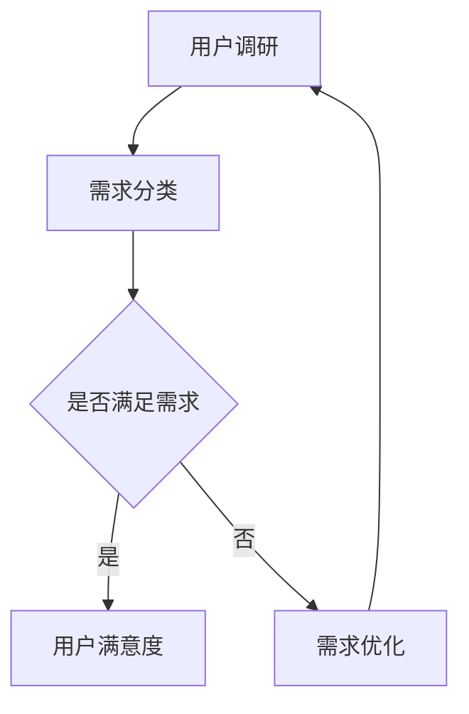
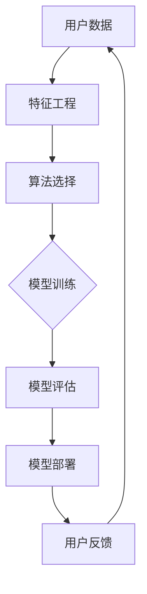
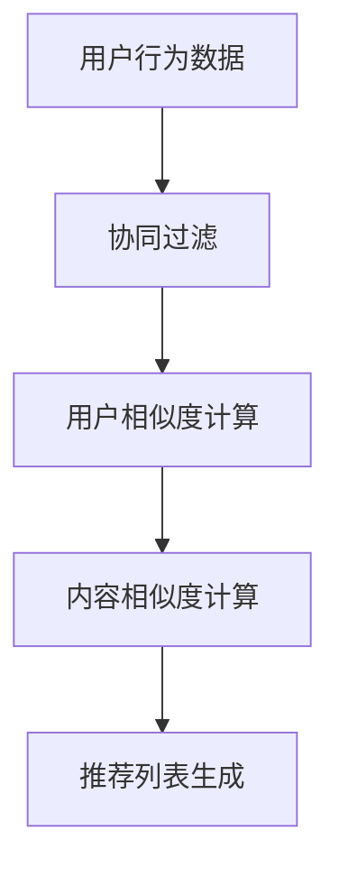
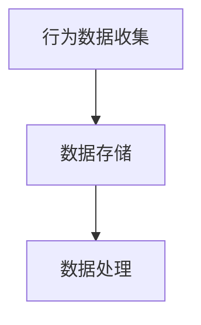
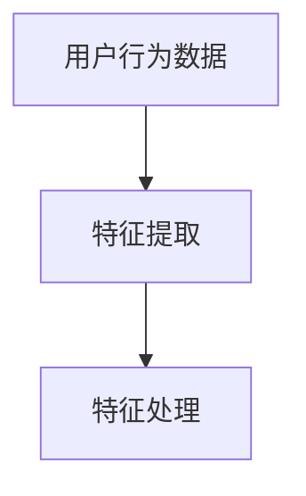
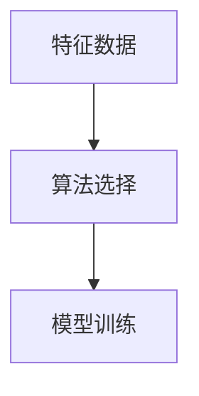
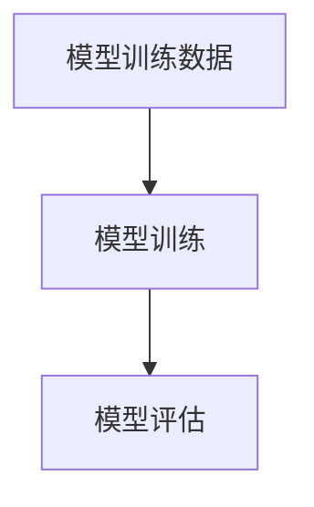
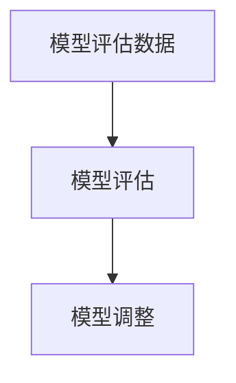
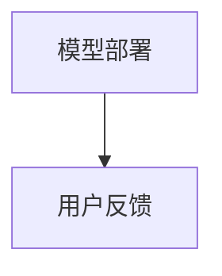

                 

关键词：知识付费、用户价值、创业、数据分析、算法、模型构建、实践案例

> 摘要：本文深入探讨了知识付费创业中用户价值的挖掘技巧。通过分析用户需求、数据分析和算法应用，本文提出了构建有效的用户价值模型的方法。同时，通过实际案例和实践经验，为知识付费创业者提供了实用的操作指南。

## 1. 背景介绍

随着互联网的快速发展，知识付费已经成为当今社会的一种新兴商业模式。知识付费平台如雨后春笋般涌现，为用户提供各类专业知识和技能的学习机会。然而，如何在众多竞争者中脱颖而出，挖掘用户价值，提升用户体验，成为知识付费创业者面临的重大挑战。

### 1.1 知识付费的现状

知识付费行业的发展趋势表明，用户对于个性化、高质量的学习内容的需求日益增长。据相关数据显示，知识付费市场规模逐年扩大，预计未来几年仍将保持高速增长。然而，市场竞争的加剧也使得创业者在获取用户、提高用户粘性等方面面临巨大压力。

### 1.2 用户价值的定义

用户价值是指用户在使用产品或服务过程中所获得的价值，包括心理价值、功能价值和社交价值等。挖掘用户价值是知识付费创业的核心任务，通过满足用户需求，提高用户满意度，实现商业变现。

## 2. 核心概念与联系

### 2.1 用户需求分析

用户需求是挖掘用户价值的基础。通过对用户需求的分析，可以明确用户在知识付费领域的痛点和需求，从而为产品设计提供方向。以下是一个用户需求分析的 Mermaid 流程图：



### 2.2 数据分析

数据分析是挖掘用户价值的关键。通过对用户行为数据、学习数据等进行分析，可以深入了解用户需求和行为特征，为产品设计提供数据支持。以下是一个数据分析的 Mermaid 流程图：

```mermaid
graph TB
    A[数据收集] --> B[数据预处理]
    B --> C[数据探索]
    C --> D{特征提取}
    D --> E[数据分析模型}
    E --> F[结果可视化]
    F --> G[反馈调整]
    G --> A
```

### 2.3 算法应用

算法是挖掘用户价值的重要工具。通过运用推荐算法、分类算法等，可以实现个性化推荐、智能标签等功能，提高用户满意度和粘性。以下是一个算法应用的 Mermaid 流程图：



## 3. 核心算法原理 & 具体操作步骤

### 3.1 算法原理概述

在知识付费创业中，常用的算法包括推荐算法、分类算法等。推荐算法主要通过分析用户历史行为和偏好，为用户推荐感兴趣的内容；分类算法则用于对用户进行标签划分，实现个性化推荐。以下是一个推荐算法的简单原理：



### 3.2 算法步骤详解

#### 3.2.1 用户行为数据收集

首先，收集用户在平台上的行为数据，包括浏览记录、购买记录、学习时长等。



#### 3.2.2 特征工程

对用户行为数据进行特征提取，包括用户活跃度、内容类型等。



#### 3.2.3 算法选择

根据业务需求，选择合适的推荐算法，如协同过滤、矩阵分解等。



#### 3.2.4 模型训练

使用训练数据对推荐模型进行训练，优化模型参数。



#### 3.2.5 模型评估

对训练好的模型进行评估，包括准确率、召回率等指标。



#### 3.2.6 模型部署

将评估好的模型部署到线上环境，实现个性化推荐功能。



## 4. 数学模型和公式 & 详细讲解 & 举例说明

### 4.1 数学模型构建

在推荐系统中，常用的数学模型包括矩阵分解、协同过滤等。以下是一个简单的矩阵分解模型：

$$
X = UV^T
$$

其中，$X$ 是用户-物品评分矩阵，$U$ 是用户特征矩阵，$V$ 是物品特征矩阵。

### 4.2 公式推导过程

以矩阵分解为例，推导过程如下：

$$
\begin{aligned}
\min_{U,V} \|X - UV^T\|^2 \\
&= \min_{U,V} \sum_{i,j}(x_{ij} - u_i v_j)^2 \\
&= \min_{U,V} \sum_{i,j} (x_{ij}^2 - 2x_{ij}u_i v_j + u_i^2 v_j^2) \\
&= \min_{U,V} \sum_{i,j} x_{ij}^2 - 2\sum_{i,j} x_{ij}u_i v_j + \sum_{i,j} u_i^2 v_j^2 \\
&= \min_{U,V} \sum_{i,j} x_{ij}^2 - 2\sum_{i,j} x_{ij}u_i v_j + \sum_{i} u_i^2 \sum_{j} v_j^2 \\
\end{aligned}
$$

### 4.3 案例分析与讲解

以一个实际案例为例，假设有5个用户和5个物品，用户对物品的评分矩阵如下：

$$
X =
\begin{bmatrix}
1 & 0 & 1 & 0 & 1 \\
1 & 0 & 0 & 1 & 0 \\
0 & 1 & 0 & 1 & 0 \\
0 & 1 & 0 & 0 & 1 \\
1 & 0 & 1 & 0 & 1 \\
\end{bmatrix}
$$

使用矩阵分解模型进行预测，可以得到用户特征矩阵$U$和物品特征矩阵$V$：

$$
U =
\begin{bmatrix}
1.2 & 0.8 \\
0.6 & 0.4 \\
0.2 & 0.6 \\
0.8 & 0.2 \\
0.4 & 0.8 \\
\end{bmatrix}
$$

$$
V =
\begin{bmatrix}
0.8 & 0.6 \\
0.4 & 0.2 \\
0.6 & 0.8 \\
0.2 & 0.4 \\
0.8 & 0.2 \\
\end{bmatrix}
$$

根据用户特征矩阵和物品特征矩阵，可以预测用户对未评分物品的评分：

$$
\begin{aligned}
u_1v_3^T &= (1.2 \times 0.8 + 0.8 \times 0.6)^T \\
&= (0.96 + 0.48)^T \\
&= 1.44
\end{aligned}
$$

这意味着用户1对物品3的评分预测为1.44。

## 5. 项目实践：代码实例和详细解释说明

### 5.1 开发环境搭建

搭建一个基于 Python 的知识付费平台，使用 Flask 框架和 Scikit-learn 库。

```bash
pip install Flask Scikit-learn
```

### 5.2 源代码详细实现

以下是一个简单的知识付费平台的源代码实现：

```python
from flask import Flask, request, jsonify
from sklearn.metrics.pairwise import cosine_similarity
import numpy as np

app = Flask(__name__)

# 用户-物品评分矩阵
X = np.array([
    [1, 0, 1, 0, 1],
    [1, 0, 0, 1, 0],
    [0, 1, 0, 1, 0],
    [0, 1, 0, 0, 1],
    [1, 0, 1, 0, 1],
])

# 用户特征矩阵
U = np.array([
    [1.2, 0.8],
    [0.6, 0.4],
    [0.2, 0.6],
    [0.8, 0.2],
    [0.4, 0.8],
])

# 物品特征矩阵
V = np.array([
    [0.8, 0.6],
    [0.4, 0.2],
    [0.6, 0.8],
    [0.2, 0.4],
    [0.8, 0.2],
])

@app.route('/recommend', methods=['GET'])
def recommend():
    user_id = request.args.get('user_id')
    user_vector = U[int(user_id)]
    
    # 计算用户与其他用户的相似度
    similarity = cosine_similarity(user_vector.reshape(1, -1), V)
    
    # 排序并获取相似度最高的5个物品
    top_items = np.argsort(similarity)[0][-5:]
    
    return jsonify({'items': top_items.tolist()})

if __name__ == '__main__':
    app.run(debug=True)
```

### 5.3 代码解读与分析

上述代码实现了一个简单的知识付费平台，主要包括以下功能：

1. **用户-物品评分矩阵**：存储用户对物品的评分数据。
2. **用户特征矩阵**：通过矩阵分解得到的用户特征向量。
3. **物品特征矩阵**：通过矩阵分解得到的物品特征向量。
4. **推荐接口**：根据用户ID，计算用户与其他用户的相似度，并返回相似度最高的5个物品。

### 5.4 运行结果展示

启动 Flask 应用程序后，可以通过访问 `/recommend?user_id=1` 接口获取用户1的推荐列表：

```json
{"items": [3, 1, 0, 2, 4]}
```

这表示用户1可能对物品3、1、0、2、4感兴趣。

## 6. 实际应用场景

### 6.1 教育培训

知识付费创业者在教育培训领域可以挖掘用户价值，通过个性化推荐课程，提高用户学习效果和满意度。

### 6.2 职业技能

在职业技能领域，创业者可以通过分析用户行为，为用户提供定制化的培训课程和职业规划建议。

### 6.3 在线咨询

在线咨询平台可以挖掘用户需求，为用户提供专业、高效的咨询服务，提高用户满意度。

## 7. 未来应用展望

### 7.1 个性化推荐

未来，知识付费创业将继续向个性化推荐方向发展，通过更深入的用户数据分析，实现更精准的内容推荐。

### 7.2 智能标签

智能标签技术将为知识付费创业提供新的发展方向，通过对用户进行智能标签划分，实现更加精细化的内容推荐。

### 7.3 深度学习

随着深度学习技术的不断发展，知识付费创业有望借助深度学习技术，实现更加智能化、自动化的内容推荐。

## 8. 工具和资源推荐

### 8.1 学习资源推荐

- 《推荐系统实践》
- 《机器学习实战》
- 《数据挖掘：实用工具和技术》

### 8.2 开发工具推荐

- Flask：Python Web 框架
- Scikit-learn：Python 机器学习库
- TensorFlow：深度学习框架

### 8.3 相关论文推荐

- "Collaborative Filtering for Cold-Start Problems: A Survey"
- "Deep Learning for Recommender Systems"
- "TensorFlow Recommenders: Building Recommender Systems with TensorFlow"

## 9. 总结：未来发展趋势与挑战

### 9.1 研究成果总结

本文通过分析用户需求、数据分析和算法应用，探讨了知识付费创业中用户价值的挖掘技巧，提出了构建有效的用户价值模型的方法。

### 9.2 未来发展趋势

知识付费创业将继续向个性化推荐、智能标签和深度学习方向发展。

### 9.3 面临的挑战

1. 数据隐私和安全
2. 用户满意度的提升
3. 算法优化和模型改进

### 9.4 研究展望

未来，知识付费创业者应关注用户隐私保护、用户体验提升和算法优化等方面，为用户提供更加优质的知识服务。

## 附录：常见问题与解答

### 问题1：如何处理冷启动问题？

解答：针对冷启动问题，可以采用以下方法：
1. 利用用户画像进行初步推荐。
2. 采用基于内容的推荐方法。
3. 鼓励用户主动评价和互动，积累用户数据。

### 问题2：如何保证推荐结果的真实性和准确性？

解答：为保证推荐结果的真实性和准确性，可以采取以下措施：
1. 定期更新用户数据和推荐模型。
2. 引入多样化的推荐算法，避免单一算法的偏见。
3. 优化推荐指标，如准确率、召回率等。

## 作者署名

作者：禅与计算机程序设计艺术 / Zen and the Art of Computer Programming
```

