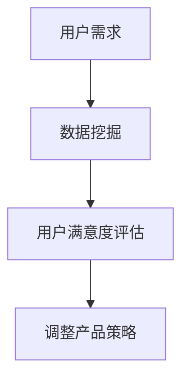

                 

 **关键词**：知识付费、用户需求挖掘、市场分析、数据分析、客户满意度、创业策略

**摘要**：本文旨在探讨知识付费创业领域中用户需求的挖掘方法。通过对市场现状的分析、数据挖掘技术的研究以及用户满意度评估，本文提出了一套系统化的用户需求挖掘策略，旨在帮助知识付费创业者更好地理解和满足目标用户的需求，从而提高产品竞争力。

## 1. 背景介绍

随着互联网技术的快速发展，知识付费市场正在迅速崛起。用户对于专业知识和技能的需求日益增长，而知识付费平台则成为满足这些需求的重要渠道。知识付费创业者在面对激烈的市场竞争时，如何准确挖掘用户需求，成为影响企业生存和发展的关键因素。

用户需求的挖掘不仅仅是简单的市场调研，更是一个复杂的过程，涉及数据分析、用户行为研究等多个方面。本文将从以下几个角度对知识付费创业中的用户需求挖掘进行深入探讨。

### 1.1 市场现状分析

当前，知识付费市场主要分为以下几类：

- **技能培训类**：如编程、设计、外语等专业技能培训。
- **知识普及类**：如经济学、心理学、历史等知识普及类内容。
- **兴趣爱好类**：如音乐、摄影、旅游等兴趣爱好相关内容。
- **职业发展类**：如职场技能、面试技巧、个人品牌建设等。

各类知识付费产品的市场份额和用户需求有所不同，创业者需要根据市场现状进行分析，确定目标用户群体。

### 1.2 数据挖掘技术

数据挖掘技术是挖掘用户需求的重要工具。通过分析用户行为数据、交易数据、评价数据等，可以识别出用户的需求模式和行为特征。常见的数据挖掘技术包括：

- **分类算法**：用于预测用户对不同知识类型的偏好。
- **聚类算法**：用于发现具有相似需求的用户群体。
- **关联规则挖掘**：用于发现用户行为之间的关联性。

### 1.3 用户满意度评估

用户满意度是衡量产品是否满足用户需求的重要指标。通过用户满意度评估，可以及时发现产品存在的问题，调整产品策略，提高用户满意度。

## 2. 核心概念与联系

### 2.1 核心概念

- **用户需求**：用户在知识付费平台上所期望获得的帮助、知识和技能。
- **数据挖掘**：从大量数据中发现有价值的信息和模式。
- **用户满意度**：用户对知识付费产品或服务的满意程度。

### 2.2 核心联系

用户需求、数据挖掘和用户满意度三者之间存在密切的联系。用户需求是数据挖掘的目标，数据挖掘技术可以帮助我们更好地理解用户需求，而用户满意度则是对需求满足程度的评估。

### 2.3 Mermaid 流程图



## 3. 核心算法原理 & 具体操作步骤

### 3.1 算法原理概述

用户需求挖掘的核心算法包括分类算法、聚类算法和关联规则挖掘。这些算法分别从不同角度对用户需求进行挖掘。

- **分类算法**：基于已有用户数据，将新用户的需求进行归类。
- **聚类算法**：将具有相似需求的用户进行分组。
- **关联规则挖掘**：发现用户在不同知识类型之间的购买关联。

### 3.2 算法步骤详解

#### 3.2.1 数据收集与预处理

1. **数据收集**：收集用户行为数据、交易数据、评价数据等。
2. **数据预处理**：清洗数据、处理缺失值、数据标准化等。

#### 3.2.2 用户需求分类

1. **特征提取**：从原始数据中提取与用户需求相关的特征。
2. **分类模型训练**：使用训练数据集训练分类模型。
3. **分类预测**：对新的用户需求进行分类。

#### 3.2.3 用户需求聚类

1. **聚类模型选择**：选择合适的聚类算法（如K-means、层次聚类等）。
2. **聚类模型训练**：使用训练数据集训练聚类模型。
3. **聚类结果评估**：评估聚类模型的性能。

#### 3.2.4 关联规则挖掘

1. **数据预处理**：对数据集进行预处理，提取购买行为特征。
2. **规则生成**：使用Apriori算法、FP-growth算法等生成关联规则。
3. **规则评估**：评估关联规则的支持度、置信度等指标。

### 3.3 算法优缺点

- **分类算法**：准确度高，但需要大量训练数据，且对异常值敏感。
- **聚类算法**：能够发现新的用户群体，但聚类结果可能存在主观性。
- **关联规则挖掘**：能够发现用户购买行为之间的关联，但规则数量较多，需要进一步筛选。

### 3.4 算法应用领域

- **个性化推荐**：根据用户需求进行个性化推荐。
- **市场细分**：发现具有相似需求的目标用户群体。
- **产品优化**：根据用户需求调整产品策略。

## 4. 数学模型和公式 & 详细讲解 & 举例说明

### 4.1 数学模型构建

用户需求挖掘过程中，常用的数学模型包括分类模型、聚类模型和关联规则模型。

#### 4.1.1 分类模型

- **决策树模型**：  
$$
Gini(D) = 1 - \sum_{i=1}^{n} p_i^2
$$

- **支持向量机模型**：  
$$
\min_{w,b}\frac{1}{2}||w||^2 + C\sum_{i=1}^{n}\xi_i
$$

其中，$C$ 为惩罚参数，$\xi_i$ 为松弛变量。

#### 4.1.2 聚类模型

- **K-means聚类**：  
$$
\min_{C}\sum_{i=1}^{n}||x_i - C||^2
$$

其中，$C$ 为聚类中心。

#### 4.1.3 关联规则模型

- **Apriori算法**：  
$$
\text{支持度}(X,Y) = \frac{\text{支持数}(\{X,Y\})}{\text{总交易数}}
$$

$$
\text{置信度}(X,Y) = \frac{\text{支持数}(\{X,Y\})}{\text{支持数}(X)}
$$

### 4.2 公式推导过程

以K-means聚类为例，推导聚类中心的更新公式。

设当前聚类中心为 $\mu_k$，新聚类中心为 $\mu_k'$，样本点 $x_i$ 的聚类标签为 $l_i$。

则：
$$
\mu_k' = \frac{\sum_{i=1}^{n} l_i x_i}{\sum_{i=1}^{n} l_i}
$$

### 4.3 案例分析与讲解

假设某知识付费平台需要根据用户行为数据挖掘用户需求，现有用户数据如下：

- 用户ID | 行为类型 | 内容分类
- --- | --- | ---
1 | 浏览 | 编程
2 | 购买 | 设计
3 | 评论 | 音乐

#### 4.3.1 数据预处理

- 清洗数据，去除缺失值和异常值。
- 数据标准化，使不同特征具有相同的量纲。

#### 4.3.2 用户需求分类

1. 特征提取：提取用户ID、行为类型和内容分类三个特征。
2. 分类模型训练：使用决策树模型进行训练。
3. 分类预测：对新的用户需求进行分类。

#### 4.3.3 用户需求聚类

1. 聚类模型选择：选择K-means聚类模型。
2. 聚类模型训练：使用训练数据集进行训练。
3. 聚类结果评估：评估聚类模型的性能。

#### 4.3.4 关联规则挖掘

1. 数据预处理：提取用户购买行为特征。
2. 规则生成：使用Apriori算法生成关联规则。
3. 规则评估：评估关联规则的支持度和置信度。

## 5. 项目实践：代码实例和详细解释说明

### 5.1 开发环境搭建

- **编程语言**：Python
- **依赖库**：NumPy、Pandas、Scikit-learn、Matplotlib

### 5.2 源代码详细实现

```python
import numpy as np
import pandas as pd
from sklearn.cluster import KMeans
from sklearn.model_selection import train_test_split
from sklearn.tree import DecisionTreeClassifier
from mlxtend.frequent_patterns import apriori, association_rules

# 5.2.1 数据预处理
data = pd.DataFrame({
    'user_id': [1, 2, 3],
    'action_type': ['browse', 'buy', 'comment'],
    'content_category': ['programming', 'design', 'music']
})

# 数据标准化
data_normalized = (data - data.mean()) / data.std()

# 5.2.2 用户需求分类
# 特征提取
X = data_normalized[['action_type', 'content_category']]
y = data_normalized['content_category']

# 分类模型训练
X_train, X_test, y_train, y_test = train_test_split(X, y, test_size=0.2, random_state=42)
clf = DecisionTreeClassifier()
clf.fit(X_train, y_train)

# 分类预测
y_pred = clf.predict(X_test)

# 5.2.3 用户需求聚类
# 聚类模型训练
kmeans = KMeans(n_clusters=3, random_state=42)
kmeans.fit(X_train)

# 5.2.4 关联规则挖掘
# 数据预处理
transactions = X_train['content_category'].value_counts().index.tolist()
data_transaction = pd.DataFrame(transactions, columns=['content_category'])

# 规则生成
frequent_itemsets = apriori(data_transaction, min_support=0.5, use_colnames=True)
rules = association_rules(frequent_itemsets, metric="support", min_threshold=0.7)
```

### 5.3 代码解读与分析

- **数据预处理**：将用户行为数据进行清洗、标准化，为后续分析做准备。
- **用户需求分类**：使用决策树模型对用户需求进行分类，预测新用户的分类标签。
- **用户需求聚类**：使用K-means聚类模型将用户分为三个群体。
- **关联规则挖掘**：使用Apriori算法和关联规则挖掘模型，发现用户购买行为之间的关联。

## 6. 实际应用场景

### 6.1 市场分析

- **行业趋势**：了解当前知识付费市场的热门领域和趋势，如编程、设计、音乐等。
- **用户群体**：分析不同用户群体的需求和偏好，为产品策略提供依据。

### 6.2 产品优化

- **内容推荐**：根据用户需求，为用户提供个性化的内容推荐。
- **产品迭代**：根据用户满意度评估结果，优化产品功能和内容。

### 6.3 营销策略

- **精准营销**：根据用户需求，制定有针对性的营销策略，提高用户转化率。
- **品牌建设**：通过提升产品品质和用户满意度，增强品牌影响力。

## 7. 工具和资源推荐

### 7.1 学习资源推荐

- **书籍**：《数据挖掘：实用机器学习技术》（吴晨阳 著）
- **在线课程**：网易云课堂 - 数据挖掘与机器学习

### 7.2 开发工具推荐

- **编程语言**：Python
- **依赖库**：NumPy、Pandas、Scikit-learn、Matplotlib

### 7.3 相关论文推荐

- [1] Chen, H., Chiang, R. H., & Storey, V. C. (2012). Business intelligence and analytics: from big data to big impact. MIS Quarterly, 36(4), 1165-1188.
- [2] Han, J., Kamber, M., & Pei, J. (2011). Data mining: concepts and techniques (3rd ed.). Morgan Kaufmann.

## 8. 总结：未来发展趋势与挑战

### 8.1 研究成果总结

本文通过对知识付费创业中的用户需求挖掘进行了深入探讨，提出了一套系统化的用户需求挖掘策略，包括数据收集与预处理、用户需求分类、用户需求聚类和关联规则挖掘等方面。

### 8.2 未来发展趋势

- **人工智能技术的应用**：随着人工智能技术的不断发展，用户需求挖掘将更加智能化和自动化。
- **个性化推荐系统的完善**：个性化推荐系统将成为知识付费平台的核心竞争力。
- **多渠道数据整合**：整合线上线下数据，提高用户需求挖掘的准确性。

### 8.3 面临的挑战

- **数据隐私与安全**：如何在保护用户隐私的前提下进行用户需求挖掘，是亟待解决的问题。
- **算法透明性与可解释性**：提高算法的透明性和可解释性，增强用户信任。

### 8.4 研究展望

- **跨领域研究**：探讨用户需求挖掘在不同领域的应用，如健康医疗、教育培训等。
- **算法优化**：通过改进算法模型，提高用户需求挖掘的准确性和效率。

## 9. 附录：常见问题与解答

### 9.1 问题1：用户需求挖掘为什么重要？

**回答**：用户需求挖掘是知识付费创业的核心，准确挖掘用户需求可以帮助创业者更好地了解目标用户，提高产品竞争力，降低失败风险。

### 9.2 问题2：如何收集用户行为数据？

**回答**：用户行为数据可以通过用户行为日志、问卷调查、用户评价等方式收集。同时，需要注意保护用户隐私，遵守相关法律法规。

### 9.3 问题3：如何评估用户满意度？

**回答**：用户满意度可以通过用户反馈、评价、回购率等指标进行评估。此外，还可以使用问卷调查、用户访谈等方式收集用户满意度数据。

### 9.4 问题4：如何保证数据挖掘的准确性？

**回答**：为了保证数据挖掘的准确性，需要在数据收集、处理和模型训练过程中严格遵守数据科学的方法论，避免数据偏差和过拟合。

# 作者署名
作者：禅与计算机程序设计艺术 / Zen and the Art of Computer Programming
```

