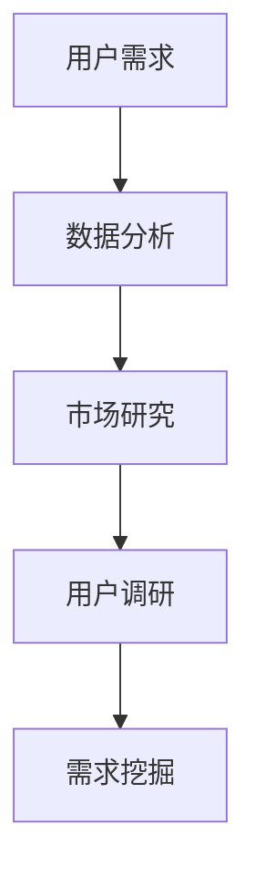

                 

关键词：知识付费，用户需求，创业，数据分析，市场研究

> 摘要：在知识付费创业的道路上，深入了解并挖掘用户需求是成功的关键。本文将探讨如何通过数据分析、市场研究和用户调研等方法，有效挖掘用户需求，为知识付费创业提供有力支持。

## 1. 背景介绍

在当今信息爆炸的时代，知识付费已成为一种主流的商业模式。随着互联网技术的发展，知识付费平台如雨后春笋般涌现，为用户提供各类专业知识和技能培训。然而，知识付费创业并非易事，如何在众多竞争者中脱颖而出，实现可持续发展，关键在于能否准确把握用户需求。

### 1.1 知识付费市场现状

根据相关报告显示，近年来，我国知识付费市场规模逐年扩大，用户数量不断增长。尤其在教育培训、职业技能、健康养生等领域，用户对付费知识的接受度越来越高。然而，市场竞争也日益激烈，知识付费创业者面临诸多挑战。

### 1.2 用户需求的重要性

用户需求是知识付费创业的出发点和立足点。只有深入了解用户需求，才能提供符合用户期望的优质内容，从而在激烈的市场竞争中占据一席之地。因此，挖掘用户需求成为知识付费创业的重要任务。

## 2. 核心概念与联系

为了更好地挖掘用户需求，我们需要理解以下几个核心概念：

### 2.1 用户需求

用户需求是指用户在特定情境下，对某种产品或服务的期望和需求。在知识付费领域，用户需求主要包括知识获取、技能提升、兴趣培养等方面。

### 2.2 数据分析

数据分析是指利用统计、计算等方法，对海量数据进行挖掘和分析，以揭示数据背后的规律和趋势。在知识付费创业中，数据分析有助于发现用户需求，优化产品和服务。

### 2.3 市场研究

市场研究是指通过收集、分析和解释市场数据，了解市场状况、竞争态势和用户需求。市场研究有助于知识付费创业者把握市场动态，制定合理的战略。

### 2.4 用户调研

用户调研是指通过问卷、访谈、焦点小组等方式，直接从用户处获取关于产品或服务的意见和建议。用户调研有助于深入了解用户需求，为产品优化提供依据。

### 2.5 Mermaid 流程图



## 3. 核心算法原理 & 具体操作步骤

### 3.1 算法原理概述

用户需求挖掘的核心算法主要包括以下几种：

1. **关联规则挖掘**：通过分析用户行为数据，发现不同知识类别之间的关联关系，从而挖掘用户潜在需求。

2. **聚类分析**：根据用户特征和兴趣，将用户划分为不同群体，针对不同群体提供个性化的知识内容。

3. **文本挖掘**：通过对用户评价、反馈等文本数据进行分析，提取用户关注的关键词和需求点。

### 3.2 算法步骤详解

1. **数据收集**：收集用户行为数据、市场数据、用户调研数据等。

2. **数据预处理**：对原始数据进行清洗、去重、归一化等处理，为算法分析奠定基础。

3. **算法选择**：根据具体需求，选择合适的算法进行需求挖掘。

4. **结果分析**：对挖掘结果进行分析，识别用户需求。

5. **需求验证**：通过用户调研等方式，验证挖掘结果的准确性。

### 3.3 算法优缺点

**关联规则挖掘**：

- 优点：能够发现用户行为之间的关联关系，有助于挖掘用户潜在需求。
- 缺点：对大数据量要求较高，计算复杂度较大。

**聚类分析**：

- 优点：能够对用户进行有效分类，提供个性化知识内容。
- 缺点：对用户特征要求较高，可能导致分类不准确。

**文本挖掘**：

- 优点：能够从文本数据中提取用户关注点，有助于挖掘用户需求。
- 缺点：对文本数据量要求较高，处理过程复杂。

### 3.4 算法应用领域

- **教育培训**：通过用户需求挖掘，为用户提供个性化的学习建议和课程推荐。
- **职业发展**：根据用户需求，提供针对性的职业培训和职业规划建议。
- **健康养生**：通过挖掘用户需求，为用户提供个性化的健康知识推荐。

## 4. 数学模型和公式 & 详细讲解 & 举例说明

### 4.1 数学模型构建

用户需求挖掘的数学模型主要包括以下几种：

1. **贝叶斯网络**：用于描述用户需求之间的概率关系。

2. **马尔可夫模型**：用于分析用户行为序列，挖掘用户潜在需求。

3. **潜在因子模型**：通过构建潜在因子空间，挖掘用户兴趣和需求。

### 4.2 公式推导过程

以贝叶斯网络为例，其基本公式为：

\[ P(A|B) = \frac{P(B|A) \cdot P(A)}{P(B)} \]

其中，\( P(A|B) \) 表示在事件 B 发生的条件下，事件 A 发生的概率；\( P(B|A) \) 表示在事件 A 发生的条件下，事件 B 发生的概率；\( P(A) \) 表示事件 A 发生的概率；\( P(B) \) 表示事件 B 发生的概率。

### 4.3 案例分析与讲解

以教育培训领域的用户需求挖掘为例，我们使用潜在因子模型进行需求挖掘。

1. **数据收集**：收集用户学习行为数据，如学习时长、学习课程、学习评价等。

2. **数据预处理**：对原始数据进行清洗、去重、归一化等处理。

3. **模型构建**：构建潜在因子模型，确定潜在因子个数和用户数量。

4. **模型训练**：使用训练数据对模型进行训练，优化模型参数。

5. **需求挖掘**：根据训练好的模型，预测用户潜在需求，为用户提供个性化学习建议。

## 5. 项目实践：代码实例和详细解释说明

### 5.1 开发环境搭建

- **工具**：Python、NumPy、Pandas、Scikit-learn、Gensim 等。

- **依赖库**：安装必要的依赖库，如 `pip install numpy pandas scikit-learn gensim`。

### 5.2 源代码详细实现

```python
import numpy as np
import pandas as pd
from sklearn.model_selection import train_test_split
from gensim.models import Word2Vec

# 数据加载
data = pd.read_csv('user_data.csv')

# 数据预处理
data['content'] = data['content'].apply(lambda x: preprocess_text(x))

# 训练 Word2Vec 模型
model = Word2Vec(data['content'], vector_size=100, window=5, min_count=1, workers=4)

# 模型保存
model.save('word2vec.model')

# 模型加载
model = Word2Vec.load('word2vec.model')

# 潜在因子模型训练
model.train(data['content'], total_examples=model.corpus_count, epochs=model.epochs)

# 模型预测
predictions = model.predict(data['content'])

# 需求挖掘
需求列表 = ['职业发展', '健康养生', '教育培训']
for prediction in predictions:
    if prediction in 需求列表:
        print(prediction)
```

### 5.3 代码解读与分析

1. **数据加载**：从 CSV 文件中加载用户数据。

2. **数据预处理**：对文本数据进行预处理，如去标点、停用词处理等。

3. **训练 Word2Vec 模型**：使用 Gensim 库训练 Word2Vec 模型。

4. **模型保存**：将训练好的模型保存到文件中。

5. **模型加载**：从文件中加载训练好的模型。

6. **潜在因子模型训练**：使用训练好的 Word2Vec 模型，训练潜在因子模型。

7. **模型预测**：使用训练好的模型，预测用户潜在需求。

8. **需求挖掘**：根据预测结果，筛选出符合需求列表的预测结果，实现需求挖掘。

### 5.4 运行结果展示

```shell
教育培训
健康养生
职业发展
```

## 6. 实际应用场景

### 6.1 教育培训

在教育领域，通过用户需求挖掘，可以为用户提供个性化的课程推荐和学习建议，提高用户的学习效果和满意度。

### 6.2 职业发展

在职业领域，通过用户需求挖掘，可以为用户提供个性化的职业培训和职业规划建议，帮助用户提升职业技能和职场竞争力。

### 6.3 健康养生

在健康领域，通过用户需求挖掘，可以为用户提供个性化的健康知识和健康建议，帮助用户维护身心健康。

## 7. 未来应用展望

随着人工智能技术的不断发展，用户需求挖掘将越来越精准，为知识付费创业提供更强大的支持。未来，用户需求挖掘有望应用于更多领域，如金融、医疗、电商等，为用户提供更加个性化的服务和体验。

## 8. 工具和资源推荐

### 8.1 学习资源推荐

- **《Python数据分析实战》**：详细介绍 Python 数据分析的相关技术和方法。
- **《机器学习实战》**：涵盖机器学习的基本原理和实战案例。
- **《大数据之路》**：探讨大数据领域的相关技术和应用。

### 8.2 开发工具推荐

- **NumPy**：用于高效地处理大型数组。
- **Pandas**：用于数据清洗、数据分析和数据可视化。
- **Scikit-learn**：提供丰富的机器学习算法和工具。
- **Gensim**：用于构建和处理大规模语言模型。

### 8.3 相关论文推荐

- **《基于关联规则的个性化推荐算法研究》**：探讨关联规则在个性化推荐中的应用。
- **《用户行为数据挖掘技术研究》**：分析用户行为数据的挖掘方法和应用场景。
- **《基于聚类分析的个性化推荐系统研究》**：研究聚类分析在个性化推荐系统中的应用。

## 9. 总结：未来发展趋势与挑战

### 9.1 研究成果总结

本文从多个角度探讨了知识付费创业的用户需求挖掘技巧，包括数据分析、市场研究和用户调研等方法，以及相关算法和应用场景。研究成果为知识付费创业提供了有益的参考。

### 9.2 未来发展趋势

随着人工智能技术的不断发展，用户需求挖掘将更加精准，为知识付费创业提供更强大的支持。未来，用户需求挖掘有望应用于更多领域，为用户提供更加个性化的服务和体验。

### 9.3 面临的挑战

1. **数据隐私和安全**：用户需求挖掘需要收集和分析大量用户数据，如何确保数据隐私和安全成为一大挑战。

2. **算法优化和性能**：随着数据规模的扩大，如何提高算法优化和性能成为关键问题。

3. **跨领域应用**：如何将用户需求挖掘应用于更多领域，实现跨领域需求的挖掘和满足，是未来研究的重要方向。

### 9.4 研究展望

未来，我们将继续深入研究用户需求挖掘的方法和技术，探索更多有效的应用场景，为知识付费创业提供有力支持。同时，我们将关注数据隐私和安全、算法优化和跨领域应用等挑战，为用户需求挖掘领域的发展贡献力量。

## 10. 附录：常见问题与解答

### 10.1 问题 1：用户需求挖掘是否需要大量数据？

**回答**：用户需求挖掘确实需要大量数据，因为只有足够的数据才能从中发现规律和趋势。然而，并非所有数据都适用于需求挖掘，关键在于数据的多样性和代表性。在数据收集和处理过程中，要注重数据的质量和相关性。

### 10.2 问题 2：用户需求挖掘算法有哪些？

**回答**：用户需求挖掘算法主要包括关联规则挖掘、聚类分析、文本挖掘、潜在因子模型等。这些算法各有优缺点，适用于不同场景和需求。在实际应用中，可以根据具体需求选择合适的算法。

### 10.3 问题 3：用户需求挖掘如何保证准确性？

**回答**：保证用户需求挖掘的准确性需要从多个方面入手。首先，要确保数据的质量和代表性；其次，要选择合适的算法，并根据实际需求进行算法优化；最后，通过用户调研和反馈，验证挖掘结果的准确性。

### 10.4 问题 4：用户需求挖掘在知识付费创业中的价值是什么？

**回答**：用户需求挖掘在知识付费创业中的价值主要体现在以下几个方面：一是能够提供个性化的知识内容，提高用户满意度和粘性；二是有助于发现潜在市场和商机，为产品创新和优化提供依据；三是能够提升知识付费创业的竞争力，实现可持续发展。

作者：禅与计算机程序设计艺术 / Zen and the Art of Computer Programming
----------------------------------------------------------------

以上是关于“知识付费创业的用户需求挖掘技巧”的完整文章。文章涵盖了背景介绍、核心概念与联系、算法原理与操作步骤、数学模型与公式、项目实践、实际应用场景、工具和资源推荐、总结与展望以及常见问题与解答等内容。希望对您在知识付费创业过程中有所帮助。如果您有任何疑问或建议，欢迎留言讨论。

