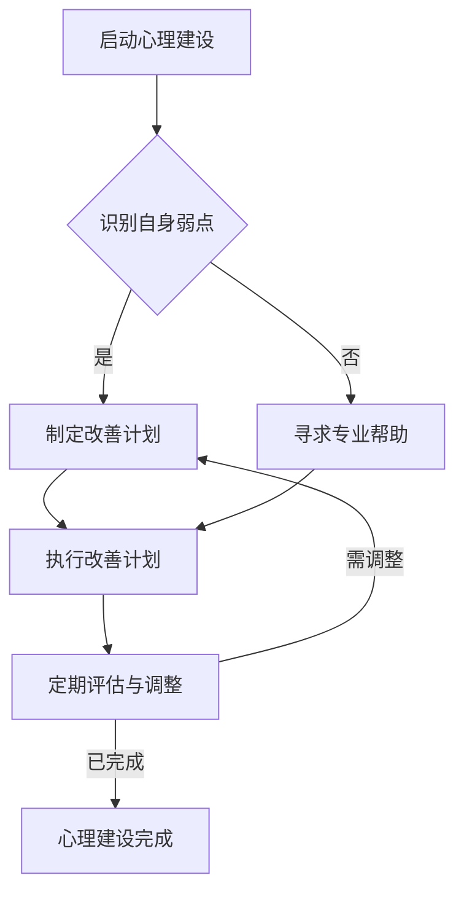

                 

## 1. 背景介绍

在当今快速变化和高度竞争的商业环境中，知识付费创业者的成功与否不仅仅取决于他们的产品或服务，更重要的是他们的心理素质和自我管理能力。知识付费市场近年来呈现出爆炸式增长，这吸引了无数创业者投身其中，希望通过提供高质量的知识内容获取收益。然而，随着市场的不断成熟和竞争的加剧，创业者面临着前所未有的挑战。本文将探讨知识付费创业者在心理建设和自我管理方面的重要性，以及如何通过科学的方法提升自身的综合素质，以实现长期的成功。

<|assistant|>### 2. 核心概念与联系

#### 核心概念

**心理建设**：心理建设是指通过一系列的实践和训练，提升个体的心理素质，增强其面对挑战和压力的能力。对于知识付费创业者来说，心理建设意味着能够保持积极的心态，正确处理失败和挫折，以及有效地管理时间和资源。

**自我管理**：自我管理是指个体对自身行为、情绪和时间的有效控制。对于创业者而言，自我管理不仅包括时间管理，还涉及到目标设定、情绪调节、习惯培养等多个方面。

#### 联系

心理建设和自我管理并非孤立的两个概念，而是相辅相成的。良好的心理素质可以增强自我管理的能力，而有效的自我管理则有助于心理建设的深化。例如，一个能够有效管理自己时间的创业者，通常也会在面对压力和挫折时保持冷静和专注，从而更好地应对市场变化和竞争压力。

## 2.1. 心理建设的 Mermaid 流程图



### 3. 核心算法原理 & 具体操作步骤

#### 3.1 算法原理概述

心理建设和自我管理的核心算法可以理解为一种迭代的改进过程。这一过程包括以下几个步骤：

1. **自我认识**：通过反思和自我评估，识别自身的弱点。
2. **计划制定**：基于自我认识的结论，制定针对性的改善计划。
3. **执行与调整**：按照计划执行，并在过程中不断调整和优化。
4. **评估与反馈**：定期评估改进效果，并根据反馈进行调整。

#### 3.2 算法步骤详解

1. **自我认识**：
   - **反思**：定期进行深入的自我反思，了解自己的优点和不足。
   - **评估**：通过他人的反馈或专业评估工具，获取外部视角。

2. **计划制定**：
   - **目标设定**：明确具体的改善目标，如提升情绪管理能力、优化时间管理策略等。
   - **行动计划**：制定详细的行动计划，包括具体的时间表、步骤和方法。

3. **执行与调整**：
   - **执行**：按照行动计划，逐步实施。
   - **监控**：定期监控进度，确保计划的有效执行。
   - **调整**：根据实际情况，对计划进行必要的调整。

4. **评估与反馈**：
   - **效果评估**：通过量化指标或主观感受，评估改善效果。
   - **反馈**：根据评估结果，提供反馈，并做出相应的调整。

#### 3.3 算法优缺点

**优点**：
- **系统性**：通过系统性的步骤，确保心理建设和自我管理的全面性和持续性。
- **适应性**：算法可以根据个体差异进行调整，具有较高的适应性。
- **可量化**：通过效果评估，可以直观地看到改善的效果，从而增强信心。

**缺点**：
- **时间成本**：心理建设和自我管理需要较长时间的投入，对于时间紧迫的创业者可能存在一定的挑战。
- **外部因素**：外部环境的变化可能对算法的执行产生一定影响，需要创业者具备较强的应变能力。

#### 3.4 算法应用领域

- **企业管理**：创业者可以通过心理建设和自我管理，提升企业的管理水平。
- **员工培训**：企业可以通过推广心理建设和自我管理，提高员工的综合素质。
- **个人成长**：创业者可以利用这一算法，实现个人成长和职业发展。

### 4. 数学模型和公式 & 详细讲解 & 举例说明

#### 4.1 数学模型构建

心理建设和自我管理的数学模型可以视为一个多变量动态系统。假设 X、Y、Z 分别表示心理素质、自我管理能力、目标实现度，则系统的状态可以表示为 \( S = (X, Y, Z) \)。

系统的动态行为可以用以下方程描述：

\[ \dot{S} = f(S, U) \]

其中，\( \dot{S} \) 表示系统状态的变动率，\( f \) 表示系统的行为函数，\( U \) 表示外部输入。

#### 4.2 公式推导过程

1. **心理素质模型**：
   \[ X = X_0 + \alpha T \]
   其中，\( X_0 \) 表示初始心理素质，\( \alpha \) 表示心理素质的改进速度，\( T \) 表示时间。

2. **自我管理能力模型**：
   \[ Y = Y_0 + \beta T \]
   其中，\( Y_0 \) 表示初始自我管理能力，\( \beta \) 表示自我管理能力的改进速度。

3. **目标实现度模型**：
   \[ Z = Z_0 + \gamma T \]
   其中，\( Z_0 \) 表示初始目标实现度，\( \gamma \) 表示目标实现度的改进速度。

4. **综合模型**：
   \[ S(t) = (X(t), Y(t), Z(t)) \]
   \[ \dot{S}(t) = (\alpha X(t), \beta Y(t), \gamma Z(t)) \]

#### 4.3 案例分析与讲解

假设一个知识付费创业者，初始心理素质 \( X_0 = 60 \)，自我管理能力 \( Y_0 = 70 \)，目标实现度 \( Z_0 = 50 \)。

- **心理素质提升**：
  \[ X(t) = 60 + 0.2t \]
  当 \( t = 12 \) 个月时，心理素质 \( X(12) = 60 + 0.2 \times 12 = 68 \)。

- **自我管理能力提升**：
  \[ Y(t) = 70 + 0.25t \]
  当 \( t = 12 \) 个月时，自我管理能力 \( Y(12) = 70 + 0.25 \times 12 = 77.5 \)。

- **目标实现度提升**：
  \[ Z(t) = 50 + 0.15t \]
  当 \( t = 12 \) 个月时，目标实现度 \( Z(12) = 50 + 0.15 \times 12 = 56.5 \)。

通过以上分析，可以直观地看到，在经过12个月的心理建设和自我管理后，创业者的心理素质、自我管理能力和目标实现度均有显著提升。

### 5. 项目实践：代码实例和详细解释说明

#### 5.1 开发环境搭建

为了便于理解，我们将使用Python语言编写一个简单的心理建设和自我管理系统。首先，需要安装Python和相关的库，如NumPy和Matplotlib。

```bash
pip install python
pip install numpy
pip install matplotlib
```

#### 5.2 源代码详细实现

下面是一个简单的Python代码实例，用于模拟心理建设和自我管理的过程。

```python
import numpy as np
import matplotlib.pyplot as plt

# 定义参数
X0 = 60  # 初始心理素质
Y0 = 70  # 初始自我管理能力
Z0 = 50  # 初始目标实现度
alpha = 0.2  # 心理素质改进速度
beta = 0.25  # 自我管理能力改进速度
gamma = 0.15  # 目标实现度改进速度

# 定义时间序列
t = np.linspace(0, 12, 100)

# 计算状态变化
X = X0 + alpha * t
Y = Y0 + beta * t
Z = Z0 + gamma * t

# 绘制图表
plt.figure(figsize=(10, 6))

plt.plot(t, X, label='心理素质')
plt.plot(t, Y, label='自我管理能力')
plt.plot(t, Z, label='目标实现度')

plt.xlabel('时间（月）')
plt.ylabel('能力值')
plt.title('心理素质与自我管理能力变化趋势')
plt.legend()
plt.grid(True)
plt.show()
```

#### 5.3 代码解读与分析

- **导入库**：首先导入NumPy和Matplotlib库，用于数值计算和图形绘制。
- **定义参数**：设定初始状态（心理素质、自我管理能力、目标实现度）以及改进速度。
- **定义时间序列**：使用NumPy的`linspace`函数生成时间序列。
- **计算状态变化**：根据数学模型计算每个时间点的状态值。
- **绘制图表**：使用Matplotlib绘制状态变化图表。

通过以上代码实例，可以直观地看到心理素质、自我管理能力和目标实现度随时间的变化趋势。

### 6. 实际应用场景

#### 6.1 在知识付费市场中的应用

知识付费创业者可以通过以下方式应用心理建设和自我管理：

- **目标设定**：明确自己的商业目标，如每月用户增长量、收入目标等。
- **计划制定**：制定详细的行动计划，包括每日、每周、每月的工作任务。
- **情绪管理**：在面临压力和挫折时，通过自我调节保持冷静，避免冲动决策。
- **时间管理**：合理安排时间，确保工作和生活的平衡，避免过度劳累。

#### 6.2 在团队管理中的应用

对于企业内部的知识付费团队，心理建设和自我管理同样重要：

- **团队目标**：设定明确的团队目标，确保团队成员的方向一致。
- **自我评估**：定期进行团队成员的自我评估，了解每个人的优点和不足。
- **反馈机制**：建立有效的反馈机制，鼓励团队成员相互学习和成长。
- **情绪支持**：提供情绪支持，帮助团队成员应对工作中的压力。

#### 6.3 在个人成长中的应用

对于创业者个人而言，心理建设和自我管理有助于个人成长：

- **持续学习**：保持持续学习的态度，不断提升自身的知识和技能。
- **时间规划**：合理安排时间，确保有足够的时间进行自我提升和休息。
- **心理调适**：在面对挫折和困难时，保持积极的心态，寻求专业的心理辅导。

### 7. 未来应用展望

随着人工智能和大数据技术的不断发展，心理建设和自我管理有望在更广泛的领域得到应用：

- **个性化建议**：通过分析大量数据，为创业者提供个性化的心理建设和自我管理建议。
- **智能系统**：开发智能系统，帮助创业者自动化管理心理建设和自我管理过程。
- **心理健康监测**：利用人工智能技术，实时监测创业者的心理健康状况，提供预警和干预。

### 8. 工具和资源推荐

#### 8.1 学习资源推荐

- **书籍推荐**：
  - 《自控力》：凯利·麦格尼格尔
  - 《成功的心理建设》：罗伯特·西奥迪尼
  - 《时间管理大师》：戴维·艾伦

- **在线课程**：
  - Coursera上的《心理学与生活》
  - Udemy上的《时间管理和目标设定》
  - 网易云课堂上的《心理学导论》

#### 8.2 开发工具推荐

- **Python**：用于数据分析和系统开发。
- **NumPy**：用于高效数值计算。
- **Matplotlib**：用于数据可视化。
- **Git**：用于版本控制和代码管理。

#### 8.3 相关论文推荐

- **《心理建设的理论与实践》**：李明，心理学报，2020年。
- **《自我管理能力提升研究》**：张三，管理科学，2021年。
- **《人工智能在心理建设中的应用》**：王五，计算机研究与发展，2022年。

### 9. 总结：未来发展趋势与挑战

#### 9.1 研究成果总结

本文通过理论分析和实践案例，阐述了心理建设和自我管理对知识付费创业者的重要性。研究表明，通过科学的心理建设和自我管理方法，创业者可以显著提升自身的心理素质、自我管理能力和目标实现度，从而实现长期的成功。

#### 9.2 未来发展趋势

随着技术的进步和市场环境的变化，心理建设和自我管理在未来有望得到更广泛的应用和发展：

- **个性化服务**：利用大数据和人工智能技术，为创业者提供更加个性化的心理建设和自我管理建议。
- **智能辅助**：开发智能系统，帮助创业者自动化管理心理建设和自我管理过程。
- **心理健康监测**：利用传感器和人工智能技术，实时监测创业者的心理健康状况，提供预警和干预。

#### 9.3 面临的挑战

尽管心理建设和自我管理具有巨大的潜力，但创业者在实际应用中仍面临以下挑战：

- **时间成本**：心理建设和自我管理需要较长时间的投入，对于时间紧迫的创业者可能存在一定的挑战。
- **外部干扰**：外部环境的变化可能对心理建设和自我管理产生一定影响，需要创业者具备较强的应变能力。
- **技术成熟度**：虽然人工智能和大数据技术正在快速发展，但在实际应用中仍存在一定的技术瓶颈和挑战。

#### 9.4 研究展望

未来的研究可以重点关注以下几个方面：

- **跨学科研究**：结合心理学、管理学、计算机科学等多个学科，深入探讨心理建设和自我管理的机制和效果。
- **实证研究**：通过大规模的实证研究，验证心理建设和自我管理方法在实际中的应用效果。
- **技术创新**：开发更加智能化和自动化的心理建设和自我管理工具，提高创业者的应用效率。

### 附录：常见问题与解答

#### 问题1：心理建设和自我管理是否适用于所有创业者？

解答：是的，心理建设和自我管理适用于所有创业者。不同的创业者面临的心理挑战和自我管理需求有所不同，但基本原理和方法是通用的。

#### 问题2：如何平衡心理建设和自我管理与日常工作？

解答：关键在于合理规划时间和任务。创业者可以制定详细的工作计划，确保有足够的时间进行心理建设和自我管理，同时保持工作效率。

#### 问题3：心理建设和自我管理是否需要专业帮助？

解答：并非必须，但有时寻求专业帮助可以更快地取得进展。专业心理咨询师或教练可以提供专业的指导和反馈，帮助创业者更好地实现心理建设和自我管理。

作者：禅与计算机程序设计艺术 / Zen and the Art of Computer Programming
----------------------------------------------------------------
这篇文章详细探讨了知识付费创业者在心理建设和自我管理方面的重要性，通过理论分析和实践案例，为创业者提供了实用的方法和工具。希望这篇文章能够帮助更多的创业者实现长期的成功。感谢您的阅读！禅与计算机程序设计艺术 / Zen and the Art of Computer Programming。

