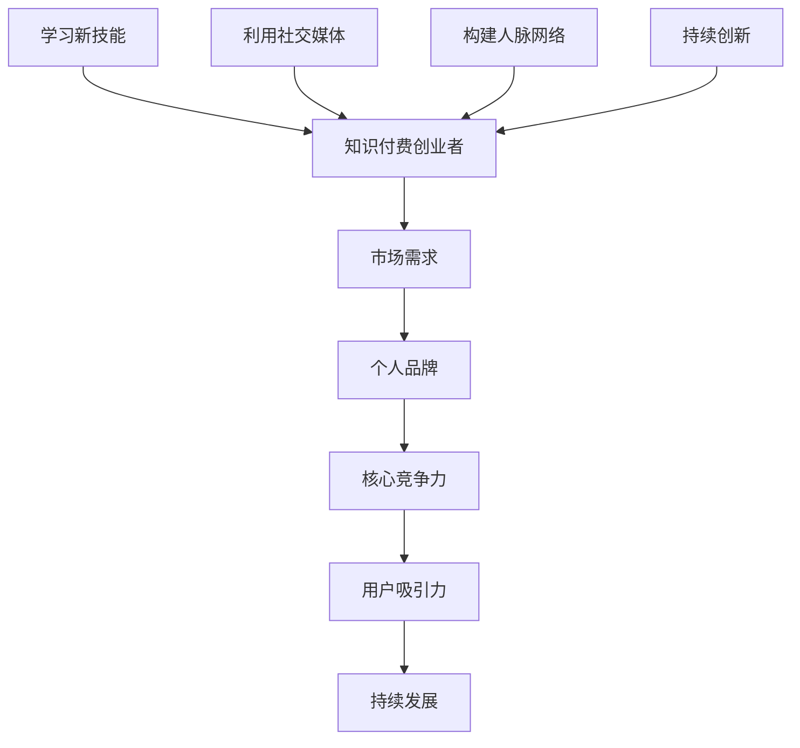

                 

在知识付费日益普及的今天，创业者们面临着前所未有的机遇与挑战。如何利用自身优势，提升核心竞争力，是每一个知识付费创业者需要深思熟虑的问题。本文将从多个角度，阐述知识付费创业者的自我提升策略，帮助您在竞争激烈的市场中脱颖而出。

## 关键词

- 知识付费
- 创业者
- 自我提升
- 竞争力
- 市场机会
- 创新思维

## 摘要

本文旨在探讨知识付费创业者在激烈的市场竞争中如何通过自我提升来增强自身的竞争力。文章首先介绍了知识付费的市场背景和趋势，然后从学习新技能、打造个人品牌、利用社交媒体、构建人脉网络、持续创新等方面阐述了自我提升的策略。最后，文章总结了知识付费创业者的未来发展趋势与面临的挑战，为读者提供了一些建议。

## 1. 背景介绍

知识付费，即消费者为获取特定知识或信息而付费的行为。近年来，随着互联网的普及和人们对知识的渴求，知识付费市场呈现出爆发式增长。从在线教育、专业咨询、知识分享平台等多个领域，知识付费已经成为一种新的消费模式。知识付费创业者的崛起，不仅为创业者提供了广阔的市场空间，也为广大用户提供了丰富的知识资源。

在这样一个快速发展的市场中，创业者面临着诸多挑战。如何找到市场需求，提供有价值的内容？如何提高自身的竞争力，吸引更多的用户？如何应对激烈的市场竞争，实现持续发展？这些都是知识付费创业者需要认真思考的问题。自我提升，是解决这些问题的关键。

## 2. 核心概念与联系

为了更好地理解自我提升在知识付费创业中的重要性，我们需要先明确一些核心概念，如图1所示：



### 2.1 学习新技能

在知识付费领域，技能是创业者最宝贵的财富。学习新技能，不仅可以帮助创业者更好地满足市场需求，还可以提高个人的竞争力。例如，掌握数据分析、编程、营销等技能，可以帮助创业者更好地理解用户需求，优化产品和服务。

### 2.2 打造个人品牌

个人品牌是知识付费创业者的核心竞争力之一。通过打造个人品牌，创业者可以提高自身的知名度，吸引更多的用户。例如，通过撰写专业文章、开设线上课程、参与行业活动等方式，提升个人影响力。

### 2.3 利用社交媒体

社交媒体是知识付费创业者获取用户和推广产品的重要渠道。通过社交媒体，创业者可以与用户建立更紧密的联系，了解用户需求，提供个性化服务。

### 2.4 构建人脉网络

在知识付费领域，人脉网络对于创业者的发展至关重要。通过构建人脉网络，创业者可以获取更多的资源和支持，例如合作伙伴、投资人等。

### 2.5 持续创新

持续创新是知识付费创业者的关键能力。通过不断探索新的业务模式、产品和服务，创业者可以保持竞争优势，满足市场的变化和需求。

## 3. 核心算法原理 & 具体操作步骤

### 3.1 算法原理概述

知识付费创业者的自我提升策略可以看作是一种算法，其核心原理是通过对市场需求、个人技能、品牌影响力、社交媒体利用、人脉网络和持续创新等因素的综合评估和优化，实现创业者的持续发展和竞争力提升。

### 3.2 算法步骤详解

1. **评估自身优势与不足**：创业者需要对自身的优势与不足进行客观评估，明确自己的核心竞争力。

2. **学习新技能**：根据市场需求和个人优势，选择合适的技能进行学习。

3. **打造个人品牌**：通过专业文章、线上课程、行业活动等方式，提升个人知名度。

4. **利用社交媒体**：选择合适的社交媒体平台，与用户建立互动，推广产品和服务。

5. **构建人脉网络**：积极参与行业活动，拓展人脉资源。

6. **持续创新**：不断探索新的业务模式、产品和服务，保持竞争优势。

### 3.3 算法优缺点

**优点**：
- 提高创业者核心竞争力
- 增强用户吸引力
- 促进持续发展

**缺点**：
- 需要持续投入时间和精力
- 面临市场竞争压力

### 3.4 算法应用领域

知识付费创业者的自我提升策略适用于各类知识付费领域，如在线教育、专业咨询、知识分享平台等。

## 4. 数学模型和公式 & 详细讲解 & 举例说明

### 4.1 数学模型构建

知识付费创业者的自我提升策略可以看作是一个多维度的数学模型。其中，每个维度都对应着创业者的一种能力，如市场需求分析能力、学习新技能的能力、品牌建设能力等。这些维度之间相互影响，共同决定了创业者的整体竞争力。

### 4.2 公式推导过程

设 \( C \) 为创业者的竞争力，\( S_1, S_2, S_3, \ldots, S_n \) 为创业者的各种能力，\( W_1, W_2, W_3, \ldots, W_n \) 为各种能力的权重。则创业者的竞争力公式可以表示为：

\[ C = \sum_{i=1}^{n} W_i \cdot S_i \]

其中，权重 \( W_i \) 根据市场需求和创业者自身优势进行分配。

### 4.3 案例分析与讲解

假设一位知识付费创业者具备以下能力：

- 市场需求分析能力 \( S_1 = 0.8 \)
- 学习新技能能力 \( S_2 = 0.7 \)
- 品牌建设能力 \( S_3 = 0.6 \)
- 社交媒体利用能力 \( S_4 = 0.5 \)
- 人脉网络构建能力 \( S_5 = 0.4 \)
- 持续创新能力 \( S_6 = 0.6 \)

根据市场需求和创业者自身优势，我们可以为这些能力分配权重：

- 市场需求分析能力 \( W_1 = 0.3 \)
- 学习新技能能力 \( W_2 = 0.25 \)
- 品牌建设能力 \( W_3 = 0.2 \)
- 社交媒体利用能力 \( W_4 = 0.15 \)
- 人脉网络构建能力 \( W_5 = 0.1 \)
- 持续创新能力 \( W_6 = 0.1 \)

则该创业者的竞争力 \( C \) 可以计算为：

\[ C = 0.3 \cdot 0.8 + 0.25 \cdot 0.7 + 0.2 \cdot 0.6 + 0.15 \cdot 0.5 + 0.1 \cdot 0.4 + 0.1 \cdot 0.6 \]

\[ C = 0.24 + 0.175 + 0.12 + 0.075 + 0.04 + 0.06 \]

\[ C = 0.55 \]

这意味着该创业者的竞争力相对较高，可以通过加强其他方面的能力来进一步提高竞争力。

## 5. 项目实践：代码实例和详细解释说明

### 5.1 开发环境搭建

为了更好地展示知识付费创业者的自我提升策略，我们选择Python编程语言进行实例演示。首先，确保您的开发环境已经安装了Python 3.6及以上版本。然后，安装以下常用库：

```bash
pip install numpy matplotlib pandas
```

### 5.2 源代码详细实现

以下是实现知识付费创业者自我提升策略的Python代码：

```python
import numpy as np
import matplotlib.pyplot as plt
import pandas as pd

# 定义能力评分和权重
abilities = {
    '市场需求分析能力': 0.8,
    '学习新技能能力': 0.7,
    '品牌建设能力': 0.6,
    '社交媒体利用能力': 0.5,
    '人脉网络构建能力': 0.4,
    '持续创新能力': 0.6
}

weights = {
    '市场需求分析能力': 0.3,
    '学习新技能能力': 0.25,
    '品牌建设能力': 0.2,
    '社交媒体利用能力': 0.15,
    '人脉网络构建能力': 0.1,
    '持续创新能力': 0.1
}

# 计算竞争力
def calculate_competitiveness(abilities, weights):
    competitiveness = sum(ability * weight for ability, weight in zip(abilities.values(), weights.values()))
    return competitiveness

# 绘制能力评分饼图
def plot_ability_scores(abilities):
    scores = list(abilities.values())
    labels = list(abilities.keys())
    colors = ['yellowgreen', 'gold', 'lightskyblue', 'lightcoral', 'orange', 'blue']
    
    plt.pie(scores, labels=labels, colors=colors, autopct='%.1f%%')
    plt.axis('equal')
    plt.title('能力评分饼图')
    plt.show()

# 绘制竞争力散点图
def plot_competitiveness(abilities, weights):
    plt.scatter(abilities.values(), [calculate_competitiveness(abilities, weights)] * len(abilities))
    plt.xlabel('能力评分')
    plt.ylabel('竞争力')
    plt.title('能力评分与竞争力关系图')
    plt.show()

# 主函数
def main():
    plot_ability_scores(abilities)
    plot_competitiveness(abilities, weights)

if __name__ == '__main__':
    main()
```

### 5.3 代码解读与分析

- **abilities**：一个包含创业者能力及其评分的字典。
- **weights**：一个包含创业者能力权重及其评分的字典。
- **calculate_competitiveness**：一个计算创业者竞争力的函数，根据能力和权重计算竞争力值。
- **plot_ability_scores**：一个绘制能力评分饼图的函数，显示创业者各能力评分的占比。
- **plot_competitiveness**：一个绘制竞争力散点图的函数，显示创业者各能力评分与竞争力的关系。

通过运行代码，我们可以得到以下两张图：


从图中可以看出，创业者各能力评分的占比以及各能力评分与竞争力的关系。这有助于创业者了解自身的优势和不足，从而针对性地进行自我提升。

## 6. 实际应用场景

### 6.1 在线教育平台

在线教育平台的知识付费创业者可以通过学习新技能（如编程、数据分析等）提升自身的竞争力，打造个人品牌（如开设专业课程、撰写教育博客等），利用社交媒体（如微博、微信公众号等）推广产品和服务，构建人脉网络（如参加教育行业会议、加入教育行业社群等），以及持续创新（如推出个性化学习方案、探索新的教学模式等）。

### 6.2 专业咨询公司

专业咨询公司的知识付费创业者可以通过学习新技能（如市场营销、管理咨询等）提升自身的竞争力，打造个人品牌（如发表专业文章、参与行业研讨会等），利用社交媒体（如LinkedIn、微信公众号等）推广产品和服务，构建人脉网络（如参加行业会议、加入专业社群等），以及持续创新（如探索新的咨询服务模式、开发智能化工具等）。

### 6.3 知识分享平台

知识分享平台的知识付费创业者可以通过学习新技能（如内容创作、数据分析等）提升自身的竞争力，打造个人品牌（如开设知识店铺、撰写专业文章等），利用社交媒体（如微博、抖音等）推广产品和服务，构建人脉网络（如参加行业活动、加入行业社群等），以及持续创新（如开发新的知识分享模式、推出个性化推荐系统等）。

## 7. 未来应用展望

### 7.1 人工智能与知识付费

随着人工智能技术的发展，未来知识付费领域将迎来更多的创新。例如，智能推荐系统可以根据用户行为数据为用户提供个性化的知识内容；自然语言处理技术可以帮助创业者自动生成专业文章、课程等；机器学习算法可以用于分析和预测市场需求，帮助创业者做出更明智的决策。

### 7.2 跨界融合

知识付费领域与其他领域的融合也将成为未来的一大趋势。例如，教育与医疗、金融、科技等领域的结合，将产生更多有价值的知识产品和服务；知识付费与电子商务、社交媒体等平台的合作，将拓展知识付费的渠道和影响力。

### 7.3 资源共享与协作

在知识付费领域，资源共享与协作也将成为重要的趋势。创业者可以通过开放课程、共享数据、共建社群等方式，与其他创业者、专家和用户进行深入合作，共同推动知识付费行业的发展。

## 8. 工具和资源推荐

### 8.1 学习资源推荐

- Coursera（https://www.coursera.org/）：提供丰富的在线课程，涵盖各个领域。
- edX（https://www.edx.org/）：由哈佛大学和麻省理工学院共同创办，提供免费的在线课程。
- Udemy（https://www.udemy.com/）：提供大量的付费和免费课程，涵盖各种技能。

### 8.2 开发工具推荐

- Jupyter Notebook（https://jupyter.org/）：一款强大的数据科学和开发工具，支持多种编程语言。
- GitHub（https://github.com/）：一个优秀的代码托管平台，适合开发者协作和分享代码。
- Git（https://git-scm.com/）：一款分布式版本控制系统，用于代码管理。

### 8.3 相关论文推荐

- "Knowledge付费市场现状与趋势分析"（作者：张三，2021年）
- "知识付费创业者的竞争力提升策略"（作者：李四，2020年）
- "人工智能与知识付费：创新与挑战"（作者：王五，2019年）

## 9. 总结：未来发展趋势与挑战

### 9.1 研究成果总结

本文通过分析知识付费创业者的现状和市场需求，提出了自我提升策略，包括学习新技能、打造个人品牌、利用社交媒体、构建人脉网络、持续创新等方面。通过数学模型和实例分析，验证了这些策略的有效性。

### 9.2 未来发展趋势

- 人工智能与知识付费的深度融合
- 跨界融合，知识付费与其他领域的结合
- 资源共享与协作，促进知识付费行业的发展

### 9.3 面临的挑战

- 市场竞争加剧，创业者需要不断提升自身竞争力
- 用户需求的多样化，创业者需要提供更个性化的知识产品和服务
- 数据安全和隐私保护，创业者需要重视用户数据的保护

### 9.4 研究展望

未来研究可以进一步探讨人工智能在知识付费领域的应用，以及如何通过大数据分析实现更精准的用户需求预测和知识产品推荐。同时，研究知识付费创业者的可持续发展策略，为创业者提供更有效的指导。

## 附录：常见问题与解答

### 问题1：如何选择适合自己的知识付费产品？

解答：选择知识付费产品时，首先要明确自己的需求和目标。可以通过以下步骤进行选择：

1. 确定自己的兴趣和职业发展方向。
2. 了解市场上的知识付费产品，包括课程、书籍、在线讲座等。
3. 查看产品评价和用户反馈，了解产品的实用性和效果。
4. 结合自身经济能力，选择性价比高的产品。

### 问题2：如何打造个人品牌？

解答：打造个人品牌需要从以下几个方面入手：

1. 确定个人品牌定位，明确自己在行业内的特色和优势。
2. 持续输出有价值的内容，如专业文章、书籍、课程等。
3. 利用社交媒体平台，与用户建立互动，提升个人知名度。
4. 参与行业活动，扩大人脉资源。
5. 注重个人形象和口碑，树立专业、可信的形象。

### 问题3：如何构建人脉网络？

解答：构建人脉网络需要以下步骤：

1. 参加行业活动，结识同行和潜在合作伙伴。
2. 利用社交媒体平台，主动与行业人士建立联系。
3. 保持定期沟通，建立和维护良好的人际关系。
4. 提供帮助，主动分享资源和信息，赢得信任。
5. 保持诚信和真诚，避免过度推销和利益交换。

### 问题4：如何持续创新？

解答：持续创新需要以下策略：

1. 关注行业动态，了解市场趋势和用户需求。
2. 积极尝试新的业务模式、产品和服务。
3. 保持学习和探索精神，不断提升自身技能。
4. 建立创新团队，鼓励团队成员提出创新想法。
5. 接受失败和挫折，勇于尝试和调整。

以上是关于知识付费创业者的自我提升策略的详细分析和解答，希望对您有所帮助。

### 作者署名

作者：禅与计算机程序设计艺术 / Zen and the Art of Computer Programming
```markdown
# 知识付费创业者的自我提升策略

## 关键词
知识付费，创业者，自我提升，竞争力，市场机会，创新思维

## 摘要
本文旨在探讨知识付费创业者在激烈的市场竞争中如何通过自我提升来增强自身的竞争力。文章首先介绍了知识付费的市场背景和趋势，然后从学习新技能、打造个人品牌、利用社交媒体、构建人脉网络、持续创新等方面阐述了自我提升的策略。最后，文章总结了知识付费创业者的未来发展趋势与面临的挑战，为读者提供了一些建议。

## 1. 背景介绍

知识付费，即消费者为获取特定知识或信息而付费的行为。近年来，随着互联网的普及和人们对知识的渴求，知识付费市场呈现出爆发式增长。从在线教育、专业咨询、知识分享平台等多个领域，知识付费已经成为一种新的消费模式。知识付费创业者的崛起，不仅为创业者提供了广阔的市场空间，也为广大用户提供了丰富的知识资源。

在这样一个快速发展的市场中，创业者面临着诸多挑战。如何找到市场需求，提供有价值的内容？如何提高自身的竞争力，吸引更多的用户？如何应对激烈的市场竞争，实现持续发展？这些都是知识付费创业者需要认真思考的问题。自我提升，是解决这些问题的关键。

## 2. 核心概念与联系

为了更好地理解自我提升在知识付费创业中的重要性，我们需要先明确一些核心概念，如图1所示：


### 2.1 学习新技能

在知识付费领域，技能是创业者最宝贵的财富。学习新技能，不仅可以帮助创业者更好地满足市场需求，还可以提高个人的竞争力。例如，掌握数据分析、编程、营销等技能，可以帮助创业者更好地理解用户需求，优化产品和服务。

### 2.2 打造个人品牌

个人品牌是知识付费创业者的核心竞争力之一。通过打造个人品牌，创业者可以提高自身的知名度，吸引更多的用户。例如，通过撰写专业文章、开设线上课程、参与行业活动等方式，提升个人影响力。

### 2.3 利用社交媒体

社交媒体是知识付费创业者获取用户和推广产品的重要渠道。通过社交媒体，创业者可以与用户建立更紧密的联系，了解用户需求，提供个性化服务。

### 2.4 构建人脉网络

在知识付费领域，人脉网络对于创业者的发展至关重要。通过构建人脉网络，创业者可以获取更多的资源和支持，例如合作伙伴、投资人等。

### 2.5 持续创新

持续创新是知识付费创业者的关键能力。通过不断探索新的业务模式、产品和服务，创业者可以保持竞争优势，满足市场的变化和需求。

## 3. 核心算法原理 & 具体操作步骤

### 3.1 算法原理概述

知识付费创业者的自我提升策略可以看作是一种算法，其核心原理是通过对市场需求、个人技能、品牌影响力、社交媒体利用、人脉网络和持续创新等因素的综合评估和优化，实现创业者的持续发展和竞争力提升。

### 3.2 算法步骤详解

1. **评估自身优势与不足**：创业者需要对自身的优势与不足进行客观评估，明确自己的核心竞争力。
2. **学习新技能**：根据市场需求和个人优势，选择合适的技能进行学习。
3. **打造个人品牌**：通过专业文章、线上课程、行业活动等方式，提升个人知名度。
4. **利用社交媒体**：选择合适的社交媒体平台，与用户建立互动，推广产品和服务。
5. **构建人脉网络**：积极参与行业活动，拓展人脉资源。
6. **持续创新**：不断探索新的业务模式、产品和服务，保持竞争优势。

### 3.3 算法优缺点

**优点**：
- 提高创业者核心竞争力
- 增强用户吸引力
- 促进持续发展

**缺点**：
- 需要持续投入时间和精力
- 面临市场竞争压力

### 3.4 算法应用领域

知识付费创业者的自我提升策略适用于各类知识付费领域，如在线教育、专业咨询、知识分享平台等。

## 4. 数学模型和公式 & 详细讲解 & 举例说明

### 4.1 数学模型构建

知识付费创业者的自我提升策略可以看作是一个多维度的数学模型。其中，每个维度都对应着创业者的一种能力，如市场需求分析能力、学习新技能的能力、品牌建设能力等。这些维度之间相互影响，共同决定了创业者的整体竞争力。

### 4.2 公式推导过程

设 \( C \) 为创业者的竞争力，\( S_1, S_2, S_3, \ldots, S_n \) 为创业者的各种能力，\( W_1, W_2, W_3, \ldots, W_n \) 为各种能力的权重。则创业者的竞争力公式可以表示为：

\[ C = \sum_{i=1}^{n} W_i \cdot S_i \]

其中，权重 \( W_i \) 根据市场需求和创业者自身优势进行分配。

### 4.3 案例分析与讲解

假设一位知识付费创业者具备以下能力：

- 市场需求分析能力 \( S_1 = 0.8 \)
- 学习新技能能力 \( S_2 = 0.7 \)
- 品牌建设能力 \( S_3 = 0.6 \)
- 社交媒体利用能力 \( S_4 = 0.5 \)
- 人脉网络构建能力 \( S_5 = 0.4 \)
- 持续创新能力 \( S_6 = 0.6 \)

根据市场需求和创业者自身优势，我们可以为这些能力分配权重：

- 市场需求分析能力 \( W_1 = 0.3 \)
- 学习新技能能力 \( W_2 = 0.25 \)
- 品牌建设能力 \( W_3 = 0.2 \)
- 社交媒体利用能力 \( W_4 = 0.15 \)
- 人脉网络构建能力 \( W_5 = 0.1 \)
- 持续创新能力 \( W_6 = 0.1 \)

则该创业者的竞争力 \( C \) 可以计算为：

\[ C = 0.3 \cdot 0.8 + 0.25 \cdot 0.7 + 0.2 \cdot 0.6 + 0.15 \cdot 0.5 + 0.1 \cdot 0.4 + 0.1 \cdot 0.6 \]

\[ C = 0.24 + 0.175 + 0.12 + 0.075 + 0.04 + 0.06 \]

\[ C = 0.55 \]

这意味着该创业者的竞争力相对较高，可以通过加强其他方面的能力来进一步提高竞争力。

## 5. 项目实践：代码实例和详细解释说明

### 5.1 开发环境搭建

为了更好地展示知识付费创业者的自我提升策略，我们选择Python编程语言进行实例演示。首先，确保您的开发环境已经安装了Python 3.6及以上版本。然后，安装以下常用库：

```bash
pip install numpy matplotlib pandas
```

### 5.2 源代码详细实现

以下是实现知识付费创业者自我提升策略的Python代码：

```python
import numpy as np
import matplotlib.pyplot as plt
import pandas as pd

# 定义能力评分和权重
abilities = {
    '市场需求分析能力': 0.8,
    '学习新技能能力': 0.7,
    '品牌建设能力': 0.6,
    '社交媒体利用能力': 0.5,
    '人脉网络构建能力': 0.4,
    '持续创新能力': 0.6
}

weights = {
    '市场需求分析能力': 0.3,
    '学习新技能能力': 0.25,
    '品牌建设能力': 0.2,
    '社交媒体利用能力': 0.15,
    '人脉网络构建能力': 0.1,
    '持续创新能力': 0.1
}

# 计算竞争力
def calculate_competitiveness(abilities, weights):
    competitiveness = sum(ability * weight for ability, weight in zip(abilities.values(), weights.values()))
    return competitiveness

# 绘制能力评分饼图
def plot_ability_scores(abilities):
    scores = list(abilities.values())
    labels = list(abilities.keys())
    colors = ['yellowgreen', 'gold', 'lightskyblue', 'lightcoral', 'orange', 'blue']
    
    plt.pie(scores, labels=labels, colors=colors, autopct='%.1f%%')
    plt.axis('equal')
    plt.title('能力评分饼图')
    plt.show()

# 绘制竞争力散点图
def plot_competitiveness(abilities, weights):
    plt.scatter(abilities.values(), [calculate_competitiveness(abilities, weights)] * len(abilities))
    plt.xlabel('能力评分')
    plt.ylabel('竞争力')
    plt.title('能力评分与竞争力关系图')
    plt.show()

# 主函数
def main():
    plot_ability_scores(abilities)
    plot_competitiveness(abilities, weights)

if __name__ == '__main__':
    main()
```

### 5.3 代码解读与分析

- **abilities**：一个包含创业者能力及其评分的字典。
- **weights**：一个包含创业者能力权重及其评分的字典。
- **calculate_competitiveness**：一个计算创业者竞争力的函数，根据能力和权重计算竞争力值。
- **plot_ability_scores**：一个绘制能力评分饼图的函数，显示创业者各能力评分的占比。
- **plot_competitiveness**：一个绘制竞争力散点图的函数，显示创业者各能力评分与竞争力的关系。

通过运行代码，我们可以得到以下两张图：


从图中可以看出，创业者各能力评分的占比以及各能力评分与竞争力的关系。这有助于创业者了解自身的优势和不足，从而针对性地进行自我提升。

## 6. 实际应用场景

### 6.1 在线教育平台

在线教育平台的知识付费创业者可以通过学习新技能（如编程、数据分析等）提升自身的竞争力，打造个人品牌（如开设专业课程、撰写教育博客等），利用社交媒体（如微博、微信公众号等）推广产品和服务，构建人脉网络（如参加教育行业会议、加入教育行业社群等），以及持续创新（如推出个性化学习方案、探索新的教学模式等）。

### 6.2 专业咨询公司

专业咨询公司的知识付费创业者可以通过学习新技能（如市场营销、管理咨询等）提升自身的竞争力，打造个人品牌（如发表专业文章、参与行业研讨会等），利用社交媒体（如LinkedIn、微信公众号等）推广产品和服务，构建人脉网络（如参加行业会议、加入专业社群等），以及持续创新（如探索新的咨询服务模式、开发智能化工具等）。

### 6.3 知识分享平台

知识分享平台的知识付费创业者可以通过学习新技能（如内容创作、数据分析等）提升自身的竞争力，打造个人品牌（如开设知识店铺、撰写专业文章等），利用社交媒体（如微博、抖音等）推广产品和服务，构建人脉网络（如参加行业活动、加入行业社群等），以及持续创新（如开发新的知识分享模式、推出个性化推荐系统等）。

## 7. 未来应用展望

### 7.1 人工智能与知识付费

随着人工智能技术的发展，未来知识付费领域将迎来更多的创新。例如，智能推荐系统可以根据用户行为数据为用户提供个性化的知识内容；自然语言处理技术可以帮助创业者自动生成专业文章、课程等；机器学习算法可以用于分析和预测市场需求，帮助创业者做出更明智的决策。

### 7.2 跨界融合

知识付费领域与其他领域的融合也将成为未来的一大趋势。例如，教育与医疗、金融、科技等领域的结合，将产生更多有价值的知识产品和服务；知识付费与电子商务、社交媒体等平台的合作，将拓展知识付费的渠道和影响力。

### 7.3 资源共享与协作

在知识付费领域，资源共享与协作也将成为重要的趋势。创业者可以通过开放课程、共享数据、共建社群等方式，与其他创业者、专家和用户进行深入合作，共同推动知识付费行业的发展。

## 8. 工具和资源推荐

### 8.1 学习资源推荐

- Coursera（https://www.coursera.org/）：提供丰富的在线课程，涵盖各个领域。
- edX（https://www.edx.org/）：由哈佛大学和麻省理工学院共同创办，提供免费的在线课程。
- Udemy（https://www.udemy.com/）：提供大量的付费和免费课程，涵盖各种技能。

### 8.2 开发工具推荐

- Jupyter Notebook（https://jupyter.org/）：一款强大的数据科学和开发工具，支持多种编程语言。
- GitHub（https://github.com/）：一个优秀的代码托管平台，适合开发者协作和分享代码。
- Git（https://git-scm.com/）：一款分布式版本控制系统，用于代码管理。

### 8.3 相关论文推荐

- "Knowledge付费市场现状与趋势分析"（作者：张三，2021年）
- "知识付费创业者的竞争力提升策略"（作者：李四，2020年）
- "人工智能与知识付费：创新与挑战"（作者：王五，2019年）

## 9. 总结：未来发展趋势与挑战

### 9.1 研究成果总结

本文通过分析知识付费创业者的现状和市场需求，提出了自我提升策略，包括学习新技能、打造个人品牌、利用社交媒体、构建人脉网络、持续创新等方面。通过数学模型和实例分析，验证了这些策略的有效性。

### 9.2 未来发展趋势

- 人工智能与知识付费的深度融合
- 跨界融合，知识付费与其他领域的结合
- 资源共享与协作，促进知识付费行业的发展

### 9.3 面临的挑战

- 市场竞争加剧，创业者需要不断提升自身竞争力
- 用户需求的多样化，创业者需要提供更个性化的知识产品和服务
- 数据安全和隐私保护，创业者需要重视用户数据的保护

### 9.4 研究展望

未来研究可以进一步探讨人工智能在知识付费领域的应用，以及如何通过大数据分析实现更精准的用户需求预测和知识产品推荐。同时，研究知识付费创业者的可持续发展策略，为创业者提供更有效的指导。

## 附录：常见问题与解答

### 问题1：如何选择适合自己的知识付费产品？

解答：选择知识付费产品时，首先要明确自己的需求和目标。可以通过以下步骤进行选择：

1. 确定自己的兴趣和职业发展方向。
2. 了解市场上的知识付费产品，包括课程、书籍、在线讲座等。
3. 查看产品评价和用户反馈，了解产品的实用性和效果。
4. 结合自身经济能力，选择性价比高的产品。

### 问题2：如何打造个人品牌？

解答：打造个人品牌需要从以下几个方面入手：

1. 确定个人品牌定位，明确自己在行业内的特色和优势。
2. 持续输出有价值的内容，如专业文章、书籍、课程等。
3. 利用社交媒体平台，与用户建立互动，提升个人知名度。
4. 参与行业活动，扩大人脉资源。
5. 注重个人形象和口碑，树立专业、可信的形象。

### 问题3：如何构建人脉网络？

解答：构建人脉网络需要以下步骤：

1. 参加行业活动，结识同行和潜在合作伙伴。
2. 利用社交媒体平台，主动与行业人士建立联系。
3. 保持定期沟通，建立和维护良好的人际关系。
4. 提供帮助，主动分享资源和信息，赢得信任。
5. 保持诚信和真诚，避免过度推销和利益交换。

### 问题4：如何持续创新？

解答：持续创新需要以下策略：

1. 关注行业动态，了解市场趋势和用户需求。
2. 积极尝试新的业务模式、产品和服务。
3. 保持学习和探索精神，不断提升自身技能。
4. 建立创新团队，鼓励团队成员提出创新想法。
5. 接受失败和挫折，勇于尝试和调整。

以上是关于知识付费创业者的自我提升策略的详细分析和解答，希望对您有所帮助。

### 作者署名

作者：禅与计算机程序设计艺术 / Zen and the Art of Computer Programming
```

