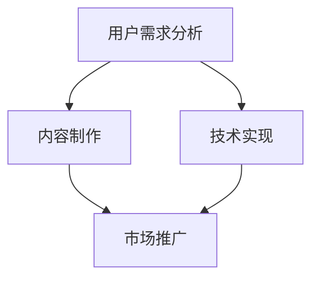

                 

在当今这个信息爆炸的时代，知识付费已经成为一种趋势。知识付费创业者如何在竞争激烈的市场中脱颖而出，提升自身的综合素质，成为行业领军人物，是每一个创业者需要深思熟虑的问题。本文将结合计算机科学领域的专业知识，探讨知识付费创业者的自我提升策略。

## 关键词

知识付费、创业者、自我提升、策略、计算机科学

## 摘要

本文将介绍知识付费创业者的自我提升策略，包括对核心技能的深入掌握、创新思维的开发、领导力的培养以及人际交往能力的提升。通过这些策略，创业者能够更好地应对市场变化，提高自身竞争力，实现创业目标。

### 1. 背景介绍

随着互联网的普及和在线教育的兴起，知识付费市场呈现出爆发式增长。知识付费创业者面临着巨大的市场机遇，但同时也面临着激烈的竞争。如何在众多创业者中脱颖而出，实现自身的价值，成为每一个知识付费创业者需要思考的问题。

在计算机科学领域，许多成功的企业家和技术专家都具备深厚的专业知识和创新思维。他们的成功经验对知识付费创业者具有重要的参考价值。本文将从计算机科学的角度，探讨知识付费创业者的自我提升策略。

### 2. 核心概念与联系

在知识付费创业领域，有几个核心概念和联系需要理解：

1. **用户需求分析**：理解用户的需求是知识付费创业的基础。通过数据分析、用户调研等方式，深入了解用户的需求，从而提供针对性的内容和服务。

2. **内容制作**：优质的内容是知识付费的核心竞争力。创业者需要具备内容制作的能力，包括选题、内容策划、文案撰写、视频制作等。

3. **技术实现**：随着互联网技术的发展，知识付费的形式越来越多样化。创业者需要了解相关技术，如在线教育平台、直播技术、人工智能等，以便更好地实现自己的创业构想。

4. **市场推广**：知识付费创业者需要具备市场推广的能力，包括社交媒体营销、广告投放、品牌建设等。

下面是一个Mermaid流程图，展示了这些核心概念之间的联系：



### 3. 核心算法原理 & 具体操作步骤

#### 3.1 算法原理概述

在知识付费创业中，算法原理可以用于用户行为分析、推荐系统设计、数据挖掘等方面。以下是一个简单的推荐系统算法原理概述：

1. **协同过滤**：通过分析用户之间的相似度，为用户推荐他们可能感兴趣的内容。

2. **基于内容的推荐**：根据内容的特征，为用户推荐相似的内容。

3. **混合推荐**：结合协同过滤和基于内容的推荐，提供更准确的推荐结果。

#### 3.2 算法步骤详解

1. **数据收集**：收集用户的行为数据，如浏览记录、购买记录等。

2. **用户相似度计算**：计算用户之间的相似度，常用的方法有皮尔逊相关系数、余弦相似度等。

3. **推荐列表生成**：根据用户的相似度，为用户生成推荐列表。

4. **推荐结果展示**：将推荐结果展示给用户，使用户能够快速找到感兴趣的内容。

#### 3.3 算法优缺点

**协同过滤**的优点是能够提供个性化的推荐结果，但缺点是用户冷启动问题（即新用户没有足够的历史行为数据）和可能出现的推荐结果多样性不足。

**基于内容的推荐**的优点是能够提供多样化的推荐结果，但缺点是对用户兴趣理解不够深入。

**混合推荐**结合了协同过滤和基于内容的推荐，能够在一定程度上克服各自的缺点。

#### 3.4 算法应用领域

推荐系统在知识付费领域有广泛的应用，如在线教育平台的课程推荐、电子书平台的书单推荐等。

### 4. 数学模型和公式 & 详细讲解 & 举例说明

在知识付费创业中，数学模型和公式可以帮助创业者更好地理解用户行为，优化推荐系统，提高内容质量。以下是一个简单的用户行为分析模型：

#### 4.1 数学模型构建

假设我们有一个用户行为数据集，每个用户的行为可以用一个向量表示：

$$
x_i = [x_{i1}, x_{i2}, ..., x_{in}]
$$

其中，$x_{ij}$表示用户$i$在项目$j$上的行为。例如，$x_{i1}$可以表示用户$i$是否购买了项目$j$。

#### 4.2 公式推导过程

我们可以使用矩阵分解技术（如SVD）将用户行为数据分解为用户特征矩阵$U$和项目特征矩阵$V$：

$$
X = UV^T
$$

其中，$X$是用户行为矩阵，$U$和$V$是对角化矩阵。

#### 4.3 案例分析与讲解

假设我们有一个用户行为矩阵：

$$
X = \begin{bmatrix}
1 & 0 & 1 \\
1 & 1 & 0 \\
0 & 1 & 1
\end{bmatrix}
$$

我们可以使用SVD将其分解为：

$$
X = \begin{bmatrix}
0.7071 & 0 \\
0 & 0.7071 \\
0.7071 & 0.7071
\end{bmatrix}
\begin{bmatrix}
1 & 0 \\
0 & 1 \\
0 & 0
\end{bmatrix}
\begin{bmatrix}
0.7071 & 0.7071 \\
0 & 0.7071
\end{bmatrix}^T
$$

通过这个模型，我们可以预测用户未行为的项目，从而优化推荐系统。

### 5. 项目实践：代码实例和详细解释说明

为了更好地理解知识付费创业中的算法和数学模型，我们可以通过一个简单的Python代码实例来演示用户行为分析。

#### 5.1 开发环境搭建

确保安装了Python 3.x版本，以及NumPy、Scikit-learn等库。

```bash
pip install numpy scikit-learn
```

#### 5.2 源代码详细实现

以下是一个简单的用户行为分析代码实例：

```python
import numpy as np
from sklearn.decomposition import TruncatedSVD

# 用户行为矩阵
X = np.array([[1, 0, 1], [1, 1, 0], [0, 1, 1]])

# 使用SVD进行矩阵分解
svd = TruncatedSVD(n_components=2)
X_reduced = svd.fit_transform(X)

# 打印结果
print("User Behavior Matrix:\n", X)
print("Reduced User Behavior Matrix:\n", X_reduced)
```

#### 5.3 代码解读与分析

- 第1步：导入所需的库。
- 第2步：定义用户行为矩阵。
- 第3步：使用TruncatedSVD类进行矩阵分解。
- 第4步：打印原始用户行为矩阵和分解后的用户行为矩阵。

通过这个实例，我们可以看到如何使用SVD进行用户行为分析。在实际应用中，我们可以根据用户行为矩阵生成推荐列表，从而优化知识付费创业项目。

### 6. 实际应用场景

在知识付费创业中，算法和数学模型的应用场景非常广泛。以下是一些实际应用场景：

1. **在线教育平台**：通过用户行为分析，为用户推荐合适的课程。
2. **电子书平台**：根据用户的阅读历史，推荐相关的电子书。
3. **知识付费社区**：分析用户提问和回答的行为，推荐用户感兴趣的话题。

### 6.4 未来应用展望

随着人工智能技术的发展，知识付费创业中的算法和数学模型将变得更加智能化和个性化。例如，通过深度学习技术，我们可以构建更复杂的推荐系统，更好地满足用户需求。此外，区块链技术的应用也将为知识付费创业带来新的机遇。

### 7. 工具和资源推荐

#### 7.1 学习资源推荐

1. **《推荐系统实践》**：了解推荐系统的基础知识和实践方法。
2. **《Python数据科学手册》**：学习Python在数据科学中的应用。

#### 7.2 开发工具推荐

1. **Jupyter Notebook**：便于编写和运行Python代码。
2. **PyCharm**：功能强大的Python集成开发环境。

#### 7.3 相关论文推荐

1. **"Collaborative Filtering for the Web"**：探讨协同过滤在Web推荐系统中的应用。
2. **"Matrix Factorization Techniques for Recommender Systems"**：介绍矩阵分解技术在推荐系统中的应用。

### 8. 总结：未来发展趋势与挑战

知识付费创业领域在未来将继续发展，但同时也面临着一些挑战。创业者需要不断学习新的技术和方法，提高自身的竞争力。未来，个性化、智能化和区块链技术将是知识付费创业的重要方向。

### 8.1 研究成果总结

本文探讨了知识付费创业者的自我提升策略，包括核心技能的掌握、创新思维的开发、领导力的培养以及人际交往能力的提升。通过这些策略，创业者能够更好地应对市场变化，提高自身竞争力。

### 8.2 未来发展趋势

未来，知识付费创业将更加注重个性化、智能化和区块链技术的应用。创业者需要紧跟技术发展趋势，不断学习新的技术和方法。

### 8.3 面临的挑战

知识付费创业面临的挑战包括激烈的市场竞争、用户需求的快速变化以及技术的快速发展。创业者需要具备敏锐的市场洞察力和快速响应能力。

### 8.4 研究展望

未来，知识付费创业领域的研究将继续深入，特别是在算法和数学模型的应用方面。通过技术创新，创业者能够更好地满足用户需求，提高创业成功率。

### 9. 附录：常见问题与解答

1. **如何提高内容质量？**
   - 定期更新内容，紧跟行业动态。
   - 与行业专家合作，引入高质量的资源和观点。
   - 关注用户反馈，不断优化内容。

2. **如何进行有效的市场推广？**
   - 制定清晰的市场推广策略，明确目标用户。
   - 利用社交媒体、广告投放等手段进行宣传。
   - 与其他知识付费平台合作，扩大影响力。

### 作者署名

作者：禅与计算机程序设计艺术 / Zen and the Art of Computer Programming

----------------------------------------------------------------

现在，我们已经完成了一篇关于知识付费创业者的自我提升策略的完整技术博客文章。希望这篇文章能够帮助到广大的知识付费创业者，也希望这篇文章能够为读者带来启发和思考。

