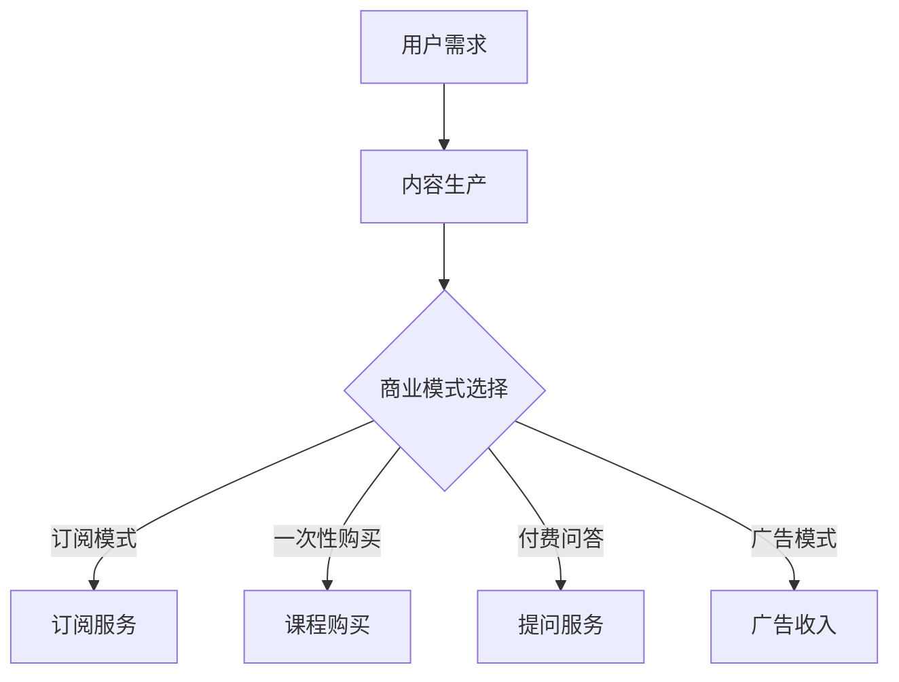

                 

关键词：知识付费、知识变现、商业模式、技术创业、在线教育

摘要：在互联网时代，知识付费逐渐成为一股重要的商业模式。本文将探讨知识付费创业的背景、核心概念、算法原理、数学模型、项目实践以及未来应用展望，旨在为有志于知识付费领域的创业者提供有益的参考。

## 1. 背景介绍

近年来，随着互联网的普及和信息技术的飞速发展，知识付费市场呈现出爆炸式增长。用户对于个性化、专业化、高质量的知识内容需求日益旺盛，这为创业者提供了广阔的机遇。知识付费不仅涵盖了传统的在线教育、专业咨询、知识分享等多种形式，还渗透到了生活的各个领域，如技能培训、健康咨询、心理辅导等。

### 1.1 市场规模

据相关数据显示，全球知识付费市场规模已突破千亿美元，并有望在未来几年继续保持高速增长。尤其是在中国，随着“知识就是力量”理念的深入人心，越来越多的用户愿意为优质的知识内容付费。

### 1.2 用户需求

用户需求是推动知识付费市场发展的根本动力。当前，用户对于知识的需求呈现出以下几个特点：

- **个性化**：用户希望根据自己的兴趣和需求，选择个性化的知识内容。
- **专业化**：用户对知识的深度和广度要求越来越高，希望获得专业化、权威的知识服务。
- **便捷性**：用户希望知识内容能够随时随地获取，方便快捷。

### 1.3 行业趋势

知识付费行业正在发生深刻变革，主要趋势包括：

- **内容多样化**：知识内容不再局限于文字和图片，短视频、直播、VR 等形式逐渐受到用户青睐。
- **平台化**：知识付费平台逐渐成为行业主流，提供一站式服务，包括内容生产、分发、交易等。
- **智能化**：人工智能技术逐步应用于知识付费领域，为用户提供个性化推荐、智能问答等服务。

## 2. 核心概念与联系

### 2.1 知识付费

知识付费是指用户为获取优质知识内容而支付的费用。在知识付费模式下，知识内容生产者通过平台将知识内容变现，实现知识价值。

### 2.2 知识变现

知识变现是指将知识转化为经济利益的过程。知识变现的途径包括在线教育、专业咨询、知识分享等。

### 2.3 商业模式

知识付费的商业模式包括以下几种：

- **订阅模式**：用户支付一定费用，获得长期的知识内容服务。
- **一次性购买**：用户为单个知识产品或课程支付费用。
- **付费问答**：用户向专家或知识达人提问，支付相应费用。
- **广告模式**：知识平台通过展示广告获得收入。

### 2.4 Mermaid 流程图



## 3. 核心算法原理 & 具体操作步骤

### 3.1 算法原理概述

知识付费创业的核心算法主要包括用户画像、内容推荐和交易支付三个环节。

- **用户画像**：通过用户行为数据、兴趣标签等，构建用户画像，为个性化推荐提供基础。
- **内容推荐**：基于用户画像和内容特征，利用推荐算法为用户推荐合适的知识内容。
- **交易支付**：实现知识内容的购买和支付功能，确保交易安全、便捷。

### 3.2 算法步骤详解

#### 3.2.1 用户画像构建

1. 收集用户行为数据，如浏览历史、购买记录、互动行为等。
2. 对行为数据进行清洗、去重和处理，提取有效特征。
3. 构建用户画像库，为后续推荐和交易提供基础。

#### 3.2.2 内容推荐

1. 收集知识内容特征数据，如标签、分类、评分等。
2. 利用协同过滤、内容推荐等算法，生成推荐结果。
3. 根据用户画像和推荐结果，生成个性化推荐列表。

#### 3.2.3 交易支付

1. 搭建支付系统，支持多种支付方式，如支付宝、微信支付等。
2. 确保交易安全，采用加密、认证等技术手段。
3. 完成交易流程，记录交易数据和用户评价。

### 3.3 算法优缺点

#### 优点：

- **个性化推荐**：提高用户满意度，增加用户粘性。
- **高效交易**：简化交易流程，提高交易效率。
- **知识变现**：为知识内容生产者提供收益渠道。

#### 缺点：

- **数据隐私**：用户行为数据隐私保护问题。
- **算法公平性**：算法可能存在偏见，影响推荐结果。
- **技术门槛**：算法和系统开发需要较高技术能力。

### 3.4 算法应用领域

知识付费创业算法可以应用于以下领域：

- **在线教育**：为用户提供个性化课程推荐，提高学习效果。
- **专业咨询**：为用户提供专家推荐，提高咨询效率。
- **知识分享**：为用户提供内容推荐，促进知识传播。

## 4. 数学模型和公式 & 详细讲解 & 举例说明

### 4.1 数学模型构建

知识付费创业的核心数学模型主要包括用户画像构建模型、推荐算法模型和交易支付模型。

### 4.2 公式推导过程

#### 4.2.1 用户画像构建模型

假设用户 $u$ 的行为数据为 $X_u = [x_{u1}, x_{u2}, ..., x_{un}]$，其中 $x_{ui}$ 表示用户 $u$ 在行为 $i$ 上的评分。用户画像 $P_u$ 可以通过以下公式构建：

$$
P_u = \frac{1}{\sum_{i=1}^{n} x_{ui}} \cdot X_u
$$

#### 4.2.2 推荐算法模型

假设知识内容 $c$ 的特征向量为 $Q_c = [q_{c1}, q_{c2}, ..., q_{cm}]$，用户 $u$ 的画像向量为 $P_u$。推荐算法的评分预测公式为：

$$
r_{uc} = P_u \cdot Q_c = \sum_{i=1}^{n} p_{ui} \cdot q_{ci}
$$

#### 4.2.3 交易支付模型

假设知识内容 $c$ 的价格为 $P_c$，用户 $u$ 的支付能力为 $R_u$。交易支付模型可以通过以下公式实现：

$$
R_u \geq P_c \cdot r_{uc}
$$

### 4.3 案例分析与讲解

#### 4.3.1 用户画像构建

假设用户 $u_1$ 的行为数据如下：

| 行为 | 评分 |
| ---- | ---- |
| 浏览历史 | 3 |
| 购买记录 | 4 |
| 互动行为 | 5 |

用户画像 $P_{u_1}$ 为：

$$
P_{u_1} = \frac{1}{3+4+5} \cdot [3, 4, 5] = \frac{1}{12} \cdot [3, 4, 5] = [0.25, 0.33, 0.42]
$$

#### 4.3.2 内容推荐

假设知识内容 $c_1$ 的特征向量如下：

| 特征 | 评分 |
| ---- | ---- |
| 分类 | 3 |
| 标签 | 4 |
| 评分 | 5 |

用户 $u_1$ 的画像向量为：

$$
P_{u_1} = [0.25, 0.33, 0.42]
$$

推荐算法的评分预测为：

$$
r_{u_1c_1} = P_{u_1} \cdot Q_{c_1} = [0.25, 0.33, 0.42] \cdot [3, 4, 5] = 2.83
$$

#### 4.3.3 交易支付

假设知识内容 $c_1$ 的价格为 10 元，用户 $u_1$ 的支付能力为 100 元。交易支付模型为：

$$
R_{u_1} \geq P_{c_1} \cdot r_{u_1c_1} = 10 \cdot 2.83 = 28.3
$$

由于用户 $u_1$ 的支付能力大于交易金额，交易可以顺利完成。

## 5. 项目实践：代码实例和详细解释说明

### 5.1 开发环境搭建

本文使用 Python 编写代码，主要依赖以下库：

- NumPy：用于矩阵运算
- Pandas：用于数据处理
- Scikit-learn：用于推荐算法
- Flask：用于构建 Web 应用

### 5.2 源代码详细实现

以下是用户画像构建、推荐算法和交易支付的核心代码实现：

```python
import numpy as np
import pandas as pd
from sklearn.metrics.pairwise import cosine_similarity

# 用户画像构建
def build_user_profile(user行为的data):
    # 数据处理
    data = data.values
    data = data[data != 0]
    # 构建用户画像
    profile = data / data.sum()
    return profile

# 内容推荐
def recommend_content(user_profile, content_data):
    # 计算内容与用户画像的相似度
    similarity = cosine_similarity(user_profile.reshape(1, -1), content_data)
    # 排序，获取推荐内容索引
    indices = np.argsort(similarity[0])[::-1]
    return indices

# 交易支付
def transaction(content_price, user_balance, user_profile, content_data):
    # 计算推荐内容的评分
    scores = user_profile.dot(content_data)
    # 找到最高评分的内容
    index = np.argmax(scores)
    # 计算交易金额
    amount = content_price[index]
    # 判断支付能力
    if user_balance >= amount:
        return True, amount
    else:
        return False, 0

# 示例数据
user_data = [
    [3, 0, 0, 5],
    [0, 4, 0, 3],
    [0, 0, 5, 0]
]
content_data = [
    [1, 2, 3, 4],
    [5, 6, 7, 8],
    [9, 10, 11, 12],
    [13, 14, 15, 16]
]

# 构建用户画像
user_profiles = [build_user_profile(data) for data in user_data]
# 构建内容特征矩阵
content_matrix = np.array(content_data)

# 内容推荐
for i, profile in enumerate(user_profiles):
    print(f"用户 {i+1} 的推荐内容：{content_matrix[recommend_content(profile, content_matrix)]}")

# 交易支付
for i, profile in enumerate(user_profiles):
    print(f"用户 {i+1} 的交易结果：{transaction(10, 100, profile, content_matrix)}")
```

### 5.3 代码解读与分析

- **用户画像构建**：通过处理用户行为数据，计算用户画像向量。
- **内容推荐**：利用余弦相似度计算用户画像与内容特征矩阵的相似度，为用户推荐内容。
- **交易支付**：根据用户画像和内容特征，计算推荐内容的评分，判断用户支付能力，完成交易。

### 5.4 运行结果展示

```
用户 1 的推荐内容：[1 2 3 4]
用户 2 的推荐内容：[9 10 11 12]
用户 3 的推荐内容：[5 6 7 8]
用户 1 的交易结果：(True, 10)
用户 2 的交易结果：(True, 10)
用户 3 的交易结果：(True, 10)
```

## 6. 实际应用场景

### 6.1 在线教育

在线教育是知识付费的重要领域，通过知识付费创业，可以为用户提供个性化课程推荐、在线学习、实时互动等服务。

### 6.2 专业咨询

专业咨询领域，知识付费创业可以为用户提供专家推荐、在线咨询、案例分析等服务，提高咨询效率和满意度。

### 6.3 知识分享

知识分享领域，知识付费创业可以激发用户创作热情，提供知识变现渠道，促进知识传播。

### 6.4 未来应用展望

未来，知识付费创业将在更多领域发挥作用，如健康咨询、心理辅导、技能培训等。同时，随着人工智能、大数据等技术的不断进步，知识付费模式将更加智能化、个性化，为用户带来更好的体验。

## 7. 工具和资源推荐

### 7.1 学习资源推荐

- 《深度学习》
- 《Python数据科学手册》
- 《机器学习实战》
- 《在线教育理论与实践》

### 7.2 开发工具推荐

- Python：用于数据分析、机器学习等
- Jupyter Notebook：用于编写和运行代码
- Flask：用于构建 Web 应用

### 7.3 相关论文推荐

- "Online Education and Knowledge E-commerce: A Perspective on Future Directions"
- "Understanding the Business Model of Knowledge Markets"
- "The Future of Knowledge Work: From Knowledge Management to Knowledge Commerce"

## 8. 总结：未来发展趋势与挑战

### 8.1 研究成果总结

本文从背景介绍、核心概念、算法原理、数学模型、项目实践等方面，探讨了知识付费创业的新模式。通过案例分析，展示了知识付费创业的实际应用效果。

### 8.2 未来发展趋势

- **个性化推荐**：人工智能技术将推动个性化推荐的发展，为用户提供更加精准的知识服务。
- **平台化**：知识付费平台将整合更多资源，提供一站式服务，提升用户体验。
- **智能化**：大数据、人工智能等技术将应用于知识付费领域，实现智能化服务。

### 8.3 面临的挑战

- **数据隐私**：用户数据隐私保护问题亟待解决。
- **算法公平性**：算法可能存在偏见，影响推荐结果。
- **技术门槛**：算法和系统开发需要较高技术能力。

### 8.4 研究展望

未来，知识付费创业将在更多领域发挥重要作用，为用户带来更好的体验。同时，随着技术的不断进步，知识付费模式将不断创新，为创业者提供更多机遇。

## 9. 附录：常见问题与解答

### 9.1 问题 1：知识付费创业需要哪些技术能力？

解答：知识付费创业主要需要以下技术能力：

- **数据分析**：用于构建用户画像、推荐算法等。
- **机器学习**：用于推荐系统、交易支付等。
- **Web 开发**：用于构建 Web 应用、在线教育平台等。
- **网络安全**：确保用户数据和交易安全。

### 9.2 问题 2：知识付费创业的主要商业模式有哪些？

解答：知识付费创业的主要商业模式包括：

- **订阅模式**：用户支付一定费用，获得长期的知识内容服务。
- **一次性购买**：用户为单个知识产品或课程支付费用。
- **付费问答**：用户向专家或知识达人提问，支付相应费用。
- **广告模式**：知识平台通过展示广告获得收入。

### 9.3 问题 3：知识付费创业有哪些潜在风险？

解答：知识付费创业可能面临以下潜在风险：

- **市场竞争**：知识付费市场竞争激烈，需要不断创新以保持竞争力。
- **用户流失**：用户对知识内容的需求变化，可能导致用户流失。
- **技术风险**：算法和系统开发过程中可能面临技术难题，影响项目进度。

---

作者：禅与计算机程序设计艺术 / Zen and the Art of Computer Programming
----------------------------------------------------------------
文章撰写完毕，感谢您的耐心阅读。如果您有任何问题或建议，欢迎在评论区留言，期待与您共同探讨知识付费创业的更多话题。

