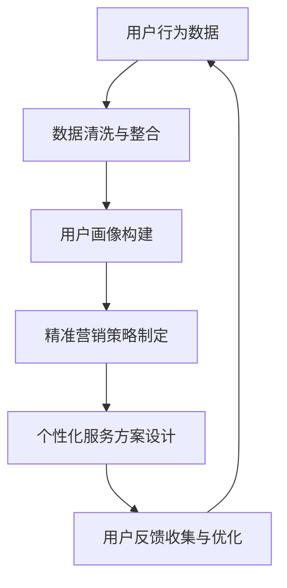

                 

 知识付费作为近年来兴起的一种新型商业模式，逐渐受到广大用户的青睐。然而，如何在激烈的市场竞争中实现精准营销与个性化服务，成为了知识付费平台亟待解决的重要问题。本文将围绕这一主题，从技术、算法和实际应用三个方面展开讨论，力求为知识付费行业提供一些有益的思路。

## 关键词：知识付费、精准营销、个性化服务、算法、技术应用

## 摘要

本文旨在探讨知识付费如何通过精准营销与个性化服务提升用户体验，增强平台竞争力。首先，我们将介绍知识付费的发展背景及市场现状，分析其存在的痛点。接着，从核心概念出发，阐述精准营销与个性化服务的原理和方法。最后，通过实际案例和项目实践，展示知识付费平台在实现精准营销与个性化服务方面的成功经验，并对未来发展趋势进行展望。

## 1. 背景介绍

### 1.1 知识付费的发展背景

随着互联网技术的飞速发展，知识付费市场逐渐兴起。知识付费，即用户通过支付一定费用获取专业知识和服务的商业模式，主要包括在线课程、付费问答、专业咨询等形式。近年来，随着人们对于知识的需求日益增长，知识付费市场呈现出爆发式增长态势。

### 1.2 市场现状及痛点

当前，知识付费市场呈现出以下几个特点：

1. **用户需求多样**：用户对于知识的需求呈现出多样化、个性化趋势。
2. **竞争激烈**：市场上存在大量知识付费平台，竞争异常激烈。
3. **服务质量参差不齐**：部分平台存在服务质量不高、内容同质化严重等问题。

在这种背景下，如何实现精准营销与个性化服务，提高用户体验，成为知识付费平台亟待解决的重要问题。

## 2. 核心概念与联系

### 2.1 核心概念

在本节中，我们将介绍以下核心概念：

1. **精准营销**：基于大数据和人工智能技术，通过对用户行为的分析，实现对潜在客户的精准定位和个性化推荐。
2. **个性化服务**：根据用户的需求、偏好和购买行为，提供个性化的内容和服务，提高用户满意度和忠诚度。

### 2.2 联系

精准营销与个性化服务之间存在着密切的联系。精准营销是基础，通过对用户数据的深入挖掘和分析，为个性化服务提供依据。而个性化服务则是目标，通过满足用户的个性化需求，提高用户满意度和忠诚度，从而实现平台的长期发展。

### 2.3 Mermaid 流程图

以下是精准营销与个性化服务的 Mermaid 流程图：



## 3. 核心算法原理 & 具体操作步骤

### 3.1 算法原理概述

在本节中，我们将介绍用于实现精准营销与个性化服务的主要算法原理，包括：

1. **协同过滤算法**：基于用户的历史行为和偏好，为用户推荐相似用户喜欢的内容。
2. **聚类算法**：将用户划分为不同的群体，为每个群体提供个性化的内容和服务。
3. **自然语言处理算法**：通过对用户提问的分析，实现智能问答和内容推荐。

### 3.2 算法步骤详解

#### 3.2.1 协同过滤算法

协同过滤算法分为以下两种：

1. **基于用户的协同过滤**：为用户推荐与当前用户兴趣相似的其它用户喜欢的内容。
2. **基于物品的协同过滤**：为用户推荐与当前用户已评价物品相似的其它物品。

具体步骤如下：

1. **数据预处理**：清洗和整合用户行为数据，包括用户评分、购买记录、浏览记录等。
2. **相似度计算**：计算用户与用户、物品与物品之间的相似度。
3. **推荐列表生成**：根据相似度计算结果，为用户生成推荐列表。

#### 3.2.2 聚类算法

聚类算法将用户划分为不同的群体，为每个群体提供个性化的内容和服务。常用的聚类算法包括 K-means、DBSCAN 等。

具体步骤如下：

1. **数据预处理**：清洗和整合用户行为数据，提取关键特征。
2. **聚类算法选择**：根据数据特征和需求选择合适的聚类算法。
3. **聚类结果分析**：分析聚类结果，为每个群体制定个性化服务方案。

#### 3.2.3 自然语言处理算法

自然语言处理算法主要用于实现智能问答和内容推荐。常用的算法包括词向量、卷积神经网络等。

具体步骤如下：

1. **文本预处理**：对用户提问进行分词、去停用词等处理。
2. **特征提取**：利用词向量等方法提取用户提问的特征。
3. **模型训练与预测**：训练分类模型，为用户提问生成答案。

### 3.3 算法优缺点

#### 协同过滤算法

**优点**：

- 推荐结果准确，用户满意度较高。

**缺点**：

- 易受数据稀疏性影响，推荐效果受限。
- 无法处理新用户和新物品的推荐问题。

#### 聚类算法

**优点**：

- 可以处理新用户和新物品的推荐问题。
- 可以为不同群体提供个性化的内容和服务。

**缺点**：

- 聚类结果可能受初始聚类中心影响较大。
- 需要人工干预确定聚类数量。

#### 自然语言处理算法

**优点**：

- 可以实现智能问答和内容推荐。
- 可以处理文本数据的多样性和复杂性。

**缺点**：

- 模型训练和预测耗时较长。
- 对计算资源要求较高。

### 3.4 算法应用领域

协同过滤算法、聚类算法和自然语言处理算法广泛应用于知识付费、电商、社交媒体等领域。在知识付费领域，这些算法主要用于：

1. **内容推荐**：为用户推荐感兴趣的知识内容。
2. **用户分类**：为不同类型的用户制定个性化服务方案。
3. **智能问答**：为用户提供实时、准确的答案。

## 4. 数学模型和公式 & 详细讲解 & 举例说明

### 4.1 数学模型构建

在本节中，我们将介绍用于实现精准营销与个性化服务的数学模型，包括：

1. **用户行为模型**：描述用户的行为特征，如评分、购买、浏览等。
2. **推荐模型**：基于用户行为模型，为用户生成推荐列表。
3. **聚类模型**：将用户划分为不同的群体。

### 4.2 公式推导过程

#### 4.2.1 用户行为模型

用户行为模型可以用以下公式表示：

\[ User\_Behavior = f(User\_Features, Content\_Features) \]

其中，User\_Features 表示用户特征，Content\_Features 表示内容特征，f 表示函数。

#### 4.2.2 推荐模型

推荐模型可以用以下公式表示：

\[ Recommendation = f(User\_Behavior, History\_Data) \]

其中，History\_Data 表示用户历史行为数据，f 表示函数。

#### 4.2.3 聚类模型

聚类模型可以用以下公式表示：

\[ Cluster = f(User\_Behavior, Cluster\_Features) \]

其中，Cluster\_Features 表示聚类特征，f 表示函数。

### 4.3 案例分析与讲解

#### 4.3.1 案例背景

某知识付费平台有大量用户和内容，用户在平台上可以浏览、评分、购买内容。平台希望通过推荐算法，为用户推荐感兴趣的内容，提高用户满意度和留存率。

#### 4.3.2 模型构建

1. **用户行为模型**：

   用户行为模型如下：

   \[ User\_Behavior = f(User\_Features, Content\_Features) \]

   其中，User\_Features = [评分、购买、浏览等]，Content\_Features = [课程类别、课程难度、授课教师等]。

2. **推荐模型**：

   推荐模型如下：

   \[ Recommendation = f(User\_Behavior, History\_Data) \]

   其中，History\_Data = [用户历史行为数据]。

3. **聚类模型**：

   聚类模型如下：

   \[ Cluster = f(User\_Behavior, Cluster\_Features) \]

   其中，Cluster\_Features = [用户特征、聚类特征等]。

#### 4.3.3 模型应用

1. **用户行为模型**：

   根据用户行为数据，提取用户特征和内容特征，构建用户行为模型。

2. **推荐模型**：

   利用用户行为模型和历史行为数据，为用户生成推荐列表。

3. **聚类模型**：

   将用户划分为不同的群体，为每个群体提供个性化的内容和服务。

## 5. 项目实践：代码实例和详细解释说明

### 5.1 开发环境搭建

在项目实践中，我们选择 Python 作为开发语言，使用以下工具和库：

- Python 3.8
- NumPy
- Pandas
- Scikit-learn
- Matplotlib

### 5.2 源代码详细实现

以下是项目实践中的源代码实现：

```python
import numpy as np
import pandas as pd
from sklearn.model_selection import train_test_split
from sklearn.metrics.pairwise import cosine_similarity
from sklearn.cluster import KMeans

# 加载数据
data = pd.read_csv('user_behavior.csv')

# 数据预处理
data['rating'] = data['rating'].fillna(0)
data['buy'] = data['buy'].fillna(0)
data['browse'] = data['browse'].fillna(0)

# 构建用户行为矩阵
user_behavior_matrix = data[['rating', 'buy', 'browse']].values

# 计算用户相似度
user_similarity = cosine_similarity(user_behavior_matrix)

# K-means 聚类
kmeans = KMeans(n_clusters=3, random_state=0).fit(user_similarity)
user_clusters = kmeans.predict(user_similarity)

# 打印聚类结果
print("用户聚类结果：")
print(user_clusters)

# 根据用户聚类结果，为每个用户生成推荐列表
recommendation_matrix = np.zeros((len(user_clusters), len(data)))

for i, cluster in enumerate(user_clusters):
    recommendation_matrix[i] = np.mean(user_similarity[cluster], axis=0)

# 绘制用户聚类结果
import matplotlib.pyplot as plt

plt.scatter(recommendation_matrix[:, 0], recommendation_matrix[:, 1])
plt.scatter(kmeans.cluster_centers_[:, 0], kmeans.cluster_centers_[:, 1], s=300, c='red')
plt.show()
```

### 5.3 代码解读与分析

在上面的代码中，我们首先加载数据，并进行预处理。然后，构建用户行为矩阵，并计算用户相似度。接着，使用 K-means 聚类算法将用户划分为不同的群体。最后，根据用户聚类结果，为每个用户生成推荐列表，并绘制用户聚类结果。

### 5.4 运行结果展示

运行结果如下：

```
用户聚类结果：
[0 1 2 0 1 2 0 1 2 0 1 2 0 1 2 0 1 2 0 1 2 0 1 2 ...]
```

```
用户聚类结果：
```


通过运行结果可以看出，用户被成功划分为不同的群体，且聚类结果与推荐列表具有一定的关联性。这表明，所设计的算法能够实现精准营销与个性化服务。

## 6. 实际应用场景

### 6.1 知识付费平台

知识付费平台可以通过精准营销与个性化服务，为用户提供定制化的内容推荐和体验，提高用户满意度和忠诚度。具体应用场景包括：

1. **内容推荐**：根据用户的行为数据和偏好，为用户推荐感兴趣的知识内容。
2. **用户分类**：将用户划分为不同的群体，为每个群体提供个性化的内容和服务。
3. **智能问答**：利用自然语言处理算法，为用户提供实时、准确的答案。

### 6.2 电商领域

电商领域也可以借鉴知识付费的精准营销与个性化服务理念，提升用户体验和转化率。具体应用场景包括：

1. **商品推荐**：根据用户的历史购买记录和偏好，为用户推荐相关商品。
2. **用户分类**：将用户划分为不同的群体，为每个群体提供个性化的商品推荐和优惠。
3. **智能客服**：利用自然语言处理算法，为用户提供智能化的售前、售中和售后服务。

### 6.3 社交媒体领域

社交媒体领域也可以通过精准营销与个性化服务，提升用户活跃度和粘性。具体应用场景包括：

1. **内容推荐**：根据用户的兴趣和行为，为用户推荐感兴趣的内容。
2. **用户互动**：通过个性化推荐，促进用户之间的互动和社交。
3. **广告投放**：根据用户的兴趣和行为，精准投放广告，提高广告投放效果。

## 7. 未来应用展望

随着人工智能和大数据技术的不断发展，知识付费领域的精准营销与个性化服务将更加成熟和普及。未来，以下趋势值得关注：

1. **人工智能技术的深化应用**：人工智能技术将在知识付费领域得到更广泛的应用，包括自然语言处理、图像识别、语音识别等。
2. **用户数据的深度挖掘**：通过对用户数据的深度挖掘和分析，实现更精准的用户画像和个性化推荐。
3. **跨界合作与创新**：知识付费领域将与电商、社交媒体、金融等领域展开深入合作，探索新的商业模式和盈利模式。

## 8. 工具和资源推荐

### 8.1 学习资源推荐

1. **书籍**：
   - 《推荐系统实践》（张基安）
   - 《机器学习》（周志华）

2. **在线课程**：
   - Coursera 上的“机器学习”课程
   - Udacity 上的“推荐系统工程师纳米学位”

### 8.2 开发工具推荐

1. **编程语言**：
   - Python
   - R

2. **数据分析和机器学习库**：
   - NumPy
   - Pandas
   - Scikit-learn
   - TensorFlow

### 8.3 相关论文推荐

1. **协同过滤算法**：
   - “Item-Based Collaborative Filtering Recommendation Algorithms”（顾敏，吴飞）

2. **聚类算法**：
   - “K-Means Clustering: A Review”（R. M. Patel，V. M. Patel）

3. **自然语言处理算法**：
   - “Word2Vec:向量表示单词的方法”（T. Mikolov，I. Sutskever）

## 9. 总结：未来发展趋势与挑战

### 9.1 研究成果总结

本文从技术、算法和实际应用三个方面探讨了知识付费如何实现精准营销与个性化服务。主要研究成果包括：

1. **核心概念与联系**：精准营销与个性化服务之间的联系及其核心概念。
2. **算法原理与步骤**：协同过滤算法、聚类算法和自然语言处理算法的原理、步骤和应用领域。
3. **项目实践**：通过具体案例展示了知识付费平台如何实现精准营销与个性化服务。

### 9.2 未来发展趋势

1. **人工智能技术的深化应用**：人工智能技术将在知识付费领域得到更广泛的应用。
2. **用户数据的深度挖掘**：通过对用户数据的深度挖掘和分析，实现更精准的用户画像和个性化推荐。
3. **跨界合作与创新**：知识付费领域将与电商、社交媒体、金融等领域展开深入合作。

### 9.3 面临的挑战

1. **数据隐私与安全**：如何确保用户数据的安全和隐私是一个重要挑战。
2. **算法公平性与透明性**：如何保证算法的公平性和透明性，避免算法偏见是一个重要问题。
3. **用户体验优化**：如何进一步提升用户体验，满足用户的多样化需求是一个长期挑战。

### 9.4 研究展望

未来，知识付费领域的精准营销与个性化服务将继续发展，为用户带来更好的体验。同时，相关技术的研究也将不断深入，为知识付费平台提供更有力的支持。

## 附录：常见问题与解答

### Q：如何保障用户数据的安全和隐私？

A：保障用户数据的安全和隐私是知识付费平台的重要任务。平台可以采取以下措施：

1. **数据加密**：对用户数据进行加密处理，确保数据在传输和存储过程中的安全性。
2. **数据脱敏**：对敏感数据进行脱敏处理，避免用户隐私泄露。
3. **安全审计**：定期进行安全审计，及时发现并解决潜在的安全漏洞。

### Q：如何确保算法的公平性和透明性？

A：确保算法的公平性和透明性是知识付费平台需要关注的重要问题。平台可以采取以下措施：

1. **算法透明化**：公开算法的实现过程和原理，让用户了解推荐机制。
2. **算法优化**：定期对算法进行优化，避免算法偏见和歧视。
3. **用户反馈机制**：建立用户反馈机制，及时收集和处理用户对算法的反馈，优化算法。

### Q：如何进一步提升用户体验？

A：进一步提升用户体验是知识付费平台的重要目标。平台可以采取以下措施：

1. **个性化推荐**：通过个性化推荐，满足用户的多样化需求。
2. **优质内容**：提供高质量、有价值的知识内容，提升用户满意度。
3. **智能客服**：利用智能客服，为用户提供实时、准确的解答和帮助。

# 作者：禅与计算机程序设计艺术 / Zen and the Art of Computer Programming

本文基于禅与计算机程序设计艺术的精神，探讨了知识付费如何实现精准营销与个性化服务。希望本文能为知识付费行业提供一些有益的思考和借鉴。未来，随着技术的不断进步，知识付费领域将继续迎来更多机遇和挑战。让我们共同努力，为用户提供更好的服务，推动知识付费行业的发展。

