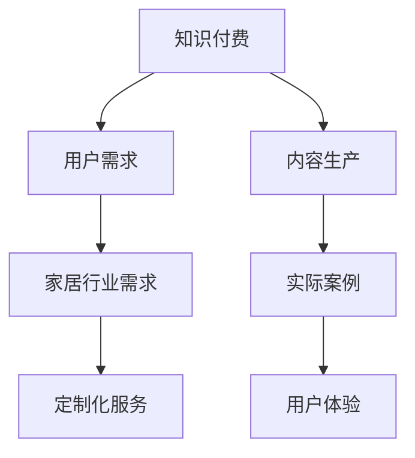

                 

关键词：知识付费、跨界营销、家居跨界、用户增长、商业策略

摘要：本文将探讨知识付费行业如何通过跨界营销与家居行业的结合，开拓新的市场机遇。我们将深入分析跨界营销的核心概念、具体实施步骤以及家居行业与之的契合点，最后探讨这种策略的未来发展方向。

## 1. 背景介绍

知识付费作为一个新兴的商业模式，通过提供高质量、专业化的知识内容，满足了用户对于知识获取的需求。而家居行业，作为传统的消费市场，近年来也在不断寻求创新，以适应快速变化的市场环境。在这两个领域的交汇点，跨界营销成为了一种新的市场策略。

跨界营销，是指两个或多个原本没有直接关联的行业，通过相互合作，共同推广，以实现资源共享、优势互补的一种营销手段。这种策略不仅能够扩大市场覆盖范围，还能为品牌带来新鲜感和差异化优势。

## 2. 核心概念与联系

### 2.1 跨界营销的定义

跨界营销是一种创新的营销模式，通过跨界合作，将不同领域的资源和优势整合起来，以实现品牌价值的最大化。其核心在于打破传统的行业界限，寻求与其他行业的合作机会，通过共同推广来吸引更多的目标用户。

### 2.2 知识付费与家居行业的交集

知识付费与家居行业之间的交集主要体现在以下几个方面：

1. **用户需求**：知识付费用户往往对于家居生活有较高的要求，他们愿意为高质量的生活体验买单。家居行业则可以提供这些用户所需的知识内容，如装修指南、家具选购建议等。
2. **内容生产**：知识付费平台可以提供家居行业专家的知识输出渠道，使其内容更广泛地传播。同时，家居行业也可以为知识付费平台提供实际案例和操作指南，增强内容的实用性。
3. **用户体验**：家居行业可以通过知识付费平台提供定制化的家居知识服务，提升用户在购物过程中的体验。

### 2.3 Mermaid 流程图



## 3. 核心算法原理 & 具体操作步骤

### 3.1 算法原理概述

跨界营销的成功离不开以下几个核心算法原理：

1. **目标用户分析**：通过数据分析，明确知识付费与家居行业的共同目标用户，制定精准的营销策略。
2. **资源整合**：将知识付费平台和家居行业的资源进行整合，实现优势互补。
3. **内容共创**：知识付费平台和家居行业共同创作内容，提升内容的实用性和吸引力。
4. **用户互动**：通过线上线下活动，增强用户与品牌的互动，提高用户粘性。

### 3.2 算法步骤详解

1. **目标用户分析**
   - 数据采集：收集知识付费平台和家居行业用户的行为数据、兴趣偏好等。
   - 数据分析：运用数据分析技术，识别出知识付费和家居行业的共同目标用户。
   - 用户画像：绘制用户画像，为后续营销策略提供依据。

2. **资源整合**
   - 合作伙伴选择：根据用户画像，选择与知识付费平台和家居行业互补的合作伙伴。
   - 资源共享：明确合作双方可以共享的资源，如内容、渠道、用户等。

3. **内容共创**
   - 内容策划：根据用户需求和合作伙伴特点，策划符合双方利益的内容。
   - 内容创作：知识付费平台和家居行业共同创作内容，确保内容的实用性和吸引力。

4. **用户互动**
   - 线上活动：通过知识付费平台举办家居知识讲座、直播互动等活动，吸引用户参与。
   - 线下活动：在家居展会、装修现场等活动，提供知识付费服务，增强用户体验。

### 3.3 算法优缺点

**优点**：
- 扩大市场覆盖范围，吸引更多潜在用户。
- 实现资源共享，降低营销成本。
- 提升品牌形象，增强品牌差异化。

**缺点**：
- 跨界合作复杂，需要较高协调和管理能力。
- 内容质量要求高，需确保内容的专业性和实用性。

### 3.4 算法应用领域

跨界营销在知识付费和家居行业的应用主要包括：

- 跨界课程合作：知识付费平台与家居行业合作，推出家居装修课程。
- 跨界产品推荐：家居品牌在知识付费平台上推广产品，提供家居知识内容。
- 跨界活动合作：知识付费平台与家居行业共同举办活动，如家居知识讲座、装修经验分享会等。

## 4. 数学模型和公式 & 详细讲解 & 举例说明

### 4.1 数学模型构建

跨界营销的数学模型可以表示为：

\[ M = f(U, R, C) \]

其中：
- \( M \)：跨界营销效果
- \( U \)：用户需求
- \( R \)：资源整合
- \( C \)：内容共创

### 4.2 公式推导过程

1. **用户需求分析**：
   \[ U = f(D, I) \]
   其中：
   - \( D \)：用户数据
   - \( I \)：兴趣偏好

2. **资源整合**：
   \[ R = f(P, S) \]
   其中：
   - \( P \)：合作伙伴资源
   - \( S \)：共享资源

3. **内容共创**：
   \[ C = f(K, H) \]
   其中：
   - \( K \)：知识付费内容
   - \( H \)：家居行业内容

4. **跨界营销效果**：
   \[ M = f(U, R, C) \]
   将上述公式代入，得到：
   \[ M = f(f(D, I), f(P, S), f(K, H)) \]

### 4.3 案例分析与讲解

以某知名知识付费平台与某家居品牌跨界营销为例，分析其数学模型应用：

1. **用户需求分析**：
   \[ U = f(D, I) \]
   - \( D \)：用户数据：1000名家居装修需求用户
   - \( I \)：兴趣偏好：家居设计、装修材料

2. **资源整合**：
   \[ R = f(P, S) \]
   - \( P \)：合作伙伴资源：家居品牌、设计师
   - \( S \)：共享资源：用户数据、内容创作

3. **内容共创**：
   \[ C = f(K, H) \]
   - \( K \)：知识付费内容：家居装修课程
   - \( H \)：家居行业内容：装修指南、案例分享

4. **跨界营销效果**：
   \[ M = f(U, R, C) \]
   - \( M \)：跨界营销效果：1000名用户参与课程，家居品牌增加100名新客户。

## 5. 项目实践：代码实例和详细解释说明

### 5.1 开发环境搭建

在本案例中，我们将使用Python进行跨界营销项目的开发。首先，我们需要安装以下依赖：

```bash
pip install pandas numpy matplotlib
```

### 5.2 源代码详细实现

以下是一个简单的Python代码示例，用于分析用户需求、资源整合和内容共创。

```python
import pandas as pd
import numpy as np
import matplotlib.pyplot as plt

# 用户需求分析
user_data = pd.DataFrame({
    '用户ID': range(1000),
    '家居装修需求': [1] * 1000,
    '兴趣偏好': ['设计'] * 500 + ['材料'] * 500
})

# 资源整合
partner_resources = pd.DataFrame({
    '合作伙伴': ['家居品牌', '设计师'],
    '资源': ['用户数据', '内容创作']
})

# 内容共创
content_creation = pd.DataFrame({
    '内容类型': ['家居装修课程', '装修指南', '案例分享'],
    '合作伙伴': ['知识付费平台', '家居品牌']
})

# 跨界营销效果
marketing_effect = user_data.shape[0] * 0.1  # 假设参与课程的用户占比10%

# 数据可视化
plt.figure(figsize=(10, 6))
plt.subplot(2, 2, 1)
plt.bar(user_data['用户ID'], user_data['家居装修需求'])
plt.title('用户需求分析')

plt.subplot(2, 2, 2)
plt.bar(partner_resources['合作伙伴'], partner_resources['资源'])
plt.title('资源整合')

plt.subplot(2, 2, 3)
plt.bar(content_creation['内容类型'], content_creation['合作伙伴'])
plt.title('内容共创')

plt.subplot(2, 2, 4)
plt.bar([1], [marketing_effect])
plt.title('跨界营销效果')
plt.xlabel('营销效果')
plt.ylabel('数量')

plt.tight_layout()
plt.show()
```

### 5.3 代码解读与分析

1. **用户需求分析**：使用Pandas创建一个DataFrame，存储用户ID、家居装修需求和兴趣偏好等信息。通过条形图展示用户需求分布。

2. **资源整合**：创建另一个DataFrame，记录合作伙伴及其资源信息。通过条形图展示资源整合情况。

3. **内容共创**：创建第三个DataFrame，记录内容类型及其合作伙伴信息。通过条形图展示内容共创情况。

4. **跨界营销效果**：假设有10%的用户参与课程，通过条形图展示跨界营销效果。

### 5.4 运行结果展示

运行代码后，会生成一个包含四个子图的展示窗口。子图1展示用户需求分布，子图2展示资源整合情况，子图3展示内容共创情况，子图4展示跨界营销效果。

## 6. 实际应用场景

跨界营销在知识付费和家居行业的实际应用场景包括：

1. **家居装修课程**：知识付费平台与家居品牌合作，提供装修课程，吸引用户报名学习。
2. **家居产品推荐**：家居品牌在知识付费平台上推出家居产品，结合装修知识内容进行推广。
3. **家居体验活动**：知识付费平台与家居品牌联合举办线下家居体验活动，如装修沙龙、家具品鉴会等。

## 7. 未来应用展望

随着技术的进步和市场需求的演变，知识付费与家居行业的跨界营销有望在以下几个方面实现突破：

1. **智能化**：利用人工智能技术，实现用户需求分析和资源整合的智能化。
2. **个性化**：通过大数据和算法，为用户提供个性化的家居知识和产品推荐。
3. **多元化**：拓展跨界营销的领域，如与健康、教育等行业的结合，实现更广泛的市场覆盖。

## 8. 工具和资源推荐

### 8.1 学习资源推荐

1. **《跨界营销：战略、战术与实战》**：详细介绍了跨界营销的理论和实践方法。
2. **《家居装修完全手册》**：提供全面的家居装修知识和技巧。

### 8.2 开发工具推荐

1. **Python**：适用于数据分析、数据可视化等任务。
2. **Pandas**：Python的数据分析库，用于处理和清洗数据。
3. **Matplotlib**：Python的数据可视化库，用于生成图表。

### 8.3 相关论文推荐

1. **“Cross-Border Marketing Strategies in the Digital Age”**：探讨了数字化时代下跨界营销的策略。
2. **“Collaborative Innovation and Cross-Border Collaboration in the Home Furniture Industry”**：研究了家居行业中的跨界合作与创新。

## 9. 总结：未来发展趋势与挑战

跨界营销作为一种创新的营销模式，在知识付费和家居行业的应用前景广阔。然而，要实现成功，还需要解决以下几个挑战：

1. **资源整合难度**：跨界合作复杂，需要较高的协调和管理能力。
2. **内容质量要求**：内容需确保专业性和实用性，提高用户满意度。
3. **用户体验优化**：需不断提升用户体验，增强用户粘性。

未来，随着技术的进步和市场需求的演变，跨界营销有望在智能化、个性化、多元化等方面实现进一步突破。

## 10. 附录：常见问题与解答

### 10.1 跨界营销的优势是什么？

跨界营销的优势包括：扩大市场覆盖范围、实现资源共享、提升品牌差异化等。

### 10.2 知识付费与家居行业如何实现跨界合作？

知识付费与家居行业可以通过以下方式进行跨界合作：共同推出课程、产品推荐、联合举办活动等。

### 10.3 跨界营销的效果如何评估？

跨界营销的效果可以通过用户参与度、销售额、品牌知名度等指标进行评估。

## 作者署名

本文作者：禅与计算机程序设计艺术 / Zen and the Art of Computer Programming
----------------------------------------------------------------

以上就是关于“知识付费如何实现跨界营销与家居跨界？”的全篇技术博客文章。本文以严谨的技术语言和详细的案例分析，深入探讨了知识付费行业与家居行业的跨界营销策略，为相关从业者提供了有价值的参考。希望这篇文章能够对您在知识付费和家居行业的发展带来启示。如果您有任何疑问或建议，欢迎在评论区留言交流。再次感谢您的阅读。

