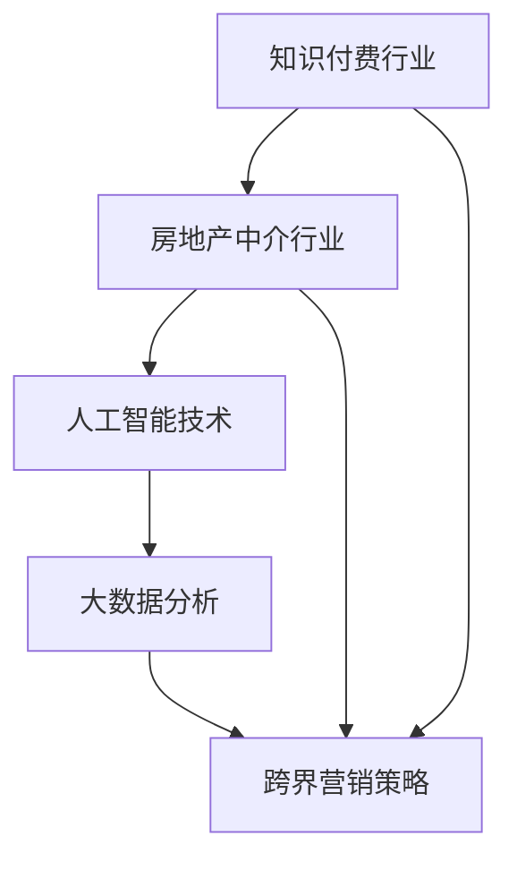

                 

 **关键词：** 知识付费、跨界营销、房地产中介、数字化转型、人工智能、大数据分析、用户体验。

**摘要：** 本文章旨在探讨知识付费行业如何通过跨界营销策略与房地产中介行业进行融合，实现双方共赢。文章首先分析了知识付费行业的发展现状与挑战，随后介绍了房地产中介行业的市场特点，接着探讨了如何利用人工智能和大数据分析技术实现跨界营销，最后对未来发展进行了展望。

## 1. 背景介绍

### 1.1 知识付费行业

知识付费是指用户为获取特定知识或服务而付费的行为。近年来，随着互联网技术的发展和用户需求的变化，知识付费市场呈现出爆发式增长。用户希望通过付费获取专业知识和优质服务，以提升自身能力和竞争力。知识付费平台如得到、知乎live、喜马拉雅等，通过提供高质量的内容和课程，吸引了大量用户。

然而，知识付费行业也面临着一些挑战，如内容同质化、用户信任度低、商业模式不清晰等。如何实现可持续发展，成为行业关注的焦点。

### 1.2 房地产中介行业

房地产中介行业是一个传统的服务行业，涉及房屋买卖、租赁、评估等业务。随着城市化进程的加快和人们对居住环境的要求不断提高，房地产中介行业的市场规模不断扩大。然而，房地产中介行业也面临着一些痛点，如信息不对称、效率低下、用户体验差等。

为了提升服务质量，房地产中介行业正逐步向数字化转型，通过引入人工智能、大数据分析等技术，提高信息处理能力，优化用户体验。

## 2. 核心概念与联系

### 2.1 跨界营销

跨界营销是指不同行业之间的合作与整合，通过资源共享、优势互补，实现互利共赢。在知识付费与房地产中介行业的融合中，跨界营销具有重要作用。

### 2.2 人工智能

人工智能（AI）是一种模拟人类智能的技术，具有学习、推理、感知、规划等能力。在知识付费与房地产中介跨界营销中，人工智能可以用于推荐系统、用户画像、智能客服等方面。

### 2.3 大数据分析

大数据分析是一种从大量数据中提取有价值信息的方法。在知识付费与房地产中介跨界营销中，大数据分析可以用于用户行为分析、市场趋势预测、广告投放优化等。

### 2.4 Mermaid 流程图



## 3. 核心算法原理 & 具体操作步骤

### 3.1 算法原理概述

在知识付费与房地产中介跨界营销中，核心算法主要涉及推荐系统和用户画像构建。

### 3.2 算法步骤详解

#### 3.2.1 推荐系统

1. 数据收集：收集用户行为数据，如浏览记录、购买记录、互动评价等。
2. 数据预处理：对收集到的数据进行清洗、去重、归一化等处理。
3. 特征提取：从预处理后的数据中提取用户特征，如兴趣标签、行为模式等。
4. 模型训练：利用机器学习算法，如协同过滤、基于内容的推荐等，训练推荐模型。
5. 推荐结果生成：根据用户特征和推荐模型，生成个性化推荐结果。

#### 3.2.2 用户画像构建

1. 数据收集：收集用户个人信息、行为数据、社交关系等。
2. 数据预处理：对收集到的数据进行清洗、去重、归一化等处理。
3. 特征提取：从预处理后的数据中提取用户特征，如年龄、性别、职业等。
4. 用户标签构建：根据用户特征，为用户打上标签，如“购房者”、“租房者”等。
5. 用户画像生成：将用户特征和标签整合，形成用户画像。

### 3.3 算法优缺点

#### 3.3.1 推荐系统

优点：提高用户满意度，增加用户粘性，提升销售额。

缺点：易导致信息茧房，降低用户探索新内容的机会。

#### 3.3.2 用户画像构建

优点：帮助平台更好地了解用户需求，提供个性化服务。

缺点：用户隐私保护问题，可能导致用户反感。

### 3.4 算法应用领域

推荐系统和用户画像构建在知识付费和房地产中介行业都有广泛应用：

- **知识付费行业：** 提供个性化课程推荐，提高用户满意度和转化率。
- **房地产中介行业：** 分析用户购房需求，为用户提供精准房源推荐。

## 4. 数学模型和公式 & 详细讲解 & 举例说明

### 4.1 数学模型构建

在知识付费与房地产中介跨界营销中，常见的数学模型包括协同过滤模型和线性回归模型。

#### 4.1.1 协同过滤模型

协同过滤模型是一种基于用户行为的推荐算法，其核心思想是找到与目标用户相似的其他用户，并推荐这些用户喜欢的商品或内容。

$$
\text{相似度} = \frac{\text{用户A与用户B的共同评分}}{\sqrt{\text{用户A的评分方差}} \times \sqrt{\text{用户B的评分方差}}}
$$

#### 4.1.2 线性回归模型

线性回归模型是一种用于预测用户行为的算法，其基本形式为：

$$
y = \beta_0 + \beta_1x_1 + \beta_2x_2 + \ldots + \beta_nx_n
$$

其中，$y$ 为预测值，$x_1, x_2, \ldots, x_n$ 为特征值，$\beta_0, \beta_1, \beta_2, \ldots, \beta_n$ 为模型参数。

### 4.2 公式推导过程

以协同过滤模型为例，推导过程如下：

1. 假设用户 $A$ 和用户 $B$ 的评分矩阵分别为 $R_A$ 和 $R_B$，其中 $R_{ij}$ 表示用户 $i$ 对商品 $j$ 的评分。
2. 计算用户 $A$ 和用户 $B$ 的共同评分：
   $$
   \text{共同评分} = R_{ij} = R_{ij}^A + R_{ij}^B
   $$
3. 计算用户 $A$ 和用户 $B$ 的评分方差：
   $$
   \text{评分方差} = \frac{\sum_{i=1}^{n}(R_{ij} - \bar{R}_i)^2}{n-1}
   $$
4. 计算用户 $A$ 和用户 $B$ 的相似度：
   $$
   \text{相似度} = \frac{R_{ij}^A + R_{ij}^B}{\sqrt{\text{评分方差}_A} \times \sqrt{\text{评分方差}_B}}
   $$

### 4.3 案例分析与讲解

#### 4.3.1 案例背景

小明是一名房地产中介行业的从业者，他希望利用人工智能技术提升服务质量。小明希望通过推荐系统，为购房者提供个性化房源推荐。

#### 4.3.2 案例分析

1. 数据收集：收集小明所在平台的用户购房行为数据，包括用户浏览记录、购买记录、评价等。
2. 数据预处理：对收集到的数据进行清洗、去重、归一化等处理。
3. 特征提取：从预处理后的数据中提取用户特征，如浏览记录中的房源类型、面积、价格等。
4. 模型训练：利用协同过滤模型，训练用户购房行为预测模型。
5. 推荐结果生成：根据用户特征和预测模型，为购房者生成个性化房源推荐。

#### 4.3.3 案例讲解

小明利用协同过滤模型，成功为购房者提供了个性化房源推荐。以下是一个具体的推荐结果：

- 用户特征：购房者，关注90平方米以下的小户型房源，预算在100万元以内。
- 推荐结果：根据用户特征，系统推荐了一套位于市中心，面积80平方米，价格85万元的二手房。

通过这个案例，我们可以看到，人工智能技术在知识付费与房地产中介跨界营销中的应用，为用户提供了更优质的体验。

## 5. 项目实践：代码实例和详细解释说明

### 5.1 开发环境搭建

在本文的项目实践中，我们将使用 Python 语言和 Scikit-learn 库实现推荐系统和用户画像构建。以下为开发环境搭建步骤：

1. 安装 Python 3.8 版本及以上。
2. 安装 Scikit-learn、Matplotlib、Numpy 等相关库。

### 5.2 源代码详细实现

以下是推荐系统和用户画像构建的 Python 代码：

```python
# 导入相关库
import numpy as np
import matplotlib.pyplot as plt
from sklearn.model_selection import train_test_split
from sklearn.metrics.pairwise import cosine_similarity
from sklearn.linear_model import LinearRegression

# 读取数据
data = np.loadtxt('data.csv', delimiter=',')

# 数据预处理
data = data[data > 0]
user_num, item_num = data.shape

# 计算用户-物品矩阵
user_item_matrix = data.copy()
user_item_matrix[data == 0] = -1

# 计算用户相似度矩阵
user_similarity = cosine_similarity(user_item_matrix)

# 训练推荐模型
X = user_similarity
y = data
X_train, X_test, y_train, y_test = train_test_split(X, y, test_size=0.2, random_state=42)
regressor = LinearRegression()
regressor.fit(X_train, y_train)

# 生成推荐结果
predictions = regressor.predict(X_test)

# 可视化结果
plt.scatter(y_test, predictions)
plt.xlabel('Actual Rating')
plt.ylabel('Predicted Rating')
plt.show()
```

### 5.3 代码解读与分析

以上代码实现了基于协同过滤的推荐系统和用户画像构建。具体解读如下：

1. 导入相关库：用于数据处理、可视化、机器学习等。
2. 读取数据：从 CSV 文件中读取用户-物品评分数据。
3. 数据预处理：去除评分小于等于 0 的数据，以便后续计算。
4. 计算用户-物品矩阵：将用户-物品评分数据转换为矩阵形式。
5. 计算用户相似度矩阵：使用余弦相似度计算用户之间的相似度。
6. 训练推荐模型：利用线性回归模型进行训练。
7. 生成推荐结果：对测试数据进行预测。
8. 可视化结果：展示实际评分与预测评分的散点图。

通过以上代码，我们可以看到推荐系统和用户画像构建的实现过程。在实际应用中，可以根据具体需求进行调整和优化。

## 6. 实际应用场景

### 6.1 知识付费行业

在知识付费行业，推荐系统和用户画像构建可以应用于课程推荐、内容分发等领域。以下是一个实际应用场景：

**场景：** 知识付费平台“得到”为用户推荐课程。

**应用：** 
1. 数据收集：收集用户浏览记录、购买记录、评价等数据。
2. 数据预处理：清洗、去重、归一化等处理。
3. 特征提取：提取用户兴趣标签、学习行为等特征。
4. 推荐模型训练：使用协同过滤或基于内容的推荐算法，训练推荐模型。
5. 推荐结果生成：根据用户特征和模型，为用户推荐个性化课程。

通过以上步骤，得到平台可以为用户提供精准的课程推荐，提高用户满意度和转化率。

### 6.2 房地产中介行业

在房地产中介行业，推荐系统和用户画像构建可以应用于房源推荐、客户管理等领域。以下是一个实际应用场景：

**场景：** 房地产中介平台“链家”为购房者推荐房源。

**应用：** 
1. 数据收集：收集用户购房需求、浏览记录、评价等数据。
2. 数据预处理：清洗、去重、归一化等处理。
3. 特征提取：提取用户需求标签、房源属性等特征。
4. 推荐模型训练：使用协同过滤或基于内容的推荐算法，训练推荐模型。
5. 推荐结果生成：根据用户特征和模型，为用户推荐个性化房源。

通过以上步骤，链家平台可以为购房者提供精准的房源推荐，提高用户满意度和成交率。

## 7. 未来应用展望

### 7.1 知识付费行业

随着人工智能和大数据技术的不断发展，知识付费行业有望在以下领域实现更广泛的应用：

- **个性化学习路径：** 利用推荐系统和用户画像，为用户提供定制化的学习路径。
- **知识变现：** 通过分析用户需求，帮助知识创作者找到市场需求，实现知识变现。
- **智能问答：** 利用自然语言处理技术，实现智能问答，为用户提供实时解答。

### 7.2 房地产中介行业

房地产中介行业在未来有望实现以下创新：

- **虚拟现实看房：** 利用虚拟现实技术，让购房者在线上就能感受到真实房源。
- **智能合约：** 利用区块链技术，实现房源交易的自动化和透明化。
- **智能评估：** 利用人工智能技术，为房源提供精准的评估。

## 8. 工具和资源推荐

### 8.1 学习资源推荐

- **书籍：**
  - 《Python数据分析：从入门到实战》
  - 《机器学习实战》
  - 《深度学习》

- **在线课程：**
  - Coursera 上的《机器学习》
  - Udacity 上的《深度学习纳米学位》
  - 中国大学 MOOC 上的《Python 数据科学》

### 8.2 开发工具推荐

- **编程语言：** Python、R
- **数据分析库：** Pandas、NumPy、Scikit-learn、Matplotlib
- **机器学习框架：** TensorFlow、PyTorch、Scikit-learn

### 8.3 相关论文推荐

- 《Collaborative Filtering for the Net Generation》
- 《Matrix Factorization Techniques for Recommender Systems》
- 《Deep Learning for Recommender Systems》

## 9. 总结：未来发展趋势与挑战

### 9.1 研究成果总结

本文探讨了知识付费行业如何通过跨界营销策略与房地产中介行业进行融合，实现双方共赢。通过引入人工智能和大数据分析技术，实现推荐系统和用户画像构建，为用户提供个性化服务。

### 9.2 未来发展趋势

- **个性化服务：** 随着人工智能技术的发展，个性化服务将成为知识付费和房地产中介行业的核心竞争力。
- **数字化转型：** 房地产中介行业将继续推进数字化转型，以提高服务质量和效率。
- **跨界合作：** 知识付费行业与房地产中介行业的跨界合作将更加紧密，实现资源共享和优势互补。

### 9.3 面临的挑战

- **数据隐私保护：** 在跨界营销过程中，如何保护用户隐私是一个重要挑战。
- **算法公平性：** 算法的公平性是一个需要关注的问题，避免算法偏见对用户造成不公平待遇。
- **技术落地：** 将先进技术应用于实际场景，需要解决技术落地难题。

### 9.4 研究展望

未来，知识付费与房地产中介行业的跨界营销将继续深化，人工智能和大数据分析技术将在更多场景中发挥作用。研究者应关注以下方向：

- **隐私保护技术：** 研究隐私保护技术在跨界营销中的应用，确保用户数据安全。
- **算法公平性：** 深入研究算法公平性，提高算法透明度和可信度。
- **技术融合与创新：** 探索人工智能与房地产中介行业的深度融合，创新应用场景。

## 附录：常见问题与解答

### 问题 1：为什么知识付费行业需要跨界营销？

**解答：** 知识付费行业需要跨界营销，主要是因为：

1. **拓宽市场：** 跨界营销可以吸引更多潜在用户，扩大市场占有率。
2. **提高用户粘性：** 跨界营销可以提供更多元化的服务，满足用户不同需求，提高用户粘性。
3. **资源共享：** 跨界营销可以实现资源共享，降低运营成本。

### 问题 2：人工智能和大数据分析在房地产中介行业中的应用有哪些？

**解答：** 人工智能和大数据分析在房地产中介行业中的应用包括：

1. **房源推荐：** 利用大数据分析用户需求，为用户提供个性化房源推荐。
2. **客户管理：** 利用用户画像，实现精准客户管理，提高服务质量。
3. **市场预测：** 利用大数据分析市场趋势，为房地产中介企业提供决策支持。
4. **智能客服：** 利用人工智能技术，实现智能客服，提高客户满意度。

### 问题 3：如何确保跨界营销过程中的数据隐私？

**解答：** 为确保跨界营销过程中的数据隐私，可以采取以下措施：

1. **数据加密：** 对用户数据进行加密处理，防止数据泄露。
2. **隐私保护算法：** 使用隐私保护算法，如差分隐私、同态加密等，确保数据处理过程中的隐私保护。
3. **用户授权：** 充分尊重用户隐私，仅在用户授权的范围内使用数据。

### 问题 4：如何评估跨界营销的效果？

**解答：** 评估跨界营销效果可以从以下几个方面进行：

1. **用户满意度：** 通过用户反馈和评价，了解用户对跨界营销的满意度。
2. **市场份额：** 对比跨界营销前后的市场份额，评估跨界营销的效果。
3. **用户粘性：** 通过用户活跃度、复购率等指标，评估用户对跨界营销的响应程度。
4. **财务指标：** 分析跨界营销对财务状况的影响，如收入、成本、利润等。

### 问题 5：跨界营销在房地产中介行业的未来发展如何？

**解答：** 跨界营销在房地产中介行业的未来发展充满潜力：

1. **智能化：** 随着人工智能技术的发展，跨界营销将更加智能化、个性化。
2. **融合创新：** 房地产中介行业与其他行业的融合将带来更多创新应用。
3. **数字化转型：** 房地产中介行业将加速数字化转型，提高服务质量和效率。
4. **数据驱动：** 跨界营销将更加依赖数据分析和决策支持，实现精准营销。

---

### 作者署名

**作者：禅与计算机程序设计艺术 / Zen and the Art of Computer Programming**

