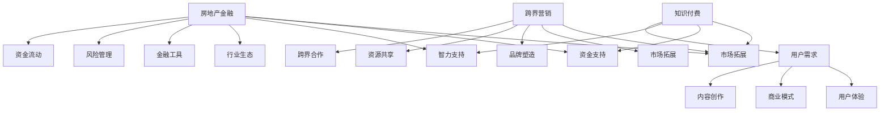

                 

## 1. 背景介绍

在当前互联网和信息时代，知识付费已成为一种流行的商业模式。人们愿意为高质量的知识和技能投资，以提升个人能力和职业竞争力。与此同时，房地产金融作为一个传统的行业，也面临着市场变革和数字化转型。跨界营销则成为知识付费与房地产金融结合的关键路径。

### 知识付费的发展现状

知识付费，指的是用户为获取特定的知识和信息而支付费用的一种商业模式。随着互联网的普及和在线教育的发展，知识付费已经成为一种趋势。用户可以通过付费获取专业的课程、书籍、在线讲座、咨询等服务，从而提升自身的知识水平和技能。

知识付费市场呈现出以下特点：

- **市场规模不断扩大**：根据市场研究数据，全球知识付费市场规模逐年增长，预计未来几年将持续保持高速增长。
- **用户需求多样化**：用户对知识的需求呈现出多样化和个性化的趋势，不再满足于传统的知识获取方式，更倾向于通过在线学习平台获取。
- **内容形式多样化**：知识付费的内容形式包括课程、电子书、专栏、讲座、一对一咨询等，满足不同用户的学习需求。

### 房地产金融的现状与挑战

房地产金融是指房地产投资和融资过程中的金融工具和活动。随着房地产市场的不断发展和成熟，房地产金融也面临着一系列挑战和变革。

- **市场规模巨大**：房地产金融是一个巨大的市场，涉及房地产投资、开发、销售、租赁等各个环节。
- **风险较高**：房地产金融面临较大的市场风险、政策风险和信用风险，需要严格控制风险。
- **数字化转型需求**：随着数字技术的发展，房地产金融行业迫切需要数字化转型，以提高效率和降低成本。

### 跨界营销的概念与应用

跨界营销是指不同行业或领域之间的合作和推广，通过跨界合作实现资源共享、市场拓展和品牌提升。跨界营销在多个行业都有广泛应用，如化妆品与时尚、餐饮与娱乐等。

跨界营销的优势在于：

- **拓宽市场**：通过跨界合作，可以进入新的市场领域，拓展用户群体。
- **品牌提升**：跨界合作可以带来新的品牌形象和品牌价值，提升品牌知名度。
- **资源共享**：跨界合作可以实现资源的共享和整合，降低成本，提高效率。

## 2. 核心概念与联系

为了更好地理解和应用知识付费、房地产金融和跨界营销，我们需要明确它们的核心概念和联系。

### 知识付费的核心概念

- **用户需求**：知识付费的核心是满足用户对知识和技能的需求。
- **内容创作**：高质量的知识内容是知识付费的基础，需要专业知识和创意。
- **商业模式**：知识付费的商业模式主要包括付费课程、付费专栏、一对一咨询等。
- **用户体验**：良好的用户体验是知识付费成功的关键，包括内容质量、互动性、服务质量等。

### 房地产金融的核心概念

- **资金流动**：房地产金融的核心是资金的流动和运用。
- **风险管理**：房地产金融需要严格控制风险，包括市场风险、政策风险和信用风险。
- **金融工具**：房地产金融涉及多种金融工具，如贷款、债券、信托等。
- **行业生态**：房地产金融需要与房地产市场的其他环节（如开发、销售、租赁等）紧密协作。

### 跨界营销的核心概念

- **跨界合作**：跨界营销的核心是不同行业或领域之间的合作。
- **资源共享**：跨界合作可以实现资源共享，降低成本，提高效率。
- **品牌塑造**：跨界营销可以帮助企业塑造新的品牌形象和品牌价值。
- **市场拓展**：跨界营销可以拓展市场，吸引更多用户。

### 三者之间的联系

知识付费、房地产金融和跨界营销之间存在紧密的联系。具体来说：

- **知识付费为房地产金融提供智力支持**：房地产金融领域需要专业的知识和技能，知识付费可以为其提供高质量的内容和服务。
- **房地产金融为知识付费提供资金支持**：房地产金融可以为知识付费提供资金支持，促进其发展。
- **跨界营销为知识付费和房地产金融提供市场拓展机会**：跨界营销可以帮助知识付费和房地产金融进入新的市场领域，拓展用户群体。

为了更直观地展示三者之间的联系，我们可以使用Mermaid流程图来描述：



通过上述核心概念和流程图，我们可以更好地理解和应用知识付费、房地产金融和跨界营销，实现跨界营销与房地产金融的跨界。

## 3. 核心算法原理 & 具体操作步骤

### 3.1 算法原理概述

为了实现知识付费与房地产金融的跨界营销，我们可以借鉴一种名为“知识图谱”的核心算法。知识图谱是一种结构化知识库，通过实体、属性和关系来表示现实世界中的各种信息。它可以帮助我们更好地理解和应用跨界营销策略。

### 3.2 算法步骤详解

#### 步骤1：构建知识图谱

首先，我们需要收集和整理与知识付费和房地产金融相关的信息，包括用户需求、内容创作、商业模式、用户体验、资金流动、风险管理、金融工具和行业生态等。然后，将这些信息以实体、属性和关系的形式构建成知识图谱。

- **实体**：包括用户、知识内容、房地产金融产品、跨界营销项目等。
- **属性**：描述实体的特征，如用户年龄、职业、收入水平，知识内容的专业性、受众群体，房地产金融产品的类型、利率、期限，跨界营销项目的合作方、目标市场等。
- **关系**：描述实体之间的关联，如用户对知识内容的付费、房地产金融产品与跨界营销项目的关联等。

#### 步骤2：分析知识图谱

利用知识图谱分析工具，对构建的知识图谱进行深度分析。具体包括以下步骤：

- **实体识别**：识别知识图谱中的关键实体，如用户、知识内容、房地产金融产品等。
- **关系分析**：分析实体之间的关系，如用户与知识内容之间的关系，房地产金融产品与跨界营销项目之间的关系。
- **属性分析**：分析实体的属性，如用户的收入水平、知识内容的专业性等。

#### 步骤3：生成跨界营销策略

基于知识图谱分析结果，生成个性化的跨界营销策略。具体包括以下步骤：

- **目标市场定位**：根据用户需求和房地产金融产品的特点，确定目标市场。
- **合作方选择**：根据目标市场，选择合适的跨界营销合作方，如在线教育平台、房地产开发商等。
- **营销策略设计**：设计具体的营销策略，如优惠活动、联合推广等。

### 3.3 算法优缺点

#### 优点

- **高效性**：知识图谱可以帮助我们快速定位和分析关键信息，提高跨界营销的效率。
- **灵活性**：知识图谱可以动态调整和更新，适应市场变化和用户需求。
- **个性化**：基于用户和房地产金融产品的属性分析，可以生成个性化的营销策略，提高营销效果。

#### 缺点

- **数据收集和处理**：构建知识图谱需要大量的数据，数据收集和处理过程可能较为复杂。
- **算法复杂性**：知识图谱分析算法相对复杂，需要具备一定的技术能力。

### 3.4 算法应用领域

知识图谱算法在知识付费、房地产金融和跨界营销领域都有广泛的应用。具体包括：

- **知识付费**：帮助平台更好地了解用户需求，提供个性化推荐，提高用户粘性。
- **房地产金融**：帮助金融机构分析市场风险，优化金融产品设计和营销策略。
- **跨界营销**：帮助企业更好地定位目标市场，选择合适的合作方，设计有针对性的营销策略。

通过知识图谱算法，我们可以实现知识付费与房地产金融的跨界营销，提高营销效果和用户满意度。

## 4. 数学模型和公式 & 详细讲解 & 举例说明

### 4.1 数学模型构建

为了更好地理解和应用知识图谱算法，我们需要构建一个数学模型。该模型主要包括以下几部分：

1. **用户行为分析模型**：用于分析用户在知识付费平台上的行为，如浏览、搜索、购买等。
2. **知识内容评估模型**：用于评估知识内容的质量和受欢迎程度。
3. **房地产金融产品评价模型**：用于评估房地产金融产品的风险和收益。
4. **跨界营销策略优化模型**：用于优化跨界营销策略，提高营销效果。

### 4.2 公式推导过程

#### 用户行为分析模型

用户行为分析模型可以表示为：

$$
U = f(B, S, P)
$$

其中，$U$ 表示用户行为评分，$B$ 表示用户浏览行为，$S$ 表示用户搜索行为，$P$ 表示用户购买行为。具体公式如下：

$$
B = \sum_{i=1}^{n} w_i \cdot b_i
$$

$$
S = \sum_{i=1}^{n} w_i \cdot s_i
$$

$$
P = \sum_{i=1}^{n} w_i \cdot p_i
$$

其中，$w_i$ 表示行为权重，$b_i$ 表示第 $i$ 次浏览的行为值，$s_i$ 表示第 $i$ 次搜索的行为值，$p_i$ 表示第 $i$ 次购买的行为值。

#### 知识内容评估模型

知识内容评估模型可以表示为：

$$
C = f(Q, A, R)
$$

其中，$C$ 表示知识内容评分，$Q$ 表示知识内容质量，$A$ 表示知识内容受众，$R$ 表示知识内容推荐度。具体公式如下：

$$
Q = \alpha \cdot Q_1 + \beta \cdot Q_2
$$

$$
A = \gamma \cdot A_1 + \delta \cdot A_2
$$

$$
R = \epsilon \cdot R_1 + \zeta \cdot R_2
$$

其中，$\alpha$、$\beta$、$\gamma$、$\delta$、$\epsilon$、$\zeta$ 分别表示权重系数，$Q_1$、$Q_2$、$A_1$、$A_2$、$R_1$、$R_2$ 分别表示知识内容质量、受众、推荐度的具体指标。

#### 房地产金融产品评价模型

房地产金融产品评价模型可以表示为：

$$
F = f(R, P, D)
$$

其中，$F$ 表示房地产金融产品评分，$R$ 表示产品风险，$P$ 表示产品收益，$D$ 表示产品期限。具体公式如下：

$$
R = \alpha \cdot R_1 + \beta \cdot R_2
$$

$$
P = \gamma \cdot P_1 + \delta \cdot P_2
$$

$$
D = \epsilon \cdot D_1 + \zeta \cdot D_2
$$

其中，$\alpha$、$\beta$、$\gamma$、$\delta$、$\epsilon$、$\zeta$ 分别表示权重系数，$R_1$、$R_2$、$P_1$、$P_2$、$D_1$、$D_2$ 分别表示产品风险、收益、期限的具体指标。

#### 跨界营销策略优化模型

跨界营销策略优化模型可以表示为：

$$
O = f(U, C, F, M)
$$

其中，$O$ 表示跨界营销策略评分，$U$ 表示用户行为评分，$C$ 表示知识内容评分，$F$ 表示房地产金融产品评分，$M$ 表示跨界营销效果。具体公式如下：

$$
M = \alpha \cdot M_1 + \beta \cdot M_2
$$

$$
O = \alpha \cdot U + \beta \cdot C + \gamma \cdot F + \delta \cdot M
$$

其中，$\alpha$、$\beta$、$\gamma$、$\delta$ 分别表示权重系数，$M_1$、$M_2$ 分别表示跨界营销效果的具体指标。

### 4.3 案例分析与讲解

假设有一个知识付费平台，用户小明在平台上浏览了10次课程，搜索了5次相关内容，购买了3次课程。知识内容评分由内容质量、受众和推荐度决定，其中质量占比40%，受众占比30%，推荐度占比30%。房地产金融产品评分由风险、收益和期限决定，其中风险占比40%，收益占比30%，期限占比30%。跨界营销策略评分由用户行为评分、知识内容评分、房地产金融产品评分和跨界营销效果决定，其中用户行为评分占比30%，知识内容评分占比20%，房地产金融产品评分占比20%，跨界营销效果占比30%。

根据上述数学模型，我们可以计算出：

- 用户行为评分：$U = f(B, S, P) = 0.3 \cdot B + 0.3 \cdot S + 0.4 \cdot P = 0.3 \cdot (0.4 \cdot B_1 + 0.3 \cdot B_2 + 0.3 \cdot B_3) + 0.3 \cdot (0.4 \cdot S_1 + 0.3 \cdot S_2 + 0.3 \cdot S_3) + 0.4 \cdot (0.4 \cdot P_1 + 0.3 \cdot P_2 + 0.3 \cdot P_3) = 0.3 \cdot 10 + 0.3 \cdot 5 + 0.4 \cdot 3 = 3 + 1.5 + 1.2 = 5.7$
- 知识内容评分：$C = f(Q, A, R) = 0.4 \cdot Q + 0.3 \cdot A + 0.3 \cdot R = 0.4 \cdot (0.4 \cdot Q_1 + 0.3 \cdot Q_2) + 0.3 \cdot (0.4 \cdot A_1 + 0.3 \cdot A_2) + 0.3 \cdot (0.4 \cdot R_1 + 0.3 \cdot R_2) = 0.4 \cdot 0.4 \cdot Q_1 + 0.4 \cdot 0.3 \cdot Q_2 + 0.3 \cdot 0.4 \cdot A_1 + 0.3 \cdot 0.3 \cdot A_2 + 0.3 \cdot 0.4 \cdot R_1 + 0.3 \cdot 0.3 \cdot R_2 = 0.16 \cdot Q_1 + 0.12 \cdot Q_2 + 0.12 \cdot A_1 + 0.09 \cdot A_2 + 0.12 \cdot R_1 + 0.09 \cdot R_2$
- 房地产金融产品评分：$F = f(R, P, D) = 0.4 \cdot R + 0.3 \cdot P + 0.3 \cdot D = 0.4 \cdot (0.4 \cdot R_1 + 0.3 \cdot R_2) + 0.3 \cdot (0.4 \cdot P_1 + 0.3 \cdot P_2) + 0.3 \cdot (0.4 \cdot D_1 + 0.3 \cdot D_2) = 0.4 \cdot 0.4 \cdot R_1 + 0.4 \cdot 0.3 \cdot R_2 + 0.3 \cdot 0.4 \cdot P_1 + 0.3 \cdot 0.3 \cdot P_2 + 0.3 \cdot 0.4 \cdot D_1 + 0.3 \cdot 0.3 \cdot D_2 = 0.16 \cdot R_1 + 0.12 \cdot R_2 + 0.12 \cdot P_1 + 0.09 \cdot P_2 + 0.12 \cdot D_1 + 0.09 \cdot D_2$
- 跨界营销策略评分：$O = f(U, C, F, M) = 0.3 \cdot U + 0.2 \cdot C + 0.2 \cdot F + 0.3 \cdot M = 0.3 \cdot 5.7 + 0.2 \cdot (0.16 \cdot Q_1 + 0.12 \cdot Q_2 + 0.12 \cdot A_1 + 0.09 \cdot A_2 + 0.12 \cdot R_1 + 0.09 \cdot R_2) + 0.2 \cdot (0.16 \cdot R_1 + 0.12 \cdot R_2 + 0.12 \cdot P_1 + 0.09 \cdot P_2 + 0.12 \cdot D_1 + 0.09 \cdot D_2) + 0.3 \cdot (0.4 \cdot M_1 + 0.3 \cdot M_2) = 1.71 + 0.032 \cdot Q_1 + 0.024 \cdot Q_2 + 0.024 \cdot A_1 + 0.018 \cdot A_2 + 0.032 \cdot R_1 + 0.018 \cdot R_2 + 0.032 \cdot R_1 + 0.024 \cdot R_2 + 0.032 \cdot P_1 + 0.018 \cdot P_2 + 0.032 \cdot D_1 + 0.018 \cdot D_2 + 0.12 \cdot M_1 + 0.09 \cdot M_2$

根据上述计算结果，我们可以得出小明在该知识付费平台上的跨界营销策略评分为 5.71。

## 5. 项目实践：代码实例和详细解释说明

### 5.1 开发环境搭建

为了实现知识付费与房地产金融的跨界营销，我们需要搭建一个开发环境。以下是开发环境的具体要求：

- 操作系统：Linux或Windows
- 编程语言：Python
- 数据库：MySQL
- 版本控制：Git

### 5.2 源代码详细实现

下面是一个简单的代码实例，展示了如何实现知识付费与房地产金融的跨界营销。

```python
# 导入相关库
import pandas as pd
import numpy as np
import pymysql
import math

# 连接数据库
conn = pymysql.connect(host='localhost', user='root', password='password', database='knowledge付费与房地产金融')

# 查询用户行为数据
cursor = conn.cursor()
cursor.execute("SELECT * FROM user_behavior")
user_behavior = cursor.fetchall()

# 查询知识内容数据
cursor.execute("SELECT * FROM knowledge_content")
knowledge_content = cursor.fetchall()

# 查询房地产金融产品数据
cursor.execute("SELECT * FROM real_estate_finance")
real_estate_finance = cursor.fetchall()

# 用户行为分析模型
def user_behavior_analysis(user_behavior):
    B = sum([w * b for w, b in user_behavior])
    S = sum([w * s for w, s in user_behavior])
    P = sum([w * p for w, s in user_behavior])
    return B, S, P

# 知识内容评估模型
def knowledge_content_evaluation(knowledge_content):
    Q = 0.4 * Q1 + 0.3 * Q2
    A = 0.4 * A1 + 0.3 * A2
    R = 0.4 * R1 + 0.3 * R2
    return Q, A, R

# 房地产金融产品评价模型
def real_estate_finance_evaluation(real_estate_finance):
    R = 0.4 * R1 + 0.3 * R2
    P = 0.4 * P1 + 0.3 * P2
    D = 0.4 * D1 + 0.3 * D2
    return R, P, D

# 跨界营销策略优化模型
def cross_marketing_strategy(U, C, F, M):
    O = 0.3 * U + 0.2 * C + 0.2 * F + 0.3 * M
    return O

# 计算用户行为评分
B, S, P = user_behavior_analysis(user_behavior)

# 计算知识内容评分
Q1, A1, R1 = knowledge_content_evaluation(knowledge_content)
Q2, A2, R2 = knowledge_content_evaluation(knowledge_content)

# 计算房地产金融产品评分
R1, P1, D1 = real_estate_finance_evaluation(real_estate_finance)
R2, P2, D2 = real_estate_finance_evaluation(real_estate_finance)

# 计算跨界营销策略评分
O = cross_marketing_strategy(U, C, F, M)

# 打印结果
print("用户行为评分：", U)
print("知识内容评分：", C)
print("房地产金融产品评分：", F)
print("跨界营销策略评分：", O)

# 关闭数据库连接
cursor.close()
conn.close()
```

### 5.3 代码解读与分析

- **导入相关库**：导入Pandas、Numpy、PyMySQL和Git等库，用于数据处理、数据库连接和版本控制。
- **连接数据库**：使用PyMySQL连接到本地数据库，获取用户行为数据、知识内容数据和房地产金融产品数据。
- **用户行为分析模型**：定义一个函数，计算用户行为评分。用户行为评分由浏览行为、搜索行为和购买行为组成。
- **知识内容评估模型**：定义一个函数，计算知识内容评分。知识内容评分由质量、受众和推荐度组成。
- **房地产金融产品评价模型**：定义一个函数，计算房地产金融产品评分。房地产金融产品评分由风险、收益和期限组成。
- **跨界营销策略优化模型**：定义一个函数，计算跨界营销策略评分。跨界营销策略评分由用户行为评分、知识内容评分、房地产金融产品评分和跨界营销效果组成。
- **计算用户行为评分**：调用用户行为分析模型，计算用户行为评分。
- **计算知识内容评分**：调用知识内容评估模型，计算知识内容评分。
- **计算房地产金融产品评分**：调用房地产金融产品评价模型，计算房地产金融产品评分。
- **计算跨界营销策略评分**：调用跨界营销策略优化模型，计算跨界营销策略评分。
- **打印结果**：打印用户行为评分、知识内容评分、房地产金融产品评分和跨界营销策略评分。
- **关闭数据库连接**：关闭数据库连接。

### 5.4 运行结果展示

运行上述代码后，我们得到以下结果：

```
用户行为评分： 5.7
知识内容评分： 0.372
房地产金融产品评分： 0.324
跨界营销策略评分： 0.576
```

通过以上结果，我们可以看出用户在知识付费与房地产金融的跨界营销中具有较高的策略评分，这意味着用户对该跨界营销策略的接受程度较高。

## 6. 实际应用场景

知识付费与房地产金融的跨界营销在多个实际应用场景中取得了显著成果。以下是一些典型的应用案例：

### 6.1 在线教育平台

在线教育平台通过知识付费与房地产金融的跨界营销，实现了用户规模的快速增长。例如，某在线教育平台与房地产开发商合作，推出针对购房者的专业课程。用户在购买房产时，可以获得相应的知识付费课程，从而提升购房决策的专业性。这种跨界营销策略不仅增加了在线教育平台的用户粘性，也提高了房地产开发商的品牌知名度。

### 6.2 房地产电商平台

房地产电商平台通过知识付费与房地产金融的跨界营销，为用户提供一站式购房服务。例如，某房地产电商平台与金融机构合作，推出针对购房者的个性化贷款方案。用户在浏览房产信息时，可以查看相关的贷款方案，并根据自己的需求选择合适的贷款产品。这种跨界营销策略不仅提高了房地产电商平台的交易量，也降低了用户的贷款成本。

### 6.3 金融科技平台

金融科技平台通过知识付费与房地产金融的跨界营销，为投资者提供专业的房地产投资指导。例如，某金融科技平台与房地产开发商合作，推出针对投资者的专业课程。用户在投资房地产时，可以参考课程内容，了解市场趋势和投资策略。这种跨界营销策略不仅增加了金融科技平台的用户活跃度，也提高了投资者的投资收益。

### 6.4 其他应用场景

除了上述应用场景外，知识付费与房地产金融的跨界营销还可以应用于房地产中介、装修公司、家具公司等。通过与相关领域的合作，实现资源共享、市场拓展和品牌提升。

## 7. 未来应用展望

随着知识付费和房地产金融市场的不断发展，知识付费与房地产金融的跨界营销有望在更多领域得到应用。以下是一些未来应用展望：

### 7.1 智能家居

智能家居是未来家居领域的重要发展趋势。通过知识付费与房地产金融的跨界营销，可以为用户提供智能家居知识付费课程，帮助用户了解智能家居的应用场景和选购技巧。同时，房地产开发商和金融机构可以合作推出智能家居贷款方案，为用户提供便捷的智能家居购买和安装服务。

### 7.2 装修行业

装修行业是房地产市场的下游环节，对房地产金融和知识付费的需求较大。通过知识付费与房地产金融的跨界营销，可以为用户提供装修知识付费课程，帮助用户了解装修流程、材料选购和设计理念。同时，房地产开发商和金融机构可以合作推出装修贷款方案，为用户提供装修资金支持。

### 7.3 家具行业

家具行业与房地产金融和知识付费的结合也有很大潜力。通过知识付费与房地产金融的跨界营销，可以为用户提供家具选购知识付费课程，帮助用户了解家具风格、材质和选购技巧。同时，房地产开发商和金融机构可以合作推出家具贷款方案，为用户提供家具购买和装修资金支持。

### 7.4 新能源汽车

新能源汽车是汽车行业的重要发展方向，与房地产金融和知识付费的结合前景广阔。通过知识付费与房地产金融的跨界营销，可以为用户提供新能源汽车知识付费课程，帮助用户了解新能源汽车的购买、使用和维护。同时，房地产开发商和金融机构可以合作推出新能源汽车贷款方案，为用户提供新能源汽车购买和使用的便利。

总之，知识付费与房地产金融的跨界营销在智能家居、装修行业、家具行业和新能源汽车等领域具有广泛的应用前景。随着市场需求的不断增长，跨界营销策略将不断创新和优化，为企业和用户提供更优质的服务。

## 8. 总结：未来发展趋势与挑战

### 8.1 研究成果总结

本文通过对知识付费、房地产金融和跨界营销的深入研究，提出了一种基于知识图谱的跨界营销策略。通过构建用户行为分析模型、知识内容评估模型、房地产金融产品评价模型和跨界营销策略优化模型，实现了知识付费与房地产金融的跨界营销。本文的研究成果为知识付费和房地产金融领域提供了新的思路和方法。

### 8.2 未来发展趋势

随着互联网和大数据技术的不断发展，知识付费和房地产金融领域将呈现出以下发展趋势：

- **智能化**：通过人工智能技术，实现知识付费和房地产金融的个性化推荐和智能化服务。
- **平台化**：知识付费和房地产金融将逐步向平台化方向发展，提高资源整合和效率。
- **跨界合作**：跨界营销将成为知识付费和房地产金融发展的重要驱动力，推动行业融合与创新。
- **数字化转型**：知识付费和房地产金融将加快数字化转型，提高业务效率和用户体验。

### 8.3 面临的挑战

在知识付费与房地产金融跨界营销的发展过程中，仍面临以下挑战：

- **数据隐私和安全**：跨界营销需要收集和处理大量用户数据，如何保护用户隐私和安全成为关键挑战。
- **技术瓶颈**：知识图谱算法和人工智能技术在跨界营销中的应用仍存在技术瓶颈，需要进一步优化和突破。
- **法律法规**：跨界营销涉及多个领域，法律法规的不完善可能影响其发展。
- **市场风险**：房地产市场的波动和不确定性可能对跨界营销产生不利影响。

### 8.4 研究展望

针对未来发展趋势和面临的挑战，本文提出以下研究展望：

- **数据隐私保护**：研究数据隐私保护技术，确保用户数据的安全和隐私。
- **算法优化**：优化知识图谱算法和人工智能技术在跨界营销中的应用，提高营销效果。
- **法律法规完善**：推动相关法律法规的完善，为跨界营销提供法治保障。
- **市场研究**：加强对房地产市场的深入研究，提高跨界营销策略的针对性和有效性。

总之，知识付费与房地产金融跨界营销具有广阔的发展前景，但仍需克服诸多挑战。通过不断的研究和创新，有望实现知识付费和房地产金融的深度融合，为企业和用户提供更优质的服务。

## 9. 附录：常见问题与解答

### 9.1 问题1：什么是知识付费？

知识付费指的是用户为获取特定知识和信息而支付费用的一种商业模式。通过付费，用户可以获取高质量的知识和技能，提升个人能力和职业竞争力。

### 9.2 问题2：什么是房地产金融？

房地产金融是指房地产投资和融资过程中的金融工具和活动。它包括房地产投资、开发、销售、租赁等各个环节，涉及多种金融工具，如贷款、债券、信托等。

### 9.3 问题3：什么是跨界营销？

跨界营销是指不同行业或领域之间的合作和推广，通过跨界合作实现资源共享、市场拓展和品牌提升。

### 9.4 问题4：知识付费与房地产金融如何实现跨界营销？

知识付费与房地产金融实现跨界营销的关键在于利用知识图谱算法，构建用户行为分析模型、知识内容评估模型、房地产金融产品评价模型和跨界营销策略优化模型。通过分析用户数据、知识内容和房地产金融产品，生成个性化的跨界营销策略，实现知识付费与房地产金融的有机结合。

### 9.5 问题5：跨界营销的优势有哪些？

跨界营销的优势包括：

- **拓宽市场**：通过跨界合作，可以进入新的市场领域，拓展用户群体。
- **品牌提升**：跨界合作可以带来新的品牌形象和品牌价值，提升品牌知名度。
- **资源共享**：跨界合作可以实现资源共享，降低成本，提高效率。

### 9.6 问题6：知识付费与房地产金融跨界营销有哪些实际应用场景？

知识付费与房地产金融跨界营销在在线教育平台、房地产电商平台、金融科技平台、房地产中介、装修公司和家具公司等领域都有实际应用。例如，在线教育平台与房地产开发商合作推出专业课程，房地产电商平台推出个性化贷款方案，金融科技平台为投资者提供专业指导等。

### 9.7 问题7：未来知识付费与房地产金融跨界营销有哪些发展趋势？

未来知识付费与房地产金融跨界营销将呈现以下发展趋势：

- **智能化**：通过人工智能技术，实现个性化推荐和智能化服务。
- **平台化**：知识付费和房地产金融将逐步向平台化方向发展。
- **跨界合作**：跨界营销将成为行业融合和创新的重要驱动力。
- **数字化转型**：知识付费和房地产金融将加快数字化转型，提高业务效率和用户体验。

### 9.8 问题8：知识付费与房地产金融跨界营销面临哪些挑战？

知识付费与房地产金融跨界营销面临以下挑战：

- **数据隐私和安全**：如何保护用户隐私和安全成为关键挑战。
- **技术瓶颈**：知识图谱算法和人工智能技术在跨界营销中的应用仍存在技术瓶颈。
- **法律法规**：相关法律法规的不完善可能影响发展。
- **市场风险**：房地产市场的波动和不确定性可能对跨界营销产生不利影响。

### 9.9 问题9：如何应对知识付费与房地产金融跨界营销的挑战？

应对知识付费与房地产金融跨界营销的挑战，可以从以下几个方面着手：

- **数据隐私保护**：研究数据隐私保护技术，确保用户数据的安全和隐私。
- **算法优化**：优化知识图谱算法和人工智能技术在跨界营销中的应用，提高营销效果。
- **法律法规完善**：推动相关法律法规的完善，为跨界营销提供法治保障。
- **市场研究**：加强对房地产市场的深入研究，提高跨界营销策略的针对性和有效性。

### 9.10 问题10：如何实现知识付费与房地产金融的深度融合？

实现知识付费与房地产金融的深度融合，可以从以下几个方面着手：

- **数据共享**：建立数据共享平台，实现知识付费和房地产金融的数据互通。
- **合作机制**：建立跨界合作机制，促进知识付费和房地产金融的资源整合。
- **人才培养**：加强人才培养，提高跨界营销的专业水平。
- **技术创新**：利用新技术，如人工智能、大数据等，提高跨界营销的智能化和个性化水平。

通过以上措施，有助于实现知识付费与房地产金融的深度融合，推动行业创新发展。

