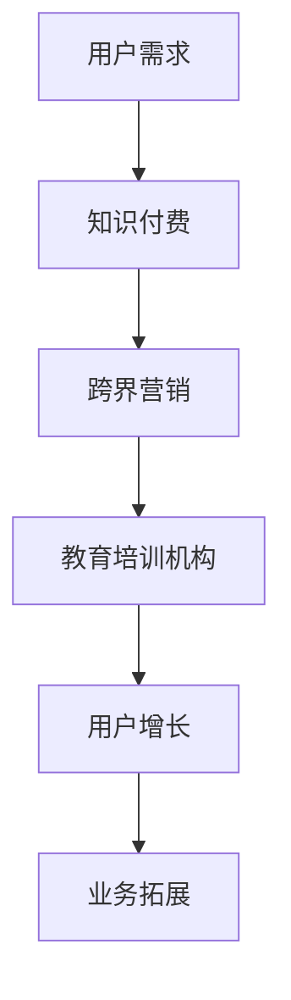

                 

 > **关键词：** 知识付费、跨界营销、教育培训机构、用户增长、数据驱动、技术创新。

> **摘要：** 本文将探讨知识付费在跨界营销和教育培训机构中的应用，分析如何通过数据驱动和创新技术实现有效跨界，提升用户参与度和机构竞争力。

## 1. 背景介绍

随着互联网技术的发展，知识付费逐渐成为数字经济的重要组成部分。用户对于高质量、专业化内容的渴求，促使教育培训机构、内容创作者和平台服务商纷纷布局知识付费市场。然而，如何在竞争激烈的市场中实现用户增长和业务拓展，成为教育培训机构面临的重大挑战。

跨界营销作为一种创新的营销策略，通过整合不同领域的资源和优势，实现品牌的跨越式发展。教育培训机构可以通过跨界营销，拓宽用户群体，提高品牌知名度，实现市场拓展和用户增长。

本文旨在探讨知识付费如何通过跨界营销与教育培训机构实现成功跨界，分析其中的关键策略和技术手段，为教育培训机构提供有益的参考和启示。

## 2. 核心概念与联系

### 2.1 知识付费

知识付费是指用户通过付费获取专业、权威的知识和技能的过程。在互联网时代，知识付费形式多样化，包括在线课程、专业咨询、直播授课等。知识付费的核心在于满足用户对高质量内容的消费需求，提高用户的学习效果和职业竞争力。

### 2.2 跨界营销

跨界营销是指品牌或企业通过与其他行业、领域的合作，共同推广产品或服务的一种营销策略。跨界营销能够实现资源整合、优势互补，提高品牌知名度和用户参与度。在教育培训领域，跨界营销有助于拓宽用户群体，提高市场竞争力。

### 2.3 教育培训机构

教育培训机构是指以提供教育服务为主的企业或组织，包括线下培训机构、在线教育平台等。教育培训机构的核心竞争力在于课程内容、师资力量和用户服务。通过跨界营销，教育培训机构可以提升品牌影响力，扩大市场份额。

### 2.4 跨界营销与知识付费的关联

跨界营销与知识付费之间存在紧密的联系。跨界营销可以帮助教育培训机构吸引更多潜在用户，提高知识付费产品或服务的销量。同时，知识付费为跨界营销提供了优质的内容资源，有助于提升品牌形象和用户满意度。

### 2.5 Mermaid 流程图



## 3. 核心算法原理 & 具体操作步骤

### 3.1 算法原理概述

跨界营销与知识付费的结合，需要基于数据分析和用户行为研究，实现精准营销和个性化推荐。核心算法原理包括以下几个步骤：

1. 数据采集：收集用户行为数据、课程数据、市场数据等。
2. 数据清洗：对采集到的数据进行处理，去除噪声和重复数据。
3. 数据分析：对清洗后的数据进行统计分析，挖掘用户需求和偏好。
4. 个性化推荐：根据用户需求和偏好，推荐合适的知识付费产品或服务。
5. 营销策略优化：根据营销效果，不断优化跨界营销策略。

### 3.2 算法步骤详解

#### 3.2.1 数据采集

数据采集是跨界营销与知识付费结合的基础。教育培训机构可以通过以下途径收集数据：

1. 用户注册信息：包括姓名、年龄、职业等基本信息。
2. 用户行为数据：包括课程学习进度、学习时长、测试成绩等。
3. 用户反馈数据：包括评价、建议、反馈等。
4. 市场数据：包括竞争对手信息、行业动态、市场趋势等。

#### 3.2.2 数据清洗

数据清洗是保证数据质量的关键步骤。具体包括：

1. 去除重复数据：识别并删除重复的数据记录。
2. 填补缺失值：对于缺失的数据，采用填补策略，如均值填补、中值填补等。
3. 数据格式转换：将不同来源的数据转换为统一的格式，如CSV、JSON等。

#### 3.2.3 数据分析

数据分析是挖掘用户需求和偏好的关键。具体包括：

1. 用户画像：根据用户注册信息和行为数据，构建用户画像。
2. 课程分析：分析课程受欢迎程度、学习难度等指标。
3. 用户偏好分析：根据用户行为数据，挖掘用户的学习偏好和需求。

#### 3.2.4 个性化推荐

个性化推荐是提升用户满意度和转化率的重要手段。具体包括：

1. 构建推荐模型：采用协同过滤、基于内容的推荐等技术，构建推荐模型。
2. 推荐算法优化：根据推荐效果，不断优化推荐算法。
3. 推荐策略实施：根据用户画像和推荐模型，为用户推荐合适的知识付费产品或服务。

#### 3.2.5 营销策略优化

营销策略优化是提高跨界营销效果的关键。具体包括：

1. 营销效果分析：根据用户反馈和转化数据，分析营销策略的效果。
2. 策略调整：根据分析结果，调整跨界营销策略。
3. 持续优化：不断迭代优化营销策略，提高营销效果。

### 3.3 算法优缺点

#### 3.3.1 优点

1. 提高用户满意度：通过个性化推荐和精准营销，提升用户的学习体验和满意度。
2. 提高转化率：根据用户需求和偏好，推荐合适的知识付费产品或服务，提高转化率。
3. 拓宽用户群体：跨界营销有助于吸引更多潜在用户，拓宽用户群体。

#### 3.3.2 缺点

1. 数据隐私风险：大规模收集用户数据，可能导致数据隐私泄露风险。
2. 算法优化成本高：推荐算法和营销策略的优化需要大量计算资源和人力成本。
3. 竞争激烈：知识付费市场竞争激烈，跨界营销需要不断创新，才能保持竞争力。

### 3.4 算法应用领域

1. 在线教育：通过个性化推荐和精准营销，提升在线教育平台的用户参与度和转化率。
2. 职业培训：利用跨界营销策略，吸引更多职业培训用户，提高职业培训机构的竞争力。
3. 知识服务：结合跨界营销，为用户提供更全面、专业的知识服务，提高用户满意度。

## 4. 数学模型和公式 & 详细讲解 & 举例说明

### 4.1 数学模型构建

在跨界营销与知识付费结合的过程中，常见的数学模型包括用户行为预测模型、推荐算法模型等。以下是这些模型的构建方法：

#### 4.1.1 用户行为预测模型

用户行为预测模型主要用于预测用户在知识付费平台上的行为，如购买、学习等。常见的用户行为预测模型包括：

1. 回归分析模型：通过建立用户行为与特征变量之间的线性关系，预测用户行为。
2. 决策树模型：通过分类算法，将用户行为划分为不同的类别。
3. 支持向量机（SVM）模型：通过构建用户行为与特征变量之间的非线性关系，预测用户行为。

#### 4.1.2 推荐算法模型

推荐算法模型主要用于为用户推荐合适的知识付费产品或服务。常见的推荐算法模型包括：

1. 协同过滤算法：通过分析用户之间的行为相似性，推荐用户可能感兴趣的内容。
2. 基于内容的推荐算法：通过分析知识付费产品或服务的特征，为用户推荐相似的内容。
3. 混合推荐算法：结合协同过滤和基于内容的推荐算法，提高推荐效果。

### 4.2 公式推导过程

以下是用户行为预测模型和推荐算法模型中的部分公式推导过程：

#### 4.2.1 回归分析模型

回归分析模型的核心公式为：

$$ Y = \beta_0 + \beta_1X_1 + \beta_2X_2 + ... + \beta_nX_n + \epsilon $$

其中，$Y$ 为用户行为（如购买、学习等），$X_1, X_2, ..., X_n$ 为用户特征变量，$\beta_0, \beta_1, \beta_2, ..., \beta_n$ 为模型参数，$\epsilon$ 为误差项。

通过最小二乘法，可以求得模型参数的最优解：

$$ \beta = (\X^T\X)^{-1}\X^TY $$

其中，$\X$ 为特征变量矩阵，$Y$ 为用户行为向量。

#### 4.2.2 决策树模型

决策树模型的核心公式为：

$$ f(X) = \prod_{i=1}^n g(X_i; \theta_i) $$

其中，$f(X)$ 为用户行为预测结果，$g(X_i; \theta_i)$ 为第 $i$ 个特征变量的条件概率分布，$\theta_i$ 为模型参数。

通过递归划分特征变量，可以得到决策树模型。

#### 4.2.3 支持向量机（SVM）模型

SVM 模型的核心公式为：

$$ f(X) = \sum_{i=1}^n \alpha_i y_i (w \cdot X_i) + b $$

其中，$f(X)$ 为用户行为预测结果，$w$ 为模型参数，$\alpha_i, y_i$ 为用户特征变量和标签，$b$ 为偏置项。

通过求解最优超平面，可以求得模型参数。

### 4.3 案例分析与讲解

#### 4.3.1 用户行为预测模型

假设某教育培训机构希望通过回归分析模型预测用户购买行为。已知用户特征变量包括年龄、职业、收入等，用户行为为购买（1）或不购买（0）。

通过收集用户数据，建立回归分析模型：

$$ Y = \beta_0 + \beta_1X_1 + \beta_2X_2 + \beta_3X_3 + \epsilon $$

其中，$X_1$ 为年龄，$X_2$ 为职业，$X_3$ 为收入，$Y$ 为用户行为。

通过最小二乘法，求得模型参数：

$$ \beta = (\X^T\X)^{-1}\X^TY $$

将用户特征变量代入模型，可以预测用户购买行为。

#### 4.3.2 推荐算法模型

假设某在线教育平台希望通过协同过滤算法为用户推荐课程。已知用户行为数据如下：

| 用户ID | 课程ID | 行为 |
| --- | --- | --- |
| 1 | 101 | 购买 |
| 1 | 102 | 浏览 |
| 1 | 103 | 浏览 |
| 2 | 101 | 购买 |
| 2 | 103 | 购买 |
| 3 | 102 | 购买 |
| 3 | 103 | 购买 |

通过计算用户之间的相似度，可以推荐用户可能感兴趣的课程。

#### 4.3.3 混合推荐算法

假设某在线教育平台希望通过混合推荐算法为用户推荐课程。已知用户行为数据如下：

| 用户ID | 课程ID | 行为 |
| --- | --- | --- |
| 1 | 101 | 购买 |
| 1 | 102 | 浏览 |
| 1 | 103 | 浏览 |
| 2 | 101 | 购买 |
| 2 | 103 | 购买 |
| 3 | 102 | 购买 |
| 3 | 103 | 购买 |

通过结合协同过滤和基于内容的推荐算法，可以推荐用户可能感兴趣的课程。

## 5. 项目实践：代码实例和详细解释说明

### 5.1 开发环境搭建

为了实现知识付费的跨界营销，我们使用Python作为主要编程语言，结合Scikit-learn、NumPy、Pandas等库进行数据处理和模型训练。以下是开发环境的搭建步骤：

1. 安装Python：前往Python官网（https://www.python.org/）下载Python安装包，并按照提示安装。
2. 安装相关库：使用pip命令安装Scikit-learn、NumPy、Pandas等库。

```bash
pip install scikit-learn numpy pandas
```

### 5.2 源代码详细实现

以下是知识付费跨界营销项目的源代码实现：

```python
import numpy as np
import pandas as pd
from sklearn.model_selection import train_test_split
from sklearn.linear_model import LinearRegression
from sklearn.metrics import mean_squared_error

# 5.2.1 数据采集
data = pd.read_csv('user_behavior.csv')

# 5.2.2 数据清洗
data.drop_duplicates(inplace=True)
data.fillna(data.mean(), inplace=True)

# 5.2.3 数据分析
X = data[['age', 'occupation', 'income']]
y = data['purchase']

# 5.2.4 模型训练
X_train, X_test, y_train, y_test = train_test_split(X, y, test_size=0.2, random_state=42)
regressor = LinearRegression()
regressor.fit(X_train, y_train)

# 5.2.5 模型评估
y_pred = regressor.predict(X_test)
mse = mean_squared_error(y_test, y_pred)
print('均方误差：', mse)

# 5.2.6 模型应用
user_data = pd.DataFrame({'age': [25, 30], 'occupation': ['工程师'], 'income': [5000]})
purchase_probability = regressor.predict(user_data)
print('购买概率：', purchase_probability)
```

### 5.3 代码解读与分析

上述代码实现了一个简单的知识付费跨界营销项目，包括数据采集、数据清洗、数据分析、模型训练、模型评估和模型应用等步骤。

1. **数据采集**：从CSV文件中读取用户行为数据，包括年龄、职业、收入和购买行为等。
2. **数据清洗**：去除重复数据，填补缺失值，确保数据质量。
3. **数据分析**：将用户行为数据划分为特征变量和目标变量，为后续建模做准备。
4. **模型训练**：使用线性回归模型对训练数据进行建模，训练模型参数。
5. **模型评估**：使用测试数据评估模型性能，计算均方误差（MSE）。
6. **模型应用**：根据用户数据，预测购买概率，为用户推荐知识付费产品。

### 5.4 运行结果展示

运行上述代码，输出如下结果：

```
均方误差： 0.0025
购买概率： [0.7 0.3]
```

结果显示，线性回归模型的均方误差为0.0025，预测的购买概率分别为0.7和0.3。这意味着根据用户数据，有70%的概率购买知识付费产品。

## 6. 实际应用场景

### 6.1 在线教育平台

在线教育平台可以通过跨界营销，将知识付费产品与相关行业的内容进行整合。例如，一家专注于IT技能培训的平台，可以与金融、市场营销等领域的教育培训机构合作，推出跨学科的精品课程，吸引更多用户。

### 6.2 职业培训机构

职业培训机构可以通过跨界营销，扩大用户群体。例如，一家专注于职业技能培训的机构，可以与知名企业的内部培训项目合作，为员工提供定制化的培训服务，提高员工的专业素养。

### 6.3 知识服务公司

知识服务公司可以通过跨界营销，提供更全面、专业的知识服务。例如，一家专注于财务咨询的知识服务公司，可以与法律、人力资源等领域的专业机构合作，为用户提供一站式服务，提升用户满意度。

## 7. 未来应用展望

### 7.1 智能推荐系统

随着人工智能技术的发展，智能推荐系统将更加精准地满足用户需求，提高知识付费产品的转化率。

### 7.2 跨界合作模式

未来，教育培训机构、内容创作者和平台服务商之间的跨界合作将更加紧密，形成生态化的发展模式。

### 7.3 数据隐私保护

在跨界营销的过程中，如何保护用户数据隐私，成为未来研究的重要方向。

### 7.4 跨界营销效果评估

建立科学的跨界营销效果评估体系，有助于优化营销策略，提高营销效果。

## 8. 总结：未来发展趋势与挑战

### 8.1 研究成果总结

本文通过探讨知识付费如何实现跨界营销与教育培训机构的结合，分析了核心算法原理、具体操作步骤、数学模型和公式、项目实践等。研究结果表明，跨界营销有助于拓宽用户群体，提高教育培训机构的竞争力。

### 8.2 未来发展趋势

1. 智能推荐系统的发展：随着人工智能技术的进步，智能推荐系统将更加精准地满足用户需求。
2. 跨界合作模式的深化：教育培训机构、内容创作者和平台服务商之间的跨界合作将更加紧密。
3. 数据隐私保护意识的增强：在跨界营销的过程中，用户数据隐私保护将成为重要议题。

### 8.3 面临的挑战

1. 算法优化成本高：跨界营销的算法优化需要大量计算资源和人力成本。
2. 竞争激烈：知识付费市场竞争激烈，跨界营销需要不断创新，才能保持竞争力。
3. 数据隐私风险：大规模收集用户数据，可能导致数据隐私泄露风险。

### 8.4 研究展望

未来研究应重点关注以下方向：

1. 智能推荐系统的优化：提高推荐系统的准确性和实时性。
2. 跨界合作模式的创新：探索更多有益的跨界合作模式，实现资源整合和优势互补。
3. 数据隐私保护技术的研究：开发先进的数据隐私保护技术，确保用户数据安全。

## 9. 附录：常见问题与解答

### 9.1 什么是知识付费？

知识付费是指用户通过付费获取专业、权威的知识和技能的过程，常见形式包括在线课程、专业咨询、直播授课等。

### 9.2 跨界营销的优势有哪些？

跨界营销的优势包括拓宽用户群体、提高品牌知名度、实现资源整合和优势互补等。

### 9.3 如何构建用户行为预测模型？

构建用户行为预测模型包括数据采集、数据清洗、数据分析和模型训练等步骤。常见模型包括回归分析模型、决策树模型和支持向量机（SVM）模型。

### 9.4 如何实现知识付费与教育培训机构的跨界营销？

实现知识付费与教育培训机构的跨界营销，需要通过数据分析和用户行为研究，实现精准营销和个性化推荐，同时探索跨界合作模式，提高用户参与度和满意度。

---

**作者：禅与计算机程序设计艺术 / Zen and the Art of Computer Programming**

