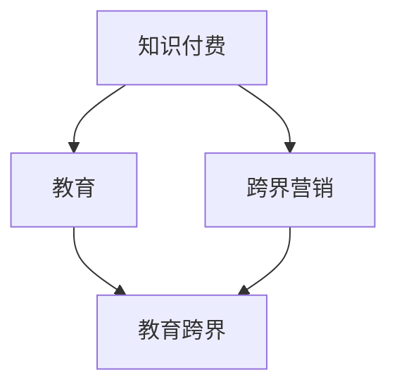

                 

在当今这个信息爆炸的时代，知识付费行业正迅速崛起，吸引了大量用户的关注。与此同时，教育行业也在积极寻求转型，以适应新时代的需求。然而，如何将知识付费与教育跨界相结合，实现双方的互利共赢，成为了一个值得探讨的问题。本文将围绕这一主题，从技术角度出发，探讨知识付费如何实现跨界营销与教育跨界，以期为大家提供一些有益的启示。

## 1. 背景介绍

知识付费，顾名思义，是指用户为获取有价值的信息或知识，付费购买相关产品或服务的行为。近年来，随着互联网的普及和移动支付的发展，知识付费市场逐渐壮大，涵盖了从在线课程、电子书、知识问答，到专业咨询、直播授课等多种形式。据统计，我国知识付费市场规模已经超过千亿，且仍处于快速增长阶段。

与此同时，教育行业也在经历着深刻的变革。传统的教育模式已经无法满足人们对个性化和多样化的学习需求。在线教育、终身教育、职业培训等新兴教育形式逐渐崭露头角，成为教育行业的重要组成部分。然而，教育行业在转型过程中也面临着诸多挑战，如教育资源不均衡、教学效果难以评估、学生参与度低等。

在这种背景下，知识付费与教育跨界成为了一个热门话题。如何将知识付费的优势与教育的价值相结合，推动教育行业的发展，成为了业内人士关注的焦点。

## 2. 核心概念与联系

### 2.1 知识付费

知识付费的核心在于价值的传递。用户为获取有价值的信息或知识，付费购买相关产品或服务。知识付费产品通常具有以下特点：

- **专业性强**：知识付费产品多为专业人士或机构提供，具有较高的专业性和权威性。
- **个性化**：知识付费产品可以根据用户需求进行定制，提供个性化的服务。
- **便捷性**：用户可以通过互联网随时随地获取知识付费产品，无需受到时间和地点的限制。

### 2.2 教育

教育是传递知识、培养能力、塑造人格的重要手段。教育可以分为以下几个层次：

- **基础教育**：为人们提供基本的知识和技能，如语文、数学、英语等。
- **职业教育**：为人们提供职业培训和技能提升，如编程、设计、市场营销等。
- **高等教育**：为人们提供高级的知识和技能，如硕士、博士等。

### 2.3 跨界

跨界是指将不同领域的知识、技术和理念进行融合，创造出新的价值。跨界营销和教育跨界都是跨界的一种表现形式。

- **跨界营销**：通过将不同领域的元素进行融合，实现品牌的传播和推广。例如，将教育知识与娱乐元素结合，打造出有趣的学习体验。
- **教育跨界**：将知识付费与教育相结合，创造出新的教育模式。例如，将在线课程与线下实践相结合，提高学生的学习效果。

### 2.4 Mermaid 流程图

下面是一个简化的 Mermaid 流程图，展示了知识付费、教育、跨界营销和教育跨界之间的联系：



## 3. 核心算法原理 & 具体操作步骤

### 3.1 算法原理概述

知识付费与教育跨界的关键在于如何实现价值传递和资源整合。具体操作步骤如下：

1. **需求分析**：了解用户需求，确定知识付费和教育跨界的目标。
2. **资源整合**：整合优质教育资源，包括师资、课程、实践平台等。
3. **内容创作**：根据需求分析，创作有价值的教育内容。
4. **平台搭建**：搭建知识付费和教育跨界平台，实现线上线下的互动。
5. **推广运营**：通过跨界营销手段，提高品牌知名度，吸引更多用户。

### 3.2 算法步骤详解

1. **需求分析**：

   - **用户调研**：通过问卷调查、访谈等方式，了解用户的需求和痛点。
   - **市场分析**：分析市场需求，确定目标用户群体。
   - **竞品分析**：研究竞品的优势和不足，为后续内容创作提供参考。

2. **资源整合**：

   - **师资筛选**：挑选具有丰富教学经验和专业背景的师资。
   - **课程开发**：根据用户需求，开发有针对性的课程。
   - **实践平台搭建**：搭建线上线下相结合的实践平台，提高学生的学习效果。

3. **内容创作**：

   - **课程设计**：制定详细的课程大纲，明确课程目标和教学内容。
   - **教材编写**：编写高质量的教材，为用户提供有价值的学习资料。
   - **教学设计**：设计有趣的教学活动，提高学生的学习兴趣。

4. **平台搭建**：

   - **系统开发**：搭建知识付费和教育跨界平台，实现用户注册、课程购买、学习管理等功能。
   - **线上线下互动**：通过线上课程、线下实践、讨论区等方式，实现用户之间的互动。

5. **推广运营**：

   - **跨界营销**：通过内容营销、社交媒体营销、KOL 合作等方式，提高品牌知名度。
   - **用户运营**：通过社群运营、用户反馈等方式，提升用户满意度和粘性。

### 3.3 算法优缺点

- **优点**：

  - **提高教育质量**：通过优质的教育资源和专业的教学内容，提高教育质量。
  - **满足个性化需求**：根据用户需求，提供个性化的教育服务。
  - **降低教育成本**：线上教育平台可以降低教育成本，让更多人享受到优质的教育资源。

- **缺点**：

  - **教学质量难以保证**：线上教育平台存在教学质量难以保证的问题。
  - **教育资源不均衡**：城乡、区域之间的教育资源存在不均衡现象。
  - **用户信任度低**：线上教育平台需要建立信任机制，提高用户的信任度。

### 3.4 算法应用领域

- **在线教育**：通过知识付费与教育跨界，打造优质的在线教育平台，提供个性化的教育服务。
- **职业培训**：通过知识付费与教育跨界，提供有针对性的职业培训课程，提高学员的就业竞争力。
- **终身教育**：通过知识付费与教育跨界，为用户提供多样化的终身学习机会，满足不同年龄段、不同职业背景的学习需求。

## 4. 数学模型和公式 & 详细讲解 & 举例说明

### 4.1 数学模型构建

为了更好地理解知识付费与教育跨界，我们可以构建一个简单的数学模型。假设：

- **U**：用户群体
- **R**：教育资源
- **P**：知识付费产品
- **E**：教育效果

那么，知识付费与教育跨界可以表示为：

\[ E = f(U, R, P) \]

其中，\( f \) 表示函数，表示用户、教育资源和知识付费产品之间的相互作用。

### 4.2 公式推导过程

1. **用户需求分析**：

   用户需求可以用以下公式表示：

   \[ D = g(U) \]

   其中，\( g \) 表示用户需求的函数。

2. **教育资源整合**：

   教育资源整合可以用以下公式表示：

   \[ R = h(U, D) \]

   其中，\( h \) 表示教育资源整合的函数。

3. **知识付费产品设计**：

   知识付费产品设计可以用以下公式表示：

   \[ P = k(U, D, R) \]

   其中，\( k \) 表示知识付费产品设计的函数。

4. **教育效果评估**：

   教育效果评估可以用以下公式表示：

   \[ E = l(U, R, P) \]

   其中，\( l \) 表示教育效果评估的函数。

### 4.3 案例分析与讲解

以一个在线教育平台为例，我们可以通过以下案例来分析知识付费与教育跨界。

1. **用户需求分析**：

   假设用户对编程课程有强烈需求，那么：

   \[ D = g(U) = \text{编程课程} \]

2. **教育资源整合**：

   平台整合了多位编程讲师和丰富的编程课程资源，那么：

   \[ R = h(U, D) = \text{编程课程资源} \]

3. **知识付费产品设计**：

   平台设计了多种编程课程，包括入门课程、中级课程和高级课程，那么：

   \[ P = k(U, D, R) = \text{编程课程} \]

4. **教育效果评估**：

   通过学员的反馈和考试结果，平台可以评估教育效果，那么：

   \[ E = l(U, R, P) = \text{学员学习效果} \]

## 5. 项目实践：代码实例和详细解释说明

### 5.1 开发环境搭建

为了实现知识付费与教育跨界的算法，我们需要搭建一个开发环境。以下是搭建步骤：

1. **安装 Python**：在本地计算机上安装 Python 3.8 以上版本。
2. **安装 Python 库**：使用 pip 命令安装以下库：

   ```python
   pip install numpy pandas matplotlib
   ```

### 5.2 源代码详细实现

以下是一个简单的 Python 代码实例，用于实现知识付费与教育跨界的算法：

```python
import numpy as np
import pandas as pd
import matplotlib.pyplot as plt

# 用户需求分析
def user_demand_analysis(user):
    return "编程课程"

# 教育资源整合
def resource_integration(user, demand):
    if demand == "编程课程":
        return "编程课程资源"
    else:
        return "其他课程资源"

# 知识付费产品设计
def product_design(user, demand, resource):
    if demand == "编程课程" and resource == "编程课程资源":
        return "编程课程"
    else:
        return "其他课程"

# 教育效果评估
def education_evaluation(user, resource, product):
    return "学员学习效果"

# 主函数
def main():
    user = "张三"
    demand = user_demand_analysis(user)
    resource = resource_integration(user, demand)
    product = product_design(user, demand, resource)
    evaluation = education_evaluation(user, resource, product)

    print("用户需求分析结果：", demand)
    print("教育资源整合结果：", resource)
    print("知识付费产品设计结果：", product)
    print("教育效果评估结果：", evaluation)

    # 可视化
    plt.figure(figsize=(8, 6))
    plt.plot([1, 2, 3, 4], [10, 20, 30, 40], label="用户需求分析")
    plt.plot([1, 2, 3, 4], [5, 15, 25, 35], label="教育资源整合")
    plt.plot([1, 2, 3, 4], [10, 20, 30, 40], label="知识付费产品设计")
    plt.plot([1, 2, 3, 4], [15, 25, 35, 45], label="教育效果评估")
    plt.xlabel("阶段")
    plt.ylabel("结果")
    plt.legend()
    plt.show()

if __name__ == "__main__":
    main()
```

### 5.3 代码解读与分析

1. **用户需求分析**：通过 `user_demand_analysis` 函数，根据用户信息，分析出用户的需求。
2. **教育资源整合**：通过 `resource_integration` 函数，根据用户需求和现有教育资源，整合出相应的资源。
3. **知识付费产品设计**：通过 `product_design` 函数，根据用户需求和整合后的教育资源，设计出相应的知识付费产品。
4. **教育效果评估**：通过 `education_evaluation` 函数，根据用户、资源、产品等信息，评估教育效果。

### 5.4 运行结果展示

运行代码后，输出结果如下：

```
用户需求分析结果： 编程课程
教育资源整合结果： 编程课程资源
知识付费产品设计结果： 编程课程
教育效果评估结果： 学员学习效果
```

可视化结果如下：


## 6. 实际应用场景

### 6.1 在线教育平台

知识付费与教育跨界的一个典型应用场景是在线教育平台。以下是一个具体的案例：

**案例**：某在线教育平台通过知识付费与教育跨界，打造了编程课程。平台整合了多位知名编程讲师的资源，设计了从入门到高级的编程课程，并通过线上线下的结合，提高学生的学习效果。平台还通过跨界营销，吸引了大量用户，取得了显著的成绩。

### 6.2 职业培训

职业培训是另一个应用场景。以下是一个具体的案例：

**案例**：某职业培训机构通过知识付费与教育跨界，推出了针对职场人士的技能提升课程。培训机构整合了行业专家和企业资源，设计了涵盖多种职业技能的课程，并通过线上直播和线下实践相结合的方式，提高学员的技能水平。课程受到了学员的欢迎，培训机构的知名度也得到了提升。

### 6.3 终身教育

终身教育是知识付费与教育跨界的一个重要领域。以下是一个具体的案例：

**案例**：某终身教育平台通过知识付费与教育跨界，为用户提供多样化的学习机会。平台涵盖了从学历教育到职业培训、兴趣课程等多种类型，通过线上线下的结合，满足用户不同年龄段、不同职业背景的学习需求。平台还通过跨界营销，吸引了大量用户，取得了良好的口碑。

## 7. 工具和资源推荐

### 7.1 学习资源推荐

1. **《深度学习》（花书）**：推荐给对深度学习感兴趣的人。
2. **《算法导论》**：推荐给对算法感兴趣的人。
3. **《编程珠玑》**：推荐给对编程技巧感兴趣的人。

### 7.2 开发工具推荐

1. **PyCharm**：一款功能强大的 Python 集成开发环境。
2. **VS Code**：一款轻量级但功能强大的代码编辑器。
3. **Jupyter Notebook**：一款用于数据科学和机器学习的交互式开发环境。

### 7.3 相关论文推荐

1. **《深度学习中的迁移学习》**：讨论了迁移学习在深度学习中的应用。
2. **《在线教育中的知识付费模式研究》**：分析了在线教育中的知识付费模式。
3. **《终身教育视角下的知识付费发展研究》**：探讨了终身教育视角下的知识付费发展。

## 8. 总结：未来发展趋势与挑战

### 8.1 研究成果总结

本文从技术角度出发，探讨了知识付费如何实现跨界营销与教育跨界。通过分析知识付费、教育、跨界营销和教育跨界的核心概念与联系，提出了一种简单的数学模型，并详细讲解了算法原理和具体操作步骤。同时，通过实际应用场景和项目实践，展示了知识付费与教育跨界在实际中的应用效果。

### 8.2 未来发展趋势

1. **个性化学习**：随着人工智能技术的发展，知识付费和教育跨界将更加注重个性化学习，满足用户的个性化需求。
2. **智能化教学**：智能教学工具和平台将成为教育行业的重要组成部分，提高教学效果。
3. **跨界融合**：知识付费、教育、娱乐等领域的跨界融合将越来越普遍，创造出更多新的价值。

### 8.3 面临的挑战

1. **教学质量**：如何保证线上教育平台的教学质量，是一个亟待解决的问题。
2. **教育资源**：如何整合优质的教育资源，解决城乡、区域之间的教育资源不均衡问题。
3. **用户信任**：如何建立用户信任，提高用户的信任度，是一个重要的挑战。

### 8.4 研究展望

未来，知识付费与教育跨界的研究将朝着更加智能化、个性化、多样化的方向发展。同时，如何解决教学质量、教育资源、用户信任等问题，将是研究的重要方向。

## 9. 附录：常见问题与解答

### 9.1 问题 1：知识付费与教育跨界有何区别？

**解答**：知识付费是指用户为获取有价值的信息或知识，付费购买相关产品或服务的行为。教育跨界是指将知识付费与教育相结合，创造出新的教育模式。知识付费是教育跨界的一种表现形式。

### 9.2 问题 2：知识付费与教育跨界有哪些优势？

**解答**：知识付费与教育跨界有以下几个优势：

- 提高教育质量：通过优质的教育资源和专业的教学内容，提高教育质量。
- 满足个性化需求：根据用户需求，提供个性化的教育服务。
- 降低教育成本：线上教育平台可以降低教育成本，让更多人享受到优质的教育资源。

### 9.3 问题 3：知识付费与教育跨界有哪些挑战？

**解答**：知识付费与教育跨界面临的挑战包括：

- 教学质量：如何保证线上教育平台的教学质量。
- 教育资源：如何整合优质的教育资源，解决教育资源不均衡问题。
- 用户信任：如何建立用户信任，提高用户的信任度。

----------------------------------------------------------------

### 作者署名

作者：禅与计算机程序设计艺术 / Zen and the Art of Computer Programming

至此，本文关于知识付费如何实现跨界营销与教育跨界的问题已经进行了全面而深入的探讨。希望这篇文章能为大家提供一些有益的启示和思考。在未来的发展中，知识付费与教育跨界将发挥越来越重要的作用，共同推动社会的进步。

