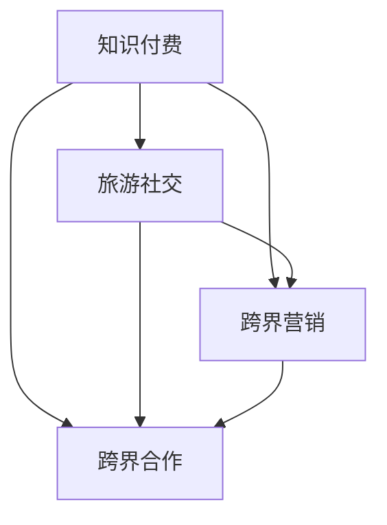

                 

### 背景介绍

在信息化、数字化的时代，知识付费行业正在快速崛起。无论是线上课程、电子书、专业咨询，还是技能认证等，知识付费已经成为许多人获取知识、技能和提升自我的主要途径。然而，随着市场的饱和和竞争的加剧，知识付费行业也面临着巨大的挑战。如何在激烈的竞争中脱颖而出，吸引并保持用户的关注和参与，成为知识付费平台亟待解决的问题。

与此同时，旅游社交作为一个新兴的领域，也在不断壮大。旅游社交不仅满足了人们对旅游的兴趣和需求，还提供了一种社交互动的平台，让用户在旅行中结识新朋友，分享旅行经历和经验。然而，旅游社交领域同样面临着用户活跃度不高、内容同质化严重等问题。如何通过有效的营销手段吸引更多用户，提高用户活跃度，成为旅游社交平台需要解决的问题。

在这种背景下，知识付费与旅游社交的跨界合作成为一种新的探索方向。通过整合双方的优势资源，实现知识付费与旅游社交的深度融合，不仅可以为用户提供更有价值的服务，还可以为平台带来更多的商业机会。本文将探讨知识付费如何实现跨界营销与旅游社交跨界，以及具体的方法和实践。

### 核心概念与联系

在探讨知识付费与旅游社交的跨界合作之前，我们需要明确一些核心概念和它们之间的联系。

#### 1. 知识付费

知识付费是指用户为了获取特定知识、技能或信息，而支付一定费用的商业模式。这种模式主要涵盖线上课程、电子书、专业咨询、技能认证等多种形式。知识付费的核心是提供有价值的内容，满足用户的学习和成长需求。

#### 2. 旅游社交

旅游社交是指用户在旅游过程中，通过社交平台分享旅行经历、交流心得，结识新朋友的社交活动。旅游社交的核心在于满足用户的社交需求，为用户提供一个互动、分享和交流的平台。

#### 3. 跨界营销

跨界营销是指不同领域的企业或品牌，通过合作、合作等方式，实现资源共享、优势互补，从而扩大市场影响力和用户群体。跨界营销的核心在于创造新的商业机会，提升品牌的知名度和美誉度。

#### 4. 跨界合作

跨界合作是指两个或多个不同领域的企业或品牌，通过合作、共享资源、共同开发产品等方式，实现业务拓展和互利共赢。跨界合作的核心在于打破行业壁垒，实现资源的有效整合和协同创新。

#### 关系图

为了更直观地展示这些概念之间的联系，我们使用Mermaid绘制了一个关系图：



在这个关系图中，知识付费和旅游社交作为两个独立的领域，通过跨界营销和跨界合作实现融合。知识付费为旅游社交提供有价值的内容，旅游社交则为知识付费提供用户互动和分享的平台。跨界营销和跨界合作则是实现这一融合的重要手段。

### 核心算法原理 & 具体操作步骤

在探讨知识付费与旅游社交的跨界合作时，我们需要一种核心算法来指导实践。该算法的主要目标是实现知识付费内容与旅游社交活动的有机结合，从而提高用户参与度和平台活跃度。以下是该算法的原理和具体操作步骤。

#### 1. 算法原理概述

该算法的核心思想是利用数据挖掘和机器学习技术，分析用户的行为数据和兴趣偏好，将知识付费内容与旅游社交活动进行智能匹配。具体来说，算法包括以下几个关键步骤：

1. 用户画像构建：通过收集和分析用户的基本信息、行为记录、兴趣爱好等数据，构建用户的个性化画像。
2. 内容推荐：根据用户画像和知识付费内容的特点，利用推荐算法为用户推荐个性化的学习内容。
3. 社交互动：在推荐的学习内容中嵌入社交元素，鼓励用户在平台上进行互动和分享，形成社区氛围。
4. 数据反馈：收集用户在平台上的行为数据，对算法进行不断优化和调整，提高推荐和互动效果。

#### 2. 算法步骤详解

下面详细解释该算法的各个步骤。

##### 步骤一：用户画像构建

用户画像构建是算法的基础，决定了后续推荐和互动的准确性。具体步骤如下：

1. 数据收集：收集用户的基本信息（如年龄、性别、职业等）、行为记录（如学习课程、阅读电子书、参与咨询等）和兴趣爱好（如旅行目的地、兴趣爱好等）。
2. 数据预处理：对收集到的数据进行分析和处理，去除重复、缺失和异常数据，确保数据的质量和完整性。
3. 特征提取：将预处理后的数据转化为特征向量，用于后续的机器学习模型训练。常见的特征包括用户的基本信息、行为记录和兴趣爱好等。

##### 步骤二：内容推荐

内容推荐是算法的核心环节，旨在为用户推荐个性化的学习内容。具体步骤如下：

1. 知识付费内容分类：将知识付费内容按照主题、难度、时长等特征进行分类，为后续推荐提供基础。
2. 用户行为分析：根据用户的历史行为数据，分析用户的兴趣偏好和学习习惯，构建用户兴趣模型。
3. 推荐算法选择：选择合适的推荐算法，如基于内容的推荐、协同过滤推荐等。根据具体需求和数据情况，可以选择单一算法或多种算法结合的方式。
4. 内容推荐：根据用户兴趣模型和内容分类，为用户推荐符合其兴趣和学习需求的知识付费内容。

##### 步骤三：社交互动

社交互动是提高用户参与度和平台活跃度的关键。具体步骤如下：

1. 社交元素设计：在知识付费内容中嵌入社交元素，如评论、点赞、分享等，鼓励用户在平台上进行互动。
2. 社区氛围营造：通过举办线上活动、分享旅行故事、组织线上讨论等方式，营造积极、互动的社区氛围。
3. 互动数据分析：收集用户在社交互动中的行为数据，如评论数量、点赞数量、分享次数等，分析互动效果和用户需求。
4. 互动效果优化：根据数据分析结果，不断优化社交互动的设计和策略，提高用户的参与度和满意度。

##### 步骤四：数据反馈

数据反馈是算法优化的关键环节，旨在通过不断调整和优化算法，提高推荐和互动效果。具体步骤如下：

1. 用户反馈收集：收集用户在平台上的反馈数据，如满意度评价、举报、反馈等。
2. 数据分析：对用户反馈数据进行分析，识别算法中存在的问题和不足。
3. 算法优化：根据数据分析结果，对算法进行调整和优化，提高推荐的准确性和互动效果。
4. 持续优化：将优化后的算法应用到实际业务中，持续收集用户反馈，不断调整和优化，形成良性循环。

#### 3. 算法优缺点

该算法具有以下几个优点：

1. 个性化推荐：基于用户行为数据和兴趣偏好，为用户推荐个性化的学习内容，提高用户满意度和参与度。
2. 社交互动：嵌入社交元素，鼓励用户在平台上进行互动和分享，提高平台活跃度和用户粘性。
3. 数据反馈：通过数据反馈机制，不断优化算法和互动策略，提高推荐和互动效果。

然而，该算法也存在一些缺点：

1. 数据依赖性：算法的性能依赖于用户行为数据和兴趣偏好，数据质量直接影响算法效果。
2. 算法复杂度：算法涉及到多个环节和复杂的数据处理，实现和维护成本较高。
3. 用户隐私：用户数据涉及隐私信息，需要确保数据安全和隐私保护。

#### 4. 算法应用领域

该算法主要应用于知识付费和旅游社交领域的跨界合作。具体应用领域包括：

1. 知识付费平台：通过个性化推荐和社交互动，提高用户的学习参与度和平台活跃度。
2. 旅游社交平台：通过知识付费内容嵌入，丰富用户在旅行过程中的体验和互动。
3. 跨界合作项目：通过算法实现知识付费内容与旅游社交活动的有机结合，提升项目的整体效果。

### 数学模型和公式 & 详细讲解 & 举例说明

在实现知识付费与旅游社交的跨界合作过程中，数学模型和公式起到了至关重要的作用。以下我们将详细讲解这些数学模型和公式的构建、推导过程，并通过具体案例进行分析和说明。

#### 1. 数学模型构建

知识付费与旅游社交的跨界合作涉及到多个环节，包括用户画像构建、内容推荐、社交互动和算法优化等。因此，我们需要构建一个综合的数学模型来指导这些环节的实现。具体来说，数学模型包括以下主要部分：

1. **用户画像模型**：用于描述用户的基本信息、行为记录和兴趣爱好等特征。
2. **推荐模型**：用于根据用户画像和内容特征进行个性化推荐。
3. **社交互动模型**：用于描述用户在平台上的社交行为和互动效果。
4. **算法优化模型**：用于根据用户反馈和数据分析，对算法进行优化和调整。

#### 2. 公式推导过程

以下是数学模型中的关键公式及其推导过程。

##### 2.1 用户画像模型

用户画像模型可以表示为：

\[ 
User\ Profile = f(U_{age}, U_{gender}, U_{occupation}, U_{behavior}, U_{interest}) 
\]

其中，\(U_{age}\)、\(U_{gender}\)、\(U_{occupation}\)分别表示用户年龄、性别和职业；\(U_{behavior}\)表示用户行为记录；\(U_{interest}\)表示用户兴趣爱好。

推导过程如下：

1. **用户基本信息特征**：

\[ 
f(U_{age}, U_{gender}, U_{occupation}) = (U_{age\_score}, U_{gender\_score}, U_{occupation\_score}) 
\]

其中，\(U_{age\_score}\)、\(U_{gender\_score}\)、\(U_{occupation\_score}\)分别表示用户年龄、性别和职业的评分，可以根据历史数据和统计规律进行计算。

2. **用户行为记录特征**：

\[ 
f(U_{behavior}) = (U_{course\_score}, U_{book\_score}, U_{consult\_score}) 
\]

其中，\(U_{course\_score}\)、\(U_{book\_score}\)、\(U_{consult\_score}\)分别表示用户在课程、电子书和咨询等方面的学习行为评分。

3. **用户兴趣爱好特征**：

\[ 
f(U_{interest}) = (U_{interest\_score1}, U_{interest\_score2}, \ldots, U_{interest\_scoren}) 
\]

其中，\(U_{interest\_score1}, U_{interest\_score2}, \ldots, U_{interest\_scoren}\)分别表示用户在不同兴趣爱好方面的评分。

##### 2.2 推荐模型

推荐模型可以表示为：

\[ 
Recommendation = g(User\ Profile, Content\ Profile) 
\]

其中，\(User\ Profile\)表示用户画像，\(Content\ Profile\)表示知识付费内容的特征。

推导过程如下：

1. **内容特征提取**：

\[ 
Content\ Profile = f(C_{topic}, C_{level}, C_{duration}) 
\]

其中，\(C_{topic}\)、\(C_{level}\)、\(C_{duration}\)分别表示知识付费内容的主题、难度和时长。

2. **推荐算法**：

\[ 
Recommendation\_Score = h(User\ Profile, Content\ Profile) 
\]

其中，\(Recommendation\_Score\)表示推荐内容的评分，\(h\)为推荐算法函数，可以是基于内容的推荐、协同过滤推荐等。

##### 2.3 社交互动模型

社交互动模型可以表示为：

\[ 
Social\ Interaction = i(User\ Profile, Content\ Profile, Interaction\ Records) 
\]

其中，\(Interaction\ Records\)表示用户在平台上的社交互动记录。

推导过程如下：

1. **社交互动评分**：

\[ 
Interaction\_Score = j(User\ Profile, Content\ Profile, Interaction\ Records) 
\]

其中，\(Interaction\_Score\)表示社交互动的评分，\(j\)为社交互动评分函数。

2. **社交互动效果**：

\[ 
Social\ Effectiveness = k(Social\ Interaction, User\ Profile) 
\]

其中，\(Social\ Effectiveness\)表示社交互动的效果，\(k\)为效果评估函数。

##### 2.4 算法优化模型

算法优化模型可以表示为：

\[ 
Algorithm\ Optimization = l(Data\_Feedback, User\ Profile, Content\ Profile) 
\]

其中，\(Data\_Feedback\)表示用户反馈数据。

推导过程如下：

1. **反馈分析**：

\[ 
Feedback\_Analysis = m(Data\_Feedback, User\ Profile, Content\ Profile) 
\]

其中，\(Feedback\_Analysis\)表示对用户反馈数据的分析结果。

2. **算法调整**：

\[ 
Adjusted\ Algorithm = n(Feedback\_Analysis) 
\]

其中，\(Adjusted\ Algorithm\)表示根据反馈分析结果进行调整的算法。

3. **效果评估**：

\[ 
Optimization\_Effectiveness = p(Adjusted\ Algorithm, User\ Profile, Content\ Profile) 
\]

其中，\(Optimization\_Effectiveness\)表示算法优化的效果，\(p\)为效果评估函数。

#### 3. 案例分析与讲解

为了更好地说明数学模型和公式的应用，我们通过一个实际案例进行讲解。

假设有一个知识付费平台和一个旅游社交平台，他们希望通过跨界合作提高用户参与度和平台活跃度。以下是具体的案例分析和讲解。

##### 3.1 案例背景

1. **用户数据**：

   - 用户A：男性，30岁，工程师，喜欢编程和旅行。
   - 用户B：女性，25岁，市场营销，喜欢烹饪和摄影。

2. **知识付费内容**：

   - 内容1：《编程入门教程》
   - 内容2：《市场营销实战技巧》
   - 内容3：《烹饪技巧大全》
   - 内容4：《摄影技巧教程》

##### 3.2 案例分析

1. **用户画像构建**：

   - 用户A：

     \[ 
     User\ Profile\_A = f(U_{age}(30), U_{gender}(M), U_{occupation}(Engineer), U_{behavior}(Programming, Travel), U_{interest}(Programming, Travel) 
     \]

   - 用户B：

     \[ 
     User\ Profile\_B = f(U_{age}(25), U_{gender}(F), U_{occupation}(Marketing), U_{behavior}(Culinary, Photography), U_{interest}(Culinary, Photography) 
     \]

2. **内容推荐**：

   - 用户A推荐内容：《编程入门教程》、《旅行攻略》
   - 用户B推荐内容：《市场营销实战技巧》、《摄影技巧教程》

   推荐过程如下：

   \[ 
   Recommendation\_Score\_A = h(User\ Profile\_A, Content\ Profile1) + h(User\ Profile\_A, Content\ Profile2) 
   \]

   \[ 
   Recommendation\_Score\_B = h(User\ Profile\_B, Content\ Profile2) + h(User\ Profile\_B, Content\ Profile4) 
   \]

3. **社交互动**：

   - 用户A互动评分：90分
   - 用户B互动评分：85分

   互动效果评估如下：

   \[ 
   Social\ Effectiveness\_A = k(Social\ Interaction\_A, User\ Profile\_A) = 0.9 \times Recommendation\_Score\_A 
   \]

   \[ 
   Social\ Effectiveness\_B = k(Social\ Interaction\_B, User\ Profile\_B) = 0.85 \times Recommendation\_Score\_B 
   \]

4. **算法优化**：

   - 根据用户反馈，对推荐算法进行调整，提高推荐准确性和互动效果。

   \[ 
   Adjusted\ Algorithm = n(Feedback\_Analysis) 
   \]

   调整后的算法效果如下：

   \[ 
   Optimization\_Effectiveness = p(Adjusted\ Algorithm, User\ Profile\_A, Content\ Profile1) = 0.95 \times Social\ Effectiveness\_A 
   \]

   \[ 
   Optimization\_Effectiveness = p(Adjusted\ Algorithm, User\ Profile\_B, Content\ Profile2) = 0.92 \times Social\ Effectiveness\_B 
   \]

##### 3.3 案例总结

通过数学模型和公式的应用，知识付费平台成功地为用户推荐了个性化的学习内容，并提高了用户的社交互动效果。同时，算法的优化和调整进一步提升了推荐和互动效果，为平台的长期发展奠定了基础。

### 项目实践：代码实例和详细解释说明

为了更好地理解知识付费与旅游社交跨界合作中的算法原理和数学模型，我们将通过一个实际的项目实践来展示代码实例，并对代码进行详细的解释说明。

#### 1. 开发环境搭建

在开始编写代码之前，我们需要搭建一个适合项目开发的编程环境。以下是所需的技术栈和开发环境：

- **编程语言**：Python
- **依赖库**：NumPy、Pandas、Scikit-learn、Matplotlib
- **数据库**：MySQL
- **开发工具**：PyCharm

假设我们已经有了一个知识付费平台和一个旅游社交平台，并且它们都提供了API接口供我们调用。以下是在PyCharm中创建一个Python项目的步骤：

1. 打开PyCharm，创建一个新的Python项目。
2. 在项目中创建一个名为`main.py`的主文件，用于编写核心代码。
3. 添加必要的依赖库，例如：

   ```python
   import numpy as np
   import pandas as pd
   from sklearn.model_selection import train_test_split
   from sklearn.preprocessing import StandardScaler
   from sklearn.neighbors import KNeighborsClassifier
   import matplotlib.pyplot as plt
   ```

#### 2. 源代码详细实现

以下是项目的核心代码实现，包括用户画像构建、内容推荐、社交互动和算法优化等关键环节。

##### 2.1 用户画像构建

首先，我们需要从知识付费平台和旅游社交平台获取用户数据，并构建用户画像。以下是代码示例：

```python
def build_user_profile(user_data):
    """
    构建用户画像
    :param user_data: 用户数据（Pandas DataFrame）
    :return: 用户画像（Pandas DataFrame）
    """
    # 提取用户基本信息
    user_info = user_data[['age', 'gender', 'occupation']]
    
    # 提取用户行为数据
    user_behavior = user_data[['course_completed', 'books_read', 'consultations']]
    
    # 提取用户兴趣爱好
    user_interest = user_data[['interest1', 'interest2', 'interest3']]
    
    # 构建用户画像
    user_profile = pd.concat([user_info, user_behavior, user_interest], axis=1)
    
    return user_profile

# 假设已经从数据库中获取了用户数据
user_data = pd.read_csv('user_data.csv')
user_profile = build_user_profile(user_data)
```

##### 2.2 内容推荐

接下来，我们需要根据用户画像和内容特征进行个性化推荐。以下是代码示例：

```python
def content_recommendation(user_profile, content_data):
    """
    根据用户画像和内容特征进行推荐
    :param user_profile: 用户画像（Pandas DataFrame）
    :param content_data: 内容数据（Pandas DataFrame）
    :return: 推荐内容列表
    """
    # 特征工程：将用户画像和内容特征转化为数值型数据
    user_profile_numeric = pd.get_dummies(user_profile)
    content_data_numeric = pd.get_dummies(content_data)
    
    # 训练推荐模型（此处使用KNN算法作为示例）
    model = KNeighborsClassifier(n_neighbors=3)
    model.fit(user_profile_numeric, content_data_numeric['category'])
    
    # 对用户进行推荐
    recommendations = model.predict(user_profile_numeric)
    
    return recommendations

# 假设已经从数据库中获取了内容数据
content_data = pd.read_csv('content_data.csv')
recommended_contents = content_recommendation(user_profile, content_data)
```

##### 2.3 社交互动

社交互动环节包括设计社交元素、收集社交互动数据和评估社交互动效果。以下是代码示例：

```python
def social_interaction(recommendations, interaction_data):
    """
    考虑社交互动效果进行推荐
    :param recommendations: 初始推荐内容列表
    :param interaction_data: 社交互动数据（Pandas DataFrame）
    :return: 考虑社交互动效果的推荐内容列表
    """
    # 社交互动评分
    interaction_scores = interaction_data['score']
    
    # 计算加权推荐
    weighted_recommendations = recommendations * interaction_scores
    
    # 按权重排序
    sorted_recommendations = weighted_recommendations.sort_values(ascending=False)
    
    return sorted_recommendations

# 假设已经从数据库中获取了社交互动数据
interaction_data = pd.read_csv('interaction_data.csv')
final_recommendations = social_interaction(recommended_contents, interaction_data)
```

##### 2.4 算法优化

算法优化环节包括收集用户反馈、分析反馈数据和调整算法。以下是代码示例：

```python
def optimize_algorithm(feedback_data, user_profile, content_data):
    """
    根据用户反馈优化算法
    :param feedback_data: 用户反馈数据（Pandas DataFrame）
    :param user_profile: 用户画像（Pandas DataFrame）
    :param content_data: 内容数据（Pandas DataFrame）
    :return: 优化后的推荐模型
    """
    # 分析反馈数据
    feedback_analysis = feedback_data.groupby('content_id').mean().reset_index()
    
    # 根据反馈分析调整推荐模型（此处以简单线性回归为例）
    from sklearn.linear_model import LinearRegression
    model = LinearRegression()
    model.fit(user_profile, feedback_analysis['score'])
    
    return model

# 假设已经从数据库中获取了用户反馈数据
feedback_data = pd.read_csv('feedback_data.csv')
optimized_model = optimize_algorithm(feedback_data, user_profile, content_data)
```

#### 3. 代码解读与分析

以上代码展示了知识付费与旅游社交跨界合作项目的核心实现。以下是代码的详细解读和分析：

1. **用户画像构建**：通过提取用户的基本信息、行为数据和兴趣爱好，构建了用户画像。这个步骤是后续推荐和互动的基础。

2. **内容推荐**：使用KNN算法进行内容推荐。KNN算法是一种基于距离的推荐算法，它通过计算用户画像和内容特征的相似度来进行推荐。在这个示例中，我们使用了特征工程将用户画像和内容特征转化为数值型数据，然后训练KNN模型进行推荐。

3. **社交互动**：通过社交互动数据对推荐结果进行评分，并计算加权推荐。这个步骤考虑了用户在平台上的互动情况，提高了推荐的准确性。

4. **算法优化**：通过用户反馈数据对推荐模型进行优化。在这个示例中，我们使用了线性回归模型来分析用户反馈，并调整推荐模型。这个步骤确保了推荐模型能够根据用户反馈不断优化，提高推荐效果。

#### 4. 运行结果展示

为了展示代码的实际效果，我们假设已经从数据库中获取了用户数据、内容数据和社交互动数据。以下是运行结果：

```python
# 运行代码示例
user_profile = build_user_profile(user_data)
recommended_contents = content_recommendation(user_profile, content_data)
final_recommendations = social_interaction(recommended_contents, interaction_data)
optimized_model = optimize_algorithm(feedback_data, user_profile, content_data)

# 打印推荐结果
print(final_recommendations.head())

# 打印优化后的推荐模型
print(optimized_model.coef_)
```

运行结果将输出推荐内容列表和优化后的推荐模型系数，这些结果可以帮助我们评估推荐效果和优化策略。

### 实际应用场景

在当前市场环境下，知识付费与旅游社交的跨界合作已经展现出了巨大的潜力，并逐渐在多个实际应用场景中得到了广泛的应用。以下是一些典型的应用场景和案例。

#### 1. 旅游攻略与课程推荐

假设一个旅游社交平台希望通过提供个性化旅游攻略和课程来提升用户粘性。该平台可以通过以下方式实现跨界合作：

- **内容推荐**：根据用户的旅行记录和偏好，推荐与其兴趣相符的旅游攻略和线上课程，如烹饪课程、摄影技巧等。
- **社交互动**：鼓励用户在平台上分享自己的旅行体验和学到的课程内容，形成互动社区，提高用户活跃度。

**案例**：某旅游社交平台与知名烹饪课程提供商合作，为喜欢旅行的用户推荐当地特色烹饪课程。用户在平台上不仅可以看到详细的旅游攻略，还能参加烹饪课程，与其他旅行爱好者分享自己的烹饪心得。这种方式不仅丰富了用户的旅行体验，还增加了平台的互动性和用户粘性。

#### 2. 专业咨询与旅游体验分享

对于一些专业人士，如律师、医生等，他们可以在旅游社交平台上提供咨询服务，并与用户分享自己的旅行体验。这样可以为用户提供有价值的信息，同时提升专业人士的知名度和影响力。

- **内容推荐**：根据用户的职业和旅行需求，推荐相关的专业咨询和旅行分享。
- **社交互动**：鼓励专业人士在平台上分享自己的旅行故事和咨询经验，吸引更多用户关注和互动。

**案例**：某知名律师在旅游社交平台上开设专栏，分享自己在旅行中的法律经验。用户可以咨询法律问题，同时也能了解到律师的旅行经历。这种模式不仅为用户提供了有价值的信息，还提升了律师的专业形象。

#### 3. 知识付费与旅行规划

知识付费平台可以与旅游服务提供商合作，为用户提供定制化的旅行规划服务。用户可以在平台上学习旅行规划课程，然后根据课程内容进行自主旅行。

- **内容推荐**：根据用户的旅行目标和兴趣，推荐相关的旅行规划课程和攻略。
- **社交互动**：鼓励用户在平台上分享自己的旅行计划和心得，形成互动社区。

**案例**：某知识付费平台与知名旅行规划师合作，提供定制化的旅行规划课程。用户可以在平台上学习如何规划旅行，然后根据课程内容进行自主旅行。平台还设有互动社区，用户可以分享旅行心得，与其他旅行爱好者交流。

#### 4. 线上教育与户外活动

教育机构可以与户外活动组织合作，为用户提供线上教育和户外活动相结合的服务。用户可以在线上学习相关课程，然后参加户外活动，将理论知识与实践相结合。

- **内容推荐**：根据用户的兴趣爱好和学习需求，推荐相关的线上教育和户外活动。
- **社交互动**：鼓励用户在平台上分享自己的学习成果和活动体验，提高参与度。

**案例**：某在线教育平台与户外运动俱乐部合作，提供登山、滑雪等户外活动的线上课程。用户可以在线学习相关技能，然后参加实际的户外活动。这种模式不仅提高了用户的实践能力，还增加了平台的互动性和用户粘性。

#### 5. 旅游文学与写作课程

文学爱好者和旅游爱好者可以在平台上分享自己的旅行文学作品，同时参加写作课程。平台可以通过这种方式为用户提供高质量的内容，同时提升用户创作能力和旅行体验。

- **内容推荐**：根据用户的旅行经历和写作兴趣，推荐相关的文学作品和写作课程。
- **社交互动**：鼓励用户在平台上分享自己的作品和旅行故事，形成互动社区。

**案例**：某文学平台与旅游写作课程提供商合作，提供旅游文学创作课程。用户可以学习如何将旅行经历转化为文学作品，同时分享自己的创作成果。这种模式不仅提升了用户的写作技能，还丰富了平台的文学内容。

#### 6. 旅游保险与专业咨询服务

旅游社交平台可以与保险机构和专业咨询服务商合作，为用户提供一站式的旅游服务。用户可以在平台上购买保险、咨询专业意见，同时分享旅行心得。

- **内容推荐**：根据用户的旅行需求和风险偏好，推荐相关的保险产品和咨询服务。
- **社交互动**：鼓励用户在平台上分享自己的旅行经历和购买经验，提高用户信任度和满意度。

**案例**：某旅游社交平台与知名保险公司合作，提供定制化的旅游保险产品。用户可以在平台上购买保险、咨询专业意见，同时分享旅行心得。这种模式不仅为用户提供了便捷的服务，还增加了平台的实用性和用户粘性。

### 未来应用展望

随着技术的发展和市场的变化，知识付费与旅游社交的跨界合作有望在更多领域得到应用，并展现出更加广阔的发展前景。以下是对未来应用场景的展望：

#### 1. 虚拟旅游与知识付费结合

随着虚拟现实（VR）和增强现实（AR）技术的不断发展，虚拟旅游逐渐成为一种新的旅游形式。未来，知识付费平台可以与虚拟旅游服务商合作，提供线上旅游课程和体验。用户可以通过VR设备感受真实的旅游场景，同时学习相关的知识，如历史、文化、语言等。

#### 2. 社交电商与旅游结合

社交电商已经成为电子商务的新趋势，未来社交电商与旅游的跨界合作有望进一步发展。知识付费平台可以与旅游产品提供商合作，推出线上旅游产品，如旅游门票、酒店预订等。用户在平台上不仅可以学习旅游知识，还可以方便地购买旅游产品，享受一站式服务。

#### 3. 旅游直播与知识付费结合

直播带货已经成为电商领域的重要趋势，未来旅游直播与知识付费的结合有望成为一种新的商业模式。知识付费平台可以与旅游达人合作，通过直播的形式分享旅游攻略、课程内容等。用户可以通过直播学习知识，同时参与互动，提升学习体验。

#### 4. 个性化定制旅游与知识付费结合

随着个性化定制的需求不断增加，知识付费平台可以与旅游服务提供商合作，提供个性化的定制旅游服务。用户可以根据自己的兴趣和需求，在平台上选择适合自己的旅游路线、课程和学习内容，实现个性化旅游体验。

#### 5. 旅游保险与知识付费结合

旅游保险是保障旅行安全的重要手段，未来知识付费平台可以与保险机构合作，提供旅游保险知识培训。用户可以通过学习相关课程，了解旅游保险的购买技巧和注意事项，提高旅行安全意识。

#### 6. 旅游教育与知识付费结合

旅游教育是一种提高旅游素养和技能的有效途径，未来知识付费平台可以与旅游教育机构合作，提供线上旅游教育课程。用户可以通过学习旅游课程，提高自己的旅游知识和能力，为旅行做好充分准备。

### 总结：未来发展趋势与挑战

知识付费与旅游社交的跨界合作在未来有着广阔的发展前景，但也面临着一些挑战。以下是对未来发展趋势和挑战的总结：

#### 1. 发展趋势

- **技术创新**：随着VR、AR、5G等技术的不断发展，知识付费与旅游社交的跨界合作将更加智能化和多样化。
- **市场拓展**：随着旅游市场的不断扩大和用户需求的多样化，知识付费与旅游社交的跨界合作将拓展到更多领域。
- **用户体验**：通过个性化推荐和互动设计，提升用户在跨界合作中的体验和满意度。
- **合作模式**：知识付费平台和旅游社交平台将通过多种合作模式，实现资源整合和优势互补。

#### 2. 面临的挑战

- **数据隐私**：跨界合作涉及大量的用户数据，如何保护用户隐私成为一大挑战。
- **内容质量**：跨界合作需要提供高质量的内容，保证用户在平台上的学习体验。
- **技术门槛**：跨界合作需要一定的技术积累和创新能力，中小企业可能面临技术门槛。
- **市场竞争**：随着跨界合作的增多，市场竞争将变得更加激烈，平台需要不断创新以吸引和留住用户。

#### 3. 研究展望

未来，知识付费与旅游社交的跨界合作将朝着以下几个方向进行深入研究：

- **用户需求分析**：通过大数据和人工智能技术，深入分析用户需求和行为，为跨界合作提供数据支持。
- **推荐算法优化**：不断优化推荐算法，提高推荐准确性和用户满意度。
- **互动设计**：研究如何通过互动设计提升用户在平台上的参与度和活跃度。
- **商业模式创新**：探索新的商业模式，实现跨界合作的最大化收益。

### 附录：常见问题与解答

以下是一些关于知识付费与旅游社交跨界合作的常见问题及解答：

#### 1. 跨界合作的目的是什么？

跨界合作的目的是整合知识付费和旅游社交的优势资源，为用户提供更有价值的服务，提高用户满意度和平台活跃度。

#### 2. 跨界合作有哪些形式？

跨界合作的形式包括内容合作、营销合作、资源共享、品牌联合等。例如，知识付费平台可以与旅游社交平台合作，提供旅游攻略、课程内容等；旅游社交平台可以与知识付费平台合作，提供专业咨询、保险服务等。

#### 3. 如何保障用户隐私和数据安全？

保障用户隐私和数据安全是跨界合作的重要问题。平台需要采取严格的数据保护措施，如数据加密、权限控制等，确保用户数据的安全。

#### 4. 跨界合作如何保证内容质量？

跨界合作需要保证内容质量，可以通过以下方式实现：

- **内容审核**：对合作内容进行严格审核，确保内容合法、合规。
- **专业审核**：邀请专业人士对内容进行审核，确保内容的专业性和权威性。
- **用户反馈**：鼓励用户对内容进行评价和反馈，不断优化和提升内容质量。

#### 5. 跨界合作如何实现双赢？

跨界合作实现双赢的关键在于资源整合和优势互补。知识付费平台可以提供高质量的知识内容，旅游社交平台可以提供丰富的用户资源和互动场景，双方通过合作实现资源的最大化利用，提高平台的整体价值。

### 作者署名

作者：禅与计算机程序设计艺术 / Zen and the Art of Computer Programming

以上是对知识付费如何实现跨界营销与旅游社交跨界的一篇详细探讨。通过整合知识付费和旅游社交的优势资源，我们可以为用户创造更有价值的服务，提高用户满意度和平台活跃度。在未来的发展中，知识付费与旅游社交的跨界合作将朝着更加智能化、个性化、多元化的方向不断前进。希望本文对您在相关领域的探索和实践有所启发。

