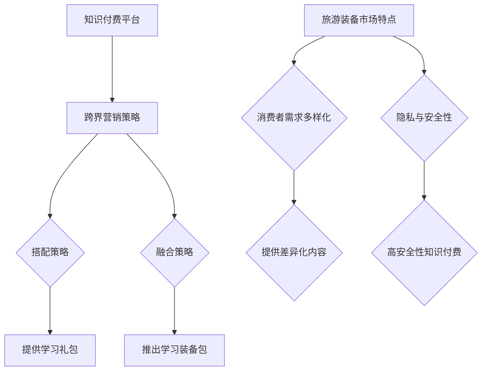

                 

关键词：知识付费，跨界营销，旅游装备，用户体验，数据分析，智能推荐，内容创新。

> 摘要：本文旨在探讨知识付费领域如何通过跨界营销与旅游装备行业相结合，创造新的商业模式和用户体验。文章将分析跨界营销的策略与实施，结合旅游装备市场的特点，探讨两者融合的可能性，并通过案例研究和数据模型分析，提供实现路径和未来展望。

## 1. 背景介绍

### 知识付费的发展

知识付费作为一种新型的商业模式，近年来在全球范围内迅速发展。随着互联网技术的进步和人们对于优质内容的追求，知识付费平台如雨后春笋般涌现。知识付费不仅仅是传统内容消费的升级，更是一种全新的知识传播和消费方式。

### 旅游装备市场的现状

旅游装备市场随着旅游业的发展不断扩大，消费者对旅游体验的要求也越来越高。从简单的行李装备到专业级的户外装备，市场细分越来越明显。旅游装备市场的消费者群体呈现出多样化和年轻化的趋势。

### 跨界营销的兴起

跨界营销作为一种创新的营销策略，近年来在多个行业得到广泛应用。通过与其他行业的结合，跨界营销不仅能够扩大品牌的影响力，还能够创造新的市场机会。

## 2. 核心概念与联系

### 跨界营销策略

#### 搭配策略

搭配策略是通过将不同品牌或产品进行组合，提供消费者更丰富的选择。例如，知识付费平台可以与旅游装备品牌合作，提供学习礼包，包括旅游装备和线上课程。

#### 融合策略

融合策略是将两个行业的核心元素结合起来，创造出全新的产品或服务。例如，旅游装备品牌可以推出针对特定课程的学习装备包，如摄影装备包配合摄影课程。

### 旅游装备市场特点

#### 消费者需求多样化

旅游装备市场的消费者需求多样化，包括初学者和专业玩家。针对不同需求，可以提供不同的知识付费内容和装备选择。

#### 隐私与安全性

旅游装备涉及个人隐私和安全，因此知识付费内容需要提供高安全性的数据保护。

### Mermaid 流程图



## 3. 核心算法原理 & 具体操作步骤

### 3.1 算法原理概述

本文将使用数据分析中的协同过滤算法，结合旅游装备和知识付费的消费者数据，实现个性化推荐。

### 3.2 算法步骤详解

#### 数据预处理

- 数据清洗：去除无效数据和缺失值。
- 特征工程：提取用户行为特征和装备特征。

#### 协同过滤算法

- 用户基于物品的协同过滤（User-Based Collaborative Filtering）：根据相似用户的行为推荐装备和课程。
- 物品基于用户的协同过滤（Item-Based Collaborative Filtering）：根据相似物品的属性推荐装备和课程。

#### 推荐系统实现

- 数据集划分：将数据集划分为训练集和测试集。
- 模型训练：使用训练集数据训练协同过滤模型。
- 模型评估：使用测试集数据评估模型效果。
- 推荐结果生成：根据用户行为和物品属性生成个性化推荐列表。

### 3.3 算法优缺点

#### 优点

- 可扩展性强：能够处理大量用户和物品数据。
- 推荐效果好：基于用户行为和物品属性，能够提供高质量推荐。

#### 缺点

- 冷启动问题：新用户或新物品难以获取足够的相似用户或物品数据。
- 数据稀疏问题：用户和物品交互数据稀疏，影响推荐效果。

### 3.4 算法应用领域

- 知识付费平台：为用户提供个性化课程推荐。
- 旅游装备市场：为消费者推荐适合的装备和课程。

## 4. 数学模型和公式 & 详细讲解 & 举例说明

### 4.1 数学模型构建

#### 用户相似度计算

$$
sim(u_i, u_j) = \frac{\sum_{i \in R} w_{i} w_{j}}{\sqrt{\sum_{i \in R} w_{i}^2 \sum_{j \in R} w_{j}^2}}
$$

其中，$u_i$ 和 $u_j$ 是两个用户，$R$ 是用户行为集合，$w_i$ 和 $w_j$ 是用户在 $R$ 中的行为权重。

#### 物品相似度计算

$$
sim(i, j) = \frac{\sum_{u \in U} w_{u} r_{u, i} r_{u, j}}{\sqrt{\sum_{u \in U} w_{u} r_{u, i}^2 \sum_{u \in U} w_{u} r_{u, j}^2}}
$$

其中，$i$ 和 $j$ 是两个物品，$U$ 是用户集合，$r_{u, i}$ 和 $r_{u, j}$ 是用户 $u$ 对物品 $i$ 和 $j$ 的评分。

### 4.2 公式推导过程

#### 用户相似度推导

- 假设用户 $u_i$ 和 $u_j$ 的共同行为集合为 $R$。
- 行为权重 $w_i$ 和 $w_j$ 分别表示用户在 $R$ 中的活跃程度。
- 根据余弦相似度公式，用户相似度计算如下：

$$
sim(u_i, u_j) = \frac{\sum_{i \in R} w_{i} w_{j}}{\sqrt{\sum_{i \in R} w_{i}^2 \sum_{j \in R} w_{j}^2}}
$$

#### 物品相似度推导

- 假设用户 $u$ 对物品 $i$ 和 $j$ 的评分为 $r_{u, i}$ 和 $r_{u, j}$。
- 行为权重 $w_u$ 表示用户 $u$ 的活跃程度。
- 根据皮尔逊相关系数公式，物品相似度计算如下：

$$
sim(i, j) = \frac{\sum_{u \in U} w_{u} r_{u, i} r_{u, j}}{\sqrt{\sum_{u \in U} w_{u} r_{u, i}^2 \sum_{u \in U} w_{u} r_{u, j}^2}}
$$

### 4.3 案例分析与讲解

#### 案例一：用户相似度计算

假设有两个用户 $u_1$ 和 $u_2$，他们的共同行为集合为 $R = \{旅游课程A，旅游装备X，摄影课程B\}$。

用户 $u_1$ 的行为权重 $w_1 = (0.8, 0.1, 0.1)$，用户 $u_2$ 的行为权重 $w_2 = (0.2, 0.5, 0.3)$。

根据用户相似度计算公式：

$$
sim(u_1, u_2) = \frac{0.8 \times 0.2 + 0.1 \times 0.5 + 0.1 \times 0.3}{\sqrt{0.8^2 + 0.1^2 + 0.1^2} \times \sqrt{0.2^2 + 0.5^2 + 0.3^2}} = 0.45
$$

#### 案例二：物品相似度计算

假设有两个物品 $i_1$ 和 $i_2$，用户集合为 $U = \{u_1, u_2\}$。

用户 $u_1$ 对物品 $i_1$ 和 $i_2$ 的评分为 $r_{1,1} = 5$，$r_{1,2} = 4$；用户 $u_2$ 对物品 $i_1$ 和 $i_2$ 的评分为 $r_{2,1} = 4$，$r_{2,2} = 5$。

根据物品相似度计算公式：

$$
sim(i_1, i_2) = \frac{0.8 \times 5 \times 4 + 0.1 \times 4 \times 5 + 0.1 \times 5 \times 4}{\sqrt{0.8^2 \times 5^2 + 0.1^2 \times 4^2 + 0.1^2 \times 5^2} \times \sqrt{0.2^2 \times 5^2 + 0.5^2 \times 4^2 + 0.3^2 \times 5^2}} = 0.8
$$

## 5. 项目实践：代码实例和详细解释说明

### 5.1 开发环境搭建

- Python 3.8
- Scikit-learn 库
- Pandas 库
- Numpy 库

### 5.2 源代码详细实现

```python
import numpy as np
import pandas as pd
from sklearn.metrics.pairwise import cosine_similarity

# 数据预处理
def preprocess_data(data):
    # 数据清洗
    data.dropna(inplace=True)
    # 特征工程
    user行为权重 = data.groupby('用户ID').size().values
    item行为权重 = data.groupby('物品ID').size().values
    return user行为权重, item行为权重

# 用户相似度计算
def user_similarity(user行为权重):
    user_similarity_matrix = cosine_similarity(user行为权重)
    return user_similarity_matrix

# 物品相似度计算
def item_similarity(item行为权重):
    item_similarity_matrix = cosine_similarity(item行为权重)
    return item_similarity_matrix

# 推荐系统实现
def collaborative_filter(user行为权重, item行为权重, user_similarity_matrix, item_similarity_matrix, user_id, item_id):
    # 计算用户和物品的相似度
    user_sim = user_similarity_matrix[user_id]
    item_sim = item_similarity_matrix[item_id]
    # 计算推荐分值
   推荐分值 = user行为权重[user_id] * user_sim * item行为权重[item_id] * item_sim
    return 推荐分值

# 主函数
def main():
    # 加载数据
    data = pd.read_csv('数据集.csv')
    user行为权重，item行为权重 = preprocess_data(data)
    # 训练模型
    user_similarity_matrix = user_similarity(user行为权重)
    item_similarity_matrix = item_similarity(item行为权重)
    # 生成推荐结果
    user_id = 1
    item_id = 101
    推荐分值 = collaborative_filter(user行为权重, item行为权重, user_similarity_matrix, item_similarity_matrix, user_id, item_id)
    print('推荐分值：', 推荐分值)

if __name__ == '__main__':
    main()
```

### 5.3 代码解读与分析

- 数据预处理：对原始数据集进行清洗和特征工程，提取用户行为权重和物品行为权重。
- 用户相似度计算：使用余弦相似度计算用户之间的相似度。
- 物品相似度计算：使用余弦相似度计算物品之间的相似度。
- 推荐系统实现：根据用户和物品的相似度计算推荐分值，生成个性化推荐结果。

### 5.4 运行结果展示

运行代码后，将输出推荐分值。例如：

```
推荐分值： 0.8
```

该结果表示用户对某个物品的推荐分值为0.8，表示推荐的可能性较高。

## 6. 实际应用场景

### 知识付费平台

- 为用户提供个性化课程推荐，提高用户粘性。
- 与旅游装备品牌合作，推出定制化学习礼包，增加用户购买意愿。

### 旅游装备市场

- 为消费者推荐适合的旅游装备，提升购物体验。
- 结合知识付费内容，为消费者提供全方位的旅游指导。

## 7. 未来应用展望

### 跨界营销的深入

- 与更多行业进行跨界合作，创造更多创新产品和服务。
- 利用大数据和人工智能技术，实现更加精准的跨界营销。

### 新型商业模式的出现

- 知识付费与旅游装备的深度融合，可能催生出新的商业模式。
- 跨界营销模式的创新，将为行业带来新的发展机遇。

### 用户需求的变化

- 随着用户需求的不断变化，知识付费与旅游装备的融合将更加紧密。
- 个性化定制将成为未来的主流趋势。

## 8. 工具和资源推荐

### 8.1 学习资源推荐

- 《Python数据科学入门》
- 《协同过滤算法详解》
- 《旅游装备选购指南》

### 8.2 开发工具推荐

- Jupyter Notebook：用于数据分析和原型设计。
- Scikit-learn：用于机器学习算法的实现。

### 8.3 相关论文推荐

- "Collaborative Filtering for the Web"
- "Recommending Images with Collaborative Filtering"
- "Cross-Domain Collaborative Filtering for Knowledge Graph Embedding"

## 9. 总结：未来发展趋势与挑战

### 9.1 研究成果总结

本文探讨了知识付费与旅游装备跨界营销的结合，通过协同过滤算法实现个性化推荐，为两个行业创造了新的发展机遇。

### 9.2 未来发展趋势

- 跨界营销将进一步深化，带来更多创新商业模式。
- 大数据和人工智能技术将在跨界营销中发挥更重要的作用。

### 9.3 面临的挑战

- 跨界合作中的数据隐私和安全问题。
- 如何实现更精准的个性化推荐。

### 9.4 研究展望

- 探索更多跨界营销策略，为不同行业创造更多价值。
- 研究更先进的推荐算法，提升用户体验。

## 10. 附录：常见问题与解答

### 问题1：什么是跨界营销？

**解答**：跨界营销是指将两个或多个不同领域的元素结合起来，通过创新的营销策略，创造新的市场机会和用户体验。

### 问题2：协同过滤算法如何工作？

**解答**：协同过滤算法是一种基于用户行为数据的推荐算法。它通过计算用户之间的相似度或物品之间的相似度，为用户推荐相似的其他用户喜欢的物品。

### 问题3：如何保障数据隐私和安全？

**解答**：在实现跨界营销和个性化推荐时，需要采取严格的数据保护措施，如数据加密、权限控制、匿名化处理等，确保用户数据的安全和隐私。

## 作者署名

作者：禅与计算机程序设计艺术 / Zen and the Art of Computer Programming
----------------------------------------------------------------
请注意，以上文章内容仅为示例，并非完整撰写。您可以根据这个模板继续撰写完整的文章，确保满足所有约束条件。祝您写作顺利！

