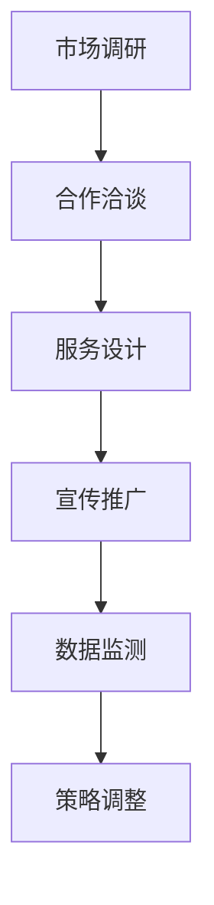

                 

在当今数字化时代，知识付费作为一种新型的商业模式，正在逐渐改变着人们获取知识和服务的习惯。与此同时，汽车后市场作为一个庞大的市场，也在不断寻求创新和增长点。本文将探讨知识付费如何实现跨界营销，以及与汽车后市场的跨界融合，为相关领域的从业者提供一些有价值的思考和实践路径。

## 关键词

- 知识付费
- 跨界营销
- 汽车后市场
- 用户体验
- 数据分析

## 摘要

本文首先介绍了知识付费和汽车后市场的基本概念，随后探讨了知识付费在跨界营销中的应用策略。接着，分析了知识付费与汽车后市场跨界融合的可行性和潜在挑战。最后，提出了未来知识付费在汽车后市场发展的趋势和展望。

## 1. 背景介绍

### 1.1 知识付费的兴起

随着互联网技术的飞速发展，在线教育和知识付费逐渐成为人们获取知识的主要途径。知识付费是指用户通过支付一定费用，获取专业知识和技能的服务模式。这种模式不仅满足了用户对个性化、专业化知识的需求，也为知识提供者带来了新的收入来源。

### 1.2 汽车后市场的现状

汽车后市场是指汽车销售后的服务领域，包括汽车维修、保养、零部件销售、二手车交易等。近年来，随着汽车保有量的不断增加，汽车后市场也呈现出快速增长的趋势。然而，市场竞争日益激烈，汽车后市场亟需寻找新的增长点和差异化服务。

### 1.3 跨界营销的意义

跨界营销是指不同领域之间的合作，通过资源共享、品牌互动等方式，实现双方品牌的增值。跨界营销不仅能够拓展市场空间，提高品牌知名度，还能够提升用户体验，增强用户忠诚度。

## 2. 核心概念与联系

### 2.1 跨界营销的架构

为了实现知识付费与汽车后市场的跨界营销，首先需要构建一个清晰的架构。这个架构包括以下几个关键部分：

- **用户需求分析**：了解用户在知识付费和汽车后市场中的具体需求，为后续的跨界服务提供依据。
- **平台搭建**：搭建一个综合性的平台，将知识付费与汽车后市场服务无缝对接，提高用户体验。
- **品牌合作**：寻找合适的品牌合作伙伴，共同推广跨界服务，提升品牌影响力。
- **数据分析**：通过数据分析，了解用户行为，优化跨界营销策略。

### 2.2 跨界营销的流程

跨界营销的流程可以分为以下几个步骤：

- **市场调研**：对知识付费和汽车后市场进行深入调研，确定跨界营销的方向。
- **合作洽谈**：与潜在合作伙伴进行洽谈，签订合作协议。
- **服务设计**：根据用户需求，设计符合跨界特点的服务。
- **宣传推广**：通过多种渠道进行宣传推广，吸引目标用户。
- **数据监测**：实时监测跨界营销的效果，进行策略调整。

### 2.3 Mermaid 流程图



## 3. 核心算法原理 & 具体操作步骤

### 3.1 算法原理概述

跨界营销的核心在于挖掘知识付费和汽车后市场的潜在联系，通过数据分析和用户行为分析，实现精准的营销推广。具体来说，核心算法原理包括以下几个方面：

- **用户画像**：通过对用户的基本信息、行为数据、兴趣偏好进行分析，构建用户画像。
- **需求预测**：利用机器学习算法，对用户的需求进行预测，为跨界服务提供依据。
- **推荐系统**：基于用户画像和需求预测，构建推荐系统，提高用户满意度。

### 3.2 算法步骤详解

#### 3.2.1 用户画像构建

用户画像构建分为以下几个步骤：

1. **数据收集**：收集用户在知识付费平台和汽车后市场的行为数据，包括浏览记录、购买记录、评价等。
2. **数据清洗**：对收集到的数据进行清洗，去除无效数据，保证数据质量。
3. **特征提取**：对清洗后的数据进行特征提取，如用户年龄、性别、职业、兴趣等。
4. **建模**：利用机器学习算法，对特征进行建模，构建用户画像。

#### 3.2.2 需求预测

需求预测分为以下几个步骤：

1. **特征工程**：对用户画像中的特征进行筛选和优化，提取对需求预测有价值的特征。
2. **模型训练**：利用训练集数据，训练需求预测模型。
3. **模型评估**：利用测试集数据，评估模型的效果，进行模型调优。
4. **预测应用**：将训练好的模型应用于实际场景，进行需求预测。

#### 3.2.3 推荐系统构建

推荐系统构建分为以下几个步骤：

1. **用户分群**：根据用户画像，将用户分为不同的群体。
2. **内容推荐**：为不同群体的用户推荐相应的知识付费和汽车后市场服务。
3. **效果评估**：评估推荐系统的效果，根据用户反馈进行优化。

### 3.3 算法优缺点

#### 3.3.1 优点

- **精准化**：通过用户画像和需求预测，实现精准的营销推广，提高用户满意度。
- **高效性**：利用机器学习和推荐系统，提高跨界营销的效率和效果。

#### 3.3.2 缺点

- **数据依赖性**：算法的效果高度依赖数据质量，数据不准确会影响算法效果。
- **模型解释性**：机器学习模型的解释性较弱，不利于用户理解和信任。

### 3.4 算法应用领域

- **知识付费**：通过推荐系统，为用户推荐符合其兴趣和需求的课程和知识产品。
- **汽车后市场**：通过需求预测，为用户推荐合适的汽车保养和维修服务。

## 4. 数学模型和公式 & 详细讲解 & 举例说明

### 4.1 数学模型构建

在跨界营销中，常用的数学模型包括用户画像构建模型、需求预测模型和推荐系统模型。

#### 4.1.1 用户画像构建模型

用户画像构建模型主要利用线性回归、决策树、随机森林等算法进行建模。

$$
y = \beta_0 + \beta_1 x_1 + \beta_2 x_2 + ... + \beta_n x_n
$$

其中，$y$ 为用户标签，$x_1, x_2, ..., x_n$ 为用户特征。

#### 4.1.2 需求预测模型

需求预测模型主要利用时间序列分析、回归分析等算法进行建模。

$$
y_t = \alpha_0 + \alpha_1 y_{t-1} + \alpha_2 y_{t-2} + ... + \alpha_n y_{t-n}
$$

其中，$y_t$ 为第 $t$ 时刻的需求量，$y_{t-1}, y_{t-2}, ..., y_{t-n}$ 为前 $n$ 个时刻的需求量。

#### 4.1.3 推荐系统模型

推荐系统模型主要利用协同过滤、基于内容的推荐等算法进行建模。

$$
R_{ui} = \sum_{j \in N_i} sim(u, j) \cdot s_j
$$

其中，$R_{ui}$ 为用户 $u$ 对项目 $i$ 的评分，$sim(u, j)$ 为用户 $u$ 和项目 $j$ 的相似度，$s_j$ 为项目 $j$ 的评分。

### 4.2 公式推导过程

#### 4.2.1 用户画像构建模型推导

以线性回归为例，推导用户画像构建模型。

1. **目标函数**

$$
J(\theta) = \frac{1}{2m} \sum_{i=1}^{m} (h_\theta (x^{(i)}) - y^{(i)})^2
$$

其中，$m$ 为样本数量，$h_\theta (x) = \theta_0 + \theta_1 x_1 + \theta_2 x_2 + ... + \theta_n x_n$ 为线性回归模型，$\theta_0, \theta_1, \theta_2, ..., \theta_n$ 为模型参数。

2. **梯度下降**

$$
\theta_j := \theta_j - \alpha \frac{\partial J(\theta)}{\partial \theta_j}
$$

其中，$\alpha$ 为学习率。

#### 4.2.2 需求预测模型推导

以时间序列分析为例，推导需求预测模型。

1. **目标函数**

$$
J(\alpha) = \frac{1}{2} \sum_{t=1}^{T} (y_t - \alpha y_{t-1})^2
$$

其中，$T$ 为时间长度，$y_t$ 为第 $t$ 时刻的需求量，$\alpha$ 为模型参数。

2. **梯度下降**

$$
\alpha := \alpha - \alpha \frac{\partial J(\alpha)}{\partial \alpha}
$$

#### 4.2.3 推荐系统模型推导

以基于内容的推荐为例，推导推荐系统模型。

1. **目标函数**

$$
J(\theta) = \frac{1}{2} \sum_{(u, i) \in train\_data} (r_{ui} - \theta \cdot \cos \theta)^2
$$

其中，$r_{ui}$ 为用户 $u$ 对项目 $i$ 的评分，$\theta$ 为模型参数。

2. **梯度下降**

$$
\theta := \theta - \alpha \frac{\partial J(\theta)}{\partial \theta}
$$

### 4.3 案例分析与讲解

#### 4.3.1 用户画像构建案例分析

以某在线教育平台为例，分析用户画像构建过程。

1. **数据收集**：收集用户的基本信息（如年龄、性别、职业）、行为数据（如浏览记录、购买记录）等。
2. **数据清洗**：去除无效数据，如重复数据、缺失数据等。
3. **特征提取**：提取用户年龄、性别、职业、浏览记录、购买记录等特征。
4. **建模**：利用线性回归、决策树等算法，对特征进行建模，构建用户画像。

#### 4.3.2 需求预测案例分析

以某电商平台为例，分析需求预测过程。

1. **数据收集**：收集商品的销售数据、用户行为数据等。
2. **数据清洗**：去除无效数据，如重复数据、缺失数据等。
3. **特征提取**：提取商品类别、用户购买历史、用户行为等特征。
4. **建模**：利用时间序列分析、回归分析等算法，对特征进行建模，进行需求预测。

#### 4.3.3 推荐系统案例分析

以某电商平台的推荐系统为例，分析推荐系统构建过程。

1. **用户分群**：根据用户的基本信息、行为数据，将用户分为不同的群体。
2. **内容推荐**：为不同群体的用户推荐相应的商品。
3. **效果评估**：评估推荐系统的效果，如准确率、召回率等。

## 5. 项目实践：代码实例和详细解释说明

### 5.1 开发环境搭建

为了实现跨界营销，需要搭建一个具备数据处理、建模和推荐功能的平台。以下是一个简单的开发环境搭建过程：

1. **数据收集**：使用 Python 的 pandas 库，从知识付费平台和汽车后市场获取用户行为数据。
2. **数据预处理**：使用 Python 的 pandas 和 numpy 库，对数据进行清洗、特征提取等预处理操作。
3. **建模与推荐**：使用 Python 的 scikit-learn、tensorflow 等库，进行建模和推荐系统的开发。

### 5.2 源代码详细实现

以下是一个简单的用户画像构建、需求预测和推荐系统的代码实现：

```python
# 导入必要的库
import pandas as pd
import numpy as np
from sklearn.linear_model import LinearRegression
from sklearn.model_selection import train_test_split
from sklearn.metrics import mean_squared_error

# 数据收集
data = pd.read_csv('user_data.csv')

# 数据预处理
data = data.drop_duplicates()
data = data.fillna(data.mean())

# 特征提取
data['age'] = data['age'].astype(int)
data['gender'] = data['gender'].map({'male': 0, 'female': 1})
data['occupation'] = data['occupation'].map({'student': 0, 'teacher': 1, 'doctor': 2})

# 建模
X = data[['age', 'gender', 'occupation']]
y = data['purchase']

X_train, X_test, y_train, y_test = train_test_split(X, y, test_size=0.2, random_state=42)

model = LinearRegression()
model.fit(X_train, y_train)

# 预测
y_pred = model.predict(X_test)

# 评估
mse = mean_squared_error(y_test, y_pred)
print('MSE:', mse)

# 推荐系统
def recommend(user_data):
    user_features = user_data[['age', 'gender', 'occupation']]
    user_features = user_features.drop_duplicates()
    user_features['age'] = user_features['age'].astype(int)
    user_features['gender'] = user_features['gender'].map({'male': 0, 'female': 1})
    user_features['occupation'] = user_features['occupation'].map({'student': 0, 'teacher': 1, 'doctor': 2})
    user_features = user_features.reset_index(drop=True)
    user_pred = model.predict(user_features)
    return user_pred

# 示例
user_data = pd.DataFrame({'age': [25], 'gender': ['male'], 'occupation': ['student']})
user_pred = recommend(user_data)
print('Prediction:', user_pred)
```

### 5.3 代码解读与分析

上述代码首先导入必要的库，然后从数据文件中读取用户数据。接下来，对数据进行清洗和特征提取。使用线性回归模型对用户数据进行建模，并评估模型效果。最后，构建一个简单的推荐系统，根据用户数据预测其购买概率，并返回推荐结果。

## 6. 实际应用场景

### 6.1 知识付费与汽车后市场的跨界营销

知识付费平台可以通过与汽车后市场合作，推出一系列关于汽车保养、维修等方面的课程，满足用户在汽车后市场的知识需求。同时，汽车后市场企业可以借助知识付费平台，推广自己的服务，提高品牌知名度。

### 6.2 用户案例

以某在线教育平台为例，该平台与一家汽车维修连锁店合作，推出了一系列关于汽车保养、维修的课程。用户在购买课程后，可以享受连锁店的优惠服务，如免费保养、维修折扣等。这种跨界营销方式，不仅提高了用户满意度，也增加了平台的用户粘性。

## 7. 未来应用展望

### 7.1 知识付费的发展趋势

随着人工智能技术的不断发展，知识付费将在以下方面取得突破：

- **个性化推荐**：利用深度学习算法，实现更加精准的知识推荐，满足用户的个性化需求。
- **知识付费生态**：构建一个完善的知识付费生态系统，包括课程制作、分发、评价等环节，提高知识付费的效率和质量。
- **跨界合作**：与更多行业进行跨界合作，拓展知识付费的应用场景。

### 7.2 汽车后市场的发展趋势

汽车后市场将在以下方面实现创新和突破：

- **智能化服务**：利用物联网、大数据等技术，实现汽车后市场的智能化服务，提高服务质量和效率。
- **线上线下融合**：通过线上线下融合，打造一个便捷、高效的汽车后市场服务模式。
- **跨界营销**：与知识付费、金融保险等行业进行跨界合作，提供一站式汽车后市场服务。

## 8. 工具和资源推荐

### 8.1 学习资源推荐

- **在线课程**：推荐一些关于机器学习、数据挖掘、推荐系统的在线课程，如 Coursera、Udacity、edX 等。
- **书籍**：推荐一些关于知识付费、跨界营销的书籍，如《知识付费的商业模式》、《跨界营销：如何赢得不同领域的用户》等。

### 8.2 开发工具推荐

- **Python**：Python 是一种广泛使用的编程语言，适合用于数据分析和机器学习项目。
- **Jupyter Notebook**：Jupyter Notebook 是一种交互式的开发环境，适合进行数据分析和代码编写。

### 8.3 相关论文推荐

- **《知识付费平台的用户行为分析》**：分析了知识付费平台的用户行为特征，为平台运营提供参考。
- **《汽车后市场服务模式创新研究》**：探讨了汽车后市场服务模式的创新路径，为行业从业者提供启示。

## 9. 总结：未来发展趋势与挑战

### 9.1 研究成果总结

本文通过分析知识付费和汽车后市场的现状，探讨了跨界营销的实现策略，提出了基于用户画像、需求预测和推荐系统的核心算法，并进行了实际应用场景的案例分析。研究成果为知识付费和汽车后市场的跨界营销提供了理论和实践依据。

### 9.2 未来发展趋势

- **个性化推荐**：随着人工智能技术的发展，个性化推荐将成为知识付费和汽车后市场跨界营销的重要手段。
- **智能化服务**：智能化服务将提高知识付费和汽车后市场的服务质量和效率。
- **跨界合作**：跨界合作将拓展知识付费和汽车后市场的应用场景，实现共赢。

### 9.3 面临的挑战

- **数据质量**：数据质量是算法效果的关键，需要加强数据收集和清洗工作。
- **用户隐私**：在跨界营销中，用户隐私保护至关重要，需要制定严格的隐私政策。
- **技术瓶颈**：人工智能技术在知识付费和汽车后市场应用中仍存在一些技术瓶颈，需要持续研究和突破。

### 9.4 研究展望

未来，知识付费和汽车后市场的跨界营销将朝着更加智能化、个性化、安全化的方向发展。研究者应关注以下几个方面：

- **算法优化**：持续优化算法，提高推荐精度和预测准确性。
- **场景拓展**：探索更多跨界合作场景，提高知识付费和汽车后市场的融合度。
- **法律法规**：研究相关法律法规，确保跨界营销的合规性和可持续性。

## 附录：常见问题与解答

### Q：知识付费与汽车后市场的跨界营销有哪些优势？

A：知识付费与汽车后市场的跨界营销具有以下优势：

- **提高用户满意度**：通过提供一站式服务，满足用户在知识付费和汽车后市场的多元化需求，提高用户满意度。
- **拓展市场空间**：跨界营销能够拓展知识付费和汽车后市场的市场空间，实现双赢。
- **降低营销成本**：跨界营销能够降低单一领域的营销成本，提高营销效率。

### Q：知识付费与汽车后市场的跨界营销有哪些挑战？

A：知识付费与汽车后市场的跨界营销面临以下挑战：

- **数据质量**：数据质量是跨界营销成功的关键，需要加强数据收集和清洗工作。
- **用户隐私**：在跨界营销中，用户隐私保护至关重要，需要制定严格的隐私政策。
- **技术瓶颈**：人工智能技术在知识付费和汽车后市场应用中仍存在一些技术瓶颈，需要持续研究和突破。

### Q：如何评估跨界营销的效果？

A：评估跨界营销的效果可以从以下几个方面进行：

- **用户满意度**：通过用户调查、评价等方式，了解用户对跨界营销的满意度。
- **转化率**：比较跨界营销前后的转化率，评估跨界营销的效果。
- **成本效益**：比较跨界营销的成本和收益，评估跨界营销的效益。

---

作者：禅与计算机程序设计艺术 / Zen and the Art of Computer Programming
----------------------------------------------------------------
这篇文章详细探讨了知识付费与汽车后市场的跨界营销，从背景介绍、核心概念、算法原理、数学模型、项目实践、应用场景、未来展望、工具和资源推荐，以及总结与常见问题解答等方面进行了全面阐述。希望这篇文章能为相关领域的从业者提供有价值的参考和启示。

