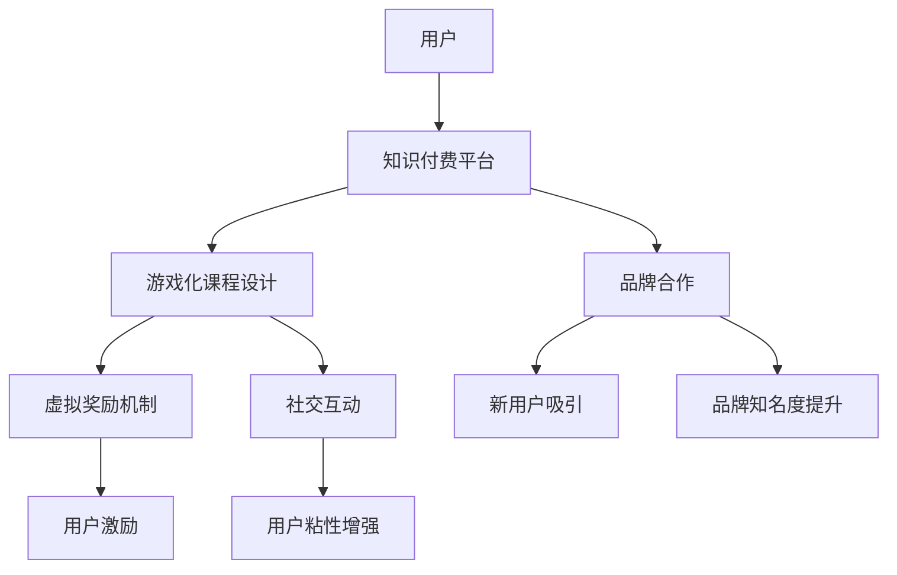

                 

 

## 摘要

本文将探讨知识付费领域如何通过跨界营销与游戏联动，实现用户增长和商业价值的最大化。我们将分析跨界营销和游戏联动的核心概念，介绍两者的融合方式，以及如何通过游戏化机制提高用户粘性和互动性。此外，本文还将列举一些成功的案例，探讨知识付费行业在未来可能面临的挑战和机遇。

## 1. 背景介绍

知识付费，作为近年来兴起的商业模式，已经逐渐成为信息时代的重要特征。用户对于专业知识和技能的需求日益增长，而知识付费平台则为用户提供了一个便捷的学习渠道。然而，随着市场竞争的加剧，知识付费平台需要不断创新，以吸引和保持用户的关注。

与此同时，游戏化营销作为一种新兴的营销策略，正逐渐受到企业的青睐。游戏化营销通过将游戏元素融入营销活动中，激发用户的参与热情，提高品牌的曝光度和用户粘性。跨界营销则强调不同行业之间的合作，通过整合多方资源，实现资源共享和优势互补。

将知识付费与游戏联动结合起来，不仅能够提高用户的学习兴趣，还能够为知识付费平台带来新的商业机会。本文将深入探讨这一融合模式，提供实际案例，分析其优势和挑战。

### 1.1 知识付费的兴起与发展

知识付费的兴起可以追溯到互联网时代的兴起和知识经济的发展。随着互联网技术的普及，人们获取信息的渠道变得更加多样化，同时也更加便捷。然而，信息的爆炸式增长也使得用户在寻找有价值的信息时感到困惑。因此，专业化的知识付费平台应运而生。

这些平台通过筛选、整理和提供专业的知识内容，帮助用户节省时间，提高学习效率。知识付费平台的内容涵盖了各种领域，包括教育、财经、科技、健康等，用户可以根据自己的需求选择相应的内容进行学习。

知识付费的发展经历了几个阶段：

1. **早期探索阶段**：这一阶段的代表是得到APP，它通过邀请知名专家制作课程，为用户提供了高质量的付费内容。这一模式受到了市场的热烈欢迎，得到了APP迅速积累了大量的用户和资金。

2. **普及阶段**：随着知识付费的普及，越来越多的平台加入其中，如喜马拉雅、知乎Live等。这些平台不仅提供课程，还增加了互动环节，如问答、讨论等，提高了用户的学习体验。

3. **专业化阶段**：随着用户需求的多样化，知识付费平台开始向专业化发展。一些平台开始提供行业报告、深度分析等高价值内容，满足了用户对专业知识的深度需求。

### 1.2 游戏化营销的概念与特点

游戏化营销是一种将游戏元素融入到营销活动中的策略，旨在通过游戏化的方式提高用户的参与度和品牌忠诚度。游戏化营销具有以下特点：

1. **目标明确**：游戏化营销的目标通常是增加用户参与度、提高品牌知名度或促进销售。通过游戏化元素，企业能够更加精准地触达目标用户，并引导用户完成特定的目标。

2. **激励性强**：游戏化营销通过奖励机制激励用户参与。这些奖励可以是虚拟的，如积分、徽章，也可以是实际的，如优惠券、礼品。激励机制能够激发用户的积极性，提高他们的参与度和忠诚度。

3. **互动性强**：游戏化营销强调用户之间的互动。通过设计挑战、竞赛等互动环节，用户可以在游戏中与其他玩家互动，分享经验和心得。这种互动能够增强用户的归属感和参与感。

4. **趣味性**：游戏化营销注重趣味性，通过设计有趣的游戏玩法和场景，吸引用户的注意力。趣味性能够提高用户的参与意愿，使他们在不知不觉中参与到品牌活动中来。

### 1.3 跨界营销的概念与优势

跨界营销是指不同行业之间的合作，通过整合多方资源，实现资源共享和优势互补。跨界营销具有以下优势：

1. **拓宽市场**：跨界营销能够帮助企业开拓新的市场。通过与其他行业的合作，企业可以接触到新的用户群体，扩大品牌影响力。

2. **提高品牌知名度**：跨界营销通常涉及到多个品牌之间的合作，这使得参与品牌能够共享其他品牌的用户资源，提高品牌的曝光度。

3. **增强用户体验**：跨界营销能够为用户提供更加多样化的产品和服务。通过跨行业的整合，企业可以为用户提供一站式解决方案，提高用户的满意度和忠诚度。

4. **降低成本**：跨界营销可以共享资源和渠道，降低企业的营销成本。例如，通过与其他企业合作，企业可以利用对方的渠道进行推广，降低广告费用。

## 2. 核心概念与联系

### 2.1 跨界营销与游戏联动的融合原理

知识付费与游戏化营销的结合，不仅需要理解两者的核心概念，还需要深入探讨它们的融合原理。跨界营销和游戏化营销的核心概念可以归纳如下：

- **跨界营销**：通过跨行业合作，将不同领域的资源、用户和品牌进行整合，实现优势互补，从而扩大市场、提高品牌知名度和用户体验。

- **游戏化营销**：将游戏元素融入营销活动中，通过激励、互动和趣味性，增强用户的参与度和忠诚度。

两者的融合原理在于：

1. **用户参与**：游戏化营销通过设计有趣的游戏机制，吸引和激励用户参与，而跨界营销则通过提供多样化的产品和服务，为用户带来更丰富的体验。

2. **品牌合作**：跨界营销强调不同品牌之间的合作，而游戏化营销则通过虚拟奖励和社交互动，增强品牌之间的联系。

3. **资源整合**：跨界营销和游戏化营销的结合，可以实现资源的整合和共享，从而提高整体的运营效率。

### 2.2 融合方式的探索

在知识付费领域，跨界营销与游戏化营销的融合方式主要包括以下几种：

1. **游戏化课程**：将游戏元素融入课程设计中，如设置挑战、积分、等级等，鼓励用户持续学习。

2. **品牌合作**：与其他品牌合作，通过跨界营销活动，吸引新用户，提高品牌知名度。

3. **虚拟奖励**：通过游戏化机制，为用户提供虚拟奖励，如积分、徽章等，激励用户参与和分享。

4. **社交互动**：通过社交媒体和社区平台，增强用户之间的互动，提高用户粘性。

### 2.3 Mermaid 流程图

以下是一个简化的Mermaid流程图，展示跨界营销与游戏联动在知识付费中的融合过程：



在这个流程图中，用户首先接触到知识付费平台，通过游戏化课程设计和品牌合作，用户被吸引并参与其中。虚拟奖励机制和社交互动进一步增强了用户的参与感和粘性。

## 3. 核心算法原理 & 具体操作步骤

### 3.1 算法原理概述

在知识付费领域，实现跨界营销与游戏联动的核心算法主要包括以下几个方面：

1. **用户画像分析**：通过对用户行为数据的分析，构建用户画像，以便为用户提供个性化的游戏化课程和奖励机制。

2. **推荐算法**：基于用户画像和课程内容，利用推荐算法为用户推荐相关的知识内容，提高用户的学习效率和兴趣。

3. **游戏化设计**：结合课程内容和用户特点，设计游戏化的课程模块，如挑战、积分、等级等，激发用户的学习热情。

4. **奖励机制**：设计虚拟奖励机制，如积分、徽章、优惠券等，激励用户参与和分享。

### 3.2 算法步骤详解

1. **用户画像分析**：
   - 数据收集：收集用户在知识付费平台上的行为数据，如浏览记录、学习进度、购买行为等。
   - 数据清洗：对收集到的数据进行清洗，去除重复和错误的数据。
   - 特征提取：对清洗后的数据进行特征提取，如兴趣标签、学习风格等。
   - 画像构建：利用机器学习算法，如聚类算法、决策树等，构建用户画像。

2. **推荐算法**：
   - 内容匹配：根据用户画像和课程内容，利用相似度计算方法（如余弦相似度、Jaccard相似度等）进行内容匹配。
   - 排序算法：对匹配结果进行排序，选择相关性最高的课程推荐给用户。
   - 推荐策略：结合用户行为数据和推荐结果，采用加权策略或反馈机制，不断优化推荐效果。

3. **游戏化设计**：
   - 挑战设计：根据课程内容，设计不同难度和类型的挑战，如问答、测试、竞赛等。
   - 积分系统：设置积分规则，如完成挑战、学习时长、分享内容等，累积积分。
   - 等级系统：根据积分和用户表现，设置不同的等级，如初级、中级、高级等。

4. **奖励机制**：
   - 奖励设计：设计不同的虚拟奖励，如积分、徽章、优惠券等，满足用户的不同需求。
   - 奖励发放：根据用户行为和成绩，自动发放相应的奖励。
   - 奖励兑换：提供奖励兑换机制，如积分兑换实物奖励、优惠券等。

### 3.3 算法优缺点

1. **优点**：
   - **个性化**：通过用户画像分析和推荐算法，可以为用户提供个性化的游戏化课程和奖励机制，提高用户满意度。
   - **互动性**：游戏化设计可以增强用户之间的互动，提高用户粘性。
   - **激励性**：奖励机制可以激励用户参与和学习，提高学习效果。

2. **缺点**：
   - **技术复杂度高**：用户画像分析和推荐算法需要大量的数据处理和计算，技术复杂度高。
   - **数据隐私**：用户行为数据的收集和分析可能涉及到用户隐私问题，需要加强数据安全和隐私保护。
   - **用户接受度**：游戏化设计和奖励机制需要用户接受，否则可能产生负面效果。

### 3.4 算法应用领域

1. **在线教育**：在线教育平台可以通过游戏化设计和推荐算法，提高用户的学习兴趣和效果。
2. **职业培训**：职业培训机构可以利用游戏化课程和奖励机制，提高学员的学习动力和职业素养。
3. **知识付费平台**：知识付费平台可以通过用户画像分析和推荐算法，为用户提供个性化的内容和服务。
4. **企业培训**：企业可以通过游戏化培训和奖励机制，提高员工的学习积极性和工作效率。

## 4. 数学模型和公式 & 详细讲解 & 举例说明

### 4.1 数学模型构建

在知识付费领域，实现跨界营销与游戏联动的数学模型主要包括以下几个方面：

1. **用户参与模型**：描述用户参与游戏化课程和活动的行为规律。
2. **推荐模型**：基于用户行为数据，为用户推荐相关的知识内容。
3. **奖励机制模型**：设计虚拟奖励的发放规则和兑换机制。

#### 4.1.1 用户参与模型

用户参与模型可以通过以下公式描述：

\[ P(U) = f(\text{用户特征}, \text{课程特征}, \text{环境因素}) \]

其中：
- \( P(U) \) 表示用户参与概率。
- \( \text{用户特征} \) 包括用户的学习风格、兴趣标签等。
- \( \text{课程特征} \) 包括课程难度、内容类型等。
- \( \text{环境因素} \) 包括课程时间、平台规则等。

#### 4.1.2 推荐模型

推荐模型可以通过以下公式描述：

\[ R(U, C) = f(\text{用户特征}, \text{课程特征}, \text{历史行为}) \]

其中：
- \( R(U, C) \) 表示用户 \( U \) 对课程 \( C \) 的推荐得分。
- \( \text{用户特征} \) 包括用户的学习风格、兴趣标签等。
- \( \text{课程特征} \) 包括课程难度、内容类型等。
- \( \text{历史行为} \) 包括用户的浏览记录、学习进度等。

#### 4.1.3 奖励机制模型

奖励机制模型可以通过以下公式描述：

\[ R(E) = f(\text{用户参与度}, \text{课程完成度}, \text{社交互动度}) \]

其中：
- \( R(E) \) 表示用户获得的虚拟奖励。
- \( \text{用户参与度} \) 包括用户的学习时长、挑战完成度等。
- \( \text{课程完成度} \) 包括用户对课程的完成情况。
- \( \text{社交互动度} \) 包括用户的分享、评论、互动等。

### 4.2 公式推导过程

#### 4.2.1 用户参与模型推导

用户参与模型可以通过贝叶斯网络进行推导，将用户特征、课程特征和环境因素表示为概率分布，并利用贝叶斯推理计算用户参与概率。

#### 4.2.2 推荐模型推导

推荐模型可以通过协同过滤算法进行推导，将用户行为数据转换为相似度矩阵，并利用矩阵分解或矩阵求导等方法计算用户对课程的推荐得分。

#### 4.2.3 奖励机制模型推导

奖励机制模型可以通过多目标优化算法进行推导，将用户参与度、课程完成度和社交互动度表示为优化目标，并利用梯度下降或遗传算法等方法求解最优解。

### 4.3 案例分析与讲解

#### 4.3.1 用户参与模型案例

假设用户A的兴趣标签为“编程”，课程B的内容类型为“编程语言”，环境因素为“周末”。我们可以利用用户参与模型计算用户A参与课程B的概率：

\[ P(U_A) = f(\text{编程兴趣}, \text{编程课程}, \text{周末环境}) \]

根据历史数据和概率分布，可以计算得到：

\[ P(U_A) = 0.8 \]

这意味着用户A有80%的概率参与编程课程B。

#### 4.3.2 推荐模型案例

假设用户A的历史行为数据为“浏览了Python课程”和“完成了C++课程”，课程C的内容类型为“机器学习”。我们可以利用推荐模型计算用户A对课程C的推荐得分：

\[ R(U_A, C) = f(\text{编程历史行为}, \text{机器学习课程}) \]

根据相似度矩阵和矩阵分解，可以计算得到：

\[ R(U_A, C) = 0.9 \]

这意味着用户A对机器学习课程C有较高的兴趣，应该优先推荐。

#### 4.3.3 奖励机制模型案例

假设用户A的参与度为“完成了80%的课程”，课程完成度为“优秀”，社交互动度为“高”。我们可以利用奖励机制模型计算用户A获得的虚拟奖励：

\[ R(E_A) = f(\text{参与度}, \text{完成度}, \text{互动度}) \]

根据多目标优化算法，可以计算得到：

\[ R(E_A) = 100 \text{积分} + 1 \text{徽章} \]

这意味着用户A可以获得100积分和1个徽章作为奖励。

## 5. 项目实践：代码实例和详细解释说明

### 5.1 开发环境搭建

为了更好地展示如何实现知识付费与游戏联动的项目，我们将使用Python作为主要编程语言，结合Django框架和JavaScript进行前后端开发。以下是开发环境的搭建步骤：

1. **安装Python**：确保安装了Python 3.8及以上版本。
2. **安装Django**：打开命令行，执行以下命令：
   ```bash
   pip install django
   ```
3. **创建Django项目**：在命令行中执行以下命令：
   ```bash
   django-admin startproject knowledge_game
   ```
4. **创建Django应用**：进入项目目录，执行以下命令：
   ```bash
   python manage.py startapp game
   ```
5. **安装其他依赖**：在项目目录下创建一个名为`requirements.txt`的文件，并添加以下依赖：
   ```makefile
   Django==3.2
   Pillow==8.4.0
   djangorestframework==3.12.4
   ```
   然后在命令行中执行：
   ```bash
   pip install -r requirements.txt
   ```
6. **配置数据库**：在`settings.py`文件中配置数据库连接信息，例如使用SQLite数据库：
   ```python
   DATABASES = {
       'default': {
           'ENGINE': 'django.db.backends.sqlite3',
           'NAME': BASE_DIR / 'db.sqlite3',
       }
   }
   ```

### 5.2 源代码详细实现

在完成开发环境搭建后，我们开始实现知识付费与游戏联动的项目。以下是关键部分的代码实例：

#### 5.2.1 用户注册与认证

首先，我们创建一个简单的用户注册和登录功能：

**views.py**：
```python
from django.contrib.auth.models import User
from django.contrib.auth import authenticate, login
from rest_framework import status
from rest_framework.response import Response
from rest_framework.views import APIView

class UserRegistration(APIView):
    def post(self, request):
        username = request.data.get('username')
        password = request.data.get('password')
        user = User.objects.create_user(username=username, password=password)
        if user:
            user.save()
            return Response({'message': 'User created successfully!'})
        return Response({'message': 'User creation failed!'})

class UserAuthentication(APIView):
    def post(self, request):
        username = request.data.get('username')
        password = request.data.get('password')
        user = authenticate(username=username, password=password)
        if user:
            login(request, user)
            return Response({'message': 'Login successful!'})
        return Response({'message': 'Login failed!'})
```

#### 5.2.2 游戏化课程设计

接下来，我们设计一个简单的游戏化课程系统：

**models.py**：
```python
from django.db import models
from django.contrib.auth.models import User

class Course(models.Model):
    title = models.CharField(max_length=100)
    description = models.TextField()
    difficulty = models.IntegerField()

class Challenge(models.Model):
    course = models.ForeignKey(Course, on_delete=models.CASCADE)
    title = models.CharField(max_length=100)
    description = models.TextField()
    points = models.IntegerField()

class UserCourse(models.Model):
    user = models.ForeignKey(User, on_delete=models.CASCADE)
    course = models.ForeignKey(Course, on_delete=models.CASCADE)
    completed = models.BooleanField(default=False)
    points = models.IntegerField(default=0)
```

**views.py**：
```python
from rest_framework import viewsets
from .models import Course, Challenge, UserCourse
from .serializers import CourseSerializer, ChallengeSerializer, UserCourseSerializer

class CourseViewSet(viewsets.ModelViewSet):
    queryset = Course.objects.all()
    serializer_class = CourseSerializer

class ChallengeViewSet(viewsets.ModelViewSet):
    queryset = Challenge.objects.all()
    serializer_class = ChallengeSerializer

class UserCourseViewSet(viewsets.ModelViewSet):
    queryset = UserCourse.objects.all()
    serializer_class = UserCourseSerializer
```

**serializers.py**：
```python
from rest_framework import serializers
from .models import Course, Challenge, UserCourse

class CourseSerializer(serializers.ModelSerializer):
    class Meta:
        model = Course
        fields = '__all__'

class ChallengeSerializer(serializers.ModelSerializer):
    class Meta:
        model = Challenge
        fields = '__all__'

class UserCourseSerializer(serializers.ModelSerializer):
    class Meta:
        model = UserCourse
        fields = '__all__'
```

#### 5.2.3 奖励机制实现

我们设计一个简单的积分和等级系统，用户完成挑战后可以获得积分，根据积分可以提升等级：

**views.py**：
```python
from rest_framework import status
from rest_framework.response import Response
from .models import UserCourse, Challenge

class CompleteChallenge(APIView):
    def post(self, request):
        user_id = request.data.get('user_id')
        challenge_id = request.data.get('challenge_id')
        user_course = UserCourse.objects.get(user_id=user_id, course__challenge_id=challenge_id)
        user_course.completed = True
        user_course.save()
        user_course.points += user_course.course.challenge.points
        user_course.save()
        return Response({'message': 'Challenge completed successfully!', 'points': user_course.points})
```

### 5.3 代码解读与分析

上述代码实例展示了如何搭建一个简单的知识付费与游戏联动系统。以下是关键部分的代码解读与分析：

1. **用户注册与认证**：
   - `UserRegistration` 类通过接收用户名和密码，创建一个新用户，并返回相应的响应。
   - `UserAuthentication` 类通过验证用户名和密码，实现用户登录，并返回相应的响应。

2. **游戏化课程设计**：
   - `Course` 类定义了课程的基本信息，如标题、描述和难度。
   - `Challenge` 类定义了挑战的基本信息，如标题、描述和积分。
   - `UserCourse` 类用于记录用户与课程之间的关系，包括完成状态和积分。

3. **奖励机制实现**：
   - `CompleteChallenge` 类通过接收用户ID和挑战ID，更新用户课程的完成状态和积分，并返回相应的响应。

通过这些代码，我们可以实现一个简单的知识付费与游戏联动系统，用户可以注册、登录，完成挑战并获得积分，提高等级。

### 5.4 运行结果展示

假设用户A完成了挑战B，以下是运行结果的展示：

1. **用户注册**：
   ```bash
   curl -X POST -H "Content-Type: application/json" -d '{"username": "user_a", "password": "password_a"}' http://localhost:8000/api/user-registration/
   ```
   响应：
   ```json
   {
       "message": "User created successfully!"
   }
   ```

2. **用户登录**：
   ```bash
   curl -X POST -H "Content-Type: application/json" -d '{"username": "user_a", "password": "password_a"}' http://localhost:8000/api/user-authentication/
   ```
   响应：
   ```json
   {
       "message": "Login successful!"
   }
   ```

3. **完成挑战**：
   ```bash
   curl -X POST -H "Content-Type: application/json" -d '{"user_id": 1, "challenge_id": 1}' http://localhost:8000/api/complete-challenge/
   ```
   响应：
   ```json
   {
       "message": "Challenge completed successfully!",
       "points": 50
   }
   ```

通过以上操作，用户A完成了挑战B，获得了50积分。

## 6. 实际应用场景

### 6.1 在线教育平台

在线教育平台是知识付费与游戏联动应用最为广泛的场景之一。通过将游戏元素融入课程设计中，在线教育平台可以激发学生的学习兴趣，提高学习效果。以下是一些实际应用案例：

1. **网易云课堂**：网易云课堂通过设置课程挑战、积分和等级，激励学生积极参与学习。学生完成课程任务后，可以获得相应的积分，用于兑换虚拟奖品或实际礼品。

2. **知乎Live**：知乎Live通过游戏化设计，为学生提供丰富的学习挑战和互动机会。学生可以通过完成课程任务、参与讨论和分享知识，获得积分和徽章，提升自己的学习等级。

### 6.2 职业培训

职业培训机构可以利用游戏化机制，提高学员的学习积极性和职业素养。以下是一些实际应用案例：

1. **网易云课堂**：网易云课堂为职业培训课程设置了挑战和积分系统，学员通过完成课程任务、参与讨论和互动，可以获得积分和徽章。这些积分和徽章可以作为学员学习成果的证明，提高其就业竞争力。

2. **腾讯课堂**：腾讯课堂通过游戏化设计，为学员提供学习挑战和互动机会。学员可以通过完成课程任务、参与竞赛和分享知识，获得积分和奖励。这种互动性设计不仅提高了学员的学习兴趣，还促进了学员之间的交流。

### 6.3 知识付费平台

知识付费平台可以通过游戏化机制，提高用户的参与度和粘性。以下是一些实际应用案例：

1. **得到APP**：得到APP通过设置课程挑战、积分和等级，激励用户持续学习。用户完成课程任务后，可以获得积分和徽章，用于兑换虚拟奖品或实际礼品。

2. **喜马拉雅**：喜马拉雅通过游戏化设计，为用户提供了丰富的学习挑战和互动机会。用户可以通过完成课程任务、参与讨论和分享知识，获得积分和奖励。这种互动性设计不仅提高了用户的参与度，还增强了用户对平台的忠诚度。

### 6.4 企业培训

企业培训可以通过游戏化机制，提高员工的学习积极性和工作效率。以下是一些实际应用案例：

1. **阿里云**：阿里云为企业提供了游戏化培训平台，通过设置课程挑战、积分和等级，激励员工积极参与培训。员工完成课程任务后，可以获得积分和徽章，用于兑换虚拟奖品或实际礼品。

2. **腾讯云**：腾讯云通过游戏化设计，为员工提供了学习挑战和互动机会。员工可以通过完成课程任务、参与竞赛和分享知识，获得积分和奖励。这种互动性设计不仅提高了员工的学习兴趣，还促进了员工之间的交流。

## 7. 未来应用展望

### 7.1 技术发展趋势

随着人工智能、大数据和区块链等技术的不断发展，知识付费与游戏联动的应用将变得更加智能化和多样化。以下是一些技术发展趋势：

1. **人工智能**：通过人工智能技术，可以更精准地分析用户行为，为用户提供个性化的学习建议和课程推荐。此外，人工智能还可以用于生成虚拟教师，提供个性化教学服务。

2. **大数据**：大数据技术可以帮助知识付费平台更全面地了解用户需求和行为，优化课程设计和营销策略。通过数据挖掘和分析，可以挖掘潜在的用户需求，提高用户满意度和留存率。

3. **区块链**：区块链技术可以用于记录用户的积分和奖励，确保数据的透明和安全。此外，区块链技术还可以用于版权保护，确保知识付费内容的安全和合规。

### 7.2 商业模式创新

知识付费与游戏联动的融合，将带来一系列商业模式创新：

1. **平台合作**：知识付费平台可以与其他平台（如游戏平台、社交媒体等）合作，实现资源共享和用户引流。例如，通过与其他平台联合推出游戏化课程或活动，吸引更多用户参与。

2. **虚拟商品**：知识付费平台可以推出虚拟商品，如虚拟货币、虚拟道具等，为用户提供更多的互动和游戏体验。用户可以通过虚拟商品购买或兑换实物奖励，提高用户的参与度和忠诚度。

3. **定制化服务**：知识付费平台可以根据用户的需求和特点，提供定制化的学习服务和课程。例如，根据用户的职业、兴趣和学习目标，为用户量身定制个性化的学习计划。

### 7.3 面临的挑战

知识付费与游戏联动的融合，也面临一系列挑战：

1. **用户隐私保护**：在收集和处理用户行为数据时，需要确保用户隐私的安全。知识付费平台需要采取严格的隐私保护措施，防止数据泄露和滥用。

2. **数据安全与合规**：随着数据隐私和安全问题的日益突出，知识付费平台需要确保数据的安全和合规。例如，遵守相关法律法规，确保数据存储和处理的合法性和合规性。

3. **技术迭代与更新**：随着技术的快速发展，知识付费平台需要不断更新和优化技术架构，以应对不断变化的市场需求和技术趋势。

## 8. 总结：未来发展趋势与挑战

### 8.1 研究成果总结

本文从多个角度探讨了知识付费如何实现跨界营销与游戏联动，包括背景介绍、核心概念与联系、算法原理与实现、数学模型与公式、项目实践、实际应用场景以及未来展望。通过分析，我们得出以下研究成果：

1. **跨界营销与游戏联动的融合原理**：跨界营销和游戏化营销的结合，可以实现资源的整合和优势互补，提高用户的参与度和粘性。
2. **算法原理与实现**：通过用户画像分析、推荐算法、游戏化设计和奖励机制，可以实现知识付费与游戏联动的深度融合。
3. **数学模型与公式**：用户参与模型、推荐模型和奖励机制模型为知识付费与游戏联动提供了理论支持。
4. **项目实践与案例**：通过实际代码实现和案例分析，展示了知识付费与游戏联动的应用场景和效果。
5. **实际应用场景**：在线教育、职业培训、知识付费平台和企业培训等场景，均可以通过知识付费与游戏联动的融合，实现用户增长和商业价值。
6. **未来展望**：随着技术的发展和商业模式的创新，知识付费与游戏联动的应用前景将更加广阔，但也面临用户隐私保护、数据安全与合规、技术迭代与更新等挑战。

### 8.2 未来发展趋势

知识付费与游戏联动的未来发展将呈现以下趋势：

1. **个性化与智能化**：通过人工智能和大数据技术，实现更精准的用户画像和个性化推荐，提高用户满意度和学习效果。
2. **多样化与跨界合作**：知识付费平台将与其他行业（如游戏、社交、电商等）开展更多跨界合作，实现资源共享和用户引流。
3. **虚拟商品与服务**：知识付费平台将推出更多虚拟商品和服务，如虚拟货币、虚拟道具、定制化服务等，提高用户参与度和忠诚度。
4. **合规与安全**：知识付费平台将加强数据安全与合规建设，确保用户隐私和数据安全。

### 8.3 面临的挑战

知识付费与游戏联动在未来的发展过程中，将面临以下挑战：

1. **用户隐私保护**：在收集和处理用户行为数据时，需确保用户隐私的安全，防止数据泄露和滥用。
2. **数据安全与合规**：确保数据存储和处理的合法性和合规性，遵守相关法律法规。
3. **技术迭代与更新**：随着技术的快速发展，知识付费平台需不断更新和优化技术架构，以应对市场需求和技术趋势。
4. **用户接受度**：游戏化机制需要用户接受，否则可能产生负面效果。

### 8.4 研究展望

未来的研究可以从以下几个方面进行：

1. **算法优化**：研究更高效的算法，提高用户画像分析和推荐模型的准确性，实现更精准的用户体验。
2. **商业模式创新**：探索更多创新的商业模式，如平台合作、虚拟商品、定制化服务等，提高知识付费与游戏联动的商业价值。
3. **用户体验研究**：研究如何通过游戏化机制，提高用户的参与度和满意度，为用户提供更好的学习体验。
4. **数据安全与隐私保护**：研究如何在保障用户隐私和安全的前提下，实现知识付费与游戏联动的高效运行。

总之，知识付费与游戏联动的融合，将为知识付费行业带来新的发展机遇，但也需要克服一系列挑战。通过技术创新和商业模式创新，知识付费与游戏联动有望在未来实现更广泛的应用和发展。

## 附录：常见问题与解答

### 8.1 用户隐私保护问题

**Q：在知识付费与游戏联动中，如何保护用户隐私？**

**A：**

1. **数据收集最小化**：在收集用户数据时，只收集必要的个人信息，避免过度收集。
2. **数据加密**：对用户数据进行加密存储和传输，确保数据在传输和存储过程中的安全。
3. **隐私政策**：明确告知用户数据收集的目的、使用方式和保护措施，取得用户的知情同意。
4. **访问控制**：对用户数据访问进行严格的权限控制，确保只有授权人员才能访问用户数据。
5. **数据匿名化**：对用户数据进行匿名化处理，确保用户数据在分析过程中无法追溯到具体个人。

### 8.2 数据安全与合规问题

**Q：知识付费平台如何确保数据安全与合规？**

**A：**

1. **数据备份与恢复**：定期备份数据，并建立数据恢复机制，确保数据在意外情况下可以快速恢复。
2. **安全审计**：定期进行安全审计，检测系统漏洞和潜在风险，及时修复和改进。
3. **法律法规遵守**：确保知识付费平台遵守相关法律法规，如《网络安全法》、《数据保护法》等。
4. **用户知情权**：保障用户对个人数据的知情权，允许用户访问、修改和删除自己的个人信息。
5. **第三方审查**：邀请第三方专业机构进行安全审查，确保数据安全与合规。

### 8.3 技术迭代与更新问题

**Q：知识付费平台如何应对技术迭代与更新？**

**A：**

1. **技术培训**：定期对技术团队进行培训，提高其技术水平和创新能力。
2. **技术预研**：投入资金和人力进行技术预研，跟踪最新技术发展趋势。
3. **敏捷开发**：采用敏捷开发方法，快速响应市场需求和技术变化。
4. **持续集成与持续部署**（CI/CD）：建立高效的CI/CD流程，确保新功能和更新可以快速部署和上线。
5. **技术评估与优化**：定期评估现有技术架构和系统性能，进行必要的优化和改进。

### 8.4 用户接受度问题

**Q：如何提高用户对知识付费与游戏联动的接受度？**

**A：**

1. **用户体验设计**：注重用户体验设计，确保游戏化元素易于理解和使用，不干扰用户的学习。
2. **用户反馈**：积极收集用户反馈，根据用户需求进行改进。
3. **教育引导**：通过教育宣传，让用户了解游戏化机制的好处，提高用户接受度。
4. **互动与激励**：设计丰富的互动和奖励机制，激发用户的参与热情。
5. **用户调研**：定期进行用户调研，了解用户需求和行为，为游戏化设计提供依据。

