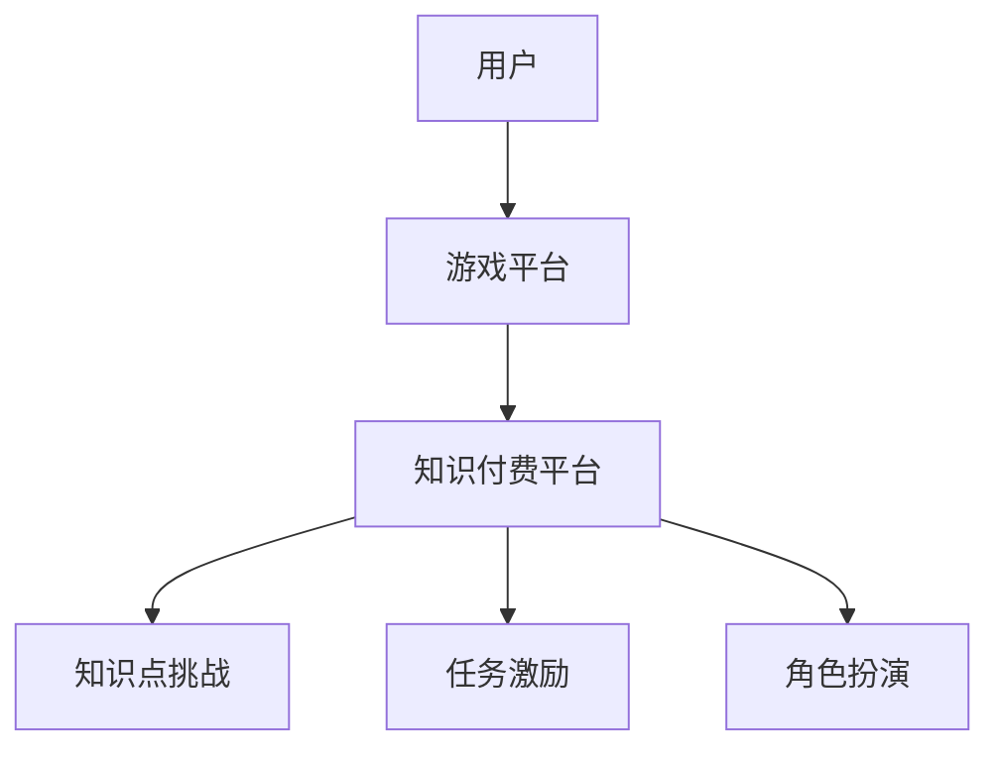

                 

在数字化时代，知识付费与游戏联动成为推动经济增长和创新的重要手段。本文将深入探讨知识付费如何通过跨界营销与游戏联动实现共赢，为行业提供全新的视角和策略。

## 关键词

- 知识付费
- 跨界营销
- 游戏联动
- 用户参与
- 数据驱动

## 摘要

本文首先介绍了知识付费与游戏联动的背景和重要性，然后从跨界营销的角度分析了如何将知识付费与游戏相结合，实现品牌传播和用户增长。接下来，通过具体案例和数据分析，阐述了实现这一策略的关键步骤和成功要素。最后，对未来知识付费与游戏联动的发展趋势和挑战进行了展望。

## 1. 背景介绍

### 1.1 知识付费的发展

知识付费作为一种新兴商业模式，起源于人们对专业知识和技能的需求。随着互联网技术的进步，知识付费逐渐从线下实体教育向线上平台转移，用户可以通过付费获取专业课程、电子书籍、在线讲座等。知识付费市场的快速发展，得益于以下几个因素：

1. **信息碎片化**：用户对知识获取的需求变得更加个性化和专业化，知识付费平台能够满足这一需求。
2. **技术进步**：互联网和移动互联网的发展，使得知识付费的传播和获取变得更加便捷。
3. **用户习惯**：随着数字化生活方式的普及，用户对线上知识获取的接受度不断提高。

### 1.2 游戏联动的重要性

游戏联动作为一种创新的营销手段，能够为知识付费平台带来大量用户和流量。游戏具有强烈的社交属性和互动性，可以激发用户的参与度和忠诚度。以下是游戏联动在知识付费领域的几个优势：

1. **增加用户黏性**：游戏化的学习过程可以激发用户的兴趣，提高学习效果和用户满意度。
2. **提升品牌知名度**：通过游戏联动，知识付费平台可以借助游戏平台的用户基础，实现品牌的快速传播。
3. **数据洞察**：游戏过程中产生的用户数据，可以为知识付费平台提供有价值的市场洞察和用户画像。

## 2. 核心概念与联系

### 2.1 跨界营销

跨界营销是指不同行业或品牌之间进行合作，通过整合各自的优势资源，实现1+1>2的营销效果。在知识付费领域，跨界营销可以与游戏行业相结合，以游戏为载体，实现知识付费的推广和转化。

### 2.2 游戏联动

游戏联动是指将知识付费的内容融入到游戏中，通过游戏化的学习过程，提高用户的学习体验和效果。游戏联动可以采用以下几种方式：

1. **知识点挑战**：在游戏中设置知识点挑战，用户通过完成挑战获取知识。
2. **任务激励**：设置游戏任务，用户完成任务后可以获得知识奖励。
3. **角色扮演**：用户在游戏中扮演特定角色，通过角色成长和互动，学习相关知识点。

### 2.3 Mermaid 流程图



## 3. 核心算法原理 & 具体操作步骤

### 3.1 算法原理概述

游戏联动知识付费的核心算法原理在于将游戏机制与知识学习相结合，通过数据驱动的方式实现用户参与和知识转化。主要涉及以下三个方面：

1. **用户行为分析**：通过分析用户在游戏中的行为，了解用户的学习兴趣和需求，为后续的知识推荐和游戏设计提供依据。
2. **知识点匹配**：根据用户行为分析结果，将相关的知识点与游戏挑战、任务和角色进行匹配，提高知识学习的趣味性和效果。
3. **数据反馈与优化**：通过用户在游戏中的表现和反馈，不断优化游戏内容和知识点呈现方式，提高用户满意度和学习效果。

### 3.2 算法步骤详解

1. **用户注册与登录**：用户在游戏平台注册并登录，绑定知识付费账号。
2. **用户行为数据采集**：游戏平台通过SDK等技术手段，实时采集用户在游戏中的行为数据，如游戏时长、挑战完成情况、任务进度等。
3. **用户画像构建**：根据用户行为数据，构建用户画像，包括用户兴趣、学习习惯、知识掌握程度等。
4. **知识点匹配**：根据用户画像，将相关的知识点与游戏挑战、任务和角色进行匹配，设计游戏化学习内容。
5. **游戏化学习**：用户在游戏中参与挑战、完成任务和角色扮演，通过游戏过程学习相关知识。
6. **数据反馈与优化**：游戏平台根据用户在游戏中的表现和反馈，不断优化游戏内容和知识点呈现方式。

### 3.3 算法优缺点

**优点**：

1. **提高用户参与度**：游戏化的学习方式可以激发用户的兴趣和参与度，提高学习效果。
2. **增强品牌认知**：游戏联动能够借助游戏平台的用户基础，实现品牌的快速传播和认知。
3. **数据驱动优化**：通过用户行为数据，实现知识付费内容的个性化推荐和优化。

**缺点**：

1. **开发成本较高**：游戏联动需要跨行业合作，涉及多个技术领域，开发成本较高。
2. **游戏设计难度大**：游戏化学习需要充分考虑知识点的趣味性和学习效果，设计难度较大。
3. **用户隐私保护**：游戏联动过程中涉及用户行为数据的采集和分析，需要确保用户隐私安全。

### 3.4 算法应用领域

游戏联动知识付费算法主要应用于以下领域：

1. **教育培训**：通过游戏化的学习过程，提高学生的学习效果和兴趣。
2. **职业技能培训**：结合行业知识和技能要求，设计针对性的游戏化学习内容。
3. **企业培训**：通过游戏化学习，提高员工的专业技能和工作效率。

## 4. 数学模型和公式 & 详细讲解 & 举例说明

### 4.1 数学模型构建

游戏联动知识付费的数学模型主要涉及用户行为分析、知识点匹配和数据反馈与优化等方面。以下是一个简化的数学模型：

$$
User\_Behavior = f(Game\_Behavior, User\_Characteristics, Knowledge)
$$

其中，$User\_Behavior$ 表示用户在游戏中的行为，$Game\_Behavior$ 表示游戏中的行为数据，$User\_Characteristics$ 表示用户画像特征，$Knowledge$ 表示知识点。

### 4.2 公式推导过程

$$
Game\_Behavior = f(User\_Input, Game\_Rules)
$$

$$
User\_Input = f(User\_Desire, User\_Skill)
$$

$$
User\_Desire = f(User\_Experience, User\_Feedback)
$$

$$
User\_Experience = f(User\_Learning, User\_Engagement)
$$

$$
User\_Feedback = f(User\_Satisfaction, User\_Confidence)
$$

$$
User\_Confidence = f(User\_Accomplishment, User\_Challenge)
$$

$$
User\_Satisfaction = f(User\_Learning, User\_Experience)
$$

### 4.3 案例分析与讲解

假设在一个在线编程课程中，用户通过游戏化学习方式学习编程知识。以下是数学模型的实际应用：

1. **用户注册与登录**：用户在游戏平台注册并登录，绑定编程课程账号。
2. **用户行为数据采集**：游戏平台通过SDK采集用户在游戏中的行为数据，如编程题完成情况、游戏时长等。
3. **用户画像构建**：根据用户行为数据，构建用户画像，包括用户编程技能水平、学习兴趣等。
4. **知识点匹配**：根据用户画像，将编程知识点与游戏挑战进行匹配，设计游戏化学习内容。
5. **游戏化学习**：用户在游戏中参与编程挑战，通过游戏过程学习编程知识。
6. **数据反馈与优化**：游戏平台根据用户在游戏中的表现和反馈，不断优化游戏内容和知识点呈现方式。

通过数学模型的应用，可以实现用户个性化推荐、知识点匹配优化和游戏化学习效果提升。

## 5. 项目实践：代码实例和详细解释说明

### 5.1 开发环境搭建

在实现游戏联动知识付费项目时，需要搭建以下开发环境：

1. **前端**：HTML、CSS、JavaScript
2. **后端**：Python、Flask 或 Django 框架
3. **数据库**：MySQL 或 MongoDB
4. **游戏引擎**：Unity 或 Cocos2d-x

### 5.2 源代码详细实现

以下是一个简化的前端代码实例，用于实现用户注册和登录功能：

```html
<!DOCTYPE html>
<html>
<head>
    <title>游戏联动知识付费平台</title>
</head>
<body>
    <h1>用户注册</h1>
    <form action="/register" method="post">
        <label for="username">用户名：</label>
        <input type="text" id="username" name="username" required>
        <br>
        <label for="password">密码：</label>
        <input type="password" id="password" name="password" required>
        <br>
        <input type="submit" value="注册">
    </form>
</body>
</html>
```

### 5.3 代码解读与分析

以上代码实现了用户注册功能，主要包括以下部分：

1. **HTML 结构**：定义了一个简单的表单，包括用户名和密码输入框，以及提交按钮。
2. **表单处理**：当用户点击提交按钮时，表单数据通过 HTTP POST 请求发送到后端服务器。
3. **后端处理**：后端服务器接收表单数据，进行用户注册处理，包括用户名和密码验证、用户信息存储等。

通过前端代码的简单实现，可以构建一个基本的用户注册系统，为游戏联动知识付费平台提供用户管理功能。

### 5.4 运行结果展示

当用户访问游戏联动知识付费平台时，会看到一个注册表单页面，如下所示：

```
用户注册
----------------------
用户名：   <input type="text" name="username" required>
密码：   <input type="password" name="password" required>
<input type="submit" value="注册">
```

用户填写完表单并提交后，后端服务器会处理注册请求，返回相应的响应结果，如注册成功或失败等信息。

## 6. 实际应用场景

### 6.1 教育培训

在教育培训领域，游戏联动知识付费可以应用于在线课程、题库练习等场景。通过游戏化学习，提高学生的学习兴趣和效果。例如，一个在线编程课程可以通过游戏化的编程挑战，提高学生的编程技能。

### 6.2 职业技能培训

职业技能培训领域，游戏联动知识付费可以应用于职场技能培训、行业知识普及等。通过游戏化学习，提高员工的职业技能和工作效率。例如，一个职场技能培训课程可以通过游戏化的任务，提高员工的时间管理能力。

### 6.3 企业培训

在企业培训领域，游戏联动知识付费可以应用于员工培训、企业文化传播等。通过游戏化学习，提高员工的参与度和满意度。例如，一个企业培训课程可以通过游戏化的角色扮演，提高员工对企业的认同感和归属感。

## 7. 未来应用展望

### 7.1 个性化推荐

随着人工智能技术的发展，游戏联动知识付费平台可以更加精准地实现个性化推荐。通过用户行为数据的深度分析和挖掘，为用户提供个性化的知识内容和学习路径，提高学习效果和满意度。

### 7.2 智能化教学

未来，游戏联动知识付费平台将实现智能化教学。通过人工智能技术，自动生成知识点匹配方案、游戏化学习内容和教学策略，实现自适应学习。学生可以根据自身需求，选择适合自己的学习内容和方式。

### 7.3 跨界合作

游戏联动知识付费将继续拓展跨界合作领域，与更多行业进行深度合作。例如，与健康、医疗、艺术等领域结合，开发针对不同用户群体的游戏化知识付费产品。

## 8. 工具和资源推荐

### 8.1 学习资源推荐

1. **《游戏化学习：创造持久的学习动力》**：本书详细介绍了游戏化学习的理论和方法，适用于教育工作者和游戏开发者。
2. **《知识付费实战：从0到1搭建知识付费平台》**：本书提供了知识付费平台搭建的详细步骤和案例，适用于创业者和技术人员。

### 8.2 开发工具推荐

1. **Unity**：一款强大的游戏开发引擎，适用于游戏化学习项目的开发。
2. **Flask**：一款轻量级的Python Web框架，适用于后端开发。

### 8.3 相关论文推荐

1. **“Game-Based Learning: An Overview”**：本文对游戏化学习进行了全面的综述，探讨了游戏化学习的理论基础和应用。
2. **“Knowledge as a Service: A New Business Model for the Information Age”**：本文探讨了知识付费作为一种新兴商业模式的发展趋势和挑战。

## 9. 总结：未来发展趋势与挑战

### 9.1 研究成果总结

本文从跨界营销和游戏联动的角度，探讨了知识付费的发展趋势和策略。通过数学模型和实际案例的分析，揭示了游戏联动知识付费的核心原理和实现步骤。研究结果表明，游戏联动可以有效提高知识付费的用户参与度和学习效果。

### 9.2 未来发展趋势

1. **个性化推荐**：随着人工智能技术的发展，知识付费平台将实现更加精准的个性化推荐。
2. **智能化教学**：通过人工智能技术，实现自适应学习和智能化教学。
3. **跨界合作**：知识付费将与其他行业进行深度合作，拓展应用领域。

### 9.3 面临的挑战

1. **开发成本**：游戏联动知识付费项目的开发成本较高，需要跨行业合作。
2. **游戏设计**：游戏化学习的设计难度较大，需要充分考虑知识点的趣味性和学习效果。
3. **用户隐私**：游戏联动过程中涉及用户行为数据的采集和分析，需要确保用户隐私安全。

### 9.4 研究展望

未来，游戏联动知识付费领域将不断发展，为教育培训、职业技能培训和企业培训等领域带来创新和变革。通过不断优化和拓展，游戏联动知识付费将成为知识付费市场的重要力量。

## 附录：常见问题与解答

### 9.1 问题1：游戏联动知识付费如何保证用户隐私？

解答：游戏联动知识付费平台在采集用户数据时，需要遵循相关法律法规，确保用户隐私安全。具体措施包括：数据加密存储、匿名化处理、用户权限管理等。

### 9.2 问题2：游戏联动知识付费如何保证学习效果？

解答：游戏联动知识付费平台通过游戏化学习过程，提高用户的参与度和学习兴趣。同时，通过数据分析和反馈，实现知识点的个性化推荐和优化，提高学习效果。

### 9.3 问题3：游戏联动知识付费的开发成本如何控制？

解答：游戏联动知识付费项目的开发成本较高，可以通过以下方式控制：采用开源框架和工具、模块化开发、合作开发等。

作者：禅与计算机程序设计艺术 / Zen and the Art of Computer Programming
----------------------------------------------------------------

这篇文章详细探讨了知识付费如何通过跨界营销与游戏联动实现共赢，为行业提供了新的视角和策略。通过对核心算法原理、数学模型、项目实践等方面的分析，文章展示了游戏联动知识付费的实现步骤和关键要素。同时，对未来发展趋势和挑战进行了展望，为读者提供了有益的参考。禅与计算机程序设计艺术 / Zen and the Art of Computer Programming

