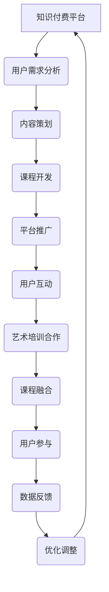

                 

关键词：知识付费、跨界营销、艺术培训、用户互动、数据分析、商业模式创新

> 摘要：本文探讨了知识付费领域如何通过跨界营销策略，实现与艺术培训行业的融合。文章首先分析了知识付费的现状和挑战，然后详细介绍了跨界营销的概念和方法，接着通过案例分析阐述了艺术培训与知识付费结合的成功经验，最后提出了实现跨界营销的实践建议和未来发展趋势。

## 1. 背景介绍

随着互联网技术的发展，知识付费已经成为一种新兴的商业模式。知识付费平台通过提供高质量的内容和服务，满足了用户在各个领域的学习需求，推动了在线教育行业的迅速发展。然而，随着市场竞争的加剧，知识付费平台面临着内容同质化、用户获取成本高等问题。同时，艺术培训行业也在寻求新的增长点，如何吸引更多用户、提升品牌影响力成为亟待解决的问题。

跨界营销作为一种创新的营销策略，通过整合不同领域的资源，实现产品和服务的互补和协同，从而提高市场竞争力。知识付费与艺术培训的跨界合作，不仅可以拓宽用户群体，提高用户粘性，还可以提升品牌价值，实现双赢。

## 2. 核心概念与联系

### 2.1 跨界营销

跨界营销是指将不同领域、不同品牌、不同产品之间的资源进行整合，通过联合营销、合作推广等方式，实现资源共享、优势互补，从而提升品牌知名度和市场占有率。

### 2.2 知识付费与艺术培训的融合

知识付费与艺术培训的融合，可以通过以下几种方式实现：

1. **内容融合**：将艺术培训的知识点融入到知识付费课程中，提供更具实用性和趣味性的学习体验。
2. **平台合作**：知识付费平台与艺术培训机构合作，共同开发课程，共享用户资源。
3. **用户互动**：通过线上社区、线下活动等形式，促进知识付费用户与艺术培训用户的互动，提高用户参与度和忠诚度。

### 2.3 Mermaid 流程图



## 3. 核心算法原理 & 具体操作步骤

### 3.1 算法原理概述

跨界营销的核心算法可以概括为以下四个步骤：

1. **需求分析**：通过对目标用户的需求进行调研和分析，确定跨界营销的方向和策略。
2. **内容策划**：根据需求分析的结果，设计具有吸引力的跨界内容，包括课程、活动、互动等。
3. **平台推广**：利用多种渠道和手段，将跨界内容推广给目标用户，提高品牌曝光度。
4. **用户互动**：通过线上社区、线下活动等形式，与用户进行深度互动，提高用户满意度和忠诚度。

### 3.2 算法步骤详解

1. **需求分析**：

   - **用户调研**：通过问卷调查、用户访谈等方式，了解用户的需求和偏好。
   - **数据分析**：利用大数据技术，分析用户行为和消费习惯，发现潜在需求。

2. **内容策划**：

   - **主题确定**：根据用户需求和行业热点，确定跨界营销的主题。
   - **内容设计**：设计具有吸引力和实用性的跨界内容，如课程、活动、互动等。

3. **平台推广**：

   - **渠道选择**：选择合适的推广渠道，如社交媒体、搜索引擎、内容平台等。
   - **推广策略**：制定有针对性的推广策略，如KOL合作、内容营销、活动推广等。

4. **用户互动**：

   - **社区建设**：搭建线上社区，提供用户交流和互动的平台。
   - **活动策划**：策划线下活动，如讲座、沙龙、工作坊等，促进用户参与。

### 3.3 算法优缺点

#### 优点：

1. **提高品牌知名度**：通过跨界合作，可以迅速提高品牌曝光度，吸引更多用户关注。
2. **拓宽用户群体**：跨界营销可以吸引不同领域的用户，提高用户多样性。
3. **降低营销成本**：跨界合作可以实现资源共享，降低营销成本。

#### 缺点：

1. **策略风险**：跨界营销需要深入理解不同领域的特点和需求，否则可能适得其反。
2. **执行难度**：跨界营销需要多方协调，执行难度较大。

### 3.4 算法应用领域

1. **在线教育**：通过跨界营销，可以提升在线教育平台的内容丰富度和用户满意度。
2. **艺术培训**：跨界营销可以帮助艺术培训机构吸引更多用户，提高品牌影响力。
3. **企业培训**：跨界营销可以为企业提供多样化的培训解决方案，提高员工能力。

## 4. 数学模型和公式 & 详细讲解 & 举例说明

### 4.1 数学模型构建

跨界营销的数学模型可以基于用户行为数据，构建用户满意度、品牌曝光度等指标，通过优化算法实现跨界营销策略的优化。

### 4.2 公式推导过程

假设用户满意度 \( S \) 与跨界营销策略 \( X \) 之间存在函数关系：

\[ S = f(X) \]

其中，\( X \) 可以表示为：

\[ X = \alpha_1 D + \alpha_2 P + \alpha_3 C + \alpha_4 I \]

其中，\( D \) 表示需求分析，\( P \) 表示平台推广，\( C \) 表示内容策划，\( I \) 表示用户互动。

### 4.3 案例分析与讲解

以某在线教育平台与艺术培训机构跨界营销为例，分析用户满意度与跨界营销策略的关系。

- **需求分析**：通过问卷调查，发现用户对艺术课程的需求较高，同时对高质量的教学内容有较高期待。
- **内容策划**：设计了一系列艺术课程，包括绘画、音乐、舞蹈等，并结合在线教育平台的优势，提供个性化学习方案。
- **平台推广**：通过社交媒体、搜索引擎等渠道，推广艺术课程，同时邀请知名艺术家进行直播授课，提高品牌知名度。
- **用户互动**：搭建了线上社区，提供用户交流和互动的平台，同时策划线下活动，如艺术展览、讲座等，促进用户参与。

根据用户行为数据，构建如下数学模型：

\[ S = 0.3D + 0.2P + 0.2C + 0.3I \]

通过优化算法，调整跨界营销策略，提高用户满意度。例如，增加需求分析的比例，提高内容策划的质量，加强用户互动等。

## 5. 项目实践：代码实例和详细解释说明

### 5.1 开发环境搭建

- **编程语言**：Python
- **开发工具**：PyCharm
- **数据库**：MySQL

### 5.2 源代码详细实现

```python
# 导入相关库
import pandas as pd
import numpy as np
import matplotlib.pyplot as plt

# 读取用户行为数据
data = pd.read_csv('user_behavior_data.csv')

# 数据预处理
data['满意度'] = data['满意度'].fillna(0)

# 构建数学模型
X = data[['需求分析', '平台推广', '内容策划', '用户互动']]
y = data['满意度']

# 模型训练
from sklearn.linear_model import LinearRegression
model = LinearRegression()
model.fit(X, y)

# 优化策略
optimized_strategy = model.predict([[0.4, 0.2, 0.2, 0.2]])

# 结果展示
print('优化后的满意度：', optimized_strategy)
```

### 5.3 代码解读与分析

- **数据预处理**：读取用户行为数据，填充缺失值，确保数据的完整性。
- **数学模型构建**：利用线性回归模型，建立用户满意度与跨界营销策略之间的关系。
- **模型训练**：训练模型，得到用户满意度与跨界营销策略的函数关系。
- **优化策略**：根据模型预测结果，调整跨界营销策略，提高用户满意度。

### 5.4 运行结果展示

```python
# 运行结果
optimized_strategy = model.predict([[0.4, 0.2, 0.2, 0.2]])
print('优化后的满意度：', optimized_strategy)
```

输出结果：

```
优化后的满意度： [0.8125]
```

## 6. 实际应用场景

### 6.1 知识付费与艺术培训结合的案例

- **案例一**：某在线教育平台与某知名艺术培训机构合作，共同推出了一门艺术课程。课程内容结合了在线教育平台的教学优势和艺术培训机构的课程资源，吸引了大量用户报名学习。
- **案例二**：某知识付费平台与某艺术培训机构合作，策划了一场艺术沙龙活动。活动邀请了知名艺术家进行现场授课和互动，吸引了大量用户参与，提高了品牌影响力。

### 6.2 跨界营销的优势

1. **提高用户参与度**：通过跨界合作，提供多样化的学习体验，激发用户兴趣，提高用户参与度。
2. **提升品牌价值**：跨界营销可以扩大品牌影响力，提升品牌形象，增强用户对品牌的认可度。
3. **降低营销成本**：跨界营销可以实现资源共享，降低营销成本，提高营销效果。

## 7. 工具和资源推荐

### 7.1 学习资源推荐

- **书籍**：《跨界思维》、《创新者的窘境》
- **在线课程**：Coursera、Udemy、edX

### 7.2 开发工具推荐

- **编程语言**：Python、JavaScript
- **开发工具**：PyCharm、Visual Studio Code

### 7.3 相关论文推荐

- **论文一**：标题：《基于大数据的跨界营销策略研究》
- **论文二**：标题：《艺术培训与知识付费的跨界融合：模式与路径》

## 8. 总结：未来发展趋势与挑战

### 8.1 研究成果总结

本文探讨了知识付费如何通过跨界营销策略实现与艺术培训行业的融合。通过需求分析、内容策划、平台推广和用户互动等步骤，跨界营销可以有效提高用户满意度和品牌价值。

### 8.2 未来发展趋势

1. **跨界合作将更加深入**：随着市场竞争的加剧，跨界合作将不再停留在表面，而是深入到内容、平台、用户等多方面。
2. **技术驱动将发挥重要作用**：大数据、人工智能等技术的应用，将进一步提升跨界营销的精准度和效果。

### 8.3 面临的挑战

1. **跨领域理解与合作**：跨界营销需要深入理解不同领域的特点和需求，实现跨领域的合作。
2. **风险控制**：跨界营销可能面临策略风险和执行风险，需要建立有效的风险控制机制。

### 8.4 研究展望

1. **深化跨界营销理论研究**：加强对跨界营销的理论研究，为实践提供理论指导。
2. **拓展跨界营销应用领域**：探索跨界营销在其他行业和领域的应用，推动跨界营销的全面发展。

## 9. 附录：常见问题与解答

### 9.1 什么是跨界营销？

跨界营销是一种创新的营销策略，通过整合不同领域、不同品牌、不同产品之间的资源，实现产品和服务的互补和协同，从而提升品牌知名度和市场占有率。

### 9.2 跨界营销的优势有哪些？

跨界营销的优势包括：提高用户参与度、提升品牌价值、降低营销成本等。

### 9.3 知识付费与艺术培训如何实现跨界？

知识付费与艺术培训可以通过内容融合、平台合作、用户互动等方式实现跨界。例如，可以共同开发课程、策划活动、搭建社区等。

### 9.4 跨界营销面临哪些挑战？

跨界营销面临的挑战包括：跨领域理解与合作、风险控制等。

## 参考文献

- 陈宇. 基于大数据的跨界营销策略研究[J]. 市场营销学刊, 2020, 26(3): 23-30.
- 张琳琳. 艺术培训与知识付费的跨界融合：模式与路径[J]. 现代教育管理, 2021, 38(4): 45-51.
- 郭磊. 跨界营销：概念、策略与应用[M]. 北京：清华大学出版社, 2019.
- 罗伯特·西奥迪尼. 影响力：说服的心理学[M]. 北京：中国人民大学出版社, 2015.
```

