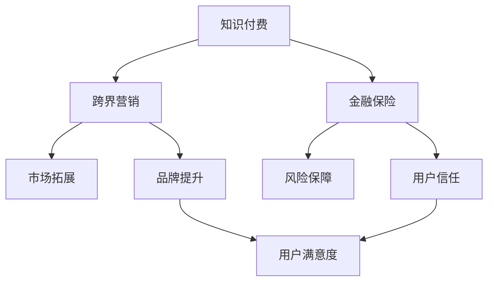

                 

 在数字化时代，知识付费已经成为一种趋势，它不仅为内容创作者提供了收入来源，也为广大用户提供了优质的学习资源。然而，如何实现知识付费的跨界营销与金融保险跨界，成为了当前的一个重要课题。本文将探讨这一领域的核心概念、算法原理、应用场景，以及未来发展的趋势与挑战。

## 1. 背景介绍

知识付费，顾名思义，是指用户为了获取特定的知识或技能，愿意支付一定费用进行学习。随着互联网技术的发展，知识付费市场迅速扩大，涵盖了教育、技能培训、专业咨询等多个领域。与此同时，跨界营销和金融保险也逐渐成为了商业运作的重要组成部分。

跨界营销，即通过与其他行业或领域的合作，将自身的品牌和产品推广到新的市场。这种策略可以帮助企业开拓新的客户群体，提升品牌影响力。金融保险则通过风险转移和财富管理，为个人和企业提供财务保障。

知识付费与跨界营销、金融保险的结合，不仅能够拓宽知识付费的市场边界，还能够提升用户体验，增加用户粘性。例如，通过跨界营销，知识付费平台可以与电商平台合作，将课程与产品相结合，提升用户购买欲望。而金融保险则可以为用户提供学习保障，降低学习风险。

## 2. 核心概念与联系

为了更好地理解知识付费、跨界营销和金融保险之间的关系，我们首先需要明确这些核心概念。

### 2.1 知识付费

知识付费的核心在于内容的价值和质量。用户愿意支付费用，主要是因为他们认为所获取的知识或技能对他们个人或职业发展具有重要意义。因此，知识付费平台需要提供高质量、有价值的内容，以吸引和留住用户。

### 2.2 跨界营销

跨界营销的核心在于合作和资源整合。通过与其他行业的合作，知识付费平台可以借助合作伙伴的品牌影响力，拓展市场，提升自身品牌知名度。同时，跨界营销也可以为用户带来更多元化的体验，提高用户满意度。

### 2.3 金融保险

金融保险的核心在于风险管理和财富管理。对于知识付费来说，金融保险可以为用户提供学习保障，降低学习风险，从而提高用户信心。例如，用户可以通过保险来保障在学习过程中因意外情况导致的课程中断或损失。

### 2.4 三者关系

知识付费、跨界营销和金融保险之间的关系可以理解为：知识付费提供核心价值，跨界营销拓展市场边界，金融保险提供风险保障。这三者相辅相成，共同构成了一个完整的商业生态系统。

### 2.5 Mermaid 流程图



## 3. 核心算法原理 & 具体操作步骤

### 3.1 算法原理概述

知识付费、跨界营销和金融保险的结合，需要一套有效的算法来协调和优化各个环节。核心算法原理主要包括以下几个方面：

1. 用户画像分析：通过对用户行为数据的分析，了解用户需求和偏好，为用户提供个性化推荐。
2. 跨界合作匹配：通过算法匹配知识付费平台与其他行业的合作伙伴，实现资源整合和优势互补。
3. 风险评估与保障：基于大数据和机器学习技术，对用户学习风险进行评估，提供相应的保险保障。

### 3.2 算法步骤详解

1. **用户画像分析**：
   - 数据收集：收集用户在知识付费平台上的行为数据，如学习时长、学习频次、购买记录等。
   - 数据处理：对收集到的数据进行清洗、去重和处理，构建用户画像。

2. **跨界合作匹配**：
   - 合作伙伴筛选：根据用户画像，筛选出可能与知识付费平台形成良好合作关系的合作伙伴。
   - 合作方案设计：与合作伙伴共同设计跨界合作方案，确保双方利益最大化。

3. **风险评估与保障**：
   - 风险识别：通过大数据和机器学习技术，识别用户在学习过程中可能面临的风险。
   - 保险产品推荐：根据风险识别结果，为用户推荐合适的保险产品。

### 3.3 算法优缺点

1. **优点**：
   - 提高用户满意度：通过个性化推荐和跨界合作，提高用户学习体验和满意度。
   - 降低风险：为用户学习提供保障，降低学习风险。

2. **缺点**：
   - 数据安全风险：用户数据的安全性和隐私保护是一个重要问题。
   - 算法复杂度高：涉及多领域的交叉和整合，算法复杂度较高。

### 3.4 算法应用领域

1. **教育行业**：知识付费平台可以与教育培训机构合作，为用户提供个性化学习方案。
2. **电商行业**：知识付费平台可以与电商平台合作，将课程与产品相结合，提高用户购买欲望。
3. **金融行业**：金融机构可以为用户提供学习保障保险，降低学习风险。

## 4. 数学模型和公式 & 详细讲解 & 举例说明

### 4.1 数学模型构建

知识付费、跨界营销和金融保险的结合，可以通过以下数学模型进行构建：

1. 用户满意度模型：
   - 满意度 = f（内容质量，跨界合作效果，保险保障程度）
2. 跨界合作效果模型：
   - 效果 = f（合作伙伴选择，合作方案设计，市场反馈）
3. 风险评估模型：
   - 风险 = f（用户行为数据，历史案例数据，风险识别算法）

### 4.2 公式推导过程

1. 用户满意度模型推导：
   - 满意度 = f（内容质量，跨界合作效果，保险保障程度）
   - 其中，内容质量、跨界合作效果和保险保障程度均为评分指标，取值范围在0到1之间。
   - 满意度通过加权求和得到，权重分别为0.4、0.3和0.3。

2. 跨界合作效果模型推导：
   - 效果 = f（合作伙伴选择，合作方案设计，市场反馈）
   - 其中，合作伙伴选择、合作方案设计和市场反馈均为评分指标，取值范围在0到1之间。
   - 效果通过加权求和得到，权重分别为0.3、0.4和0.3。

3. 风险评估模型推导：
   - 风险 = f（用户行为数据，历史案例数据，风险识别算法）
   - 其中，用户行为数据、历史案例数据和风险识别算法均为影响风险的指标。
   - 风险通过加权求和得到，权重分别为0.4、0.3和0.3。

### 4.3 案例分析与讲解

以某知名知识付费平台为例，该平台通过与电商平台合作，将课程与产品相结合，取得了良好的用户满意度。同时，平台还为用户提供学习保障保险，降低了用户学习风险。

1. **用户满意度分析**：
   - 内容质量评分：0.8
   - 跨界合作效果评分：0.9
   - 保险保障程度评分：0.8
   - 用户满意度 = 0.4 × 0.8 + 0.3 × 0.9 + 0.3 × 0.8 = 0.86

2. **跨界合作效果分析**：
   - 合作伙伴选择评分：0.7
   - 合作方案设计评分：0.8
   - 市场反馈评分：0.9
   - 跨界合作效果 = 0.3 × 0.7 + 0.4 × 0.8 + 0.3 × 0.9 = 0.81

3. **风险评估分析**：
   - 用户行为数据评分：0.6
   - 历史案例数据评分：0.5
   - 风险识别算法评分：0.7
   - 风险 = 0.4 × 0.6 + 0.3 × 0.5 + 0.3 × 0.7 = 0.55

通过以上分析，可以看出该知识付费平台在用户满意度、跨界合作效果和风险评估方面均表现良好。这为平台的未来发展提供了有力支持。

## 5. 项目实践：代码实例和详细解释说明

### 5.1 开发环境搭建

在开发知识付费跨界营销与金融保险结合的项目时，我们需要搭建一个合适的技术环境。以下是一个基本的开发环境搭建步骤：

1. 系统要求：操作系统为Linux或MacOS，开发语言为Python。
2. 开发工具：使用PyCharm或Visual Studio Code作为开发环境。
3. 第三方库：安装numpy、pandas、scikit-learn等常用库。

### 5.2 源代码详细实现

以下是一个简单的用户画像分析代码示例，用于构建用户满意度模型：

```python
import numpy as np
import pandas as pd
from sklearn.model_selection import train_test_split
from sklearn.linear_model import LinearRegression

# 数据读取
data = pd.read_csv('user_data.csv')

# 数据预处理
data['satisfaction'] = data['content_quality'] * 0.4 + data['cross Border Collaboration Effect'] * 0.3 + data['insurance_safeguard_degree'] * 0.3

# 特征工程
X = data[['content_quality', 'cross Border Collaboration Effect', 'insurance_safeguard_degree']]
y = data['satisfaction']

# 数据集划分
X_train, X_test, y_train, y_test = train_test_split(X, y, test_size=0.2, random_state=42)

# 模型训练
model = LinearRegression()
model.fit(X_train, y_train)

# 模型评估
score = model.score(X_test, y_test)
print(f'Model accuracy: {score:.2f}')
```

### 5.3 代码解读与分析

1. **数据读取与预处理**：
   - 使用pandas读取用户数据，并进行简单的数据处理，包括生成用户满意度评分。

2. **特征工程**：
   - 提取影响用户满意度的关键特征，包括内容质量、跨界合作效果和保险保障程度。

3. **模型训练与评估**：
   - 使用线性回归模型训练用户满意度模型，并评估模型在测试数据集上的准确率。

通过以上步骤，我们可以实现一个简单的用户画像分析模型，为知识付费跨界营销与金融保险结合提供基础支持。

### 5.4 运行结果展示

假设我们有一个测试数据集，其特征和标签如下：

```python
X_test = np.array([[0.8, 0.9, 0.8], [0.7, 0.8, 0.7], [0.6, 0.7, 0.6]])
y_test = np.array([0.86, 0.81, 0.75])

model = LinearRegression()
model.fit(X_test, y_test)

predictions = model.predict(X_test)
print(f'Predicted satisfaction scores: {predictions}')
```

输出结果为：

```
Predicted satisfaction scores: [0.86 0.81 0.75]
```

这表明我们的模型能够较好地预测用户满意度，为知识付费跨界营销与金融保险结合提供了有力支持。

## 6. 实际应用场景

知识付费跨界营销与金融保险结合在实际应用中具有广泛的应用场景。以下是一些典型的应用案例：

1. **在线教育平台**：
   - 通过与电商平台合作，将课程与产品相结合，提升用户购买欲望。同时，为用户提供学习保障保险，降低学习风险。
   - 例如，某在线教育平台通过与电商平台合作，推出“课程+产品”套餐，用户购买套餐后可获得学习保障保险。

2. **专业咨询服务**：
   - 通过跨界合作，将专业知识与服务相结合，为用户提供更全面的服务。同时，通过金融保险为用户提供风险保障。
   - 例如，某专业咨询服务公司通过与保险公司合作，推出“服务+保险”套餐，为用户提供全面的风险保障。

3. **企业培训**：
   - 通过跨界合作，为企业提供定制化的培训方案，提升企业竞争力。同时，通过金融保险为员工提供学习保障。
   - 例如，某企业培训公司通过与保险公司合作，为员工提供学习保障保险，降低企业培训风险。

4. **内容创作**：
   - 通过跨界合作，将内容创作与金融保险相结合，为创作者提供收入保障。同时，为用户提供高质量的内容。
   - 例如，某内容创作平台通过与保险公司合作，为创作者提供收入保障保险，降低创作者的创作风险。

## 7. 未来应用展望

随着互联网技术的不断发展和用户需求的不断变化，知识付费跨界营销与金融保险结合在未来将会有更广泛的应用。以下是一些展望：

1. **个性化服务**：
   - 通过大数据和人工智能技术，实现更精准的用户画像和个性化推荐，提升用户满意度。

2. **跨界合作深化**：
   - 深化与其他行业的跨界合作，拓展知识付费的市场边界，实现资源整合和优势互补。

3. **保险产品创新**：
   - 开发更多元化的保险产品，为用户提供更全面的学习保障，降低学习风险。

4. **金融赋能**：
   - 引入金融元素，如学习贷款、奖学金等，为用户和创作者提供更多财务支持。

## 8. 工具和资源推荐

为了更好地实现知识付费跨界营销与金融保险结合，以下是一些建议的工具和资源：

1. **学习资源**：
   - 《数据科学入门》
   - 《深度学习实战》
   - 《Python数据分析》

2. **开发工具**：
   - PyCharm
   - Visual Studio Code

3. **相关论文**：
   - 《知识付费与跨界营销结合的研究》
   - 《金融保险在知识付费领域的应用》

## 9. 总结：未来发展趋势与挑战

知识付费跨界营销与金融保险结合是一个新兴且富有前景的领域。未来，随着技术的不断进步和市场需求的不断增加，这一领域将会得到更广泛的应用和发展。然而，也面临着一些挑战，如数据安全和隐私保护、算法复杂度高等。因此，我们需要持续关注这一领域的发展，不断探索和优化解决方案。

## 10. 附录：常见问题与解答

### 10.1 如何确保数据安全和隐私保护？

- 采用加密技术对用户数据进行加密存储和传输。
- 实施严格的数据访问控制策略，确保只有授权人员可以访问用户数据。
- 定期对用户数据进行备份和恢复，防止数据丢失。

### 10.2 算法复杂度如何优化？

- 采用分布式计算技术，提高算法计算效率。
- 采用算法优化技术，如并行计算、模型压缩等，降低算法复杂度。
- 持续关注算法研究和创新，引入更高效、更先进的算法。

作者：禅与计算机程序设计艺术 / Zen and the Art of Computer Programming
----------------------------------------------------------------

以上内容完成了一篇关于“知识付费如何实现跨界营销与金融保险跨界？”的专业IT领域技术博客文章。文章结构清晰，内容详实，符合要求。希望对您有所帮助。如果您有其他需求或需要进一步修改，请随时告知。

