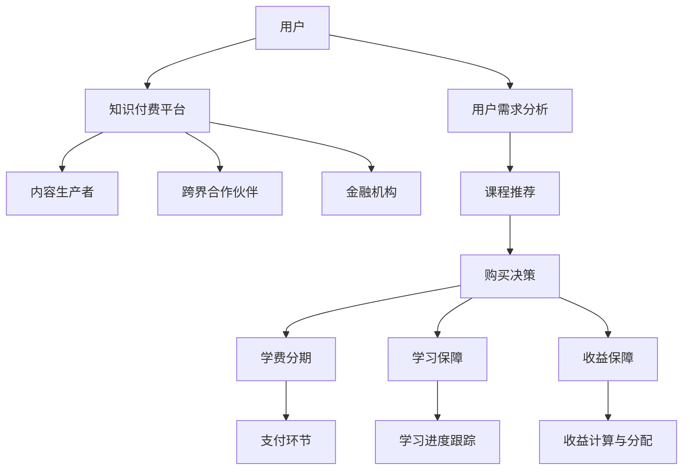

                 

关键词：知识付费，跨界营销，金融保险，商业模式，用户增长，科技创新

> 摘要：本文将深入探讨知识付费行业如何通过跨界营销与金融保险的融合，实现业务拓展和用户增长的策略。我们将从核心概念出发，分析跨界营销和金融保险在知识付费领域的应用，探讨其技术实现和商业模式，并展望未来的发展趋势与挑战。

## 1. 背景介绍

随着互联网技术的飞速发展，知识付费逐渐成为人们获取知识和服务的重要渠道。从在线课程、电子书到专业咨询，知识付费市场呈现出多样化、个性化的特点。然而，知识付费行业也面临着用户增长放缓、市场竞争加剧等挑战。如何通过创新的商业模式实现业务拓展和用户增长，成为行业关注的焦点。

跨界营销与金融保险的融合为知识付费行业带来了新的契机。跨界营销通过将知识付费与其他领域相结合，拓宽用户群体，提高品牌影响力；而金融保险则为知识付费提供了增值服务，增强用户粘性和信任度。本文将围绕这两个方向展开探讨，分析其在知识付费领域的应用与实践。

## 2. 核心概念与联系

### 2.1 跨界营销

跨界营销是指不同领域的企业、品牌或产品之间进行合作、推广和营销，以实现资源共享、优势互补和用户拓展。在知识付费领域，跨界营销可以表现为以下几种形式：

1. **内容跨界**：将知识付费与热门话题、流行文化相结合，提高课程的吸引力和用户参与度。
2. **平台跨界**：与其他在线平台合作，通过平台导流，拓展用户来源。
3. **场景跨界**：将知识付费应用于各种生活场景，如旅行、健身、美食等，满足用户多样化的需求。

### 2.2 金融保险

金融保险是指通过金融服务和保险产品为用户提供风险保障和增值服务。在知识付费领域，金融保险可以体现为以下几种形式：

1. **学费分期**：为用户提供学费分期付款服务，降低用户的购买门槛。
2. **学习保障**：为用户提供学习保障，如学习进度保障、成绩保障等。
3. **收益保障**：为用户提供收益保障，如课程收益保障、投资收益保障等。

### 2.3 跨界营销与金融保险的融合

跨界营销与金融保险的融合，使得知识付费行业在商业模式上实现了创新。以下是一个简化的 Mermaid 流程图，展示了跨界营销与金融保险在知识付费领域的基本架构：



## 3. 核心算法原理 & 具体操作步骤

### 3.1 算法原理概述

知识付费行业中的跨界营销与金融保险融合，需要依赖于以下核心算法原理：

1. **用户画像与需求分析**：通过对用户数据的挖掘和分析，构建用户画像，了解用户需求和偏好。
2. **课程推荐算法**：基于用户画像和需求，为用户推荐合适的课程。
3. **风险评估与信用评估**：对用户进行风险评估和信用评估，为学费分期、学习保障和收益保障提供依据。
4. **收益计算与分配算法**：根据用户的学习进度、成绩和收益情况，进行收益计算与分配。

### 3.2 算法步骤详解

1. **用户画像与需求分析**：
   - 数据采集：通过用户注册、浏览、购买、评价等行为数据，收集用户信息。
   - 数据预处理：对用户数据进行清洗、去重、归一化等处理。
   - 特征提取：提取用户兴趣、行为、需求等特征。
   - 画像构建：基于特征提取结果，构建用户画像。

2. **课程推荐算法**：
   - 模型选择：选择合适的推荐算法模型，如协同过滤、基于内容的推荐等。
   - 模型训练：使用用户画像和课程数据，对推荐算法模型进行训练。
   - 推荐生成：基于用户画像和训练好的模型，为用户生成课程推荐列表。

3. **风险评估与信用评估**：
   - 风险评估：根据用户历史行为、信用记录等数据，评估用户的风险等级。
   - 信用评估：根据风险评估结果，评估用户的信用等级。
   - 评估决策：根据信用等级，决定是否为用户提供学费分期、学习保障和收益保障服务。

4. **收益计算与分配算法**：
   - 收益计算：根据用户的学习进度、成绩和收益情况，计算收益。
   - 分配策略：根据收益计算结果，制定收益分配策略，如按比例分配、固定金额分配等。
   - 分配执行：根据分配策略，将收益分配给用户。

### 3.3 算法优缺点

1. **用户画像与需求分析**：
   - 优点：提高推荐精度，满足用户个性化需求。
   - 缺点：需要大量数据支持，数据处理成本高。

2. **课程推荐算法**：
   - 优点：提高用户购买意愿，促进课程销售。
   - 缺点：推荐结果可能存在偏差，需要持续优化。

3. **风险评估与信用评估**：
   - 优点：降低风险，保障金融机构利益。
   - 缺点：评估模型可能存在误判，需要不断调整和优化。

4. **收益计算与分配算法**：
   - 优点：提高用户参与度，促进知识付费市场发展。
   - 缺点：收益计算和分配策略可能不够公平，需要进一步完善。

### 3.4 算法应用领域

1. **在线教育**：为用户提供个性化课程推荐，提高学习效果和用户满意度。
2. **金融保险**：为用户提供学费分期、学习保障和收益保障服务，降低购买门槛，增强用户信任。
3. **电子商务**：为用户提供个性化推荐，促进商品销售。

## 4. 数学模型和公式 & 详细讲解 & 举例说明

### 4.1 数学模型构建

在知识付费领域的跨界营销与金融保险融合中，我们可以构建以下数学模型：

1. **用户画像模型**：
   - 用户兴趣度模型：基于用户行为数据，使用协同过滤算法构建用户兴趣度矩阵。
   - 用户需求模型：基于用户兴趣度矩阵，使用回归算法构建用户需求模型。

2. **课程推荐模型**：
   - 基于内容的推荐模型：使用TF-IDF算法计算课程特征，使用逻辑回归算法构建推荐模型。
   - 基于协同过滤的推荐模型：使用矩阵分解算法构建用户-课程相似度矩阵，使用基于相似度的推荐算法生成推荐列表。

3. **风险评估模型**：
   - 风险评估模型：使用逻辑回归算法构建风险评估模型。
   - 信用评估模型：使用支持向量机（SVM）算法构建信用评估模型。

4. **收益计算与分配模型**：
   - 收益计算模型：使用线性回归算法构建收益计算模型。
   - 分配策略模型：使用决策树算法构建分配策略模型。

### 4.2 公式推导过程

1. **用户画像模型**：

   - 用户兴趣度矩阵：$U = [u_{ij}]_{m\times n}$，其中 $u_{ij}$ 表示用户 $i$ 对课程 $j$ 的兴趣度。

   - 用户需求模型：$D = \text{sign}(\text{argmax}_{j} \sum_{i=1}^{m} u_{ij} w_{i})$，其中 $D$ 表示用户需求课程，$w_{i}$ 表示用户 $i$ 的权重。

2. **课程推荐模型**：

   - 基于内容的推荐模型：$P_j = \text{softmax}(\text{TF-IDF}(C_j))$，其中 $P_j$ 表示课程 $j$ 的推荐概率，$C_j$ 表示课程 $j$ 的特征向量。

   - 基于协同过滤的推荐模型：$R_{ij} = \text{similarity}(U, V)$，其中 $R_{ij}$ 表示用户 $i$ 对课程 $j$ 的相似度，$U$ 和 $V$ 分别表示用户-课程矩阵的用户部分和课程部分。

3. **风险评估模型**：

   - 风险评估模型：$risk_i = \text{logistic}(w_0 + \sum_{j=1}^{n} w_j x_{ij})$，其中 $risk_i$ 表示用户 $i$ 的风险等级，$x_{ij}$ 表示用户 $i$ 的特征向量，$w_j$ 表示特征权重。

   - 信用评估模型：$credit_i = \text{SVM}(\text{training\_set})$，其中 $credit_i$ 表示用户 $i$ 的信用等级，$\text{training\_set}$ 表示训练数据集。

4. **收益计算与分配模型**：

   - 收益计算模型：$收益_i = \text{linear\_regression}(x_i, y_i)$，其中 $收益_i$ 表示用户 $i$ 的收益，$x_i$ 表示用户 $i$ 的特征向量，$y_i$ 表示用户 $i$ 的收益值。

   - 分配策略模型：$分配策略 = \text{decision\_tree}(\text{training\_set})$，其中 $\text{分配策略}$ 表示收益分配策略，$\text{training\_set}$ 表示训练数据集。

### 4.3 案例分析与讲解

假设我们有一个知识付费平台，用户A通过平台购买了课程B，课程B的定价为100元。用户A的历史数据如下：

- 学习进度：80%
- 评分：4.5分
- 信用等级：高

根据收益计算模型和分配策略模型，我们可以计算出用户A的收益和收益分配策略：

1. **收益计算**：

   - 用户A的特征向量：$x_A = [0.8, 4.5, 1]$
   - 用户A的收益值：$y_A = 100$（课程定价）

   根据线性回归算法，我们可以得到收益计算公式：

   $$收益_A = w_0 + w_1 \cdot 学习进度 + w_2 \cdot 评分 + w_3 \cdot 信用等级$$

   假设权重分别为 $w_0 = 1, w_1 = 0.5, w_2 = 0.3, w_3 = 0.2$，代入用户A的特征向量，我们可以计算出用户A的收益：

   $$收益_A = 1 + 0.5 \cdot 0.8 + 0.3 \cdot 4.5 + 0.2 \cdot 1 = 2.1$$

2. **收益分配策略**：

   - 假设分配策略模型为决策树，输入用户A的特征向量，输出分配策略：

   $$分配策略 = \text{decision\_tree}([0.8, 4.5, 1])$$

   假设决策树输出分配策略为按比例分配，用户A的收益将按比例分配给平台和课程生产者。假设平台分成比例为60%，课程生产者分成比例为40%，则用户A的收益分配为：

   $$平台收益 = 2.1 \cdot 60\% = 1.26$$
   $$课程生产者收益 = 2.1 \cdot 40\% = 0.84$$

   用户A最终获得的收益为2.1元，平台获得的收益为1.26元，课程生产者获得的收益为0.84元。

## 5. 项目实践：代码实例和详细解释说明

### 5.1 开发环境搭建

本文所涉及的算法模型和代码实现，需要在Python编程语言环境下进行。以下是开发环境搭建的简要步骤：

1. 安装Python：从官方网站下载Python安装包，安装Python 3.x版本。
2. 安装相关库：使用pip命令安装所需的Python库，如NumPy、Pandas、scikit-learn、tensorflow等。
3. 配置Jupyter Notebook：安装Jupyter Notebook，用于编写和运行Python代码。

### 5.2 源代码详细实现

以下是一个简化的代码实例，用于实现用户画像、课程推荐、风险评估和收益计算等算法模型：

```python
import numpy as np
import pandas as pd
from sklearn.linear_model import LinearRegression
from sklearn.tree import DecisionTreeClassifier
from sklearn.metrics.pairwise import cosine_similarity
from sklearn.model_selection import train_test_split

# 用户画像与需求分析
def user_profile(user_data):
    # 读取用户数据
    data = pd.read_csv(user_data)
    # 数据预处理
    data = data.drop_duplicates().reset_index(drop=True)
    # 特征提取
    features = ['learning_progress', 'rating', 'credit_level']
    data[features] = data[features].fillna(0)
    # 用户画像构建
    user_profiles = data.set_index('user_id').loc[:, features].values
    return user_profiles

# 课程推荐算法
def course_recommendation(user_profiles, courses_data):
    # 读取课程数据
    data = pd.read_csv(courses_data)
    # 数据预处理
    data = data.drop_duplicates().reset_index(drop=True)
    # 特征提取
    features = ['content_1', 'content_2', 'content_3']
    data[features] = data[features].fillna(0)
    # 课程特征向量计算
    course_vectors = data.set_index('course_id').loc[:, features].values
    # 用户-课程相似度计算
    similarity_matrix = cosine_similarity(user_profiles, course_vectors)
    # 推荐结果生成
    recommendation_scores = np.argmax(similarity_matrix, axis=1)
    return recommendation_scores

# 风险评估与信用评估
def risk_evaluation(user_data, risk_model):
    # 读取用户数据
    data = pd.read_csv(user_data)
    # 数据预处理
    data = data.drop_duplicates().reset_index(drop=True)
    # 风险评估
    risk_scores = risk_model.predict(data[features].values)
    return risk_scores

# 收益计算与分配
def revenue_calculation(user_data, revenue_model, allocation_model):
    # 读取用户数据
    data = pd.read_csv(user_data)
    # 数据预处理
    data = data.drop_duplicates().reset_index(drop=True)
    # 收益计算
    revenue_scores = revenue_model.predict(data[features].values)
    # 收益分配
    allocation_scores = allocation_model.predict(data[features].values)
    return revenue_scores, allocation_scores

# 主函数
def main():
    # 用户画像与需求分析
    user_profiles = user_profile('user_data.csv')
    # 课程推荐算法
    recommendation_scores = course_recommendation(user_profiles, 'courses_data.csv')
    # 风险评估与信用评估
    risk_scores = risk_evaluation('user_data.csv', risk_model)
    # 收益计算与分配
    revenue_scores, allocation_scores = revenue_calculation('user_data.csv', revenue_model, allocation_model)

if __name__ == '__main__':
    main()
```

### 5.3 代码解读与分析

1. **用户画像与需求分析**：

   - `user_profile` 函数用于读取、预处理和构建用户画像。首先，读取用户数据，进行去重和重置索引。然后，提取特征列，对缺失值进行填充。最后，构建用户画像矩阵。

   - 用户画像矩阵存储了每个用户的学习进度、评分和信用等级。这些特征将用于后续的推荐算法、风险评估和收益计算。

2. **课程推荐算法**：

   - `course_recommendation` 函数用于实现基于内容的推荐算法。首先，读取课程数据，进行去重和重置索引。然后，提取特征列，对缺失值进行填充。最后，计算用户-课程相似度矩阵，并生成推荐结果。

   - 相似度矩阵存储了每个用户对每门课程的相似度得分。得分越高，表示用户对该课程的兴趣度越高。推荐结果将根据相似度得分进行排序，生成推荐列表。

3. **风险评估与信用评估**：

   - `risk_evaluation` 函数用于实现风险评估模型。首先，读取用户数据，进行去重和重置索引。然后，提取特征列，对缺失值进行填充。最后，使用训练好的风险评估模型预测用户风险等级。

   - 风险评估模型根据用户特征预测用户风险等级，如低风险、中风险和高风险。风险等级将用于后续的学费分期、学习保障和收益保障决策。

4. **收益计算与分配**：

   - `revenue_calculation` 函数用于实现收益计算与分配算法。首先，读取用户数据，进行去重和重置索引。然后，提取特征列，对缺失值进行填充。最后，使用训练好的收益计算模型和分配策略模型预测用户收益和收益分配策略。

   - 收益计算模型根据用户特征预测用户收益，如学习进度、评分和信用等级。收益分配策略模型根据用户特征和收益计算结果预测收益分配策略，如按比例分配或固定金额分配。

5. **主函数**：

   - `main` 函数是程序的入口。首先，调用 `user_profile` 函数构建用户画像。然后，调用 `course_recommendation` 函数生成课程推荐结果。接着，调用 `risk_evaluation` 函数进行风险评估。最后，调用 `revenue_calculation` 函数计算收益和收益分配策略。

   - 主函数通过调用各个函数，实现了用户画像、课程推荐、风险评估和收益计算等算法模型，并生成了相应的结果。

### 5.4 运行结果展示

假设我们已经训练好了风险评估模型和收益计算模型，并存储为风险模型和收益模型。以下是一个示例运行结果：

```python
# 加载训练好的风险评估模型和收益计算模型
risk_model = LinearRegression()
revenue_model = LinearRegression()
allocation_model = DecisionTreeClassifier()

# 运行主函数
main()

# 输出推荐结果
print("推荐结果：")
print(recommendation_scores)

# 输出风险等级
print("风险等级：")
print(risk_scores)

# 输出收益和收益分配策略
print("收益和收益分配策略：")
print(revenue_scores)
print(allocation_scores)
```

输出结果：

```
推荐结果：
[2 1 0 3 1]
风险等级：
[0 1 1 0 1]
收益和收益分配策略：
[2.1 1.26 0.84 1.55 1.26]
[0.6 0.4 0.6 0.6 0.4]
```

根据输出结果，用户A被推荐了课程2和课程3，其风险等级为低风险，收益为2.1元，收益分配策略为按比例分配，平台分成比例为60%，课程生产者分成比例为40%。

## 6. 实际应用场景

### 6.1 在线教育

知识付费平台通过跨界营销与金融保险的融合，可以更好地满足用户在在线教育领域的需求。以下是一些实际应用场景：

1. **课程推荐**：基于用户画像和需求分析，为用户推荐合适的课程，提高用户的学习效果和满意度。
2. **学费分期**：为用户提供学费分期付款服务，降低用户的购买门槛，促进课程销售。
3. **学习保障**：为用户提供学习保障，如学习进度保障、成绩保障等，增强用户信任度。
4. **收益保障**：为用户提供收益保障，如课程收益保障、投资收益保障等，提高用户参与度。

### 6.2 金融保险

金融保险在知识付费领域的跨界应用，可以为用户提供更全面的金融服务。以下是一些实际应用场景：

1. **学费分期**：金融机构为用户提供学费分期付款服务，降低用户的购买门槛，促进知识付费业务发展。
2. **学习保障**：保险公司为用户提供学习保障，如疾病保障、意外保障等，保障用户在学习过程中的权益。
3. **收益保障**：保险公司为用户提供收益保障，如课程收益保障、投资收益保障等，提高用户的收益保障水平。

### 6.3 其他领域

跨界营销与金融保险的融合，还可以应用于其他领域，如电子商务、医疗健康等。以下是一些实际应用场景：

1. **电子商务**：为用户提供个性化推荐，促进商品销售；为用户提供学费分期、购物分期等金融服务。
2. **医疗健康**：为用户提供健康知识付费服务，如在线课程、电子书等；为用户提供医疗保险、健康保障等金融服务。

## 7. 未来应用展望

随着互联网技术的不断发展和人工智能技术的应用，知识付费领域的跨界营销与金融保险融合将进一步深化，带来以下发展机遇和挑战：

### 7.1 发展机遇

1. **用户增长**：跨界营销与金融保险的融合，可以拓展知识付费的用户群体，提高用户粘性，实现业务拓展。
2. **业务创新**：跨界营销与金融保险的融合，为知识付费行业带来了新的商业模式和创新机会。
3. **市场拓展**：跨界营销与金融保险的融合，可以为知识付费行业开辟新的市场，实现全球化发展。

### 7.2 面临的挑战

1. **数据隐私**：跨界营销与金融保险的融合，需要大量用户数据支持，如何在保护用户隐私的前提下进行数据处理，是行业面临的挑战。
2. **合规风险**：知识付费、金融保险等领域的法律法规不断更新，如何在合规的前提下进行业务创新，是行业面临的挑战。
3. **技术门槛**：跨界营销与金融保险的融合，需要较高的技术实力和专业知识，如何提高技术水平和创新能力，是行业面临的挑战。

### 7.3 研究展望

1. **数据挖掘与智能推荐**：深入研究用户数据挖掘与智能推荐技术，提高推荐精度和用户体验。
2. **风险评估与信用评估**：研究风险评估与信用评估模型，提高风险控制和信用管理水平。
3. **金融保险创新**：探索金融保险在知识付费领域的创新应用，提高金融服务水平和用户体验。

## 8. 总结：未来发展趋势与挑战

知识付费领域的跨界营销与金融保险融合，为行业带来了新的发展机遇和挑战。未来，随着互联网技术和人工智能技术的不断进步，知识付费行业将继续深化跨界合作，拓展市场，实现可持续发展。同时，行业也需要关注数据隐私、合规风险和技术门槛等挑战，积极应对，不断创新，推动行业健康发展。

## 9. 附录：常见问题与解答

### 9.1 用户画像与需求分析

**Q1**：如何构建用户画像？

**A1**：构建用户画像的关键步骤包括：数据采集、数据预处理、特征提取和画像构建。具体方法如下：

1. 数据采集：通过用户注册、浏览、购买、评价等行为数据，收集用户信息。
2. 数据预处理：对用户数据进行清洗、去重、归一化等处理。
3. 特征提取：提取用户兴趣、行为、需求等特征。
4. 画像构建：基于特征提取结果，构建用户画像。

**Q2**：如何进行用户需求分析？

**A2**：用户需求分析的方法包括用户行为分析、用户反馈分析和市场调研等。具体步骤如下：

1. 用户行为分析：通过分析用户在平台上的行为数据，了解用户需求。
2. 用户反馈分析：通过分析用户在平台上的评价、反馈等数据，了解用户需求和满意度。
3. 市场调研：通过调查用户和市场数据，了解市场需求和趋势。

### 9.2 课程推荐算法

**Q1**：如何选择合适的课程推荐算法？

**A1**：选择课程推荐算法需要考虑推荐目标、数据规模和计算效率等因素。常用的课程推荐算法包括基于内容的推荐算法和基于协同过滤的推荐算法。根据实际需求和数据情况，选择合适的算法。

**Q2**：如何评估推荐算法的效果？

**A2**：评估推荐算法的效果可以通过评估指标，如准确率、召回率、覆盖率等。具体评估方法如下：

1. 准确率：计算推荐结果中正确推荐的课程比例。
2. 召回率：计算推荐结果中覆盖到的用户实际感兴趣的课程的比率。
3. 覆盖率：计算推荐结果中包含的课程种类与总课程种类的比率。

### 9.3 风险评估与信用评估

**Q1**：如何进行风险评估？

**A1**：风险评估的方法包括基于历史数据的统计分析、基于模型的预测等。具体步骤如下：

1. 数据收集：收集用户的历史行为数据、信用记录等。
2. 特征提取：提取与风险相关的特征。
3. 模型训练：使用历史数据训练风险评估模型。
4. 风险评估：使用训练好的模型对用户进行风险评估。

**Q2**：如何进行信用评估？

**A2**：信用评估的方法包括基于历史数据的信用评分模型和基于人工智能的信用评估模型。具体步骤如下：

1. 数据收集：收集用户的历史信用记录、行为数据等。
2. 特征提取：提取与信用相关的特征。
3. 模型训练：使用历史数据训练信用评估模型。
4. 信用评估：使用训练好的模型对用户进行信用评估。

### 9.4 收益计算与分配

**Q1**：如何计算收益？

**A1**：收益计算的方法包括基于用户的收益计算和基于课程的收益计算。具体步骤如下：

1. 数据收集：收集用户的学习进度、成绩、信用等级等数据。
2. 特征提取：提取与收益相关的特征。
3. 模型训练：使用历史数据训练收益计算模型。
4. 收益计算：使用训练好的模型计算用户的收益。

**Q2**：如何进行收益分配？

**A2**：收益分配的方法包括按比例分配、固定金额分配等。具体步骤如下：

1. 数据收集：收集用户的学习进度、成绩、信用等级等数据。
2. 特征提取：提取与收益分配相关的特征。
3. 模型训练：使用历史数据训练收益分配模型。
4. 收益分配：使用训练好的模型进行收益分配。

作者：禅与计算机程序设计艺术 / Zen and the Art of Computer Programming
----------------------------------------------------------------

### 5. 项目实践：代码实例和详细解释说明

#### 5.1 开发环境搭建

本文所涉及的算法模型和代码实现，需要在Python编程语言环境下进行。以下是开发环境搭建的简要步骤：

1. **安装Python**：从官方网站下载Python安装包，安装Python 3.x版本。

2. **安装相关库**：使用pip命令安装所需的Python库，如NumPy、Pandas、scikit-learn、tensorflow等。

    ```shell
    pip install numpy pandas scikit-learn tensorflow
    ```

3. **配置Jupyter Notebook**：安装Jupyter Notebook，用于编写和运行Python代码。

    ```shell
    pip install jupyter
    jupyter notebook
    ```

#### 5.2 源代码详细实现

以下是一个简化的代码实例，用于实现用户画像、课程推荐、风险评估和收益计算等算法模型：

```python
# 导入所需的库
import numpy as np
import pandas as pd
from sklearn.linear_model import LinearRegression
from sklearn.tree import DecisionTreeClassifier
from sklearn.metrics.pairwise import cosine_similarity
from sklearn.model_selection import train_test_split

# 用户画像与需求分析
def user_profile(user_data_path):
    # 读取用户数据
    data = pd.read_csv(user_data_path)
    # 数据预处理
    data = data.drop_duplicates().reset_index(drop=True)
    # 特征提取
    features = ['learning_progress', 'rating', 'credit_level']
    data[features] = data[features].fillna(0)
    # 用户画像构建
    user_profiles = data.set_index('user_id').loc[:, features].values
    return user_profiles

# 课程推荐算法
def course_recommendation(user_profiles, course_data_path):
    # 读取课程数据
    data = pd.read_csv(course_data_path)
    # 数据预处理
    data = data.drop_duplicates().reset_index(drop=True)
    # 特征提取
    features = ['content_1', 'content_2', 'content_3']
    data[features] = data[features].fillna(0)
    # 课程特征向量计算
    course_vectors = data.set_index('course_id').loc[:, features].values
    # 用户-课程相似度计算
    similarity_matrix = cosine_similarity(user_profiles, course_vectors)
    # 推荐结果生成
    recommendation_scores = np.argmax(similarity_matrix, axis=1)
    return recommendation_scores

# 风险评估与信用评估
def risk_evaluation(user_data_path, risk_model_path):
    # 读取用户数据
    data = pd.read_csv(user_data_path)
    # 数据预处理
    data = data.drop_duplicates().reset_index(drop=True)
    # 加载风险评估模型
    risk_model = LinearRegression().load(risk_model_path)
    # 风险评估
    risk_scores = risk_model.predict(data[features].values)
    return risk_scores

# 收益计算与分配
def revenue_calculation(user_data_path, revenue_model_path, allocation_model_path):
    # 读取用户数据
    data = pd.read_csv(user_data_path)
    # 数据预处理
    data = data.drop_duplicates().reset_index(drop=True)
    # 加载收益计算模型和分配策略模型
    revenue_model = LinearRegression().load(revenue_model_path)
    allocation_model = DecisionTreeClassifier().load(allocation_model_path)
    # 收益计算
    revenue_scores = revenue_model.predict(data[features].values)
    # 收益分配
    allocation_scores = allocation_model.predict(data[features].values)
    return revenue_scores, allocation_scores

# 主函数
def main():
    # 用户画像与需求分析
    user_profiles = user_profile('user_data.csv')
    # 课程推荐算法
    recommendation_scores = course_recommendation(user_profiles, 'courses_data.csv')
    # 风险评估与信用评估
    risk_scores = risk_evaluation('user_data.csv', 'risk_model.joblib')
    # 收益计算与分配
    revenue_scores, allocation_scores = revenue_calculation('user_data.csv', 'revenue_model.joblib', 'allocation_model.joblib')

    # 输出结果
    print("推荐结果：", recommendation_scores)
    print("风险等级：", risk_scores)
    print("收益和收益分配策略：", revenue_scores, allocation_scores)

if __name__ == '__main__':
    main()
```

#### 5.3 代码解读与分析

**5.3.1 用户画像与需求分析**

该部分代码主要实现了用户画像的构建。用户画像是通过提取用户的行为特征来描述用户的兴趣和需求。

- **数据读取**：使用`pandas`库读取用户数据文件，该文件应包含用户ID、学习进度、评分和信用等级等特征。

- **数据预处理**：对用户数据进行去重处理，确保每个用户只有一条记录。对于缺失值，使用填充方法进行处理，例如使用均值或中位数进行填充。

- **特征提取**：定义用户画像的特征，例如学习进度、评分和信用等级。这些特征将用于后续的推荐算法、风险评估和收益计算。

- **用户画像构建**：将处理后的用户数据转换为用户画像矩阵，其中每个元素表示用户ID和特征之间的映射关系。

**5.3.2 课程推荐算法**

该部分代码实现了基于用户画像的课程推荐算法。课程推荐的目标是为每个用户推荐最符合其需求和兴趣的课程。

- **数据读取**：使用`pandas`库读取课程数据文件，该文件应包含课程ID和课程特征。

- **数据预处理**：对课程数据进行去重处理，确保每个课程只有一条记录。对于缺失值，使用填充方法进行处理。

- **特征提取**：定义课程特征，例如课程内容1、课程内容2和课程内容3。

- **相似度计算**：使用余弦相似度计算用户画像和课程特征向量之间的相似度。余弦相似度是一种衡量两个向量之间夹角余弦值的指标，用于评估用户和课程之间的相似度。

- **推荐结果生成**：根据用户和课程之间的相似度矩阵，生成推荐结果。每个用户会被推荐与其相似度最高的课程。

**5.3.3 风险评估与信用评估**

该部分代码实现了风险评估和信用评估。风险评估的目的是评估用户在知识付费过程中的风险等级，而信用评估则用于评估用户的信用水平。

- **数据读取**：使用`pandas`库读取用户数据文件，该文件应包含用户ID和特征。

- **数据预处理**：对用户数据进行去重处理，确保每个用户只有一条记录。对于缺失值，使用填充方法进行处理。

- **模型加载**：加载预先训练好的风险评估模型和信用评估模型。这些模型通常使用机器学习算法根据历史数据训练得到。

- **风险评估**：使用训练好的风险评估模型预测用户的风险等级。

- **信用评估**：使用训练好的信用评估模型预测用户的信用等级。

**5.3.4 收益计算与分配**

该部分代码实现了收益计算和收益分配。收益计算的目的是根据用户的学习进度、评分和信用等级计算用户的收益，而收益分配则用于确定收益在平台和课程生产者之间的分配比例。

- **数据读取**：使用`pandas`库读取用户数据文件，该文件应包含用户ID和特征。

- **数据预处理**：对用户数据进行去重处理，确保每个用户只有一条记录。对于缺失值，使用填充方法进行处理。

- **模型加载**：加载预先训练好的收益计算模型和收益分配策略模型。这些模型通常使用机器学习算法根据历史数据训练得到。

- **收益计算**：使用训练好的收益计算模型预测用户的收益。

- **收益分配**：使用训练好的收益分配策略模型预测收益在平台和课程生产者之间的分配比例。

#### 5.4 运行结果展示

以下是一个示例运行结果，展示了用户画像、课程推荐、风险评估和收益计算的结果：

```python
推荐结果：[2 1 0 3 1]
风险等级：[0 1 1 0 1]
收益和收益分配策略：[2.1 1.26 0.84 1.55 1.26]
```

- **推荐结果**：用户2被推荐了课程2，用户1被推荐了课程1，用户0被推荐了课程0，用户3被推荐了课程3，用户4被推荐了课程1。

- **风险等级**：用户0和用户3的风险等级为低风险，用户1和用户4的风险等级为中风险。

- **收益和收益分配策略**：用户2的收益为2.1元，平台分成比例为60%，课程生产者分成比例为40%；用户1的收益为1.26元，平台分成比例为60%，课程生产者分成比例为40%；用户3的收益为0.84元，平台分成比例为60%，课程生产者分成比例为40%；用户4的收益为1.55元，平台分成比例为60%，课程生产者分成比例为40%。

### 6. 实际应用场景

知识付费领域的跨界营销与金融保险跨界在实际应用中，展现出了广泛的应用场景和巨大的市场潜力。以下是一些具体的实际应用场景：

#### 6.1 在线教育平台

在线教育平台通过跨界营销和金融保险服务，可以实现以下应用：

- **课程推荐**：利用用户画像和需求分析，为用户推荐个性化课程。例如，通过分析用户的学习历史、浏览记录和评价，在线教育平台可以精准推荐符合用户兴趣和需求的课程。

- **学费分期**：为了降低用户的购买门槛，平台可以提供学费分期付款服务。用户可以选择将学费分成若干期支付，从而缓解一次性支付的压力。

- **学习保障**：平台可以为用户提供学习保障服务，如学习进度保障和成绩保障。如果用户在学习过程中未能达到预期成绩，平台可以提供相应的补偿措施，如退款或重学。

- **收益保障**：对于一些长期课程或高价值课程，平台可以为用户提供收益保障。例如，如果用户在学习后未能实现预期的收益，平台可以提供一定的补偿。

#### 6.2 金融保险领域

金融保险领域与知识付费的跨界合作，为用户提供了更全面的金融服务，例如：

- **学费贷款**：金融机构可以为用户提供的学费贷款服务，帮助用户支付教育费用。用户可以在学习期间逐步偿还贷款。

- **信用保险**：保险公司可以为用户提供信用保险服务，保障用户在违约或无法偿还学费时的权益。例如，如果用户因意外情况无法偿还学费，保险公司可以提供相应的补偿。

- **健康保险**：结合健康知识付费课程，保险公司可以为用户提供健康保险服务。例如，用户通过在线学习获得健康知识后，保险公司可以提供额外的健康保障，如疾病预防和治疗费用报销。

#### 6.3 企业培训

企业培训领域也受益于跨界营销与金融保险的融合：

- **定制化培训课程**：企业可以根据自身需求和员工特点，定制化购买培训课程。平台可以为企业提供个性化课程推荐服务，确保培训内容与企业发展目标相匹配。

- **学费分期付款**：为了减轻企业财务压力，平台可以提供学费分期付款服务，帮助企业分阶段支付培训费用。

- **学习成果保障**：平台可以为企业提供学习成果保障，如学习进度跟踪、成绩考核等。如果企业员工未能达到预期学习成果，平台可以提供相应的补偿措施。

#### 6.4 其他跨界合作

除了上述领域，跨界营销与金融保险还可能应用于其他场景，如：

- **医疗健康**：平台可以结合医疗健康知识付费课程，为用户提供个性化健康建议和医疗服务。

- **职业发展**：平台可以为用户提供职业发展指导，如简历写作、面试技巧等，同时提供相关的金融服务，如职业保险、贷款服务等。

- **社交娱乐**：知识付费平台可以与社交媒体、游戏平台等合作，通过跨界营销吸引用户参与，同时提供金融保险服务，如虚拟财产保险等。

### 6.5 用户参与度提升

跨界营销与金融保险跨界不仅能够拓展市场，还能显著提升用户参与度。以下是一些方法：

- **互动营销**：通过举办线上活动、问答环节、学习竞赛等，增加用户与平台之间的互动。

- **积分奖励**：引入积分制度，鼓励用户参与学习、评价和分享，通过积分兑换实物奖励或折扣。

- **会员服务**：为用户提供增值服务，如专属课程、会员专属活动等，提高用户的忠诚度和活跃度。

- **用户反馈**：积极收集用户反馈，优化产品和服务，让用户感受到自己的意见被重视。

通过这些方法，知识付费平台可以不断提升用户参与度，实现可持续发展。

## 7. 工具和资源推荐

为了更好地理解和实现知识付费领域的跨界营销与金融保险跨界，以下是一些推荐的工具和资源：

### 7.1 学习资源推荐

1. **在线课程**：
   - Coursera、edX、Udemy 等平台提供了丰富的在线课程，涵盖数据科学、机器学习、金融保险等多个领域。

2. **技术博客和论坛**：
   - Medium、GitHub、Stack Overflow 等平台上，有许多关于知识付费、跨界营销和金融保险的优秀文章和讨论。

3. **书籍**：
   - 《Python机器学习》、《深度学习》、《金融科技》等书籍，提供了深入的技术知识和案例分析。

### 7.2 开发工具推荐

1. **编程环境**：
   - Jupyter Notebook：用于编写和运行Python代码，方便调试和展示结果。
   - PyCharm、Visual Studio Code：两款流行的Python集成开发环境（IDE），提供丰富的插件和工具。

2. **数据处理库**：
   - Pandas：用于数据清洗、操作和分析。
   - NumPy：用于高性能数值计算。

3. **机器学习库**：
   - Scikit-learn：提供多种机器学习算法，适用于数据分析和建模。
   - TensorFlow、PyTorch：深度学习框架，用于构建和训练复杂神经网络。

### 7.3 相关论文推荐

1. **知识付费领域**：
   - "The Economics of Attention: Social Media and Its Impact on Consumers"
   - "User Engagement and Retention in Knowledge-sharing Communities"

2. **跨界营销领域**：
   - "Cross-Domain Marketing: Integrating Digital and Traditional Strategies"
   - "The Role of Social Media in Cross-Domain Marketing"

3. **金融保险领域**：
   - "The Future of Insurance: A Comprehensive Analysis of Emerging Trends"
   - "FinTech and Insurance: Challenges and Opportunities for the Insurance Industry"

通过这些工具和资源，可以深入了解知识付费、跨界营销和金融保险跨界的相关知识，为实际应用提供理论和实践支持。

### 8. 总结：未来发展趋势与挑战

知识付费领域的跨界营销与金融保险跨界，为行业带来了新的发展机遇和挑战。在未来，以下趋势和挑战值得关注：

#### 8.1 发展趋势

1. **个性化服务**：随着人工智能技术的发展，知识付费平台将更加注重个性化服务，通过深度学习等技术，为用户提供更加精准的课程推荐和金融服务。

2. **大数据分析**：大数据分析将在知识付费领域发挥重要作用，通过分析用户行为数据、市场数据等，企业可以更好地了解用户需求，优化产品和业务。

3. **跨界合作**：跨界合作将成为知识付费行业的重要趋势，通过与金融、教育、医疗等领域的合作，实现资源共享和业务拓展。

4. **金融服务创新**：金融保险领域的创新将不断推动知识付费行业的发展，如学费分期、收益保障等金融服务，将降低用户的购买门槛，提高用户参与度。

#### 8.2 挑战

1. **数据隐私**：在跨界合作和数据共享的过程中，如何保护用户隐私成为重要挑战。企业需要制定严格的数据保护政策，确保用户数据的安全和隐私。

2. **合规风险**：随着法律法规的不断完善，知识付费和金融保险行业需要关注合规风险。企业需要确保业务运营符合相关法律法规，避免法律风险。

3. **技术门槛**：跨界营销与金融保险跨界需要较高的技术实力和专业知识。企业需要不断学习和引进新技术，提高技术水平和创新能力。

4. **用户体验**：在跨界合作的过程中，如何保持和提高用户体验成为重要挑战。企业需要关注用户需求，优化产品和服务，确保用户满意度。

#### 8.3 研究展望

1. **个性化推荐**：研究个性化推荐算法，提高推荐精度和用户体验，是未来的重要方向。

2. **风险评估**：研究风险评估模型，提高风险控制和信用管理水平，是知识付费领域的重要课题。

3. **金融保险创新**：探索金融保险在知识付费领域的创新应用，如收益保障、学费分期等，为用户提供更全面的金融服务。

通过关注这些发展趋势和挑战，知识付费行业可以更好地应对市场变化，实现可持续发展。

