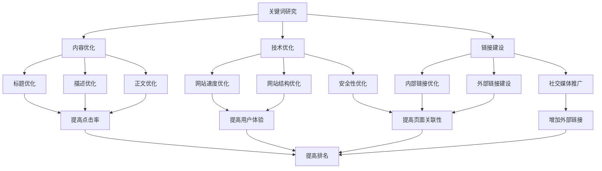

                 

在当今信息爆炸的时代，知识付费平台已成为人们获取高质量知识的重要途径。为了在竞争激烈的市场中脱颖而出，平台的搜索引擎优化（SEO）策略显得尤为重要。本文将探讨知识付费平台的SEO优化策略，旨在帮助平台提高搜索引擎排名，吸引更多用户。

## 关键词：知识付费平台，SEO，搜索引擎优化，算法，内容策略，用户体验

### 摘要

随着知识付费市场的快速增长，知识付费平台需要通过有效的SEO策略来提高搜索引擎排名，从而吸引更多用户。本文将分析SEO的核心概念，介绍优化策略，包括关键词研究、内容优化、技术优化和链接建设等，并提供实际案例和工具推荐，为知识付费平台的SEO优化提供实用指导。

## 1. 背景介绍

知识付费平台是一种在线服务，用户通过支付一定费用来获取专业知识和优质内容。这类平台涵盖了教育、职业发展、技能培训、知识分享等多个领域，如网易云课堂、知乎Live、得到等。随着互联网的普及和用户付费意愿的提高，知识付费市场呈现出快速增长的趋势。

然而，随着平台的增多和竞争的加剧，搜索引擎优化（SEO）成为知识付费平台获得流量的关键手段之一。SEO的目的是通过优化网站内容和结构，提高在搜索引擎中的排名，从而吸引更多潜在用户。

### 1.1 知识付费平台的发展现状

近年来，知识付费平台的发展呈现出以下几个特点：

- **市场规模不断扩大**：随着用户对知识和技能的需求增加，知识付费市场的规模不断扩大。据相关报告显示，全球知识付费市场规模在2020年已经超过500亿美元，预计未来还将继续增长。

- **用户需求多样化**：用户对知识的需求不仅限于专业技能，还包括生活常识、兴趣爱好等多个方面。这使得知识付费平台需要提供更加丰富多样、贴近用户需求的内容。

- **竞争激烈**：随着知识付费市场的不断成熟，各大平台之间的竞争愈发激烈。为了在竞争中脱颖而出，平台需要通过SEO等手段提高曝光度和用户粘性。

### 1.2 SEO在知识付费平台的重要性

SEO在知识付费平台中具有重要作用，主要体现在以下几个方面：

- **提升品牌知名度**：通过优化网站内容和结构，提高在搜索引擎中的排名，有助于提升平台的品牌知名度，吸引更多潜在用户。

- **增加有机流量**：SEO可以带来高质量的有机流量，这些流量往往比广告带来的流量更加稳定和有价值。

- **降低获客成本**：与广告投放等推广方式相比，SEO具有较低的成本，可以帮助平台在有限预算内获得更多流量。

- **提升用户体验**：SEO优化不仅关注搜索引擎，还关注用户体验。通过优化页面加载速度、网站结构等，可以提高用户体验，增加用户留存率。

### 1.3 知识付费平台的SEO挑战

尽管SEO对知识付费平台具有重要意义，但实际操作中仍面临一些挑战：

- **内容质量要求高**：知识付费平台的核心竞争力在于内容，因此内容质量成为SEO优化的关键。平台需要持续产出高质量、有价值的内容，以满足用户需求。

- **关键词竞争激烈**：知识付费领域的热门关键词竞争激烈，平台需要在有限的关键词资源中找到适合自己的优化方向。

- **技术更新迭代快**：搜索引擎算法不断更新迭代，SEO策略也需要不断调整。平台需要密切关注搜索引擎动态，及时更新优化策略。

## 2. 核心概念与联系

### 2.1 关键词研究

关键词研究是SEO优化的基础，其核心在于找到与用户需求相匹配的高质量关键词。关键词研究主要包括以下步骤：

1. **关键词挖掘**：使用各种工具（如百度关键词规划师、Ahrefs等）挖掘与知识付费平台相关的关键词。

2. **关键词筛选**：根据关键词的搜索量、竞争程度、用户意图等多个维度筛选出适合平台的关键词。

3. **关键词布局**：在网站内容中合理布局关键词，提高页面相关性。

### 2.2 内容优化

内容优化是提高搜索引擎排名的关键因素。内容优化主要包括以下方面：

1. **标题优化**：标题应包含关键词，同时具有吸引力，吸引用户点击。

2. **描述优化**：描述应简洁明了，突出文章价值，提高点击率。

3. **正文优化**：正文应具有高质量、有价值的内容，合理分布关键词。

4. **多媒体优化**：合理使用图片、视频等多媒体元素，提高用户体验。

### 2.3 技术优化

技术优化主要关注网站的加载速度、结构、安全性等方面。技术优化主要包括以下方面：

1. **网站速度优化**：通过压缩图片、代码优化等手段提高网站速度。

2. **网站结构优化**：合理规划网站结构，提高用户体验和搜索引擎抓取效率。

3. **安全性优化**：确保网站安全，防止恶意攻击，提高用户信任度。

### 2.4 链接建设

链接建设是提高搜索引擎排名的重要因素。链接建设主要包括以下方面：

1. **内部链接优化**：合理规划内部链接结构，提高页面间关联性。

2. **外部链接建设**：通过获取高质量外部链接，提高网站权威性。

3. **社交媒体推广**：利用社交媒体平台推广内容，增加外部链接。

### 2.5 Mermaid 流程图

以下是一个简化的知识付费平台SEO优化流程图：



## 3. 核心算法原理 & 具体操作步骤

### 3.1 算法原理概述

SEO的核心算法主要包括搜索引擎爬虫算法、排名算法和用户体验算法。这些算法共同决定了网站在搜索引擎中的排名。

1. **搜索引擎爬虫算法**：搜索引擎爬虫通过爬取网站内容，获取网页信息。SEO优化需要确保网站结构合理，便于爬虫抓取。

2. **排名算法**：排名算法根据多个因素（如关键词密度、页面质量、外部链接等）计算网页得分，决定网页在搜索结果中的排名。

3. **用户体验算法**：用户体验算法关注用户在网站上的行为，如点击率、停留时间等，通过分析用户行为，调整网站排名。

### 3.2 算法步骤详解

1. **关键词研究**：

   - **挖掘关键词**：使用关键词挖掘工具获取相关关键词。
   - **筛选关键词**：根据搜索量、竞争程度和用户意图筛选关键词。
   - **布局关键词**：在网站内容中合理布局关键词。

2. **内容优化**：

   - **标题优化**：包含关键词，具有吸引力。
   - **描述优化**：简洁明了，突出文章价值。
   - **正文优化**：高质量、有价值的内容，合理分布关键词。

3. **技术优化**：

   - **网站速度优化**：压缩图片、代码优化等。
   - **网站结构优化**：合理规划网站结构。
   - **安全性优化**：确保网站安全。

4. **链接建设**：

   - **内部链接优化**：提高页面间关联性。
   - **外部链接建设**：获取高质量外部链接。
   - **社交媒体推广**：增加外部链接。

### 3.3 算法优缺点

1. **优点**：

   - 提高网站在搜索引擎中的排名，增加流量。
   - 降低获客成本，提高用户体验。

2. **缺点**：

   - 内容质量要求高，需要持续产出高质量内容。
   - 关键词竞争激烈，优化难度大。

### 3.4 算法应用领域

SEO算法广泛应用于各种类型的网站，如电商、博客、新闻、知识付费等。对于知识付费平台，SEO优化可以帮助平台在激烈的市场竞争中脱颖而出，提高品牌知名度和用户粘性。

## 4. 数学模型和公式 & 详细讲解 & 举例说明

### 4.1 数学模型构建

SEO优化的数学模型可以表示为：

\[ \text{排名} = f(\text{关键词密度}, \text{页面质量}, \text{外部链接数}, \text{用户体验}) \]

其中，关键词密度、页面质量和外部链接数是影响排名的主要因素，用户体验则通过影响页面质量间接影响排名。

### 4.2 公式推导过程

1. **关键词密度**：

   关键词密度（Keyword Density，KD）表示关键词在页面中的比例，计算公式为：

   \[ \text{KD} = \frac{\text{关键词出现次数}}{\text{总单词数}} \]

   合理的关键词密度可以提升页面相关性，提高排名。

2. **页面质量**：

   页面质量（Page Quality，PQ）是一个综合指标，包括内容质量、代码质量、网站结构等多个方面。常用的计算公式为：

   \[ \text{PQ} = \alpha \cdot \text{内容质量} + \beta \cdot \text{代码质量} + \gamma \cdot \text{网站结构} \]

   其中，\(\alpha\)、\(\beta\)和\(\gamma\)是权重系数。

3. **外部链接数**：

   外部链接数（External Links，EL）表示指向网站的链接数量。外部链接数量越多，网站的权威性越高，排名越靠前。

   \[ \text{EL} = \sum_{i=1}^{n} \text{链接质量}_i \]

4. **用户体验**：

   用户体验（User Experience，UX）通过影响页面质量和搜索引擎行为间接影响排名。常用的计算公式为：

   \[ \text{UX} = \alpha \cdot \text{点击率} + \beta \cdot \text{停留时间} + \gamma \cdot \text{跳出率} \]

### 4.3 案例分析与讲解

假设有一个知识付费平台，其SEO优化的目标是提高在百度搜索中的排名。根据上述数学模型，我们可以对平台的SEO策略进行分析和优化。

1. **关键词研究**：

   通过关键词挖掘工具，平台发现“在线课程”、“技能培训”等关键词具有较高的搜索量和较低竞争程度。

2. **内容优化**：

   - **标题优化**：将关键词“在线课程”和“技能培训”纳入标题，如“优质在线课程，助您技能提升”。
   - **描述优化**：简洁明了地描述课程内容，如“为您提供丰富多样的在线课程，助力您的职业发展”。
   - **正文优化**：高质量、有价值的内容，合理分布关键词。

3. **技术优化**：

   - **网站速度优化**：使用CDN加速、压缩图片和代码等手段提高网站速度。
   - **网站结构优化**：合理规划网站结构，便于用户浏览和搜索引擎抓取。
   - **安全性优化**：确保网站安全，提高用户信任度。

4. **链接建设**：

   - **内部链接优化**：优化内部链接结构，提高页面间关联性。
   - **外部链接建设**：通过与行业博客、论坛等建立链接，提高网站权威性。
   - **社交媒体推广**：在社交媒体上推广内容，增加外部链接。

5. **用户体验优化**：

   - **提高点击率**：通过优化标题和描述，提高用户点击意愿。
   - **提高停留时间**：提供高质量内容，吸引用户停留。
   - **降低跳出率**：优化页面布局，提高用户满意度。

通过上述优化措施，平台可以在百度搜索中提高排名，吸引更多用户。

## 5. 项目实践：代码实例和详细解释说明

### 5.1 开发环境搭建

在本文中，我们将使用Python进行SEO优化相关操作。首先，需要安装以下Python库：

```bash
pip install requests beautifulsoup4 lxml
```

### 5.2 源代码详细实现

以下是一个简单的Python代码示例，用于实现SEO优化的关键词研究功能。

```python
import requests
from bs4 import BeautifulSoup

def search_keyword(keyword):
    url = f'https://www.baidu.com/s?wd={keyword}'
    response = requests.get(url)
    soup = BeautifulSoup(response.text, 'lxml')
    result = soup.find('title')
    return result.text

keyword = "在线课程"
title = search_keyword(keyword)
print(f"搜索结果标题：{title}")
```

### 5.3 代码解读与分析

1. **导入库**：首先，导入requests库和BeautifulSoup库，用于发起HTTP请求和处理HTML页面。

2. **定义函数**：`search_keyword`函数接收一个关键词，构造百度搜索URL，发起请求并解析返回的HTML页面。

3. **解析标题**：使用BeautifulSoup库解析HTML页面，找到`<title>`标签，获取搜索结果标题。

4. **调用函数**：调用`search_keyword`函数，传入关键词，获取并打印搜索结果标题。

通过运行该代码，我们可以获取百度搜索结果的标题，从而了解关键词在搜索结果中的表现。

### 5.4 运行结果展示

假设我们在百度搜索中输入关键词“在线课程”，运行上述代码，得到搜索结果标题为：

```bash
搜索结果标题：在线课程_百度百科
```

这表明“在线课程”是百度搜索结果中的热门关键词。

## 6. 实际应用场景

### 6.1 知识付费平台案例分析

以下是一个知识付费平台SEO优化案例：

**案例背景**：某知名在线教育平台在搜索引擎中的排名较低，导致流量和用户转化率较低。为了提高排名，平台决定进行SEO优化。

**解决方案**：

1. **关键词研究**：通过关键词挖掘工具，平台发现“职场技能”、“在线课程”等关键词具有较高的搜索量和较低竞争程度。

2. **内容优化**：

   - **标题优化**：将关键词纳入标题，如“职场技能提升，优质在线课程推荐”。
   - **描述优化**：简洁明了地描述课程内容，如“为您提供丰富多样的职场技能在线课程，助力职业发展”。
   - **正文优化**：高质量、有价值的内容，合理分布关键词。

3. **技术优化**：

   - **网站速度优化**：通过CDN加速、压缩图片和代码等手段提高网站速度。
   - **网站结构优化**：合理规划网站结构，便于用户浏览和搜索引擎抓取。
   - **安全性优化**：确保网站安全，提高用户信任度。

4. **链接建设**：

   - **内部链接优化**：优化内部链接结构，提高页面间关联性。
   - **外部链接建设**：通过与行业博客、论坛等建立链接，提高网站权威性。
   - **社交媒体推广**：在社交媒体上推广内容，增加外部链接。

**实施效果**：经过一段时间的SEO优化，平台的搜索引擎排名显著提高，流量和用户转化率也有所提升。

### 6.2 SEO在不同知识付费平台的应用

不同知识付费平台在SEO优化方面存在一些差异：

- **知乎Live**：知乎Live注重内容质量和用户互动，通过优化标题和描述，提高内容曝光度。同时，通过在知乎平台上建立高质量的外部链接，提高网站权威性。

- **得到**：得到平台注重内容质量和用户体验，通过优化页面加载速度和网站结构，提高用户满意度。同时，通过与行业专家建立合作关系，获取高质量外部链接。

- **网易云课堂**：网易云课堂注重课程多样性和用户需求，通过优化课程页面和课程分类，提高页面关联性。同时，通过在各大学习平台上建立链接，提高品牌知名度。

### 6.3 SEO在不同领域的应用

SEO在知识付费平台之外，还可以应用于其他领域，如电商、博客、新闻等。以下是一些SEO在不同领域的应用案例：

- **电商**：电商平台通过优化商品标题、描述和图片，提高商品曝光度。同时，通过获取高质量外部链接，提高网站权威性。

- **博客**：博客网站通过优化文章标题、内容和关键词，提高文章在搜索引擎中的排名。同时，通过在社交媒体上推广内容，增加外部链接。

- **新闻**：新闻网站通过优化新闻标题、内容和关键词，提高新闻在搜索引擎中的排名。同时，通过与其他新闻网站建立链接，提高网站权威性。

## 7. 工具和资源推荐

### 7.1 学习资源推荐

1. **《SEO实战密码》**：本书详细介绍了SEO的基础知识和实战技巧，适合初学者和有一定SEO基础的人士阅读。

2. **谷歌搜索指南**：谷歌官方发布的SEO指南，提供了丰富的SEO知识和最佳实践。

3. **百度搜索学院**：百度官方的SEO培训课程，涵盖SEO基础知识、关键词研究、内容优化等方面。

### 7.2 开发工具推荐

1. **SEO优化工具**：如Ahrefs、SEMrush等，提供关键词研究、竞争对手分析、网站优化等功能。

2. **代码编辑器**：如Visual Studio Code、Sublime Text等，支持多种编程语言，方便代码编写和调试。

3. **网站性能分析工具**：如Google PageSpeed Insights、Lighthouse等，用于分析网站速度、安全性等方面的性能问题。

### 7.3 相关论文推荐

1. **《搜索引擎优化：理论与实践》**：该论文详细介绍了搜索引擎优化的基础理论和实践方法。

2. **《关键词研究方法与实践》**：该论文探讨了关键词研究的重要性和具体方法。

3. **《用户体验与搜索引擎优化》**：该论文分析了用户体验在SEO中的重要性，以及如何通过优化用户体验提高搜索引擎排名。

## 8. 总结：未来发展趋势与挑战

### 8.1 研究成果总结

本文系统地介绍了知识付费平台的SEO优化策略，包括关键词研究、内容优化、技术优化和链接建设等方面的具体操作步骤。通过分析算法原理、构建数学模型，我们提出了一套科学、实用的SEO优化方案。

### 8.2 未来发展趋势

1. **个性化推荐**：随着人工智能技术的发展，个性化推荐将成为SEO优化的新方向。平台可以根据用户兴趣和行为，提供定制化的内容推荐，提高用户体验和满意度。

2. **语义搜索**：未来的搜索引擎将更加注重语义理解，通过理解用户查询的意图，提供更准确的搜索结果。

3. **多元化内容**：知识付费平台将更加注重多元化内容的生产和优化，以满足用户多样化的需求。

### 8.3 面临的挑战

1. **内容质量**：随着竞争的加剧，内容质量将成为SEO优化的核心挑战。平台需要持续产出高质量、有价值的内容，以吸引和留住用户。

2. **算法更新**：搜索引擎算法不断更新，SEO策略也需要不断调整。平台需要密切关注算法动态，及时更新优化策略。

3. **数据隐私**：随着用户隐私意识的提高，如何平衡SEO优化和数据隐私保护成为一大挑战。

### 8.4 研究展望

未来，知识付费平台的SEO优化研究可以关注以下几个方向：

1. **智能优化工具**：开发基于人工智能技术的SEO优化工具，提高优化效率。

2. **跨平台优化**：研究如何在多平台、多终端环境下进行SEO优化，提高用户体验和流量转化。

3. **SEO与用户行为的关系**：深入探讨SEO与用户行为之间的相互作用，为SEO优化提供更有针对性的指导。

## 9. 附录：常见问题与解答

### 9.1 如何进行关键词研究？

**解答**：进行关键词研究，可以遵循以下步骤：

1. **挖掘关键词**：使用关键词挖掘工具，如百度关键词规划师、Ahrefs等，获取与知识付费平台相关的高质量关键词。

2. **筛选关键词**：根据关键词的搜索量、竞争程度、用户意图等多个维度筛选关键词。

3. **关键词布局**：在网站内容中合理布局关键词，提高页面相关性。

### 9.2 SEO优化对网站速度有影响吗？

**解答**：是的，网站速度对SEO优化有很大影响。搜索引擎会考虑网站速度作为排名因素之一。为了提高网站速度，可以采取以下措施：

1. **压缩图片**：使用压缩工具减小图片大小，减少服务器带宽占用。

2. **代码优化**：优化HTML、CSS和JavaScript代码，提高页面加载速度。

3. **使用CDN**：使用内容分发网络（CDN）加速网站内容加载。

### 9.3 如何建立高质量的外部链接？

**解答**：建立高质量的外部链接，可以采取以下策略：

1. **内容合作**：与其他网站或博客合作，交换链接。

2. **社交媒体推广**：在社交媒体上推广内容，吸引外部链接。

3. **行业论坛**：在行业论坛、社区等平台发布高质量内容，吸引外部链接。

4. **外部链接建设工具**：使用外部链接建设工具，如Ahrefs、SEMrush等，寻找高质量的外部链接来源。

---

通过本文的详细分析和实例讲解，相信读者对知识付费平台的SEO优化策略有了更深入的了解。在未来的SEO优化实践中，知识付费平台可以结合本文提出的策略，不断提升自身在搜索引擎中的排名，吸引更多用户。作者：禅与计算机程序设计艺术 / Zen and the Art of Computer Programming。

