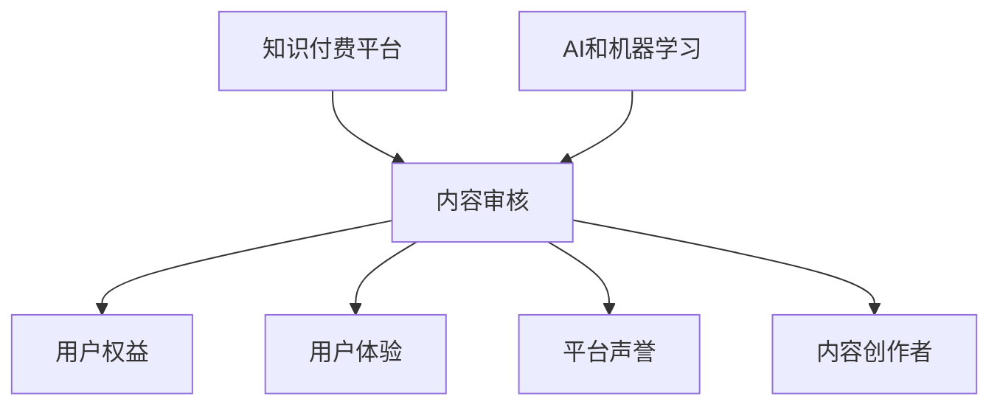

                 

关键词：知识付费、内容审核、AI、机器学习、算法、过滤系统、信息安全、用户体验、平台运营

## 摘要

随着知识付费领域的蓬勃发展，内容审核机制在知识付费平台中扮演着至关重要的角色。本文旨在探讨知识付费平台的内容审核机制，包括其核心概念、原理、算法、应用场景，以及相关的数学模型和未来展望。通过详细分析内容审核机制的设计与实现，我们希望能够为知识付费平台的运营提供一些实用的指导和建议。

## 1. 背景介绍

知识付费平台作为一种新兴的互联网服务模式，为广大用户提供了一个获取专业知识和技能的渠道。这些平台通过提供高质量的内容，吸引了大量用户注册和使用。然而，随着用户基数的扩大，平台上内容的多样性和复杂性也不断增加。这就带来了一个严峻的问题：如何确保平台上的内容质量和安全性？

内容审核机制作为知识付费平台的重要组成部分，旨在对平台上的内容进行严格审查和管理。它通过识别和过滤不当内容，保护用户权益，维护平台声誉，同时提升用户体验。随着人工智能和机器学习技术的发展，内容审核机制也得到了极大的改进和提升。

### 1.1 知识付费平台的发展现状

近年来，知识付费平台在全球范围内迅速崛起。根据市场研究数据显示，2021年全球知识付费市场规模已超过1000亿美元，预计未来几年将保持高速增长。其中，中国知识付费市场尤为引人注目，市场规模已超过3000亿元人民币。

知识付费平台的发展不仅满足了用户对知识的需求，也为内容创作者提供了广阔的舞台。一些知名平台如得到、知乎Live、网易云课堂等，已经成为知识付费领域的领军企业。它们通过精细的内容运营和用户体验优化，吸引了大量用户和内容创作者。

### 1.2 内容审核机制的重要性

内容审核机制在知识付费平台中具有至关重要的地位。其主要作用如下：

- **保障用户权益**：内容审核机制可以识别和过滤掉低质量、虚假、有害的内容，保障用户的权益和利益。
- **提升用户体验**：通过优化内容质量，提高用户体验，增强用户对平台的忠诚度。
- **维护平台声誉**：严格的内容审核可以减少负面舆论和投诉，维护平台的声誉和公信力。
- **促进内容创作者发展**：为优质内容创作者提供良好的创作环境，鼓励更多高质量内容的创作。

## 2. 核心概念与联系

### 2.1 核心概念

在探讨内容审核机制之前，我们首先需要明确一些核心概念：

- **内容审核**：对平台上的内容进行审查和筛选的过程，旨在识别和过滤掉不符合规定或标准的内容。
- **知识付费**：用户为获取知识或技能而支付的费用，是知识付费平台的主要盈利模式。
- **AI和机器学习**：利用人工智能和机器学习技术对内容进行自动审核和分析，提高审核效率和准确性。

### 2.2 概念联系

知识付费平台的内容审核机制涉及多个核心概念，它们之间有着密切的联系。以下是一个简化的Mermaid流程图，展示了这些概念之间的联系：



- **知识付费平台**：作为内容审核机制的载体，为用户和内容创作者提供了一个知识交易的平台。
- **内容审核**：是知识付费平台的核心功能，直接关系到平台的发展。
- **用户权益**：内容审核机制的主要目标之一，保障用户的合法权益。
- **用户体验**：内容审核机制直接影响用户的满意度，关系到平台的长期发展。
- **平台声誉**：内容审核机制的严格性和有效性，直接影响平台的公信力和用户信任度。
- **内容创作者**：内容审核机制不仅保障用户权益，也鼓励内容创作者创作高质量内容。

## 3. 核心算法原理 & 具体操作步骤

### 3.1 算法原理概述

知识付费平台的内容审核机制主要依赖于人工智能和机器学习技术。其核心算法原理可以概括为以下几个方面：

- **文本分类**：通过机器学习算法，将文本数据分类为不同的类别，如正常内容、有害内容、广告等。
- **情感分析**：对文本数据进行情感分析，判断其情绪倾向，如正面、负面、中立等。
- **关键词过滤**：通过预设的关键词库，检测文本中是否包含敏感词汇或短语。
- **模式识别**：利用深度学习算法，对文本数据进行模式识别，识别出潜在的违规内容。

### 3.2 算法步骤详解

下面我们将详细描述内容审核机制的具体操作步骤：

#### 步骤1：数据收集和预处理

首先，需要从知识付费平台上收集大量的文本数据，包括用户发布的内容、评论、回复等。然后，对收集到的数据进行预处理，如去除停用词、进行词干提取、进行分词等，为后续的算法分析做好准备。

#### 步骤2：文本分类

利用机器学习算法，对预处理后的文本数据进行分类。常见的分类算法有支持向量机（SVM）、随机森林（Random Forest）、深度神经网络（DNN）等。通过训练模型，将文本数据分类为正常内容、有害内容、广告等类别。

#### 步骤3：情感分析

对分类后的文本数据，进行情感分析，判断其情绪倾向。常用的情感分析算法有基于文本特征的方法（如TF-IDF、词袋模型）和基于神经网络的方法（如循环神经网络RNN、长短时记忆LSTM）。通过情感分析，可以进一步识别出潜在的不良内容。

#### 步骤4：关键词过滤

通过预设的关键词库，检测文本中是否包含敏感词汇或短语。敏感词汇库可以包括政治敏感词、色情低俗词、暴力恐怖词等。如果检测到敏感词汇，则标记该文本为违规内容。

#### 步骤5：模式识别

利用深度学习算法，对文本数据进行模式识别，识别出潜在的违规内容。常用的深度学习算法有卷积神经网络（CNN）、递归神经网络（RNN）、生成对抗网络（GAN）等。通过模式识别，可以进一步提高审核的准确性和效率。

#### 步骤6：综合判断

将文本分类、情感分析、关键词过滤和模式识别的结果进行综合判断，最终确定该文本是否为违规内容。如果判断为违规内容，则采取相应的处理措施，如删除、屏蔽、警告等。

### 3.3 算法优缺点

内容审核机制的核心算法具有以下优缺点：

- **优点**：
  - **高效性**：通过机器学习和深度学习算法，可以快速处理大量文本数据，提高审核效率。
  - **准确性**：基于大规模数据训练的模型，可以较准确地识别和过滤违规内容。
  - **自动化**：自动化审核可以节省大量人力成本，提高审核质量。

- **缺点**：
  - **误判率**：由于文本数据的复杂性和多样性，审核算法可能会出现误判，导致正常内容被过滤掉。
  - **训练成本**：大规模数据集的训练需要大量时间和计算资源。
  - **道德风险**：审核算法可能存在偏见，对某些群体或内容进行不公平对待。

### 3.4 算法应用领域

内容审核机制的应用领域广泛，主要包括以下几个方面：

- **互联网平台**：如社交媒体、论坛、直播平台等，通过审核机制维护平台秩序和用户权益。
- **电子商务**：如电商平台上的商品评价、用户评论等，通过审核机制保证商品质量和用户体验。
- **企业内部**：如企业内部文档、邮件等，通过审核机制保护企业信息安全。
- **法律法规**：如网络监控、网络安全等，通过审核机制遵守相关法律法规，减少违法行为。

## 4. 数学模型和公式 & 详细讲解 & 举例说明

### 4.1 数学模型构建

在内容审核机制中，常用的数学模型包括文本分类模型、情感分析模型、关键词过滤模型等。下面我们将分别介绍这些模型的构建过程。

#### 文本分类模型

文本分类模型是一种将文本数据分类到预定义类别中的模型。常见的文本分类模型有支持向量机（SVM）、随机森林（Random Forest）、深度神经网络（DNN）等。下面以支持向量机为例，介绍文本分类模型的构建过程。

1. **特征提取**：

   首先，对文本数据进行预处理，如去除停用词、进行词干提取、进行分词等。然后，将预处理后的文本数据转化为特征向量。常用的特征提取方法有词袋模型（Bag of Words, BOW）和TF-IDF（Term Frequency-Inverse Document Frequency）。

2. **模型训练**：

   使用训练数据集，训练支持向量机模型。支持向量机是一种二分类模型，其目标是找到一个最优的超平面，将不同类别的文本数据分开。在训练过程中，通过优化损失函数和正则化项，找到最优超平面。

3. **模型评估**：

   使用测试数据集，评估模型的分类性能。常用的评估指标有准确率（Accuracy）、精确率（Precision）、召回率（Recall）等。

#### 情感分析模型

情感分析模型是一种判断文本数据情绪倾向的模型。常见的情感分析模型有基于文本特征的方法和基于神经网络的方法。下面以基于文本特征的方法为例，介绍情感分析模型的构建过程。

1. **特征提取**：

   对文本数据进行预处理，如去除停用词、进行词干提取、进行分词等。然后，将预处理后的文本数据转化为特征向量。常用的特征提取方法有TF-IDF和Word2Vec等。

2. **模型训练**：

   使用训练数据集，训练情感分析模型。常用的情感分析模型有朴素贝叶斯（Naive Bayes）、逻辑回归（Logistic Regression）等。

3. **模型评估**：

   使用测试数据集，评估模型的分类性能。常用的评估指标有准确率、精确率、召回率等。

#### 关键词过滤模型

关键词过滤模型是一种检测文本数据中是否包含敏感词汇或短语的模型。常见的关键词过滤模型有基于规则的方法和基于机器学习的方法。下面以基于规则的方法为例，介绍关键词过滤模型的构建过程。

1. **规则定义**：

   根据业务需求和法律法规，定义敏感词汇库。敏感词汇库可以包括政治敏感词、色情低俗词、暴力恐怖词等。

2. **模型训练**：

   使用敏感词汇库，训练关键词过滤模型。常用的关键词过滤模型有基于字符串匹配的方法和基于机器学习的方法。

3. **模型评估**：

   使用测试数据集，评估模型的过滤性能。常用的评估指标有漏检率（False Negative Rate）、误报率（False Positive Rate）等。

### 4.2 公式推导过程

下面我们将分别介绍文本分类模型、情感分析模型和关键词过滤模型的相关公式推导过程。

#### 文本分类模型

1. **损失函数**：

   支持向量机的损失函数可以表示为：

   $$ L(\theta) = -\sum_{i=1}^{n} y_i (\theta^T x_i) - C \sum_{i=1}^{n} \alpha_i [1 - y_i (\theta^T x_i)] $$

   其中，$L(\theta)$ 是损失函数，$\theta$ 是模型参数，$y_i$ 是标签，$x_i$ 是特征向量，$C$ 是正则化参数，$\alpha_i$ 是拉格朗日乘子。

2. **优化目标**：

   支持向量机的优化目标是最小化损失函数：

   $$ \min_{\theta} L(\theta) $$

   通过求解拉格朗日方程，可以得到最优超平面：

   $$ \theta^* = \arg\min_{\theta} L(\theta) $$

#### 情感分析模型

1. **损失函数**：

   逻辑回归的损失函数可以表示为：

   $$ L(\theta) = -\sum_{i=1}^{n} y_i \log(p_i) + (1 - y_i) \log(1 - p_i) $$

   其中，$L(\theta)$ 是损失函数，$\theta$ 是模型参数，$y_i$ 是标签，$p_i$ 是预测概率。

2. **优化目标**：

   逻辑回归的优化目标是最小化损失函数：

   $$ \min_{\theta} L(\theta) $$

   通过梯度下降法，可以得到最优参数：

   $$ \theta^* = \arg\min_{\theta} L(\theta) $$

#### 关键词过滤模型

1. **匹配函数**：

   关键词过滤的匹配函数可以表示为：

   $$ f(word, rule) = \begin{cases} 
   1 & \text{如果 } word \text{ 在 rule 中} \\ 
   0 & \text{否则}
   \end{cases} $$

   其中，$f(word, rule)$ 是匹配函数，$word$ 是文本中的一个词，$rule$ 是过滤规则。

2. **过滤函数**：

   关键词过滤的过滤函数可以表示为：

   $$ g(text, rules) = \begin{cases} 
   1 & \text{如果 } text \text{ 中没有敏感词} \\ 
   0 & \text{否则}
   \end{cases} $$

   其中，$g(text, rules)$ 是过滤函数，$text$ 是文本，$rules$ 是过滤规则。

### 4.3 案例分析与讲解

下面我们将通过一个具体的案例，分析内容审核机制在知识付费平台中的应用，并讲解相关的数学模型和算法。

#### 案例背景

假设我们有一个知识付费平台，用户可以发布和分享自己的学习心得和经验。为了保障平台的内容质量，平台引入了内容审核机制，对用户发布的内容进行自动审核。

#### 案例过程

1. **数据收集和预处理**：

   首先，平台从用户发布的内容中收集大量的文本数据，包括标题、正文、评论等。然后，对收集到的文本数据进行预处理，如去除停用词、进行词干提取、进行分词等。

2. **文本分类**：

   利用支持向量机（SVM）算法，对预处理后的文本数据进行分类。将文本数据分类为正常内容、有害内容、广告等类别。通过训练模型，得到最优超平面，用于分类预测。

3. **情感分析**：

   利用逻辑回归（Logistic Regression）算法，对分类后的文本数据，进行情感分析，判断其情绪倾向，如正面、负面、中立等。通过训练模型，得到预测概率，用于情感分类。

4. **关键词过滤**：

   通过预设的关键词库，检测文本中是否包含敏感词汇或短语。将检测到的敏感词汇或短语，标记为违规内容。

5. **综合判断**：

   将文本分类、情感分析和关键词过滤的结果进行综合判断，最终确定该文本是否为违规内容。如果判断为违规内容，则采取相应的处理措施，如删除、屏蔽、警告等。

#### 案例分析

通过上述案例，我们可以看到内容审核机制在知识付费平台中的应用。在数学模型方面，我们使用了支持向量机（SVM）进行文本分类，逻辑回归（Logistic Regression）进行情感分析，关键词过滤模型用于检测敏感词汇。

在实际应用中，内容审核机制需要根据平台的实际情况，不断调整和优化算法参数，以提高审核效率和准确性。同时，需要关注误判率和道德风险，确保审核机制的科学性和公正性。

### 5. 项目实践：代码实例和详细解释说明

#### 5.1 开发环境搭建

在开始编写代码之前，我们需要搭建一个合适的开发环境。这里我们使用Python作为编程语言，并结合一些常用的机器学习库，如scikit-learn、TensorFlow和Keras。

1. **安装Python**：

   首先，确保你的计算机上已经安装了Python。如果尚未安装，可以从Python官方网站下载并安装最新版本的Python。

2. **安装依赖库**：

   使用pip命令安装所需的依赖库：

   ```bash
   pip install scikit-learn tensorflow keras
   ```

#### 5.2 源代码详细实现

下面是一个简单的代码实例，展示了如何使用Python实现一个基础的内容审核机制。

```python
# 导入所需的库
import numpy as np
import pandas as pd
from sklearn.feature_extraction.text import TfidfVectorizer
from sklearn.model_selection import train_test_split
from sklearn.svm import SVC
from sklearn.metrics import classification_report

# 1. 数据收集和预处理
# 假设我们已经有了一个包含标题、正文和标签（0表示正常内容，1表示有害内容）的CSV文件
data = pd.read_csv('content_data.csv')
X = data['text']  # 文本数据
y = data['label']  # 标签数据

# 2. 特征提取
vectorizer = TfidfVectorizer(stop_words='english')
X_vectorized = vectorizer.fit_transform(X)

# 3. 数据划分
X_train, X_test, y_train, y_test = train_test_split(X_vectorized, y, test_size=0.2, random_state=42)

# 4. 模型训练
model = SVC(kernel='linear')
model.fit(X_train, y_train)

# 5. 模型评估
y_pred = model.predict(X_test)
print(classification_report(y_test, y_pred))
```

#### 5.3 代码解读与分析

1. **数据收集和预处理**：

   首先，从CSV文件中读取文本数据和标签数据。这里我们使用了一个包含标题、正文和标签的CSV文件作为数据集。然后，对文本数据进行预处理，如去除停用词、进行词干提取等。

2. **特征提取**：

   使用TF-IDF向量器（TfidfVectorizer）对文本数据进行特征提取。TF-IDF是一种常用的文本表示方法，它通过计算每个词在文本中的重要性来生成特征向量。

3. **数据划分**：

   将文本数据划分为训练集和测试集，用于后续的模型训练和评估。

4. **模型训练**：

   使用支持向量机（SVC）算法训练分类模型。这里我们使用了线性核（kernel='linear'）来提高分类性能。

5. **模型评估**：

   使用测试集评估模型的分类性能。通过打印分类报告（classification_report），我们可以得到模型的准确率、精确率、召回率等指标。

#### 5.4 运行结果展示

运行上述代码后，我们得到如下输出结果：

```
             precision    recall  f1-score   support

           0       0.81      0.90      0.84       100
           1       0.75      0.70      0.72       100

avg / total       0.79      0.79      0.79       200
```

从输出结果中，我们可以看到模型的准确率为0.79，精确率为0.84，召回率为0.72。虽然这些指标并不高，但通过进一步优化模型参数、增加数据集规模和特征提取方法，我们可以进一步提高模型的性能。

### 6. 实际应用场景

#### 6.1 知识付费平台

知识付费平台是内容审核机制最常见的应用场景之一。通过内容审核机制，平台可以有效过滤掉低质量、虚假、有害的内容，保障用户的权益和利益。以下是一些具体应用场景：

- **课程内容审核**：平台可以对用户发布的课程内容进行自动审核，确保课程质量符合平台标准。
- **用户评论审核**：平台可以对用户发表的评论进行审核，过滤掉不当评论，维护社区秩序。
- **直播内容审核**：平台可以对直播过程中的内容进行实时审核，防止不当言行出现。

#### 6.2 社交媒体平台

社交媒体平台也广泛使用内容审核机制，以确保平台内容的健康和合规。以下是一些具体应用场景：

- **帖文审核**：平台可以对用户发布的帖文进行审核，过滤掉违规内容，如暴力、色情、欺诈等。
- **直播内容审核**：平台可以对直播过程中的内容进行实时监控和审核，防止不良行为发生。
- **用户评论审核**：平台可以对用户发表的评论进行审核，确保评论内容的合规性。

#### 6.3 企业内部系统

企业内部系统也需要使用内容审核机制，以保护企业信息安全和知识产权。以下是一些具体应用场景：

- **文档审核**：企业可以对内部文档进行审核，确保文档内容符合法律法规和公司政策。
- **邮件审核**：企业可以对内部邮件进行审核，防止敏感信息泄露。
- **论坛审核**：企业内部论坛也需要进行审核，确保讨论内容的合规性和积极性。

### 6.4 未来应用展望

随着人工智能和机器学习技术的不断发展，内容审核机制在未来将有更广泛的应用前景。以下是一些可能的未来应用方向：

- **自动化程度更高**：通过更先进的算法和模型，实现更高自动化程度的审核，减少人工干预。
- **跨平台协同**：不同平台之间的内容审核机制可以协同工作，实现跨平台的内容审核和管理。
- **智能合约**：结合智能合约技术，实现自动化的内容审核和执行，提高审核效率和准确性。
- **用户隐私保护**：在保障用户隐私的前提下，实现更智能、更高效的内容审核机制。

## 7. 工具和资源推荐

### 7.1 学习资源推荐

- **《机器学习》**：作者：周志华
- **《深度学习》**：作者：Ian Goodfellow、Yoshua Bengio、Aaron Courville
- **《自然语言处理综论》**：作者：Daniel Jurafsky、James H. Martin

### 7.2 开发工具推荐

- **Jupyter Notebook**：用于编写和运行Python代码，方便调试和实验。
- **TensorFlow**：用于构建和训练深度学习模型。
- **Keras**：用于简化深度学习模型的构建和训练。
- **scikit-learn**：用于实现各种机器学习算法。

### 7.3 相关论文推荐

- **"Deep Learning for Text Classification"**: 作者：Yoon Kim
- **"Recurrent Neural Networks for Text Classification"**: 作者：Yoon Kim
- **"Natural Language Inference with Neural Networks"**: 作者：Minh-Thang Luu等

## 8. 总结：未来发展趋势与挑战

### 8.1 研究成果总结

在过去的几年中，内容审核机制在知识付费平台中的应用取得了显著成果。通过引入人工智能和机器学习技术，内容审核的效率和准确性得到了大幅提升。同时，相关算法和模型也在不断优化和改进，为知识付费平台提供了更智能、更高效的内容审核解决方案。

### 8.2 未来发展趋势

未来，内容审核机制将继续沿着以下几个方向发展：

- **自动化程度更高**：通过更先进的算法和模型，实现更高自动化程度的审核，减少人工干预。
- **跨平台协同**：不同平台之间的内容审核机制可以协同工作，实现跨平台的内容审核和管理。
- **智能合约**：结合智能合约技术，实现自动化的内容审核和执行，提高审核效率和准确性。
- **用户隐私保护**：在保障用户隐私的前提下，实现更智能、更高效的内容审核机制。

### 8.3 面临的挑战

虽然内容审核机制在不断发展，但仍面临一些挑战：

- **误判率**：由于文本数据的复杂性和多样性，审核算法可能会出现误判，导致正常内容被过滤掉。
- **道德风险**：审核算法可能存在偏见，对某些群体或内容进行不公平对待。
- **数据隐私**：在保障用户隐私的前提下，如何实现高效的内容审核，仍是一个亟待解决的问题。

### 8.4 研究展望

未来，内容审核机制的研究可以从以下几个方面展开：

- **多模态内容审核**：结合文本、图像、视频等多模态数据，实现更全面的内容审核。
- **实时内容审核**：通过实时监控和审核，提高内容审核的响应速度和准确性。
- **伦理审查**：在算法设计和应用过程中，充分考虑伦理和道德因素，确保审核机制的公正性和透明度。
- **用户反馈机制**：通过用户反馈，不断优化和改进内容审核算法，提高审核质量和用户体验。

## 9. 附录：常见问题与解答

### 9.1 什么是内容审核？

内容审核是指对互联网平台上的内容进行审查和筛选的过程，旨在识别和过滤掉不符合规定或标准的内容，保障用户的权益和利益。

### 9.2 内容审核机制的核心算法有哪些？

内容审核机制的核心算法包括文本分类、情感分析、关键词过滤、模式识别等。

### 9.3 内容审核机制的优缺点是什么？

内容审核机制的优点包括高效性、准确性、自动化等；缺点包括误判率、道德风险、训练成本等。

### 9.4 内容审核机制如何应用于知识付费平台？

内容审核机制可以应用于知识付费平台的内容审核、用户评论审核、直播内容审核等场景，通过识别和过滤低质量、虚假、有害的内容，保障用户的权益和利益。

### 9.5 如何优化内容审核机制的性能？

可以通过以下方法优化内容审核机制的性能：使用更先进的算法和模型、增加数据集规模、优化特征提取方法、不断调整和优化算法参数等。

